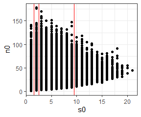
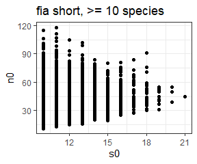
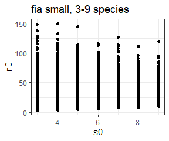

Filtering datasets
================
Renata Diaz
2020-12-17

We filter datasets in two stages. First, **prior to trying to sample
from the feasible set**, we remove communities that have a combined S
and N too high for us to sample the feasible set. We also create a
sub-sample of the FIA dataset, because it has so many communities
(\~100,000) and so many of them are extremely small (\~90,000 with fewer
than 10 species). Sampling all 100,000 communities overwhelms our
computational pipeline, so we create a subsample of 20,000 communities
comprising all communities with more than 10 species (approx. 10,000)
and 10,000 randomly selected communities with 3-10 species. Second,
**after sampling but before we aggregate results across communities**,
we remove communities that are problematic for a number of more nuanced
reasons. This includes having only 1 possible SAD (S = 1, N = S, or N =
S + 1). We also filter to communities whose sampled feasible sets yield
more than 20 unique values for skewness/evenness. We do this because, if
there are fewer than 20 unique values in the comparison vector, it’s
impossible to be in the 5th or 95th percentile. Finally, we remove
communities with only 2 species from analyses for skewness, because
`e1071::skewness()` always = 0 if S = 2.

## Pre-sampling

The only filtering at this stage is removing large communities and
subsampling the FIA database. Communities with very large numbers of
individuals become computationally intractable. We set the upper limit
at 40720, because this is the largest community we were able to sample
given the available resources. This upper limit results in the removal
of a total of 4 communities, all of them from the Miscellaneous
Abundance Database.

The `download_data` function downloads raw data files from
<https://github.com/weecology/sad-comparison/> (for BBS, Gentry, Mammal
Community Database, and FIA) and figshare
<http://figshare.com/files/3097079> (for the Miscellaneous Abundance
Database). These raw files are stored in `working-data\abund_data` and
are not edited.

To filter, we can re-load the raw data files and go through the
filtering process step by step. In the analysis this is accomplished by
running dataset-specific filtering scripts and saving new .csvs, which
are then loaded using `load_dataset`. We can manually load the datasets
and then compare them to what is returned from `load_dataset`.

### Miscellaneous Abundance Database

  - Misc. Abund includes datasets reported as relative abundance in
    addition to count data. We don’t want any communities without
    counts, so we filter out records where abund = 0.

<!-- end list -->

``` r
misc_abund_raw <- read.csv(here::here("working-data", "abund_data", "misc_abund_spab.csv"))

misc_abund_raw <- misc_abund_raw %>%
  dplyr::rename(site = Site_ID,
                abund = Abundance)

misc_abund_raw <- misc_abund_raw %>%
  mutate(site = as.character(site),
         dat = "misc_abund",
         singletons = F,
         sim = -99,
         source = "observed") %>%
  filter(abund > 0) %>%
  group_by(site) %>%
  arrange(abund) %>%
  mutate(rank = row_number()) %>%
  ungroup()

misc_abund_loaded <- load_dataset("misc_abund")
```

``` r
any(!(misc_abund_loaded$abund == misc_abund_raw$abund))
```

    ## [1] FALSE

``` r
any(!(misc_abund_loaded$site == misc_abund_raw$site))
```

    ## [1] FALSE

Check community sizes:

``` r
misc_abund_statevars <- get_statevars(misc_abund_raw)

ggplot(misc_abund_statevars, aes(s0, n0)) +
  geom_point() +
  theme_bw() +
  geom_hline(yintercept = 40720, color = "red")
```

<!-- -->

Misc abund has 4 communities that get removed. They are all removed
because they have high numbers of individuals.

The filtered database is saved as a .csv and can be loaded with
`load_dataset`. We can check that it matches the filtering we have done
here:

``` r
misc_abund_sv_filtered <- misc_abund_statevars %>%
  filter(n0 <= 40720)

misc_abund_filtered <- filter(misc_abund_raw, site %in% misc_abund_sv_filtered$site)

misc_abund_short_loaded <- load_dataset("misc_abund_short")

any(!(misc_abund_short_loaded$abund == misc_abund_filtered$abund))
```

    ## [1] FALSE

``` r
any(!(misc_abund_short_loaded$site == misc_abund_filtered$site))
```

    ## [1] FALSE

### FIA

  - Load raw FIA data
  - Add columns to match what we will get from `load_dataset`
  - Load from `load_dataset`

<!-- end list -->

``` r
fia_raw <- read.csv(here::here("working-data", "abund_data", "fia_spab.csv"), stringsAsFactors = F, header = F, skip = 2)

colnames(fia_raw) <- c("site", "year", "species", "abund")

fia_raw <- fia_raw %>%
  mutate(site = as.character(site),
         dat = "fia",
         singletons = F,
         sim = -99,
         source = "observed") %>%
  filter(abund > 0) %>%
  group_by(site) %>%
  arrange(abund) %>%
  mutate(rank = row_number()) %>%
  ungroup()

fia_loaded <- load_dataset("fia")
```

``` r
any(!(fia_loaded$abund == fia_raw$abund))
```

    ## [1] FALSE

``` r
any(!(fia_loaded$site == fia_raw$site))
```

    ## [1] FALSE

Check community sizes:

``` r
fia_statevars <- get_statevars(fia_raw)

ggplot(fia_statevars, aes(s0, n0)) +
  geom_point() +
  theme_bw() +
  geom_vline(xintercept = c(1.5, 2.5, 9.5), color = "red")
```

<!-- -->

FIA has no extremely large datasets; the largest number of individuals
is 178. However, it has 103343 communities, of which 92988 have fewer
than 10 species. This many communities overwhelms our computational
pipeline. We therefore sample all 10355 communities with 10 or more
species, and a random subsample of 10,000 communities with 3-9 species.
We then run these through the pipeline as two separate databases.
`fia_short` is the communities with 10 or more species, and `fia_small`
is the 10,000 communities with 3-9 species. We re-combine them as “FIA”
for aggregate analyses.

``` r
fia_sv_short <- fia_statevars %>%
    dplyr::filter(s0 >= 10)

fia_short <- fia_raw %>%
  dplyr::filter(site %in% fia_sv_short$site) %>%
  dplyr::mutate(dat = "fia_short")

fia_short_statevars <- get_statevars(fia_short)

ggplot(fia_short_statevars, aes(s0, n0)) +
  geom_point() +
  ggtitle("fia short, >= 10 species") +
  theme_bw()
```

<!-- -->

``` r
fia_sv_small <- fia_statevars %>%
  dplyr::filter(s0 >= 3) %>%
  dplyr::filter(s0 <= 9)

  set.seed(1977)
  fia_sv_small <- fia_sv_small[ sample.int(nrow(fia_sv_small), size = 10000, replace = F), ]


fia_small <- fia_raw %>%
  dplyr::filter(site %in% fia_sv_small$site) %>%
  dplyr::mutate(dat = "fia_small")

fia_small_statevars <- get_statevars(fia_small)

ggplot(fia_small_statevars, aes(s0, n0)) +
  geom_point() +
  ggtitle("fia small, 3-9 species")
```

<!-- -->

The “short” and “small” datasets are saved as .csvs and can be loaded
using `load_dataset`:

``` r
fia_small_loaded <- load_dataset("fia_small")

any(!(fia_small_loaded$abund == fia_small$abund))
```

    ## [1] FALSE

``` r
any(!(fia_small_loaded$site == fia_small$site))
```

    ## [1] FALSE

``` r
fia_short_loaded <- load_dataset("fia_short")

any(!(fia_short_loaded$abund == fia_short$abund))
```

    ## [1] FALSE

``` r
any(!(fia_short_loaded$site == fia_short$site))
```

    ## [1] FALSE

### BBS

  - Load raw BBS data
  - Add columns to match what we will get from `load_dataset`
  - Load from `load_dataset`

<!-- end list -->

``` r
bbs_raw <- read.csv(here::here("working-data", "abund_data", "bbs_spab.csv"),  stringsAsFactors = F, header = F, skip = 2)

colnames(bbs_raw) <- c("site", "year", "species", "abund")

bbs_raw <- bbs_raw %>%
  mutate(site = as.character(site),
         dat = "bbs",
         singletons = F,
         sim = -99,
         source = "observed") %>%
  group_by(site) %>%
  arrange(abund) %>%
  mutate(rank = row_number()) %>%
  ungroup()

bbs_loaded <- load_dataset("bbs")
```

Compare loaded to raw:

``` r
any(!(bbs_loaded$abund == bbs_raw$abund))
```

    ## [1] FALSE

``` r
any(!(bbs_loaded$site == bbs_raw$site))
```

    ## [1] FALSE

Check community sizes:

``` r
bbs_statevars <- get_statevars(bbs_raw)

ggplot(bbs_statevars, aes(s0, n0)) +
  geom_point() +
  theme_bw() +
  geom_hline(yintercept = 40720, color = "red")
```

<!-- -->

No communities in BBS have more than 40720 individuals, so all are used
at this stage.

### Gentry

  - Load raw Gentry data
  - Add columns to match what we will get from `load_dataset`
  - Load from `load_dataset`

<!-- end list -->

``` r
gentry_raw <- read.csv(here::here("working-data", "abund_data", "gentry_spab.csv"),  stringsAsFactors = F, header = F, skip = 2)

colnames(gentry_raw) <- c("site", "year", "species", "abund")

gentry_raw <- gentry_raw %>%
  mutate(site = as.character(site),
         dat = "gentry",
         singletons = F,
         sim = -99,
         source = "observed") %>%
  group_by(site) %>%
  arrange(abund) %>%
  mutate(rank = row_number()) %>%
  ungroup()

gentry_loaded <- load_dataset("gentry")
```

Compare loaded to raw:

``` r
any(!(gentry_loaded$abund == gentry_raw$abund))
```

    ## [1] FALSE

``` r
any(!(gentry_loaded$site == gentry_raw$site))
```

    ## [1] FALSE

Check community sizes:

``` r
gentry_statevars <- get_statevars(gentry_raw)

ggplot(gentry_statevars, aes(s0, n0)) +
  geom_point() +
  theme_bw() +
  geom_hline(yintercept = 40720, color = "red")
```

<!-- -->

No communities in Gentry have more than 40720 individuals, so all are
used at this stage.

### Mammal Community Database

  - Load raw MCDB data
  - Add columns to match what we will get from `load_dataset`
  - Load from `load_dataset`

<!-- end list -->

``` r
mcdb_raw <- read.csv(here::here("working-data", "abund_data", "mcdb_spab.csv"),  stringsAsFactors = F, header = F, skip = 2)

colnames(mcdb_raw) <- c("site", "year", "species", "abund")

mcdb_raw <- mcdb_raw %>%
  mutate(site = as.character(site),
         dat = "mcdb",
         singletons = F,
         sim = -99,
         source = "observed") %>%
  group_by(site) %>%
  arrange(abund) %>%
  mutate(rank = row_number()) %>%
  ungroup()

mcdb_loaded <- load_dataset("mcdb")
```

Compare loaded to raw:

``` r
any(!(mcdb_loaded$abund == mcdb_raw$abund))
```

    ## [1] FALSE

``` r
any(!(mcdb_loaded$site == mcdb_raw$site))
```

    ## [1] FALSE

Check community sizes:

``` r
mcdb_statevars <- get_statevars(mcdb_raw)

ggplot(mcdb_statevars, aes(s0, n0)) +
  geom_point() +
  theme_bw() +
  geom_hline(yintercept = 40720, color = "red")
```

<!-- -->

No high N communities; so all are included at this stage.

## Post-sampling

We will remove additional communities for more substantive reasons.
First we can load `all_di` (“all diversity indices”), which is the
combined results across all the communities in all the datasets. Every
community that was included for sampling is included in all\_di.
(Additionally, every community has a “singletons” counterpart, which is
the same analysis run adjusted for rarefaction. That analysis is
discussed elsewhere, and we ignore the rarefaction-adjusted versions
here).

``` r
all_statevars <- bind_rows(bbs_statevars, fia_short_statevars, fia_small_statevars, gentry_statevars, mcdb_statevars, misc_abund_sv_filtered)


all_di <- read.csv(here::here("analysis", "reports", "all_di.csv"), stringsAsFactors = F)

all_di <- all_di %>%
  filter(!singletons) %>%
  mutate(dat = ifelse(grepl(dat, pattern = "fia"), "fia", dat),
         dat = ifelse(dat == "misc_abund_short", "misc_abund", dat)) %>%
  mutate(Dataset = dat,
    Dataset = ifelse(Dataset == "fia", "Forest Inventory and Analysis", Dataset),
        Dataset = ifelse(Dataset == "bbs", "Breeding Bird Survey", Dataset),
        Dataset = ifelse(Dataset == "mcdb", "Mammal Community DB", Dataset),
        Dataset = ifelse(Dataset == "gentry", "Gentry", Dataset),
        Dataset = ifelse(Dataset == "misc_abund", "Miscellaneous Abundance DB", Dataset))

head(all_di)
```

<div class="kable-table">

|  sim | source   | dat | site | singletons | s0 |  n0 |       nparts |     skew |  shannon |   simpson | skew\_percentile | shannon\_percentile | simpson\_percentile | skew\_percentile\_excl | simpson\_percentile\_excl | skew\_range | simpson\_range | nsamples | skew\_unique | simpson\_unique | skew\_2p5 | skew\_97p5 | skew\_95 |   skew\_min | simpson\_max | simpson\_2p5 | simpson\_5 | simpson\_97p5 | skew\_95\_ratio\_2t | simpson\_95\_ratio\_2t | skew\_95\_ratio\_1t | simpson\_95\_ratio\_1t | Dataset              |
| ---: | :------- | :-- | ---: | :--------- | -: | --: | -----------: | -------: | -------: | --------: | ---------------: | ------------------: | ------------------: | ---------------------: | ------------------------: | ----------: | -------------: | -------: | -----------: | --------------: | --------: | ---------: | -------: | ----------: | -----------: | -----------: | ---------: | ------------: | ------------------: | ---------------------: | ------------------: | ---------------------: | :------------------- |
| \-99 | observed | bbs | 4002 | FALSE      | 35 | 816 | 4.070604e+24 | 1.973575 | 2.655380 | 0.9016995 |            69.60 |               0.050 |               1.375 |                  69.60 |                     1.375 |    5.013388 |      0.1071673 |     4000 |         4000 |            3445 | 0.7046398 |   3.358540 | 2.998938 |   0.0548560 |    0.9631061 |    0.9064803 |  0.9144545 |     0.9551500 |           0.5293626 |              0.4541467 |           0.5872441 |              0.4539785 | Breeding Bird Survey |
| \-99 | observed | bbs | 4003 | FALSE      | 26 | 439 | 1.765612e+17 | 1.502247 | 2.609893 | 0.9009605 |            50.75 |               8.800 |              15.225 |                  50.75 |                    15.225 |    4.406489 |      0.1807068 |     4000 |         4000 |            2860 | 0.5050514 |   3.157090 | 2.846737 | \-0.1970758 |    0.9517697 |    0.8671956 |  0.8799140 |     0.9437090 |           0.6018485 |              0.4234121 |           0.6907570 |              0.3976368 | Breeding Bird Survey |
| \-99 | observed | bbs | 4004 | FALSE      | 27 | 445 | 3.100591e+17 | 1.802663 | 2.748364 | 0.9138139 |            64.45 |              23.775 |              28.450 |                  64.45 |                    28.450 |    4.384616 |      0.3824770 |     4000 |         4000 |            2883 | 0.5441635 |   3.182605 | 2.879527 |   0.0268103 |    0.9522030 |    0.8740614 |  0.8860598 |     0.9451334 |           0.6017496 |              0.1858206 |           0.6506195 |              0.1729337 | Breeding Bird Survey |
| \-99 | observed | bbs | 4006 | FALSE      | 29 | 471 | 1.689307e+18 | 2.728160 | 2.432256 | 0.8597058 |            92.65 |               0.425 |               0.800 |                  92.65 |                     0.800 |    4.369746 |      0.1462940 |     4000 |         4000 |            2948 | 0.5689934 |   3.270669 | 2.928296 | \-0.1614555 |    0.9562164 |    0.8815458 |  0.8929864 |     0.9484996 |           0.6182684 |              0.4576662 |           0.7070780 |              0.4322117 | Breeding Bird Survey |
| \-99 | observed | bbs | 4007 | FALSE      | 24 | 575 | 1.424232e+19 | 1.216833 | 2.491605 | 0.8915962 |            36.80 |               4.550 |              11.475 |                  36.80 |                    11.450 |    4.293175 |      0.1741853 |     4000 |         4000 |            3283 | 0.4274895 |   2.971294 | 2.710518 | \-0.2180949 |    0.9501822 |    0.8638114 |  0.8769887 |     0.9396030 |           0.5925231 |              0.4351207 |           0.6821556 |              0.4202049 | Breeding Bird Survey |
| \-99 | observed | bbs | 4009 | FALSE      | 21 | 534 | 6.506488e+17 | 1.848653 | 2.420594 | 0.8785787 |            79.55 |               8.050 |              11.325 |                  79.55 |                    11.300 |    3.932031 |      0.1747465 |     4000 |         4000 |            3267 | 0.3496395 |   2.780707 | 2.531623 | \-0.3879136 |    0.9418353 |    0.8506425 |  0.8631493 |     0.9325567 |           0.6182726 |              0.4687608 |           0.7425008 |              0.4502870 | Breeding Bird Survey |

</div>

``` r
nrow(all_di) == nrow(all_statevars)
```

    ## [1] TRUE

We remove communities with only one possible SAD (N = S, N = S + 1, or S
= 1).

``` r
all_di %>%
  group_by_all() %>%
  mutate(only_one_sad = sum(s0 == n0, s0 == 1, n0 == (s0 + 1)) > 0) %>%
  ungroup() %>%
  group_by(dat) %>%
  summarize(total_only_one_sad = sum(only_one_sad),
            total_sites = dplyr::n()) %>%
  ungroup() %>%
  mutate(all_sites_one_sad = sum(total_only_one_sad),
         all_sites = sum(total_sites))
```

<div class="kable-table">

| dat         | total\_only\_one\_sad | total\_sites | all\_sites\_one\_sad | all\_sites |
| :---------- | --------------------: | -----------: | -------------------: | ---------: |
| bbs         |                     0 |         2773 |                  258 |      24647 |
| fia         |                   176 |        20355 |                  258 |      24647 |
| gentry      |                     0 |          224 |                  258 |      24647 |
| mcdb        |                    56 |          730 |                  258 |      24647 |
| misc\_abund |                    26 |          565 |                  258 |      24647 |

</div>

``` r
all_di_filtered <- all_di %>%
  filter(s0 != n0,
         s0 != 1,
         n0 != (s0 + 1))

nrow(all_di_filtered)
```

    ## [1] 24389

Removing those with only one SAD results in the removal of 258 sites
total. 176 from FIA, 56 from MCDB, and 26 from Misc. Abund.

Finally, we will restrict aggregate analyses to sites whose feasible
sets have more than 20 unique values for whichever shape metric we’re
interested in, **and** we will restrict analyses with skewness to sites
with \>2 species. This results in these final totals:

``` r
all_di_filtered %>%
  filter(simpson_unique > 20) %>%
  group_by(dat) %>%
  summarize(sites_for_evenness = dplyr::n()) %>%
  ungroup() %>%
  mutate(total_sites_for_evenness = sum(sites_for_evenness))
```

<div class="kable-table">

| dat         | sites\_for\_evenness | total\_sites\_for\_evenness |
| :---------- | -------------------: | --------------------------: |
| bbs         |                 2773 |                       22142 |
| fia         |                18113 |                       22142 |
| gentry      |                  224 |                       22142 |
| mcdb        |                  542 |                       22142 |
| misc\_abund |                  490 |                       22142 |

</div>

``` r
all_di_filtered %>%
  filter(skew_unique > 20, s0 > 2) %>%
  group_by(dat) %>%
  summarize(sites_for_skewness = dplyr::n()) %>%
  mutate(total_sites_for_skewness = sum(sites_for_skewness))
```

<div class="kable-table">

| dat         | sites\_for\_skewness | total\_sites\_for\_skewness |
| :---------- | -------------------: | --------------------------: |
| bbs         |                 2773 |                       22325 |
| fia         |                18300 |                       22325 |
| gentry      |                  223 |                       22325 |
| mcdb        |                  537 |                       22325 |
| misc\_abund |                  492 |                       22325 |

</div>
