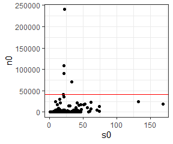
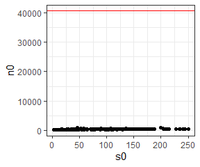
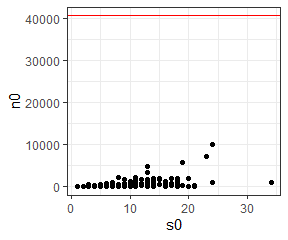
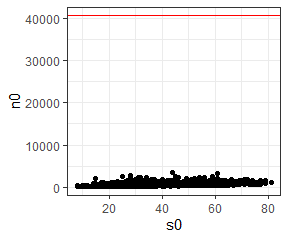
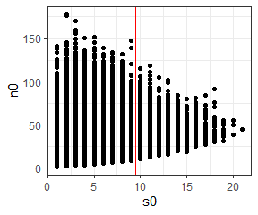

Filtering datasets
================
Renata Diaz
2020-12-18

We filter datasets in two stages. First, we filter **prior to trying to
sample from the feasible set**, in order to remove communities that have
a combined S and N too high for us to sample the feasible set, and to
reduce the Forest Inventory and Analysis dataset to a manageable size.
Second,we filter **after sampling the feasible but before we aggregate
results across communities**, to remove cases where mathematical
constraints result in uninformative results. Below we elaborate on the
logic and methods for these filtering processes, including code to allow
others to see precisely what was implemented.

## Pre-feasible set sampling

While our algorithm for sampling the feasible set improved our ability
to assess the shape of the feasible set for larger communities, there
were still computational limits on what we could do. We filtered out all
communities with more than 40720 individuals, because this is the
largest community we were able to sample given the available resources.
This upper limit results in the removal of a total of 4 communities, all
of them from the Miscellaneous Abundance Database.

For computational reasons, we also created a sub-sample of the FIA
dataset, because sampling the feasible set for all 103,343 FIA
communities overwhelms our computational pipeline. Because the FIA has
so many extremely small communities (92,988 with fewer than 10 species),
we decided to randomly select a sample of the small communities for
analysis. Thus our FIA dataset consisted of \~20 ,000 communities
comprising all communities with more than 10 species (10,355) plus
10,000 randomly selected communities with 3-10 species.

Code for downloading the data (and all other analyses) used for this
project can be found at www.github.com/diazrenata/scadsanalysis. The
data download functions are at
<https://github.com/diazrenata/scadsanalysis/blob/master/R/download_data.R>.

### Overview

The `download_data` function downloads raw data files from
<https://github.com/weecology/sad-comparison/> (for BBS, Gentry, Mammal
Community Database, and FIA; data from Baldridge (2016) and also used in
White, Thibault, and Xiao (2012)) and figshare
<http://figshare.com/files/3097079> (for the Miscellaneous Abundance
Database; Baldridge (2015)). These raw files are stored in
`working-data\abund_data` and are not edited.

The Miscellaneous Abundance and FIA databases undergo additional
filtering steps, implemented in the `filter_misc_abund` and
`filter_fia_short` and `filter_fia_small` functions. These functions run
automatically when the data are downloaded and save new files to
`working-data\abund_data`.

The `load_dataset` function loads either the filtered datasets (if
specified, for Misc. Abund and FIA) or the raw data (for all others, or
if specified for Misc. Abund and FIA), and adds additional columns and
column types to prepare the data for the computational pipeline. The
datasets as returned from `load_dataset` are exactly what goes into the
analysis.

In the following sections, we load the raw data files (as they were
downloaded), perform the filtering process manually (if applicable), and
compare the resulting data to the data that are used in the analysis,
i.e. the data that we get if we use `load_dataset`.

### BBS (no filtering)

For BBS, and all datasets that are not filtered, we can simply load the
data from the file downloaded by `download_data`, add the columns and
column formats that are added by `load_data`, and compare the result to
the result of `load_data`:

``` r
bbs_raw <- read.csv(here::here("working-data", "abund_data", "bbs_spab.csv"),  stringsAsFactors = F, header = F, skip = 2)

colnames(bbs_raw) <- c("site", "year", "species", "abund")

bbs_raw <- bbs_raw %>%
  mutate(site = as.character(site),
         dat = "bbs",
         singletons = F,
         sim = -99,
         source = "observed") %>%
  group_by(site) %>%
  arrange(abund) %>%
  mutate(rank = row_number()) %>%
  ungroup()

bbs_loaded <- load_dataset("bbs")
```

Here we confirm that all values for `abund` and `site` match between the
version we get from `load_dataset` and the version we just created from
the raw data file:

``` r
any(!(bbs_loaded$abund == bbs_raw$abund))
```

    ## [1] FALSE

``` r
any(!(bbs_loaded$site == bbs_raw$site))
```

    ## [1] FALSE

Here we check to confirm that no communities have a total abundance
exceeding our upper limit (40720, marked by the horizontal red line):

``` r
bbs_statevars <- get_statevars(bbs_raw)

ggplot(bbs_statevars, aes(s0, n0)) +
  geom_point() +
  theme_bw() +
  geom_hline(yintercept = 40720, color = "red")
```

<!-- -->

No communities in BBS have more than 40720 individuals, so all are
initially included in the analysis.

### Gentry (no filtering)

For Gentry, as with BBS, we can simply load the data from the file
downloaded by `download_data`, add the columns and column formats that
are added by `load_data`, and compare the result to the result of
`load_data`:

``` r
gentry_raw <- read.csv(here::here("working-data", "abund_data", "gentry_spab.csv"),  stringsAsFactors = F, header = F, skip = 2)

colnames(gentry_raw) <- c("site", "year", "species", "abund")

gentry_raw <- gentry_raw %>%
  mutate(site = as.character(site),
         dat = "gentry",
         singletons = F,
         sim = -99,
         source = "observed") %>%
  group_by(site) %>%
  arrange(abund) %>%
  mutate(rank = row_number()) %>%
  ungroup()

gentry_loaded <- load_dataset("gentry")
```

Here we confirm that all values for `abund` and `site` match between the
version we get from `load_dataset` and the version we just created from
the raw data file:

``` r
any(!(gentry_loaded$abund == gentry_raw$abund))
```

    ## [1] FALSE

``` r
any(!(gentry_loaded$site == gentry_raw$site))
```

    ## [1] FALSE

Here we check to confirm that no communities have a total abundance
exceeding our upper limit (40720, marked by the horizontal red line):

``` r
gentry_statevars <- get_statevars(gentry_raw)

ggplot(gentry_statevars, aes(s0, n0)) +
  geom_point() +
  theme_bw() +
  geom_hline(yintercept = 40720, color = "red")
```

<!-- -->

No communities in Gentry have more than 40720 individuals, so all are
initially included in the analysis.

### Mammal Community Database (not filtered)

For MCDB, as with BBS and Gentry, we can simply load the data from the
file downloaded by `download_data`, add the columns and column formats
that are added by `load_data`, and compare the result to the result of
`load_data`:

``` r
mcdb_raw <- read.csv(here::here("working-data", "abund_data", "mcdb_spab.csv"),  stringsAsFactors = F, header = F, skip = 2)

colnames(mcdb_raw) <- c("site", "year", "species", "abund")

mcdb_raw <- mcdb_raw %>%
  mutate(site = as.character(site),
         dat = "mcdb",
         singletons = F,
         sim = -99,
         source = "observed") %>%
  group_by(site) %>%
  arrange(abund) %>%
  mutate(rank = row_number()) %>%
  ungroup()

mcdb_loaded <- load_dataset("mcdb")
```

Here we confirm that all values for `abund` and `site` match between the
version we get from `load_dataset` and the version we just created from
the raw data file:

``` r
any(!(mcdb_loaded$abund == mcdb_raw$abund))
```

    ## [1] FALSE

``` r
any(!(mcdb_loaded$site == mcdb_raw$site))
```

    ## [1] FALSE

Here we check to confirm that no communities have a total abundance
exceeding our upper limit (40720, marked by the horizontal red line):

``` r
mcdb_statevars <- get_statevars(mcdb_raw)

ggplot(mcdb_statevars, aes(s0, n0)) +
  geom_point() +
  theme_bw() +
  geom_hline(yintercept = 40720, color = "red")
```

<!-- -->

No communities in the MCDB have more than 40720 individuals, so all are
initially included in the analysis.

### Miscellaneous Abundance Database (filtered)

For the Miscellaneous Abundance Database, we can proceed similarly to
with the non-filtered datasets. We load the data from the file
downloaded by `download_data`, add the columns and column formats that
are added by `load_data`, and compare the result to the result of
`load_data`.

However, Misc. Abund includes datasets reported as relative abundance in
addition to count data. Relative abundance data is not appropriate for
this analysis, so we filter out records where abund = 0 to restrict our
analysis to communities with count data. Also, because we will
eventually filter out some highly abundant communities, at this stage we
make sure to load the **unfiltered** version using `load_dataset`.

``` r
misc_abund_raw <- read.csv(here::here("working-data", "abund_data", "misc_abund_spab.csv"))

misc_abund_raw <- misc_abund_raw %>%
  dplyr::rename(site = Site_ID,
                abund = Abundance)

misc_abund_raw <- misc_abund_raw %>%
  mutate(site = as.character(site),
         dat = "misc_abund",
         singletons = F,
         sim = -99,
         source = "observed") %>%
  filter(abund > 0) %>%
  group_by(site) %>%
  arrange(abund) %>%
  mutate(rank = row_number()) %>%
  ungroup()

misc_abund_loaded <- load_dataset("misc_abund")
```

Here we confirm that, if we load the unfiltered dataset using
`load_dataset`, the records match the version we have created manually
from the raw file:

``` r
any(!(misc_abund_loaded$abund == misc_abund_raw$abund))
```

    ## [1] FALSE

``` r
any(!(misc_abund_loaded$site == misc_abund_raw$site))
```

    ## [1] FALSE

Here we check whether any communities have more than 40720 individuals
(horizontal red line):

``` r
misc_abund_statevars <- get_statevars(misc_abund_raw)

ggplot(misc_abund_statevars, aes(s0, n0)) +
  geom_point() +
  theme_bw() +
  geom_hline(yintercept = 40720, color = "red")
```

<!-- -->

Misc abund has 4 communities with more than 40720 individuals, and these
communities are removed:

``` r
misc_abund_sv_filtered <- misc_abund_statevars %>%
  filter(n0 <= 40720)

misc_abund_filtered <- filter(misc_abund_raw, site %in% misc_abund_sv_filtered$site)
```

We can access the **filtered** version of the dataset, as used in the
analysis, using `load_dataset("misc_abund_short")`. We then check to
confirm that the filtered version of the dataset that we get from
`load_dataset` matches the version that we filtered manually:

``` r
misc_abund_short_loaded <- load_dataset("misc_abund_short")

any(!(misc_abund_short_loaded$abund == misc_abund_filtered$abund))
```

    ## [1] FALSE

``` r
any(!(misc_abund_short_loaded$site == misc_abund_filtered$site))
```

    ## [1] FALSE

### FIA (filtered)

Again, we can begin similarly to with the non-filtered datasets. We load
the data from the file downloaded by `download_data`, add the columns
and column formats that are added by `load_data`, and compare the result
to the result of `load_data`. Because we will remove some communities
from FIA, we make sure to load the **unfiltered** version using
`load_data`.

``` r
fia_raw <- read.csv(here::here("working-data", "abund_data", "fia_spab.csv"), stringsAsFactors = F, header = F, skip = 2)

colnames(fia_raw) <- c("site", "year", "species", "abund")

fia_raw <- fia_raw %>%
  mutate(site = as.character(site),
         dat = "fia",
         singletons = F,
         sim = -99,
         source = "observed") %>%
  filter(abund > 0) %>%
  group_by(site) %>%
  arrange(abund) %>%
  mutate(rank = row_number()) %>%
  ungroup()

fia_loaded <- load_dataset("fia")
```

Here we confirm that, if we load the unfiltered dataset using
`load_dataset`, the records match the version we have created manually
from the raw file:

``` r
any(!(fia_loaded$abund == fia_raw$abund))
```

    ## [1] FALSE

``` r
any(!(fia_loaded$site == fia_raw$site))
```

    ## [1] FALSE

Here we check whether any communities have more than 40720 individuals
(horizontal red line):

``` r
fia_statevars <- get_statevars(fia_raw)
ggplot(fia_statevars, aes(s0, n0)) +
  geom_point() +
  theme_bw() +
  geom_hline(yintercept = 40720, color = "red")
```

<!-- -->

FIA has no communities with more than 40720 individuals. However, it
presents additional issues. It it has 103343 communities, of which 92988
have fewer than 10 species (vertical red line in the figure below)

``` r
ggplot(fia_statevars, aes(s0, n0)) +
  geom_point() +
  theme_bw() +
  geom_vline(xintercept = c(9.5), color = "red")
```

<!-- -->

This many communities overwhelms our computational pipeline. We
therefore sample all 10355 communities with 10 or more species, and a
random subsample of 10,000 communities with 3-9 species. We then run
these through the pipeline as two separate databases. `fia_short` is the
communities with 10 or more species, and `fia_small` is the 10,000
communities with 3-9 species. We re-combine them as “FIA” for aggregate
analyses. This results in a toal of 20,355 FIA communities in the
analysis.

``` r
fia_sv_short <- fia_statevars %>%
    dplyr::filter(s0 >= 10)

fia_short <- fia_raw %>%
  dplyr::filter(site %in% fia_sv_short$site) %>%
  dplyr::mutate(dat = "fia_short")

fia_short_statevars <- get_statevars(fia_short)

ggplot(fia_short_statevars, aes(s0, n0)) +
  geom_point() +
  ggtitle("fia short, >= 10 species") +
  theme_bw()
```

<!-- -->

``` r
fia_sv_small <- fia_statevars %>%
  dplyr::filter(s0 >= 3) %>%
  dplyr::filter(s0 <= 9)

  set.seed(1977)
  fia_sv_small <- fia_sv_small[ sample.int(nrow(fia_sv_small), size = 10000, replace = F), ]


fia_small <- fia_raw %>%
  dplyr::filter(site %in% fia_sv_small$site) %>%
  dplyr::mutate(dat = "fia_small")

fia_small_statevars <- get_statevars(fia_small)

ggplot(fia_small_statevars, aes(s0, n0)) +
  geom_point() +
  ggtitle("fia small, 3-9 species")
```

<!-- -->

The “short” and “small” datasets are saved as .csvs and can be loaded
using `load_dataset` as follows. These are the versions that are used in
the analysis.

``` r
fia_small_loaded <- load_dataset("fia_small")

fia_short_loaded <- load_dataset("fia_short")
```

Here we confirm that versions of “fia\_short” and “fia\_small” that we
created manually match the ones we obtain from `load_dataset`:

``` r
any(!(fia_small_loaded$abund == fia_small$abund))
```

    ## [1] FALSE

``` r
any(!(fia_small_loaded$site == fia_small$site))
```

    ## [1] FALSE

``` r
any(!(fia_short_loaded$abund == fia_short$abund))
```

    ## [1] FALSE

``` r
any(!(fia_short_loaded$site == fia_short$site))
```

    ## [1] FALSE

## Post-sampling

Some communities fall into mathematically special spaces where basic
constraints prevent informative results. We removed all communities that
fell into any of the below cases:

1)  When communities have only 1 mathematically possible SAD (S = 1, N =
    S, or N = S + 1).
2)  When the sampled feasible sets yield fewer than 20 unique values for
    skewness/evenness. If there are fewer than 20 unique values in the
    comparison vector, it is impossible to be in the 5th or 95th
    percentile.
3)  When a community consists of only 2 species, we excluded it from
    analyses using skewness, because e1071::skewness() always evaluates
    to 0 if S = 2.

Below is the procedure for performing this filtering (after sampling the
feasible set). First, we load our results from `all_di.csv`. This file
contains the results of comparing the skewness and evenness for
**observed** SADs to the distributions of skewness and evenness obtained
from their sampled feasible sets; “all\_di” stands for “all diversity
indices”. Every community that was included for sampling is included in
all\_di. (Additionally, every community has a “singletons” counterpart,
which is the same analysis run adjusted for rarefaction. That analysis
is discussed elsewhere, and we ignore the rarefaction-adjusted versions
here).

``` r
all_statevars <- bind_rows(bbs_statevars, fia_short_statevars, fia_small_statevars, gentry_statevars, mcdb_statevars, misc_abund_sv_filtered)


all_di <- read.csv(here::here("analysis", "reports", "all_di.csv"), stringsAsFactors = F)
```

``` r
all_di <- all_di %>%
  filter(!singletons) %>%
  mutate(dat = ifelse(grepl(dat, pattern = "fia"), "fia", dat),
         dat = ifelse(dat == "misc_abund_short", "misc_abund", dat)) %>%
  mutate(Dataset = dat,
    Dataset = ifelse(Dataset == "fia", "Forest Inventory and Analysis", Dataset),
        Dataset = ifelse(Dataset == "bbs", "Breeding Bird Survey", Dataset),
        Dataset = ifelse(Dataset == "mcdb", "Mammal Community DB", Dataset),
        Dataset = ifelse(Dataset == "gentry", "Gentry", Dataset),
        Dataset = ifelse(Dataset == "misc_abund", "Miscellaneous Abundance DB", Dataset))

head(all_di)
```

<div class="kable-table">

|  sim | source   | dat | site | singletons | s0 |  n0 |       nparts |     skew |  shannon |   simpson | skew\_percentile | shannon\_percentile | simpson\_percentile | skew\_percentile\_excl | simpson\_percentile\_excl | skew\_range | simpson\_range | nsamples | skew\_unique | simpson\_unique | skew\_2p5 | skew\_97p5 | skew\_95 |   skew\_min | simpson\_max | simpson\_2p5 | simpson\_5 | simpson\_97p5 | skew\_95\_ratio\_2t | simpson\_95\_ratio\_2t | skew\_95\_ratio\_1t | simpson\_95\_ratio\_1t | Dataset              |
| ---: | :------- | :-- | ---: | :--------- | -: | --: | -----------: | -------: | -------: | --------: | ---------------: | ------------------: | ------------------: | ---------------------: | ------------------------: | ----------: | -------------: | -------: | -----------: | --------------: | --------: | ---------: | -------: | ----------: | -----------: | -----------: | ---------: | ------------: | ------------------: | ---------------------: | ------------------: | ---------------------: | :------------------- |
| \-99 | observed | bbs | 4002 | FALSE      | 35 | 816 | 4.070604e+24 | 1.973575 | 2.655380 | 0.9016995 |            69.60 |               0.050 |               1.375 |                  69.60 |                     1.375 |    5.013388 |      0.1071673 |     4000 |         4000 |            3445 | 0.7046398 |   3.358540 | 2.998938 |   0.0548560 |    0.9631061 |    0.9064803 |  0.9144545 |     0.9551500 |           0.5293626 |              0.4541467 |           0.5872441 |              0.4539785 | Breeding Bird Survey |
| \-99 | observed | bbs | 4003 | FALSE      | 26 | 439 | 1.765612e+17 | 1.502247 | 2.609893 | 0.9009605 |            50.75 |               8.800 |              15.225 |                  50.75 |                    15.225 |    4.406489 |      0.1807068 |     4000 |         4000 |            2860 | 0.5050514 |   3.157090 | 2.846737 | \-0.1970758 |    0.9517697 |    0.8671956 |  0.8799140 |     0.9437090 |           0.6018485 |              0.4234121 |           0.6907570 |              0.3976368 | Breeding Bird Survey |
| \-99 | observed | bbs | 4004 | FALSE      | 27 | 445 | 3.100591e+17 | 1.802663 | 2.748364 | 0.9138139 |            64.45 |              23.775 |              28.450 |                  64.45 |                    28.450 |    4.384616 |      0.3824770 |     4000 |         4000 |            2883 | 0.5441635 |   3.182605 | 2.879527 |   0.0268103 |    0.9522030 |    0.8740614 |  0.8860598 |     0.9451334 |           0.6017496 |              0.1858206 |           0.6506195 |              0.1729337 | Breeding Bird Survey |
| \-99 | observed | bbs | 4006 | FALSE      | 29 | 471 | 1.689307e+18 | 2.728160 | 2.432256 | 0.8597058 |            92.65 |               0.425 |               0.800 |                  92.65 |                     0.800 |    4.369746 |      0.1462940 |     4000 |         4000 |            2948 | 0.5689934 |   3.270669 | 2.928296 | \-0.1614555 |    0.9562164 |    0.8815458 |  0.8929864 |     0.9484996 |           0.6182684 |              0.4576662 |           0.7070780 |              0.4322117 | Breeding Bird Survey |
| \-99 | observed | bbs | 4007 | FALSE      | 24 | 575 | 1.424232e+19 | 1.216833 | 2.491605 | 0.8915962 |            36.80 |               4.550 |              11.475 |                  36.80 |                    11.450 |    4.293175 |      0.1741853 |     4000 |         4000 |            3283 | 0.4274895 |   2.971294 | 2.710518 | \-0.2180949 |    0.9501822 |    0.8638114 |  0.8769887 |     0.9396030 |           0.5925231 |              0.4351207 |           0.6821556 |              0.4202049 | Breeding Bird Survey |
| \-99 | observed | bbs | 4009 | FALSE      | 21 | 534 | 6.506488e+17 | 1.848653 | 2.420594 | 0.8785787 |            79.55 |               8.050 |              11.325 |                  79.55 |                    11.300 |    3.932031 |      0.1747465 |     4000 |         4000 |            3267 | 0.3496395 |   2.780707 | 2.531623 | \-0.3879136 |    0.9418353 |    0.8506425 |  0.8631493 |     0.9325567 |           0.6182726 |              0.4687608 |           0.7425008 |              0.4502870 | Breeding Bird Survey |

</div>

Here we confirm that we have the same number of communities in `all_di`
as we have in our set of communities included for sampling.

``` r
nrow(all_di) == nrow(all_statevars)
```

    ## [1] TRUE

Here we remove communities for the first case, only one possible SAD (N
= S, N = S + 1, or S = 1).

``` r
all_di %>%
  group_by_all() %>%
  mutate(only_one_sad = sum(s0 == n0, s0 == 1, n0 == (s0 + 1)) > 0) %>%
  ungroup() %>%
  group_by(dat) %>%
  summarize(total_only_one_sad = sum(only_one_sad),
            total_sites = dplyr::n()) %>%
  ungroup() %>%
  mutate(all_sites_one_sad = sum(total_only_one_sad),
         all_sites = sum(total_sites))
```

<div class="kable-table">

| dat         | total\_only\_one\_sad | total\_sites | all\_sites\_one\_sad | all\_sites |
| :---------- | --------------------: | -----------: | -------------------: | ---------: |
| bbs         |                     0 |         2773 |                  258 |      24647 |
| fia         |                   176 |        20355 |                  258 |      24647 |
| gentry      |                     0 |          224 |                  258 |      24647 |
| mcdb        |                    56 |          730 |                  258 |      24647 |
| misc\_abund |                    26 |          565 |                  258 |      24647 |

</div>

``` r
all_di_filtered <- all_di %>%
  filter(s0 != n0,
         s0 != 1,
         n0 != (s0 + 1))

nrow(all_di_filtered)
```

    ## [1] 24389

Removing those with only one SAD results in the removal of 258 sites
total. 176 from FIA, 56 from MCDB, and 26 from Misc. Abund.

Finally, we filter for cases 2 and 3. That is, for aggregate analyses,
we will restrict our analyses to sites whose feasible sets have more
than 20 unique values for skewness or evenness (whichever metric we are
focused on). For analyses with skewness, we will also remove sites with
only 2 species. This results in these final total numbers of communities
included for skewness and evenness.

For skewness:

``` r
all_di_filtered %>%
  filter(skew_unique > 20, s0 > 2) %>%
  group_by(dat) %>%
  summarize(sites_for_skewness = dplyr::n()) %>%
  mutate(total_sites_for_skewness = sum(sites_for_skewness))
```

<div class="kable-table">

| dat         | sites\_for\_skewness | total\_sites\_for\_skewness |
| :---------- | -------------------: | --------------------------: |
| bbs         |                 2773 |                       22325 |
| fia         |                18300 |                       22325 |
| gentry      |                  223 |                       22325 |
| mcdb        |                  537 |                       22325 |
| misc\_abund |                  492 |                       22325 |

</div>

For evenness:

``` r
all_di_filtered %>%
  filter(simpson_unique > 20) %>%
  group_by(dat) %>%
  summarize(sites_for_evenness = dplyr::n()) %>%
  ungroup() %>%
  mutate(total_sites_for_evenness = sum(sites_for_evenness))
```

<div class="kable-table">

| dat         | sites\_for\_evenness | total\_sites\_for\_evenness |
| :---------- | -------------------: | --------------------------: |
| bbs         |                 2773 |                       22142 |
| fia         |                18113 |                       22142 |
| gentry      |                  224 |                       22142 |
| mcdb        |                  542 |                       22142 |
| misc\_abund |                  490 |                       22142 |

</div>

## References

Baldridge, E. (2015). Miscellaneous Abundance Database. figshare.
Available at: MiscAbundanceDB\_main.
<https://doi.org/10.6084/m9.figshare.95843.v4>

Baldridge, E., Harris, D.J., Xiao, X. & White, E.P. (2016). Data from An
extensive comparison of species-abundance distribution models. Zenodo.
Available at: <https://zenodo.org/record/166725>. Accessed from
<https://github.com/weecology/sad-comparison>.

Meyer, D., Dimitriadou, E., Hornik, K., Weingessel, A. & Leisch, F.
(2019). e1071: Misc Functions of the Department of Statistics,
Probability Theory Group (Formerly: E1071), TU Wien.

White, E.P., Thibault, K.M. & Xiao, X. (2012). Characterizing species
abundance distributions across taxa and ecosystems using a simple
maximum entropy model. Ecology, 93, 1772–1778.
