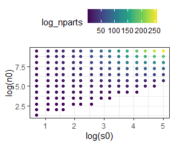
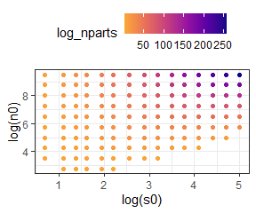
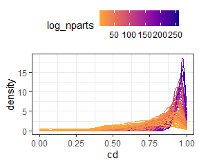

Self-similarity of the elements of the feasible set
================
Renata Diaz
2020-12-17

We are interested in how the self-similarity of the elements of the
feasible set varies over gradients in S and N. The intuition from
“common-sense” probability theory, statistical mechanics,
law-of-large-numbers intuition is that, as the number of possible
arrangements becomes large, the different possible arrangements should
become more self-similar. However, we don’t know that this is the case
for SADs, nor do we know the values for S and N where things really
start to converge.

In the manuscript, I use the ratio of the 95% interval of summary
statistic values, to the full range of summary statistic values. This
can be calculated quickly and without introducing new statistics, etc to
the main manuscript. It also directly reflects the distributions to
which we are comparing our observations. However, it may not tell the
full story: if the summary statistic values are idiosyncratic (skewness
in particular can behave counterintuitively), it reflects those
idiosyncracies.

With more computing, we can explore how similar the elements of the
feasible set are to each other by comparing them to each other directly.
Then we can ask whether, as the feasible set gets large, the elements
become more similar and converge on a dominant form.

I initially did this analysis in
<https://github.com/diazrenata/sadspace> and am porting the functions
and analysis over to this repo for the supplement.

## Directly establishing self-similarity

### Overview

We can describe how self-similar the elements of a feasible set are via
numerous pairwise comparisons. Given a body of samples drawn from a
feasible set, we draw two samples and compute some metric that describes
how similar these two samples are to each other. We do this many times,
making many pairwise comparisons, to generate a distribution of the
self-similarity metric for that feasible set. We then compare how
self-similar different feasible sets are by comparing the distributions
of self-similarity metrics for the different feasible sets.

### Walkthrough

Here we have a bank of 3870 samples from the feasible set for SADs with
7 species and 71 individuals. We draw two of these samples to compare.

<!-- --><!-- -->

I have implemented 5 metrics of similarity for comparing samples:

  - R2
  - R2 on log-transformed abundances
  - The coefficient of determination from a linear model fitting one
    sample to the other
  - The proportion of individuals allocated to species of differing
    abundances
  - The estimated Kullbak-Lieber (sp) divergence between the two samples

| sim1 | sim2 |        r2 |   r2\_log |        cd | prop\_off |       div | s0 | n0 | nparts |
| ---: | ---: | --------: | --------: | --------: | --------: | --------: | -: | -: | :----- |
|  591 | 3208 | 0.7874279 | 0.7336329 | 0.8397613 | 0.1971831 | 0.1027579 |  7 | 71 | 60289  |

We repeat this comparison process numerous times to get numerous values
for the self-similarity metrics.

<!-- --><!-- --><!-- --><!-- --><!-- -->

We repeat this process for feasible sets with varying S and N, and
compare the distribution of the self-similarity metrics across the
variation in S and N.

<!-- --><!-- --><!-- --><!-- --><!-- -->

## Across a range of S and N

Here we have drawn samples from a “net” of points in S and N space that
spans the range present in our datasets. For each feasible set we make
200 comparisons of elements (although for small feasible sets, 200 is
not necessarily possible). Here is how that net is distributed in S and
N space, colored by the log() number of elements in the feasible set.

<!-- -->

### Heat maps

We can make heat maps of the density distribution of self-similarity
metrics and look at how the densities shift over gradients in the size
of the feasible set.

There are a couple of nuances to doing this:

  - We need to have the same number of comparisons for every feasible
    set, so that the density distributions will be comparable. In order
    to get a large swatch of S by N space, I’ve taken 50 comparisons
    from every feasible set. This is pretty low, so it lets us get even
    small feasible sets. Setting the minimum higher does not change the
    overall impression.
  - The metrics vary in how they are bounded. For some of them (R2, log
    r2) they can have nonsensical long tails towards very low values.
    For visualization, I’ve filtered out the long tail values (prior to
    selecting the 50 comparisons). The long tails tend to be most
    dominant in the comparisons made from small feasible sets. Removing
    them therefore makes the small feasible sets look *more*
    self-similar.

#### R2

Higher R2 values indicate more similarity. R2 can be *very low* but the
most meaningful variation is between 0 and 1.

<!-- --><!-- -->

Here is R2 for only “small” feasible sets (those with fewer than
4.85165210^{8} elements in the feasible set). This lets us zoom in on
the distributions where they start to broaden out.

<!-- --><!-- -->

#### R2 on logged vectors

Higher R2 values indicate more similarity. R2 can be *very low* but the
most meaningful variation is between 0 and 1.

<!-- --><!-- -->

Here is R2 on logged vectors for only “small” feasible sets (those with
fewer than 4.85165210^{8} elements in the feasible set). This lets us
zoom in on the distributions where they start to broaden out.

<!-- --><!-- -->

#### Coefficient of determination

Higher CD values indicate more similarity. It is bounded 0 to 1.

<!-- --><!-- -->

Here is cd for only “small” feasible sets (those with fewer than
4.85165210^{8} elements in the feasible set). This lets us zoom in on
the distributions where they start to broaden out.

<!-- --><!-- -->

#### Proportion of individuals allocated to different species

Lower “prop off” values indicate more similarity. It is bounded 0 to 1.

<!-- --><!-- -->

Here is prop\_off for only “small” feasible sets (those with fewer than
4.85165210^{8} elements in the feasible set). This lets us zoom in on
the distributions where they start to broaden out.

<!-- --><!-- -->

#### K-L divergence

Lower divergence values indicate more similarity. It is bounded 0 to 1.

<!-- --><!-- -->

Here is K-L divergence for only “small” feasible sets (those with fewer
than 4.85165210^{8} elements in the feasible set). This lets us zoom in
on the distributions where they start to broaden out.

<!-- --><!-- -->

### In summary

Large feasible sets are consistently more self-similar than small ones.
