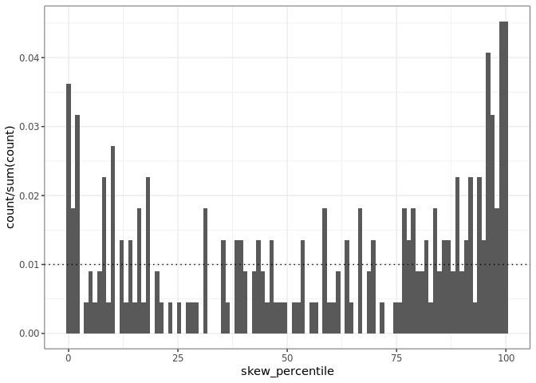
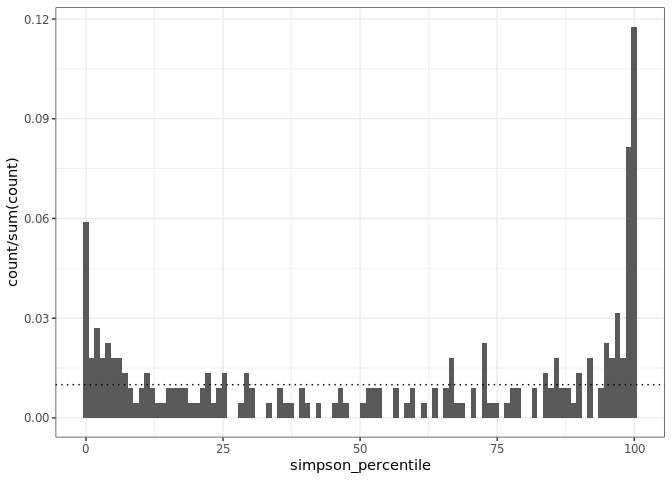

Investigating the arm + Gentry U
================

Gentry has an interesting "arm" up where the values get weird, and I'm wondering if that's where the U-shape in the percentile value histograms comes from.

Number of draws in feasible set
-------------------------------

The "arm" is well-sampled, but note that log(n0/s0) approaches zero. I'd call anything that's really purple - log(n0/s0) &lt;= 1, let's say - "arm" territory. That's where n0/s0 is down below 2.5:1-ish.

Percentile value vs. range of variation of FS
---------------------------------------------

 All of the FS properties get weird up the arm.

Simpson gets high, the sd gets down to almost zero, and the range drops. Skew gets - bizarrely? - *large*. (But absolute skewness values are...slippery and counterintuitive).

The super high evenness percentiles are all up the arm. There's more fuzz in skewness, but most of the low skewness values are also up the arm.

There is a constraining-ish envelope where the low skew values are all at low average abundance (log n0/s0 &lt; ~1.6) and the high evenness values are similarly collected (log n0/s0 &lt; ~1.7, mostly &lt; 1).

Percentile results
------------------

Let's exclude log n0/s0 &lt; 1.5.

Well that clears THAT up.

Effect of singletons

The rarefaction-inflated datasets are strongly // the raw vectors. They have more extreme skewness and evenness values, relative to their feasible sets, than the raw vectors. This is almost always true for evenness, with a little more noise in the skewness signal. But either way, very strong.

Just out of curiousity, removing the arm...

Huh. Those are tidier, too.

FS in the arm
-------------

Let's look at what the actual feasible sets look like up the arm vs. elsewhere.

