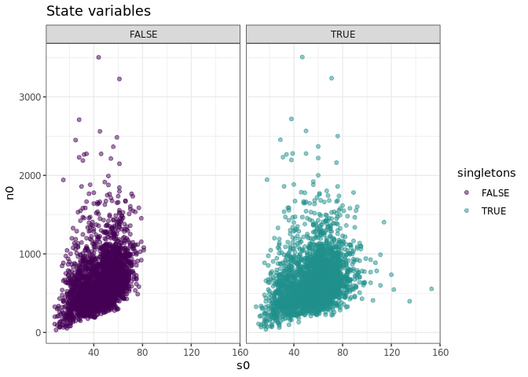

Dataset-level report
================

This dataset is bbs.
====================

State variables and change with singletons
------------------------------------------

Here is a plot of the distribution of S and N in this dataset, and S and N if we estimate the true number of species.

Here is a plot of how many species were added to each dataset by estimating the true number of species.

Number of samples achieved
--------------------------

#### The maximum number of samples achieved is 100.

Position (%ile) of empirical SADs within FS
-------------------------------------------

