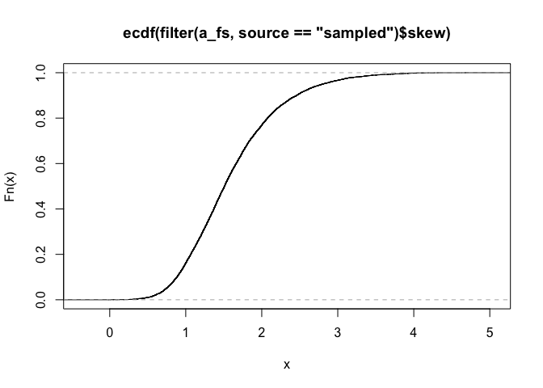

Digging into %ile and CDF fxns
================

Here is the distribution of skew values in this fs:

    ## `stat_bin()` using `bins = 30`. Pick better value with `binwidth`.

The percentile ranks as computed by `get_percentile` for the max and minimum sampled values are 99.99 and 0.

The ecdf function at hte minimum and maximum sampled valures evaluates to 1 and 10^{-4}.
