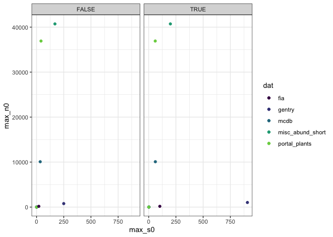

Between-dataset comparisons
================

Overall dataset spaces
----------------------

Extremes by dataset
-------------------

Here are the spaces occupied by each dataset 

 I don't trust that occupancy. Here's another approach.

