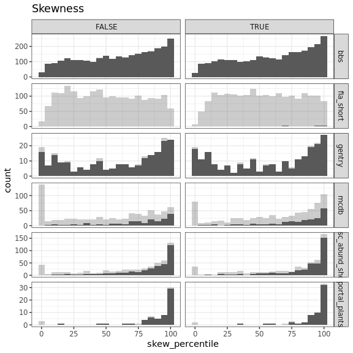
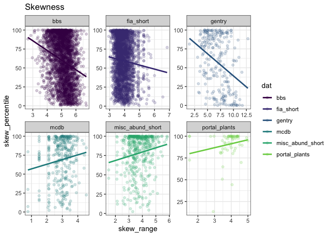
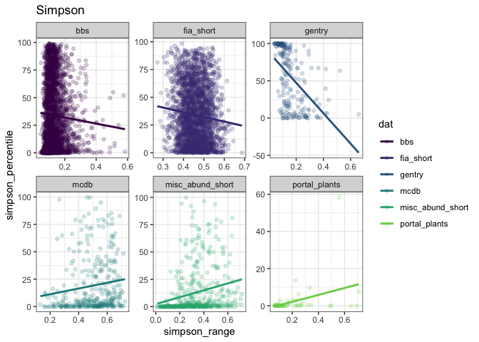

Between-dataset comparisons
================

Observations from these histograms:

-   FIA really struggles to get 2500 samples
-   Portal is the *most* concentrated of all the datasets.
-   Then MCDB and misc, then gentry, then bbs. FIA is hard to place but looks idiosyncratic.
-   Curious about how variation in %ile maps on to S and N, *particularly* for Gentry and BBS.
-   Skewness is less extreme than Simpson (more density in the in-between).
-   Singletons doesn't appear to be terrifically impactful. From now on filtering to *unaltered* vectors.

The less extreme (low skew, high simpson) vectors appear vaguely collected in the lower right for Gentry and BBS. Those are the regions with relatively high N/S, aka low average abundance, aka a relatively small feasible set.

Conversely, for MCDB and Misc, it almost looks like the very least skewed elements are way down at tiny abundances?

Do percentiles scan with S/N?

 There is perhaps a constraint, but that might be because you rarely get v high average abundances. You seem to rarely get low skewness or high Simpson at high average abundance, which scans with the heatmaps.

Do Simpson and skewness correspond? 

There's a weak relationship between Simpson and skewness, but a lot of noise. They are not substitutable.

Why is Gentry so strangely bimodal? It's like a U, when all the others tend towards one end or the other.

Why are BBS and mammals less frequently squished than Portal?

Looking at range of skewness and Simpsons:

I added the ranges because I thought the percentiles might be constrained somewhat by the range of values represented in the feasible set. It doesn't look to me like there is a strong relationship between range and %ile.
