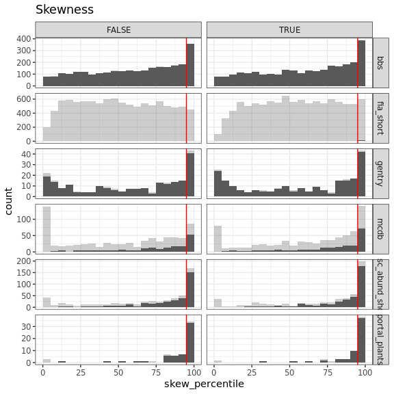
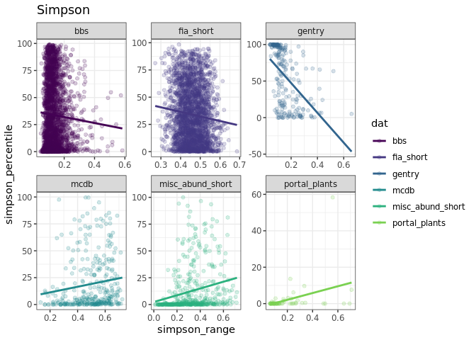

Between-dataset comparisons
================

Observations from these histograms:

-   FIA really struggles to get 2500 samples
-   Portal is the *most* concentrated of all the datasets.
-   Then MCDB and misc, then gentry, then bbs. FIA is hard to place but looks idiosyncratic.
-   Curious about how variation in %ile maps on to S and N, *particularly* for Gentry and BBS.
-   Skewness is less extreme than Simpson (more density in the in-between).
-   Singletons doesn't appear to be terrifically impactful. From now on filtering to *unaltered* vectors.
-   I think it's best to filter to at least 2000 samples.

Some summary statistics:

    ## # A tibble: 12 x 6
    ##    dat           singletons mean_nsamples nsites prop_skew_high prop_simpson_low
    ##    <chr>         <lgl>              <dbl>  <int>          <dbl>            <dbl>
    ##  1 bbs           FALSE              2500.   2772          0.130            0.261
    ##  2 bbs           TRUE               2500.   2772          0.141            0.323
    ##  3 fia_short     FALSE              2310.   2608          0.112            0.146
    ##  4 fia_short     TRUE               2326.   2946          0.127            0.192
    ##  5 gentry        FALSE              2497.    221          0.195            0.154
    ##  6 gentry        TRUE               2497.    222          0.194            0.189
    ##  7 mcdb          FALSE              2456.    324          0.238            0.469
    ##  8 mcdb          TRUE               2457.    371          0.302            0.606
    ##  9 misc_abund_s… FALSE              2487.    448          0.373            0.638
    ## 10 misc_abund_s… TRUE               2491.    453          0.430            0.704
    ## 11 portal_plants FALSE              2500.     58          0.569            0.914
    ## 12 portal_plants TRUE               2500.     59          0.644            0.966

    ## Warning: Using size for a discrete variable is not advised.

    ## Warning: Using size for a discrete variable is not advised.

The less extreme (low skew, high simpson) vectors appear vaguely collected in the lower right for Gentry and BBS. Those are the regions with relatively high N/S, aka low average abundance, aka a relatively small feasible set.

Conversely, for MCDB and Misc, it almost looks like the very least skewed elements are way down at tiny abundances?

Do percentiles scan with S/N?

 There is perhaps a constraint, but that might be because you rarely get v high average abundances. You seem to rarely get low skewness or high Simpson at high average abundance, which scans with the heatmaps.

Do Simpson and skewness correspond? 

There's a weak relationship between Simpson and skewness, but a lot of noise. They are not substitutable.

                Why is Gentry so strangely bimodal? It's like a U, when all the others tend towards one end or the other. 

Why are BBS and mammals less frequently squished than Portal?

Looking at range of skewness and Simpsons:

I added the ranges because I thought the percentiles might be constrained somewhat by the range of values represented in the feasible set. It doesn't look to me like there is a strong relationship between range and %ile.

    ## Warning: Duplicated aesthetics after name standardisation: pad

    ## `stat_bin()` using `bins = 30`. Pick better value with `binwidth`.

    ## Warning: Removed 23 rows containing non-finite values (stat_bin).

    ## Warning: Removed 23 rows containing missing values (geom_point).

    ## Warning: Removed 23 rows containing missing values (geom_point).

