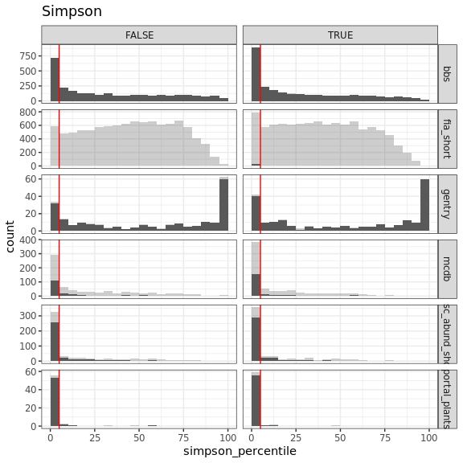

Between-dataset comparisons
================

Observations from these histograms:

-   FIA really struggles to get 2500 samples
-   Portal is the *most* concentrated of all the datasets.
-   Then MCDB and misc, then gentry, then bbs. FIA is hard to place but looks idiosyncratic.
-   Curious about how variation in %ile maps on to S and N, *particularly* for Gentry and BBS.
-   Skewness is less extreme than Simpson (more density in the in-between).
-   Singletons doesn't appear to be terrifically impactful. From now on filtering to *unaltered* vectors.
-   I think it's best to filter to at least 2000 samples.

Some summary statistics: 

    ## # A tibble: 12 x 10
    ##    dat   singletons mean_skew sd_skew mean_simpson sd_simpson mean_nsamples
    ##    <chr> <lgl>          <dbl>   <dbl>        <dbl>      <dbl>         <dbl>
    ##  1 bbs   FALSE           59.2    29.5       33.7        30.7          2500.
    ##  2 bbs   TRUE            60.3    29.6       28.0        28.6          2500.
    ##  3 fia_… FALSE           59.6    27.9       34.0        25.6          2310.
    ##  4 fia_… TRUE            63.1    26.5       27.1        22.7          2326.
    ##  5 gent… FALSE           57.2    35.2       55.6        38.7          2497.
    ##  6 gent… TRUE            56.7    35.6       53.7        39.6          2497.
    ##  7 mcdb  FALSE           68.7    29.0       19.1        25.1          2456.
    ##  8 mcdb  TRUE            73.6    27.5       12.9        20.8          2457.
    ##  9 misc… FALSE           78.1    25.4       12.6        21.6          2487.
    ## 10 misc… TRUE            81.9    23.3        8.96       18.2          2491.
    ## 11 port… FALSE           90.6    15.8        1.97        7.94         2500.
    ## 12 port… TRUE            93.4    12.2        0.615       2.04         2500.
    ## # … with 3 more variables: nsites <int>, prop_skew_high <dbl>,
    ## #   prop_simpson_low <dbl>

The less extreme (low skew, high simpson) vectors appear vaguely collected in the lower right for Gentry and BBS. Those are the regions with relatively high N/S, aka low average abundance, aka a relatively small feasible set.

Conversely, for MCDB and Misc, it almost looks like the very least skewed elements are way down at tiny abundances?

Do percentiles scan with S/N?

 There is perhaps a constraint, but that might be because you rarely get v high average abundances. You seem to rarely get low skewness or high Simpson at high average abundance, which scans with the heatmaps.

Do Simpson and skewness correspond? 

There's a weak relationship between Simpson and skewness, but a lot of noise. They are not substitutable.

Why is Gentry so strangely bimodal? It's like a U, when all the others tend towards one end or the other.

Why are BBS and mammals less frequently squished than Portal?

Looking at range of skewness and Simpsons:

I added the ranges because I thought the percentiles might be constrained somewhat by the range of values represented in the feasible set. It doesn't look to me like there is a strong relationship between range and %ile.
