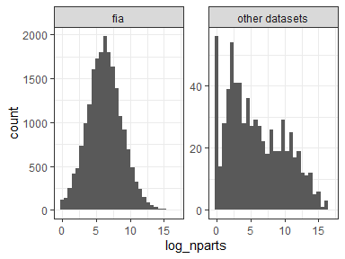
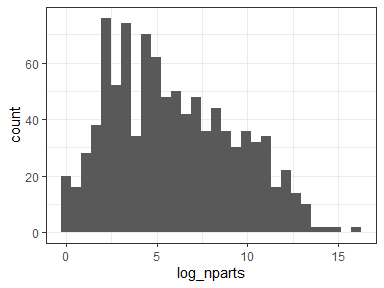

Comparing FIA sites to similarly-sized counterparts
================
Renata Diaz
2020-08-12

The FIA sites stand out from the other datasets in that, overall, they
do not show pronouncedly extreme values. This is especially the case for
skewness:

<!-- --><!-- -->

One possible explanation for this is that the FIA sites tend to have
quite small S and N, leading to quite a small feasible set and
potentially quite a broad distribution of expected values for skewness
and evenness.

It is also possible that the FIA datasets differ qualitatively from
other datasets, and that this drives the difference.

We may be able to disentangle these possibilities by

  - Comparing the FIA sites to sites from other datasets that are of a
    similar size
  - Looking at the breadth of the distributions for these sites relative
    to larger sites

If we compare the FIA sites to sites from other datasets that are of a
similar size, the comparison is limited by the fact that our sites are
nonuniformly distributed in SxN space, or in terms of the the number of
elements in their feasible sets. Specifically, the FIA datasets are
concentrated towards **especially small** feasible sets compared “other
datasets” - even the ones that fall within the general range found in
FIA.

<!-- --><!-- -->

This means that an overall histogram for FIA would be representative
more of sites in the 4-7 parts range, while one for “other datasets”
would be representative of more of a spread from 3-16 parts. Given that
we suspect the number of parts is quite important, this is a sticky
problem.

We can subsample **FIA** so there is equal representation of all S and N
combinations between FIA and “other datasets”.

Some details on the subsampling:

  - We look for exact matches in S and N, with at least one site from
    FIA and at least one site from the pool of other datasets.
  - If there are multiple exact matches (on either side) we randomly
    draw *the number of sites from the side that has fewer matches* from
    the side that has more matches. So if there are 2 sites in FIA with
    a particular S and N, and 5 sites in “other datasets” with that S
    and N, we randomly select 2 of the 5 from “other datasets” to
    compare to the 2 from FIA.
  - Some of these S and N combinations have feasible sets that give
    fewer than 20 unique value for skewness or evenness, and we remove
    those from the histograms and proportion calculations below. 20 is a
    somewhat arbitrary (and probably low) cutoff, but if there are fewer
    than 20 unique values the percentile cannot be above 95 or below 5.
    We end up with 371 comparisons for skewness and 365 for evenness.

<!-- --><!-- -->

The dark dots are the sites for which we can find at least one exact
match in s0 and n0 between a FIA site and a site from another dataset.
The histogram is the distribution of FS sizes represented in the
subsample.

Here are the results for that subsample:

<!-- --><!-- -->

| fia\_yn        | prop\_skew\_high | prop\_even\_low | nsites\_skew | nsites\_even |
| :------------- | ---------------: | --------------: | -----------: | -----------: |
| fia            |        0.0808625 |       0.1780822 |          371 |          365 |
| other datasets |        0.0862534 |       0.2109589 |          371 |          365 |

For the subsample that is directly comparable, there is **not a
difference** between FIA and other datasets in the distribution of
percentile values. This is a very small subsample relative to all the
sites in both datasets - FIA has 20,000 sites overall, and we are only
looking at around 375 of them. However, given how sensitive results
aggregated in this way are to the relative frequency of SxN
combinations/FS sizes in the sample, I believe this is the most robust
way we can ask whether *being from FIA* causes detectably different
outcomes.

The absence of a difference here implicates the distribution of *sizes*
in FIA as driving the difference in pattern. In the main manuscript we
document that the 95% ratios for both skewness and evenness decrease
over large gradients in S and N. In the self\_similarity supplement, we
show that this is also the case for other metrics of self-similarity.
