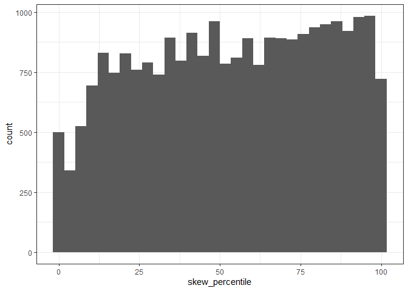
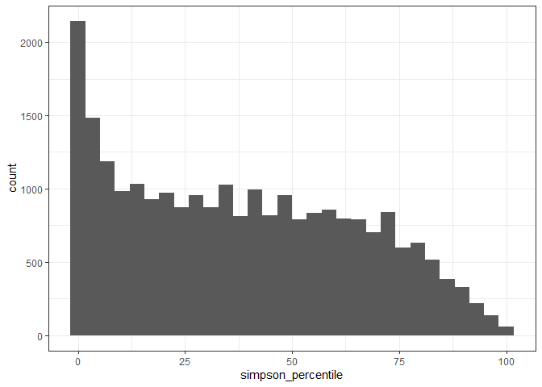

Synthesis report
================

# Datasets in S and N space

Here is where our communities fall in S and N space:

<!-- -->

Here is how that translates into the size of the feasible set:

<!-- --><!-- --><!-- -->

## All sites all sizes

    ## `stat_bin()` using `bins = 30`. Pick better value with `binwidth`.

<!-- -->

    ## `stat_bin()` using `bins = 30`. Pick better value with `binwidth`.

<!-- -->

    ## `stat_bin()` using `bins = 30`. Pick better value with `binwidth`.

<!-- -->

    ## `stat_bin()` using `bins = 30`. Pick better value with `binwidth`.

<!-- -->

## Resrict to sizes found in FIA

<!-- --><!-- -->

    ## [1] 0.965004

    ## [1] 0.9653369

96.5% of the datasets with state variables comparable to the FIA ranges
are FIA.

    ## `stat_bin()` using `bins = 30`. Pick better value with `binwidth`.

<!-- -->

    ## `stat_bin()` using `bins = 30`. Pick better value with `binwidth`.

<!-- -->

    ## `stat_bin()` using `bins = 30`. Pick better value with `binwidth`.

<!-- -->

    ## `stat_bin()` using `bins = 30`. Pick better value with `binwidth`.

<!-- -->

    ## `stat_bin()` using `bins = 30`. Pick better value with `binwidth`.

<!-- -->

    ## `stat_bin()` using `bins = 30`. Pick better value with `binwidth`.

<!-- -->

<!-- --><!-- -->

Does skew behave differently if n0 \<0 33.115452? Just from looking at
the map.

    ## # A tibble: 2 x 2
    ##   small_n prop_fia
    ##   <lgl>      <dbl>
    ## 1 FALSE      0.957
    ## 2 TRUE       0.972

    ## `stat_bin()` using `bins = 30`. Pick better value with `binwidth`.

<!-- -->

    ## `stat_bin()` using `bins = 30`. Pick better value with `binwidth`.

<!-- -->

    ## `stat_bin()` using `bins = 30`. Pick better value with `binwidth`.

<!-- -->

    ## `stat_bin()` using `bins = 30`. Pick better value with `binwidth`.

<!-- -->

# simpson

    ## `stat_bin()` using `bins = 30`. Pick better value with `binwidth`.

<!-- -->

    ## `stat_bin()` using `bins = 30`. Pick better value with `binwidth`.

<!-- -->

    ## `stat_bin()` using `bins = 30`. Pick better value with `binwidth`.

<!-- -->

    ## `stat_bin()` using `bins = 30`. Pick better value with `binwidth`.

<!-- -->

# Remove small N from all (not just fia sized)

    ## `stat_bin()` using `bins = 30`. Pick better value with `binwidth`.

<!-- -->

    ## `stat_bin()` using `bins = 30`. Pick better value with `binwidth`.

<!-- -->

# Remove fia sized from all

    ## `stat_bin()` using `bins = 30`. Pick better value with `binwidth`.

<!-- -->

    ## `stat_bin()` using `bins = 30`. Pick better value with `binwidth`.

<!-- -->

    ## `stat_bin()` using `bins = 30`. Pick better value with `binwidth`.

<!-- -->

    ## `stat_bin()` using `bins = 30`. Pick better value with `binwidth`.

<!-- -->
