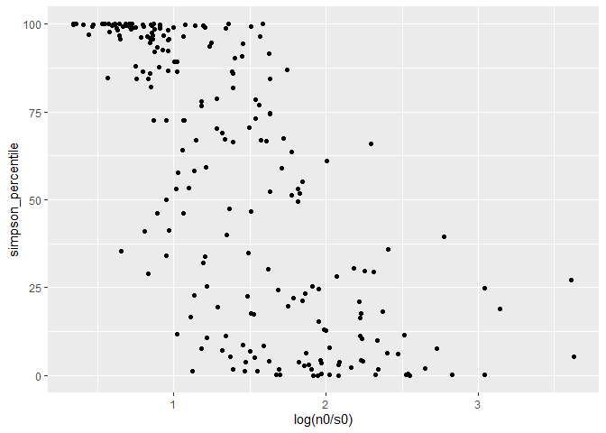
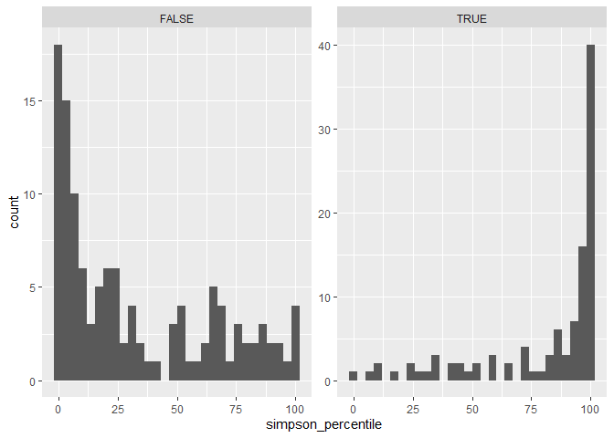

Synthesis report
================

# Datasets in S and N space

Here is where our communities fall in S and N space:

<!-- -->

Here is how that translates into the size of the feasible set:

<!-- --><!-- --><!-- -->

The small datasets are basically all FIA.

Note that the color scale is log transformed, so the largest communities
have e^331.5401042, or 9.683621310^{143}, elements in the feasible set\!

# 95 interval vs nparts

<!-- --><!-- -->

    ## Warning: Removed 10 rows containing missing values (geom_point).

<!-- -->

    ## Warning: Removed 14 rows containing missing values (geom_point).

<!-- -->

    ## Warning: Removed 92 rows containing missing values (geom_point).

<!-- -->

    ## Warning: Removed 14 rows containing missing values (geom_point).

<!-- -->

# Binned by ranked nparts and ranked 95 intervals

    ## `stat_bin()` using `bins = 30`. Pick better value with `binwidth`.

<!-- -->

    ## `stat_bin()` using `bins = 30`. Pick better value with `binwidth`.

<!-- -->

    ## `stat_bin()` using `bins = 30`. Pick better value with `binwidth`.

<!-- -->

    ## `stat_bin()` using `bins = 30`. Pick better value with `binwidth`.

<!-- -->

    ## `stat_bin()` using `bins = 30`. Pick better value with `binwidth`.

<!-- -->

    ## `stat_bin()` using `bins = 30`. Pick better value with `binwidth`.

<!-- -->

    ## Warning: Removed 10 rows containing missing values (geom_point).

<!-- -->

    ## Warning: Removed 14 rows containing missing values (geom_point).

<!-- -->

# 95 interval vs nparts

<!-- --><!-- -->

    ## Warning: Removed 10 rows containing missing values (geom_point).

<!-- -->

    ## Warning: Removed 14 rows containing missing values (geom_point).

<!-- -->

    ## Warning: Removed 92 rows containing missing values (geom_point).

<!-- -->

    ## Warning: Removed 14 rows containing missing values (geom_point).

<!-- -->

# Binned by ranked nparts and ranked 95 intervals

    ## `stat_bin()` using `bins = 30`. Pick better value with `binwidth`.

<!-- -->

    ## `stat_bin()` using `bins = 30`. Pick better value with `binwidth`.

<!-- -->

    ## `stat_bin()` using `bins = 30`. Pick better value with `binwidth`.

<!-- -->

    ## `stat_bin()` using `bins = 30`. Pick better value with `binwidth`.

<!-- -->

    ## `stat_bin()` using `bins = 30`. Pick better value with `binwidth`.

<!-- -->

    ## `stat_bin()` using `bins = 30`. Pick better value with `binwidth`.

<!-- -->

    ## Warning: Removed 10 rows containing missing values (geom_point).

<!-- -->

    ## Warning: Removed 14 rows containing missing values (geom_point).

<!-- -->

    ## `stat_bin()` using `bins = 30`. Pick better value with `binwidth`.

<!-- -->

    ## `stat_bin()` using `bins = 30`. Pick better value with `binwidth`.

<!-- -->

    ## `stat_bin()` using `bins = 30`. Pick better value with `binwidth`.

<!-- -->

    ## `stat_bin()` using `bins = 30`. Pick better value with `binwidth`.

<!-- -->

<!-- -->

    ## `stat_bin()` using `bins = 30`. Pick better value with `binwidth`.

<!-- -->
