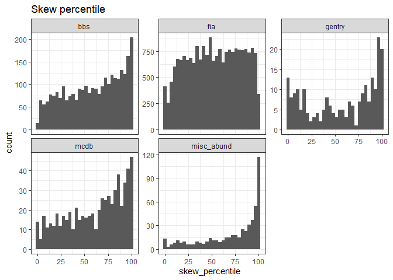
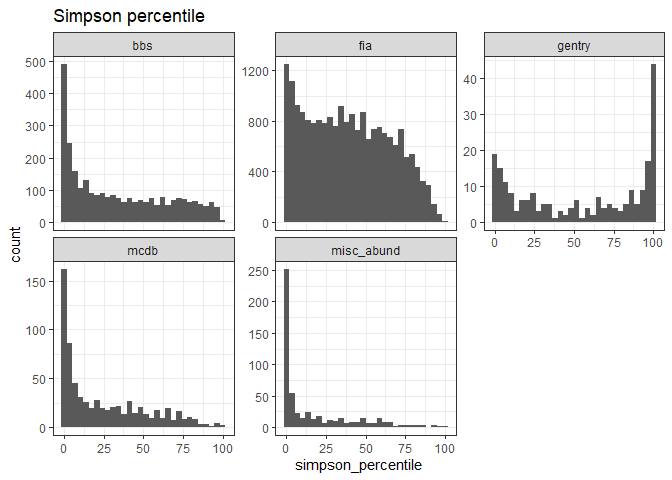

Synthesis report
================

# Datasets in S and N space

Here is where our communities fall in S and N space:

<!-- -->

Here is how that translates into the size of the feasible set:

<!-- --><!-- --><!-- -->

The small datasets are basically all FIA.

Note that the color scale is log transformed, so the largest communities
have e^331.5401042, or 9.683621310^{143}, elements in the feasible set\!

# 95 interval (one tailed) vs nparts

<!-- -->

# Overall percentile values

    ## `stat_bin()` using `bins = 30`. Pick better value with `binwidth`.

<!-- -->

    ## `stat_bin()` using `bins = 30`. Pick better value with `binwidth`.

<!-- -->

# Within the FIA size range

    ## `stat_bin()` using `bins = 30`. Pick better value with `binwidth`.
    ## `stat_bin()` using `bins = 30`. Pick better value with `binwidth`.

<!-- -->

    ## `stat_bin()` using `bins = 30`. Pick better value with `binwidth`.

    ## Warning: Removed 228 rows containing non-finite values (stat_bin).

    ## `stat_bin()` using `bins = 30`. Pick better value with `binwidth`.

    ## Warning: Removed 228 rows containing non-finite values (stat_bin).

<!-- -->

# Rarefaction

    ## Joining, by = c("dat", "site")

<!-- -->

    ## # A tibble: 2 x 2
    ##   is_fia high_skew
    ##   <chr>      <dbl>
    ## 1 fia       0.0905
    ## 2 other     0.184

    ## # A tibble: 2 x 2
    ##   is_fia low_even
    ##   <chr>     <dbl>
    ## 1 fia       0.173
    ## 2 other     0.380
