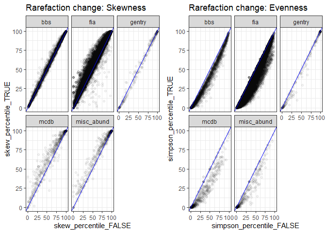

Synthesis report
================

### Datasets in S by N space

<!-- -->

### Narrowness schematic

Provisionally copied from dissertation proposal.

### Percentile histograms by dataset

<!-- --><!-- -->

### Rarefaction effect

<!-- --> \#\#\# Percentile
by S and N

<!-- -->

### FIA v other small communities

<!-- -->

    ## `summarise()` ungrouping output (override with `.groups` argument)

    ## # A tibble: 2 x 3
    ##   is_fia prop_skew_high nsites
    ##   <chr>           <dbl>  <int>
    ## 1 fia            0.0506  20299
    ## 2 other          0.0876    628

    ## `summarise()` ungrouping output (override with `.groups` argument)

    ## # A tibble: 2 x 3
    ##   is_fia prop_skew_high nsites
    ##   <chr>           <dbl>  <int>
    ## 1 fia            0.0829  10317
    ## 2 other          0.147     348

    ## `summarise()` ungrouping output (override with `.groups` argument)

    ## # A tibble: 2 x 3
    ##   is_fia prop_even_low nsites
    ##   <chr>          <dbl>  <int>
    ## 1 fia            0.114  20299
    ## 2 other          0.267    705

    ## `summarise()` ungrouping output (override with `.groups` argument)

    ## # A tibble: 2 x 3
    ##   is_fia prop_even_low nsites
    ##   <chr>          <dbl>  <int>
    ## 1 fia            0.123  10317
    ## 2 other          0.270    348

### 95 interval by S and N

<!-- -->
