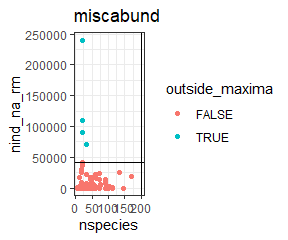
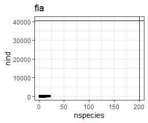
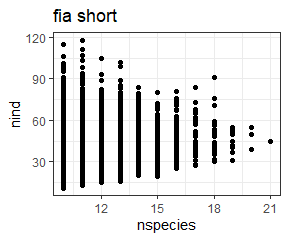
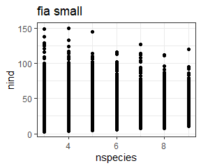

Filtering datasets
================
Renata Diaz
2020-11-30

The filtering of datasets to exclude very small or very large
communities happens at the very beginning of the analysis, when we
download and *process* the data.

The `download_data` function downloads raw data files from
<https://github.com/weecology/sad-comparison/> (for BBS, Gentry, Mammal
Community Database, and FIA) and figshare
<http://figshare.com/files/3097079> (for the Miscellaneous Abundance
Database). These raw files are stored in `working-data\abund_data` and
are not edited.

To filter, we can re-load the raw data files and go through the
filtering process step by step. In the analysis this is accomplished by
running dataset-specific filtering scripts and saving new .csvs, which
are then loaded using `load_dataset`.

We filter according to the following limitations: \* Communities with
very large numbers of individuals become computationally intractable. We
set the upper limit at 40720, because this is the largest community we
were able to sample given the available resources. This upper limit
results in the removal of a total of 6 communities across all the
datasets. \* Communities for which N = S have only 1 possible SAD. \*
Communities with only 1 species have only 1 possible SAD. \* The
Miscellaneous Abundance Database includes communities with abundances
reported as relative abundances as well as as counts. We exclude
communities with relative abundance data. \* We additionally filter the
FIA dataset, because it has many more communities than any other dataset
and sampling all of them overwhelms our computational pipeline. We
include all communities with more than 10 species (10,000), and an
additional, randomly selected, 10,000 (of a remaining 90,000) with 3-10
species. \* Communities with only 2 species are removed from analyses
for skewness, because `e1071::skewness()` always evaluates to 0 for a
vector of length 2.

### BBS

``` r
bbs <- read.csv(here::here("working-data", "abund_data", "bbs_spab.csv"),  stringsAsFactors = F, header = F, skip = 2)

colnames(bbs) <- c("site", "year", "species", "abund")


bbs_statevars <- bbs %>%
  group_by(site) %>%
  summarize(
    nyears = length(unique(year)),
    nspecies = dplyr::n(),
    nind = sum(abund)
  )

ggplot(bbs_statevars, aes(nspecies, nind)) +
  geom_point() +
  ggtitle("BBS")
```

<!-- -->

``` r
unique(bbs_statevars$nyears)
```

    ## [1] 1

``` r
range(bbs_statevars$nspecies)
```

    ## [1]  8 81

``` r
range(bbs_statevars$nind)
```

    ## [1]   32 3504

All communities in BBS are used.

### Gentry

``` r
gentry <- read.csv(here::here("working-data", "abund_data", "gentry_spab.csv"),  stringsAsFactors = F, header = F, skip = 2)

colnames(gentry) <- c("site", "year", "species", "abund")


gentry_statevars <- gentry %>%
  group_by(site) %>%
  summarize(
    nyears = length(unique(year)),
    nspecies = dplyr::n(),
    nind = sum(abund)
  ) 

ggplot(gentry_statevars, aes(nspecies, nind)) +
  geom_point() +
  ggtitle("gentry")
```

<!-- -->

``` r
range(gentry_statevars$nspecies)
```

    ## [1]   2 250

``` r
range(gentry_statevars$nind)
```

    ## [1]  41 779

``` r
sum(gentry_statevars$nspecies == 2)
```

    ## [1] 1

All Gentry communities are kept. However, 1 site only has 2 species and
will be removed from skewness analyses later in the pipeline.

### Mammal Community Database

``` r
mcdb <- read.csv(here::here("working-data", "abund_data", "mcdb_spab.csv"), stringsAsFactors = F, header = F, skip = 2)

colnames(mcdb) <- c("site", "year", "species", "abund")

mcdb_statevars <- mcdb %>%
  group_by(site) %>%
  summarize(
    nspecies = dplyr::n(),
    nind = sum(abund)
  )

ggplot(mcdb_statevars, aes(nspecies, nind)) +
  geom_point() +
  geom_hline(yintercept = 40720) +
  geom_vline(xintercept = 200) +
  ggtitle("mcdb")
```

<!-- -->

``` r
range(mcdb_statevars$nspecies)
```

    ## [1]  1 34

``` r
range(mcdb_statevars$nind)
```

    ## [1]     1 10085

38 communities are removed because they have only one species.
Additionally, 79 have 2 species and will be removed from skewness
analyses. These removals happen post-pipeline.

### Miscellaneous Abundance Database

``` r
miscabund <- read.csv(here::here("working-data", "abund_data", "misc_abund_spab.csv"))

miscabund <- miscabund %>%
  dplyr::rename(site = Site_ID,
                abund = Abundance)


miscabund_statevars <- miscabund %>%
  group_by(site) %>%
  summarize(
    nspecies = dplyr::n(),
    nind = sum(abund),
    nind_na_rm=sum(abund, na.rm = T)
  ) %>%
  mutate(outside_maxima = (nind_na_rm > 40720))

ggplot(miscabund_statevars, aes(nspecies, nind_na_rm, color = outside_maxima)) +
  geom_point() +
  geom_hline(yintercept = 40720) +
  geom_vline(xintercept = 200) +
  ggtitle("miscabund")
```

<!-- -->

``` r
sum(is.na(miscabund_statevars$nind))
```

    ## [1] 130

``` r
# how many of those have 0

nrow(filter(miscabund_statevars, is.na(nind), nind_na_rm == 0))
```

    ## [1] 124

``` r
filter(miscabund_statevars, is.na(nind), nind_na_rm >0 )
```

<div class="kable-table">

| site | nspecies | nind | nind\_na\_rm | outside\_maxima |
| ---: | -------: | ---: | -----------: | :-------------- |
|  144 |       46 |   NA |            8 | FALSE           |
|  145 |       46 |   NA |            6 | FALSE           |
|  146 |       46 |   NA |            6 | FALSE           |
|  147 |       46 |   NA |            5 | FALSE           |
|  178 |       42 |   NA |         1945 | FALSE           |
|  446 |      170 |   NA |        18866 | FALSE           |

</div>

Misc abund has `{r} sum(miscabund_statevars$outside_maxima, na.rm =T)`
communities that get removed. They are all removed because they have
high numbers of individiuals.

There are 130 datasets where there are a mixture of relative and count
abundances included. of those, 124 have 0 individuals in the count.
THose were not included. There were **6** that have a mixutre and a
nonzero number counted. These were INCLUDED in the initial analysis,
with relative abundance species completely removed. Upon realizing this
we remove these 6 communities from the final analysis. Rather than
re-run the whole pipeline, we manually remove them when we load the data
to make the histograms and summary tables (see manuscript\_main.Rmd).

### FIA

``` r
fia <- read.csv(here::here("working-data", "abund_data", "fia_spab.csv"), stringsAsFactors = F, header = F, skip = 2)

colnames(fia) <- c("site", "year", "species", "abund")

fia_statevars <- fia %>%
  group_by(site) %>%
  summarize(
    nspecies = dplyr::n(),
    nind = sum(abund),
    nind_na_rm=sum(abund, na.rm = T)
  ) 


ggplot(fia_statevars, aes(nspecies, nind)) +
  geom_point() +
  geom_hline(yintercept = 40720) +
  geom_vline(xintercept = 200) +
  ggtitle("fia")
```

<!-- -->

FIA has no extremely large datasets. However, it has 103343 communities,
of which 92988 have fewer than 10 species. This many communities
overwhelms our computational pipeline. We therefore sample all 10355
communities with 10 or more species, and a random subsample of 10,000
communities with 3-9 species. We then run these through the pipeline as
two separate databases. `fia_short` is the communities with 10 or more
species, and `fia_small` is the 10,000 communities with 3-9 species.

To go through this we re-load FIA using load\_dataset, so we can get the
`site` column in the correct format and order such that it will
replicate when we run sample.

``` r
fia <- load_dataset("fia")

fia_sv_short <- get_statevars(fia) %>%
    dplyr::filter(s0 >= 10)

fia_short <- fia %>%
  dplyr::filter(site %in% fia_sv_short$site) %>%
  dplyr::mutate(dat = "fia_short")

fia_short_statevars <- fia_short %>%
  group_by(site) %>%
  summarize(
    nspecies = dplyr::n(),
    nind = sum(abund),
    nind_na_rm=sum(abund, na.rm = T)
  ) %>%
  mutate(site = as.numeric(site))

ggplot(fia_short_statevars, aes(nspecies, nind)) +
  geom_point() +
  ggtitle("fia short")
```

<!-- -->

``` r
fia_sv_small <- get_statevars(fia) %>%
  dplyr::filter(s0 >= 3) %>%
  dplyr::filter(s0 <= 9)

  set.seed(1977)
  fia_sv_small <- fia_sv_small[ sample.int(nrow(fia_sv_small), size = 10000, replace = F), ]


fia_small <- fia %>%
  dplyr::filter(site %in% fia_sv_small$site) %>%
  dplyr::mutate(dat = "fia_small")

fia_small_statevars <-fia_small  %>%
  group_by(site) %>%
  summarize(
    nspecies = dplyr::n(),
    nind = sum(abund),
    nind_na_rm=sum(abund, na.rm = T)
  )  %>%
  mutate(site = as.numeric(site))

ggplot(fia_small_statevars, aes(nspecies, nind)) +
  geom_point() +
  ggtitle("fia small")
```

<!-- -->

``` r
fia_small_loaded <- load_dataset("fia_small")

setdiff(fia_small_loaded$site, fia_small$site)
```

    ## character(0)

``` r
all_statevars <- miscabund_statevars %>%
  select(-nind) %>%
  rename(nind = nind_na_rm) %>%
  bind_rows(bbs_statevars, fia_short_statevars, fia_small_statevars, gentry_statevars, mcdb_statevars) %>%
  mutate(one_species = nspecies == 1,
         two_species = nspecies == 2,
         n_equals_s = nspecies == nind)
```

Overall there are 38 removed at the end because they have just 1
species. There are 80 that will be removed from skewness because they
ahve 2 species. There are 79 that are removed because N = S.

Note that, in practice, many more small ones end up getting removed
because they have very few possible SADs and very few unique values for
skewness and evenness.
