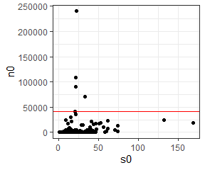

Filtering datasets
================
Renata Diaz
2020-11-28

The filtering of datasets to exclude very small or very large
communities happens at the very beginning of the analysis, when we
download and *process* the data.

``` r
bbs <- read.csv(here::here("working-data", "abund_data", "bbs_spab.csv"),  stringsAsFactors = F, header = F, skip = 2)

colnames(bbs) <- c("site", "year", "species", "abund")


bbs_statevars <- bbs %>%
  group_by(site) %>%
  summarize(
    nyears = length(unique(year)),
    nspecies = dplyr::n(),
    nind = sum(abund)
  )

ggplot(bbs_statevars, aes(nspecies, nind)) +
  geom_point() +
  geom_hline(yintercept = 40720) +
  geom_vline(xintercept = 200) +
  ggtitle("BBS")
```

<!-- -->

``` r
unique(bbs_statevars$nyears)
```

    ## [1] 1

No communities in BBS are outside the maxima. All communities (in this
dataset) are only represnted with 1 year.

``` r
gentry <- read.csv(here::here("working-data", "abund_data", "gentry_spab.csv"),  stringsAsFactors = F, header = F, skip = 2)

colnames(gentry) <- c("site", "year", "species", "abund")


gentry_statevars <- gentry %>%
  group_by(site) %>%
  summarize(
    nyears = length(unique(year)),
    nspecies = dplyr::n(),
    nind = sum(abund)
  ) %>%
  mutate(outside_maxima = (nspecies > 200) | (nind > 40720))

ggplot(gentry_statevars, aes(nspecies, nind, color = outside_maxima)) +
  geom_point() +
  geom_hline(yintercept = 40720) +
  geom_vline(xintercept = 200) +
  ggtitle("gentry")
```

<!-- -->

Gentry has 0 communities, out of 20135 communities, outside the maxima.
RMD just realized, I left these in because they are still sample-able -
they have sufficiently low N.

``` r
miscabund <- read.csv(here::here("working-data", "abund_data", "misc_abund_spab.csv"))

    miscabund <- miscabund %>%
      dplyr::rename(site = Site_ID,
                    abund = Abundance)

    
miscabund_statevars <- miscabund %>%
  group_by(site) %>%
  summarize(
    nspecies = dplyr::n(),
    nind = sum(abund),
    nind_na_rm=sum(abund, na.rm = T)
  ) %>%
  mutate(outside_maxima = (nspecies > 200) | (nind > 40720))


ggplot(miscabund_statevars, aes(nspecies, nind, color = outside_maxima)) +
  geom_point() +
  geom_hline(yintercept = 40720) +
  geom_vline(xintercept = 200) +
  ggtitle("miscabund")
```

<!-- -->

``` r
sum(is.na(miscabund_statevars$nind))
```

    ## [1] 130

``` r
# how many of those have 0

nrow(filter(miscabund_statevars, is.na(nind), nind_na_rm == 0))
```

    ## [1] 124

``` r
filter(miscabund_statevars, is.na(nind), nind_na_rm >0 )
```

<div class="kable-table">

| site | nspecies | nind | nind\_na\_rm | outside\_maxima |
| ---: | -------: | ---: | -----------: | :-------------- |
|  144 |       46 |   NA |            8 | NA              |
|  145 |       46 |   NA |            6 | NA              |
|  146 |       46 |   NA |            6 | NA              |
|  147 |       46 |   NA |            5 | NA              |
|  178 |       42 |   NA |         1945 | NA              |
|  446 |      170 |   NA |        18866 | NA              |

</div>

Misc abund has `{r} sum(miscabund_statevars)$outside_maxima, na.rm =T)`
communities that get removed. They are all removed because they have
high numbers of individiuals.

There are 130 datasets where there are a mixture of relative and count
abundances included. of those, 124 have 0 individuals in the count.
THose were not included. There were **6** that have a mixutre and a
nonzero number counted. These were INCLUDED in the initial analysis,
with relative abundance species completely removed.

``` r
miscabund_within <- miscabund_statevars %>%
  filter(nspecies <= 200, nind <= 40720)

miscabund_filtered <- load_dataset("misc_abund_short")

miscabund_sites <- unique(miscabund_within$site)
miscabund_filtered_sites <- unique(miscabund_filtered$site)

included_sites <- as.numeric(miscabund_filtered_sites)

setdiff(included_sites, miscabund_sites)
```

    ## [1] 144 145 146 147 178 446
