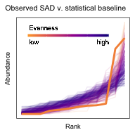

Graphical abstract
================
2021-04-22

    ## Joining, by = c("sim", "source", "dat", "site", "singletons", "s0", "n0", "nparts")

<!-- -->

While the classic “hollow curve” form of the SAD emerges from randomly
dividing individuals between species, observed SADs are consistently
much more uneven than the majority of forms that emerge at random. These
deviations between observations and the statistical baseline may reflect
biological processes shaping the SAD, and provide new leverage for using
the SAD to evaluate and refine ecological theory.
