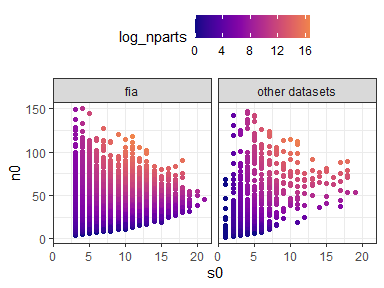
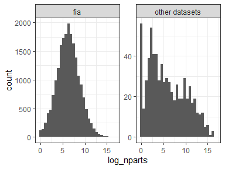

Effect of \< v \<= in percentile definition
================
Renata Diaz
2020-08-05

You can define the %ile score as either

  - the % of values in a comparison vector that are **less than** a
    focal value
  - the % of values that are **less than or equal to** that value

You see both definitions out in the world.

When I initially coded up the analysis, I used **\<**. I didn’t think
about it much and as I was writing the manuscript I wrote **\<=**. So
that got me curious if it matters.

It *should not* matter too much as long as there are many unique values
in the comparison vector. However, if there are only a handful, and the
focal value is equal to an element of the comparison vector, using \<=
will cause the score to jump up. The jumps will be in increments of
100/n, with n the number of elements in the comparison vector. Meaning
if there is only one value, \< will give a score of 0 and \<= will give
a score of 100\! And if there are ties, and the focal value is equal to
the tie value, the jump will be (100 / n) \* m, with m the number of
elements in the comparison vector equal to the tie value.

#### Demo with toy data

``` r
percentile_lt <- function(focal, comparison) {
  100 * (sum(comparison < focal) / length(comparison))
}

percentile_ltet <- function(focal, comparison) {
  100 * (sum(comparison <= focal) / length(comparison))
}


# Many values

many <- seq(1, 100, by = .1)

focal <- runif(1, 1, 100)
focal <- round(focal, 1) # rounding so focal == a value in many

percentile_lt(focal, many)
```

    ## [1] 7.063572

``` r
percentile_ltet(focal, many) 
```

    ## [1] 7.16448

``` r
# A few values
few <- seq(1, 101, by = 20)

focal <- ceiling(focal / 20) * 20 + 1 # again, rounding so focal == a value in few 

percentile_lt(focal, few)
```

    ## [1] 16.66667

``` r
percentile_ltet(focal, few)
```

    ## [1] 33.33333

``` r
# A few values with ties
few_with_ties <- c(seq(1, 81, by = 20), 41)

focal <- 41 # if focal == tie value, you get the largest possible jump

percentile_lt(focal, few_with_ties)
```

    ## [1] 33.33333

``` r
percentile_ltet(focal, few_with_ties)
```

    ## [1] 66.66667

``` r
# Just one value

one <- runif(1, 1, 100)

focal <- one # if there is only 1 element in one, focal MUST be that element

percentile_lt(focal, one)
```

    ## [1] 0

``` r
percentile_ltet(focal, one)
```

    ## [1] 100

### For our purposes

We can expect using \<= to give us, if anything, higher percentile
scores. We can expect this effect to be more pronounced for
distributions with relatively few unique values. This is probably
strongly correlated with the number of unique elements in the feasible
set and the number of unique samples we found from the feasible set, but
is not necessarily identical to it because two unique samples can have
the same values for skewness or evenness. This will create **ties**,
which can cause quite large jumps.

If the comparison vector is short, and/or has repeated values, we may
get noticeably higher scores using \<= than using \<. Usually I think
being short has a larger effect than having ties - unless you have a
very long vector that is all ties, which doesn’t happen in this context.
Being short also makes ties more impactful.

Especially if the feasible set is small, the focal value is guaranteed
to be an element of the comparison vector. That is because the
comparison vector, for small FS, is an exhaustive account of all
possible values for the focal value.

#### Change in %ile score

##### Skewness

<!-- --><!-- -->

For skewness,

  - Jumps occur and can be quite large, including jumps from 0 to 100\!
      - Using \< or \<= could qualitatively change our interpretation of
        whether we see overrepresentation in the extremes
      - Because the one-tail for skewness is asking whether observed
        values are usually **higher** than the comparison vectors, using
        **\<=** will give us a **stronger** apparent effect
  - Jumps occur only when the number of samples is low - for the most
    part, well below 500 and usually below 150 (vertical line on right
    graph).
      - So \< vs \<= is mostly likely to be important for small FS
          - (The number of samples is strongly correlated with the size
            of the FS, up to a threshold. Currently running an update to
            `pull_di` to see how the size of FS and \# samples is
            correlated to the \# unique values in the comparison
            vectors.)

##### Evenness

<!-- --><!-- -->

For evenness, we see the same general outcome as for skewness. However,

  - The one-tail for evenness is asking whether the observed values are
    **lower** than the comparison. So using \<= will tend to weaken the
    effect we perceive.
  - The jumps for evenness are confined to even smaller numbers of
    samples than skewness.
      - My intuition is that this is because you tend to get ties more
        often with skewness than with evenness (skewness is a little bit
        of a strange creature). But I haven’t confirmed this.

#### The conservative option

While both \<= and \< are valid more generally, I think there may be
reasoning to prefer one over the other in this context.

Specifically, we want to know how *weird* the observation is. If the
observation is equal to a very common value in the comparison vector,
it’s *not that weird*. So we don’t want all those ties to count as
values that the observation is more extreme than.

Because we are using less than, and the question for skewness is whether
the observation is unusually *high*, the conservative approach for
skewness is to use **\<**. This will not allow an observation that
matches a common tie value to count as more extreme than the ties.

The question for evenness is whether the observation is unusually low.
If the observation is equal to a common tie value, using \< will put the
observation just to the left of those ties, effectively. It will be
driven artificially low. Using \<=, however, will count those tie
elements as values to the left of the observation, and make it look less
extreme. Which it is, if it matches all those ties.

So using \< for skewness and \<= for evenness gives us an appropriately
conservative estimate of how weird the focal values are in the case
where the focal values match common ties in the comparison vectors.

I am not sure if this logic really addresses the scenario where the
comparison vectors do not have ties, but are quite short. My intuition
there is that extremely short vectors - roughly on a scale of fewer than
20-100 values - are not very informative in this framework. Using \<=
and \< for skew and even, respectively, is still the conservative tack
in terms of detecting deviations.

Also, the impact on “statistical significance” is strongest for very
short vectors. That is because, in the absence of ties, the jump
increment is 100/n, with n the length of the comparison vector. If we
define significance using an arbitrary cutoff of being more extreme than
95% of comparison values, then for the jump to matter it must get you
from below 95 to 95 (for skew) or from above 5 to 5 (for even). If there
are even 100 values in the comparison vector, the jump should only
affect observations landing at the 94th or 6th percentiles. If there are
fewer, it becomes more problematic: if there are only 5 values, using
the more generous condition will move you from a score of 80 to a score
of 100. But if there are only 5 values, this approach is almost
certainly not appropriate anyway….(I can’t prove it, but I don’t think 5
is enough to define an attractor…\!)

#### Effects on results

##### Overall results

Here are the overall result histograms and tables using \< and \<=…

###### Skew

<!-- --><!-- -->

    ## `summarise()` ungrouping output (override with `.groups` argument)

<div class="kable-table">

| dat         | prop\_skew\_high\_ltet | prop\_skew\_high\_lt | n\_skew\_sites |
| :---------- | ---------------------: | -------------------: | -------------: |
| bbs         |              0.1301839 |            0.1301839 |           2773 |
| fia         |              0.0694752 |            0.0488790 |          20295 |
| gentry      |              0.1883408 |            0.1883408 |            223 |
| mcdb        |              0.1672131 |            0.1393443 |            610 |
| misc\_abund |              0.3389199 |            0.3165736 |            537 |

</div>

###### Evenness

<!-- --><!-- -->

    ## `summarise()` ungrouping output (override with `.groups` argument)

<div class="kable-table">

| dat         | prop\_even\_low\_ltet | prop\_even\_low\_lt | n\_even\_sites |
| :---------- | --------------------: | ------------------: | -------------: |
| bbs         |             0.2596466 |           0.2596466 |           2773 |
| fia         |             0.0844543 |           0.1113575 |          20295 |
| gentry      |             0.1517857 |           0.1517857 |            224 |
| mcdb        |             0.2713287 |           0.3888112 |            715 |
| misc\_abund |             0.5270758 |           0.5667870 |            554 |

</div>

**Generally**, we do not see a big difference between \< and \<= for the
overall results. We see the biggest changes for FIA and MCDB: - For FIA,
using the more conservative option (\< for skew and \<= for even)
reduces the % of extreme observations from 7 to 5 for skew and from 11
to 8 for even. - For MCDB, the reductions are from 16 to 14 for skew and
from 39 to 27 for even.

These datasets have the greatest representation of smallish sites. Which
leads us to…

##### Results for small (FIA sized) communities

This is most likely to matter for small communities with small FS.

Here are the results when we try to tell whether FIA communities differ
qualitatively from similarly-sized communities from other datasets…

###### Small sites

Note that, even for small sites, “other datasets” are generally larger
than FIA….

<!-- --><!-- -->

###### Skew for small sites

<!-- --><!-- -->

    ## `summarise()` ungrouping output (override with `.groups` argument)

<div class="kable-table">

| fia\_yn        | prop\_skew\_high\_ltet | prop\_skew\_high\_lt | n\_skew\_sites |
| :------------- | ---------------------: | -------------------: | -------------: |
| fia            |              0.0694752 |             0.048879 |          20295 |
| other datasets |              0.1314387 |             0.079929 |            563 |

</div>

###### Evenness

<!-- --><!-- -->

    ## `summarise()` ungrouping output (override with `.groups` argument)

<div class="kable-table">

| fia\_yn        | prop\_even\_low\_ltet | prop\_even\_low\_lt | n\_even\_sites |
| :------------- | --------------------: | ------------------: | -------------: |
| fia            |             0.0844543 |           0.1113575 |          20295 |
| other datasets |             0.1493411 |           0.3045388 |            683 |

</div>

For these comparisons, - For skewness, the effect is weak for both FIA
and not-FIA (5% and 8% in the extremes, respectively) - For evenness,
the effect is much stronger for not-FIA (8 vs 15%) - \< vs \<= matters
quite a bit - Many of these sites can be quite small. Since we flagged a
concern about having fewer than, arbitrarily, 100 elements, let’s remove
those:

###### Skew for small sites, removing very small

<!-- --><!-- -->

    ## `summarise()` ungrouping output (override with `.groups` argument)

<div class="kable-table">

| fia\_yn        | prop\_skew\_high\_ltet | prop\_skew\_high\_lt | n\_skew\_sites |
| :------------- | ---------------------: | -------------------: | -------------: |
| fia            |              0.0662983 |            0.0636017 |          15204 |
| other datasets |              0.1277174 |            0.1222826 |            368 |

</div>

###### Evenness

<!-- --><!-- -->

    ## `summarise()` ungrouping output (override with `.groups` argument)

<div class="kable-table">

| fia\_yn        | prop\_even\_low\_ltet | prop\_even\_low\_lt | n\_even\_sites |
| :------------- | --------------------: | ------------------: | -------------: |
| fia            |              0.101618 |           0.1051697 |          15204 |
| other datasets |              0.250000 |           0.2527174 |            368 |

</div>

Removing sites with fewer than 100 elements in the feasible set

  - *eliminates the difference between \<= and \<*
  - We see a difference between FIA and other datasets
      - For skew, 6 vs 12% in the extremes
      - For even, 10 vs 25% in the extremes

I am skeptical of these comparisons. It may be that FIA is behaving
qualitatively differently, but it may also be that, because the other
datasets are less concentrated at *very small* FS, the effect of FS size
still drives the difference even when we filter like this. On the
strength of this filtering I’m not confident arguing *either* that FIA
is qualitatively different, independent of size, or that these subsets
are behaving the same.

I think a stronger comparison would be to break into size classes based
on the number of parts.
