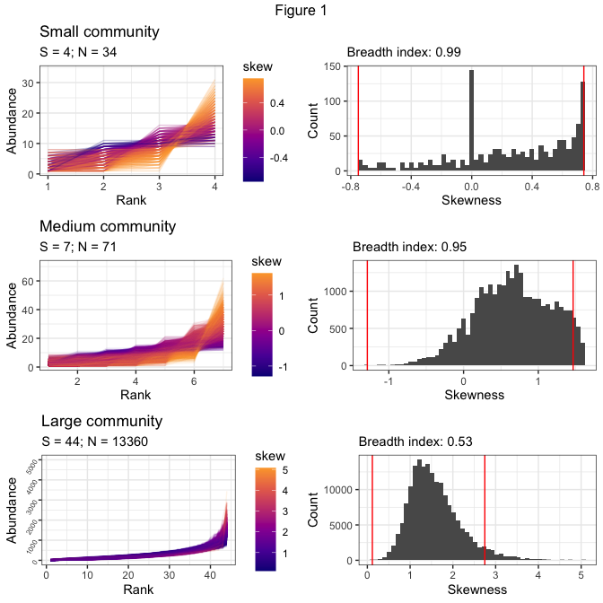
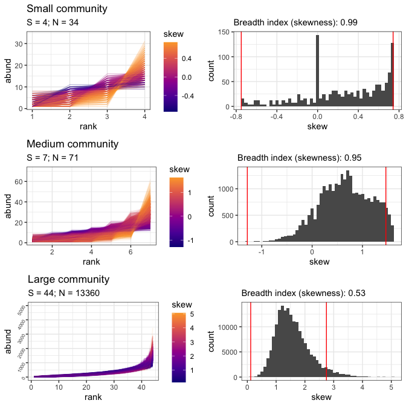
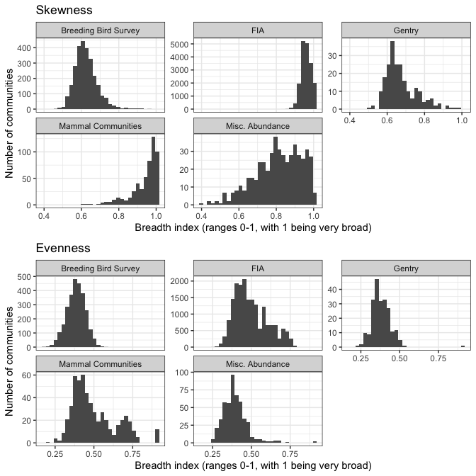
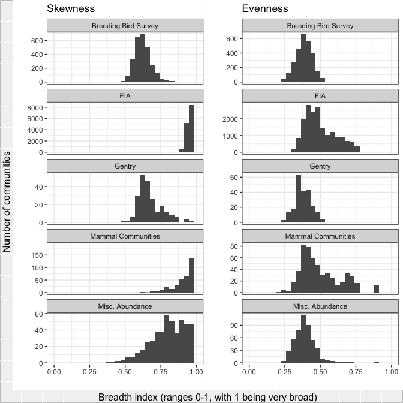
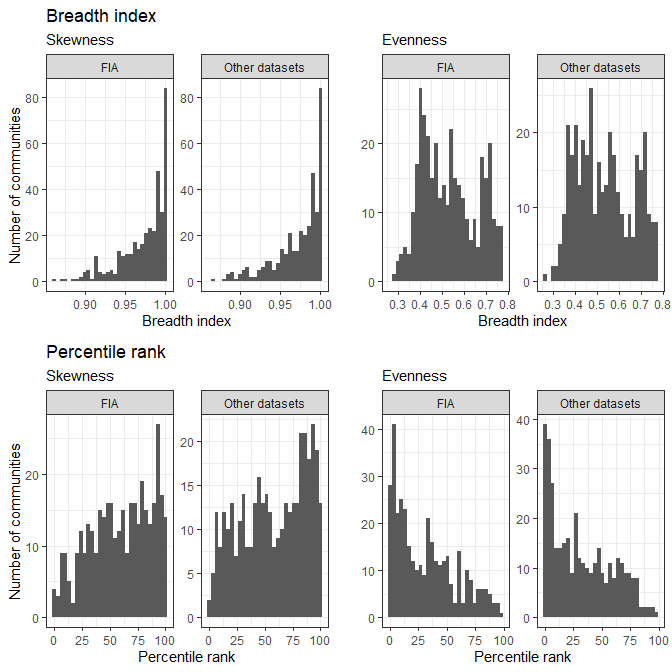
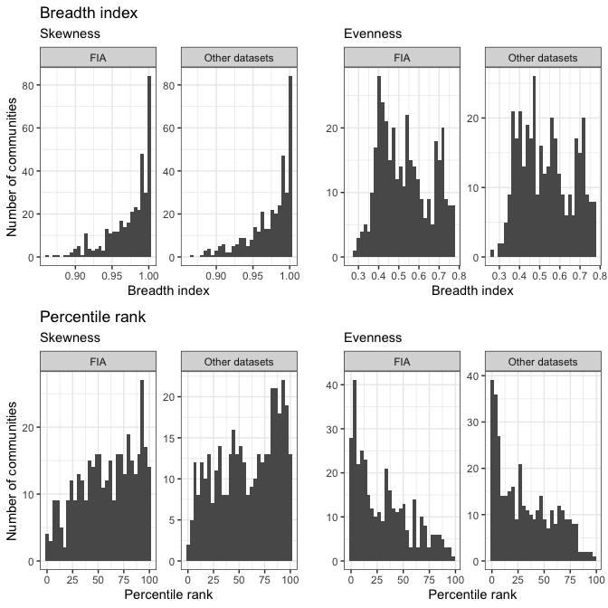

Figures and results for main manuscript
================
Renata Diaz
2021-01-21

# Illustrations of 95% interval (Figure 1)

To show the 95% interval, we need to load the distribution of shape
metric values from the samples from the feasible set for a few
communities. See rov\_metric.md.

    ## Joining, by = c("sim", "source", "dat", "site", "singletons", "s0", "n0", "nparts")

    ## Joining, by = c("dat", "site", "s0", "n0", "nparts")

    ## Joining, by = c("sim", "source", "dat", "site", "singletons", "s0", "n0", "nparts")

    ## Joining, by = c("dat", "site", "s0", "n0", "nparts")

    ## Joining, by = c("sim", "source", "dat", "site", "singletons", "s0", "n0", "nparts")

    ## Joining, by = c("dat", "site", "s0", "n0", "nparts")

    ## Warning: Removed 1 rows containing non-finite values (stat_bin).
    
    ## Warning: Removed 1 rows containing non-finite values (stat_bin).

    ## Warning: Removed 1 row(s) containing missing values (geom_path).

    ## Warning: Removed 1 rows containing non-finite values (stat_bin).

<!-- --><!-- -->

# Skewness and evenness histograms by dataset (Figure 2)

<!-- -->

# Breadth index by dataset (Figure 3)

    ## `stat_bin()` using `bins = 30`. Pick better value with `binwidth`.

    ## Warning: Removed 10 rows containing missing values (geom_bar).

    ## `stat_bin()` using `bins = 30`. Pick better value with `binwidth`.

    ## Warning: Removed 10 rows containing missing values (geom_bar).

<!-- --><!-- -->

# Comparison of FIA and comparably sized communities (Figure 4)

    ## Warning in ks.test(simpson_ks$simpson_95_ratio_1t_FIA,
    ## simpson_ks$`simpson_95_ratio_1t_Other datasets`): p-value will be approximate in
    ## the presence of ties

    ## Warning in ks.test(simpson_ks$simpson_percentile_FIA,
    ## simpson_ks$`simpson_percentile_Other datasets`): p-value will be approximate in
    ## the presence of ties

    ## 
    ##  Two-sample Kolmogorov-Smirnov test
    ## 
    ## data:  simpson_ks$simpson_95_ratio_1t_FIA and simpson_ks$`simpson_95_ratio_1t_Other datasets`
    ## D = 0.041783, p-value = 0.9126
    ## alternative hypothesis: two-sided

    ## 
    ##  Two-sample Kolmogorov-Smirnov test
    ## 
    ## data:  simpson_ks$simpson_percentile_FIA and simpson_ks$`simpson_percentile_Other datasets`
    ## D = 0.044568, p-value = 0.8681
    ## alternative hypothesis: two-sided

    ## Warning in ks.test(skewness_ks$skew_95_ratio_1t_FIA,
    ## skewness_ks$`skew_95_ratio_1t_Other datasets`): p-value will be approximate in
    ## the presence of ties

    ## Warning in ks.test(skewness_ks$skew_percentile_FIA,
    ## skewness_ks$`skew_percentile_Other datasets`): p-value will be approximate in
    ## the presence of ties

    ## 
    ##  Two-sample Kolmogorov-Smirnov test
    ## 
    ## data:  skewness_ks$skew_95_ratio_1t_FIA and skewness_ks$`skew_95_ratio_1t_Other datasets`
    ## D = 0.02973, p-value = 0.9967
    ## alternative hypothesis: two-sided

    ## 
    ##  Two-sample Kolmogorov-Smirnov test
    ## 
    ## data:  skewness_ks$skew_percentile_FIA and skewness_ks$`skew_percentile_Other datasets`
    ## D = 0.067568, p-value = 0.367
    ## alternative hypothesis: two-sided

    ## `stat_bin()` using `bins = 30`. Pick better value with `binwidth`.
    ## `stat_bin()` using `bins = 30`. Pick better value with `binwidth`.
    ## `stat_bin()` using `bins = 30`. Pick better value with `binwidth`.
    ## `stat_bin()` using `bins = 30`. Pick better value with `binwidth`.

<!-- --><!-- -->

    ## Warning: Removed 1 rows containing non-finite values (stat_bin).
    
    ## Warning: Removed 1 rows containing non-finite values (stat_bin).

    ## Warning: Removed 1 row(s) containing missing values (geom_path).

    ## Warning: Removed 1 rows containing non-finite values (stat_bin).

    ## quartz_off_screen 
    ##                 2

    ## quartz_off_screen 
    ##                 2

    ## `stat_bin()` using `bins = 30`. Pick better value with `binwidth`.

    ## Warning: Removed 10 rows containing missing values (geom_bar).

    ## `stat_bin()` using `bins = 30`. Pick better value with `binwidth`.

    ## Warning: Removed 10 rows containing missing values (geom_bar).

    ## quartz_off_screen 
    ##                 2

    ## `stat_bin()` using `bins = 30`. Pick better value with `binwidth`.
    ## `stat_bin()` using `bins = 30`. Pick better value with `binwidth`.
    ## `stat_bin()` using `bins = 30`. Pick better value with `binwidth`.
    ## `stat_bin()` using `bins = 30`. Pick better value with `binwidth`.

    ## quartz_off_screen 
    ##                 2
