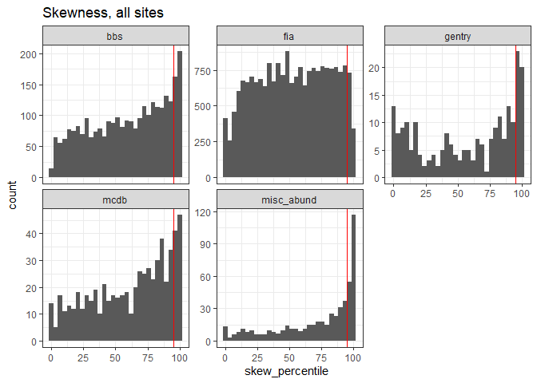
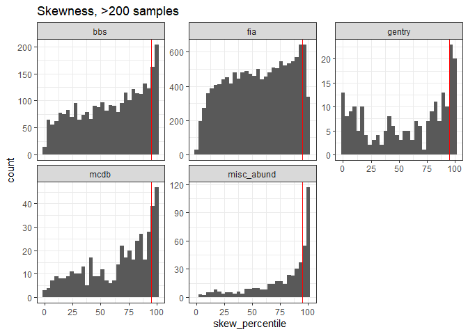
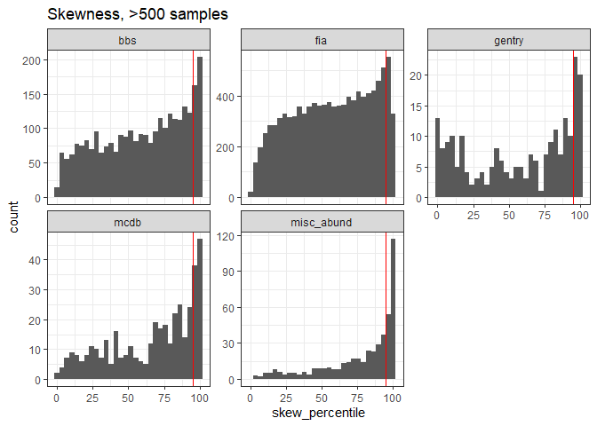
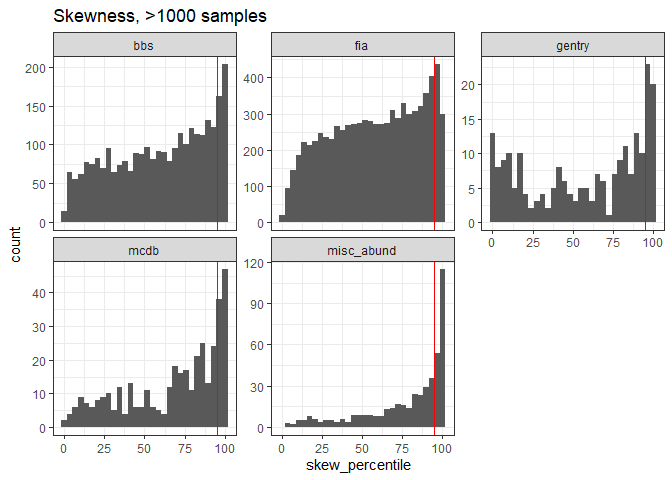
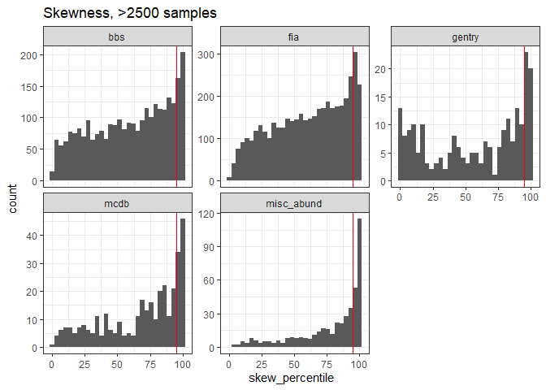
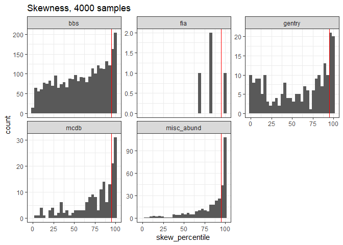

Figures and results for main manuscript
================

# Final dataset in S and N space

<!-- -->

# Illustrations of 95% interval

To show the 95% interval, we need to load the distribution of shape
metric values from the samples from the feasible set for a few
communities.

# Skewness and evenness histograms by dataset

    ## `stat_bin()` using `bins = 30`. Pick better value with `binwidth`.

<!-- -->

    ## `stat_bin()` using `bins = 30`. Pick better value with `binwidth`.

<!-- -->

    ## `stat_bin()` using `bins = 30`. Pick better value with `binwidth`.

<!-- -->

    ## `stat_bin()` using `bins = 30`. Pick better value with `binwidth`.

<!-- -->

    ## `stat_bin()` using `bins = 30`. Pick better value with `binwidth`.

<!-- -->

    ## `stat_bin()` using `bins = 30`. Pick better value with `binwidth`.

<!-- --> \# Nsamples
cutoff

    ## `summarise()` ungrouping output (override with `.groups` argument)
    ## `summarise()` ungrouping output (override with `.groups` argument)

    ## Joining, by = c("dat", "nsamples_cutoff")

    ## `summarise()` ungrouping output (override with `.groups` argument)
    ## `summarise()` ungrouping output (override with `.groups` argument)

    ## Joining, by = c("dat", "nsamples_cutoff")

    ## `summarise()` ungrouping output (override with `.groups` argument)
    ## `summarise()` ungrouping output (override with `.groups` argument)

    ## Joining, by = c("dat", "nsamples_cutoff")

    ## `summarise()` ungrouping output (override with `.groups` argument)
    ## `summarise()` ungrouping output (override with `.groups` argument)

    ## Joining, by = c("dat", "nsamples_cutoff")

    ## `summarise()` ungrouping output (override with `.groups` argument)
    ## `summarise()` ungrouping output (override with `.groups` argument)

    ## Joining, by = c("dat", "nsamples_cutoff")

    ## `summarise()` ungrouping output (override with `.groups` argument)
    ## `summarise()` ungrouping output (override with `.groups` argument)

    ## Joining, by = c("dat", "nsamples_cutoff")

    ## `summarise()` ungrouping output (override with `.groups` argument)
    ## `summarise()` ungrouping output (override with `.groups` argument)

    ## Joining, by = c("dat", "nsamples_cutoff")

    ## `summarise()` ungrouping output (override with `.groups` argument)
    ## `summarise()` ungrouping output (override with `.groups` argument)

    ## Joining, by = c("dat", "nsamples_cutoff")

    ## `summarise()` ungrouping output (override with `.groups` argument)
    ## `summarise()` ungrouping output (override with `.groups` argument)

    ## Joining, by = c("dat", "nsamples_cutoff")

    ## `summarise()` ungrouping output (override with `.groups` argument)
    ## `summarise()` ungrouping output (override with `.groups` argument)

    ## Joining, by = c("dat", "nsamples_cutoff")

    ## `summarise()` ungrouping output (override with `.groups` argument)
    ## `summarise()` ungrouping output (override with `.groups` argument)

    ## Joining, by = c("dat", "nsamples_cutoff")

    ## `summarise()` ungrouping output (override with `.groups` argument)
    ## `summarise()` ungrouping output (override with `.groups` argument)

    ## Joining, by = c("dat", "nsamples_cutoff")

    ## `summarise()` ungrouping output (override with `.groups` argument)
    ## `summarise()` ungrouping output (override with `.groups` argument)

    ## Joining, by = c("dat", "nsamples_cutoff")

    ## `summarise()` ungrouping output (override with `.groups` argument)
    ## `summarise()` ungrouping output (override with `.groups` argument)

    ## Joining, by = c("dat", "nsamples_cutoff")

    ## `summarise()` ungrouping output (override with `.groups` argument)
    ## `summarise()` ungrouping output (override with `.groups` argument)

    ## Joining, by = c("dat", "nsamples_cutoff")

    ## `summarise()` ungrouping output (override with `.groups` argument)
    ## `summarise()` ungrouping output (override with `.groups` argument)

    ## Joining, by = c("dat", "nsamples_cutoff")

    ## `summarise()` ungrouping output (override with `.groups` argument)
    ## `summarise()` ungrouping output (override with `.groups` argument)

    ## Joining, by = c("dat", "nsamples_cutoff")

    ## `summarise()` ungrouping output (override with `.groups` argument)
    ## `summarise()` ungrouping output (override with `.groups` argument)

    ## Joining, by = c("dat", "nsamples_cutoff")

    ## `summarise()` ungrouping output (override with `.groups` argument)
    ## `summarise()` ungrouping output (override with `.groups` argument)

    ## Joining, by = c("dat", "nsamples_cutoff")

    ## `summarise()` ungrouping output (override with `.groups` argument)
    ## `summarise()` ungrouping output (override with `.groups` argument)

    ## Joining, by = c("dat", "nsamples_cutoff")

    ## `summarise()` ungrouping output (override with `.groups` argument)
    ## `summarise()` ungrouping output (override with `.groups` argument)

    ## Joining, by = c("dat", "nsamples_cutoff")

    ## `summarise()` ungrouping output (override with `.groups` argument)
    ## `summarise()` ungrouping output (override with `.groups` argument)

    ## Joining, by = c("dat", "nsamples_cutoff")

    ## `summarise()` ungrouping output (override with `.groups` argument)
    ## `summarise()` ungrouping output (override with `.groups` argument)

    ## Joining, by = c("dat", "nsamples_cutoff")

    ## `summarise()` ungrouping output (override with `.groups` argument)
    ## `summarise()` ungrouping output (override with `.groups` argument)

    ## Joining, by = c("dat", "nsamples_cutoff")

    ## `summarise()` ungrouping output (override with `.groups` argument)
    ## `summarise()` ungrouping output (override with `.groups` argument)

    ## Joining, by = c("dat", "nsamples_cutoff")

    ## `summarise()` ungrouping output (override with `.groups` argument)
    ## `summarise()` ungrouping output (override with `.groups` argument)

    ## Joining, by = c("dat", "nsamples_cutoff")

    ## `summarise()` ungrouping output (override with `.groups` argument)
    ## `summarise()` ungrouping output (override with `.groups` argument)

    ## Joining, by = c("dat", "nsamples_cutoff")

    ## `summarise()` ungrouping output (override with `.groups` argument)
    ## `summarise()` ungrouping output (override with `.groups` argument)

    ## Joining, by = c("dat", "nsamples_cutoff")

    ## `summarise()` ungrouping output (override with `.groups` argument)
    ## `summarise()` ungrouping output (override with `.groups` argument)

    ## Joining, by = c("dat", "nsamples_cutoff")

    ## `summarise()` ungrouping output (override with `.groups` argument)
    ## `summarise()` ungrouping output (override with `.groups` argument)

    ## Joining, by = c("dat", "nsamples_cutoff")

    ## `summarise()` ungrouping output (override with `.groups` argument)
    ## `summarise()` ungrouping output (override with `.groups` argument)

    ## Joining, by = c("dat", "nsamples_cutoff")

    ## `summarise()` ungrouping output (override with `.groups` argument)
    ## `summarise()` ungrouping output (override with `.groups` argument)

    ## Joining, by = c("dat", "nsamples_cutoff")

    ## `summarise()` ungrouping output (override with `.groups` argument)
    ## `summarise()` ungrouping output (override with `.groups` argument)

    ## Joining, by = c("dat", "nsamples_cutoff")

    ## `summarise()` ungrouping output (override with `.groups` argument)
    ## `summarise()` ungrouping output (override with `.groups` argument)

    ## Joining, by = c("dat", "nsamples_cutoff")

    ## `summarise()` ungrouping output (override with `.groups` argument)
    ## `summarise()` ungrouping output (override with `.groups` argument)

    ## Joining, by = c("dat", "nsamples_cutoff")

    ## `summarise()` ungrouping output (override with `.groups` argument)
    ## `summarise()` ungrouping output (override with `.groups` argument)

    ## Joining, by = c("dat", "nsamples_cutoff")

    ## `summarise()` ungrouping output (override with `.groups` argument)
    ## `summarise()` ungrouping output (override with `.groups` argument)

    ## Joining, by = c("dat", "nsamples_cutoff")

    ## `summarise()` ungrouping output (override with `.groups` argument)
    ## `summarise()` ungrouping output (override with `.groups` argument)

    ## Joining, by = c("dat", "nsamples_cutoff")

    ## `summarise()` ungrouping output (override with `.groups` argument)
    ## `summarise()` ungrouping output (override with `.groups` argument)

    ## Joining, by = c("dat", "nsamples_cutoff")

    ## `summarise()` ungrouping output (override with `.groups` argument)
    ## `summarise()` ungrouping output (override with `.groups` argument)

    ## Joining, by = c("dat", "nsamples_cutoff")

    ## `summarise()` ungrouping output (override with `.groups` argument)
    ## `summarise()` ungrouping output (override with `.groups` argument)

    ## Joining, by = c("dat", "nsamples_cutoff")

    ## Joining, by = "dat"

<!-- --><!-- -->

If you remove the very smallest FIA communities (those that achieved the
very fewest samples) you get a “significant” effect even for very low
thresholds.

# Nparts cutoff

    ## `summarise()` ungrouping output (override with `.groups` argument)
    ## `summarise()` ungrouping output (override with `.groups` argument)

    ## Joining, by = c("dat", "nsites", "nparts_cutoff")

    ## `summarise()` ungrouping output (override with `.groups` argument)
    ## `summarise()` ungrouping output (override with `.groups` argument)

    ## Joining, by = c("dat", "nsites", "nparts_cutoff")

    ## `summarise()` ungrouping output (override with `.groups` argument)
    ## `summarise()` ungrouping output (override with `.groups` argument)

    ## Joining, by = c("dat", "nsites", "nparts_cutoff")

    ## `summarise()` ungrouping output (override with `.groups` argument)
    ## `summarise()` ungrouping output (override with `.groups` argument)

    ## Joining, by = c("dat", "nsites", "nparts_cutoff")

    ## `summarise()` ungrouping output (override with `.groups` argument)
    ## `summarise()` ungrouping output (override with `.groups` argument)

    ## Joining, by = c("dat", "nsites", "nparts_cutoff")

    ## `summarise()` ungrouping output (override with `.groups` argument)
    ## `summarise()` ungrouping output (override with `.groups` argument)

    ## Joining, by = c("dat", "nsites", "nparts_cutoff")

    ## `summarise()` ungrouping output (override with `.groups` argument)
    ## `summarise()` ungrouping output (override with `.groups` argument)

    ## Joining, by = c("dat", "nsites", "nparts_cutoff")

    ## `summarise()` ungrouping output (override with `.groups` argument)
    ## `summarise()` ungrouping output (override with `.groups` argument)

    ## Joining, by = c("dat", "nsites", "nparts_cutoff")

    ## `summarise()` ungrouping output (override with `.groups` argument)
    ## `summarise()` ungrouping output (override with `.groups` argument)

    ## Joining, by = c("dat", "nsites", "nparts_cutoff")

    ## `summarise()` ungrouping output (override with `.groups` argument)
    ## `summarise()` ungrouping output (override with `.groups` argument)

    ## Joining, by = c("dat", "nsites", "nparts_cutoff")

    ## `summarise()` ungrouping output (override with `.groups` argument)
    ## `summarise()` ungrouping output (override with `.groups` argument)

    ## Joining, by = c("dat", "nsites", "nparts_cutoff")

    ## `summarise()` ungrouping output (override with `.groups` argument)
    ## `summarise()` ungrouping output (override with `.groups` argument)

    ## Joining, by = c("dat", "nsites", "nparts_cutoff")

    ## `summarise()` ungrouping output (override with `.groups` argument)
    ## `summarise()` ungrouping output (override with `.groups` argument)

    ## Joining, by = c("dat", "nsites", "nparts_cutoff")

    ## `summarise()` ungrouping output (override with `.groups` argument)
    ## `summarise()` ungrouping output (override with `.groups` argument)

    ## Joining, by = c("dat", "nsites", "nparts_cutoff")

    ## `summarise()` ungrouping output (override with `.groups` argument)
    ## `summarise()` ungrouping output (override with `.groups` argument)

    ## Joining, by = c("dat", "nsites", "nparts_cutoff")

    ## `summarise()` ungrouping output (override with `.groups` argument)
    ## `summarise()` ungrouping output (override with `.groups` argument)

    ## Joining, by = c("dat", "nsites", "nparts_cutoff")

    ## `summarise()` ungrouping output (override with `.groups` argument)
    ## `summarise()` ungrouping output (override with `.groups` argument)

    ## Joining, by = c("dat", "nsites", "nparts_cutoff")

    ## `summarise()` ungrouping output (override with `.groups` argument)
    ## `summarise()` ungrouping output (override with `.groups` argument)

    ## Joining, by = c("dat", "nsites", "nparts_cutoff")

    ## `summarise()` ungrouping output (override with `.groups` argument)
    ## `summarise()` ungrouping output (override with `.groups` argument)

    ## Joining, by = c("dat", "nsites", "nparts_cutoff")

    ## `summarise()` ungrouping output (override with `.groups` argument)
    ## `summarise()` ungrouping output (override with `.groups` argument)

    ## Joining, by = c("dat", "nsites", "nparts_cutoff")

    ## `summarise()` ungrouping output (override with `.groups` argument)
    ## `summarise()` ungrouping output (override with `.groups` argument)

    ## Joining, by = c("dat", "nsites", "nparts_cutoff")

    ## `summarise()` ungrouping output (override with `.groups` argument)
    ## `summarise()` ungrouping output (override with `.groups` argument)

    ## Joining, by = c("dat", "nsites", "nparts_cutoff")

    ## `summarise()` ungrouping output (override with `.groups` argument)
    ## `summarise()` ungrouping output (override with `.groups` argument)

    ## Joining, by = c("dat", "nsites", "nparts_cutoff")

    ## `summarise()` ungrouping output (override with `.groups` argument)
    ## `summarise()` ungrouping output (override with `.groups` argument)

    ## Joining, by = c("dat", "nsites", "nparts_cutoff")

    ## `summarise()` ungrouping output (override with `.groups` argument)
    ## `summarise()` ungrouping output (override with `.groups` argument)

    ## Joining, by = c("dat", "nsites", "nparts_cutoff")

    ## `summarise()` ungrouping output (override with `.groups` argument)
    ## `summarise()` ungrouping output (override with `.groups` argument)

    ## Joining, by = c("dat", "nsites", "nparts_cutoff")

    ## `summarise()` ungrouping output (override with `.groups` argument)
    ## `summarise()` ungrouping output (override with `.groups` argument)

    ## Joining, by = c("dat", "nsites", "nparts_cutoff")

    ## `summarise()` ungrouping output (override with `.groups` argument)
    ## `summarise()` ungrouping output (override with `.groups` argument)

    ## Joining, by = c("dat", "nsites", "nparts_cutoff")

    ## `summarise()` ungrouping output (override with `.groups` argument)
    ## `summarise()` ungrouping output (override with `.groups` argument)

    ## Joining, by = c("dat", "nsites", "nparts_cutoff")

    ## `summarise()` ungrouping output (override with `.groups` argument)
    ## `summarise()` ungrouping output (override with `.groups` argument)

    ## Joining, by = c("dat", "nsites", "nparts_cutoff")

    ## `summarise()` ungrouping output (override with `.groups` argument)
    ## `summarise()` ungrouping output (override with `.groups` argument)

    ## Joining, by = c("dat", "nsites", "nparts_cutoff")

    ## `summarise()` ungrouping output (override with `.groups` argument)
    ## `summarise()` ungrouping output (override with `.groups` argument)

    ## Joining, by = c("dat", "nsites", "nparts_cutoff")

    ## `summarise()` ungrouping output (override with `.groups` argument)
    ## `summarise()` ungrouping output (override with `.groups` argument)

    ## Joining, by = c("dat", "nsites", "nparts_cutoff")

    ## `summarise()` ungrouping output (override with `.groups` argument)
    ## `summarise()` ungrouping output (override with `.groups` argument)

    ## Joining, by = c("dat", "nsites", "nparts_cutoff")

    ## `summarise()` ungrouping output (override with `.groups` argument)
    ## `summarise()` ungrouping output (override with `.groups` argument)

    ## Joining, by = c("dat", "nsites", "nparts_cutoff")

    ## `summarise()` ungrouping output (override with `.groups` argument)
    ## `summarise()` ungrouping output (override with `.groups` argument)

    ## Joining, by = c("dat", "nsites", "nparts_cutoff")

    ## `summarise()` ungrouping output (override with `.groups` argument)
    ## `summarise()` ungrouping output (override with `.groups` argument)

    ## Joining, by = c("dat", "nsites", "nparts_cutoff")

    ## `summarise()` ungrouping output (override with `.groups` argument)
    ## `summarise()` ungrouping output (override with `.groups` argument)

    ## Joining, by = c("dat", "nsites", "nparts_cutoff")

    ## `summarise()` ungrouping output (override with `.groups` argument)
    ## `summarise()` ungrouping output (override with `.groups` argument)

    ## Joining, by = c("dat", "nsites", "nparts_cutoff")

    ## `summarise()` ungrouping output (override with `.groups` argument)
    ## `summarise()` ungrouping output (override with `.groups` argument)

    ## Joining, by = c("dat", "nsites", "nparts_cutoff")

    ## `summarise()` ungrouping output (override with `.groups` argument)
    ## `summarise()` ungrouping output (override with `.groups` argument)

    ## Joining, by = c("dat", "nsites", "nparts_cutoff")

    ## `summarise()` ungrouping output (override with `.groups` argument)
    ## `summarise()` ungrouping output (override with `.groups` argument)

    ## Joining, by = c("dat", "nsites", "nparts_cutoff")

    ## `summarise()` ungrouping output (override with `.groups` argument)
    ## `summarise()` ungrouping output (override with `.groups` argument)

    ## Joining, by = c("dat", "nsites", "nparts_cutoff")

    ## `summarise()` ungrouping output (override with `.groups` argument)
    ## `summarise()` ungrouping output (override with `.groups` argument)

    ## Joining, by = c("dat", "nsites", "nparts_cutoff")

    ## `summarise()` ungrouping output (override with `.groups` argument)
    ## `summarise()` ungrouping output (override with `.groups` argument)

    ## Joining, by = c("dat", "nsites", "nparts_cutoff")

    ## `summarise()` ungrouping output (override with `.groups` argument)
    ## `summarise()` ungrouping output (override with `.groups` argument)

    ## Joining, by = c("dat", "nsites", "nparts_cutoff")

    ## `summarise()` ungrouping output (override with `.groups` argument)
    ## `summarise()` ungrouping output (override with `.groups` argument)

    ## Joining, by = c("dat", "nsites", "nparts_cutoff")

    ## `summarise()` ungrouping output (override with `.groups` argument)
    ## `summarise()` ungrouping output (override with `.groups` argument)

    ## Joining, by = c("dat", "nsites", "nparts_cutoff")

    ## `summarise()` ungrouping output (override with `.groups` argument)
    ## `summarise()` ungrouping output (override with `.groups` argument)

    ## Joining, by = c("dat", "nsites", "nparts_cutoff")

    ## `summarise()` ungrouping output (override with `.groups` argument)
    ## `summarise()` ungrouping output (override with `.groups` argument)

    ## Joining, by = c("dat", "nsites", "nparts_cutoff")

    ## `summarise()` ungrouping output (override with `.groups` argument)
    ## `summarise()` ungrouping output (override with `.groups` argument)

    ## Joining, by = c("dat", "nsites", "nparts_cutoff")

    ## `summarise()` ungrouping output (override with `.groups` argument)
    ## `summarise()` ungrouping output (override with `.groups` argument)

    ## Joining, by = c("dat", "nsites", "nparts_cutoff")

    ## `summarise()` ungrouping output (override with `.groups` argument)
    ## `summarise()` ungrouping output (override with `.groups` argument)

    ## Joining, by = c("dat", "nsites", "nparts_cutoff")

    ## `summarise()` ungrouping output (override with `.groups` argument)
    ## `summarise()` ungrouping output (override with `.groups` argument)

    ## Joining, by = c("dat", "nsites", "nparts_cutoff")

    ## `summarise()` ungrouping output (override with `.groups` argument)
    ## `summarise()` ungrouping output (override with `.groups` argument)

    ## Joining, by = c("dat", "nsites", "nparts_cutoff")

    ## `summarise()` ungrouping output (override with `.groups` argument)
    ## `summarise()` ungrouping output (override with `.groups` argument)

    ## Joining, by = c("dat", "nsites", "nparts_cutoff")

    ## `summarise()` ungrouping output (override with `.groups` argument)
    ## `summarise()` ungrouping output (override with `.groups` argument)

    ## Joining, by = c("dat", "nsites", "nparts_cutoff")

    ## `summarise()` ungrouping output (override with `.groups` argument)
    ## `summarise()` ungrouping output (override with `.groups` argument)

    ## Joining, by = c("dat", "nsites", "nparts_cutoff")

    ## `summarise()` ungrouping output (override with `.groups` argument)
    ## `summarise()` ungrouping output (override with `.groups` argument)

    ## Joining, by = c("dat", "nsites", "nparts_cutoff")

    ## `summarise()` ungrouping output (override with `.groups` argument)
    ## `summarise()` ungrouping output (override with `.groups` argument)

    ## Joining, by = c("dat", "nsites", "nparts_cutoff")

    ## `summarise()` ungrouping output (override with `.groups` argument)
    ## `summarise()` ungrouping output (override with `.groups` argument)

    ## Joining, by = c("dat", "nsites", "nparts_cutoff")

    ## `summarise()` ungrouping output (override with `.groups` argument)
    ## `summarise()` ungrouping output (override with `.groups` argument)

    ## Joining, by = c("dat", "nsites", "nparts_cutoff")

    ## `summarise()` ungrouping output (override with `.groups` argument)
    ## `summarise()` ungrouping output (override with `.groups` argument)

    ## Joining, by = c("dat", "nsites", "nparts_cutoff")

    ## `summarise()` ungrouping output (override with `.groups` argument)
    ## `summarise()` ungrouping output (override with `.groups` argument)

    ## Joining, by = c("dat", "nsites", "nparts_cutoff")

    ## `summarise()` ungrouping output (override with `.groups` argument)
    ## `summarise()` ungrouping output (override with `.groups` argument)

    ## Joining, by = c("dat", "nsites", "nparts_cutoff")

    ## `summarise()` ungrouping output (override with `.groups` argument)
    ## `summarise()` ungrouping output (override with `.groups` argument)

    ## Joining, by = c("dat", "nsites", "nparts_cutoff")

    ## `summarise()` ungrouping output (override with `.groups` argument)
    ## `summarise()` ungrouping output (override with `.groups` argument)

    ## Joining, by = c("dat", "nsites", "nparts_cutoff")

    ## `summarise()` ungrouping output (override with `.groups` argument)
    ## `summarise()` ungrouping output (override with `.groups` argument)

    ## Joining, by = c("dat", "nsites", "nparts_cutoff")

    ## `summarise()` ungrouping output (override with `.groups` argument)
    ## `summarise()` ungrouping output (override with `.groups` argument)

    ## Joining, by = c("dat", "nsites", "nparts_cutoff")

    ## `summarise()` ungrouping output (override with `.groups` argument)
    ## `summarise()` ungrouping output (override with `.groups` argument)

    ## Joining, by = c("dat", "nsites", "nparts_cutoff")

    ## `summarise()` ungrouping output (override with `.groups` argument)
    ## `summarise()` ungrouping output (override with `.groups` argument)

    ## Joining, by = c("dat", "nsites", "nparts_cutoff")

    ## `summarise()` ungrouping output (override with `.groups` argument)
    ## `summarise()` ungrouping output (override with `.groups` argument)

    ## Joining, by = c("dat", "nsites", "nparts_cutoff")

    ## `summarise()` ungrouping output (override with `.groups` argument)
    ## `summarise()` ungrouping output (override with `.groups` argument)

    ## Joining, by = c("dat", "nsites", "nparts_cutoff")

    ## `summarise()` ungrouping output (override with `.groups` argument)
    ## `summarise()` ungrouping output (override with `.groups` argument)

    ## Joining, by = c("dat", "nsites", "nparts_cutoff")

    ## `summarise()` ungrouping output (override with `.groups` argument)
    ## `summarise()` ungrouping output (override with `.groups` argument)

    ## Joining, by = c("dat", "nsites", "nparts_cutoff")

    ## `summarise()` ungrouping output (override with `.groups` argument)
    ## `summarise()` ungrouping output (override with `.groups` argument)

    ## Joining, by = c("dat", "nsites", "nparts_cutoff")

    ## `summarise()` ungrouping output (override with `.groups` argument)
    ## `summarise()` ungrouping output (override with `.groups` argument)

    ## Joining, by = c("dat", "nsites", "nparts_cutoff")

    ## `summarise()` ungrouping output (override with `.groups` argument)
    ## `summarise()` ungrouping output (override with `.groups` argument)

    ## Joining, by = c("dat", "nsites", "nparts_cutoff")

    ## `summarise()` ungrouping output (override with `.groups` argument)
    ## `summarise()` ungrouping output (override with `.groups` argument)

    ## Joining, by = c("dat", "nsites", "nparts_cutoff")

    ## `summarise()` ungrouping output (override with `.groups` argument)
    ## `summarise()` ungrouping output (override with `.groups` argument)

    ## Joining, by = c("dat", "nsites", "nparts_cutoff")

    ## `summarise()` ungrouping output (override with `.groups` argument)
    ## `summarise()` ungrouping output (override with `.groups` argument)

    ## Joining, by = c("dat", "nsites", "nparts_cutoff")

    ## `summarise()` ungrouping output (override with `.groups` argument)
    ## `summarise()` ungrouping output (override with `.groups` argument)

    ## Joining, by = c("dat", "nsites", "nparts_cutoff")

    ## `summarise()` ungrouping output (override with `.groups` argument)
    ## `summarise()` ungrouping output (override with `.groups` argument)

    ## Joining, by = c("dat", "nsites", "nparts_cutoff")

    ## `summarise()` ungrouping output (override with `.groups` argument)
    ## `summarise()` ungrouping output (override with `.groups` argument)

    ## Joining, by = c("dat", "nsites", "nparts_cutoff")

    ## `summarise()` ungrouping output (override with `.groups` argument)
    ## `summarise()` ungrouping output (override with `.groups` argument)

    ## Joining, by = c("dat", "nsites", "nparts_cutoff")

    ## `summarise()` ungrouping output (override with `.groups` argument)
    ## `summarise()` ungrouping output (override with `.groups` argument)

    ## Joining, by = c("dat", "nsites", "nparts_cutoff")

    ## `summarise()` ungrouping output (override with `.groups` argument)
    ## `summarise()` ungrouping output (override with `.groups` argument)

    ## Joining, by = c("dat", "nsites", "nparts_cutoff")

    ## `summarise()` ungrouping output (override with `.groups` argument)
    ## `summarise()` ungrouping output (override with `.groups` argument)

    ## Joining, by = c("dat", "nsites", "nparts_cutoff")

    ## `summarise()` ungrouping output (override with `.groups` argument)
    ## `summarise()` ungrouping output (override with `.groups` argument)

    ## Joining, by = c("dat", "nsites", "nparts_cutoff")

    ## `summarise()` ungrouping output (override with `.groups` argument)
    ## `summarise()` ungrouping output (override with `.groups` argument)

    ## Joining, by = c("dat", "nsites", "nparts_cutoff")

    ## `summarise()` ungrouping output (override with `.groups` argument)
    ## `summarise()` ungrouping output (override with `.groups` argument)

    ## Joining, by = c("dat", "nsites", "nparts_cutoff")

    ## `summarise()` ungrouping output (override with `.groups` argument)
    ## `summarise()` ungrouping output (override with `.groups` argument)

    ## Joining, by = c("dat", "nsites", "nparts_cutoff")

    ## `summarise()` ungrouping output (override with `.groups` argument)
    ## `summarise()` ungrouping output (override with `.groups` argument)

    ## Joining, by = c("dat", "nsites", "nparts_cutoff")

    ## `summarise()` ungrouping output (override with `.groups` argument)
    ## `summarise()` ungrouping output (override with `.groups` argument)

    ## Joining, by = c("dat", "nsites", "nparts_cutoff")

    ## `summarise()` ungrouping output (override with `.groups` argument)
    ## `summarise()` ungrouping output (override with `.groups` argument)

    ## Joining, by = c("dat", "nsites", "nparts_cutoff")

    ## `summarise()` ungrouping output (override with `.groups` argument)
    ## `summarise()` ungrouping output (override with `.groups` argument)

    ## Joining, by = c("dat", "nsites", "nparts_cutoff")

    ## `summarise()` ungrouping output (override with `.groups` argument)
    ## `summarise()` ungrouping output (override with `.groups` argument)

    ## Joining, by = c("dat", "nsites", "nparts_cutoff")

    ## `summarise()` ungrouping output (override with `.groups` argument)
    ## `summarise()` ungrouping output (override with `.groups` argument)

    ## Joining, by = c("dat", "nsites", "nparts_cutoff")

    ## `summarise()` ungrouping output (override with `.groups` argument)
    ## `summarise()` ungrouping output (override with `.groups` argument)

    ## Joining, by = c("dat", "nsites", "nparts_cutoff")

    ## `summarise()` ungrouping output (override with `.groups` argument)
    ## `summarise()` ungrouping output (override with `.groups` argument)

    ## Joining, by = c("dat", "nsites", "nparts_cutoff")

    ## `summarise()` ungrouping output (override with `.groups` argument)
    ## `summarise()` ungrouping output (override with `.groups` argument)

    ## Joining, by = c("dat", "nsites", "nparts_cutoff")

    ## `summarise()` ungrouping output (override with `.groups` argument)
    ## `summarise()` ungrouping output (override with `.groups` argument)

    ## Joining, by = c("dat", "nsites", "nparts_cutoff")

    ## `summarise()` ungrouping output (override with `.groups` argument)
    ## `summarise()` ungrouping output (override with `.groups` argument)

    ## Joining, by = c("dat", "nsites", "nparts_cutoff")

    ## `summarise()` ungrouping output (override with `.groups` argument)
    ## `summarise()` ungrouping output (override with `.groups` argument)

    ## Joining, by = c("dat", "nsites", "nparts_cutoff")

    ## `summarise()` ungrouping output (override with `.groups` argument)
    ## `summarise()` ungrouping output (override with `.groups` argument)

    ## Joining, by = c("dat", "nsites", "nparts_cutoff")

    ## `summarise()` ungrouping output (override with `.groups` argument)
    ## `summarise()` ungrouping output (override with `.groups` argument)

    ## Joining, by = c("dat", "nsites", "nparts_cutoff")

    ## `summarise()` ungrouping output (override with `.groups` argument)
    ## `summarise()` ungrouping output (override with `.groups` argument)

    ## Joining, by = c("dat", "nsites", "nparts_cutoff")

    ## `summarise()` ungrouping output (override with `.groups` argument)
    ## `summarise()` ungrouping output (override with `.groups` argument)

    ## Joining, by = c("dat", "nsites", "nparts_cutoff")

    ## `summarise()` ungrouping output (override with `.groups` argument)
    ## `summarise()` ungrouping output (override with `.groups` argument)

    ## Joining, by = c("dat", "nsites", "nparts_cutoff")

    ## `summarise()` ungrouping output (override with `.groups` argument)
    ## `summarise()` ungrouping output (override with `.groups` argument)

    ## Joining, by = c("dat", "nsites", "nparts_cutoff")

    ## `summarise()` ungrouping output (override with `.groups` argument)
    ## `summarise()` ungrouping output (override with `.groups` argument)

    ## Joining, by = c("dat", "nsites", "nparts_cutoff")

    ## `summarise()` ungrouping output (override with `.groups` argument)
    ## `summarise()` ungrouping output (override with `.groups` argument)

    ## Joining, by = c("dat", "nsites", "nparts_cutoff")

    ## `summarise()` ungrouping output (override with `.groups` argument)
    ## `summarise()` ungrouping output (override with `.groups` argument)

    ## Joining, by = c("dat", "nsites", "nparts_cutoff")

    ## `summarise()` ungrouping output (override with `.groups` argument)
    ## `summarise()` ungrouping output (override with `.groups` argument)

    ## Joining, by = c("dat", "nsites", "nparts_cutoff")

    ## `summarise()` ungrouping output (override with `.groups` argument)
    ## `summarise()` ungrouping output (override with `.groups` argument)

    ## Joining, by = c("dat", "nsites", "nparts_cutoff")

    ## `summarise()` ungrouping output (override with `.groups` argument)
    ## `summarise()` ungrouping output (override with `.groups` argument)

    ## Joining, by = c("dat", "nsites", "nparts_cutoff")

    ## `summarise()` ungrouping output (override with `.groups` argument)
    ## `summarise()` ungrouping output (override with `.groups` argument)

    ## Joining, by = c("dat", "nsites", "nparts_cutoff")

    ## `summarise()` ungrouping output (override with `.groups` argument)
    ## `summarise()` ungrouping output (override with `.groups` argument)

    ## Joining, by = c("dat", "nsites", "nparts_cutoff")

    ## `summarise()` ungrouping output (override with `.groups` argument)
    ## `summarise()` ungrouping output (override with `.groups` argument)

    ## Joining, by = c("dat", "nsites", "nparts_cutoff")

    ## `summarise()` ungrouping output (override with `.groups` argument)
    ## `summarise()` ungrouping output (override with `.groups` argument)

    ## Joining, by = c("dat", "nsites", "nparts_cutoff")

    ## `summarise()` ungrouping output (override with `.groups` argument)
    ## `summarise()` ungrouping output (override with `.groups` argument)

    ## Joining, by = c("dat", "nsites", "nparts_cutoff")

    ## `summarise()` ungrouping output (override with `.groups` argument)
    ## `summarise()` ungrouping output (override with `.groups` argument)

    ## Joining, by = c("dat", "nsites", "nparts_cutoff")

    ## `summarise()` ungrouping output (override with `.groups` argument)
    ## `summarise()` ungrouping output (override with `.groups` argument)

    ## Joining, by = c("dat", "nsites", "nparts_cutoff")

    ## `summarise()` ungrouping output (override with `.groups` argument)
    ## `summarise()` ungrouping output (override with `.groups` argument)

    ## Joining, by = c("dat", "nsites", "nparts_cutoff")

    ## `summarise()` ungrouping output (override with `.groups` argument)
    ## `summarise()` ungrouping output (override with `.groups` argument)

    ## Joining, by = c("dat", "nsites", "nparts_cutoff")

    ## `summarise()` ungrouping output (override with `.groups` argument)
    ## `summarise()` ungrouping output (override with `.groups` argument)

    ## Joining, by = c("dat", "nsites", "nparts_cutoff")

    ## `summarise()` ungrouping output (override with `.groups` argument)
    ## `summarise()` ungrouping output (override with `.groups` argument)

    ## Joining, by = c("dat", "nsites", "nparts_cutoff")

    ## `summarise()` ungrouping output (override with `.groups` argument)
    ## `summarise()` ungrouping output (override with `.groups` argument)

    ## Joining, by = c("dat", "nsites", "nparts_cutoff")

    ## `summarise()` ungrouping output (override with `.groups` argument)
    ## `summarise()` ungrouping output (override with `.groups` argument)

    ## Joining, by = c("dat", "nsites", "nparts_cutoff")

    ## `summarise()` ungrouping output (override with `.groups` argument)
    ## `summarise()` ungrouping output (override with `.groups` argument)

    ## Joining, by = c("dat", "nsites", "nparts_cutoff")

    ## `summarise()` ungrouping output (override with `.groups` argument)
    ## `summarise()` ungrouping output (override with `.groups` argument)

    ## Joining, by = c("dat", "nsites", "nparts_cutoff")

    ## `summarise()` ungrouping output (override with `.groups` argument)
    ## `summarise()` ungrouping output (override with `.groups` argument)

    ## Joining, by = c("dat", "nsites", "nparts_cutoff")

    ## `summarise()` ungrouping output (override with `.groups` argument)
    ## `summarise()` ungrouping output (override with `.groups` argument)

    ## Joining, by = c("dat", "nsites", "nparts_cutoff")

    ## `summarise()` ungrouping output (override with `.groups` argument)
    ## `summarise()` ungrouping output (override with `.groups` argument)

    ## Joining, by = c("dat", "nsites", "nparts_cutoff")

    ## `summarise()` ungrouping output (override with `.groups` argument)
    ## `summarise()` ungrouping output (override with `.groups` argument)

    ## Joining, by = c("dat", "nsites", "nparts_cutoff")

    ## `summarise()` ungrouping output (override with `.groups` argument)
    ## `summarise()` ungrouping output (override with `.groups` argument)

    ## Joining, by = c("dat", "nsites", "nparts_cutoff")

    ## `summarise()` ungrouping output (override with `.groups` argument)
    ## `summarise()` ungrouping output (override with `.groups` argument)

    ## Joining, by = c("dat", "nsites", "nparts_cutoff")

    ## `summarise()` ungrouping output (override with `.groups` argument)
    ## `summarise()` ungrouping output (override with `.groups` argument)

    ## Joining, by = c("dat", "nsites", "nparts_cutoff")

    ## `summarise()` ungrouping output (override with `.groups` argument)
    ## `summarise()` ungrouping output (override with `.groups` argument)

    ## Joining, by = c("dat", "nsites", "nparts_cutoff")

    ## `summarise()` ungrouping output (override with `.groups` argument)
    ## `summarise()` ungrouping output (override with `.groups` argument)

    ## Joining, by = c("dat", "nsites", "nparts_cutoff")

    ## `summarise()` ungrouping output (override with `.groups` argument)
    ## `summarise()` ungrouping output (override with `.groups` argument)

    ## Joining, by = c("dat", "nsites", "nparts_cutoff")

    ## `summarise()` ungrouping output (override with `.groups` argument)
    ## `summarise()` ungrouping output (override with `.groups` argument)

    ## Joining, by = c("dat", "nsites", "nparts_cutoff")

    ## `summarise()` ungrouping output (override with `.groups` argument)
    ## `summarise()` ungrouping output (override with `.groups` argument)

    ## Joining, by = c("dat", "nsites", "nparts_cutoff")

    ## `summarise()` ungrouping output (override with `.groups` argument)
    ## `summarise()` ungrouping output (override with `.groups` argument)

    ## Joining, by = c("dat", "nsites", "nparts_cutoff")

    ## `summarise()` ungrouping output (override with `.groups` argument)
    ## `summarise()` ungrouping output (override with `.groups` argument)

    ## Joining, by = c("dat", "nsites", "nparts_cutoff")

    ## `summarise()` ungrouping output (override with `.groups` argument)
    ## `summarise()` ungrouping output (override with `.groups` argument)

    ## Joining, by = c("dat", "nsites", "nparts_cutoff")

    ## `summarise()` ungrouping output (override with `.groups` argument)
    ## `summarise()` ungrouping output (override with `.groups` argument)

    ## Joining, by = c("dat", "nsites", "nparts_cutoff")

    ## `summarise()` ungrouping output (override with `.groups` argument)
    ## `summarise()` ungrouping output (override with `.groups` argument)

    ## Joining, by = c("dat", "nsites", "nparts_cutoff")

    ## `summarise()` ungrouping output (override with `.groups` argument)
    ## `summarise()` ungrouping output (override with `.groups` argument)

    ## Joining, by = c("dat", "nsites", "nparts_cutoff")

    ## `summarise()` ungrouping output (override with `.groups` argument)
    ## `summarise()` ungrouping output (override with `.groups` argument)

    ## Joining, by = c("dat", "nsites", "nparts_cutoff")

    ## `summarise()` ungrouping output (override with `.groups` argument)
    ## `summarise()` ungrouping output (override with `.groups` argument)

    ## Joining, by = c("dat", "nsites", "nparts_cutoff")

    ## `summarise()` ungrouping output (override with `.groups` argument)
    ## `summarise()` ungrouping output (override with `.groups` argument)

    ## Joining, by = c("dat", "nsites", "nparts_cutoff")

    ## `summarise()` ungrouping output (override with `.groups` argument)
    ## `summarise()` ungrouping output (override with `.groups` argument)

    ## Joining, by = c("dat", "nsites", "nparts_cutoff")

    ## `summarise()` ungrouping output (override with `.groups` argument)
    ## `summarise()` ungrouping output (override with `.groups` argument)

    ## Joining, by = c("dat", "nsites", "nparts_cutoff")

    ## `summarise()` ungrouping output (override with `.groups` argument)
    ## `summarise()` ungrouping output (override with `.groups` argument)

    ## Joining, by = c("dat", "nsites", "nparts_cutoff")

    ## `summarise()` ungrouping output (override with `.groups` argument)
    ## `summarise()` ungrouping output (override with `.groups` argument)

    ## Joining, by = c("dat", "nsites", "nparts_cutoff")

    ## `summarise()` ungrouping output (override with `.groups` argument)
    ## `summarise()` ungrouping output (override with `.groups` argument)

    ## Joining, by = c("dat", "nsites", "nparts_cutoff")

    ## `summarise()` ungrouping output (override with `.groups` argument)
    ## `summarise()` ungrouping output (override with `.groups` argument)

    ## Joining, by = c("dat", "nsites", "nparts_cutoff")

    ## `summarise()` ungrouping output (override with `.groups` argument)
    ## `summarise()` ungrouping output (override with `.groups` argument)

    ## Joining, by = c("dat", "nsites", "nparts_cutoff")

    ## `summarise()` ungrouping output (override with `.groups` argument)
    ## `summarise()` ungrouping output (override with `.groups` argument)

    ## Joining, by = c("dat", "nsites", "nparts_cutoff")

    ## `summarise()` ungrouping output (override with `.groups` argument)
    ## `summarise()` ungrouping output (override with `.groups` argument)

    ## Joining, by = c("dat", "nsites", "nparts_cutoff")

    ## Joining, by = "dat"

<!-- --><!-- -->
\# 95% interval for small versus large communities

# Comparison of FIA to similarly-sized communities

    ## `stat_bin()` using `bins = 30`. Pick better value with `binwidth`.

<!-- -->

    ## `stat_bin()` using `bins = 30`. Pick better value with `binwidth`.

<!-- --><!-- -->
