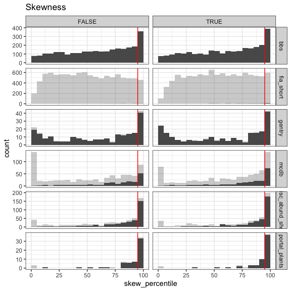
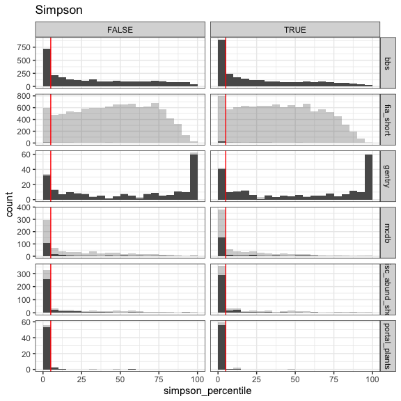

Regressions
================

Observations from these histograms:

-   FIA really struggles to get 2500 samples
-   Portal is the *most* concentrated of all the datasets.
-   Then MCDB and misc, then gentry, then bbs. FIA is hard to place but looks idiosyncratic.
-   Curious about how variation in %ile maps on to S and N, *particularly* for Gentry and BBS.
-   Skewness is less extreme than Simpson (more density in the in-between).
-   Singletons doesn't appear to be terrifically impactful. From now on filtering to *unaltered* vectors.
-   I think it's best to filter to at least 2000 samples.

Some summary statistics:

### Avg abundance

    ## Warning in eval(family$initialize): non-integer #successes in a binomial glm!

    ## Warning in eval(family$initialize): non-integer #successes in a binomial glm!

    ## Warning in eval(family$initialize): non-integer #successes in a binomial glm!

    ## Warning in eval(family$initialize): non-integer #successes in a binomial glm!

    ## Warning in eval(family$initialize): non-integer #successes in a binomial glm!

    ## Warning in eval(family$initialize): non-integer #successes in a binomial glm!

    ## Warning in eval(family$initialize): non-integer #successes in a binomial glm!

    ## 
    ## Call:
    ## glm(formula = skew_pp ~ avg_n * dat, family = binomial, data = di_summary)
    ## 
    ## Deviance Residuals: 
    ##      Min        1Q    Median        3Q       Max  
    ## -2.13822  -0.43568   0.09532   0.53961   1.22668  
    ## 
    ## Coefficients:
    ##                            Estimate Std. Error z value Pr(>|z|)    
    ## (Intercept)               -0.617676   0.069238  -8.921  < 2e-16 ***
    ## avg_n                      0.076473   0.005012  15.259  < 2e-16 ***
    ## datfia_short               0.809340   0.118604   6.824 8.86e-12 ***
    ## datgentry                  0.279401   0.185611   1.505 0.132246    
    ## datmcdb                    1.519973   0.127201  11.949  < 2e-16 ***
    ## datmisc_abund_short        1.865076   0.118443  15.747  < 2e-16 ***
    ## datportal_plants           2.064671   0.538081   3.837 0.000124 ***
    ## avg_n:datfia_short        -0.008058   0.023544  -0.342 0.732145    
    ## avg_n:datgentry            0.073415   0.037088   1.979 0.047763 *  
    ## avg_n:datmcdb             -0.076226   0.005293 -14.400  < 2e-16 ***
    ## avg_n:datmisc_abund_short -0.074126   0.005111 -14.503  < 2e-16 ***
    ## avg_n:datportal_plants    -0.069774   0.006323 -11.036  < 2e-16 ***
    ## ---
    ## Signif. codes:  0 '***' 0.001 '**' 0.01 '*' 0.05 '.' 0.1 ' ' 1
    ## 
    ## (Dispersion parameter for binomial family taken to be 1)
    ## 
    ##     Null deviance: 5485.4  on 13253  degrees of freedom
    ## Residual deviance: 4901.8  on 13242  degrees of freedom
    ## AIC: 16161
    ## 
    ## Number of Fisher Scoring iterations: 6

    ## [1] "bbs"

    ## Warning in eval(family$initialize): non-integer #successes in a binomial glm!

    ## 
    ## Call:
    ## glm(formula = skew_pp ~ avg_n, family = binomial, data = this_dat)
    ## 
    ## Deviance Residuals: 
    ##      Min        1Q    Median        3Q       Max  
    ## -2.13822  -0.45959   0.07197   0.51925   1.22668  
    ## 
    ## Coefficients:
    ##              Estimate Std. Error z value Pr(>|z|)    
    ## (Intercept) -0.617676   0.069235  -8.921   <2e-16 ***
    ## avg_n        0.076473   0.005011  15.261   <2e-16 ***
    ## ---
    ## Signif. codes:  0 '***' 0.001 '**' 0.01 '*' 0.05 '.' 0.1 ' ' 1
    ## 
    ## (Dispersion parameter for binomial family taken to be 1)
    ## 
    ##     Null deviance: 2344.2  on 5543  degrees of freedom
    ## Residual deviance: 2041.8  on 5542  degrees of freedom
    ## AIC: 6829.3
    ## 
    ## Number of Fisher Scoring iterations: 4
    ## 
    ## [1] "fia_short"

    ## Warning in eval(family$initialize): non-integer #successes in a binomial glm!

    ## 
    ## Call:
    ## glm(formula = skew_pp ~ avg_n, family = binomial, data = this_dat)
    ## 
    ## Deviance Residuals: 
    ##      Min        1Q    Median        3Q       Max  
    ## -1.34430  -0.42434   0.07011   0.53082   1.05342  
    ## 
    ## Coefficients:
    ##             Estimate Std. Error z value Pr(>|z|)   
    ## (Intercept)  0.19166    0.09630   1.990  0.04655 * 
    ## avg_n        0.06841    0.02300   2.974  0.00294 **
    ## ---
    ## Signif. codes:  0 '***' 0.001 '**' 0.01 '*' 0.05 '.' 0.1 ' ' 1
    ## 
    ## (Dispersion parameter for binomial family taken to be 1)
    ## 
    ##     Null deviance: 1980.2  on 5553  degrees of freedom
    ## Residual deviance: 1971.3  on 5552  degrees of freedom
    ## AIC: 7179.3
    ## 
    ## Number of Fisher Scoring iterations: 3
    ## 
    ## [1] "gentry"

    ## Warning in eval(family$initialize): non-integer #successes in a binomial glm!

    ## 
    ## Call:
    ## glm(formula = skew_pp ~ avg_n, family = binomial, data = this_dat)
    ## 
    ## Deviance Residuals: 
    ##     Min       1Q   Median       3Q      Max  
    ## -1.8315  -0.6866   0.0883   0.7040   1.1781  
    ## 
    ## Coefficients:
    ##             Estimate Std. Error z value Pr(>|z|)    
    ## (Intercept) -0.33827    0.17221  -1.964   0.0495 *  
    ## avg_n        0.14989    0.03674   4.079 4.52e-05 ***
    ## ---
    ## Signif. codes:  0 '***' 0.001 '**' 0.01 '*' 0.05 '.' 0.1 ' ' 1
    ## 
    ## (Dispersion parameter for binomial family taken to be 1)
    ## 
    ##     Null deviance: 272.55  on 442  degrees of freedom
    ## Residual deviance: 250.46  on 441  degrees of freedom
    ## AIC: 576.45
    ## 
    ## Number of Fisher Scoring iterations: 4
    ## 
    ## [1] "mcdb"

    ## Warning in eval(family$initialize): non-integer #successes in a binomial glm!

    ## 
    ## Call:
    ## glm(formula = skew_pp ~ avg_n, family = binomial, data = this_dat)
    ## 
    ## Deviance Residuals: 
    ##     Min       1Q   Median       3Q      Max  
    ## -1.5712  -0.4339   0.2334   0.6413   0.8247  
    ## 
    ## Coefficients:
    ##              Estimate Std. Error z value Pr(>|z|)    
    ## (Intercept) 0.9022972  0.1067060   8.456   <2e-16 ***
    ## avg_n       0.0002474  0.0017046   0.145    0.885    
    ## ---
    ## Signif. codes:  0 '***' 0.001 '**' 0.01 '*' 0.05 '.' 0.1 ' ' 1
    ## 
    ## (Dispersion parameter for binomial family taken to be 1)
    ## 
    ##     Null deviance: 298.58  on 694  degrees of freedom
    ## Residual deviance: 298.56  on 693  degrees of freedom
    ## AIC: 789
    ## 
    ## Number of Fisher Scoring iterations: 3
    ## 
    ## [1] "misc_abund_short"

    ## Warning in eval(family$initialize): non-integer #successes in a binomial glm!

    ## 
    ## Call:
    ## glm(formula = skew_pp ~ avg_n, family = binomial, data = this_dat)
    ## 
    ## Deviance Residuals: 
    ##     Min       1Q   Median       3Q      Max  
    ## -1.7448  -0.2615   0.2831   0.5703   0.7058  
    ## 
    ## Coefficients:
    ##             Estimate Std. Error z value Pr(>|z|)    
    ## (Intercept) 1.247400   0.096098  12.980   <2e-16 ***
    ## avg_n       0.002347   0.001004   2.338   0.0194 *  
    ## ---
    ## Signif. codes:  0 '***' 0.001 '**' 0.01 '*' 0.05 '.' 0.1 ' ' 1
    ## 
    ## (Dispersion parameter for binomial family taken to be 1)
    ## 
    ##     Null deviance: 333.22  on 900  degrees of freedom
    ## Residual deviance: 322.65  on 899  degrees of freedom
    ## AIC: 752.23
    ## 
    ## Number of Fisher Scoring iterations: 6
    ## 
    ## [1] "portal_plants"

    ## Warning in eval(family$initialize): non-integer #successes in a binomial glm!

    ## 
    ## Call:
    ## glm(formula = skew_pp ~ avg_n, family = binomial, data = this_dat)
    ## 
    ## Deviance Residuals: 
    ##     Min       1Q   Median       3Q      Max  
    ## -1.5573  -0.1228   0.1606   0.3195   0.6163  
    ## 
    ## Coefficients:
    ##             Estimate Std. Error z value Pr(>|z|)   
    ## (Intercept) 1.446994   0.533817   2.711  0.00672 **
    ## avg_n       0.006699   0.003861   1.735  0.08268 . 
    ## ---
    ## Signif. codes:  0 '***' 0.001 '**' 0.01 '*' 0.05 '.' 0.1 ' ' 1
    ## 
    ## (Dispersion parameter for binomial family taken to be 1)
    ## 
    ##     Null deviance: 22.666  on 116  degrees of freedom
    ## Residual deviance: 17.033  on 115  degrees of freedom
    ## AIC: 34.436
    ## 
    ## Number of Fisher Scoring iterations: 7
