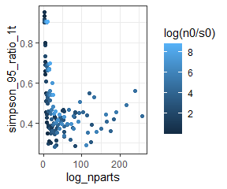

Explaining and exploring the 95% interval metric
================
Renata Diaz
2020-08-09

One of the crucial threads of reasoning for comparing observations to an
emergent statistical expectation is that the expectation be sufficiently
specific to allow us to make robust comparisons. *Often*, with
sufficiently large systems (also described as sufficiently large scale
separation between the subcomponents and the aggregate characteristic of
interest; H\&L), we can rely on the expectation being extremely narrowly
peaked. It is, however, not clear what “sufficiently large” means. We
can expect that *some* ecological systems are definitely not large in
this sense - if there are only 6 species and 3 individuals, the feasible
set is trivially small. Nor is it a given that the expectations do
actually get appreciably more peaked with increasing S and N.

We would like to know:

  - How the shape, and specifically the narrowness, of the expectation
    changes over an ecologically-relevant gradient in S and N
  - If, as we might expect given the above intuition about larger
    systems, small systems have less steep peaks: whether the change in
    the shape of the expectation corresponds with the change in our
    results.
      - This is kind of slippery. Ideally we would find a way to measure
        our statistical power.

To do this we need to establish

  - A way of measuring the shape, and specifically the narrowness, of
    the expectation
  - How the shape changes over gradients
  - How the shape constrains the kind of deviation we *could* detect (?)
  - How the shape maps on to the presence/absence of detected deviations

## Illustrating the expectation

We obtain the expectation by drawing samples from the feasible set and
constructing the distribution of values for *summary statistics* for all
of those elements.

For example, for a community with 44 species and 13360 individuals, here
is the feasible set:

<!-- -->

Every vector in the feasible set can be summarized according to its
skewness or evenness value:

<!-- --><!-- -->

We use the distribution of values for skewness and evenness, from our
samples from the feasible set, as the expectation for the values of
skewness and evenness for an observation.

<!-- --><!-- -->

Here is what this can look like for a smaller feasible set - for
example, 7 species and 71 individuals:

<!-- --><!-- --><!-- --><!-- -->

And for a very small feasible set:

<!-- --><!-- --><!-- --><!-- -->

## Measuring the shape (narrowness)

The actual values of skewness and evenness change over the gradients of
S and N. Also, as evident above, these aren’t necessarily normally
distributed.

I have computed the ratio of a 95% interval relative to the full range
of values. Here is what that looks like.

<!-- --><!-- --><!-- --><!-- --><!-- --><!-- -->

## Mapping the shape over a gradient in S and N

It can be difficult to interpret the distribution of interval values
from our actual datasets, because they are irregularly distributed over
S by N space. So we can drop a net over the relevant S by N gradient and
sample *regularly* from it.

<!-- -->

Here is how these 95% intervals vary over the *net* of points:

<!-- --><!-- -->

<!-- --><!-- -->
