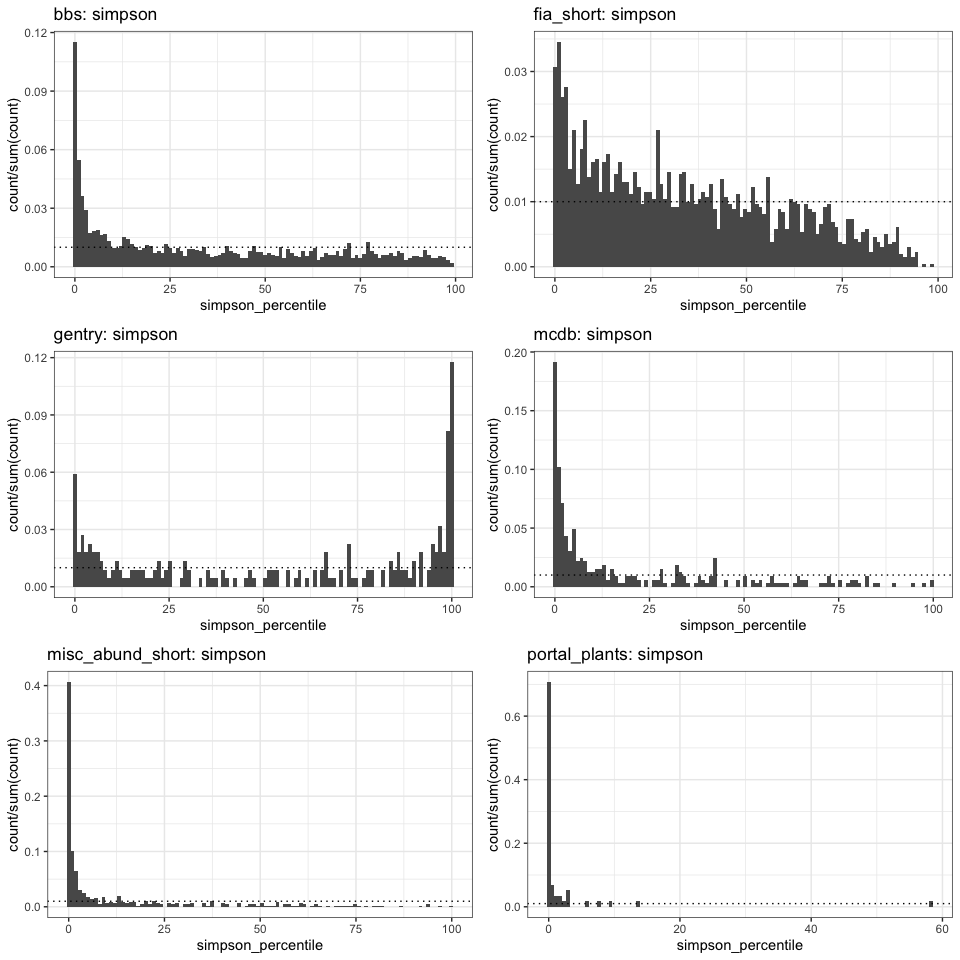
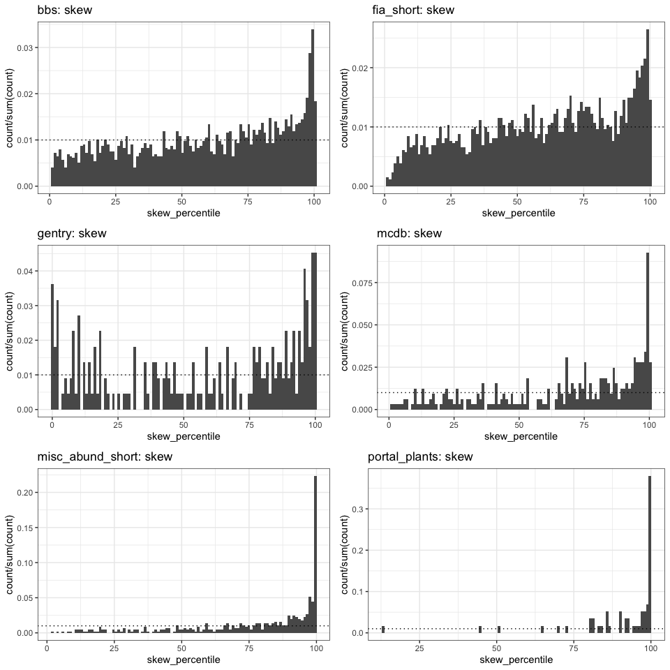
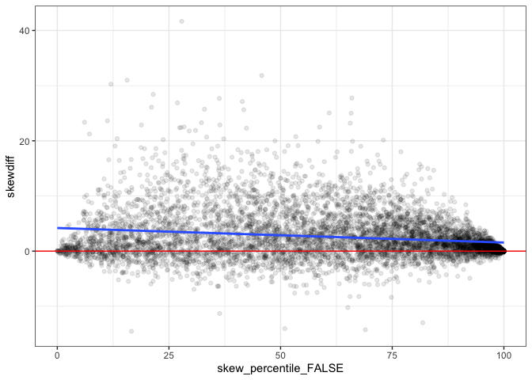
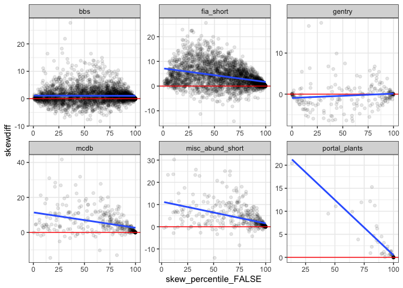

Singletons
================

Effect of singletons
====================

The rarefaction-inflated datasets are strongly // the raw vectors. They have more extreme skewness and evenness values, relative to their feasible sets, than the raw vectors. This is almost always true for evenness, with a little more noise in the skewness signal. But either way, very strong.

Broken out by dataset
---------------------

Evennes is consistently more concentrated in the extremes than skewness.

Gentry has a weird U going on, where it has a lot of weirdly *low*/*high* values. All the others are concentrated as low (evenness) or high (skew). BBS and FIA have the most that are in the intermediate zone.

Effect of singletons

There's some fuzz, most pronouncedly for BBS and FIA. Those are also the ones with 1) the most points and 2) the most fuzz/uniform-distributed percentile values.

Gentry gets a bunch of species added (600?!?!?!?). Otherwise, the number added and the effect doesn't map clearly onto S and N.

Gentry makes things hard to look at and is not the focus here, so I'm removing it. 

Compared to original skew

    ## `stat_bin()` using `bins = 30`. Pick better value with `binwidth`.

    ## `stat_bin()` using `bins = 30`. Pick better value with `binwidth`.
    ## `stat_bin()` using `bins = 30`. Pick better value with `binwidth`.

 With the possible exception of gentry, removing the highly skewed sites does not recenter the difference on 0. So the reason bbs and fia have so many down below 0 is not "shifting below zero is only possible if skew starts out lowish; bbs and fia are the only ones with a lot of intermediate starting skew values; if we constrain the others to only their intermediate starting skew values, they too will have proportionally lots below zero".
