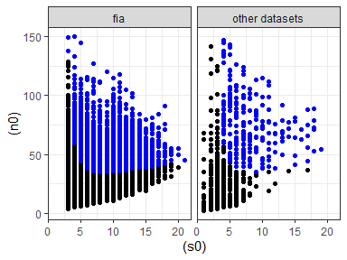
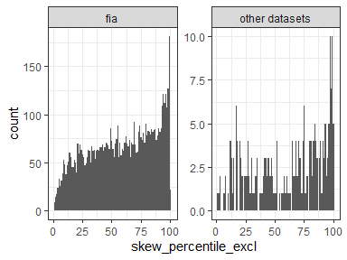

Size class small comparisons
================
Renata Diaz
2020-08-05

##### Results for small (FIA sized) communities

Here are the results when we try to tell whether FIA communities differ
qualitatively from similarly-sized communities from other datasets…

###### Small sites

Note that, even for small sites, “other datasets” are generally larger
than FIA….

<!-- --><!-- -->

Having played around with the shiny app (size\_comparisons), here are
some static plots that I think are faithful to what I glean from
tinkering with cutoffs.

##### Trivially small

For a range of about 1-300 elements in the FS, I wouldn’t argue for any
kind of detectable pattern in any of the results:

<!-- --><!-- -->

| fia\_yn        | prop\_skew\_high | nskew\_sites |
| :------------- | ---------------: | -----------: |
| fia            |        0.0127573 |         8309 |
| other datasets |        0.0121951 |          246 |

| fia\_yn        | prop\_even\_low | neven\_sites |
| :------------- | --------------: | -----------: |
| fia            |       0.0480202 |         8309 |
| other datasets |       0.0750000 |          320 |

##### Small but not trivially small

There’s one dynamic from a minimum of around 50 to 10000 elements,
where:

  - Not really anything detectable for skewness
  - A weak effect for evenness for FIA, and quite a strong effect for
    evenness for other datasets

<!-- --><!-- -->

| fia\_yn        | prop\_skew\_high | nskew\_sites |
| :------------- | ---------------: | -----------: |
| fia            |        0.0432552 |        14426 |
| other datasets |        0.0652174 |          230 |

| fia\_yn        | prop\_even\_low | neven\_sites |
| :------------- | --------------: | -----------: |
| fia            |       0.0792319 |        14426 |
| other datasets |       0.1845494 |          233 |

##### Big

And then anything over about 1500 elements:

  - Effects for both skewness and evenness, which only get stronger as
    you increase the minimum
  - Consistently more pronounced for other datasets for FIA, but the
    difference decreases as you increase the minimum

<!-- --><!-- -->

| fia\_yn        | prop\_skew\_high | nskew\_sites |
| :------------- | ---------------: | -----------: |
| fia            |        0.0967742 |         6696 |
| other datasets |        0.1652542 |          236 |

| fia\_yn        | prop\_even\_low | neven\_sites |
| :------------- | --------------: | -----------: |
| fia            |       0.1375448 |         6696 |
| other datasets |       0.2838983 |          236 |

##### Really big

Such that, over about 10000 elements, FIA looks similar to other
datasets.

<!-- --><!-- -->

| fia\_yn        | prop\_skew\_high | nskew\_sites |
| :------------- | ---------------: | -----------: |
| fia            |        0.1409396 |         2533 |
| other datasets |        0.1775148 |          169 |

| fia\_yn        | prop\_even\_low | neven\_sites |
| :------------- | --------------: | -----------: |
| fia            |       0.2021319 |         2533 |
| other datasets |       0.3195266 |          169 |

