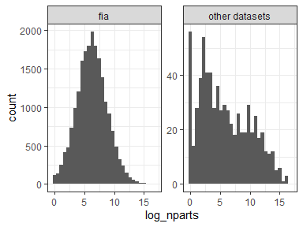
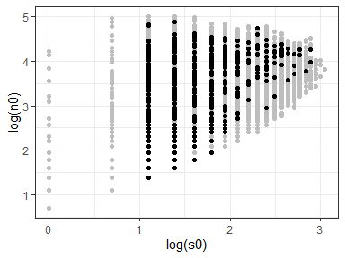
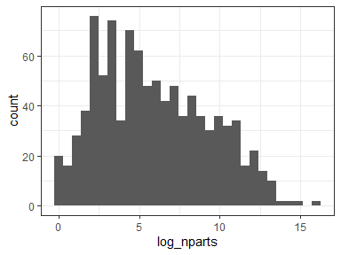

Size class small comparisons
================
Renata Diaz
2020-08-06

The FIA sites stand out from the other datasets in that, overall, they
do not show pronouncedly extreme values. This is especially the case for
skewness:

<!-- --><!-- -->

One possible explanation for this is that the FIA sites tend to have
quite small S and N, leading to quite a small feasible set and
potentially quite a broad distribution of expected values for skewness
and evenness.

It is also possible that the FIA datasets differ qualitatively from
other datasets, and that this drives the difference.

We may be able to disentangle these possibilities by

  - Comparing the FIA sites to sites from other datasets that are of a
    similar size
  - Looking at the breadth of the distributions for these sites relative
    to larger sites

If we compare the FIA sites to sites from other datasets that are of a
similar size, the comparison is limited by the fact that our sites are
nonuniformly distributed in SxN space, or in terms of the the number of
elements in their feasible sets. Specifically, the FIA datasets are
concentrated towards **especially small** feasible sets compared “other
datasets” - even the ones that fall within the general range found in
FIA.

<!-- --><!-- -->

This means that an overall histogram for FIA would be representative
more of sites in the 4-7 parts range, while one for “other datasets”
would be representative of more of a spread from 3-16 parts. Given that
we suspect the number of parts is quite important, this is a sticky
problem.

One option, which I haven’t considered before, is to subsample **FIA**
to match “other datasets”. If we subsample so there is equal
representation of all S and N combinations between FIA and “other
datasets”, we end up with 309 combinations represented and a total of
488 comparisons.

<!-- --><!-- -->

The dark dots are the sites for which we can find at least one exact
match in s0 and n0 between a FIA site and a site from another dataset.
The histogram is the distribution of FS sizes represented in the
subsample.

Here are the results for that subsample:

<!-- --><!-- -->

| fia\_yn        | prop\_skew\_high | prop\_even\_low | nsites |
| :------------- | ---------------: | --------------: | -----: |
| fia            |        0.0614754 |       0.1331967 |    488 |
| other datasets |        0.0655738 |       0.1577869 |    488 |

For the subsample that is directly comparable, there is **not a
difference** between FIA and other datasets in the distribution of
percentile values. This is a very small subsample relative to all the
sites in both datasets - FIA has 20,000 sites overall, and we are only
looking at 500 of them. However, given how sensitive results aggregated
in this way are to the relative frequency of SxN combinations/FS sizes
in the sample, I believe this is the most robust way we can ask whether
*being from FIA* causes detectably different outcomes.
