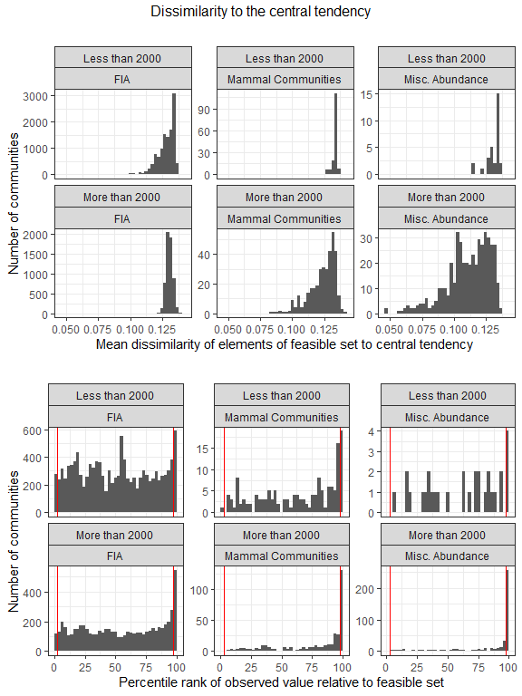
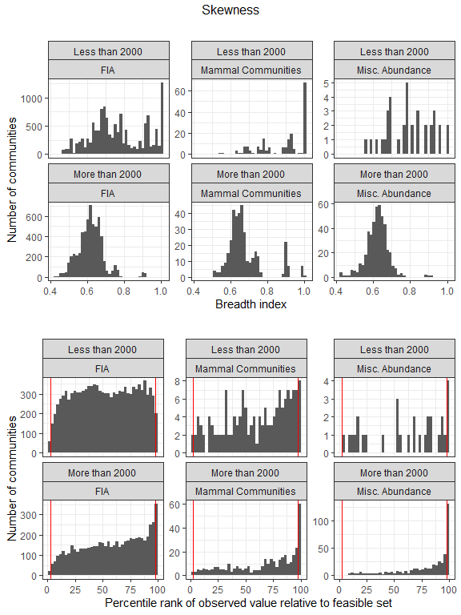
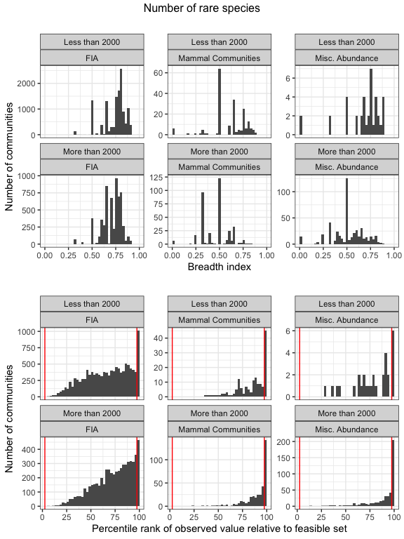
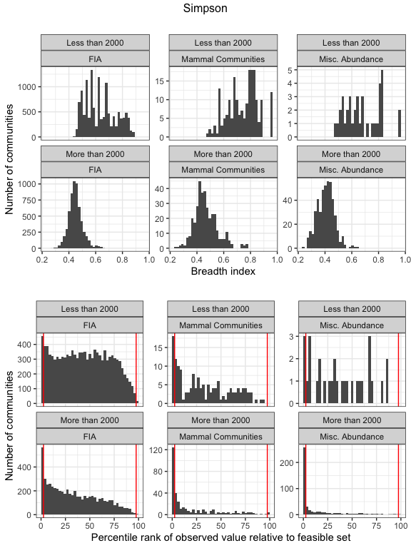
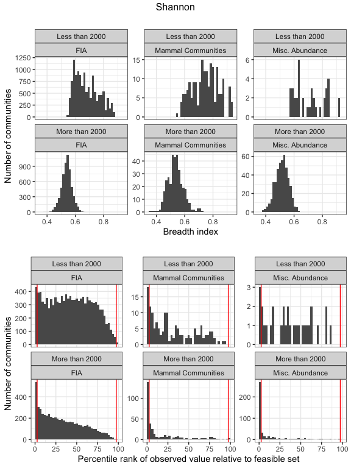

Complete results for very small (&lt;2000 possible SADs) communities
================
Renata Diaz
2021-04-02

-   [Proportions of extreme values](#proportions-of-extreme-values)
-   [Distributions of breadth indices and percentile
    scores](#distributions-of-breadth-indices-and-percentile-scores)

# Proportions of extreme values

    ## `summarise()` has grouped output by 'Dataset'. You can override using the `.groups` argument.
    ## `summarise()` has grouped output by 'Dataset'. You can override using the `.groups` argument.
    ## `summarise()` has grouped output by 'Dataset'. You can override using the `.groups` argument.

    ## Joining, by = c("Dataset", "Number of elements")
    ## Joining, by = c("Dataset", "Number of elements")

| Dataset            | Proportion with nparts &lt; 2000 |
|:-------------------|---------------------------------:|
| FIA                |                        0.6804901 |
| Mammal Communities |                        0.3496377 |
| Misc. Abundance    |                        0.0769231 |

    ## Note: Using an external vector in selections is ambiguous.
    ## i Use `all_of(cols1)` instead of `cols1` to silence this message.
    ## i See <https://tidyselect.r-lib.org/reference/faq-external-vector.html>.
    ## This message is displayed once per session.

| Dataset            | Number of elements | High dissimilarity | High proportion of rare species | High skew       | Low Simpson     | Low Shannon     |
|:-------------------|:-------------------|:-------------------|:--------------------------------|:----------------|:----------------|:----------------|
| FIA                | Less than 2000     | 5.3%; n = 12553    | 1.2%; n = 11516                 | 1.2%; n = 11516 | 3.9%; n = 11516 | 3.6%; n = 11516 |
| FIA                | More than 2000     | 11%; n = 5894      | 1.7%; n = 5894                  | 6%; n = 5894    | 9.5%; n = 5894  | 9%; n = 5894    |
| Mammal Communities | Less than 2000     | 12%; n = 193       | 4.6%; n = 152                   | 1.4%; n = 146   | 12%; n = 152    | 12%; n = 152    |
| Mammal Communities | More than 2000     | 42%; n = 359       | 16%; n = 359                    | 17%; n = 359    | 35%; n = 359    | 38%; n = 359    |
| Misc. Abundance    | Less than 2000     | 11%; n = 38        | 6.7%; n = 30                    | 7.1%; n = 28    | 10%; n = 30     | 10%; n = 30     |
| Misc. Abundance    | More than 2000     | 63%; n = 456       | 29%; n = 456                    | 29%; n = 456    | 56%; n = 456    | 59%; n = 456    |

# Distributions of breadth indices and percentile scores

Breadth indices (top) and percentile scores (bottom) for communities
with fewer than 2000 possible SADs, or more than 2000 possible SADs,
from FIA, Mammal Community, and Misc. Abundance datasets.

<!-- -->

    ## Warning: Removed 14 rows containing non-finite values (stat_bin).

<!-- --><!-- --><!-- --><!-- -->
