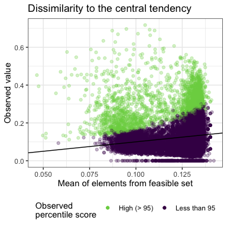

Dissimilarity of FS vs. actual
================
Renata Diaz
2021-03-22

<!-- -->

**Figure S4**. Observed SADs are often much more dissimilar to the
central tendency of their feasible sets (y-axis) than the mean
dissimilarity of samples from the feasible set and the central tendency
(x-axis). The black line is the 1:1 line.
