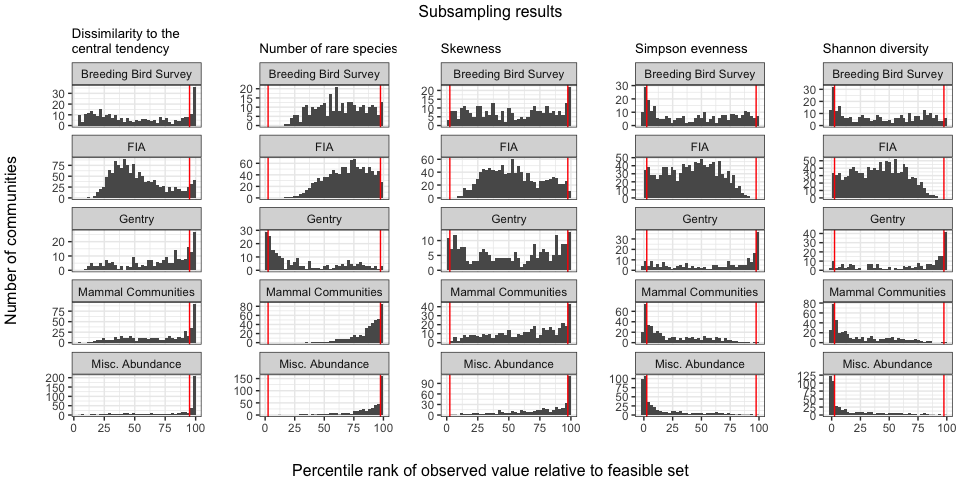
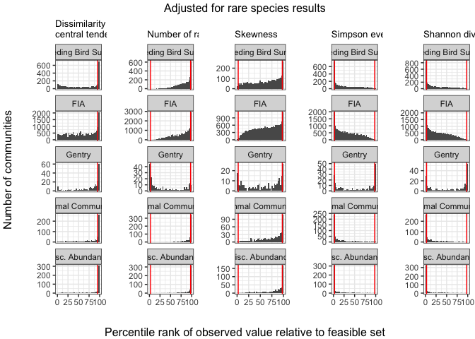
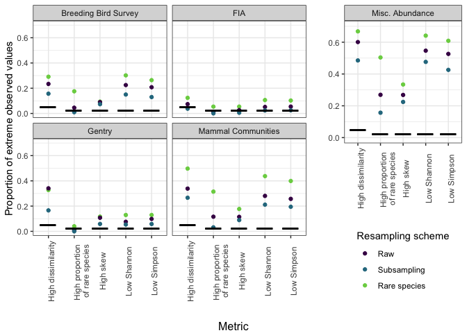
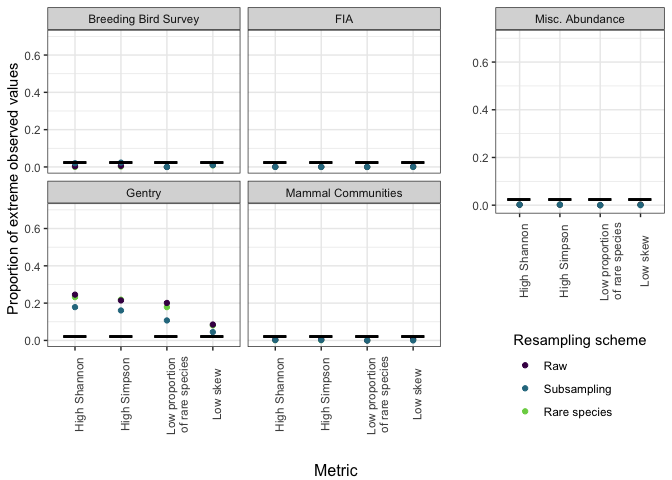

Complete results of resampling
================
Renata Diaz
2021-03-22

  - [Resampling](#resampling)
  - [Percentile histograms](#percentile-histograms)
      - [Subsampling](#subsampling)
      - [Adjusting for rare species](#adjusting-for-rare-species)
  - [Summary of effects on proportion of extreme
    values](#summary-of-effects-on-proportion-of-extreme-values)
      - [Usual direction](#usual-direction)
      - [Unusual direction](#unusual-direction)
  - [Table of proportions of extreme
    values](#table-of-proportions-of-extreme-values)
      - [Usual direction](#usual-direction-1)
      - [Unusual direction](#unusual-direction-1)

# Resampling

    ## Joining, by = c("sim", "source", "dat", "site", "singletons", "s0", "n0", "nparts")
    ## Joining, by = c("sim", "source", "dat", "site", "singletons", "s0", "n0", "nparts")

    ## Warning: Unknown or uninitialised column: `njks_skew`.

    ## `summarise()` has grouped output by 'Dataset'. You can override using the `.groups` argument.

    ## `summarise()` has grouped output by 'Dataset'. You can override using the `.groups` argument.

    ## Joining, by = c("Dataset", "resampling")

    ## Joining, by = "ometric2"

# Percentile histograms

## Subsampling

<!-- -->

## Adjusting for rare species

<!-- -->

# Summary of effects on proportion of extreme values

## Usual direction

<!-- -->

## Unusual direction

<!-- -->

# Table of proportions of extreme values

## Usual direction

    ## Note: Using an external vector in selections is ambiguous.
    ## ℹ Use `all_of(cols1)` instead of `cols1` to silence this message.
    ## ℹ See <https://tidyselect.r-lib.org/reference/faq-external-vector.html>.
    ## This message is displayed once per session.

| Dataset              | Resampling scheme | High dissimilarity | High proportion of rare species | High skew       | Low Simpson     | Low Shannon     |
| :------------------- | :---------------- | :----------------- | :------------------------------ | :-------------- | :-------------- | :-------------- |
| Breeding Bird Survey | Raw               | 23%; n =2773       | 4.5%; n =2773                   | 9%; n = 2773    | 21%; n = 2773   | 23%; n = 2773   |
| Breeding Bird Survey | Subsampling       | 16%; n =300        | 1%; n =300                      | 7.3%; n = 300   | 13%; n = 300    | 15%; n = 300    |
| Breeding Bird Survey | Rare species      | 29%; n =2773       | 18%; n =2773                    | 9.4%; n = 2773  | 26%; n = 2773   | 30%; n = 2773   |
| FIA                  | Raw               | 7.4%; n =17410     | 1.3%; n =18447                  | 2.6%; n = 18447 | 5.4%; n = 18447 | 5.1%; n = 18447 |
| FIA                  | Subsampling       | 3.8%; n =1118      | 0.072%; n =1388                 | 0.58%; n = 1388 | 2.5%; n = 1388  | 2.4%; n = 1388  |
| FIA                  | Rare species      | 12%; n =17918      | 5.4%; n =18736                  | 5.4%; n = 18736 | 10%; n = 18736  | 11%; n = 18736  |
| Gentry               | Raw               | 34%; n =223        | 0.89%; n =224                   | 11%; n = 223    | 9.8%; n = 224   | 7.6%; n = 224   |
| Gentry               | Subsampling       | 17%; n =223        | 0%; n =224                      | 5.8%; n = 223   | 5.8%; n = 224   | 5.4%; n = 224   |
| Gentry               | Rare species      | 33%; n =223        | 4%; n =224                      | 12%; n = 223    | 13%; n = 224    | 13%; n = 224    |
| Mammal Communities   | Raw               | 34%; n =511        | 12%; n =552                     | 11%; n = 540    | 26%; n = 552    | 28%; n = 552    |
| Mammal Communities   | Subsampling       | 27%; n =432        | 3.2%; n =473                    | 8.9%; n = 471   | 19%; n = 473    | 21%; n = 473    |
| Mammal Communities   | Rare species      | 50%; n =555        | 31%; n =594                     | 18%; n = 592    | 40%; n = 594    | 44%; n = 594    |
| Misc. Abundance      | Raw               | 60%; n =486        | 27%; n =494                     | 27%; n = 492    | 53%; n = 494    | 55%; n = 494    |
| Misc. Abundance      | Subsampling       | 49%; n =474        | 16%; n =479                     | 22%; n = 477    | 43%; n = 479    | 48%; n = 479    |
| Misc. Abundance      | Rare species      | 67%; n =488        | 50%; n =496                     | 33%; n = 494    | 61%; n = 496    | 64%; n = 496    |

## Unusual direction

    ## Note: Using an external vector in selections is ambiguous.
    ## ℹ Use `all_of(cols2)` instead of `cols2` to silence this message.
    ## ℹ See <https://tidyselect.r-lib.org/reference/faq-external-vector.html>.
    ## This message is displayed once per session.

| Dataset              | Resampling scheme | Low proportion of rare species | Low skew          | High Simpson      | High Shannon      |
| :------------------- | :---------------- | :----------------------------- | :---------------- | :---------------- | :---------------- |
| Breeding Bird Survey | Raw               | 0%; n =2773                    | 1.1%; n = 2773    | 0.61%; n = 2773   | 0.36%; n = 2773   |
| Breeding Bird Survey | Subsampling       | 0%; n =300                     | 1%; n = 300       | 2.3%; n = 300     | 2%; n = 300       |
| Breeding Bird Survey | Rare species      | 0%; n =2773                    | 0.83%; n = 2773   | 0.22%; n = 2773   | 0.036%; n = 2773  |
| FIA                  | Raw               | 0%; n =18447                   | 0.27%; n = 18447  | 0.06%; n = 18447  | 0.081%; n = 18447 |
| FIA                  | Subsampling       | 0%; n =1388                    | 0%; n = 1388      | 0%; n = 1388      | 0%; n = 1388      |
| FIA                  | Rare species      | 0%; n =18736                   | 0.096%; n = 18736 | 0.011%; n = 18736 | 0.021%; n = 18736 |
| Gentry               | Raw               | 20%; n =224                    | 8.5%; n = 223     | 21%; n = 224      | 25%; n = 224      |
| Gentry               | Subsampling       | 11%; n =224                    | 4.5%; n = 223     | 16%; n = 224      | 18%; n = 224      |
| Gentry               | Rare species      | 18%; n =224                    | 8.1%; n = 223     | 22%; n = 224      | 23%; n = 224      |
| Mammal Communities   | Raw               | 0%; n =552                     | 0.74%; n = 540    | 0.54%; n = 552    | 0.36%; n = 552    |
| Mammal Communities   | Subsampling       | 0%; n =473                     | 0%; n = 471       | 0.21%; n = 473    | 0.21%; n = 473    |
| Mammal Communities   | Rare species      | 0%; n =594                     | 0.34%; n = 592    | 0.17%; n = 594    | 0.17%; n = 594    |
| Misc. Abundance      | Raw               | 0%; n =494                     | 0.2%; n = 492     | 0.2%; n = 494     | 0.2%; n = 494     |
| Misc. Abundance      | Subsampling       | 0%; n =479                     | 0%; n = 477       | 0.21%; n = 479    | 0.21%; n = 479    |
| Misc. Abundance      | Rare species      | 0%; n =496                     | 0.2%; n = 494     | 0.2%; n = 496     | 0.2%; n = 496     |

