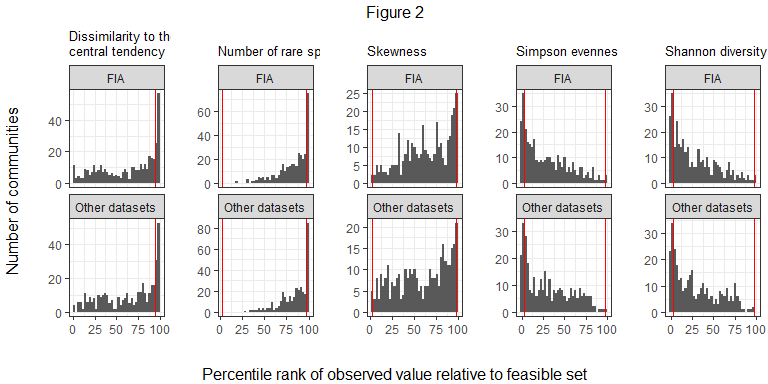
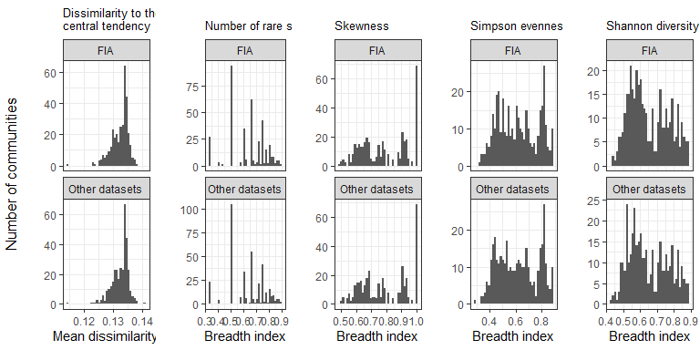

Comparison of FIA and equally-sized communities
================
Renata Diaz
2021-04-02

-   [Percentile scores](#percentile-scores)
    -   [Histograms](#histograms)
    -   [Proportions of extreme percentile
        scores](#proportions-of-extreme-percentile-scores)
    -   [K-S test results](#k-s-test-results)
-   [Breadth indices](#breadth-indices)
    -   [Histograms](#histograms-1)
    -   [K-S test results](#k-s-test-results-1)

We identified \~330 communities in FIA with exact matches, in terms of S
and N, among communities from other datasets. We then compared the
distributions of percentile scores and breadth indices of FIA
communities to communities from other datasets, visually and using
Kolmogorov-Smirnov tests.

## Percentile scores

### Histograms

<!-- -->

### Proportions of extreme percentile scores

| Dataset        | High dissimilarity | High proportion of rare species | High skew     | Low Simpson  | Low Shannon  |
|:---------------|:-------------------|:--------------------------------|:--------------|:-------------|:-------------|
| FIA            | 17%; n = 373       | 4.8%; n = 330                   | 7%; n = 330   | 15%; n = 330 | 16%; n = 330 |
| Other datasets | 17%; n = 373       | 6.1%; n = 330                   | 6.4%; n = 330 | 15%; n = 330 | 15%; n = 330 |

### K-S test results

|     | Variable                          |     K-S D |   p-value |
|:----|:----------------------------------|----------:|----------:|
| D…1 | Simpson                           | 0.0575758 | 0.6447379 |
| D…2 | Skew                              | 0.0000000 | 1.0000000 |
| D…3 | Shannon                           | 0.0606061 | 0.5794869 |
| D…4 | Number of rare species            | 0.0363636 | 0.9812077 |
| D…5 | Dissimilarity to central tendency | 0.0424242 | 0.9277987 |

## Breadth indices

### Histograms

<!-- -->

### K-S test results

|     | Variable                          |     K-S D |   p-value |
|:----|:----------------------------------|----------:|----------:|
| D…1 | Simpson                           | 0.0393939 | 0.9599607 |
| D…2 | Skew                              | 0.0000000 | 1.0000000 |
| D…3 | Shannon                           | 0.0424242 | 0.9277987 |
| D…4 | Number of rare species            | 0.0333333 | 0.9930019 |
| D…5 | Dissimilarity to central tendency | 0.0268097 | 0.9993106 |

