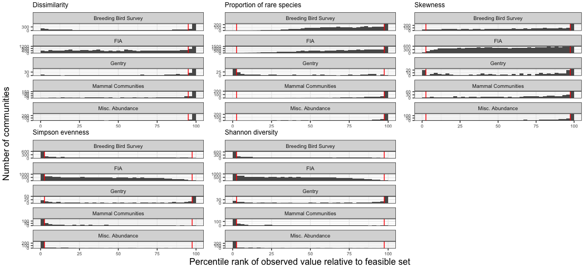
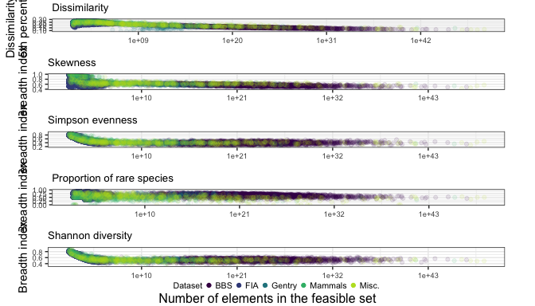
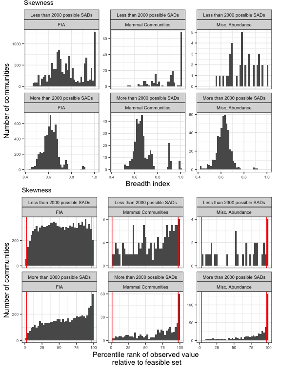
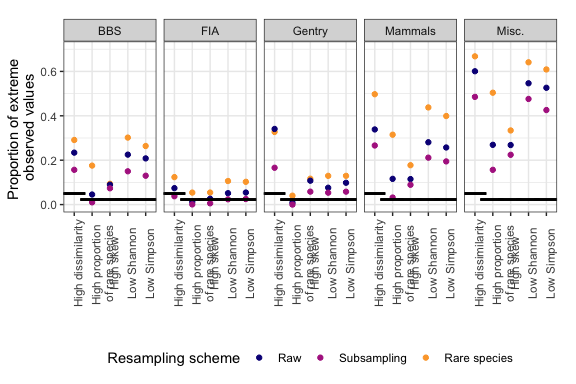

Figures and results for main manuscript
================
Renata Diaz
2021-05-08

  - [Datasets by S and N (Figure 1)](#datasets-by-s-and-n-figure-1)
  - [Illustrations of 95% interval (Figure
    2)](#illustrations-of-95-interval-figure-2)
  - [Dissimilarity (Supplement)](#dissimilarity-supplement)
  - [Metric histograms by dataset (Figure
    3)](#metric-histograms-by-dataset-figure-3)
  - [Results table](#results-table)
  - [Narrowness](#narrowness)
  - [Very small communities](#very-small-communities)
  - [Resampling](#resampling)

# Datasets by S and N (Figure 1)

# Illustrations of 95% interval (Figure 2)

To show the 95% interval, we need to load the distribution of shape
metric values from the samples from the feasible set for a few
communities. See rov\_metric.md.

    ## Joining, by = c("sim", "source", "dat", "site", "singletons", "s0", "n0", "nparts")

    ## Joining, by = c("dat", "site", "s0", "n0", "nparts")

    ## Joining, by = c("sim", "source", "dat", "site", "singletons", "s0", "n0", "nparts")

    ## Joining, by = c("dat", "site", "s0", "n0", "nparts")

    ## Joining, by = c("sim", "source", "dat", "site", "singletons", "s0", "n0", "nparts")

    ## Joining, by = c("dat", "site", "s0", "n0", "nparts")

    ## Warning: Removed 1 rows containing non-finite values (stat_bin).

    ## Warning: Removed 3 row(s) containing missing values (geom_path).

    ## Warning: Removed 1 rows containing non-finite values (stat_bin).

    ## Warning: Removed 1 row(s) containing missing values (geom_path).

    ## Warning: Removed 1 rows containing non-finite values (stat_bin).

<!-- -->

    ## [1] 6.6e+70

    ## [1] 1.001277e+12

    ## [1] 297

# Dissimilarity (Supplement)

# Metric histograms by dataset (Figure 3)

<!-- -->

    ## TableGrob (3 x 4) "arrange": 7 grobs
    ##   z     cells    name                 grob
    ## 1 1 (1-1,2-2) arrange       gtable[layout]
    ## 2 2 (1-1,3-3) arrange       gtable[layout]
    ## 3 3 (1-1,4-4) arrange       gtable[layout]
    ## 4 4 (2-2,2-2) arrange       gtable[layout]
    ## 5 5 (2-2,3-3) arrange       gtable[layout]
    ## 6 6 (3-3,2-4) arrange text[GRID.text.1674]
    ## 7 7 (1-3,1-1) arrange text[GRID.text.1675]

# Results table

    ## Joining, by = "Dataset"
    ## Joining, by = "Dataset"

    ## Note: Using an external vector in selections is ambiguous.
    ## ℹ Use `all_of(cols1)` instead of `cols1` to silence this message.
    ## ℹ See <https://tidyselect.r-lib.org/reference/faq-external-vector.html>.
    ## This message is displayed once per session.

| Dataset              | High dissimilarity | High proportion of rare species | High skew       | Low Simpson     | Low Shannon     |
| :------------------- | :----------------- | :------------------------------ | :-------------- | :-------------- | :-------------- |
| Breeding Bird Survey | 23%; n = 2773      | 4.5%; n = 2773                  | 9%; n = 2773    | 21%; n = 2773   | 23%; n = 2773   |
| FIA                  | 7.2%; n = 18447    | 1.4%; n = 17410                 | 2.8%; n = 17410 | 5.8%; n = 17410 | 5.5%; n = 17410 |
| Gentry               | 34%; n = 224       | 0.9%; n = 223                   | 11%; n = 223    | 9.9%; n = 223   | 7.6%; n = 223   |
| Mammal Communities   | 32%; n = 552       | 13%; n = 511                    | 12%; n = 505    | 28%; n = 511    | 30%; n = 511    |
| Misc. Abundance      | 59%; n = 494       | 27%; n = 486                    | 27%; n = 484    | 53%; n = 486    | 56%; n = 486    |

    ## Note: Using an external vector in selections is ambiguous.
    ## ℹ Use `all_of(cols2)` instead of `cols2` to silence this message.
    ## ℹ See <https://tidyselect.r-lib.org/reference/faq-external-vector.html>.
    ## This message is displayed once per session.

| Dataset              | Low proportion of rare species | Low skew         | High Simpson      | High Shannon      |
| :------------------- | :----------------------------- | :--------------- | :---------------- | :---------------- |
| Breeding Bird Survey | 0%; n = 2773                   | 1.1%; n = 2773   | 0.61%; n = 2773   | 0.36%; n = 2773   |
| FIA                  | 0%; n = 17410                  | 0.28%; n = 17410 | 0.063%; n = 17410 | 0.086%; n = 17410 |
| Gentry               | 20%; n = 223                   | 8.5%; n = 223    | 22%; n = 223      | 25%; n = 223      |
| Mammal Communities   | 0%; n = 511                    | 0.79%; n = 505   | 0.59%; n = 511    | 0.39%; n = 511    |
| Misc. Abundance      | 0%; n = 486                    | 0.21%; n = 484   | 0.21%; n = 486    | 0.21%; n = 486    |

# Narrowness

    ## Warning: Removed 8 rows containing missing values (geom_point).

<!-- -->

# Very small communities

    ## `summarise()` has grouped output by 'Dataset'. You can override using the `.groups` argument.
    ## `summarise()` has grouped output by 'Dataset'. You can override using the `.groups` argument.
    ## `summarise()` has grouped output by 'Dataset'. You can override using the `.groups` argument.

    ## Joining, by = c("Dataset", "Number of elements")
    ## Joining, by = c("Dataset", "Number of elements")

| Dataset              | Number of elements | High dissimilarity | High proportion of rare species | High skew       | Low Simpson     | Low Shannon     |
| :------------------- | :----------------- | :----------------- | :------------------------------ | :-------------- | :-------------- | :-------------- |
| Breeding Bird Survey | Less than 2000     | 0%; n = 1          | 0%; n = 1                       | 0%; n = 1       | 0%; n = 1       | 0%; n = 1       |
| Breeding Bird Survey | More than 2000     | 23%; n = 2772      | 4.5%; n = 2772                  | 9%; n = 2772    | 21%; n = 2772   | 23%; n = 2772   |
| FIA                  | Less than 2000     | 5.3%; n = 12553    | 1.2%; n = 11516                 | 1.2%; n = 11516 | 3.9%; n = 11516 | 3.6%; n = 11516 |
| FIA                  | More than 2000     | 11%; n = 5894      | 1.7%; n = 5894                  | 6%; n = 5894    | 9.5%; n = 5894  | 9%; n = 5894    |
| Gentry               | Less than 2000     | 0%; n = 1          | NA                              | NA              | NA              | NA              |
| Gentry               | More than 2000     | 34%; n = 223       | 0.9%; n = 223                   | 11%; n = 223    | 9.9%; n = 223   | 7.6%; n = 223   |
| Mammal Communities   | Less than 2000     | 12%; n = 193       | 4.6%; n = 152                   | 1.4%; n = 146   | 12%; n = 152    | 12%; n = 152    |
| Mammal Communities   | More than 2000     | 42%; n = 359       | 16%; n = 359                    | 17%; n = 359    | 35%; n = 359    | 38%; n = 359    |
| Misc. Abundance      | Less than 2000     | 11%; n = 38        | 6.7%; n = 30                    | 7.1%; n = 28    | 10%; n = 30     | 10%; n = 30     |
| Misc. Abundance      | More than 2000     | 63%; n = 456       | 29%; n = 456                    | 29%; n = 456    | 56%; n = 456    | 59%; n = 456    |

| Dataset            | Proportion with nparts \< 2000 |
| :----------------- | -----------------------------: |
| FIA                |                      0.6804901 |
| Mammal Communities |                      0.3496377 |
| Misc. Abundance    |                      0.0769231 |

    ## Warning: Removed 14 rows containing non-finite values (stat_bin).

<!-- -->

    ## TableGrob (2 x 1) "arrange": 2 grobs
    ##   z     cells    name           grob
    ## 1 1 (1-1,1-1) arrange gtable[layout]
    ## 2 2 (2-2,1-1) arrange gtable[layout]

# Resampling

    ## Joining, by = c("sim", "source", "dat", "site", "singletons", "s0", "n0", "nparts")
    ## Joining, by = c("sim", "source", "dat", "site", "singletons", "s0", "n0", "nparts")

    ## Warning: Unknown or uninitialised column: `njks_skew`.

    ## `summarise()` has grouped output by 'Dataset'. You can override using the `.groups` argument.

    ## `summarise()` has grouped output by 'Dataset'. You can override using the `.groups` argument.

    ## Joining, by = c("Dataset", "resampling")

| Dataset              | Resampling scheme | High dissimilarity | High proportion of rare species | High skew       | Low Simpson     | Low Shannon     |
| :------------------- | :---------------- | :----------------- | :------------------------------ | :-------------- | :-------------- | :-------------- |
| Breeding Bird Survey | Raw               | 23%; n =2773       | 4.5%; n =2773                   | 9%; n = 2773    | 21%; n = 2773   | 23%; n = 2773   |
| Breeding Bird Survey | Subsampling       | 16%; n =300        | 1%; n =300                      | 7.3%; n = 300   | 13%; n = 300    | 15%; n = 300    |
| Breeding Bird Survey | Rare species      | 29%; n =2773       | 18%; n =2773                    | 9.4%; n = 2773  | 26%; n = 2773   | 30%; n = 2773   |
| FIA                  | Raw               | 7.4%; n =17410     | 1.3%; n =18447                  | 2.6%; n = 18447 | 5.4%; n = 18447 | 5.1%; n = 18447 |
| FIA                  | Subsampling       | 3.8%; n =1118      | 0.072%; n =1388                 | 0.58%; n = 1388 | 2.5%; n = 1388  | 2.4%; n = 1388  |
| FIA                  | Rare species      | 12%; n =17918      | 5.4%; n =18736                  | 5.4%; n = 18736 | 10%; n = 18736  | 11%; n = 18736  |
| Gentry               | Raw               | 34%; n =223        | 0.89%; n =224                   | 11%; n = 223    | 9.8%; n = 224   | 7.6%; n = 224   |
| Gentry               | Subsampling       | 17%; n =223        | 0%; n =224                      | 5.8%; n = 223   | 5.8%; n = 224   | 5.4%; n = 224   |
| Gentry               | Rare species      | 33%; n =223        | 4%; n =224                      | 12%; n = 223    | 13%; n = 224    | 13%; n = 224    |
| Mammal Communities   | Raw               | 34%; n =511        | 12%; n =552                     | 11%; n = 540    | 26%; n = 552    | 28%; n = 552    |
| Mammal Communities   | Subsampling       | 27%; n =432        | 3.2%; n =473                    | 8.9%; n = 471   | 19%; n = 473    | 21%; n = 473    |
| Mammal Communities   | Rare species      | 50%; n =555        | 31%; n =594                     | 18%; n = 592    | 40%; n = 594    | 44%; n = 594    |
| Misc. Abundance      | Raw               | 60%; n =486        | 27%; n =494                     | 27%; n = 492    | 53%; n = 494    | 55%; n = 494    |
| Misc. Abundance      | Subsampling       | 49%; n =474        | 16%; n =479                     | 22%; n = 477    | 43%; n = 479    | 48%; n = 479    |
| Misc. Abundance      | Rare species      | 67%; n =488        | 50%; n =496                     | 33%; n = 494    | 61%; n = 496    | 64%; n = 496    |

| Dataset              | Resampling scheme | Low proportion of rare species | Low skew          | High Simpson      | High Shannon      |
| :------------------- | :---------------- | :----------------------------- | :---------------- | :---------------- | :---------------- |
| Breeding Bird Survey | Raw               | 0%; n =2773                    | 1.1%; n = 2773    | 0.61%; n = 2773   | 0.36%; n = 2773   |
| Breeding Bird Survey | Subsampling       | 0%; n =300                     | 1%; n = 300       | 2.3%; n = 300     | 2%; n = 300       |
| Breeding Bird Survey | Rare species      | 0%; n =2773                    | 0.83%; n = 2773   | 0.22%; n = 2773   | 0.036%; n = 2773  |
| FIA                  | Raw               | 0%; n =18447                   | 0.27%; n = 18447  | 0.06%; n = 18447  | 0.081%; n = 18447 |
| FIA                  | Subsampling       | 0%; n =1388                    | 0%; n = 1388      | 0%; n = 1388      | 0%; n = 1388      |
| FIA                  | Rare species      | 0%; n =18736                   | 0.096%; n = 18736 | 0.011%; n = 18736 | 0.021%; n = 18736 |
| Gentry               | Raw               | 20%; n =224                    | 8.5%; n = 223     | 21%; n = 224      | 25%; n = 224      |
| Gentry               | Subsampling       | 11%; n =224                    | 4.5%; n = 223     | 16%; n = 224      | 18%; n = 224      |
| Gentry               | Rare species      | 18%; n =224                    | 8.1%; n = 223     | 22%; n = 224      | 23%; n = 224      |
| Mammal Communities   | Raw               | 0%; n =552                     | 0.74%; n = 540    | 0.54%; n = 552    | 0.36%; n = 552    |
| Mammal Communities   | Subsampling       | 0%; n =473                     | 0%; n = 471       | 0.21%; n = 473    | 0.21%; n = 473    |
| Mammal Communities   | Rare species      | 0%; n =594                     | 0.34%; n = 592    | 0.17%; n = 594    | 0.17%; n = 594    |
| Misc. Abundance      | Raw               | 0%; n =494                     | 0.2%; n = 492     | 0.2%; n = 494     | 0.2%; n = 494     |
| Misc. Abundance      | Subsampling       | 0%; n =479                     | 0%; n = 477       | 0.21%; n = 479    | 0.21%; n = 479    |
| Misc. Abundance      | Rare species      | 0%; n =496                     | 0.2%; n = 494     | 0.2%; n = 496     | 0.2%; n = 496     |

    ## Joining, by = "ometric2"

<!-- -->
