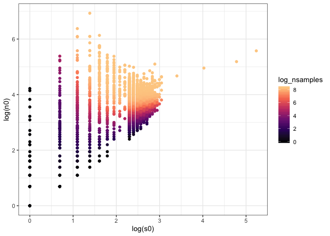

Synthesis report
================

Datasets in S and N space
=========================

Here is where our communities fall in S and N space:

Here is how that translates into the size of the feasible set:

Note that the color scale is log transformed, so the largest communities have e^331.5401042, or 9.683621310^{143}, elements in the feasible set!

Here is how the size of the feasible set maps on to N/S:

Number of samples
=================

Here is how many samples we are achieving:

Only in the very smallest communities do we get appreciably fewer than 4000 samples.

Here is how the number of samples we're getting compares to the size of the feasible set:

For about 30.3874915% of sites, we found all the elements of the FS. The *vast majority* of this is FIA.
