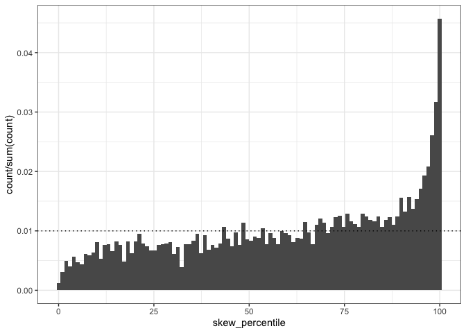
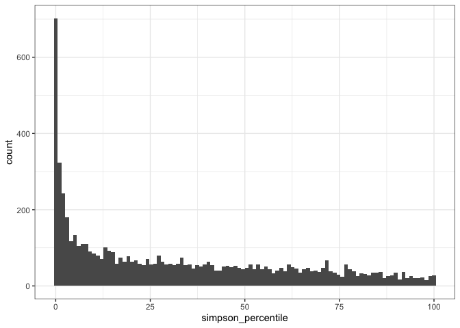
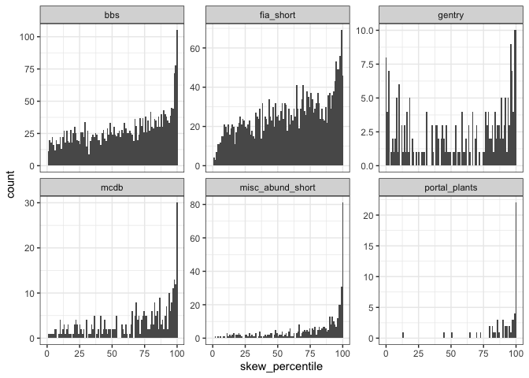
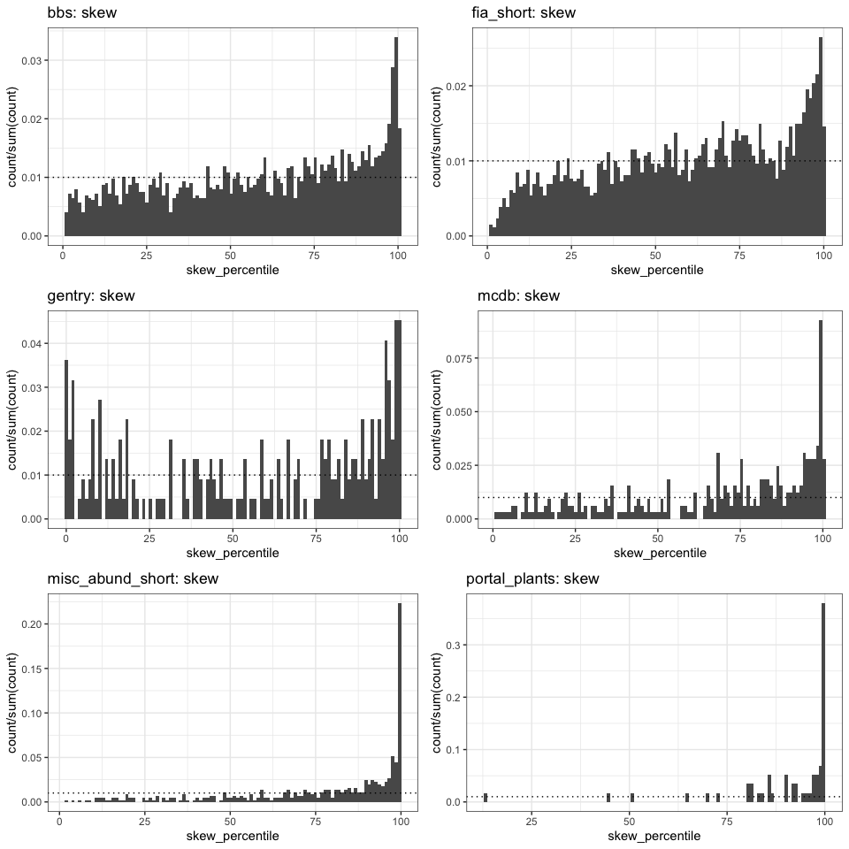

Shaking out the idiosyncracies
================

Number of draws in feasible set
-------------------------------

For low values of S and N, we expect to get considerably fewer than 2500 unique draws from the feasible set. Small feasible sets present a couple of problems for this percentile approach:

-   In the limit of only one or a handful of possible forms, it's absurd to try and draw meaning from the form of the SAD. In a community of 10 species and 11 individuals, the important thing to understand is not why the SAD is 2-1-1-1-1-1 but why the community has 10 species and 11 individuals.
-   Even when there are a few more possible forms, if there isn't much variation, the %ile statistic will be pretty coarse.
-   I expect the central tendency/dominance by a particular *form* to be weaker when there are fewer possible forms, period.
-   This one isn't necessarily a bug (and it applies to other aspects of S x N space), but I expect combinations of S and N that produce samples to have unusual feasible sets compared to most of S and N space. These are going to be communities with either very low S and N, period, or *very few* individuals relative to S. They will be forced to be more even than ones with more individuals.

It's not clear a priori what actual values of S and N will push us into small-community problems. Again, beyond the really small communities, it really depends on the ratio. Early on I just filtered out anything that gave fewer than 2000 unique draws. This has the advantage that we only end up comparing %ile values with reasonably comparable precision, but it might artificially exclude an important region on S\*N space.


In these plots, the grey region is nsamples &gt;= 2000. It looks like removing communities with nsamples &lt; 2000 is basically filtering out N &lt; about 100-150. For more nuance we could dip down into lower n for intermediate S (S between 5 and 50), and still be getting pretty good sampling?

Leaving it be for now.

Percentile value vs. range of variation of FS
---------------------------------------------

This is really hard to get traction on. S and N affect everything.


So for Simpson's, the mean, sd, and range of values within the feasible set all clearly vary with S and N. There seems to be an edge situation with the percentiles. The really high values are all out along the arm and, to a lesser extent, where N/S is relatively small. This is *not* a region of pronounced variation in the FS characteristics. Also, there is variation that clearly does not map on to the gradients in the FS characteristics.


There are similar, if less strong, gradients in skewness over the range of S and N; it's particularly low up the low N/S arm. The percentile values are *not* as different in that arm than the rest of the space (unlike with Simpson's). The variation in skewness percentile doesn't appear to track the gradients in the characteristics of the feasible set. Maybe it does a little? But no argument that there's a lot of variation over and above.

I feel like it might be *good* to find some way to test these statements quantitatively, but it's very tricky. Absolutely everything depends on S and N and moves in weird nonlinear ways.


You really don't get non-extreme percentiles in the high n/s region.

These scatterplots are good for seeing where the variation is but not the density; there's a *lot* of points on top of each other down at 0/up at 100. \#\# Where the datasets fall


    ## `stat_bin()` using `bins = 30`. Pick better value with `binwidth`.


The datasets overlap but do occupy broadly different regions of S\*N space. The arm - which is the weirdest region of the percentile values - is, unfortunately, 100% one dataset (Gentry).

For the vast majority of S\*N space here, I don't think we can really use dataset as a predictor of percentile, because of the way they occupy different parts of what we know to be a very important range of variation.

We *could* narrow in on the region of maximum overlap/minimum variation and make comparison based on the sites only within that.

FIA, dramatically more than any other dataset, struggles to get even 2000 samples.

Overall percentile results
--------------------------



Here, the dotted lines mark the 1%; at random, percentile values should be uniformly distributed with 1% per bin on these histograms.

Both Simpson's and skewness are disproportiately in the extremes: from about the 75th percentile on up for skewness, and maybe the 10th percentile and below for evenness.

It's not ubiquitous! Often things are unremarkable compared to the feasible set. That said, *more often than we'd expect*, real distributions are highly skewed/highly uneven compared to their feasible sets.

Effect of singletons


The rarefaction-inflated datasets are strongly // the raw vectors. They have more extreme skewness and evenness values, relative to their feasible sets, than the raw vectors. This is almost always true for evenness, with a little more noise in the skewness signal. But either way, very strong.

Broken out by dataset
---------------------



Evennes is consistently more concentrated in the extremes than skewness.

Gentry has a weird U going on, where it has a lot of weirdly *low*/*high* values. All the others are concentrated as low (evenness) or high (skew). BBS and FIA have the most that are in the intermediate zone.

Effect of singletons


There's some fuzz, most pronouncedly for BBS and FIA. Those are also the ones with 1) the most points and 2) the most fuzz/uniform-distributed percentile values.

MACD
====

Nsamples


By treatment - overall


<!-- ** I AM REALLY NOT CONFIDENT IN THE DATA HANDLING HERE, NEED TO REVISIT WHEN SHARPER ** -->
<!-- ```{r macd ctrlcomp} -->
<!-- macd_comparisons <- read.csv(here::here("working-data", "macdb_data", "orderedcomparisons.csv"), header = F, stringsAsFactors = F) -->
<!-- colnames(macd_comparisons) <- c("studyID", "control", "site") -->
<!-- macd_comparisons <- macd_comparisons %>% -->
<!--   mutate(site = as.character(site), control = as.character(control)) -->
<!-- cc_di <- all_di_macd %>% -->
<!--   filter(singletons == FALSE, treatment == "comparison") %>% -->
<!--   left_join(macd_comparisons, by = c("studyID", "site")) %>% -->
<!--   select(dat, site, skew_percentile, simpson_percentile, studyID, control) %>% -->
<!--   rename(comparison = site) %>% -->
<!--  left_join(select(all_di_macd, skew_percentile, simpson_percentile, site, singletons, nsamples), by = c("control" = "site")) %>% -->
<!--   distinct() %>% -->
<!--   rename(comp_skew = skew_percentile.x, comp_simp = simpson_percentile.x, -->
<!--          control_skew = skew_percentile.y, control_simp = simpson_percentile.y) -->
<!-- ggplot(data = cc_di, aes(x = comp_skew, y = control_skew)) + -->
<!--   geom_point(alpha = .5) + -->
<!-- #  xlim(0, 100) + -->
<!--  # ylim(0, 100) + -->
<!--   theme_bw() + -->
<!--   geom_abline(intercept = 0, slope = 1, color = "green") -->
<!-- ggplot(data = cc_di, aes(x = comp_simp, y = control_simp)) + -->
<!--   geom_point(alpha = .5) + -->
<!--  xlim(0, 100) + -->
<!--  ylim(0, 100) + -->
<!--   theme_bw() + -->
<!--   geom_abline(intercept = 0, slope = 1, color = "green") -->
<!-- ``` -->
Portal plant manips
===================

Nsamples, singletons


    ## Warning: Removed 17 rows containing missing values (geom_point).


    ## Warning: Removed 17 rows containing missing values (geom_point).


By treatment, season


By year


Trying median

    ## Warning: Removed 3 rows containing missing values (geom_point).

    ## Warning: Removed 1 rows containing missing values (geom_point).


    ## Warning: Removed 2 rows containing missing values (geom_point).

    ## Warning: Removed 1 rows containing missing values (geom_point).


