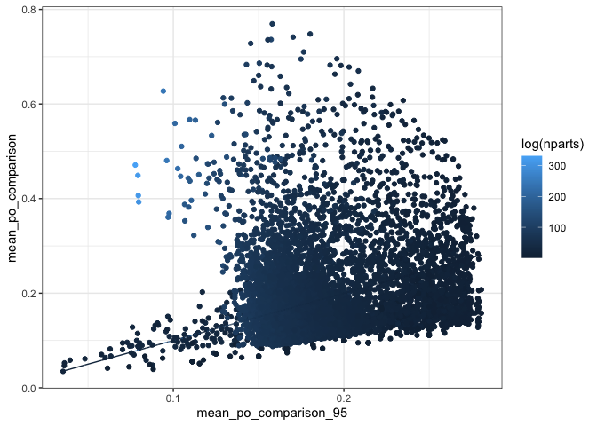
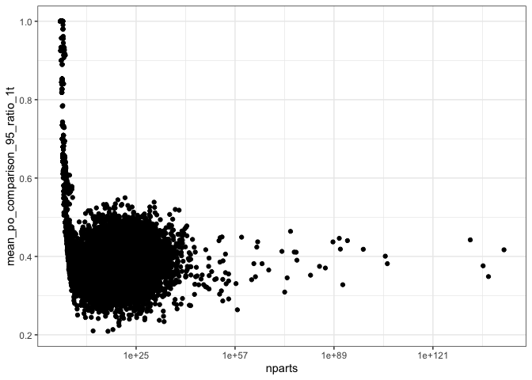
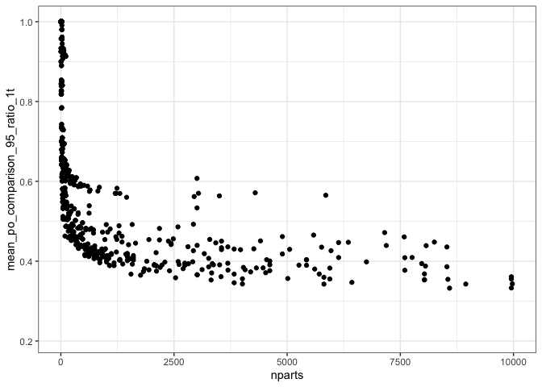
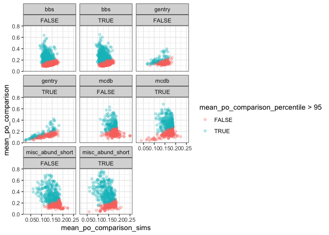
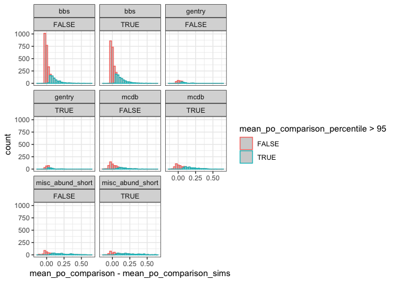

Other metrics
================
Renata Diaz
2021-02-22

  - [Proportion off](#proportion-off)
  - [Number of singletons](#number-of-singletons)
  - [Shannon diversity](#shannon-diversity)

## Proportion off

    ## `stat_bin()` using `bins = 30`. Pick better value with `binwidth`.

<!-- -->

    ## `summarise()` has grouped output by 'singletons'. You can override using the `.groups` argument.

| singletons | dat                |   po\_sig |
| :--------- | :----------------- | --------: |
| FALSE      | bbs                | 0.2300757 |
| FALSE      | gentry             | 0.3125000 |
| FALSE      | mcdb               | 0.2626113 |
| FALSE      | misc\_abund\_short | 0.5361781 |
| TRUE       | bbs                | 0.2884962 |
| TRUE       | gentry             | 0.3571429 |
| TRUE       | mcdb               | 0.4287834 |
| TRUE       | misc\_abund\_short | 0.6085343 |

<!-- -->

| singletons |      diff |
| :--------- | --------: |
| FALSE      | 0.0990546 |
| TRUE       | 0.1133945 |

    ## Warning: Removed 27 rows containing missing values (geom_point).

<!-- -->

    ## Scale for 'x' is already present. Adding another scale for 'x', which will
    ## replace the existing scale.

    ## Warning: Removed 7571 rows containing missing values (geom_point).

<!-- -->

<!-- -->

    ## `stat_bin()` using `bins = 30`. Pick better value with `binwidth`.

<!-- -->

## Number of singletons

## Shannon diversity
