Other metrics
================
Renata Diaz
2021-02-25

  - [Proportion off](#proportion-off)
  - [Number of singletons](#number-of-singletons)
  - [Shannon diversity](#shannon-diversity)
  - [2 tailed breadth indices](#tailed-breadth-indices)
  - [Epic synthesizing figure](#epic-synthesizing-figure)

All of these currently exclude FIA because those are still running.

## Proportion off

Defined as the proportion of individuals allocated to species of
different abundances. Most intuitive as a graph - here are two
hypothetical SADs for a community with 7 species and 71 individuals:

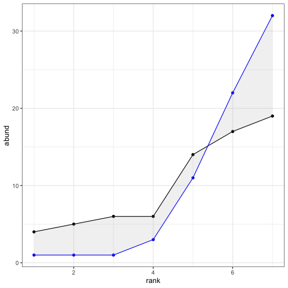<!-- -->

We take the grey area - the area of difference between the two SADs -
and divide it by 2 (because every individual allocated to a different
species will count twice), and divide that total by the total number of
individuals in the community. In principle this metric ranges from 0 to
1, with 0 being no individuals allocated differently and 1 being all
individuals allocated differently, although note that neither 0 nor 1
can actually be achieved.

Here are those calculations:

``` r
(sum(abs(example_fs_wide$sim_1 - example_fs_wide$sim_2)) / 2) / sum(example_fs_wide$sim_1)
```

    ## [1] 0.2535211

``` r
fs_mat <- select(example_fs_wide, sim_1, sim_2) %>% t()

scadsanalysis::proportion_off(fs_mat)
```

    ## [1] 0.2535211

This is a metric of dissimiliarty defined for *two* focal vectors. We
want to know whether the observed SAD is more unlike the elements of its
feasible set than the elements of the feasible set are unlike each
other. To do this, we calculate the proportion off between the observed
SAD and a large number of samples from the feasible set, and take the
mean score of all these comparisons. This tells us how different, on
average, the observed SAD is from samples. We then repeat this process
many times, but instead of the observed SAD we select a random sample
from the feasible set as focal sample, compare this focal sample to many
other samples, and take the mean. The distribution of these scores can
then be compared directly to the score from the observed sample.

<!-- -->

<div class="kable-table">

| singletons | dat         | high\_proportion\_off |
| :--------- | :---------- | --------------------: |
| FALSE      | bbs         |             0.2300757 |
| FALSE      | gentry      |             0.3125000 |
| FALSE      | mcdb        |             0.3206522 |
| FALSE      | misc\_abund |             0.5850202 |

</div>

Because the units for this metric do not depend on S and N, we can also
estimate the effect size as the difference in the proportion off between
the observed SAD compared to the feasible set and the proportion off for
elements of the feasible set compared to each other.

Looking at those communities where the observed SAD is much more unlike
the elements of the feasible set, than the elements of the FS are unlike
each other, we can ask how much *more* dissimilar the SAD is than the
95th percentile of unlikeness from the feasible set:

<div class="kable-table">

| singletons | dat         | diff\_from\_95 |
| :--------- | :---------- | -------------: |
| FALSE      | bbs         |      0.0739987 |
| FALSE      | gentry      |      0.0463732 |
| FALSE      | mcdb        |      0.1018986 |
| FALSE      | misc\_abund |      0.1653867 |

</div>

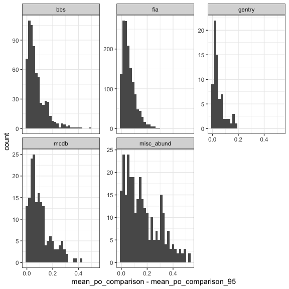<!-- -->

That is, e.g. for BBS, the significant deviation is that the
observed-to-FS dissimilarity is on average .07 higher than the 95th
percentile of FS-to-FS dissimilarity. I am not 100% sure that this is
the best way to make this comparison….

We can examine how a one-tailed 95% breadth index changes over the size
of the feasible set:

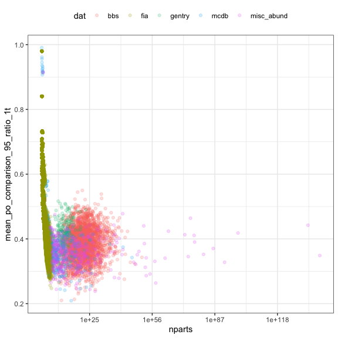<!-- -->

## Number of singletons

Visualization and analysis of nsingletons has a little more nuance than
the others, because there are often relatively few values for
nsingletons at all. 80% of sites have fewer than 20 singletons as the
95th percentile, which is just a rough way of saying that a **lot** of
these are going to be sensitive to whether you define the percentiles as
\> or \>=.

In general the strict \> percentile will give you an (appropriately)
conservative estimate of how many are extraordinarily **high** and the
\>= will give you an appropriate estimate of how many are unusually
**low**. For most metrics it doesn’t really matter, writ large, which
you use, because ties are rare. For this one, you get large numbers of
sites where a lot of values are = to the observed values, and the \>=
decision will therefore give you a jump of a lot of percentile scores.

For the “proportions high/low” calculations, we use *the \> percentile
for high* and *the \>= percentile for low*. For visualization, because
we are interested in both unusually high and unusually low scores, we
can’t just pick one or the other. The histogram using \>= is reliable at
the high end but has a misleading spike at 0, and vice versa. I am
making these plots using the *mean*, which doesn’t have the misleading
spikes at the extremes but does smear things out a little bit.

BBS, MCDB, and Misc have too many rare species, while Gentry has too
few:

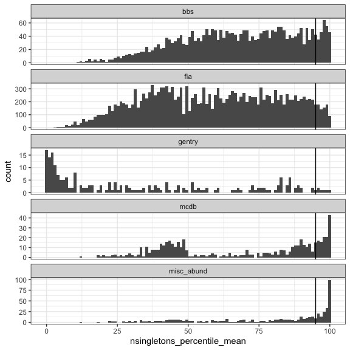<!-- -->

<div class="kable-table">

| dat         | prop\_nsingletons\_high\_raw | prop\_nsingletons\_low\_raw | nsites\_included |
| :---------- | ---------------------------: | --------------------------: | ---------------: |
| bbs         |                    0.0796971 |                   0.0000000 |             2773 |
| gentry      |                    0.0178571 |                   0.2991071 |              224 |
| mcdb        |                    0.1630435 |                   0.0000000 |              552 |
| misc\_abund |                    0.3340081 |                   0.0000000 |              494 |

</div>

*Of sites where the nsingletons value is extreme*, we’re looking at -
for example, in MCDB - an increase of .2 in the proportion of singleton
species in the observed vector over the 95th percentile of scores for
the proportion of singleton species for the feasible set:

<!-- -->

<div class="kable-table">

| dat         | mean\_singles\_change |   n |
| :---------- | --------------------: | --: |
| bbs         |             0.0667465 | 221 |
| gentry      |             0.1054487 |   4 |
| mcdb        |             0.2015754 |  90 |
| misc\_abund |             0.1607340 | 165 |

</div>

Broken out by N/S, you can see that the low values are concentrated in
the Gentry where N/S \< 3, and that high values are most common as N/S
\> 10:

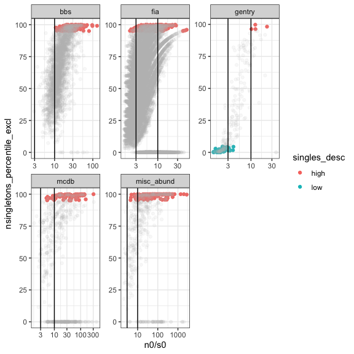<!-- -->

For N/S \< 3:

<div class="kable-table">

| dat         | singletons | prop\_high\_singles\_ex | prop\_low\_singles | nsites |
| :---------- | :--------- | ----------------------: | -----------------: | -----: |
| bbs         | FALSE      |                       0 |          0.0000000 |      1 |
| gentry      | FALSE      |                       0 |          0.7093023 |     86 |
| mcdb        | FALSE      |                       0 |          0.0000000 |     10 |
| misc\_abund | FALSE      |                       0 |          0.0000000 |     13 |

</div>

For N/S \> 10:

<div class="kable-table">

| dat         | singletons | prop\_high\_singles\_ex | prop\_low\_singles | nsites |
| :---------- | :--------- | ----------------------: | -----------------: | -----: |
| bbs         | FALSE      |               0.1060461 |                  0 |   2084 |
| gentry      | FALSE      |               0.1904762 |                  0 |     21 |
| mcdb        | FALSE      |               0.2136986 |                  0 |    365 |
| misc\_abund | FALSE      |               0.4398827 |                  0 |    341 |

</div>

Breadth index - note use of 2 tailed because of interest in low numbers
of singletons for Gentry.

I haven’t fully groked the breadth index, but I think…

  - It declines with increasing size of the feasible set, but not as
    dramatically as the other indices.
  - The Gentry region (low N/S tail on the right) is not remarkable for
    the size of the FS or the (2-tailed) breadth index, but has an
    extremely high median propotion of singletons.

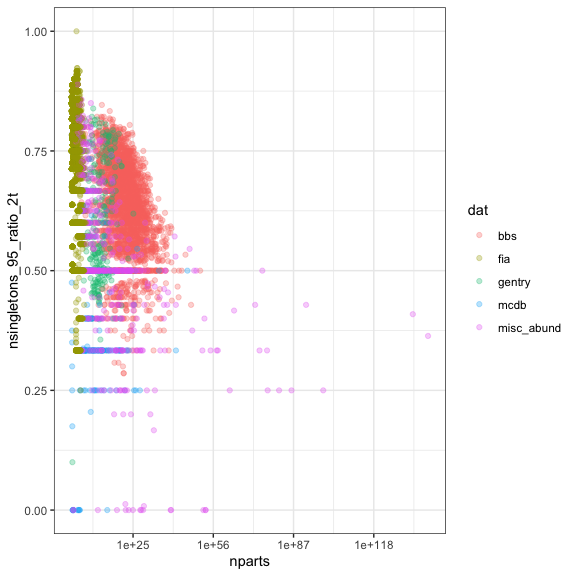<!-- -->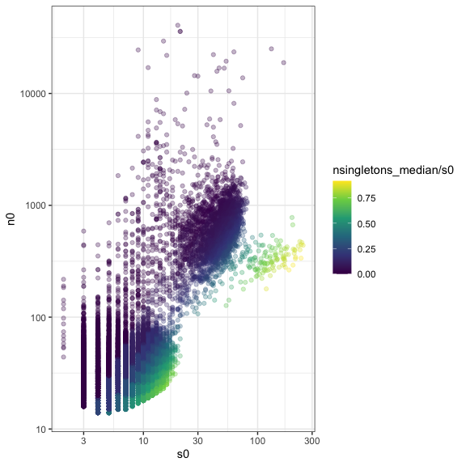<!-- -->

## Shannon diversity

Most datasets have very low Shannon diversity, except for Gentry:

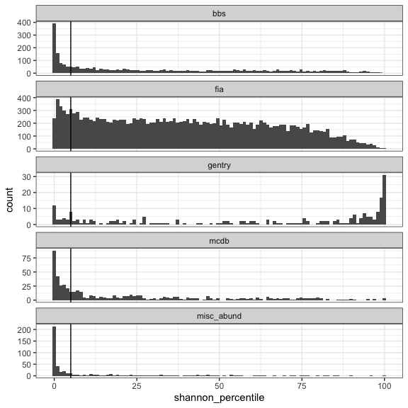<!-- -->

<div class="kable-table">

| dat         | prop\_shannon\_high\_raw | prop\_shannon\_low\_raw | nsites\_included |
| :---------- | -----------------------: | ----------------------: | ---------------: |
| bbs         |                0.0100974 |               0.2802019 |             2773 |
| gentry      |                0.3080357 |               0.1294643 |              224 |
| mcdb        |                0.0108696 |               0.3804348 |              552 |
| misc\_abund |                0.0080972 |               0.6174089 |              494 |

</div>

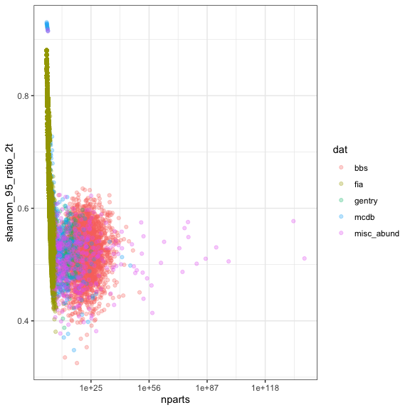<!-- -->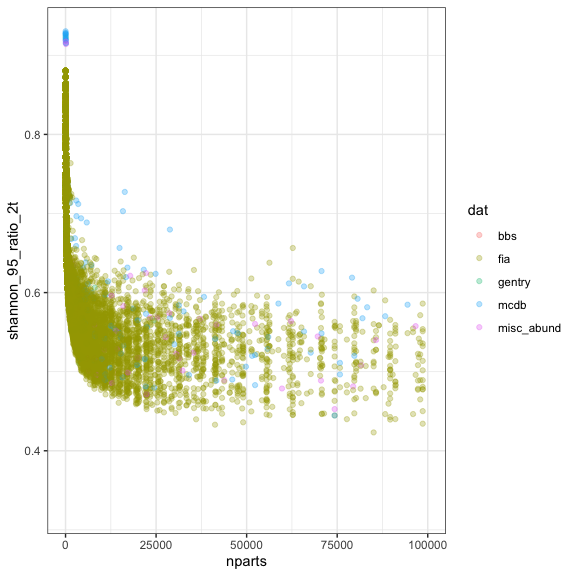<!-- -->

## 2 tailed breadth indices

<!-- -->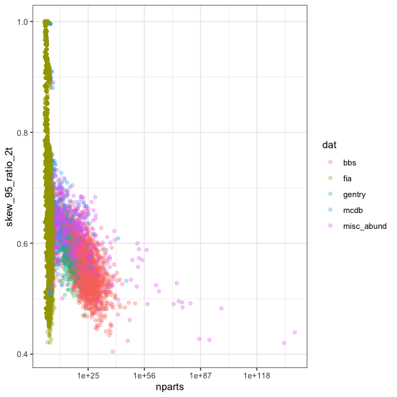<!-- -->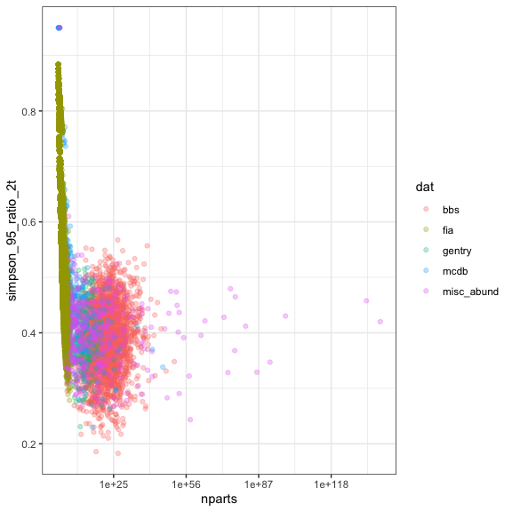<!-- --><!-- -->

## Epic synthesizing figure

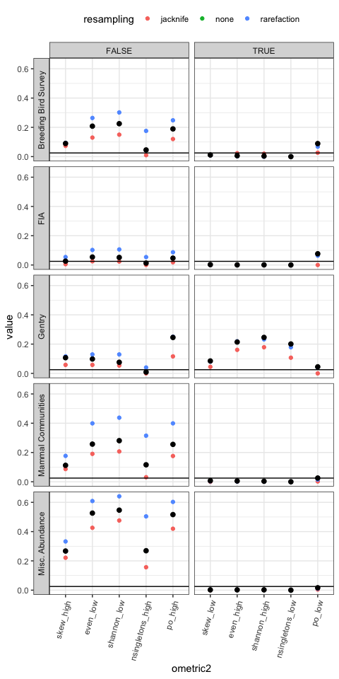<!-- -->

This is an EPIC figure.

Specs:

  - The row panels are different datasets.
  - The left column of panels is the “usual” direction of the effect -
    the way most datasets behave. The right column is the “reverse”
    direction - the way Gentry behaves.
  - The x axis is different metrics.
  - The y axis is the proportion of sites with an extreme value (\> 97.5
    or \< 2.5 percentile, depending on if the metric is “high” or “low”
    respectively) for that metric.
  - The horizontal line is 2.5. Because this is now making a 2tailed
    comparison, the 2.5 cutoff is the proportion of percentile values we
    would expect to be in this range at random.
  - The BLACK points are for raw SADs. The BLUE dots are for SADs
    corrected for nondetection of rare species. The RED dots are for
    SADs resampled via jacknife resampling.
  - Note that a lot of FIA stuff hasn’t finished running, so don’t take
    those panels seriously.

Interpretation:

  - All datasets (except maybe FIA) have extreme values more often than
    usual for almost all metrics.
  - Adjusting for rare species always increases this effect if it has
    any impact at all.
  - Jacknife resampling decreases it, but only to no significance for
    BBS and MCDB \# of singletons.
  - While Gentry often has extreme values in the same direction as the
    other datasets, it also has them very strongly in the *opposite*
    direction.
