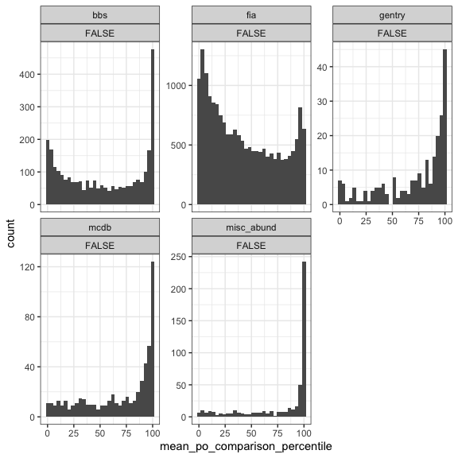

Other metrics
================
Renata Diaz
2021-02-24

  - [Proportion off](#proportion-off)
  - [Number of singletons](#number-of-singletons)
  - [Shannon diversity](#shannon-diversity)

## Proportion off

Defined as the proportion of individuals allocated to species of
different abundances. Most intuitive as a graph - here are two
hypothetical SADs for a community with 7 species and 71 individuals:

<!-- -->

We take the grey area - the area of difference between the two SADs -
and divide it by 2 (because every individual allocated to a different
species will count twice), and divide that total by the total number of
individuals in the community. In principle this metric ranges from 0 to
1, with 0 being no individuals allocated differently and 1 being all
individuals allocated differently, although note that neither 0 nor 1
can actually be achieved.

Here are those calculations:

``` r
(sum(abs(example_fs_wide$sim_1 - example_fs_wide$sim_2)) / 2) / sum(example_fs_wide$sim_1)
```

    ## [1] 0.2535211

``` r
fs_mat <- select(example_fs_wide, sim_1, sim_2) %>% t()

scadsanalysis::proportion_off(fs_mat)
```

    ## [1] 0.2535211

This is a metric of dissimiliarty defined for *two* focal vectors. We
want to know whether the observed SAD is more unlike the elements of its
feasible set than the elements of the feasible set are unlike each
other. To do this, we calculate the proportion off between the observed
SAD and a large number of samples from the feasible set, and take the
mean score of all these comparisons. This tells us how different, on
average, the observed SAD is from samples. We then repeat this process
many times, but instead of the observed SAD we select a random sample
from the feasible set as focal sample, compare this focal sample to many
other samples, and take the mean. The distribution of these scores can
then be compared directly to the score from the observed sample.

<!-- -->

<div class="kable-table">

| singletons | dat                | high\_proportion\_off |
| :--------- | :----------------- | --------------------: |
| FALSE      | bbs                |             0.2300757 |
| FALSE      | gentry             |             0.3125000 |
| FALSE      | mcdb               |             0.3206522 |
| FALSE      | misc\_abund\_short |             0.5850202 |

</div>

Because the units for this metric do not depend on S and N, we can also
estimate the effect size as the difference in the proportion off between
the observed SAD compared to the feasible set and the proportion off for
elements of the feasible set compared to each other.

Looking at those communities where the observed SAD is much more unlike
the elements of the feasible set, than the elements of the FS are unlike
each other, we can ask how much *more* dissimilar the SAD is than the
95th percentile of unlikeness from the feasible set:

<div class="kable-table">

| singletons | dat                | diff\_from\_95 |
| :--------- | :----------------- | -------------: |
| FALSE      | bbs                |      0.0739987 |
| FALSE      | gentry             |      0.0463732 |
| FALSE      | mcdb               |      0.1018986 |
| FALSE      | misc\_abund\_short |      0.1653867 |

</div>

<!-- -->

That is, e.g. for BBS, the significant deviation is that the
observed-to-FS dissimilarity is on average .07 higher than the 95th
percentile of FS-to-FS dissimilarity. I am not 100% sure that this is
the best way to make this comparison….

We can examine how a one-tailed 95% breadth index changes over the size
of the feasible set:

<!-- -->

## Number of singletons

## Shannon diversity
