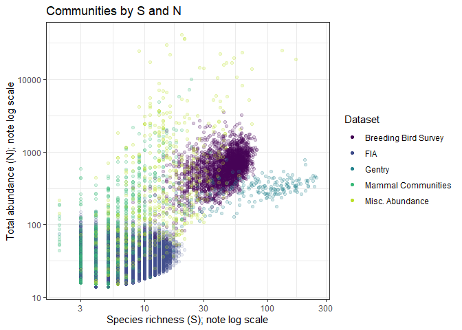
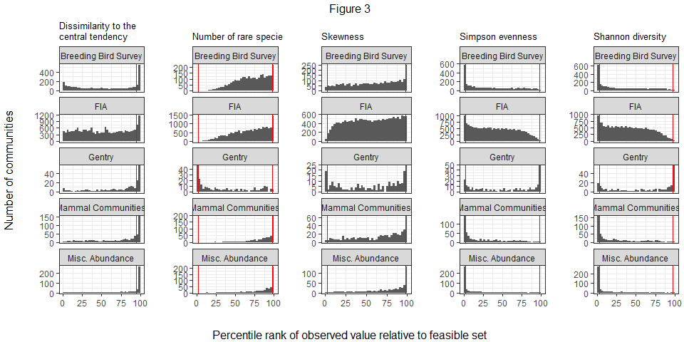
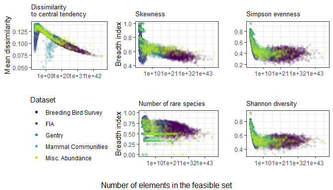
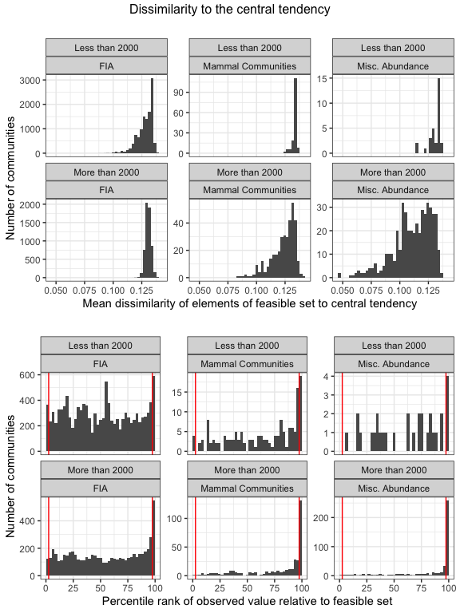
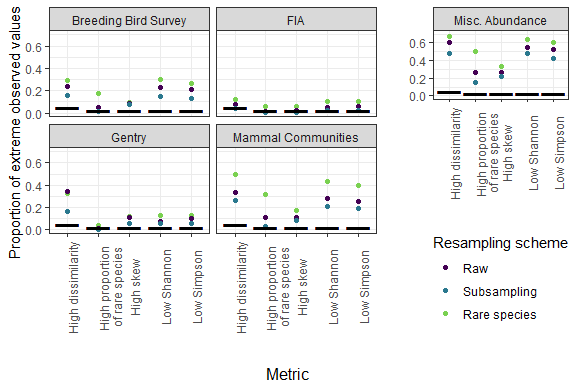
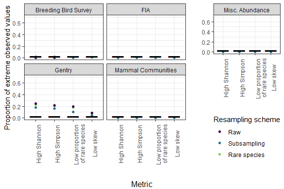

Figures and results for main manuscript
================
Renata Diaz
2021-03-22

  - [Datasets by S and N (Figure 1)](#datasets-by-s-and-n-figure-1)
  - [Dissimilarity (Supplement)](#dissimilarity-supplement)
  - [Metric histograms by dataset (Figure
    4)](#metric-histograms-by-dataset-figure-4)
  - [Results table](#results-table)
  - [Narrowness](#narrowness)
  - [Very small communities](#very-small-communities)
  - [Resampling](#resampling)

# Datasets by S and N (Figure 1)

<!-- -->

<!-- # Illustrations of 95% interval (Figure 2) -->

<!-- To show the 95% interval, we need to load the distribution of shape metric values from the samples from the feasible set for a few communities. See rov_metric.md. -->

<!-- ```{r, fig.dim = c(7,7)} -->

<!-- library(drake) -->

<!-- db <- DBI::dbConnect(RSQLite::SQLite(), here::here("analysis", "drake", "drake-cache-net.sqlite")) -->

<!-- cache <- storr::storr_dbi("datatable", "keystable", db) -->

<!-- cache$del(key = "lock", namespace = "session") -->

<!-- net_summary <- readd(all_di_summary, cache = cache) -->

<!-- net_summary <- net_summary %>% -->

<!--   mutate(log_nparts = log(gmp:::as.double.bigz(nparts))) -->

<!-- example_fs <- readd(fs_s_44_n_13360, cache = cache) -->

<!-- example_di <- readd(di_fs_s_44_n_13360, cache =cache) -->

<!-- example_fs <- example_fs %>% -->

<!--   left_join(example_di) %>% -->

<!--   left_join(net_summary) -->

<!-- example_fs2 <- readd(fs_s_13_n_315, cache = cache) -->

<!-- example_di2 <- readd(di_fs_s_13_n_315, cache =cache) -->

<!-- example_fs2 <- example_fs2 %>% -->

<!--   left_join(example_di2) %>% -->

<!--   left_join(net_summary) -->

<!-- example_fs3 <- readd(fs_s_4_n_34, cache = cache) -->

<!-- example_di3 <- readd(di_fs_s_4_n_34, cache =cache) -->

<!-- example_fs3 <- example_fs3 %>% -->

<!--   left_join(example_di3) %>% -->

<!--   left_join(net_summary) -->

<!-- breadth_plots <- list( -->

<!--   ggplot(example_fs3, aes(rank, abund, group = sim, color = skew)) + -->

<!--     geom_line(alpha = .25) + -->

<!--     theme_bw() + -->

<!--     scale_color_viridis_c(option = "plasma", end = .8) + -->

<!--     ggtitle("Small community", subtitle = paste0("S = ", (example_fs3$s0), "; N = ", (example_fs3$n0[1]))) + -->

<!--     theme(legend.position = "right") + -->

<!--     xlab("Rank") + -->

<!--     ylab("Abundance"), -->

<!--   ggplot(example_fs3, aes(skew)) + -->

<!--   #  geom_density() + -->

<!--     geom_histogram(bins = 50) + -->

<!--     theme_bw() + -->

<!--     geom_vline(xintercept = c(example_fs3$skew_97p5[1], example_fs3$skew_2p5[1]), color = "red") + -->

<!--     ggtitle("", subtitle = paste0("Breadth index: ", round((example_fs3$skew_95_ratio_2t[1]), 2))) + -->

<!--     xlab("Skewness") + -->

<!--     ylab("Count"), -->

<!--   ggplot(example_fs2, aes(rank, abund, group = sim, color = skew)) + -->

<!--     geom_line(alpha = .1) + -->

<!--     theme_bw() + -->

<!--     scale_color_viridis_c(option = "plasma", end = .8) + -->

<!--     ggtitle("Medium community", subtitle = paste0("S = ", (example_fs2$s0), "; N = ", (example_fs2$n0[1]))) + -->

<!--     theme(legend.position = "right")+ -->

<!--     xlab("Rank") + -->

<!--     ylab("Abundance") + -->

<!--     ylim(0, 200), # Remove 3 sads that make the axes too big to be interpretable -->

<!--   ggplot(example_fs2, aes(skew)) + -->

<!--   #  geom_density() + -->

<!--     geom_histogram(bins = 50) + -->

<!--     theme_bw() + -->

<!--     geom_vline(xintercept = c(example_fs2$skew_97p5[1], example_fs2$skew_2p5[1]), color = "red") + -->

<!--     ggtitle("", subtitle =  paste0("Breadth index: ", round((example_fs2$skew_95_ratio_1t[1]), 2)))+ -->

<!--     xlab("Skewness") + -->

<!--     ylab("Count"), -->

<!--   ggplot(example_fs, aes(rank, abund, group = sim, color = skew)) + -->

<!--     geom_line(alpha = .1) + -->

<!--     theme_bw() + -->

<!--     scale_color_viridis_c(option = "plasma", end = .8) + -->

<!--     ggtitle("Large community", subtitle = paste0("S = ", (example_fs$s0), "; N = ", (example_fs$n0[1]))) + -->

<!--     theme(legend.position = "right") + -->

<!--     ylim(0, 4000) + # Remove a very few very very uneven SADs that make the scale too big to be interpretable -->

<!--     theme(axis.text.y = element_text(size = 6, angle = 60))+ -->

<!--     xlab("Rank") + -->

<!--     ylab("Abundance"), -->

<!--   ggplot(example_fs, aes(skew)) + -->

<!--    # geom_density() + -->

<!--     geom_histogram(bins = 50) + -->

<!--     theme_bw() + -->

<!--     geom_vline(xintercept = c(example_fs$skew_97p5[1], example_fs$skew_2p5[1]), color = "red") + -->

<!--     ggtitle("", subtitle =  paste0("Breadth index: ", round((example_fs$skew_95_ratio_1t[1]), 2)))+ -->

<!--     xlab("Skewness") + -->

<!--     ylab("Count") -->

<!-- ) -->

<!-- fig_1 <- gridExtra::grid.arrange(grobs = breadth_plots, ncol = 2, top = textGrob("Figure 2", gp = gpar(fill = "white"))) -->

<!-- plot(fig_1) -->

<!-- signif(as.numeric(example_di$nparts), digits = 2) -->

<!-- (as.numeric(example_di2$nparts)) -->

<!-- as.numeric(example_di3$nparts) -->

<!-- DBI::dbDisconnect(db) -->

<!-- rm(cache) -->

<!-- rm(db) -->

<!-- ``` -->

# Dissimilarity (Supplement)

<!-- ```{r, fig.dim = c(4, 4)} -->

<!-- ggplot(all_di, aes(sim_pos_from_best, real_po, color = `Observed \npercentile score`)) + -->

<!--   geom_point(alpha = .3) + -->

<!--   geom_point(data = filter(all_di, s0 < 0)) + -->

<!--   geom_abline(slope = 1, intercept = 0) + -->

<!--   scale_color_viridis_d(end = .8, direction = -1) + -->

<!--   xlab("Mean of elements from feasible set") + -->

<!--   ylab("Observed value") + -->

<!--   ggtitle("Dissimilarity to the central tendency") +  theme(legend.position = "bottom")#, -->

<!-- # -->

<!-- # -->

<!-- # ggplot(filter(all_di, nparts < 10 ^ 50), aes(nparts, sim_pos_from_best, color = Dataset)) + -->

<!-- #   geom_point(alpha = .3) + -->

<!-- #   geom_point(data = filter(all_di, s0 < 0)) + -->

<!-- #   scale_color_viridis_d(end = .9) + -->

<!-- #   xlab("Number of elements in the feasible set") + -->

<!-- #   ylab("Mean dissimilarity of feasible set to central tendency") + -->

<!-- #   scale_x_log10() + -->

<!-- #   ggtitle("Over the size of the feasible set") -->

<!-- # ), ncol = 1, -->

<!-- #top = textGrob("Dissimilarity to central tendency")) -->

<!-- ``` -->

# Metric histograms by dataset (Figure 4)

<!-- -->

# Results table

    ## Joining, by = "Dataset"
    ## Joining, by = "Dataset"

    ## Note: Using an external vector in selections is ambiguous.
    ## ℹ Use `all_of(cols1)` instead of `cols1` to silence this message.
    ## ℹ See <https://tidyselect.r-lib.org/reference/faq-external-vector.html>.
    ## This message is displayed once per session.

<div class="kable-table">

| Dataset              | High dissimilarity | High proportion of rare species | High skew       | Low Simpson     | Low Shannon     |
| :------------------- | :----------------- | :------------------------------ | :-------------- | :-------------- | :-------------- |
| Breeding Bird Survey | 23%; n = 2773      | 4.5%; n = 2773                  | 9%; n = 2773    | 21%; n = 2773   | 23%; n = 2773   |
| FIA                  | 7.2%; n = 18447    | 1.4%; n = 17410                 | 2.8%; n = 17410 | 5.8%; n = 17410 | 5.5%; n = 17410 |
| Gentry               | 34%; n = 224       | 0.9%; n = 223                   | 11%; n = 223    | 9.9%; n = 223   | 7.6%; n = 223   |
| Mammal Communities   | 32%; n = 552       | 13%; n = 511                    | 12%; n = 505    | 28%; n = 511    | 30%; n = 511    |
| Misc. Abundance      | 59%; n = 494       | 27%; n = 486                    | 27%; n = 484    | 53%; n = 486    | 56%; n = 486    |

</div>

    ## Note: Using an external vector in selections is ambiguous.
    ## ℹ Use `all_of(cols2)` instead of `cols2` to silence this message.
    ## ℹ See <https://tidyselect.r-lib.org/reference/faq-external-vector.html>.
    ## This message is displayed once per session.

<div class="kable-table">

| Dataset              | Low proportion of rare species | Low skew         | High Simpson      | High Shannon      |
| :------------------- | :----------------------------- | :--------------- | :---------------- | :---------------- |
| Breeding Bird Survey | 0%; n = 2773                   | 1.1%; n = 2773   | 0.61%; n = 2773   | 0.36%; n = 2773   |
| FIA                  | 0%; n = 17410                  | 0.28%; n = 17410 | 0.063%; n = 17410 | 0.086%; n = 17410 |
| Gentry               | 20%; n = 223                   | 8.5%; n = 223    | 22%; n = 223      | 25%; n = 223      |
| Mammal Communities   | 0%; n = 511                    | 0.79%; n = 505   | 0.59%; n = 511    | 0.39%; n = 511    |
| Misc. Abundance      | 0%; n = 486                    | 0.21%; n = 484   | 0.21%; n = 486    | 0.21%; n = 486    |

</div>

# Narrowness

    ## Warning: Removed 8 rows containing missing values (geom_point).

<!-- -->

<!-- ```{r, fig.dim = c(10,5)} -->

<!-- fig_2 <- gridExtra::grid.arrange(grobs = list( -->

<!--   plot_narrowness_hist(all_di, "sim_pos_from_best", "Dissimilarity to the \ncentral tendency", facetvar = "Dataset"), -->

<!--   plot_narrowness_hist(all_di, "nsingletons_95_ratio_2t", "\nNumber of rare species", facetvar = "Dataset"), -->

<!--   plot_narrowness_hist(all_di, "skew_95_ratio_2t", "\nSkewness", facetvar = "Dataset", min_s0 = 3), -->

<!--   plot_narrowness_hist(all_di, "simpson_95_ratio_2t", "\nSimpson evenness", facetvar = "Dataset"), -->

<!--   plot_narrowness_hist(all_di, "shannon_95_ratio_2t", "\nShannon diversity", facetvar = "Dataset") -->

<!-- ), ncol = 5, -->

<!--  left = textGrob("Number of communities", rot = 90, gp = gpar(fill = "black")), gp = gpar(fill = "white")) -->

<!-- ``` -->

<!-- # Gentry -->

<!-- ```{r} -->

<!-- gentry_di <- filter(all_di, Dataset == "Gentry") -->

<!-- gentry_di <- gentry_di %>% -->

<!--   mutate(low_avg_abund = ifelse(n0/s0 < 3, "N:S < 3", "N:S > 3")) -->

<!-- fig_2 <- gridExtra::grid.arrange(grobs = list( -->

<!--   plot_percentile_hist(gentry_di, "nsingletons_percentile_mean", "\nNumber of rare species", facetvar = "low_avg_abund"), -->

<!--   plot_percentile_hist(gentry_di, "skew_percentile_mean", "\nSkewness", facetvar = "low_avg_abund", min_s0 = 3), -->

<!--   plot_percentile_hist(gentry_di, "simpson_percentile_mean", "\nSimpson evenness", facetvar = "low_avg_abund"), -->

<!--   plot_percentile_hist(gentry_di, "shannon_percentile_mean", "\nShannon diversity", facetvar = "low_avg_abund") -->

<!-- ), ncol = 2, -->

<!--  left = textGrob("Number of communities", rot = 90, gp = gpar(fill = "black")), -->

<!-- bottom = textGrob("Percentile rank of observed value relative to feasible set"), gp = gpar(fill = "white")) -->

<!-- ``` -->

<!-- # Comparison of FIA and comparably sized communities (Figure 4) -->

<!-- ```{r, fig.dim = c(10, 5)} -->

<!-- fia_max_s = max(filter(all_di, dat == "fia")$s0) -->

<!-- fia_max_n = max(filter(all_di, dat == "fia")$n0) -->

<!-- fia = filter(all_di, dat == "fia") -->

<!-- small_di <- all_di %>% -->

<!--   filter(s0 <= fia_max_s, -->

<!--          n0 <= fia_max_n) %>% -->

<!--   mutate(fia_yn = ifelse(dat == "fia", "fia", "other datasets"), -->

<!--          right_corner = FALSE) -->

<!-- for(i in 1:nrow(small_di)) { -->

<!--   if(small_di$dat[i] != "fia") { -->

<!--     fia_match_s0 = filter(fia, s0 >= small_di$s0[i]) -->

<!--     max_n0_for_this_s0 = max(fia_match_s0$n0) -->

<!--     small_di$right_corner[i] = small_di$n0[i] > max_n0_for_this_s0 -->

<!--   } -->

<!-- } -->

<!-- small_di <- small_di %>% -->

<!--   filter(!right_corner) -->

<!-- not_fia <- filter(small_di, fia_yn != "fia") -->

<!-- fia = filter(small_di, dat == "fia") -->

<!-- small_di_s_n <- small_di %>% -->

<!--   select(s0, n0) %>% -->

<!--   distinct() %>% -->

<!--   mutate(in_fia = FALSE, -->

<!--          in_not_fia = FALSE) -->

<!-- for(i in 1:nrow(small_di_s_n)) { -->

<!--   this_s0 = small_di_s_n$s0[i] -->

<!--   this_n0 = small_di_s_n$n0[i] -->

<!--   fia_matches = filter(fia, s0 == this_s0, n0 == this_n0) -->

<!--   not_fia_matches = filter(not_fia, s0 == this_s0, n0 == this_n0) -->

<!--   small_di_s_n$in_fia[i] = nrow(fia_matches) > 0 -->

<!--   small_di_s_n$in_not_fia[i] = nrow(not_fia_matches) > 0 -->

<!-- } -->

<!-- small_di_s_n <- filter(small_di_s_n, in_fia, in_not_fia) -->

<!-- set.seed(1977) -->

<!-- subsamples <- list() -->

<!-- for(i in 1:nrow(small_di_s_n)) { -->

<!--   this_s0 = small_di_s_n$s0[i] -->

<!--   this_n0 = small_di_s_n$n0[i] -->

<!--   fia_matches = filter(fia, s0 == this_s0, n0 == this_n0) -->

<!--   not_fia_matches = filter(not_fia, s0 == this_s0, n0 == this_n0) -->

<!--   n_to_draw = min(nrow(fia_matches), nrow(not_fia_matches)) -->

<!--   fia_draw = sample.int(n = nrow(fia_matches), size = n_to_draw, replace = F) -->

<!--   not_fia_draw = sample.int(n = nrow(not_fia_matches), size = n_to_draw, replace = F) -->

<!--   subsamples[[i]] <- (bind_rows(fia_matches[fia_draw,], not_fia_matches[not_fia_draw, ])) -->

<!-- } -->

<!-- sub_di <- bind_rows(subsamples) %>% -->

<!--   mutate(Dataset = ifelse(fia_yn == "fia", "FIA", "Other datasets")) -->

<!-- fia_di <- filter(sub_di, fia_yn == "fia") -->

<!-- other_di <- filter(sub_di, fia_yn != "fia") -->

<!-- ks_compare <- function(fia_df, other_df, compare_var) { -->

<!--   if(grepl("skew", compare_var)) { -->

<!--     fia_df <- filter(fia_df, s0 > 2) -->

<!--     other_df <- filter(fia_df, s0 >2) -->

<!--   } -->

<!--   if(grepl("sim_pos", compare_var)) { -->

<!--     fia_df <- filter(fia_df, nparts > 20) -->

<!--     other_df <- filter(other_df, nparts > 20) -->

<!--   } else { -->

<!--       fia_df <- filter(fia_df, nparts > 40) -->

<!--     other_df <- filter(other_df, nparts > 40) -->

<!--   } -->

<!--   kstest <- ks.test(fia_df[[compare_var]], other_df[[compare_var]]) -->

<!--   return(data.frame( -->

<!--     var = compare_var, -->

<!--     d = kstest$statistic, -->

<!--     p = kstest$p.value -->

<!--   )) -->

<!-- } -->

<!-- simpson_rat_ks <- ks_compare(fia_di, other_di, "simpson_95_ratio_2t") -->

<!-- skew_rat_ks <- ks_compare(fia_di, other_di, "skew_95_ratio_2t") -->

<!-- shannon_rat_ks <- ks_compare(fia_di, other_di, "shannon_95_ratio_2t") -->

<!-- nsingletons_rat_ks <- ks_compare(fia_di, other_di, "nsingletons_95_ratio_2t") -->

<!-- diss_rat_ks <- ks_compare(fia_di, other_di, "sim_pos_from_best") -->

<!-- bind_rows(simpson_rat_ks, skew_rat_ks, shannon_rat_ks, nsingletons_rat_ks, diss_rat_ks) -->

<!-- simpson_perc_ks <- ks_compare(fia_di, other_di, "simpson_percentile") -->

<!-- skew_perc_ks <- ks_compare(fia_di, other_di, "skew_percentile_excl") -->

<!-- shannon_perc_ks <- ks_compare(fia_di, other_di, "shannon_percentile") -->

<!-- nsingletons_perc_ks <- ks_compare(fia_di, other_di, "nsingletons_percentile_excl") -->

<!-- diss_perc_ks <- ks_compare(fia_di, other_di, "real_po_percentile_excl") -->

<!-- bind_rows(simpson_perc_ks, skew_perc_ks, shannon_perc_ks, nsingletons_perc_ks, diss_perc_ks) -->

<!-- fig_2 <- gridExtra::grid.arrange(grobs = list( -->

<!--   plot_percentile_hist(sub_di, "real_po_percentile_mean", "Dissimilarity to the \ncentral tendency", facetvar = "Dataset", tails = 1), -->

<!--   plot_percentile_hist(sub_di, "nsingletons_percentile_mean", "\nNumber of rare species", facetvar = "Dataset"), -->

<!--   plot_percentile_hist(sub_di, "skew_percentile_mean", "\nSkewness", facetvar = "Dataset", min_s0 = 3), -->

<!--   plot_percentile_hist(sub_di, "simpson_percentile_mean", "\nSimpson evenness", facetvar = "Dataset"), -->

<!--   plot_percentile_hist(sub_di, "shannon_percentile_mean", "\nShannon diversity", facetvar = "Dataset") -->

<!-- ), ncol = 5, -->

<!-- top = textGrob("Figure 2", gp = gpar(fill = "white")), left = textGrob("Number of communities", rot = 90, gp = gpar(fill = "black")), -->

<!-- bottom = textGrob("Percentile rank of observed value relative to feasible set"), gp = gpar(fill = "white")) -->

<!-- fig_2 <- gridExtra::grid.arrange(grobs = list( -->

<!--   plot_narrowness_hist(sub_di, "sim_pos_from_best", "Dissimilarity to the \ncentral tendency", facetvar = "Dataset"), -->

<!--   plot_narrowness_hist(sub_di, "nsingletons_95_ratio_2t", "\nNumber of rare species", facetvar = "Dataset"), -->

<!--   plot_narrowness_hist(sub_di, "skew_95_ratio_2t", "\nSkewness", facetvar = "Dataset", min_s0 = 3), -->

<!--   plot_narrowness_hist(sub_di, "simpson_95_ratio_2t", "\nSimpson evenness", facetvar = "Dataset"), -->

<!--   plot_narrowness_hist(sub_di, "shannon_95_ratio_2t", "\nShannon diversity", facetvar = "Dataset") -->

<!-- ), ncol = 5, -->

<!--  left = textGrob("Number of communities", rot = 90, gp = gpar(fill = "black")), gp = gpar(fill = "white")) -->

<!-- diss_results <- sub_di %>% -->

<!--   filter(nparts > 20) %>% -->

<!--   group_by(Dataset) %>% -->

<!--   summarize(high_diss = mean(real_po_percentile_excl > 95), -->

<!--             nsites = dplyr::n()) %>% -->

<!--   ungroup() %>% -->

<!--   mutate(`High dissimilarity` = paste0(signif(100 * high_diss, 2), "%; n = ", nsites)) %>% -->

<!--   select(-nsites) -->

<!-- skew_results <- sub_di %>% -->

<!--   filter(nparts > 40, s0 > 2) %>% -->

<!--   group_by(Dataset) %>% -->

<!--   summarize(high_skew = mean(skew_percentile_excl > 97.5), -->

<!--             low_skew = mean(skew_percentile < 2.5), -->

<!--             nsites = dplyr::n()) %>% -->

<!--   ungroup() %>% -->

<!--   mutate(`High skew` = paste0(signif(100 * high_skew, 2), "%; n = ", nsites), -->

<!--          `Low skew` = paste0(signif(100 * low_skew, 2), "%; n = ", nsites)) %>% -->

<!--   select(-nsites) -->

<!-- metric_results <- sub_di %>% -->

<!--   filter(nparts > 40) %>% -->

<!--   group_by(Dataset) %>% -->

<!--   summarize(high_simpson = mean(simpson_percentile_excl > 97.5), -->

<!--             low_simpson = mean(simpson_percentile < 2.5), -->

<!--             high_shannon = mean(shannon_percentile_excl > 97.5), -->

<!--             low_shannon = mean(shannon_percentile < 2.5), -->

<!--             high_nsingletons = mean(nsingletons_percentile_excl > 97.5), -->

<!--             low_nsingletons = mean(nsingletons_percentile < 2.5), -->

<!--             nsites = dplyr::n()) %>% -->

<!--   ungroup() %>% -->

<!--   mutate(`High Simpson` = paste0(signif(100 * high_simpson, 2), "%; n = ", nsites), -->

<!--          `Low Simpson` = paste0(signif(100 * low_simpson, 2), "%; n = ", nsites), -->

<!--          `High Shannon` = paste0(signif(100 * high_shannon, 2), "%; n = ", nsites), -->

<!--          `Low Shannon` = paste0(signif(100 * low_shannon, 2), "%; n = ", nsites), -->

<!--          `High proportion of rare species` = paste0(signif(100 * high_nsingletons, 2), "%; n = ", nsites), -->

<!--          `Low proportion of rare species` = paste0(signif(100 * low_nsingletons, 2), "%; n = ", nsites)) %>% -->

<!--   select(-nsites) -->

<!-- all_results <- left_join(diss_results, skew_results) %>% -->

<!--   left_join(metric_results) -->

<!-- cols1 <- c("Dataset", "High dissimilarity", "High proportion of rare species", "High skew", "Low Simpson", "Low Shannon") -->

<!-- all_results %>% -->

<!--   select(cols1) -->

<!-- ``` -->

# Very small communities

    ## `summarise()` has grouped output by 'Dataset'. You can override using the `.groups` argument.
    ## `summarise()` has grouped output by 'Dataset'. You can override using the `.groups` argument.
    ## `summarise()` has grouped output by 'Dataset'. You can override using the `.groups` argument.

    ## Joining, by = c("Dataset", "Number of elements")
    ## Joining, by = c("Dataset", "Number of elements")

<div class="kable-table">

| Dataset              | Number of elements | High dissimilarity | High proportion of rare species | High skew       | Low Simpson     | Low Shannon     |
| :------------------- | :----------------- | :----------------- | :------------------------------ | :-------------- | :-------------- | :-------------- |
| Breeding Bird Survey | Less than 2000     | 0%; n = 1          | 0%; n = 1                       | 0%; n = 1       | 0%; n = 1       | 0%; n = 1       |
| Breeding Bird Survey | More than 2000     | 23%; n = 2772      | 4.5%; n = 2772                  | 9%; n = 2772    | 21%; n = 2772   | 23%; n = 2772   |
| FIA                  | Less than 2000     | 5.3%; n = 12553    | 1.2%; n = 11516                 | 1.2%; n = 11516 | 3.9%; n = 11516 | 3.6%; n = 11516 |
| FIA                  | More than 2000     | 11%; n = 5894      | 1.7%; n = 5894                  | 6%; n = 5894    | 9.5%; n = 5894  | 9%; n = 5894    |
| Gentry               | Less than 2000     | 0%; n = 1          | NA                              | NA              | NA              | NA              |
| Gentry               | More than 2000     | 34%; n = 223       | 0.9%; n = 223                   | 11%; n = 223    | 9.9%; n = 223   | 7.6%; n = 223   |
| Mammal Communities   | Less than 2000     | 12%; n = 193       | 4.6%; n = 152                   | 1.4%; n = 146   | 12%; n = 152    | 12%; n = 152    |
| Mammal Communities   | More than 2000     | 42%; n = 359       | 16%; n = 359                    | 17%; n = 359    | 35%; n = 359    | 38%; n = 359    |
| Misc. Abundance      | Less than 2000     | 11%; n = 38        | 6.7%; n = 30                    | 7.1%; n = 28    | 10%; n = 30     | 10%; n = 30     |
| Misc. Abundance      | More than 2000     | 63%; n = 456       | 29%; n = 456                    | 29%; n = 456    | 56%; n = 456    | 59%; n = 456    |

</div>

<div class="kable-table">

| Dataset            | Proportion with nparts \< 2000 |
| :----------------- | -----------------------------: |
| FIA                |                      0.6804901 |
| Mammal Communities |                      0.3496377 |
| Misc. Abundance    |                      0.0769231 |

</div>

<!-- -->

<!-- ```{r, fig.dim = c(8,3)} -->

<!-- ggplot(filter(all_di, dat %in% c("fia", "mcdb", "misc_abund")), aes(s0, n0, color = `Number of elements`)) + -->

<!--   geom_point(alpha = .1) + -->

<!--   xlim(0, 30) + -->

<!--   ylim(0,150) + -->

<!--     facet_wrap(vars(Dataset), nrow = 1) -->

<!-- ggplot(filter(all_di, dat %in% c("fia", "mcdb", "misc_abund"), nparts > 2000, nparts < 1e+20), aes(nparts)) + -->

<!--   geom_histogram() + -->

<!--   facet_wrap(vars(`Number of elements`, Dataset), scales = "free_y") + -->

<!--   scale_x_log10() -->

<!-- ggplot(filter(all_di, dat %in% c("fia", "mcdb", "misc_abund"), nparts < 2000), aes(nparts)) + -->

<!--   geom_histogram() + -->

<!--   facet_wrap(vars(`Number of elements`, Dataset), scales = "free_y") + -->

<!--   scale_x_log10() -->

<!-- ``` -->

<!-- ```{r} -->

<!-- all_di <- all_di %>% -->

<!--   mutate( `Number of elements` = ifelse(nparts < 1000, "Less than 1000", "More than 1000")) -->

<!-- diss_results <- all_di %>% -->

<!--   filter(nparts > 20) %>% -->

<!--   group_by(Dataset,  `Number of elements`) %>% -->

<!--   summarize(high_diss = mean(real_po_percentile_excl > 95), -->

<!--             nsites = dplyr::n()) %>% -->

<!--   ungroup() %>% -->

<!--   mutate(`High dissimilarity` = paste0(signif(100 * high_diss, 2), "%; n = ", nsites)) %>% -->

<!--   select(-nsites) -->

<!-- ggplot(filter(all_di, dat == "mcdb"), aes(skew_95_ratio_2t)) + -->

<!--   geom_histogram() + -->

<!--   facet_wrap(vars(`Number of elements`), scales = "free_y") -->

<!-- skew_results <- all_di %>% -->

<!--   filter(nparts > 40, s0 > 2) %>% -->

<!--   group_by(Dataset,  `Number of elements`) %>% -->

<!--   summarize(high_skew = mean(skew_percentile_excl > 97.5), -->

<!--             low_skew = mean(skew_percentile < 2.5), -->

<!--             nsites = dplyr::n()) %>% -->

<!--   ungroup() %>% -->

<!--   mutate(`High skew` = paste0(signif(100 * high_skew, 2), "%; n = ", nsites), -->

<!--          `Low skew` = paste0(signif(100 * low_skew, 2), "%; n = ", nsites)) %>% -->

<!--   select(-nsites) -->

<!-- metric_results <- all_di %>% -->

<!--   filter(nparts > 40) %>% -->

<!--   group_by(Dataset, `Number of elements`) %>% -->

<!--   summarize(high_simpson = mean(simpson_percentile_excl > 97.5), -->

<!--             low_simpson = mean(simpson_percentile < 2.5), -->

<!--             high_shannon = mean(shannon_percentile_excl > 97.5), -->

<!--             low_shannon = mean(shannon_percentile < 2.5), -->

<!--             high_nsingletons = mean(nsingletons_percentile_excl > 97.5), -->

<!--             low_nsingletons = mean(nsingletons_percentile < 2.5), -->

<!--             nsites = dplyr::n()) %>% -->

<!--   ungroup() %>% -->

<!--   mutate(`High Simpson` = paste0(signif(100 * high_simpson, 2), "%; n = ", nsites), -->

<!--          `Low Simpson` = paste0(signif(100 * low_simpson, 2), "%; n = ", nsites), -->

<!--          `High Shannon` = paste0(signif(100 * high_shannon, 2), "%; n = ", nsites), -->

<!--          `Low Shannon` = paste0(signif(100 * low_shannon, 2), "%; n = ", nsites), -->

<!--          `High proportion of rare species` = paste0(signif(100 * high_nsingletons, 2), "%; n = ", nsites), -->

<!--          `Low proportion of rare species` = paste0(signif(100 * low_nsingletons, 2), "%; n = ", nsites)) %>% -->

<!--   select(-nsites) -->

<!-- all_results <- left_join(diss_results, skew_results) %>% -->

<!--   left_join(metric_results) -->

<!-- cols1 <- c("Dataset", "Number of elements", "High dissimilarity", "High proportion of rare species", "High skew", "Low Simpson", "Low Shannon") -->

<!-- all_results %>% -->

<!--   select(cols1) -->

<!-- ``` -->

# Resampling

    ## Joining, by = c("sim", "source", "dat", "site", "singletons", "s0", "n0", "nparts")
    ## Joining, by = c("sim", "source", "dat", "site", "singletons", "s0", "n0", "nparts")

    ## Warning: Unknown or uninitialised column: `njks_skew`.

    ## `summarise()` has grouped output by 'Dataset'. You can override using the `.groups` argument.

    ## `summarise()` has grouped output by 'Dataset'. You can override using the `.groups` argument.

    ## Joining, by = c("Dataset", "resampling")

<div class="kable-table">

| Dataset              | Resampling scheme | High dissimilarity | High proportion of rare species | High skew       | Low Simpson     | Low Shannon     |
| :------------------- | :---------------- | :----------------- | :------------------------------ | :-------------- | :-------------- | :-------------- |
| Breeding Bird Survey | Raw               | 23%; n =2773       | 4.5%; n =2773                   | 9%; n = 2773    | 21%; n = 2773   | 23%; n = 2773   |
| Breeding Bird Survey | Subsampling       | 16%; n =300        | 1%; n =300                      | 7.3%; n = 300   | 13%; n = 300    | 15%; n = 300    |
| Breeding Bird Survey | Rare species      | 29%; n =2773       | 18%; n =2773                    | 9.4%; n = 2773  | 26%; n = 2773   | 30%; n = 2773   |
| FIA                  | Raw               | 7.4%; n =17410     | 1.3%; n =18447                  | 2.6%; n = 18447 | 5.4%; n = 18447 | 5.1%; n = 18447 |
| FIA                  | Subsampling       | 3.8%; n =1118      | 0.072%; n =1388                 | 0.58%; n = 1388 | 2.5%; n = 1388  | 2.4%; n = 1388  |
| FIA                  | Rare species      | 12%; n =17918      | 5.4%; n =18736                  | 5.4%; n = 18736 | 10%; n = 18736  | 11%; n = 18736  |
| Gentry               | Raw               | 34%; n =223        | 0.89%; n =224                   | 11%; n = 223    | 9.8%; n = 224   | 7.6%; n = 224   |
| Gentry               | Subsampling       | 17%; n =223        | 0%; n =224                      | 5.8%; n = 223   | 5.8%; n = 224   | 5.4%; n = 224   |
| Gentry               | Rare species      | 33%; n =223        | 4%; n =224                      | 12%; n = 223    | 13%; n = 224    | 13%; n = 224    |
| Mammal Communities   | Raw               | 34%; n =511        | 12%; n =552                     | 11%; n = 540    | 26%; n = 552    | 28%; n = 552    |
| Mammal Communities   | Subsampling       | 27%; n =432        | 3.2%; n =473                    | 8.9%; n = 471   | 19%; n = 473    | 21%; n = 473    |
| Mammal Communities   | Rare species      | 50%; n =555        | 31%; n =594                     | 18%; n = 592    | 40%; n = 594    | 44%; n = 594    |
| Misc. Abundance      | Raw               | 60%; n =486        | 27%; n =494                     | 27%; n = 492    | 53%; n = 494    | 55%; n = 494    |
| Misc. Abundance      | Subsampling       | 49%; n =474        | 16%; n =479                     | 22%; n = 477    | 43%; n = 479    | 48%; n = 479    |
| Misc. Abundance      | Rare species      | 67%; n =488        | 50%; n =496                     | 33%; n = 494    | 61%; n = 496    | 64%; n = 496    |

</div>

<div class="kable-table">

| Dataset              | Resampling scheme | Low proportion of rare species | Low skew          | High Simpson      | High Shannon      |
| :------------------- | :---------------- | :----------------------------- | :---------------- | :---------------- | :---------------- |
| Breeding Bird Survey | Raw               | 0%; n =2773                    | 1.1%; n = 2773    | 0.61%; n = 2773   | 0.36%; n = 2773   |
| Breeding Bird Survey | Subsampling       | 0%; n =300                     | 1%; n = 300       | 2.3%; n = 300     | 2%; n = 300       |
| Breeding Bird Survey | Rare species      | 0%; n =2773                    | 0.83%; n = 2773   | 0.22%; n = 2773   | 0.036%; n = 2773  |
| FIA                  | Raw               | 0%; n =18447                   | 0.27%; n = 18447  | 0.06%; n = 18447  | 0.081%; n = 18447 |
| FIA                  | Subsampling       | 0%; n =1388                    | 0%; n = 1388      | 0%; n = 1388      | 0%; n = 1388      |
| FIA                  | Rare species      | 0%; n =18736                   | 0.096%; n = 18736 | 0.011%; n = 18736 | 0.021%; n = 18736 |
| Gentry               | Raw               | 20%; n =224                    | 8.5%; n = 223     | 21%; n = 224      | 25%; n = 224      |
| Gentry               | Subsampling       | 11%; n =224                    | 4.5%; n = 223     | 16%; n = 224      | 18%; n = 224      |
| Gentry               | Rare species      | 18%; n =224                    | 8.1%; n = 223     | 22%; n = 224      | 23%; n = 224      |
| Mammal Communities   | Raw               | 0%; n =552                     | 0.74%; n = 540    | 0.54%; n = 552    | 0.36%; n = 552    |
| Mammal Communities   | Subsampling       | 0%; n =473                     | 0%; n = 471       | 0.21%; n = 473    | 0.21%; n = 473    |
| Mammal Communities   | Rare species      | 0%; n =594                     | 0.34%; n = 592    | 0.17%; n = 594    | 0.17%; n = 594    |
| Misc. Abundance      | Raw               | 0%; n =494                     | 0.2%; n = 492     | 0.2%; n = 494     | 0.2%; n = 494     |
| Misc. Abundance      | Subsampling       | 0%; n =479                     | 0%; n = 477       | 0.21%; n = 479    | 0.21%; n = 479    |
| Misc. Abundance      | Rare species      | 0%; n =496                     | 0.2%; n = 494     | 0.2%; n = 496     | 0.2%; n = 496     |

</div>

    ## Joining, by = "ometric2"

<!-- --><!-- -->

<!-- ```{r, fig.dim = c(10,5)} -->

<!-- all_di_with_resamples <- all_di_with_resamples %>% -->

<!--   group_by_all() %>% -->

<!--   mutate(real_po_percentile_mean = mean(real_po_percentile, real_po_percentile_excl, na.rm = T), -->

<!--          skew_percentile_mean = mean(skew_percentile, skew_percentile_excl, na.rm = T), -->

<!--          simpson_percentile_mean = mean(simpson_percentile,simpson_percentile_excl, na.rm = T), -->

<!--          shannon_percentile_mean = mean(shannon_percentile, shannon_percentile_excl, na.rm = T), -->

<!--          nsingletons_percentile_mean = mean(nsingletons_percentile, nsingletons_percentile_excl)) %>% -->

<!--   ungroup() -->

<!-- fig_2 <- gridExtra::grid.arrange(grobs = list( -->

<!--   plot_percentile_hist(filter(all_di_with_resamples, resampling == "Subsampling"), "real_po_percentile_mean", "Dissimilarity to the \ncentral tendency", facetvar = "Dataset", tails = 1), -->

<!--   plot_percentile_hist(filter(all_di_with_resamples, resampling == "Subsampling"), "nsingletons_percentile_mean", "\nNumber of rare species", facetvar = "Dataset"), -->

<!--   plot_percentile_hist(filter(all_di_with_resamples, resampling == "Subsampling"), "skew_percentile_mean", "\nSkewness", facetvar = "Dataset", min_s0 = 3), -->

<!--   plot_percentile_hist(filter(all_di_with_resamples, resampling == "Subsampling"), "simpson_percentile_mean", "\nSimpson evenness", facetvar = "Dataset"), -->

<!--   plot_percentile_hist(filter(all_di_with_resamples, resampling == "Subsampling"), "shannon_percentile_mean", "\nShannon diversity", facetvar = "Dataset") -->

<!-- ), ncol = 5, -->

<!-- top = textGrob("Subsampling results", gp = gpar(fill = "white")), left = textGrob("Number of communities", rot = 90, gp = gpar(fill = "black")), -->

<!-- bottom = textGrob("Percentile rank of observed value relative to feasible set"), gp = gpar(fill = "white")) -->

<!-- fig_2 <- gridExtra::grid.arrange(grobs = list( -->

<!--   plot_percentile_hist(filter(all_di_with_resamples, resampling == "Rare species"), "real_po_percentile_mean", "Dissimilarity to the \ncentral tendency", facetvar = "Dataset", tails = 1), -->

<!--   plot_percentile_hist(filter(all_di_with_resamples, resampling == "Rare species"), "nsingletons_percentile_mean", "\nNumber of rare species", facetvar = "Dataset"), -->

<!--   plot_percentile_hist(filter(all_di_with_resamples, resampling == "Rare species"), "skew_percentile_mean", "\nSkewness", facetvar = "Dataset", min_s0 = 3), -->

<!--   plot_percentile_hist(filter(all_di_with_resamples, resampling == "Rare species"), "simpson_percentile_mean", "\nSimpson evenness", facetvar = "Dataset"), -->

<!--   plot_percentile_hist(filter(all_di_with_resamples, resampling == "Rare species"), "shannon_percentile_mean", "\nShannon diversity", facetvar = "Dataset") -->

<!-- ), ncol = 5, -->

<!-- top = textGrob("Adjusted for rare species results", gp = gpar(fill = "white")), left = textGrob("Number of communities", rot = 90, gp = gpar(fill = "black")), -->

<!-- bottom = textGrob("Percentile rank of observed value relative to feasible set"), gp = gpar(fill = "white")) -->

<!-- ``` -->
