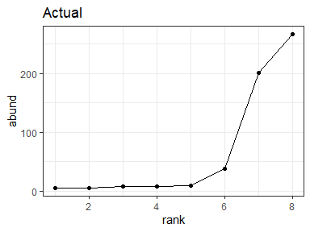
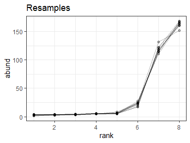

Jackknife
================
Renata Diaz
2021-02-22

Using community 1270 from MCDB because with S = 8, N = 542 it’s not
miniscule but it’s small enough that things will run easily locally.
Results might be on the small end.

``` r
make_ind_pool_species <- function(a_vect) {
  
  rep(a_vect[1], times = a_vect[2])
  
}

sample_ind_pool <- function(ind_pool, nind_to_sample) {
 species = sample(ind_pool, size = nind_to_sample, replace = FALSE)
 
 return(data.frame(species = species))
}

jacknife <- function(site_df, prop_of_ind = .6, nsims = 10) {
  
  nind <- sum(site_df$abund)
  
  nind_to_sample <- ceiling(prop_of_ind * nind)
  
  nspp <- nrow(site_df)
  
  ind_pool_mat <- as.matrix(dplyr::select(site_df, rank, abund))

  ind_pool <- unlist(apply(ind_pool_mat, MARGIN = 1, FUN = make_ind_pool_species))

  sampled_ind <- replicate(n = nsims, expr = sample_ind_pool(ind_pool, nind_to_sample), simplify = F)
  
  sampled_ind = unique(sampled_ind)
  
# 
#   sampled_ind <- rmultinom(n = nsims, size = nind_to_sample, prob = site_df$abund)
  
  sampled_ind_df <- dplyr::bind_rows(sampled_ind, .id = "sim") %>%
    dplyr::group_by(sim, species) %>%
    dplyr::summarize(abund = dplyr::n()) %>%
    dplyr::ungroup() %>%
    dplyr::filter(abund > 0) %>%
    dplyr::select(-species) %>%
    dplyr::group_by(sim) %>%
    dplyr::arrange(abund) %>%
    dplyr::mutate(rank = dplyr::row_number()) %>%
    dplyr::ungroup() %>%
    dplyr::arrange(sim, rank)

  site_df_identifiers <- site_df %>%
    select(dat, site, singletons, source) %>%
    distinct()
  
  sampled_ind_df <- sampled_ind_df %>%
    cbind(site_df_identifiers) %>%
    dplyr::mutate(site = paste0(site, "_jacknife_", sim)) %>%
    dplyr::mutate(sim = -99)
  
  return(sampled_ind_df)
  
  }

set.seed(1977)

a_site_jk <- jacknife(a_site)
```

    ## `summarise()` has grouped output by 'sim'. You can override using the `.groups` argument.

<!-- --><!-- -->

    ## `summarise()` has grouped output by 'sim'. You can override using the `.groups` argument.
    ## `summarise()` has grouped output by 'sim'. You can override using the `.groups` argument.
    ## `summarise()` has grouped output by 'sim'. You can override using the `.groups` argument.
    ## `summarise()` has grouped output by 'sim'. You can override using the `.groups` argument.
    ## `summarise()` has grouped output by 'sim'. You can override using the `.groups` argument.
    ## `summarise()` has grouped output by 'sim'. You can override using the `.groups` argument.
    ## `summarise()` has grouped output by 'sim'. You can override using the `.groups` argument.
    ## `summarise()` has grouped output by 'sim'. You can override using the `.groups` argument.
    ## `summarise()` has grouped output by 'sim'. You can override using the `.groups` argument.
    ## `summarise()` has grouped output by 'sim'. You can override using the `.groups` argument.
    ## `summarise()` has grouped output by 'sim'. You can override using the `.groups` argument.
    ## `summarise()` has grouped output by 'sim'. You can override using the `.groups` argument.
    ## `summarise()` has grouped output by 'sim'. You can override using the `.groups` argument.
    ## `summarise()` has grouped output by 'sim'. You can override using the `.groups` argument.
    ## `summarise()` has grouped output by 'sim'. You can override using the `.groups` argument.
    ## `summarise()` has grouped output by 'sim'. You can override using the `.groups` argument.
    ## `summarise()` has grouped output by 'sim'. You can override using the `.groups` argument.
    ## `summarise()` has grouped output by 'sim'. You can override using the `.groups` argument.
    ## `summarise()` has grouped output by 'sim'. You can override using the `.groups` argument.
    ## `summarise()` has grouped output by 'sim'. You can override using the `.groups` argument.
    ## `summarise()` has grouped output by 'sim'. You can override using the `.groups` argument.
    ## `summarise()` has grouped output by 'sim'. You can override using the `.groups` argument.
    ## `summarise()` has grouped output by 'sim'. You can override using the `.groups` argument.
    ## `summarise()` has grouped output by 'sim'. You can override using the `.groups` argument.
    ## `summarise()` has grouped output by 'sim'. You can override using the `.groups` argument.
    ## `summarise()` has grouped output by 'sim'. You can override using the `.groups` argument.
    ## `summarise()` has grouped output by 'sim'. You can override using the `.groups` argument.
    ## `summarise()` has grouped output by 'sim'. You can override using the `.groups` argument.
    ## `summarise()` has grouped output by 'sim'. You can override using the `.groups` argument.
    ## `summarise()` has grouped output by 'sim'. You can override using the `.groups` argument.
    ## `summarise()` has grouped output by 'sim'. You can override using the `.groups` argument.
    ## `summarise()` has grouped output by 'sim'. You can override using the `.groups` argument.
    ## `summarise()` has grouped output by 'sim'. You can override using the `.groups` argument.
    ## `summarise()` has grouped output by 'sim'. You can override using the `.groups` argument.
    ## `summarise()` has grouped output by 'sim'. You can override using the `.groups` argument.
    ## `summarise()` has grouped output by 'sim'. You can override using the `.groups` argument.
    ## `summarise()` has grouped output by 'sim'. You can override using the `.groups` argument.
    ## `summarise()` has grouped output by 'sim'. You can override using the `.groups` argument.
    ## `summarise()` has grouped output by 'sim'. You can override using the `.groups` argument.
    ## `summarise()` has grouped output by 'sim'. You can override using the `.groups` argument.
    ## `summarise()` has grouped output by 'sim'. You can override using the `.groups` argument.
    ## `summarise()` has grouped output by 'sim'. You can override using the `.groups` argument.
    ## `summarise()` has grouped output by 'sim'. You can override using the `.groups` argument.
    ## `summarise()` has grouped output by 'sim'. You can override using the `.groups` argument.
    ## `summarise()` has grouped output by 'sim'. You can override using the `.groups` argument.
    ## `summarise()` has grouped output by 'sim'. You can override using the `.groups` argument.
    ## `summarise()` has grouped output by 'sim'. You can override using the `.groups` argument.
    ## `summarise()` has grouped output by 'sim'. You can override using the `.groups` argument.
    ## `summarise()` has grouped output by 'sim'. You can override using the `.groups` argument.
    ## `summarise()` has grouped output by 'sim'. You can override using the `.groups` argument.
    ## `summarise()` has grouped output by 'sim'. You can override using the `.groups` argument.
    ## `summarise()` has grouped output by 'sim'. You can override using the `.groups` argument.
    ## `summarise()` has grouped output by 'sim'. You can override using the `.groups` argument.
    ## `summarise()` has grouped output by 'sim'. You can override using the `.groups` argument.
    ## `summarise()` has grouped output by 'sim'. You can override using the `.groups` argument.
    ## `summarise()` has grouped output by 'sim'. You can override using the `.groups` argument.
    ## `summarise()` has grouped output by 'sim'. You can override using the `.groups` argument.
    ## `summarise()` has grouped output by 'sim'. You can override using the `.groups` argument.
    ## `summarise()` has grouped output by 'sim'. You can override using the `.groups` argument.
    ## `summarise()` has grouped output by 'sim'. You can override using the `.groups` argument.
    ## `summarise()` has grouped output by 'sim'. You can override using the `.groups` argument.
    ## `summarise()` has grouped output by 'sim'. You can override using the `.groups` argument.
    ## `summarise()` has grouped output by 'sim'. You can override using the `.groups` argument.
    ## `summarise()` has grouped output by 'sim'. You can override using the `.groups` argument.
    ## `summarise()` has grouped output by 'sim'. You can override using the `.groups` argument.
    ## `summarise()` has grouped output by 'sim'. You can override using the `.groups` argument.
    ## `summarise()` has grouped output by 'sim'. You can override using the `.groups` argument.
    ## `summarise()` has grouped output by 'sim'. You can override using the `.groups` argument.
    ## `summarise()` has grouped output by 'sim'. You can override using the `.groups` argument.
    ## `summarise()` has grouped output by 'sim'. You can override using the `.groups` argument.
    ## `summarise()` has grouped output by 'sim'. You can override using the `.groups` argument.
    ## `summarise()` has grouped output by 'sim'. You can override using the `.groups` argument.
    ## `summarise()` has grouped output by 'sim'. You can override using the `.groups` argument.
    ## `summarise()` has grouped output by 'sim'. You can override using the `.groups` argument.
    ## `summarise()` has grouped output by 'sim'. You can override using the `.groups` argument.
    ## `summarise()` has grouped output by 'sim'. You can override using the `.groups` argument.
    ## `summarise()` has grouped output by 'sim'. You can override using the `.groups` argument.
    ## `summarise()` has grouped output by 'sim'. You can override using the `.groups` argument.
    ## `summarise()` has grouped output by 'sim'. You can override using the `.groups` argument.
    ## `summarise()` has grouped output by 'sim'. You can override using the `.groups` argument.
    ## `summarise()` has grouped output by 'sim'. You can override using the `.groups` argument.
    ## `summarise()` has grouped output by 'sim'. You can override using the `.groups` argument.
    ## `summarise()` has grouped output by 'sim'. You can override using the `.groups` argument.
    ## `summarise()` has grouped output by 'sim'. You can override using the `.groups` argument.
    ## `summarise()` has grouped output by 'sim'. You can override using the `.groups` argument.
    ## `summarise()` has grouped output by 'sim'. You can override using the `.groups` argument.
    ## `summarise()` has grouped output by 'sim'. You can override using the `.groups` argument.
    ## `summarise()` has grouped output by 'sim'. You can override using the `.groups` argument.
    ## `summarise()` has grouped output by 'sim'. You can override using the `.groups` argument.
    ## `summarise()` has grouped output by 'sim'. You can override using the `.groups` argument.
    ## `summarise()` has grouped output by 'sim'. You can override using the `.groups` argument.
    ## `summarise()` has grouped output by 'sim'. You can override using the `.groups` argument.
    ## `summarise()` has grouped output by 'sim'. You can override using the `.groups` argument.
    ## `summarise()` has grouped output by 'sim'. You can override using the `.groups` argument.
    ## `summarise()` has grouped output by 'sim'. You can override using the `.groups` argument.
    ## `summarise()` has grouped output by 'sim'. You can override using the `.groups` argument.
    ## `summarise()` has grouped output by 'sim'. You can override using the `.groups` argument.
    ## `summarise()` has grouped output by 'sim'. You can override using the `.groups` argument.
    ## `summarise()` has grouped output by 'sim'. You can override using the `.groups` argument.
    ## `summarise()` has grouped output by 'sim'. You can override using the `.groups` argument.
    ## `summarise()` has grouped output by 'sim'. You can override using the `.groups` argument.
    ## `summarise()` has grouped output by 'sim'. You can override using the `.groups` argument.
    ## `summarise()` has grouped output by 'sim'. You can override using the `.groups` argument.
    ## `summarise()` has grouped output by 'sim'. You can override using the `.groups` argument.
    ## `summarise()` has grouped output by 'sim'. You can override using the `.groups` argument.
    ## `summarise()` has grouped output by 'sim'. You can override using the `.groups` argument.
    ## `summarise()` has grouped output by 'sim'. You can override using the `.groups` argument.
    ## `summarise()` has grouped output by 'sim'. You can override using the `.groups` argument.
    ## `summarise()` has grouped output by 'sim'. You can override using the `.groups` argument.
    ## `summarise()` has grouped output by 'sim'. You can override using the `.groups` argument.
    ## `summarise()` has grouped output by 'sim'. You can override using the `.groups` argument.
    ## `summarise()` has grouped output by 'sim'. You can override using the `.groups` argument.
    ## `summarise()` has grouped output by 'sim'. You can override using the `.groups` argument.
    ## `summarise()` has grouped output by 'sim'. You can override using the `.groups` argument.
    ## `summarise()` has grouped output by 'sim'. You can override using the `.groups` argument.
    ## `summarise()` has grouped output by 'sim'. You can override using the `.groups` argument.
    ## `summarise()` has grouped output by 'sim'. You can override using the `.groups` argument.
    ## `summarise()` has grouped output by 'sim'. You can override using the `.groups` argument.
    ## `summarise()` has grouped output by 'sim'. You can override using the `.groups` argument.
    ## `summarise()` has grouped output by 'sim'. You can override using the `.groups` argument.
    ## `summarise()` has grouped output by 'sim'. You can override using the `.groups` argument.
    ## `summarise()` has grouped output by 'sim'. You can override using the `.groups` argument.
    ## `summarise()` has grouped output by 'sim'. You can override using the `.groups` argument.
    ## `summarise()` has grouped output by 'sim'. You can override using the `.groups` argument.
    ## `summarise()` has grouped output by 'sim'. You can override using the `.groups` argument.
    ## `summarise()` has grouped output by 'sim'. You can override using the `.groups` argument.
    ## `summarise()` has grouped output by 'sim'. You can override using the `.groups` argument.
    ## `summarise()` has grouped output by 'sim'. You can override using the `.groups` argument.
    ## `summarise()` has grouped output by 'sim'. You can override using the `.groups` argument.
    ## `summarise()` has grouped output by 'sim'. You can override using the `.groups` argument.
    ## `summarise()` has grouped output by 'sim'. You can override using the `.groups` argument.
    ## `summarise()` has grouped output by 'sim'. You can override using the `.groups` argument.
    ## `summarise()` has grouped output by 'sim'. You can override using the `.groups` argument.
    ## `summarise()` has grouped output by 'sim'. You can override using the `.groups` argument.
    ## `summarise()` has grouped output by 'sim'. You can override using the `.groups` argument.
    ## `summarise()` has grouped output by 'sim'. You can override using the `.groups` argument.
    ## `summarise()` has grouped output by 'sim'. You can override using the `.groups` argument.
    ## `summarise()` has grouped output by 'sim'. You can override using the `.groups` argument.
    ## `summarise()` has grouped output by 'sim'. You can override using the `.groups` argument.
    ## `summarise()` has grouped output by 'sim'. You can override using the `.groups` argument.
    ## `summarise()` has grouped output by 'sim'. You can override using the `.groups` argument.
    ## `summarise()` has grouped output by 'sim'. You can override using the `.groups` argument.
    ## `summarise()` has grouped output by 'sim'. You can override using the `.groups` argument.
    ## `summarise()` has grouped output by 'sim'. You can override using the `.groups` argument.
    ## `summarise()` has grouped output by 'sim'. You can override using the `.groups` argument.
    ## `summarise()` has grouped output by 'sim'. You can override using the `.groups` argument.
    ## `summarise()` has grouped output by 'sim'. You can override using the `.groups` argument.
    ## `summarise()` has grouped output by 'sim'. You can override using the `.groups` argument.
    ## `summarise()` has grouped output by 'sim'. You can override using the `.groups` argument.
    ## `summarise()` has grouped output by 'sim'. You can override using the `.groups` argument.
    ## `summarise()` has grouped output by 'sim'. You can override using the `.groups` argument.
    ## `summarise()` has grouped output by 'sim'. You can override using the `.groups` argument.
    ## `summarise()` has grouped output by 'sim'. You can override using the `.groups` argument.
    ## `summarise()` has grouped output by 'sim'. You can override using the `.groups` argument.
    ## `summarise()` has grouped output by 'sim'. You can override using the `.groups` argument.
    ## `summarise()` has grouped output by 'sim'. You can override using the `.groups` argument.
    ## `summarise()` has grouped output by 'sim'. You can override using the `.groups` argument.
    ## `summarise()` has grouped output by 'sim'. You can override using the `.groups` argument.
    ## `summarise()` has grouped output by 'sim'. You can override using the `.groups` argument.
    ## `summarise()` has grouped output by 'sim'. You can override using the `.groups` argument.
    ## `summarise()` has grouped output by 'sim'. You can override using the `.groups` argument.
    ## `summarise()` has grouped output by 'sim'. You can override using the `.groups` argument.
    ## `summarise()` has grouped output by 'sim'. You can override using the `.groups` argument.
    ## `summarise()` has grouped output by 'sim'. You can override using the `.groups` argument.
    ## `summarise()` has grouped output by 'sim'. You can override using the `.groups` argument.
    ## `summarise()` has grouped output by 'sim'. You can override using the `.groups` argument.
    ## `summarise()` has grouped output by 'sim'. You can override using the `.groups` argument.
    ## `summarise()` has grouped output by 'sim'. You can override using the `.groups` argument.
    ## `summarise()` has grouped output by 'sim'. You can override using the `.groups` argument.
    ## `summarise()` has grouped output by 'sim'. You can override using the `.groups` argument.
    ## `summarise()` has grouped output by 'sim'. You can override using the `.groups` argument.
    ## `summarise()` has grouped output by 'sim'. You can override using the `.groups` argument.
    ## `summarise()` has grouped output by 'sim'. You can override using the `.groups` argument.
    ## `summarise()` has grouped output by 'sim'. You can override using the `.groups` argument.
    ## `summarise()` has grouped output by 'sim'. You can override using the `.groups` argument.
    ## `summarise()` has grouped output by 'sim'. You can override using the `.groups` argument.
    ## `summarise()` has grouped output by 'sim'. You can override using the `.groups` argument.
    ## `summarise()` has grouped output by 'sim'. You can override using the `.groups` argument.
    ## `summarise()` has grouped output by 'sim'. You can override using the `.groups` argument.
    ## `summarise()` has grouped output by 'sim'. You can override using the `.groups` argument.
    ## `summarise()` has grouped output by 'sim'. You can override using the `.groups` argument.
    ## `summarise()` has grouped output by 'sim'. You can override using the `.groups` argument.
    ## `summarise()` has grouped output by 'sim'. You can override using the `.groups` argument.
    ## `summarise()` has grouped output by 'sim'. You can override using the `.groups` argument.
    ## `summarise()` has grouped output by 'sim'. You can override using the `.groups` argument.
    ## `summarise()` has grouped output by 'sim'. You can override using the `.groups` argument.
    ## `summarise()` has grouped output by 'sim'. You can override using the `.groups` argument.
    ## `summarise()` has grouped output by 'sim'. You can override using the `.groups` argument.
    ## `summarise()` has grouped output by 'sim'. You can override using the `.groups` argument.
    ## `summarise()` has grouped output by 'sim'. You can override using the `.groups` argument.
    ## `summarise()` has grouped output by 'sim'. You can override using the `.groups` argument.
    ## `summarise()` has grouped output by 'sim'. You can override using the `.groups` argument.
    ## `summarise()` has grouped output by 'sim'. You can override using the `.groups` argument.
    ## `summarise()` has grouped output by 'sim'. You can override using the `.groups` argument.
    ## `summarise()` has grouped output by 'sim'. You can override using the `.groups` argument.
    ## `summarise()` has grouped output by 'sim'. You can override using the `.groups` argument.
    ## `summarise()` has grouped output by 'sim'. You can override using the `.groups` argument.
    ## `summarise()` has grouped output by 'sim'. You can override using the `.groups` argument.
    ## `summarise()` has grouped output by 'sim'. You can override using the `.groups` argument.
    ## `summarise()` has grouped output by 'sim'. You can override using the `.groups` argument.
    ## `summarise()` has grouped output by 'sim'. You can override using the `.groups` argument.
    ## `summarise()` has grouped output by 'sim'. You can override using the `.groups` argument.
    ## `summarise()` has grouped output by 'sim'. You can override using the `.groups` argument.
    ## `summarise()` has grouped output by 'sim'. You can override using the `.groups` argument.
    ## `summarise()` has grouped output by 'sim'. You can override using the `.groups` argument.
    ## `summarise()` has grouped output by 'sim'. You can override using the `.groups` argument.
    ## `summarise()` has grouped output by 'sim'. You can override using the `.groups` argument.
    ## `summarise()` has grouped output by 'sim'. You can override using the `.groups` argument.
    ## `summarise()` has grouped output by 'sim'. You can override using the `.groups` argument.
    ## `summarise()` has grouped output by 'sim'. You can override using the `.groups` argument.
    ## `summarise()` has grouped output by 'sim'. You can override using the `.groups` argument.
    ## `summarise()` has grouped output by 'sim'. You can override using the `.groups` argument.
    ## `summarise()` has grouped output by 'sim'. You can override using the `.groups` argument.
    ## `summarise()` has grouped output by 'sim'. You can override using the `.groups` argument.
    ## `summarise()` has grouped output by 'sim'. You can override using the `.groups` argument.
    ## `summarise()` has grouped output by 'sim'. You can override using the `.groups` argument.
    ## `summarise()` has grouped output by 'sim'. You can override using the `.groups` argument.
    ## `summarise()` has grouped output by 'sim'. You can override using the `.groups` argument.
    ## `summarise()` has grouped output by 'sim'. You can override using the `.groups` argument.
    ## `summarise()` has grouped output by 'sim'. You can override using the `.groups` argument.
    ## `summarise()` has grouped output by 'sim'. You can override using the `.groups` argument.
    ## `summarise()` has grouped output by 'sim'. You can override using the `.groups` argument.
    ## `summarise()` has grouped output by 'sim'. You can override using the `.groups` argument.
    ## `summarise()` has grouped output by 'sim'. You can override using the `.groups` argument.
    ## `summarise()` has grouped output by 'sim'. You can override using the `.groups` argument.
    ## `summarise()` has grouped output by 'sim'. You can override using the `.groups` argument.
    ## `summarise()` has grouped output by 'sim'. You can override using the `.groups` argument.
    ## `summarise()` has grouped output by 'sim'. You can override using the `.groups` argument.
    ## `summarise()` has grouped output by 'sim'. You can override using the `.groups` argument.
    ## `summarise()` has grouped output by 'sim'. You can override using the `.groups` argument.
    ## `summarise()` has grouped output by 'sim'. You can override using the `.groups` argument.
    ## `summarise()` has grouped output by 'sim'. You can override using the `.groups` argument.
    ## `summarise()` has grouped output by 'sim'. You can override using the `.groups` argument.
    ## `summarise()` has grouped output by 'sim'. You can override using the `.groups` argument.
    ## `summarise()` has grouped output by 'sim'. You can override using the `.groups` argument.
    ## `summarise()` has grouped output by 'sim'. You can override using the `.groups` argument.
    ## `summarise()` has grouped output by 'sim'. You can override using the `.groups` argument.
    ## `summarise()` has grouped output by 'sim'. You can override using the `.groups` argument.
    ## `summarise()` has grouped output by 'sim'. You can override using the `.groups` argument.
    ## `summarise()` has grouped output by 'sim'. You can override using the `.groups` argument.
    ## `summarise()` has grouped output by 'sim'. You can override using the `.groups` argument.
    ## `summarise()` has grouped output by 'sim'. You can override using the `.groups` argument.
    ## `summarise()` has grouped output by 'sim'. You can override using the `.groups` argument.
    ## `summarise()` has grouped output by 'sim'. You can override using the `.groups` argument.
    ## `summarise()` has grouped output by 'sim'. You can override using the `.groups` argument.
    ## `summarise()` has grouped output by 'sim'. You can override using the `.groups` argument.
    ## `summarise()` has grouped output by 'sim'. You can override using the `.groups` argument.
    ## `summarise()` has grouped output by 'sim'. You can override using the `.groups` argument.
    ## `summarise()` has grouped output by 'sim'. You can override using the `.groups` argument.
    ## `summarise()` has grouped output by 'sim'. You can override using the `.groups` argument.
    ## `summarise()` has grouped output by 'sim'. You can override using the `.groups` argument.
    ## `summarise()` has grouped output by 'sim'. You can override using the `.groups` argument.
    ## `summarise()` has grouped output by 'sim'. You can override using the `.groups` argument.
    ## `summarise()` has grouped output by 'sim'. You can override using the `.groups` argument.
    ## `summarise()` has grouped output by 'sim'. You can override using the `.groups` argument.
    ## `summarise()` has grouped output by 'sim'. You can override using the `.groups` argument.
    ## `summarise()` has grouped output by 'sim'. You can override using the `.groups` argument.
    ## `summarise()` has grouped output by 'sim'. You can override using the `.groups` argument.
    ## `summarise()` has grouped output by 'sim'. You can override using the `.groups` argument.
    ## `summarise()` has grouped output by 'sim'. You can override using the `.groups` argument.
    ## `summarise()` has grouped output by 'sim'. You can override using the `.groups` argument.
    ## `summarise()` has grouped output by 'sim'. You can override using the `.groups` argument.
    ## `summarise()` has grouped output by 'sim'. You can override using the `.groups` argument.
    ## `summarise()` has grouped output by 'sim'. You can override using the `.groups` argument.
    ## `summarise()` has grouped output by 'sim'. You can override using the `.groups` argument.
    ## `summarise()` has grouped output by 'sim'. You can override using the `.groups` argument.
    ## `summarise()` has grouped output by 'sim'. You can override using the `.groups` argument.
    ## `summarise()` has grouped output by 'sim'. You can override using the `.groups` argument.
    ## `summarise()` has grouped output by 'sim'. You can override using the `.groups` argument.
    ## `summarise()` has grouped output by 'sim'. You can override using the `.groups` argument.
    ## `summarise()` has grouped output by 'sim'. You can override using the `.groups` argument.
    ## `summarise()` has grouped output by 'sim'. You can override using the `.groups` argument.
    ## `summarise()` has grouped output by 'sim'. You can override using the `.groups` argument.
    ## `summarise()` has grouped output by 'sim'. You can override using the `.groups` argument.
    ## `summarise()` has grouped output by 'sim'. You can override using the `.groups` argument.
    ## `summarise()` has grouped output by 'sim'. You can override using the `.groups` argument.
    ## `summarise()` has grouped output by 'sim'. You can override using the `.groups` argument.
    ## `summarise()` has grouped output by 'sim'. You can override using the `.groups` argument.
    ## `summarise()` has grouped output by 'sim'. You can override using the `.groups` argument.
    ## `summarise()` has grouped output by 'sim'. You can override using the `.groups` argument.
    ## `summarise()` has grouped output by 'sim'. You can override using the `.groups` argument.
    ## `summarise()` has grouped output by 'sim'. You can override using the `.groups` argument.
    ## `summarise()` has grouped output by 'sim'. You can override using the `.groups` argument.
    ## `summarise()` has grouped output by 'sim'. You can override using the `.groups` argument.
    ## `summarise()` has grouped output by 'sim'. You can override using the `.groups` argument.
    ## `summarise()` has grouped output by 'sim'. You can override using the `.groups` argument.
    ## `summarise()` has grouped output by 'sim'. You can override using the `.groups` argument.
    ## `summarise()` has grouped output by 'sim'. You can override using the `.groups` argument.
    ## `summarise()` has grouped output by 'sim'. You can override using the `.groups` argument.
    ## `summarise()` has grouped output by 'sim'. You can override using the `.groups` argument.
    ## `summarise()` has grouped output by 'sim'. You can override using the `.groups` argument.
    ## `summarise()` has grouped output by 'sim'. You can override using the `.groups` argument.
    ## `summarise()` has grouped output by 'sim'. You can override using the `.groups` argument.
    ## `summarise()` has grouped output by 'sim'. You can override using the `.groups` argument.
    ## `summarise()` has grouped output by 'sim'. You can override using the `.groups` argument.
    ## `summarise()` has grouped output by 'sim'. You can override using the `.groups` argument.
    ## `summarise()` has grouped output by 'sim'. You can override using the `.groups` argument.
    ## `summarise()` has grouped output by 'sim'. You can override using the `.groups` argument.
    ## `summarise()` has grouped output by 'sim'. You can override using the `.groups` argument.
    ## `summarise()` has grouped output by 'sim'. You can override using the `.groups` argument.
    ## `summarise()` has grouped output by 'sim'. You can override using the `.groups` argument.
    ## `summarise()` has grouped output by 'sim'. You can override using the `.groups` argument.
    ## `summarise()` has grouped output by 'sim'. You can override using the `.groups` argument.
    ## `summarise()` has grouped output by 'sim'. You can override using the `.groups` argument.
    ## `summarise()` has grouped output by 'sim'. You can override using the `.groups` argument.
    ## `summarise()` has grouped output by 'sim'. You can override using the `.groups` argument.
    ## `summarise()` has grouped output by 'sim'. You can override using the `.groups` argument.
    ## `summarise()` has grouped output by 'sim'. You can override using the `.groups` argument.
    ## `summarise()` has grouped output by 'sim'. You can override using the `.groups` argument.
    ## `summarise()` has grouped output by 'sim'. You can override using the `.groups` argument.
    ## `summarise()` has grouped output by 'sim'. You can override using the `.groups` argument.
    ## `summarise()` has grouped output by 'sim'. You can override using the `.groups` argument.
    ## `summarise()` has grouped output by 'sim'. You can override using the `.groups` argument.
    ## `summarise()` has grouped output by 'sim'. You can override using the `.groups` argument.
    ## `summarise()` has grouped output by 'sim'. You can override using the `.groups` argument.
    ## `summarise()` has grouped output by 'sim'. You can override using the `.groups` argument.
    ## `summarise()` has grouped output by 'sim'. You can override using the `.groups` argument.
    ## `summarise()` has grouped output by 'sim'. You can override using the `.groups` argument.
    ## `summarise()` has grouped output by 'sim'. You can override using the `.groups` argument.
    ## `summarise()` has grouped output by 'sim'. You can override using the `.groups` argument.
    ## `summarise()` has grouped output by 'sim'. You can override using the `.groups` argument.
    ## `summarise()` has grouped output by 'sim'. You can override using the `.groups` argument.
    ## `summarise()` has grouped output by 'sim'. You can override using the `.groups` argument.
    ## `summarise()` has grouped output by 'sim'. You can override using the `.groups` argument.
    ## `summarise()` has grouped output by 'sim'. You can override using the `.groups` argument.
    ## `summarise()` has grouped output by 'sim'. You can override using the `.groups` argument.
    ## `summarise()` has grouped output by 'sim'. You can override using the `.groups` argument.
    ## `summarise()` has grouped output by 'sim'. You can override using the `.groups` argument.
    ## `summarise()` has grouped output by 'sim'. You can override using the `.groups` argument.
    ## `summarise()` has grouped output by 'sim'. You can override using the `.groups` argument.
    ## `summarise()` has grouped output by 'sim'. You can override using the `.groups` argument.
    ## `summarise()` has grouped output by 'sim'. You can override using the `.groups` argument.
    ## `summarise()` has grouped output by 'sim'. You can override using the `.groups` argument.
    ## `summarise()` has grouped output by 'sim'. You can override using the `.groups` argument.
    ## `summarise()` has grouped output by 'sim'. You can override using the `.groups` argument.
    ## `summarise()` has grouped output by 'sim'. You can override using the `.groups` argument.
    ## `summarise()` has grouped output by 'sim'. You can override using the `.groups` argument.
    ## `summarise()` has grouped output by 'sim'. You can override using the `.groups` argument.
    ## `summarise()` has grouped output by 'sim'. You can override using the `.groups` argument.
    ## `summarise()` has grouped output by 'sim'. You can override using the `.groups` argument.
    ## `summarise()` has grouped output by 'sim'. You can override using the `.groups` argument.
    ## `summarise()` has grouped output by 'sim'. You can override using the `.groups` argument.
    ## `summarise()` has grouped output by 'sim'. You can override using the `.groups` argument.
    ## `summarise()` has grouped output by 'sim'. You can override using the `.groups` argument.
    ## `summarise()` has grouped output by 'sim'. You can override using the `.groups` argument.
    ## `summarise()` has grouped output by 'sim'. You can override using the `.groups` argument.
    ## `summarise()` has grouped output by 'sim'. You can override using the `.groups` argument.
    ## `summarise()` has grouped output by 'sim'. You can override using the `.groups` argument.
    ## `summarise()` has grouped output by 'sim'. You can override using the `.groups` argument.
    ## `summarise()` has grouped output by 'sim'. You can override using the `.groups` argument.
    ## `summarise()` has grouped output by 'sim'. You can override using the `.groups` argument.
    ## `summarise()` has grouped output by 'sim'. You can override using the `.groups` argument.
    ## `summarise()` has grouped output by 'sim'. You can override using the `.groups` argument.
    ## `summarise()` has grouped output by 'sim'. You can override using the `.groups` argument.
    ## `summarise()` has grouped output by 'sim'. You can override using the `.groups` argument.
    ## `summarise()` has grouped output by 'sim'. You can override using the `.groups` argument.
    ## `summarise()` has grouped output by 'sim'. You can override using the `.groups` argument.
    ## `summarise()` has grouped output by 'sim'. You can override using the `.groups` argument.
    ## `summarise()` has grouped output by 'sim'. You can override using the `.groups` argument.
    ## `summarise()` has grouped output by 'sim'. You can override using the `.groups` argument.
    ## `summarise()` has grouped output by 'sim'. You can override using the `.groups` argument.
    ## `summarise()` has grouped output by 'sim'. You can override using the `.groups` argument.
    ## `summarise()` has grouped output by 'sim'. You can override using the `.groups` argument.
    ## `summarise()` has grouped output by 'sim'. You can override using the `.groups` argument.
    ## `summarise()` has grouped output by 'sim'. You can override using the `.groups` argument.
    ## `summarise()` has grouped output by 'sim'. You can override using the `.groups` argument.
    ## `summarise()` has grouped output by 'sim'. You can override using the `.groups` argument.
    ## `summarise()` has grouped output by 'sim'. You can override using the `.groups` argument.
    ## `summarise()` has grouped output by 'sim'. You can override using the `.groups` argument.
    ## `summarise()` has grouped output by 'sim'. You can override using the `.groups` argument.
    ## `summarise()` has grouped output by 'sim'. You can override using the `.groups` argument.
    ## `summarise()` has grouped output by 'sim'. You can override using the `.groups` argument.
    ## `summarise()` has grouped output by 'sim'. You can override using the `.groups` argument.
    ## `summarise()` has grouped output by 'sim'. You can override using the `.groups` argument.
    ## `summarise()` has grouped output by 'sim'. You can override using the `.groups` argument.
    ## `summarise()` has grouped output by 'sim'. You can override using the `.groups` argument.
    ## `summarise()` has grouped output by 'sim'. You can override using the `.groups` argument.
    ## `summarise()` has grouped output by 'sim'. You can override using the `.groups` argument.
    ## `summarise()` has grouped output by 'sim'. You can override using the `.groups` argument.
    ## `summarise()` has grouped output by 'sim'. You can override using the `.groups` argument.
    ## `summarise()` has grouped output by 'sim'. You can override using the `.groups` argument.
    ## `summarise()` has grouped output by 'sim'. You can override using the `.groups` argument.
    ## `summarise()` has grouped output by 'sim'. You can override using the `.groups` argument.
    ## `summarise()` has grouped output by 'sim'. You can override using the `.groups` argument.
    ## `summarise()` has grouped output by 'sim'. You can override using the `.groups` argument.
    ## `summarise()` has grouped output by 'sim'. You can override using the `.groups` argument.
    ## `summarise()` has grouped output by 'sim'. You can override using the `.groups` argument.
    ## `summarise()` has grouped output by 'sim'. You can override using the `.groups` argument.
    ## `summarise()` has grouped output by 'sim'. You can override using the `.groups` argument.
    ## `summarise()` has grouped output by 'sim'. You can override using the `.groups` argument.
    ## `summarise()` has grouped output by 'sim'. You can override using the `.groups` argument.
    ## `summarise()` has grouped output by 'sim'. You can override using the `.groups` argument.
    ## `summarise()` has grouped output by 'sim'. You can override using the `.groups` argument.
    ## `summarise()` has grouped output by 'sim'. You can override using the `.groups` argument.
    ## `summarise()` has grouped output by 'sim'. You can override using the `.groups` argument.
    ## `summarise()` has grouped output by 'sim'. You can override using the `.groups` argument.
    ## `summarise()` has grouped output by 'sim'. You can override using the `.groups` argument.
    ## `summarise()` has grouped output by 'sim'. You can override using the `.groups` argument.
    ## `summarise()` has grouped output by 'sim'. You can override using the `.groups` argument.
    ## `summarise()` has grouped output by 'sim'. You can override using the `.groups` argument.
    ## `summarise()` has grouped output by 'sim'. You can override using the `.groups` argument.
    ## `summarise()` has grouped output by 'sim'. You can override using the `.groups` argument.
    ## `summarise()` has grouped output by 'sim'. You can override using the `.groups` argument.
    ## `summarise()` has grouped output by 'sim'. You can override using the `.groups` argument.
    ## `summarise()` has grouped output by 'sim'. You can override using the `.groups` argument.
    ## `summarise()` has grouped output by 'sim'. You can override using the `.groups` argument.
    ## `summarise()` has grouped output by 'sim'. You can override using the `.groups` argument.
    ## `summarise()` has grouped output by 'sim'. You can override using the `.groups` argument.
    ## `summarise()` has grouped output by 'sim'. You can override using the `.groups` argument.
    ## `summarise()` has grouped output by 'sim'. You can override using the `.groups` argument.
    ## `summarise()` has grouped output by 'sim'. You can override using the `.groups` argument.
    ## `summarise()` has grouped output by 'sim'. You can override using the `.groups` argument.
    ## `summarise()` has grouped output by 'sim'. You can override using the `.groups` argument.
    ## `summarise()` has grouped output by 'sim'. You can override using the `.groups` argument.
    ## `summarise()` has grouped output by 'sim'. You can override using the `.groups` argument.
    ## `summarise()` has grouped output by 'sim'. You can override using the `.groups` argument.
    ## `summarise()` has grouped output by 'sim'. You can override using the `.groups` argument.
    ## `summarise()` has grouped output by 'sim'. You can override using the `.groups` argument.
    ## `summarise()` has grouped output by 'sim'. You can override using the `.groups` argument.
    ## `summarise()` has grouped output by 'sim'. You can override using the `.groups` argument.
    ## `summarise()` has grouped output by 'sim'. You can override using the `.groups` argument.
    ## `summarise()` has grouped output by 'sim'. You can override using the `.groups` argument.
    ## `summarise()` has grouped output by 'sim'. You can override using the `.groups` argument.
    ## `summarise()` has grouped output by 'sim'. You can override using the `.groups` argument.
    ## `summarise()` has grouped output by 'sim'. You can override using the `.groups` argument.
    ## `summarise()` has grouped output by 'sim'. You can override using the `.groups` argument.
    ## `summarise()` has grouped output by 'sim'. You can override using the `.groups` argument.
    ## `summarise()` has grouped output by 'sim'. You can override using the `.groups` argument.
    ## `summarise()` has grouped output by 'sim'. You can override using the `.groups` argument.
    ## `summarise()` has grouped output by 'sim'. You can override using the `.groups` argument.
    ## `summarise()` has grouped output by 'sim'. You can override using the `.groups` argument.
    ## `summarise()` has grouped output by 'sim'. You can override using the `.groups` argument.
    ## `summarise()` has grouped output by 'sim'. You can override using the `.groups` argument.
    ## `summarise()` has grouped output by 'sim'. You can override using the `.groups` argument.
    ## `summarise()` has grouped output by 'sim'. You can override using the `.groups` argument.
    ## `summarise()` has grouped output by 'sim'. You can override using the `.groups` argument.
    ## `summarise()` has grouped output by 'sim'. You can override using the `.groups` argument.
    ## `summarise()` has grouped output by 'sim'. You can override using the `.groups` argument.
    ## `summarise()` has grouped output by 'sim'. You can override using the `.groups` argument.
    ## `summarise()` has grouped output by 'sim'. You can override using the `.groups` argument.
    ## `summarise()` has grouped output by 'sim'. You can override using the `.groups` argument.
    ## `summarise()` has grouped output by 'sim'. You can override using the `.groups` argument.
    ## `summarise()` has grouped output by 'sim'. You can override using the `.groups` argument.
    ## `summarise()` has grouped output by 'sim'. You can override using the `.groups` argument.
    ## `summarise()` has grouped output by 'sim'. You can override using the `.groups` argument.
    ## `summarise()` has grouped output by 'sim'. You can override using the `.groups` argument.
    ## `summarise()` has grouped output by 'sim'. You can override using the `.groups` argument.
    ## `summarise()` has grouped output by 'sim'. You can override using the `.groups` argument.
    ## `summarise()` has grouped output by 'sim'. You can override using the `.groups` argument.
    ## `summarise()` has grouped output by 'sim'. You can override using the `.groups` argument.
    ## `summarise()` has grouped output by 'sim'. You can override using the `.groups` argument.
    ## `summarise()` has grouped output by 'sim'. You can override using the `.groups` argument.
    ## `summarise()` has grouped output by 'sim'. You can override using the `.groups` argument.
    ## `summarise()` has grouped output by 'sim'. You can override using the `.groups` argument.
    ## `summarise()` has grouped output by 'sim'. You can override using the `.groups` argument.
    ## `summarise()` has grouped output by 'sim'. You can override using the `.groups` argument.
    ## `summarise()` has grouped output by 'sim'. You can override using the `.groups` argument.
    ## `summarise()` has grouped output by 'sim'. You can override using the `.groups` argument.
    ## `summarise()` has grouped output by 'sim'. You can override using the `.groups` argument.
    ## `summarise()` has grouped output by 'sim'. You can override using the `.groups` argument.
    ## `summarise()` has grouped output by 'sim'. You can override using the `.groups` argument.
    ## `summarise()` has grouped output by 'sim'. You can override using the `.groups` argument.
    ## `summarise()` has grouped output by 'sim'. You can override using the `.groups` argument.
    ## `summarise()` has grouped output by 'sim'. You can override using the `.groups` argument.
    ## `summarise()` has grouped output by 'sim'. You can override using the `.groups` argument.
    ## `summarise()` has grouped output by 'sim'. You can override using the `.groups` argument.
    ## `summarise()` has grouped output by 'sim'. You can override using the `.groups` argument.
    ## `summarise()` has grouped output by 'sim'. You can override using the `.groups` argument.
    ## `summarise()` has grouped output by 'sim'. You can override using the `.groups` argument.
    ## `summarise()` has grouped output by 'sim'. You can override using the `.groups` argument.
    ## `summarise()` has grouped output by 'sim'. You can override using the `.groups` argument.
    ## `summarise()` has grouped output by 'sim'. You can override using the `.groups` argument.
    ## `summarise()` has grouped output by 'sim'. You can override using the `.groups` argument.
    ## `summarise()` has grouped output by 'sim'. You can override using the `.groups` argument.
    ## `summarise()` has grouped output by 'sim'. You can override using the `.groups` argument.
    ## `summarise()` has grouped output by 'sim'. You can override using the `.groups` argument.
    ## `summarise()` has grouped output by 'sim'. You can override using the `.groups` argument.
    ## `summarise()` has grouped output by 'sim'. You can override using the `.groups` argument.
    ## `summarise()` has grouped output by 'sim'. You can override using the `.groups` argument.
    ## `summarise()` has grouped output by 'sim'. You can override using the `.groups` argument.
    ## `summarise()` has grouped output by 'sim'. You can override using the `.groups` argument.
    ## `summarise()` has grouped output by 'sim'. You can override using the `.groups` argument.
    ## `summarise()` has grouped output by 'sim'. You can override using the `.groups` argument.
    ## `summarise()` has grouped output by 'sim'. You can override using the `.groups` argument.
    ## `summarise()` has grouped output by 'sim'. You can override using the `.groups` argument.
    ## `summarise()` has grouped output by 'sim'. You can override using the `.groups` argument.
    ## `summarise()` has grouped output by 'sim'. You can override using the `.groups` argument.
    ## `summarise()` has grouped output by 'sim'. You can override using the `.groups` argument.
    ## `summarise()` has grouped output by 'sim'. You can override using the `.groups` argument.
    ## `summarise()` has grouped output by 'sim'. You can override using the `.groups` argument.
    ## `summarise()` has grouped output by 'sim'. You can override using the `.groups` argument.
    ## `summarise()` has grouped output by 'sim'. You can override using the `.groups` argument.
    ## `summarise()` has grouped output by 'sim'. You can override using the `.groups` argument.
    ## `summarise()` has grouped output by 'sim'. You can override using the `.groups` argument.
    ## `summarise()` has grouped output by 'sim'. You can override using the `.groups` argument.
    ## `summarise()` has grouped output by 'sim'. You can override using the `.groups` argument.
    ## `summarise()` has grouped output by 'sim'. You can override using the `.groups` argument.
    ## `summarise()` has grouped output by 'sim'. You can override using the `.groups` argument.
    ## `summarise()` has grouped output by 'sim'. You can override using the `.groups` argument.
    ## `summarise()` has grouped output by 'sim'. You can override using the `.groups` argument.
    ## `summarise()` has grouped output by 'sim'. You can override using the `.groups` argument.
    ## `summarise()` has grouped output by 'sim'. You can override using the `.groups` argument.
    ## `summarise()` has grouped output by 'sim'. You can override using the `.groups` argument.
    ## `summarise()` has grouped output by 'sim'. You can override using the `.groups` argument.
    ## `summarise()` has grouped output by 'sim'. You can override using the `.groups` argument.
    ## `summarise()` has grouped output by 'sim'. You can override using the `.groups` argument.
    ## `summarise()` has grouped output by 'sim'. You can override using the `.groups` argument.
    ## `summarise()` has grouped output by 'sim'. You can override using the `.groups` argument.
    ## `summarise()` has grouped output by 'sim'. You can override using the `.groups` argument.
    ## `summarise()` has grouped output by 'sim'. You can override using the `.groups` argument.
    ## `summarise()` has grouped output by 'sim'. You can override using the `.groups` argument.
    ## `summarise()` has grouped output by 'sim'. You can override using the `.groups` argument.
    ## `summarise()` has grouped output by 'sim'. You can override using the `.groups` argument.
    ## `summarise()` has grouped output by 'sim'. You can override using the `.groups` argument.
    ## `summarise()` has grouped output by 'sim'. You can override using the `.groups` argument.
    ## `summarise()` has grouped output by 'sim'. You can override using the `.groups` argument.
    ## `summarise()` has grouped output by 'sim'. You can override using the `.groups` argument.
    ## `summarise()` has grouped output by 'sim'. You can override using the `.groups` argument.
    ## `summarise()` has grouped output by 'sim'. You can override using the `.groups` argument.
    ## `summarise()` has grouped output by 'sim'. You can override using the `.groups` argument.
    ## `summarise()` has grouped output by 'sim'. You can override using the `.groups` argument.
    ## `summarise()` has grouped output by 'sim'. You can override using the `.groups` argument.
    ## `summarise()` has grouped output by 'sim'. You can override using the `.groups` argument.
    ## `summarise()` has grouped output by 'sim'. You can override using the `.groups` argument.
    ## `summarise()` has grouped output by 'sim'. You can override using the `.groups` argument.
    ## `summarise()` has grouped output by 'sim'. You can override using the `.groups` argument.
    ## `summarise()` has grouped output by 'sim'. You can override using the `.groups` argument.
    ## `summarise()` has grouped output by 'sim'. You can override using the `.groups` argument.
    ## `summarise()` has grouped output by 'sim'. You can override using the `.groups` argument.
    ## `summarise()` has grouped output by 'sim'. You can override using the `.groups` argument.
    ## `summarise()` has grouped output by 'sim'. You can override using the `.groups` argument.
    ## `summarise()` has grouped output by 'sim'. You can override using the `.groups` argument.
    ## `summarise()` has grouped output by 'sim'. You can override using the `.groups` argument.
    ## `summarise()` has grouped output by 'sim'. You can override using the `.groups` argument.
    ## `summarise()` has grouped output by 'sim'. You can override using the `.groups` argument.
    ## `summarise()` has grouped output by 'sim'. You can override using the `.groups` argument.
    ## `summarise()` has grouped output by 'sim'. You can override using the `.groups` argument.
    ## `summarise()` has grouped output by 'sim'. You can override using the `.groups` argument.
    ## `summarise()` has grouped output by 'sim'. You can override using the `.groups` argument.
    ## `summarise()` has grouped output by 'sim'. You can override using the `.groups` argument.
    ## `summarise()` has grouped output by 'sim'. You can override using the `.groups` argument.
    ## `summarise()` has grouped output by 'sim'. You can override using the `.groups` argument.
    ## `summarise()` has grouped output by 'sim'. You can override using the `.groups` argument.
    ## `summarise()` has grouped output by 'sim'. You can override using the `.groups` argument.
    ## `summarise()` has grouped output by 'sim'. You can override using the `.groups` argument.
    ## `summarise()` has grouped output by 'sim'. You can override using the `.groups` argument.
    ## `summarise()` has grouped output by 'sim'. You can override using the `.groups` argument.
    ## `summarise()` has grouped output by 'sim'. You can override using the `.groups` argument.
    ## `summarise()` has grouped output by 'sim'. You can override using the `.groups` argument.
    ## `summarise()` has grouped output by 'sim'. You can override using the `.groups` argument.
    ## `summarise()` has grouped output by 'sim'. You can override using the `.groups` argument.
    ## `summarise()` has grouped output by 'sim'. You can override using the `.groups` argument.
    ## `summarise()` has grouped output by 'sim'. You can override using the `.groups` argument.
    ## `summarise()` has grouped output by 'sim'. You can override using the `.groups` argument.
    ## `summarise()` has grouped output by 'sim'. You can override using the `.groups` argument.
    ## `summarise()` has grouped output by 'sim'. You can override using the `.groups` argument.
    ## `summarise()` has grouped output by 'sim'. You can override using the `.groups` argument.
    ## `summarise()` has grouped output by 'sim'. You can override using the `.groups` argument.
    ## `summarise()` has grouped output by 'sim'. You can override using the `.groups` argument.
    ## `summarise()` has grouped output by 'sim'. You can override using the `.groups` argument.
    ## `summarise()` has grouped output by 'sim'. You can override using the `.groups` argument.
    ## `summarise()` has grouped output by 'sim'. You can override using the `.groups` argument.
    ## `summarise()` has grouped output by 'sim'. You can override using the `.groups` argument.
    ## `summarise()` has grouped output by 'sim'. You can override using the `.groups` argument.
    ## `summarise()` has grouped output by 'sim'. You can override using the `.groups` argument.
    ## `summarise()` has grouped output by 'sim'. You can override using the `.groups` argument.
    ## `summarise()` has grouped output by 'sim'. You can override using the `.groups` argument.
    ## `summarise()` has grouped output by 'sim'. You can override using the `.groups` argument.
    ## `summarise()` has grouped output by 'sim'. You can override using the `.groups` argument.
    ## `summarise()` has grouped output by 'sim'. You can override using the `.groups` argument.
    ## `summarise()` has grouped output by 'sim'. You can override using the `.groups` argument.
    ## `summarise()` has grouped output by 'sim'. You can override using the `.groups` argument.
    ## `summarise()` has grouped output by 'sim'. You can override using the `.groups` argument.
    ## `summarise()` has grouped output by 'sim'. You can override using the `.groups` argument.
    ## `summarise()` has grouped output by 'sim'. You can override using the `.groups` argument.
    ## `summarise()` has grouped output by 'sim'. You can override using the `.groups` argument.
    ## `summarise()` has grouped output by 'sim'. You can override using the `.groups` argument.
    ## `summarise()` has grouped output by 'sim'. You can override using the `.groups` argument.
    ## `summarise()` has grouped output by 'sim'. You can override using the `.groups` argument.
    ## `summarise()` has grouped output by 'sim'. You can override using the `.groups` argument.
    ## `summarise()` has grouped output by 'sim'. You can override using the `.groups` argument.
    ## `summarise()` has grouped output by 'sim'. You can override using the `.groups` argument.
    ## `summarise()` has grouped output by 'sim'. You can override using the `.groups` argument.
    ## `summarise()` has grouped output by 'sim'. You can override using the `.groups` argument.
    ## `summarise()` has grouped output by 'sim'. You can override using the `.groups` argument.
    ## `summarise()` has grouped output by 'sim'. You can override using the `.groups` argument.
    ## `summarise()` has grouped output by 'sim'. You can override using the `.groups` argument.
    ## `summarise()` has grouped output by 'sim'. You can override using the `.groups` argument.
    ## `summarise()` has grouped output by 'sim'. You can override using the `.groups` argument.
    ## `summarise()` has grouped output by 'sim'. You can override using the `.groups` argument.
    ## `summarise()` has grouped output by 'sim'. You can override using the `.groups` argument.
    ## `summarise()` has grouped output by 'sim'. You can override using the `.groups` argument.
    ## `summarise()` has grouped output by 'sim'. You can override using the `.groups` argument.
    ## `summarise()` has grouped output by 'sim'. You can override using the `.groups` argument.
    ## `summarise()` has grouped output by 'sim'. You can override using the `.groups` argument.
    ## `summarise()` has grouped output by 'sim'. You can override using the `.groups` argument.
    ## `summarise()` has grouped output by 'sim'. You can override using the `.groups` argument.
    ## `summarise()` has grouped output by 'sim'. You can override using the `.groups` argument.
    ## `summarise()` has grouped output by 'sim'. You can override using the `.groups` argument.
    ## `summarise()` has grouped output by 'sim'. You can override using the `.groups` argument.
    ## `summarise()` has grouped output by 'sim'. You can override using the `.groups` argument.
    ## `summarise()` has grouped output by 'sim'. You can override using the `.groups` argument.
    ## `summarise()` has grouped output by 'sim'. You can override using the `.groups` argument.
    ## `summarise()` has grouped output by 'sim'. You can override using the `.groups` argument.
    ## `summarise()` has grouped output by 'sim'. You can override using the `.groups` argument.
    ## `summarise()` has grouped output by 'sim'. You can override using the `.groups` argument.
    ## `summarise()` has grouped output by 'sim'. You can override using the `.groups` argument.
    ## `summarise()` has grouped output by 'sim'. You can override using the `.groups` argument.
    ## `summarise()` has grouped output by 'sim'. You can override using the `.groups` argument.
    ## `summarise()` has grouped output by 'sim'. You can override using the `.groups` argument.
    ## `summarise()` has grouped output by 'sim'. You can override using the `.groups` argument.
    ## `summarise()` has grouped output by 'sim'. You can override using the `.groups` argument.
    ## `summarise()` has grouped output by 'sim'. You can override using the `.groups` argument.
    ## `summarise()` has grouped output by 'sim'. You can override using the `.groups` argument.
    ## `summarise()` has grouped output by 'sim'. You can override using the `.groups` argument.
    ## `summarise()` has grouped output by 'sim'. You can override using the `.groups` argument.
    ## `summarise()` has grouped output by 'sim'. You can override using the `.groups` argument.
    ## `summarise()` has grouped output by 'sim'. You can override using the `.groups` argument.
    ## `summarise()` has grouped output by 'sim'. You can override using the `.groups` argument.
    ## `summarise()` has grouped output by 'sim'. You can override using the `.groups` argument.
    ## `summarise()` has grouped output by 'sim'. You can override using the `.groups` argument.
    ## `summarise()` has grouped output by 'sim'. You can override using the `.groups` argument.
    ## `summarise()` has grouped output by 'sim'. You can override using the `.groups` argument.
    ## `summarise()` has grouped output by 'sim'. You can override using the `.groups` argument.
    ## `summarise()` has grouped output by 'sim'. You can override using the `.groups` argument.
    ## `summarise()` has grouped output by 'sim'. You can override using the `.groups` argument.
    ## `summarise()` has grouped output by 'sim'. You can override using the `.groups` argument.
    ## `summarise()` has grouped output by 'sim'. You can override using the `.groups` argument.
    ## `summarise()` has grouped output by 'sim'. You can override using the `.groups` argument.
    ## `summarise()` has grouped output by 'sim'. You can override using the `.groups` argument.
    ## `summarise()` has grouped output by 'sim'. You can override using the `.groups` argument.
    ## `summarise()` has grouped output by 'sim'. You can override using the `.groups` argument.
    ## `summarise()` has grouped output by 'sim'. You can override using the `.groups` argument.
    ## `summarise()` has grouped output by 'sim'. You can override using the `.groups` argument.
    ## `summarise()` has grouped output by 'sim'. You can override using the `.groups` argument.
    ## `summarise()` has grouped output by 'sim'. You can override using the `.groups` argument.
    ## `summarise()` has grouped output by 'sim'. You can override using the `.groups` argument.
    ## `summarise()` has grouped output by 'sim'. You can override using the `.groups` argument.
    ## `summarise()` has grouped output by 'sim'. You can override using the `.groups` argument.
    ## `summarise()` has grouped output by 'sim'. You can override using the `.groups` argument.
    ## `summarise()` has grouped output by 'sim'. You can override using the `.groups` argument.
    ## `summarise()` has grouped output by 'sim'. You can override using the `.groups` argument.
    ## `summarise()` has grouped output by 'sim'. You can override using the `.groups` argument.
    ## `summarise()` has grouped output by 'sim'. You can override using the `.groups` argument.
    ## `summarise()` has grouped output by 'sim'. You can override using the `.groups` argument.
    ## `summarise()` has grouped output by 'sim'. You can override using the `.groups` argument.
    ## `summarise()` has grouped output by 'sim'. You can override using the `.groups` argument.
    ## `summarise()` has grouped output by 'sim'. You can override using the `.groups` argument.
    ## `summarise()` has grouped output by 'sim'. You can override using the `.groups` argument.
    ## `summarise()` has grouped output by 'sim'. You can override using the `.groups` argument.
    ## `summarise()` has grouped output by 'sim'. You can override using the `.groups` argument.
    ## `summarise()` has grouped output by 'sim'. You can override using the `.groups` argument.
    ## `summarise()` has grouped output by 'sim'. You can override using the `.groups` argument.
    ## `summarise()` has grouped output by 'sim'. You can override using the `.groups` argument.
    ## `summarise()` has grouped output by 'sim'. You can override using the `.groups` argument.
    ## `summarise()` has grouped output by 'sim'. You can override using the `.groups` argument.
    ## `summarise()` has grouped output by 'sim'. You can override using the `.groups` argument.
    ## `summarise()` has grouped output by 'sim'. You can override using the `.groups` argument.
    ## `summarise()` has grouped output by 'sim'. You can override using the `.groups` argument.
    ## `summarise()` has grouped output by 'sim'. You can override using the `.groups` argument.
    ## `summarise()` has grouped output by 'sim'. You can override using the `.groups` argument.
    ## `summarise()` has grouped output by 'sim'. You can override using the `.groups` argument.
    ## `summarise()` has grouped output by 'sim'. You can override using the `.groups` argument.
    ## `summarise()` has grouped output by 'sim'. You can override using the `.groups` argument.
    ## `summarise()` has grouped output by 'sim'. You can override using the `.groups` argument.
    ## `summarise()` has grouped output by 'sim'. You can override using the `.groups` argument.
    ## `summarise()` has grouped output by 'sim'. You can override using the `.groups` argument.
    ## `summarise()` has grouped output by 'sim'. You can override using the `.groups` argument.
    ## `summarise()` has grouped output by 'sim'. You can override using the `.groups` argument.
    ## `summarise()` has grouped output by 'sim'. You can override using the `.groups` argument.
    ## `summarise()` has grouped output by 'sim'. You can override using the `.groups` argument.
    ## `summarise()` has grouped output by 'sim'. You can override using the `.groups` argument.
    ## `summarise()` has grouped output by 'sim'. You can override using the `.groups` argument.
    ## `summarise()` has grouped output by 'sim'. You can override using the `.groups` argument.
    ## `summarise()` has grouped output by 'sim'. You can override using the `.groups` argument.
    ## `summarise()` has grouped output by 'sim'. You can override using the `.groups` argument.
    ## `summarise()` has grouped output by 'sim'. You can override using the `.groups` argument.
    ## `summarise()` has grouped output by 'sim'. You can override using the `.groups` argument.
    ## `summarise()` has grouped output by 'sim'. You can override using the `.groups` argument.
    ## `summarise()` has grouped output by 'sim'. You can override using the `.groups` argument.
    ## `summarise()` has grouped output by 'sim'. You can override using the `.groups` argument.
    ## `summarise()` has grouped output by 'sim'. You can override using the `.groups` argument.
    ## `summarise()` has grouped output by 'sim'. You can override using the `.groups` argument.
    ## `summarise()` has grouped output by 'sim'. You can override using the `.groups` argument.
    ## `summarise()` has grouped output by 'sim'. You can override using the `.groups` argument.
    ## `summarise()` has grouped output by 'sim'. You can override using the `.groups` argument.
    ## `summarise()` has grouped output by 'sim'. You can override using the `.groups` argument.
    ## `summarise()` has grouped output by 'sim'. You can override using the `.groups` argument.
    ## `summarise()` has grouped output by 'sim'. You can override using the `.groups` argument.
    ## `summarise()` has grouped output by 'sim'. You can override using the `.groups` argument.
    ## `summarise()` has grouped output by 'sim'. You can override using the `.groups` argument.
    ## `summarise()` has grouped output by 'sim'. You can override using the `.groups` argument.
    ## `summarise()` has grouped output by 'sim'. You can override using the `.groups` argument.
    ## `summarise()` has grouped output by 'sim'. You can override using the `.groups` argument.
    ## `summarise()` has grouped output by 'sim'. You can override using the `.groups` argument.
    ## `summarise()` has grouped output by 'sim'. You can override using the `.groups` argument.
    ## `summarise()` has grouped output by 'sim'. You can override using the `.groups` argument.
    ## `summarise()` has grouped output by 'sim'. You can override using the `.groups` argument.
    ## `summarise()` has grouped output by 'sim'. You can override using the `.groups` argument.
    ## `summarise()` has grouped output by 'sim'. You can override using the `.groups` argument.
    ## `summarise()` has grouped output by 'sim'. You can override using the `.groups` argument.
    ## `summarise()` has grouped output by 'sim'. You can override using the `.groups` argument.
    ## `summarise()` has grouped output by 'sim'. You can override using the `.groups` argument.
    ## `summarise()` has grouped output by 'sim'. You can override using the `.groups` argument.
    ## `summarise()` has grouped output by 'sim'. You can override using the `.groups` argument.
    ## `summarise()` has grouped output by 'sim'. You can override using the `.groups` argument.
    ## `summarise()` has grouped output by 'sim'. You can override using the `.groups` argument.
    ## `summarise()` has grouped output by 'sim'. You can override using the `.groups` argument.
    ## `summarise()` has grouped output by 'sim'. You can override using the `.groups` argument.
    ## `summarise()` has grouped output by 'sim'. You can override using the `.groups` argument.
    ## `summarise()` has grouped output by 'sim'. You can override using the `.groups` argument.
    ## `summarise()` has grouped output by 'sim'. You can override using the `.groups` argument.
    ## `summarise()` has grouped output by 'sim'. You can override using the `.groups` argument.
    ## `summarise()` has grouped output by 'sim'. You can override using the `.groups` argument.
    ## `summarise()` has grouped output by 'sim'. You can override using the `.groups` argument.
    ## `summarise()` has grouped output by 'sim'. You can override using the `.groups` argument.
    ## `summarise()` has grouped output by 'sim'. You can override using the `.groups` argument.
    ## `summarise()` has grouped output by 'sim'. You can override using the `.groups` argument.
    ## `summarise()` has grouped output by 'sim'. You can override using the `.groups` argument.
    ## `summarise()` has grouped output by 'sim'. You can override using the `.groups` argument.
    ## `summarise()` has grouped output by 'sim'. You can override using the `.groups` argument.
    ## `summarise()` has grouped output by 'sim'. You can override using the `.groups` argument.
    ## `summarise()` has grouped output by 'sim'. You can override using the `.groups` argument.
    ## `summarise()` has grouped output by 'sim'. You can override using the `.groups` argument.
    ## `summarise()` has grouped output by 'sim'. You can override using the `.groups` argument.
    ## `summarise()` has grouped output by 'sim'. You can override using the `.groups` argument.
    ## `summarise()` has grouped output by 'sim'. You can override using the `.groups` argument.
    ## `summarise()` has grouped output by 'sim'. You can override using the `.groups` argument.
    ## `summarise()` has grouped output by 'sim'. You can override using the `.groups` argument.
    ## `summarise()` has grouped output by 'sim'. You can override using the `.groups` argument.
    ## `summarise()` has grouped output by 'sim'. You can override using the `.groups` argument.
    ## `summarise()` has grouped output by 'sim'. You can override using the `.groups` argument.
    ## `summarise()` has grouped output by 'sim'. You can override using the `.groups` argument.
    ## `summarise()` has grouped output by 'sim'. You can override using the `.groups` argument.
    ## `summarise()` has grouped output by 'sim'. You can override using the `.groups` argument.
    ## `summarise()` has grouped output by 'sim'. You can override using the `.groups` argument.
    ## `summarise()` has grouped output by 'sim'. You can override using the `.groups` argument.
    ## `summarise()` has grouped output by 'sim'. You can override using the `.groups` argument.
    ## `summarise()` has grouped output by 'sim'. You can override using the `.groups` argument.
    ## `summarise()` has grouped output by 'sim'. You can override using the `.groups` argument.
    ## `summarise()` has grouped output by 'sim'. You can override using the `.groups` argument.
    ## `summarise()` has grouped output by 'sim'. You can override using the `.groups` argument.
    ## `summarise()` has grouped output by 'sim'. You can override using the `.groups` argument.
    ## `summarise()` has grouped output by 'sim'. You can override using the `.groups` argument.
    ## `summarise()` has grouped output by 'sim'. You can override using the `.groups` argument.
    ## `summarise()` has grouped output by 'sim'. You can override using the `.groups` argument.
    ## `summarise()` has grouped output by 'sim'. You can override using the `.groups` argument.
    ## `summarise()` has grouped output by 'sim'. You can override using the `.groups` argument.
    ## `summarise()` has grouped output by 'sim'. You can override using the `.groups` argument.
    ## `summarise()` has grouped output by 'sim'. You can override using the `.groups` argument.
    ## `summarise()` has grouped output by 'sim'. You can override using the `.groups` argument.
    ## `summarise()` has grouped output by 'sim'. You can override using the `.groups` argument.
    ## `summarise()` has grouped output by 'sim'. You can override using the `.groups` argument.
    ## `summarise()` has grouped output by 'sim'. You can override using the `.groups` argument.
    ## `summarise()` has grouped output by 'sim'. You can override using the `.groups` argument.
    ## `summarise()` has grouped output by 'sim'. You can override using the `.groups` argument.
    ## `summarise()` has grouped output by 'sim'. You can override using the `.groups` argument.
    ## `summarise()` has grouped output by 'sim'. You can override using the `.groups` argument.
    ## `summarise()` has grouped output by 'sim'. You can override using the `.groups` argument.
    ## `summarise()` has grouped output by 'sim'. You can override using the `.groups` argument.
    ## `summarise()` has grouped output by 'sim'. You can override using the `.groups` argument.
    ## `summarise()` has grouped output by 'sim'. You can override using the `.groups` argument.
    ## `summarise()` has grouped output by 'sim'. You can override using the `.groups` argument.
    ## `summarise()` has grouped output by 'sim'. You can override using the `.groups` argument.
    ## `summarise()` has grouped output by 'sim'. You can override using the `.groups` argument.
    ## `summarise()` has grouped output by 'sim'. You can override using the `.groups` argument.
    ## `summarise()` has grouped output by 'sim'. You can override using the `.groups` argument.
    ## `summarise()` has grouped output by 'sim'. You can override using the `.groups` argument.
    ## `summarise()` has grouped output by 'sim'. You can override using the `.groups` argument.
    ## `summarise()` has grouped output by 'sim'. You can override using the `.groups` argument.
    ## `summarise()` has grouped output by 'sim'. You can override using the `.groups` argument.
    ## `summarise()` has grouped output by 'sim'. You can override using the `.groups` argument.
    ## `summarise()` has grouped output by 'sim'. You can override using the `.groups` argument.
    ## `summarise()` has grouped output by 'sim'. You can override using the `.groups` argument.
    ## `summarise()` has grouped output by 'sim'. You can override using the `.groups` argument.
    ## `summarise()` has grouped output by 'sim'. You can override using the `.groups` argument.
    ## `summarise()` has grouped output by 'sim'. You can override using the `.groups` argument.
    ## `summarise()` has grouped output by 'sim'. You can override using the `.groups` argument.
    ## `summarise()` has grouped output by 'sim'. You can override using the `.groups` argument.
    ## `summarise()` has grouped output by 'sim'. You can override using the `.groups` argument.
    ## `summarise()` has grouped output by 'sim'. You can override using the `.groups` argument.
    ## `summarise()` has grouped output by 'sim'. You can override using the `.groups` argument.
    ## `summarise()` has grouped output by 'sim'. You can override using the `.groups` argument.
    ## `summarise()` has grouped output by 'sim'. You can override using the `.groups` argument.
    ## `summarise()` has grouped output by 'sim'. You can override using the `.groups` argument.
    ## `summarise()` has grouped output by 'sim'. You can override using the `.groups` argument.
    ## `summarise()` has grouped output by 'sim'. You can override using the `.groups` argument.
    ## `summarise()` has grouped output by 'sim'. You can override using the `.groups` argument.
    ## `summarise()` has grouped output by 'sim'. You can override using the `.groups` argument.
    ## `summarise()` has grouped output by 'sim'. You can override using the `.groups` argument.
    ## `summarise()` has grouped output by 'sim'. You can override using the `.groups` argument.
    ## `summarise()` has grouped output by 'sim'. You can override using the `.groups` argument.
    ## `summarise()` has grouped output by 'sim'. You can override using the `.groups` argument.
    ## `summarise()` has grouped output by 'sim'. You can override using the `.groups` argument.
    ## `summarise()` has grouped output by 'sim'. You can override using the `.groups` argument.
    ## `summarise()` has grouped output by 'sim'. You can override using the `.groups` argument.
    ## `summarise()` has grouped output by 'sim'. You can override using the `.groups` argument.
    ## `summarise()` has grouped output by 'sim'. You can override using the `.groups` argument.
    ## `summarise()` has grouped output by 'sim'. You can override using the `.groups` argument.
    ## `summarise()` has grouped output by 'sim'. You can override using the `.groups` argument.
    ## `summarise()` has grouped output by 'sim'. You can override using the `.groups` argument.
    ## `summarise()` has grouped output by 'sim'. You can override using the `.groups` argument.
    ## `summarise()` has grouped output by 'sim'. You can override using the `.groups` argument.
    ## `summarise()` has grouped output by 'sim'. You can override using the `.groups` argument.
    ## `summarise()` has grouped output by 'sim'. You can override using the `.groups` argument.
    ## `summarise()` has grouped output by 'sim'. You can override using the `.groups` argument.
    ## `summarise()` has grouped output by 'sim'. You can override using the `.groups` argument.
    ## `summarise()` has grouped output by 'sim'. You can override using the `.groups` argument.
    ## `summarise()` has grouped output by 'sim'. You can override using the `.groups` argument.
    ## `summarise()` has grouped output by 'sim'. You can override using the `.groups` argument.
    ## `summarise()` has grouped output by 'sim'. You can override using the `.groups` argument.
    ## `summarise()` has grouped output by 'sim'. You can override using the `.groups` argument.
    ## `summarise()` has grouped output by 'sim'. You can override using the `.groups` argument.
    ## `summarise()` has grouped output by 'sim'. You can override using the `.groups` argument.
    ## `summarise()` has grouped output by 'sim'. You can override using the `.groups` argument.
    ## `summarise()` has grouped output by 'sim'. You can override using the `.groups` argument.
    ## `summarise()` has grouped output by 'sim'. You can override using the `.groups` argument.
    ## `summarise()` has grouped output by 'sim'. You can override using the `.groups` argument.
    ## `summarise()` has grouped output by 'sim'. You can override using the `.groups` argument.
    ## `summarise()` has grouped output by 'sim'. You can override using the `.groups` argument.
    ## `summarise()` has grouped output by 'sim'. You can override using the `.groups` argument.
    ## `summarise()` has grouped output by 'sim'. You can override using the `.groups` argument.
    ## `summarise()` has grouped output by 'sim'. You can override using the `.groups` argument.
    ## `summarise()` has grouped output by 'sim'. You can override using the `.groups` argument.
    ## `summarise()` has grouped output by 'sim'. You can override using the `.groups` argument.
    ## `summarise()` has grouped output by 'sim'. You can override using the `.groups` argument.
    ## `summarise()` has grouped output by 'sim'. You can override using the `.groups` argument.
    ## `summarise()` has grouped output by 'sim'. You can override using the `.groups` argument.
    ## `summarise()` has grouped output by 'sim'. You can override using the `.groups` argument.
    ## `summarise()` has grouped output by 'sim'. You can override using the `.groups` argument.
    ## `summarise()` has grouped output by 'sim'. You can override using the `.groups` argument.
    ## `summarise()` has grouped output by 'sim'. You can override using the `.groups` argument.
    ## `summarise()` has grouped output by 'sim'. You can override using the `.groups` argument.
    ## `summarise()` has grouped output by 'sim'. You can override using the `.groups` argument.
    ## `summarise()` has grouped output by 'sim'. You can override using the `.groups` argument.
    ## `summarise()` has grouped output by 'sim'. You can override using the `.groups` argument.
    ## `summarise()` has grouped output by 'sim'. You can override using the `.groups` argument.
    ## `summarise()` has grouped output by 'sim'. You can override using the `.groups` argument.
    ## `summarise()` has grouped output by 'sim'. You can override using the `.groups` argument.
    ## `summarise()` has grouped output by 'sim'. You can override using the `.groups` argument.
    ## `summarise()` has grouped output by 'sim'. You can override using the `.groups` argument.
    ## `summarise()` has grouped output by 'sim'. You can override using the `.groups` argument.
    ## `summarise()` has grouped output by 'sim'. You can override using the `.groups` argument.
    ## `summarise()` has grouped output by 'sim'. You can override using the `.groups` argument.
    ## `summarise()` has grouped output by 'sim'. You can override using the `.groups` argument.
    ## `summarise()` has grouped output by 'sim'. You can override using the `.groups` argument.
    ## `summarise()` has grouped output by 'sim'. You can override using the `.groups` argument.
    ## `summarise()` has grouped output by 'sim'. You can override using the `.groups` argument.
    ## `summarise()` has grouped output by 'sim'. You can override using the `.groups` argument.
    ## `summarise()` has grouped output by 'sim'. You can override using the `.groups` argument.
    ## `summarise()` has grouped output by 'sim'. You can override using the `.groups` argument.
    ## `summarise()` has grouped output by 'sim'. You can override using the `.groups` argument.
    ## `summarise()` has grouped output by 'sim'. You can override using the `.groups` argument.
    ## `summarise()` has grouped output by 'sim'. You can override using the `.groups` argument.
    ## `summarise()` has grouped output by 'sim'. You can override using the `.groups` argument.
    ## `summarise()` has grouped output by 'sim'. You can override using the `.groups` argument.
    ## `summarise()` has grouped output by 'sim'. You can override using the `.groups` argument.
    ## `summarise()` has grouped output by 'sim'. You can override using the `.groups` argument.
    ## `summarise()` has grouped output by 'sim'. You can override using the `.groups` argument.
    ## `summarise()` has grouped output by 'sim'. You can override using the `.groups` argument.
    ## `summarise()` has grouped output by 'sim'. You can override using the `.groups` argument.
    ## `summarise()` has grouped output by 'sim'. You can override using the `.groups` argument.
    ## `summarise()` has grouped output by 'sim'. You can override using the `.groups` argument.
    ## `summarise()` has grouped output by 'sim'. You can override using the `.groups` argument.
    ## `summarise()` has grouped output by 'sim'. You can override using the `.groups` argument.
    ## `summarise()` has grouped output by 'sim'. You can override using the `.groups` argument.
    ## `summarise()` has grouped output by 'sim'. You can override using the `.groups` argument.
    ## `summarise()` has grouped output by 'sim'. You can override using the `.groups` argument.
    ## `summarise()` has grouped output by 'sim'. You can override using the `.groups` argument.
    ## `summarise()` has grouped output by 'sim'. You can override using the `.groups` argument.
    ## `summarise()` has grouped output by 'sim'. You can override using the `.groups` argument.
    ## `summarise()` has grouped output by 'sim'. You can override using the `.groups` argument.
    ## `summarise()` has grouped output by 'sim'. You can override using the `.groups` argument.
    ## `summarise()` has grouped output by 'sim'. You can override using the `.groups` argument.
    ## `summarise()` has grouped output by 'sim'. You can override using the `.groups` argument.
    ## `summarise()` has grouped output by 'sim'. You can override using the `.groups` argument.
    ## `summarise()` has grouped output by 'sim'. You can override using the `.groups` argument.
    ## `summarise()` has grouped output by 'sim'. You can override using the `.groups` argument.
    ## `summarise()` has grouped output by 'sim'. You can override using the `.groups` argument.
    ## `summarise()` has grouped output by 'sim'. You can override using the `.groups` argument.
    ## `summarise()` has grouped output by 'sim'. You can override using the `.groups` argument.
    ## `summarise()` has grouped output by 'sim'. You can override using the `.groups` argument.
    ## `summarise()` has grouped output by 'sim'. You can override using the `.groups` argument.
    ## `summarise()` has grouped output by 'sim'. You can override using the `.groups` argument.
    ## `summarise()` has grouped output by 'sim'. You can override using the `.groups` argument.
    ## `summarise()` has grouped output by 'sim'. You can override using the `.groups` argument.
    ## `summarise()` has grouped output by 'sim'. You can override using the `.groups` argument.
    ## `summarise()` has grouped output by 'sim'. You can override using the `.groups` argument.
    ## `summarise()` has grouped output by 'sim'. You can override using the `.groups` argument.
    ## `summarise()` has grouped output by 'sim'. You can override using the `.groups` argument.
    ## `summarise()` has grouped output by 'sim'. You can override using the `.groups` argument.
    ## `summarise()` has grouped output by 'sim'. You can override using the `.groups` argument.
    ## `summarise()` has grouped output by 'sim'. You can override using the `.groups` argument.
    ## `summarise()` has grouped output by 'sim'. You can override using the `.groups` argument.
    ## `summarise()` has grouped output by 'sim'. You can override using the `.groups` argument.
    ## `summarise()` has grouped output by 'sim'. You can override using the `.groups` argument.
    ## `summarise()` has grouped output by 'sim'. You can override using the `.groups` argument.
    ## `summarise()` has grouped output by 'sim'. You can override using the `.groups` argument.
    ## `summarise()` has grouped output by 'sim'. You can override using the `.groups` argument.
    ## `summarise()` has grouped output by 'sim'. You can override using the `.groups` argument.
    ## `summarise()` has grouped output by 'sim'. You can override using the `.groups` argument.
    ## `summarise()` has grouped output by 'sim'. You can override using the `.groups` argument.
    ## `summarise()` has grouped output by 'sim'. You can override using the `.groups` argument.
    ## `summarise()` has grouped output by 'sim'. You can override using the `.groups` argument.
    ## `summarise()` has grouped output by 'sim'. You can override using the `.groups` argument.
    ## `summarise()` has grouped output by 'sim'. You can override using the `.groups` argument.
    ## `summarise()` has grouped output by 'sim'. You can override using the `.groups` argument.
    ## `summarise()` has grouped output by 'sim'. You can override using the `.groups` argument.
    ## `summarise()` has grouped output by 'sim'. You can override using the `.groups` argument.
    ## `summarise()` has grouped output by 'sim'. You can override using the `.groups` argument.
    ## `summarise()` has grouped output by 'sim'. You can override using the `.groups` argument.
    ## `summarise()` has grouped output by 'sim'. You can override using the `.groups` argument.
    ## `summarise()` has grouped output by 'sim'. You can override using the `.groups` argument.
    ## `summarise()` has grouped output by 'sim'. You can override using the `.groups` argument.
    ## `summarise()` has grouped output by 'sim'. You can override using the `.groups` argument.
    ## `summarise()` has grouped output by 'sim'. You can override using the `.groups` argument.
    ## `summarise()` has grouped output by 'sim'. You can override using the `.groups` argument.
    ## `summarise()` has grouped output by 'sim'. You can override using the `.groups` argument.
    ## `summarise()` has grouped output by 'sim'. You can override using the `.groups` argument.
    ## `summarise()` has grouped output by 'sim'. You can override using the `.groups` argument.
    ## `summarise()` has grouped output by 'sim'. You can override using the `.groups` argument.
    ## `summarise()` has grouped output by 'sim'. You can override using the `.groups` argument.
    ## `summarise()` has grouped output by 'sim'. You can override using the `.groups` argument.
    ## `summarise()` has grouped output by 'sim'. You can override using the `.groups` argument.
    ## `summarise()` has grouped output by 'sim'. You can override using the `.groups` argument.
    ## `summarise()` has grouped output by 'sim'. You can override using the `.groups` argument.
    ## `summarise()` has grouped output by 'sim'. You can override using the `.groups` argument.
    ## `summarise()` has grouped output by 'sim'. You can override using the `.groups` argument.
    ## `summarise()` has grouped output by 'sim'. You can override using the `.groups` argument.
    ## `summarise()` has grouped output by 'sim'. You can override using the `.groups` argument.
    ## `summarise()` has grouped output by 'sim'. You can override using the `.groups` argument.
    ## `summarise()` has grouped output by 'sim'. You can override using the `.groups` argument.
    ## `summarise()` has grouped output by 'sim'. You can override using the `.groups` argument.
    ## `summarise()` has grouped output by 'sim'. You can override using the `.groups` argument.
    ## `summarise()` has grouped output by 'sim'. You can override using the `.groups` argument.
    ## `summarise()` has grouped output by 'sim'. You can override using the `.groups` argument.
    ## `summarise()` has grouped output by 'sim'. You can override using the `.groups` argument.
    ## `summarise()` has grouped output by 'sim'. You can override using the `.groups` argument.
    ## `summarise()` has grouped output by 'sim'. You can override using the `.groups` argument.
    ## `summarise()` has grouped output by 'sim'. You can override using the `.groups` argument.
    ## `summarise()` has grouped output by 'sim'. You can override using the `.groups` argument.
    ## `summarise()` has grouped output by 'sim'. You can override using the `.groups` argument.
    ## `summarise()` has grouped output by 'sim'. You can override using the `.groups` argument.
    ## `summarise()` has grouped output by 'sim'. You can override using the `.groups` argument.
    ## `summarise()` has grouped output by 'sim'. You can override using the `.groups` argument.
    ## `summarise()` has grouped output by 'sim'. You can override using the `.groups` argument.
    ## `summarise()` has grouped output by 'sim'. You can override using the `.groups` argument.
    ## `summarise()` has grouped output by 'sim'. You can override using the `.groups` argument.
    ## `summarise()` has grouped output by 'sim'. You can override using the `.groups` argument.
    ## `summarise()` has grouped output by 'sim'. You can override using the `.groups` argument.
    ## `summarise()` has grouped output by 'sim'. You can override using the `.groups` argument.
    ## `summarise()` has grouped output by 'sim'. You can override using the `.groups` argument.
    ## `summarise()` has grouped output by 'sim'. You can override using the `.groups` argument.
    ## `summarise()` has grouped output by 'sim'. You can override using the `.groups` argument.
    ## `summarise()` has grouped output by 'sim'. You can override using the `.groups` argument.
    ## `summarise()` has grouped output by 'sim'. You can override using the `.groups` argument.
    ## `summarise()` has grouped output by 'sim'. You can override using the `.groups` argument.
    ## `summarise()` has grouped output by 'sim'. You can override using the `.groups` argument.
    ## `summarise()` has grouped output by 'sim'. You can override using the `.groups` argument.
    ## `summarise()` has grouped output by 'sim'. You can override using the `.groups` argument.
    ## `summarise()` has grouped output by 'sim'. You can override using the `.groups` argument.
    ## `summarise()` has grouped output by 'sim'. You can override using the `.groups` argument.
    ## `summarise()` has grouped output by 'sim'. You can override using the `.groups` argument.
    ## `summarise()` has grouped output by 'sim'. You can override using the `.groups` argument.
    ## `summarise()` has grouped output by 'sim'. You can override using the `.groups` argument.
    ## `summarise()` has grouped output by 'sim'. You can override using the `.groups` argument.
    ## `summarise()` has grouped output by 'sim'. You can override using the `.groups` argument.
    ## `summarise()` has grouped output by 'sim'. You can override using the `.groups` argument.
    ## `summarise()` has grouped output by 'sim'. You can override using the `.groups` argument.
    ## `summarise()` has grouped output by 'sim'. You can override using the `.groups` argument.
    ## `summarise()` has grouped output by 'sim'. You can override using the `.groups` argument.
    ## `summarise()` has grouped output by 'sim'. You can override using the `.groups` argument.
    ## `summarise()` has grouped output by 'sim'. You can override using the `.groups` argument.
    ## `summarise()` has grouped output by 'sim'. You can override using the `.groups` argument.
    ## `summarise()` has grouped output by 'sim'. You can override using the `.groups` argument.
    ## `summarise()` has grouped output by 'sim'. You can override using the `.groups` argument.
    ## `summarise()` has grouped output by 'sim'. You can override using the `.groups` argument.
    ## `summarise()` has grouped output by 'sim'. You can override using the `.groups` argument.
    ## `summarise()` has grouped output by 'sim'. You can override using the `.groups` argument.
    ## `summarise()` has grouped output by 'sim'. You can override using the `.groups` argument.
    ## `summarise()` has grouped output by 'sim'. You can override using the `.groups` argument.
    ## `summarise()` has grouped output by 'sim'. You can override using the `.groups` argument.
    ## `summarise()` has grouped output by 'sim'. You can override using the `.groups` argument.
    ## `summarise()` has grouped output by 'sim'. You can override using the `.groups` argument.
    ## `summarise()` has grouped output by 'sim'. You can override using the `.groups` argument.
    ## `summarise()` has grouped output by 'sim'. You can override using the `.groups` argument.
    ## `summarise()` has grouped output by 'sim'. You can override using the `.groups` argument.
    ## `summarise()` has grouped output by 'sim'. You can override using the `.groups` argument.
    ## `summarise()` has grouped output by 'sim'. You can override using the `.groups` argument.
    ## `summarise()` has grouped output by 'sim'. You can override using the `.groups` argument.
    ## `summarise()` has grouped output by 'sim'. You can override using the `.groups` argument.
    ## `summarise()` has grouped output by 'sim'. You can override using the `.groups` argument.
    ## `summarise()` has grouped output by 'sim'. You can override using the `.groups` argument.
    ## `summarise()` has grouped output by 'sim'. You can override using the `.groups` argument.
    ## `summarise()` has grouped output by 'sim'. You can override using the `.groups` argument.
    ## `summarise()` has grouped output by 'sim'. You can override using the `.groups` argument.
    ## `summarise()` has grouped output by 'sim'. You can override using the `.groups` argument.
    ## `summarise()` has grouped output by 'sim'. You can override using the `.groups` argument.
    ## `summarise()` has grouped output by 'sim'. You can override using the `.groups` argument.
    ## `summarise()` has grouped output by 'sim'. You can override using the `.groups` argument.
    ## `summarise()` has grouped output by 'sim'. You can override using the `.groups` argument.
    ## `summarise()` has grouped output by 'sim'. You can override using the `.groups` argument.
    ## `summarise()` has grouped output by 'sim'. You can override using the `.groups` argument.
    ## `summarise()` has grouped output by 'sim'. You can override using the `.groups` argument.
    ## `summarise()` has grouped output by 'sim'. You can override using the `.groups` argument.
    ## `summarise()` has grouped output by 'sim'. You can override using the `.groups` argument.
    ## `summarise()` has grouped output by 'sim'. You can override using the `.groups` argument.
    ## `summarise()` has grouped output by 'sim'. You can override using the `.groups` argument.
    ## `summarise()` has grouped output by 'sim'. You can override using the `.groups` argument.
    ## `summarise()` has grouped output by 'sim'. You can override using the `.groups` argument.
    ## `summarise()` has grouped output by 'sim'. You can override using the `.groups` argument.
    ## `summarise()` has grouped output by 'sim'. You can override using the `.groups` argument.
    ## `summarise()` has grouped output by 'sim'. You can override using the `.groups` argument.
    ## `summarise()` has grouped output by 'sim'. You can override using the `.groups` argument.
    ## `summarise()` has grouped output by 'sim'. You can override using the `.groups` argument.
    ## `summarise()` has grouped output by 'sim'. You can override using the `.groups` argument.
    ## `summarise()` has grouped output by 'sim'. You can override using the `.groups` argument.
    ## `summarise()` has grouped output by 'sim'. You can override using the `.groups` argument.
    ## `summarise()` has grouped output by 'sim'. You can override using the `.groups` argument.
    ## `summarise()` has grouped output by 'sim'. You can override using the `.groups` argument.
    ## `summarise()` has grouped output by 'sim'. You can override using the `.groups` argument.
    ## `summarise()` has grouped output by 'sim'. You can override using the `.groups` argument.
    ## `summarise()` has grouped output by 'sim'. You can override using the `.groups` argument.
    ## `summarise()` has grouped output by 'sim'. You can override using the `.groups` argument.
    ## `summarise()` has grouped output by 'sim'. You can override using the `.groups` argument.
    ## `summarise()` has grouped output by 'sim'. You can override using the `.groups` argument.
    ## `summarise()` has grouped output by 'sim'. You can override using the `.groups` argument.
    ## `summarise()` has grouped output by 'sim'. You can override using the `.groups` argument.
    ## `summarise()` has grouped output by 'sim'. You can override using the `.groups` argument.
    ## `summarise()` has grouped output by 'sim'. You can override using the `.groups` argument.
    ## `summarise()` has grouped output by 'sim'. You can override using the `.groups` argument.
    ## `summarise()` has grouped output by 'sim'. You can override using the `.groups` argument.
    ## `summarise()` has grouped output by 'sim'. You can override using the `.groups` argument.
    ## `summarise()` has grouped output by 'sim'. You can override using the `.groups` argument.
    ## `summarise()` has grouped output by 'sim'. You can override using the `.groups` argument.
    ## `summarise()` has grouped output by 'sim'. You can override using the `.groups` argument.
    ## `summarise()` has grouped output by 'sim'. You can override using the `.groups` argument.
    ## `summarise()` has grouped output by 'sim'. You can override using the `.groups` argument.
    ## `summarise()` has grouped output by 'sim'. You can override using the `.groups` argument.
    ## `summarise()` has grouped output by 'sim'. You can override using the `.groups` argument.
    ## `summarise()` has grouped output by 'sim'. You can override using the `.groups` argument.
    ## `summarise()` has grouped output by 'sim'. You can override using the `.groups` argument.
    ## `summarise()` has grouped output by 'sim'. You can override using the `.groups` argument.
    ## `summarise()` has grouped output by 'sim'. You can override using the `.groups` argument.
    ## `summarise()` has grouped output by 'sim'. You can override using the `.groups` argument.
    ## `summarise()` has grouped output by 'sim'. You can override using the `.groups` argument.
    ## `summarise()` has grouped output by 'sim'. You can override using the `.groups` argument.
    ## `summarise()` has grouped output by 'sim'. You can override using the `.groups` argument.
    ## `summarise()` has grouped output by 'sim'. You can override using the `.groups` argument.
    ## `summarise()` has grouped output by 'sim'. You can override using the `.groups` argument.
    ## `summarise()` has grouped output by 'sim'. You can override using the `.groups` argument.
    ## `summarise()` has grouped output by 'sim'. You can override using the `.groups` argument.
    ## `summarise()` has grouped output by 'sim'. You can override using the `.groups` argument.
    ## `summarise()` has grouped output by 'sim'. You can override using the `.groups` argument.
    ## `summarise()` has grouped output by 'sim'. You can override using the `.groups` argument.
    ## `summarise()` has grouped output by 'sim'. You can override using the `.groups` argument.
    ## `summarise()` has grouped output by 'sim'. You can override using the `.groups` argument.
    ## `summarise()` has grouped output by 'sim'. You can override using the `.groups` argument.
    ## `summarise()` has grouped output by 'sim'. You can override using the `.groups` argument.
    ## `summarise()` has grouped output by 'sim'. You can override using the `.groups` argument.
    ## `summarise()` has grouped output by 'sim'. You can override using the `.groups` argument.
    ## `summarise()` has grouped output by 'sim'. You can override using the `.groups` argument.
    ## `summarise()` has grouped output by 'sim'. You can override using the `.groups` argument.
    ## `summarise()` has grouped output by 'sim'. You can override using the `.groups` argument.
    ## `summarise()` has grouped output by 'sim'. You can override using the `.groups` argument.
    ## `summarise()` has grouped output by 'sim'. You can override using the `.groups` argument.
    ## `summarise()` has grouped output by 'sim'. You can override using the `.groups` argument.
    ## `summarise()` has grouped output by 'sim'. You can override using the `.groups` argument.
    ## `summarise()` has grouped output by 'sim'. You can override using the `.groups` argument.
    ## `summarise()` has grouped output by 'sim'. You can override using the `.groups` argument.
    ## `summarise()` has grouped output by 'sim'. You can override using the `.groups` argument.
    ## `summarise()` has grouped output by 'sim'. You can override using the `.groups` argument.
    ## `summarise()` has grouped output by 'sim'. You can override using the `.groups` argument.
    ## `summarise()` has grouped output by 'sim'. You can override using the `.groups` argument.
    ## `summarise()` has grouped output by 'sim'. You can override using the `.groups` argument.
    ## `summarise()` has grouped output by 'sim'. You can override using the `.groups` argument.
    ## `summarise()` has grouped output by 'sim'. You can override using the `.groups` argument.
    ## `summarise()` has grouped output by 'sim'. You can override using the `.groups` argument.
    ## `summarise()` has grouped output by 'sim'. You can override using the `.groups` argument.
    ## `summarise()` has grouped output by 'sim'. You can override using the `.groups` argument.
    ## `summarise()` has grouped output by 'sim'. You can override using the `.groups` argument.
    ## `summarise()` has grouped output by 'sim'. You can override using the `.groups` argument.
    ## `summarise()` has grouped output by 'sim'. You can override using the `.groups` argument.
    ## `summarise()` has grouped output by 'sim'. You can override using the `.groups` argument.
    ## `summarise()` has grouped output by 'sim'. You can override using the `.groups` argument.
    ## `summarise()` has grouped output by 'sim'. You can override using the `.groups` argument.
    ## `summarise()` has grouped output by 'sim'. You can override using the `.groups` argument.
    ## `summarise()` has grouped output by 'sim'. You can override using the `.groups` argument.
    ## `summarise()` has grouped output by 'sim'. You can override using the `.groups` argument.
    ## `summarise()` has grouped output by 'sim'. You can override using the `.groups` argument.
    ## `summarise()` has grouped output by 'sim'. You can override using the `.groups` argument.
    ## `summarise()` has grouped output by 'sim'. You can override using the `.groups` argument.
    ## `summarise()` has grouped output by 'sim'. You can override using the `.groups` argument.
    ## `summarise()` has grouped output by 'sim'. You can override using the `.groups` argument.
    ## `summarise()` has grouped output by 'sim'. You can override using the `.groups` argument.
    ## `summarise()` has grouped output by 'sim'. You can override using the `.groups` argument.
    ## `summarise()` has grouped output by 'sim'. You can override using the `.groups` argument.
    ## `summarise()` has grouped output by 'sim'. You can override using the `.groups` argument.
    ## `summarise()` has grouped output by 'sim'. You can override using the `.groups` argument.
    ## `summarise()` has grouped output by 'sim'. You can override using the `.groups` argument.
    ## `summarise()` has grouped output by 'sim'. You can override using the `.groups` argument.
    ## `summarise()` has grouped output by 'sim'. You can override using the `.groups` argument.
    ## `summarise()` has grouped output by 'sim'. You can override using the `.groups` argument.
    ## `summarise()` has grouped output by 'sim'. You can override using the `.groups` argument.
    ## `summarise()` has grouped output by 'sim'. You can override using the `.groups` argument.
    ## `summarise()` has grouped output by 'sim'. You can override using the `.groups` argument.
    ## `summarise()` has grouped output by 'sim'. You can override using the `.groups` argument.
    ## `summarise()` has grouped output by 'sim'. You can override using the `.groups` argument.
    ## `summarise()` has grouped output by 'sim'. You can override using the `.groups` argument.
    ## `summarise()` has grouped output by 'sim'. You can override using the `.groups` argument.
    ## `summarise()` has grouped output by 'sim'. You can override using the `.groups` argument.
    ## `summarise()` has grouped output by 'sim'. You can override using the `.groups` argument.
    ## `summarise()` has grouped output by 'sim'. You can override using the `.groups` argument.
    ## `summarise()` has grouped output by 'sim'. You can override using the `.groups` argument.
    ## `summarise()` has grouped output by 'sim'. You can override using the `.groups` argument.
    ## `summarise()` has grouped output by 'sim'. You can override using the `.groups` argument.
    ## `summarise()` has grouped output by 'sim'. You can override using the `.groups` argument.
    ## `summarise()` has grouped output by 'sim'. You can override using the `.groups` argument.
    ## `summarise()` has grouped output by 'sim'. You can override using the `.groups` argument.
    ## `summarise()` has grouped output by 'sim'. You can override using the `.groups` argument.
    ## `summarise()` has grouped output by 'sim'. You can override using the `.groups` argument.
    ## `summarise()` has grouped output by 'sim'. You can override using the `.groups` argument.
    ## `summarise()` has grouped output by 'sim'. You can override using the `.groups` argument.
    ## `summarise()` has grouped output by 'sim'. You can override using the `.groups` argument.
    ## `summarise()` has grouped output by 'sim'. You can override using the `.groups` argument.
    ## `summarise()` has grouped output by 'sim'. You can override using the `.groups` argument.
    ## `summarise()` has grouped output by 'sim'. You can override using the `.groups` argument.
    ## `summarise()` has grouped output by 'sim'. You can override using the `.groups` argument.
    ## `summarise()` has grouped output by 'sim'. You can override using the `.groups` argument.
    ## `summarise()` has grouped output by 'sim'. You can override using the `.groups` argument.
    ## `summarise()` has grouped output by 'sim'. You can override using the `.groups` argument.
    ## `summarise()` has grouped output by 'sim'. You can override using the `.groups` argument.
    ## `summarise()` has grouped output by 'sim'. You can override using the `.groups` argument.
    ## `summarise()` has grouped output by 'sim'. You can override using the `.groups` argument.
    ## `summarise()` has grouped output by 'sim'. You can override using the `.groups` argument.
    ## `summarise()` has grouped output by 'sim'. You can override using the `.groups` argument.
    ## `summarise()` has grouped output by 'sim'. You can override using the `.groups` argument.
    ## `summarise()` has grouped output by 'sim'. You can override using the `.groups` argument.
    ## `summarise()` has grouped output by 'sim'. You can override using the `.groups` argument.
    ## `summarise()` has grouped output by 'sim'. You can override using the `.groups` argument.
    ## `summarise()` has grouped output by 'sim'. You can override using the `.groups` argument.
    ## `summarise()` has grouped output by 'sim'. You can override using the `.groups` argument.
    ## `summarise()` has grouped output by 'sim'. You can override using the `.groups` argument.
    ## `summarise()` has grouped output by 'sim'. You can override using the `.groups` argument.
    ## `summarise()` has grouped output by 'sim'. You can override using the `.groups` argument.
    ## `summarise()` has grouped output by 'sim'. You can override using the `.groups` argument.
    ## `summarise()` has grouped output by 'sim'. You can override using the `.groups` argument.
    ## `summarise()` has grouped output by 'sim'. You can override using the `.groups` argument.
    ## `summarise()` has grouped output by 'sim'. You can override using the `.groups` argument.
    ## `summarise()` has grouped output by 'sim'. You can override using the `.groups` argument.
    ## `summarise()` has grouped output by 'sim'. You can override using the `.groups` argument.
    ## `summarise()` has grouped output by 'sim'. You can override using the `.groups` argument.
    ## `summarise()` has grouped output by 'sim'. You can override using the `.groups` argument.
    ## `summarise()` has grouped output by 'sim'. You can override using the `.groups` argument.
    ## `summarise()` has grouped output by 'sim'. You can override using the `.groups` argument.
    ## `summarise()` has grouped output by 'sim'. You can override using the `.groups` argument.
    ## `summarise()` has grouped output by 'sim'. You can override using the `.groups` argument.
    ## `summarise()` has grouped output by 'sim'. You can override using the `.groups` argument.
    ## `summarise()` has grouped output by 'sim'. You can override using the `.groups` argument.
    ## `summarise()` has grouped output by 'sim'. You can override using the `.groups` argument.
    ## `summarise()` has grouped output by 'sim'. You can override using the `.groups` argument.
    ## `summarise()` has grouped output by 'sim'. You can override using the `.groups` argument.
    ## `summarise()` has grouped output by 'sim'. You can override using the `.groups` argument.
    ## `summarise()` has grouped output by 'sim'. You can override using the `.groups` argument.
    ## `summarise()` has grouped output by 'sim'. You can override using the `.groups` argument.
    ## `summarise()` has grouped output by 'sim'. You can override using the `.groups` argument.
    ## `summarise()` has grouped output by 'sim'. You can override using the `.groups` argument.
    ## `summarise()` has grouped output by 'sim'. You can override using the `.groups` argument.
    ## `summarise()` has grouped output by 'sim'. You can override using the `.groups` argument.
    ## `summarise()` has grouped output by 'sim'. You can override using the `.groups` argument.
    ## `summarise()` has grouped output by 'sim'. You can override using the `.groups` argument.
    ## `summarise()` has grouped output by 'sim'. You can override using the `.groups` argument.
    ## `summarise()` has grouped output by 'sim'. You can override using the `.groups` argument.
    ## `summarise()` has grouped output by 'sim'. You can override using the `.groups` argument.
    ## `summarise()` has grouped output by 'sim'. You can override using the `.groups` argument.
    ## `summarise()` has grouped output by 'sim'. You can override using the `.groups` argument.
    ## `summarise()` has grouped output by 'sim'. You can override using the `.groups` argument.
    ## `summarise()` has grouped output by 'sim'. You can override using the `.groups` argument.
    ## `summarise()` has grouped output by 'sim'. You can override using the `.groups` argument.
    ## `summarise()` has grouped output by 'sim'. You can override using the `.groups` argument.
    ## `summarise()` has grouped output by 'sim'. You can override using the `.groups` argument.
    ## `summarise()` has grouped output by 'sim'. You can override using the `.groups` argument.
    ## `summarise()` has grouped output by 'sim'. You can override using the `.groups` argument.
    ## `summarise()` has grouped output by 'sim'. You can override using the `.groups` argument.
    ## `summarise()` has grouped output by 'sim'. You can override using the `.groups` argument.
    ## `summarise()` has grouped output by 'sim'. You can override using the `.groups` argument.
    ## `summarise()` has grouped output by 'sim'. You can override using the `.groups` argument.
    ## `summarise()` has grouped output by 'sim'. You can override using the `.groups` argument.
    ## `summarise()` has grouped output by 'sim'. You can override using the `.groups` argument.
    ## `summarise()` has grouped output by 'sim'. You can override using the `.groups` argument.
    ## `summarise()` has grouped output by 'sim'. You can override using the `.groups` argument.
    ## `summarise()` has grouped output by 'sim'. You can override using the `.groups` argument.
    ## `summarise()` has grouped output by 'sim'. You can override using the `.groups` argument.
    ## `summarise()` has grouped output by 'sim'. You can override using the `.groups` argument.
    ## `summarise()` has grouped output by 'sim'. You can override using the `.groups` argument.
    ## `summarise()` has grouped output by 'sim'. You can override using the `.groups` argument.
    ## `summarise()` has grouped output by 'sim'. You can override using the `.groups` argument.
    ## `summarise()` has grouped output by 'sim'. You can override using the `.groups` argument.
    ## `summarise()` has grouped output by 'sim'. You can override using the `.groups` argument.
    ## `summarise()` has grouped output by 'sim'. You can override using the `.groups` argument.
    ## `summarise()` has grouped output by 'sim'. You can override using the `.groups` argument.
    ## `summarise()` has grouped output by 'sim'. You can override using the `.groups` argument.
    ## `summarise()` has grouped output by 'sim'. You can override using the `.groups` argument.
    ## `summarise()` has grouped output by 'sim'. You can override using the `.groups` argument.
    ## `summarise()` has grouped output by 'sim'. You can override using the `.groups` argument.
    ## `summarise()` has grouped output by 'sim'. You can override using the `.groups` argument.
    ## `summarise()` has grouped output by 'sim'. You can override using the `.groups` argument.
    ## `summarise()` has grouped output by 'sim'. You can override using the `.groups` argument.
    ## `summarise()` has grouped output by 'sim'. You can override using the `.groups` argument.
    ## `summarise()` has grouped output by 'sim'. You can override using the `.groups` argument.
    ## `summarise()` has grouped output by 'sim'. You can override using the `.groups` argument.
    ## `summarise()` has grouped output by 'sim'. You can override using the `.groups` argument.
    ## `summarise()` has grouped output by 'sim'. You can override using the `.groups` argument.
    ## `summarise()` has grouped output by 'sim'. You can override using the `.groups` argument.
    ## `summarise()` has grouped output by 'sim'. You can override using the `.groups` argument.
    ## `summarise()` has grouped output by 'sim'. You can override using the `.groups` argument.
    ## `summarise()` has grouped output by 'sim'. You can override using the `.groups` argument.
    ## `summarise()` has grouped output by 'sim'. You can override using the `.groups` argument.
    ## `summarise()` has grouped output by 'sim'. You can override using the `.groups` argument.
    ## `summarise()` has grouped output by 'sim'. You can override using the `.groups` argument.
    ## `summarise()` has grouped output by 'sim'. You can override using the `.groups` argument.
    ## `summarise()` has grouped output by 'sim'. You can override using the `.groups` argument.
    ## `summarise()` has grouped output by 'sim'. You can override using the `.groups` argument.
    ## `summarise()` has grouped output by 'sim'. You can override using the `.groups` argument.
    ## `summarise()` has grouped output by 'sim'. You can override using the `.groups` argument.
    ## `summarise()` has grouped output by 'sim'. You can override using the `.groups` argument.
    ## `summarise()` has grouped output by 'sim'. You can override using the `.groups` argument.
    ## `summarise()` has grouped output by 'sim'. You can override using the `.groups` argument.
    ## `summarise()` has grouped output by 'sim'. You can override using the `.groups` argument.
    ## `summarise()` has grouped output by 'sim'. You can override using the `.groups` argument.
    ## `summarise()` has grouped output by 'sim'. You can override using the `.groups` argument.
    ## `summarise()` has grouped output by 'sim'. You can override using the `.groups` argument.
    ## `summarise()` has grouped output by 'sim'. You can override using the `.groups` argument.
    ## `summarise()` has grouped output by 'sim'. You can override using the `.groups` argument.
    ## `summarise()` has grouped output by 'sim'. You can override using the `.groups` argument.
    ## `summarise()` has grouped output by 'sim'. You can override using the `.groups` argument.
    ## `summarise()` has grouped output by 'sim'. You can override using the `.groups` argument.
    ## `summarise()` has grouped output by 'sim'. You can override using the `.groups` argument.
    ## `summarise()` has grouped output by 'sim'. You can override using the `.groups` argument.
    ## `summarise()` has grouped output by 'sim'. You can override using the `.groups` argument.
    ## `summarise()` has grouped output by 'sim'. You can override using the `.groups` argument.
    ## `summarise()` has grouped output by 'sim'. You can override using the `.groups` argument.
    ## `summarise()` has grouped output by 'sim'. You can override using the `.groups` argument.
    ## `summarise()` has grouped output by 'sim'. You can override using the `.groups` argument.
    ## `summarise()` has grouped output by 'sim'. You can override using the `.groups` argument.
    ## `summarise()` has grouped output by 'sim'. You can override using the `.groups` argument.
    ## `summarise()` has grouped output by 'sim'. You can override using the `.groups` argument.
    ## `summarise()` has grouped output by 'sim'. You can override using the `.groups` argument.
    ## `summarise()` has grouped output by 'sim'. You can override using the `.groups` argument.
    ## `summarise()` has grouped output by 'sim'. You can override using the `.groups` argument.
    ## `summarise()` has grouped output by 'sim'. You can override using the `.groups` argument.
    ## `summarise()` has grouped output by 'sim'. You can override using the `.groups` argument.
    ## `summarise()` has grouped output by 'sim'. You can override using the `.groups` argument.
    ## `summarise()` has grouped output by 'sim'. You can override using the `.groups` argument.
    ## `summarise()` has grouped output by 'sim'. You can override using the `.groups` argument.
    ## `summarise()` has grouped output by 'sim'. You can override using the `.groups` argument.
    ## `summarise()` has grouped output by 'sim'. You can override using the `.groups` argument.
    ## `summarise()` has grouped output by 'sim'. You can override using the `.groups` argument.
    ## `summarise()` has grouped output by 'sim'. You can override using the `.groups` argument.
    ## `summarise()` has grouped output by 'sim'. You can override using the `.groups` argument.
    ## `summarise()` has grouped output by 'sim'. You can override using the `.groups` argument.
    ## `summarise()` has grouped output by 'sim'. You can override using the `.groups` argument.
    ## `summarise()` has grouped output by 'sim'. You can override using the `.groups` argument.
    ## `summarise()` has grouped output by 'sim'. You can override using the `.groups` argument.
    ## `summarise()` has grouped output by 'sim'. You can override using the `.groups` argument.
    ## `summarise()` has grouped output by 'sim'. You can override using the `.groups` argument.
    ## `summarise()` has grouped output by 'sim'. You can override using the `.groups` argument.
    ## `summarise()` has grouped output by 'sim'. You can override using the `.groups` argument.
    ## `summarise()` has grouped output by 'sim'. You can override using the `.groups` argument.
    ## `summarise()` has grouped output by 'sim'. You can override using the `.groups` argument.
    ## `summarise()` has grouped output by 'sim'. You can override using the `.groups` argument.
    ## `summarise()` has grouped output by 'sim'. You can override using the `.groups` argument.
    ## `summarise()` has grouped output by 'sim'. You can override using the `.groups` argument.
    ## `summarise()` has grouped output by 'sim'. You can override using the `.groups` argument.
    ## `summarise()` has grouped output by 'sim'. You can override using the `.groups` argument.
    ## `summarise()` has grouped output by 'sim'. You can override using the `.groups` argument.
    ## `summarise()` has grouped output by 'sim'. You can override using the `.groups` argument.
    ## `summarise()` has grouped output by 'sim'. You can override using the `.groups` argument.
    ## `summarise()` has grouped output by 'sim'. You can override using the `.groups` argument.
    ## `summarise()` has grouped output by 'sim'. You can override using the `.groups` argument.
    ## `summarise()` has grouped output by 'sim'. You can override using the `.groups` argument.
    ## `summarise()` has grouped output by 'sim'. You can override using the `.groups` argument.
    ## `summarise()` has grouped output by 'sim'. You can override using the `.groups` argument.
    ## `summarise()` has grouped output by 'sim'. You can override using the `.groups` argument.
    ## `summarise()` has grouped output by 'sim'. You can override using the `.groups` argument.
    ## `summarise()` has grouped output by 'sim'. You can override using the `.groups` argument.
    ## `summarise()` has grouped output by 'sim'. You can override using the `.groups` argument.
    ## `summarise()` has grouped output by 'sim'. You can override using the `.groups` argument.
    ## `summarise()` has grouped output by 'sim'. You can override using the `.groups` argument.
    ## `summarise()` has grouped output by 'sim'. You can override using the `.groups` argument.
    ## `summarise()` has grouped output by 'sim'. You can override using the `.groups` argument.
    ## `summarise()` has grouped output by 'sim'. You can override using the `.groups` argument.
    ## `summarise()` has grouped output by 'sim'. You can override using the `.groups` argument.
    ## `summarise()` has grouped output by 'sim'. You can override using the `.groups` argument.
    ## `summarise()` has grouped output by 'sim'. You can override using the `.groups` argument.
    ## `summarise()` has grouped output by 'sim'. You can override using the `.groups` argument.
    ## `summarise()` has grouped output by 'sim'. You can override using the `.groups` argument.
    ## `summarise()` has grouped output by 'sim'. You can override using the `.groups` argument.
    ## `summarise()` has grouped output by 'sim'. You can override using the `.groups` argument.
    ## `summarise()` has grouped output by 'sim'. You can override using the `.groups` argument.
    ## `summarise()` has grouped output by 'sim'. You can override using the `.groups` argument.
    ## `summarise()` has grouped output by 'sim'. You can override using the `.groups` argument.
    ## `summarise()` has grouped output by 'sim'. You can override using the `.groups` argument.
    ## `summarise()` has grouped output by 'sim'. You can override using the `.groups` argument.
    ## `summarise()` has grouped output by 'sim'. You can override using the `.groups` argument.
    ## `summarise()` has grouped output by 'sim'. You can override using the `.groups` argument.
    ## `summarise()` has grouped output by 'sim'. You can override using the `.groups` argument.
    ## `summarise()` has grouped output by 'sim'. You can override using the `.groups` argument.
    ## `summarise()` has grouped output by 'sim'. You can override using the `.groups` argument.
    ## `summarise()` has grouped output by 'sim'. You can override using the `.groups` argument.
    ## `summarise()` has grouped output by 'sim'. You can override using the `.groups` argument.
    ## `summarise()` has grouped output by 'sim'. You can override using the `.groups` argument.
    ## `summarise()` has grouped output by 'sim'. You can override using the `.groups` argument.
    ## `summarise()` has grouped output by 'sim'. You can override using the `.groups` argument.
    ## `summarise()` has grouped output by 'sim'. You can override using the `.groups` argument.
    ## `summarise()` has grouped output by 'sim'. You can override using the `.groups` argument.
    ## `summarise()` has grouped output by 'sim'. You can override using the `.groups` argument.
    ## `summarise()` has grouped output by 'sim'. You can override using the `.groups` argument.
    ## `summarise()` has grouped output by 'sim'. You can override using the `.groups` argument.
    ## `summarise()` has grouped output by 'sim'. You can override using the `.groups` argument.
    ## `summarise()` has grouped output by 'sim'. You can override using the `.groups` argument.
    ## `summarise()` has grouped output by 'sim'. You can override using the `.groups` argument.
    ## `summarise()` has grouped output by 'sim'. You can override using the `.groups` argument.
    ## `summarise()` has grouped output by 'sim'. You can override using the `.groups` argument.
    ## `summarise()` has grouped output by 'sim'. You can override using the `.groups` argument.
    ## `summarise()` has grouped output by 'sim'. You can override using the `.groups` argument.
    ## `summarise()` has grouped output by 'sim'. You can override using the `.groups` argument.
    ## `summarise()` has grouped output by 'sim'. You can override using the `.groups` argument.
    ## `summarise()` has grouped output by 'sim'. You can override using the `.groups` argument.
    ## `summarise()` has grouped output by 'sim'. You can override using the `.groups` argument.
    ## `summarise()` has grouped output by 'sim'. You can override using the `.groups` argument.
    ## `summarise()` has grouped output by 'sim'. You can override using the `.groups` argument.
    ## `summarise()` has grouped output by 'sim'. You can override using the `.groups` argument.
    ## `summarise()` has grouped output by 'sim'. You can override using the `.groups` argument.
    ## `summarise()` has grouped output by 'sim'. You can override using the `.groups` argument.
    ## `summarise()` has grouped output by 'sim'. You can override using the `.groups` argument.
    ## `summarise()` has grouped output by 'sim'. You can override using the `.groups` argument.
    ## `summarise()` has grouped output by 'sim'. You can override using the `.groups` argument.
    ## `summarise()` has grouped output by 'sim'. You can override using the `.groups` argument.
    ## `summarise()` has grouped output by 'sim'. You can override using the `.groups` argument.
    ## `summarise()` has grouped output by 'sim'. You can override using the `.groups` argument.
    ## `summarise()` has grouped output by 'sim'. You can override using the `.groups` argument.
    ## `summarise()` has grouped output by 'sim'. You can override using the `.groups` argument.
    ## `summarise()` has grouped output by 'sim'. You can override using the `.groups` argument.
    ## `summarise()` has grouped output by 'sim'. You can override using the `.groups` argument.
    ## `summarise()` has grouped output by 'sim'. You can override using the `.groups` argument.
    ## `summarise()` has grouped output by 'sim'. You can override using the `.groups` argument.
    ## `summarise()` has grouped output by 'sim'. You can override using the `.groups` argument.
    ## `summarise()` has grouped output by 'sim'. You can override using the `.groups` argument.
    ## `summarise()` has grouped output by 'sim'. You can override using the `.groups` argument.
    ## `summarise()` has grouped output by 'sim'. You can override using the `.groups` argument.
    ## `summarise()` has grouped output by 'sim'. You can override using the `.groups` argument.
    ## `summarise()` has grouped output by 'sim'. You can override using the `.groups` argument.
    ## `summarise()` has grouped output by 'sim'. You can override using the `.groups` argument.
    ## `summarise()` has grouped output by 'sim'. You can override using the `.groups` argument.
    ## `summarise()` has grouped output by 'sim'. You can override using the `.groups` argument.
    ## `summarise()` has grouped output by 'sim'. You can override using the `.groups` argument.
    ## `summarise()` has grouped output by 'sim'. You can override using the `.groups` argument.
    ## `summarise()` has grouped output by 'sim'. You can override using the `.groups` argument.
    ## `summarise()` has grouped output by 'sim'. You can override using the `.groups` argument.
    ## `summarise()` has grouped output by 'sim'. You can override using the `.groups` argument.
    ## `summarise()` has grouped output by 'sim'. You can override using the `.groups` argument.
    ## `summarise()` has grouped output by 'sim'. You can override using the `.groups` argument.
    ## `summarise()` has grouped output by 'sim'. You can override using the `.groups` argument.
    ## `summarise()` has grouped output by 'sim'. You can override using the `.groups` argument.
    ## `summarise()` has grouped output by 'sim'. You can override using the `.groups` argument.
    ## `summarise()` has grouped output by 'sim'. You can override using the `.groups` argument.
    ## `summarise()` has grouped output by 'sim'. You can override using the `.groups` argument.
    ## `summarise()` has grouped output by 'sim'. You can override using the `.groups` argument.
    ## `summarise()` has grouped output by 'sim'. You can override using the `.groups` argument.
    ## `summarise()` has grouped output by 'sim'. You can override using the `.groups` argument.
    ## `summarise()` has grouped output by 'sim'. You can override using the `.groups` argument.
    ## `summarise()` has grouped output by 'sim'. You can override using the `.groups` argument.
    ## `summarise()` has grouped output by 'sim'. You can override using the `.groups` argument.
    ## `summarise()` has grouped output by 'sim'. You can override using the `.groups` argument.
    ## `summarise()` has grouped output by 'sim'. You can override using the `.groups` argument.
    ## `summarise()` has grouped output by 'sim'. You can override using the `.groups` argument.
    ## `summarise()` has grouped output by 'sim'. You can override using the `.groups` argument.
    ## `summarise()` has grouped output by 'sim'. You can override using the `.groups` argument.
    ## `summarise()` has grouped output by 'sim'. You can override using the `.groups` argument.
    ## `summarise()` has grouped output by 'sim'. You can override using the `.groups` argument.
    ## `summarise()` has grouped output by 'sim'. You can override using the `.groups` argument.
    ## `summarise()` has grouped output by 'sim'. You can override using the `.groups` argument.
    ## `summarise()` has grouped output by 'sim'. You can override using the `.groups` argument.
    ## `summarise()` has grouped output by 'sim'. You can override using the `.groups` argument.
    ## `summarise()` has grouped output by 'sim'. You can override using the `.groups` argument.
    ## `summarise()` has grouped output by 'sim'. You can override using the `.groups` argument.
    ## `summarise()` has grouped output by 'sim'. You can override using the `.groups` argument.
    ## `summarise()` has grouped output by 'sim'. You can override using the `.groups` argument.
    ## `summarise()` has grouped output by 'sim'. You can override using the `.groups` argument.
    ## `summarise()` has grouped output by 'sim'. You can override using the `.groups` argument.
    ## `summarise()` has grouped output by 'sim'. You can override using the `.groups` argument.
    ## `summarise()` has grouped output by 'sim'. You can override using the `.groups` argument.
    ## `summarise()` has grouped output by 'sim'. You can override using the `.groups` argument.
    ## `summarise()` has grouped output by 'sim'. You can override using the `.groups` argument.
    ## `summarise()` has grouped output by 'sim'. You can override using the `.groups` argument.
    ## `summarise()` has grouped output by 'sim'. You can override using the `.groups` argument.
    ## `summarise()` has grouped output by 'sim'. You can override using the `.groups` argument.
    ## `summarise()` has grouped output by 'sim'. You can override using the `.groups` argument.
    ## `summarise()` has grouped output by 'sim'. You can override using the `.groups` argument.
    ## `summarise()` has grouped output by 'sim'. You can override using the `.groups` argument.
    ## `summarise()` has grouped output by 'sim'. You can override using the `.groups` argument.
    ## `summarise()` has grouped output by 'sim'. You can override using the `.groups` argument.
    ## `summarise()` has grouped output by 'sim'. You can override using the `.groups` argument.
    ## `summarise()` has grouped output by 'sim'. You can override using the `.groups` argument.
    ## `summarise()` has grouped output by 'sim'. You can override using the `.groups` argument.
    ## `summarise()` has grouped output by 'sim'. You can override using the `.groups` argument.
    ## `summarise()` has grouped output by 'sim'. You can override using the `.groups` argument.
    ## `summarise()` has grouped output by 'sim'. You can override using the `.groups` argument.
    ## `summarise()` has grouped output by 'sim'. You can override using the `.groups` argument.
    ## `summarise()` has grouped output by 'sim'. You can override using the `.groups` argument.
    ## `summarise()` has grouped output by 'sim'. You can override using the `.groups` argument.
    ## `summarise()` has grouped output by 'sim'. You can override using the `.groups` argument.
    ## `summarise()` has grouped output by 'sim'. You can override using the `.groups` argument.
    ## `summarise()` has grouped output by 'sim'. You can override using the `.groups` argument.
    ## `summarise()` has grouped output by 'sim'. You can override using the `.groups` argument.
    ## `summarise()` has grouped output by 'sim'. You can override using the `.groups` argument.
    ## `summarise()` has grouped output by 'sim'. You can override using the `.groups` argument.
    ## `summarise()` has grouped output by 'sim'. You can override using the `.groups` argument.
    ## `summarise()` has grouped output by 'sim'. You can override using the `.groups` argument.
    ## `summarise()` has grouped output by 'sim'. You can override using the `.groups` argument.
    ## `summarise()` has grouped output by 'sim'. You can override using the `.groups` argument.
    ## `summarise()` has grouped output by 'sim'. You can override using the `.groups` argument.
    ## `summarise()` has grouped output by 'sim'. You can override using the `.groups` argument.
    ## `summarise()` has grouped output by 'sim'. You can override using the `.groups` argument.
    ## `summarise()` has grouped output by 'sim'. You can override using the `.groups` argument.
    ## `summarise()` has grouped output by 'sim'. You can override using the `.groups` argument.
    ## `summarise()` has grouped output by 'sim'. You can override using the `.groups` argument.
    ## `summarise()` has grouped output by 'sim'. You can override using the `.groups` argument.
    ## `summarise()` has grouped output by 'sim'. You can override using the `.groups` argument.
    ## `summarise()` has grouped output by 'sim'. You can override using the `.groups` argument.
    ## `summarise()` has grouped output by 'sim'. You can override using the `.groups` argument.
    ## `summarise()` has grouped output by 'sim'. You can override using the `.groups` argument.
    ## `summarise()` has grouped output by 'sim'. You can override using the `.groups` argument.
    ## `summarise()` has grouped output by 'sim'. You can override using the `.groups` argument.
    ## `summarise()` has grouped output by 'sim'. You can override using the `.groups` argument.
    ## `summarise()` has grouped output by 'sim'. You can override using the `.groups` argument.
    ## `summarise()` has grouped output by 'sim'. You can override using the `.groups` argument.
    ## `summarise()` has grouped output by 'sim'. You can override using the `.groups` argument.
    ## `summarise()` has grouped output by 'sim'. You can override using the `.groups` argument.
    ## `summarise()` has grouped output by 'sim'. You can override using the `.groups` argument.
    ## `summarise()` has grouped output by 'sim'. You can override using the `.groups` argument.
    ## `summarise()` has grouped output by 'sim'. You can override using the `.groups` argument.
    ## `summarise()` has grouped output by 'sim'. You can override using the `.groups` argument.
    ## `summarise()` has grouped output by 'sim'. You can override using the `.groups` argument.
    ## `summarise()` has grouped output by 'sim'. You can override using the `.groups` argument.
    ## `summarise()` has grouped output by 'sim'. You can override using the `.groups` argument.
    ## `summarise()` has grouped output by 'sim'. You can override using the `.groups` argument.
    ## `summarise()` has grouped output by 'sim'. You can override using the `.groups` argument.
    ## `summarise()` has grouped output by 'sim'. You can override using the `.groups` argument.
    ## `summarise()` has grouped output by 'sim'. You can override using the `.groups` argument.
    ## `summarise()` has grouped output by 'sim'. You can override using the `.groups` argument.
    ## `summarise()` has grouped output by 'sim'. You can override using the `.groups` argument.
    ## `summarise()` has grouped output by 'sim'. You can override using the `.groups` argument.
    ## `summarise()` has grouped output by 'sim'. You can override using the `.groups` argument.
    ## `summarise()` has grouped output by 'sim'. You can override using the `.groups` argument.
    ## `summarise()` has grouped output by 'sim'. You can override using the `.groups` argument.
    ## `summarise()` has grouped output by 'sim'. You can override using the `.groups` argument.
    ## `summarise()` has grouped output by 'sim'. You can override using the `.groups` argument.
    ## `summarise()` has grouped output by 'sim'. You can override using the `.groups` argument.
    ## `summarise()` has grouped output by 'sim'. You can override using the `.groups` argument.
    ## `summarise()` has grouped output by 'sim'. You can override using the `.groups` argument.
    ## `summarise()` has grouped output by 'sim'. You can override using the `.groups` argument.
    ## `summarise()` has grouped output by 'sim'. You can override using the `.groups` argument.
    ## `summarise()` has grouped output by 'sim'. You can override using the `.groups` argument.
    ## `summarise()` has grouped output by 'sim'. You can override using the `.groups` argument.
    ## `summarise()` has grouped output by 'sim'. You can override using the `.groups` argument.
    ## `summarise()` has grouped output by 'sim'. You can override using the `.groups` argument.
    ## `summarise()` has grouped output by 'sim'. You can override using the `.groups` argument.
    ## `summarise()` has grouped output by 'sim'. You can override using the `.groups` argument.
    ## `summarise()` has grouped output by 'sim'. You can override using the `.groups` argument.
    ## `summarise()` has grouped output by 'sim'. You can override using the `.groups` argument.
    ## `summarise()` has grouped output by 'sim'. You can override using the `.groups` argument.
    ## `summarise()` has grouped output by 'sim'. You can override using the `.groups` argument.
    ## `summarise()` has grouped output by 'sim'. You can override using the `.groups` argument.
    ## `summarise()` has grouped output by 'sim'. You can override using the `.groups` argument.
    ## `summarise()` has grouped output by 'sim'. You can override using the `.groups` argument.
    ## `summarise()` has grouped output by 'sim'. You can override using the `.groups` argument.
    ## `summarise()` has grouped output by 'sim'. You can override using the `.groups` argument.
    ## `summarise()` has grouped output by 'sim'. You can override using the `.groups` argument.
    ## `summarise()` has grouped output by 'sim'. You can override using the `.groups` argument.
    ## `summarise()` has grouped output by 'sim'. You can override using the `.groups` argument.
    ## `summarise()` has grouped output by 'sim'. You can override using the `.groups` argument.
    ## `summarise()` has grouped output by 'sim'. You can override using the `.groups` argument.
    ## `summarise()` has grouped output by 'sim'. You can override using the `.groups` argument.
    ## `summarise()` has grouped output by 'sim'. You can override using the `.groups` argument.
    ## `summarise()` has grouped output by 'sim'. You can override using the `.groups` argument.
    ## `summarise()` has grouped output by 'sim'. You can override using the `.groups` argument.
    ## `summarise()` has grouped output by 'sim'. You can override using the `.groups` argument.
    ## `summarise()` has grouped output by 'sim'. You can override using the `.groups` argument.
    ## `summarise()` has grouped output by 'sim'. You can override using the `.groups` argument.
    ## `summarise()` has grouped output by 'sim'. You can override using the `.groups` argument.
    ## `summarise()` has grouped output by 'sim'. You can override using the `.groups` argument.
    ## `summarise()` has grouped output by 'sim'. You can override using the `.groups` argument.
    ## `summarise()` has grouped output by 'sim'. You can override using the `.groups` argument.
    ## `summarise()` has grouped output by 'sim'. You can override using the `.groups` argument.
    ## `summarise()` has grouped output by 'sim'. You can override using the `.groups` argument.
    ## `summarise()` has grouped output by 'sim'. You can override using the `.groups` argument.
    ## `summarise()` has grouped output by 'sim'. You can override using the `.groups` argument.
    ## `summarise()` has grouped output by 'sim'. You can override using the `.groups` argument.
    ## `summarise()` has grouped output by 'sim'. You can override using the `.groups` argument.
    ## `summarise()` has grouped output by 'sim'. You can override using the `.groups` argument.
    ## `summarise()` has grouped output by 'sim'. You can override using the `.groups` argument.
    ## `summarise()` has grouped output by 'sim'. You can override using the `.groups` argument.
    ## `summarise()` has grouped output by 'sim'. You can override using the `.groups` argument.
    ## `summarise()` has grouped output by 'sim'. You can override using the `.groups` argument.
    ## `summarise()` has grouped output by 'sim'. You can override using the `.groups` argument.
    ## `summarise()` has grouped output by 'sim'. You can override using the `.groups` argument.
    ## `summarise()` has grouped output by 'sim'. You can override using the `.groups` argument.
    ## `summarise()` has grouped output by 'sim'. You can override using the `.groups` argument.
    ## `summarise()` has grouped output by 'sim'. You can override using the `.groups` argument.
    ## `summarise()` has grouped output by 'sim'. You can override using the `.groups` argument.
    ## `summarise()` has grouped output by 'sim'. You can override using the `.groups` argument.
    ## `summarise()` has grouped output by 'sim'. You can override using the `.groups` argument.
    ## `summarise()` has grouped output by 'sim'. You can override using the `.groups` argument.
    ## `summarise()` has grouped output by 'sim'. You can override using the `.groups` argument.
    ## `summarise()` has grouped output by 'sim'. You can override using the `.groups` argument.
    ## `summarise()` has grouped output by 'sim'. You can override using the `.groups` argument.
    ## `summarise()` has grouped output by 'sim'. You can override using the `.groups` argument.
    ## `summarise()` has grouped output by 'sim'. You can override using the `.groups` argument.
    ## `summarise()` has grouped output by 'sim'. You can override using the `.groups` argument.
    ## `summarise()` has grouped output by 'sim'. You can override using the `.groups` argument.
    ## `summarise()` has grouped output by 'sim'. You can override using the `.groups` argument.
    ## `summarise()` has grouped output by 'sim'. You can override using the `.groups` argument.
    ## `summarise()` has grouped output by 'sim'. You can override using the `.groups` argument.
    ## `summarise()` has grouped output by 'sim'. You can override using the `.groups` argument.
    ## `summarise()` has grouped output by 'sim'. You can override using the `.groups` argument.
    ## `summarise()` has grouped output by 'sim'. You can override using the `.groups` argument.
    ## `summarise()` has grouped output by 'sim'. You can override using the `.groups` argument.
    ## `summarise()` has grouped output by 'sim'. You can override using the `.groups` argument.
    ## `summarise()` has grouped output by 'sim'. You can override using the `.groups` argument.
    ## `summarise()` has grouped output by 'sim'. You can override using the `.groups` argument.
    ## `summarise()` has grouped output by 'sim'. You can override using the `.groups` argument.
    ## `summarise()` has grouped output by 'sim'. You can override using the `.groups` argument.
    ## `summarise()` has grouped output by 'sim'. You can override using the `.groups` argument.
    ## `summarise()` has grouped output by 'sim'. You can override using the `.groups` argument.
    ## `summarise()` has grouped output by 'sim'. You can override using the `.groups` argument.
    ## `summarise()` has grouped output by 'sim'. You can override using the `.groups` argument.
    ## `summarise()` has grouped output by 'sim'. You can override using the `.groups` argument.
    ## `summarise()` has grouped output by 'sim'. You can override using the `.groups` argument.
    ## `summarise()` has grouped output by 'sim'. You can override using the `.groups` argument.
    ## `summarise()` has grouped output by 'sim'. You can override using the `.groups` argument.
    ## `summarise()` has grouped output by 'sim'. You can override using the `.groups` argument.
    ## `summarise()` has grouped output by 'sim'. You can override using the `.groups` argument.
    ## `summarise()` has grouped output by 'sim'. You can override using the `.groups` argument.
    ## `summarise()` has grouped output by 'sim'. You can override using the `.groups` argument.
    ## `summarise()` has grouped output by 'sim'. You can override using the `.groups` argument.
    ## `summarise()` has grouped output by 'sim'. You can override using the `.groups` argument.
    ## `summarise()` has grouped output by 'sim'. You can override using the `.groups` argument.
    ## `summarise()` has grouped output by 'sim'. You can override using the `.groups` argument.
    ## `summarise()` has grouped output by 'sim'. You can override using the `.groups` argument.
    ## `summarise()` has grouped output by 'sim'. You can override using the `.groups` argument.
    ## `summarise()` has grouped output by 'sim'. You can override using the `.groups` argument.
    ## `summarise()` has grouped output by 'sim'. You can override using the `.groups` argument.
    ## `summarise()` has grouped output by 'sim'. You can override using the `.groups` argument.
    ## `summarise()` has grouped output by 'sim'. You can override using the `.groups` argument.
    ## `summarise()` has grouped output by 'sim'. You can override using the `.groups` argument.
    ## `summarise()` has grouped output by 'sim'. You can override using the `.groups` argument.
    ## `summarise()` has grouped output by 'sim'. You can override using the `.groups` argument.
    ## `summarise()` has grouped output by 'sim'. You can override using the `.groups` argument.
    ## `summarise()` has grouped output by 'sim'. You can override using the `.groups` argument.
    ## `summarise()` has grouped output by 'sim'. You can override using the `.groups` argument.
    ## `summarise()` has grouped output by 'sim'. You can override using the `.groups` argument.
    ## `summarise()` has grouped output by 'sim'. You can override using the `.groups` argument.
    ## `summarise()` has grouped output by 'sim'. You can override using the `.groups` argument.
    ## `summarise()` has grouped output by 'sim'. You can override using the `.groups` argument.
    ## `summarise()` has grouped output by 'sim'. You can override using the `.groups` argument.
    ## `summarise()` has grouped output by 'sim'. You can override using the `.groups` argument.
    ## `summarise()` has grouped output by 'sim'. You can override using the `.groups` argument.
    ## `summarise()` has grouped output by 'sim'. You can override using the `.groups` argument.
    ## `summarise()` has grouped output by 'sim'. You can override using the `.groups` argument.
    ## `summarise()` has grouped output by 'sim'. You can override using the `.groups` argument.
    ## `summarise()` has grouped output by 'sim'. You can override using the `.groups` argument.
    ## `summarise()` has grouped output by 'sim'. You can override using the `.groups` argument.
    ## `summarise()` has grouped output by 'sim'. You can override using the `.groups` argument.
    ## `summarise()` has grouped output by 'sim'. You can override using the `.groups` argument.
    ## `summarise()` has grouped output by 'sim'. You can override using the `.groups` argument.
    ## `summarise()` has grouped output by 'sim'. You can override using the `.groups` argument.
    ## `summarise()` has grouped output by 'sim'. You can override using the `.groups` argument.
    ## `summarise()` has grouped output by 'sim'. You can override using the `.groups` argument.
    ## `summarise()` has grouped output by 'sim'. You can override using the `.groups` argument.
    ## `summarise()` has grouped output by 'sim'. You can override using the `.groups` argument.
    ## `summarise()` has grouped output by 'sim'. You can override using the `.groups` argument.
    ## `summarise()` has grouped output by 'sim'. You can override using the `.groups` argument.
    ## `summarise()` has grouped output by 'sim'. You can override using the `.groups` argument.
    ## `summarise()` has grouped output by 'sim'. You can override using the `.groups` argument.
    ## `summarise()` has grouped output by 'sim'. You can override using the `.groups` argument.
    ## `summarise()` has grouped output by 'sim'. You can override using the `.groups` argument.
    ## `summarise()` has grouped output by 'sim'. You can override using the `.groups` argument.
    ## `summarise()` has grouped output by 'sim'. You can override using the `.groups` argument.
    ## `summarise()` has grouped output by 'sim'. You can override using the `.groups` argument.
    ## `summarise()` has grouped output by 'sim'. You can override using the `.groups` argument.
    ## `summarise()` has grouped output by 'sim'. You can override using the `.groups` argument.
    ## `summarise()` has grouped output by 'sim'. You can override using the `.groups` argument.
    ## `summarise()` has grouped output by 'sim'. You can override using the `.groups` argument.
    ## `summarise()` has grouped output by 'sim'. You can override using the `.groups` argument.
    ## `summarise()` has grouped output by 'sim'. You can override using the `.groups` argument.
    ## `summarise()` has grouped output by 'sim'. You can override using the `.groups` argument.
    ## `summarise()` has grouped output by 'sim'. You can override using the `.groups` argument.
    ## `summarise()` has grouped output by 'sim'. You can override using the `.groups` argument.
    ## `summarise()` has grouped output by 'sim'. You can override using the `.groups` argument.
    ## `summarise()` has grouped output by 'sim'. You can override using the `.groups` argument.
    ## `summarise()` has grouped output by 'sim'. You can override using the `.groups` argument.
    ## `summarise()` has grouped output by 'sim'. You can override using the `.groups` argument.
    ## `summarise()` has grouped output by 'sim'. You can override using the `.groups` argument.
    ## `summarise()` has grouped output by 'sim'. You can override using the `.groups` argument.
    ## `summarise()` has grouped output by 'sim'. You can override using the `.groups` argument.
    ## `summarise()` has grouped output by 'sim'. You can override using the `.groups` argument.
    ## `summarise()` has grouped output by 'sim'. You can override using the `.groups` argument.
    ## `summarise()` has grouped output by 'sim'. You can override using the `.groups` argument.
    ## `summarise()` has grouped output by 'sim'. You can override using the `.groups` argument.
    ## `summarise()` has grouped output by 'sim'. You can override using the `.groups` argument.
    ## `summarise()` has grouped output by 'sim'. You can override using the `.groups` argument.
    ## `summarise()` has grouped output by 'sim'. You can override using the `.groups` argument.
    ## `summarise()` has grouped output by 'sim'. You can override using the `.groups` argument.
    ## `summarise()` has grouped output by 'sim'. You can override using the `.groups` argument.
    ## `summarise()` has grouped output by 'sim'. You can override using the `.groups` argument.
    ## `summarise()` has grouped output by 'sim'. You can override using the `.groups` argument.
    ## `summarise()` has grouped output by 'sim'. You can override using the `.groups` argument.
    ## `summarise()` has grouped output by 'sim'. You can override using the `.groups` argument.
    ## `summarise()` has grouped output by 'sim'. You can override using the `.groups` argument.
    ## `summarise()` has grouped output by 'sim'. You can override using the `.groups` argument.
    ## `summarise()` has grouped output by 'sim'. You can override using the `.groups` argument.
    ## `summarise()` has grouped output by 'sim'. You can override using the `.groups` argument.
    ## `summarise()` has grouped output by 'sim'. You can override using the `.groups` argument.
    ## `summarise()` has grouped output by 'sim'. You can override using the `.groups` argument.
    ## `summarise()` has grouped output by 'sim'. You can override using the `.groups` argument.
    ## `summarise()` has grouped output by 'sim'. You can override using the `.groups` argument.
    ## `summarise()` has grouped output by 'sim'. You can override using the `.groups` argument.
    ## `summarise()` has grouped output by 'sim'. You can override using the `.groups` argument.
    ## `summarise()` has grouped output by 'sim'. You can override using the `.groups` argument.
    ## `summarise()` has grouped output by 'sim'. You can override using the `.groups` argument.
    ## `summarise()` has grouped output by 'sim'. You can override using the `.groups` argument.
    ## `summarise()` has grouped output by 'sim'. You can override using the `.groups` argument.
    ## `summarise()` has grouped output by 'sim'. You can override using the `.groups` argument.
    ## `summarise()` has grouped output by 'sim'. You can override using the `.groups` argument.
    ## `summarise()` has grouped output by 'sim'. You can override using the `.groups` argument.
    ## `summarise()` has grouped output by 'sim'. You can override using the `.groups` argument.
    ## `summarise()` has grouped output by 'sim'. You can override using the `.groups` argument.
    ## `summarise()` has grouped output by 'sim'. You can override using the `.groups` argument.
    ## `summarise()` has grouped output by 'sim'. You can override using the `.groups` argument.
    ## `summarise()` has grouped output by 'sim'. You can override using the `.groups` argument.
    ## `summarise()` has grouped output by 'sim'. You can override using the `.groups` argument.
    ## `summarise()` has grouped output by 'sim'. You can override using the `.groups` argument.
    ## `summarise()` has grouped output by 'sim'. You can override using the `.groups` argument.
    ## `summarise()` has grouped output by 'sim'. You can override using the `.groups` argument.
    ## `summarise()` has grouped output by 'sim'. You can override using the `.groups` argument.
    ## `summarise()` has grouped output by 'sim'. You can override using the `.groups` argument.
    ## `summarise()` has grouped output by 'sim'. You can override using the `.groups` argument.
    ## `summarise()` has grouped output by 'sim'. You can override using the `.groups` argument.
    ## `summarise()` has grouped output by 'sim'. You can override using the `.groups` argument.
    ## `summarise()` has grouped output by 'sim'. You can override using the `.groups` argument.
    ## `summarise()` has grouped output by 'sim'. You can override using the `.groups` argument.
    ## `summarise()` has grouped output by 'sim'. You can override using the `.groups` argument.
    ## `summarise()` has grouped output by 'sim'. You can override using the `.groups` argument.
    ## `summarise()` has grouped output by 'sim'. You can override using the `.groups` argument.
    ## `summarise()` has grouped output by 'sim'. You can override using the `.groups` argument.
    ## `summarise()` has grouped output by 'sim'. You can override using the `.groups` argument.
    ## `summarise()` has grouped output by 'sim'. You can override using the `.groups` argument.
    ## `summarise()` has grouped output by 'sim'. You can override using the `.groups` argument.
    ## `summarise()` has grouped output by 'sim'. You can override using the `.groups` argument.
    ## `summarise()` has grouped output by 'sim'. You can override using the `.groups` argument.
    ## `summarise()` has grouped output by 'sim'. You can override using the `.groups` argument.
    ## `summarise()` has grouped output by 'sim'. You can override using the `.groups` argument.
    ## `summarise()` has grouped output by 'sim'. You can override using the `.groups` argument.
    ## `summarise()` has grouped output by 'sim'. You can override using the `.groups` argument.
    ## `summarise()` has grouped output by 'sim'. You can override using the `.groups` argument.
    ## `summarise()` has grouped output by 'sim'. You can override using the `.groups` argument.
    ## `summarise()` has grouped output by 'sim'. You can override using the `.groups` argument.
    ## `summarise()` has grouped output by 'sim'. You can override using the `.groups` argument.
    ## `summarise()` has grouped output by 'sim'. You can override using the `.groups` argument.
    ## `summarise()` has grouped output by 'sim'. You can override using the `.groups` argument.
    ## `summarise()` has grouped output by 'sim'. You can override using the `.groups` argument.
    ## `summarise()` has grouped output by 'sim'. You can override using the `.groups` argument.
    ## `summarise()` has grouped output by 'sim'. You can override using the `.groups` argument.
    ## `summarise()` has grouped output by 'sim'. You can override using the `.groups` argument.
    ## `summarise()` has grouped output by 'sim'. You can override using the `.groups` argument.
    ## `summarise()` has grouped output by 'sim'. You can override using the `.groups` argument.
    ## `summarise()` has grouped output by 'sim'. You can override using the `.groups` argument.
    ## `summarise()` has grouped output by 'sim'. You can override using the `.groups` argument.
    ## `summarise()` has grouped output by 'sim'. You can override using the `.groups` argument.
    ## `summarise()` has grouped output by 'sim'. You can override using the `.groups` argument.
    ## `summarise()` has grouped output by 'sim'. You can override using the `.groups` argument.
    ## `summarise()` has grouped output by 'sim'. You can override using the `.groups` argument.
    ## `summarise()` has grouped output by 'sim'. You can override using the `.groups` argument.
    ## `summarise()` has grouped output by 'sim'. You can override using the `.groups` argument.
    ## `summarise()` has grouped output by 'sim'. You can override using the `.groups` argument.
    ## `summarise()` has grouped output by 'sim'. You can override using the `.groups` argument.
    ## `summarise()` has grouped output by 'sim'. You can override using the `.groups` argument.
    ## `summarise()` has grouped output by 'sim'. You can override using the `.groups` argument.
    ## `summarise()` has grouped output by 'sim'. You can override using the `.groups` argument.
    ## `summarise()` has grouped output by 'sim'. You can override using the `.groups` argument.
    ## `summarise()` has grouped output by 'sim'. You can override using the `.groups` argument.
    ## `summarise()` has grouped output by 'sim'. You can override using the `.groups` argument.
    ## `summarise()` has grouped output by 'sim'. You can override using the `.groups` argument.
    ## `summarise()` has grouped output by 'sim'. You can override using the `.groups` argument.
    ## `summarise()` has grouped output by 'sim'. You can override using the `.groups` argument.
    ## `summarise()` has grouped output by 'sim'. You can override using the `.groups` argument.
    ## `summarise()` has grouped output by 'sim'. You can override using the `.groups` argument.
    ## `summarise()` has grouped output by 'sim'. You can override using the `.groups` argument.
    ## `summarise()` has grouped output by 'sim'. You can override using the `.groups` argument.
    ## `summarise()` has grouped output by 'sim'. You can override using the `.groups` argument.
    ## `summarise()` has grouped output by 'sim'. You can override using the `.groups` argument.
    ## `summarise()` has grouped output by 'sim'. You can override using the `.groups` argument.
    ## `summarise()` has grouped output by 'sim'. You can override using the `.groups` argument.
    ## `summarise()` has grouped output by 'sim'. You can override using the `.groups` argument.
    ## `summarise()` has grouped output by 'sim'. You can override using the `.groups` argument.
    ## `summarise()` has grouped output by 'sim'. You can override using the `.groups` argument.
    ## `summarise()` has grouped output by 'sim'. You can override using the `.groups` argument.
    ## `summarise()` has grouped output by 'sim'. You can override using the `.groups` argument.
    ## `summarise()` has grouped output by 'sim'. You can override using the `.groups` argument.
    ## `summarise()` has grouped output by 'sim'. You can override using the `.groups` argument.
    ## `summarise()` has grouped output by 'sim'. You can override using the `.groups` argument.
    ## `summarise()` has grouped output by 'sim'. You can override using the `.groups` argument.
    ## `summarise()` has grouped output by 'sim'. You can override using the `.groups` argument.
    ## `summarise()` has grouped output by 'sim'. You can override using the `.groups` argument.
    ## `summarise()` has grouped output by 'sim'. You can override using the `.groups` argument.
    ## `summarise()` has grouped output by 'sim'. You can override using the `.groups` argument.
    ## `summarise()` has grouped output by 'sim'. You can override using the `.groups` argument.
    ## `summarise()` has grouped output by 'sim'. You can override using the `.groups` argument.
    ## `summarise()` has grouped output by 'sim'. You can override using the `.groups` argument.
    ## `summarise()` has grouped output by 'sim'. You can override using the `.groups` argument.
    ## `summarise()` has grouped output by 'sim'. You can override using the `.groups` argument.
    ## `summarise()` has grouped output by 'sim'. You can override using the `.groups` argument.
    ## `summarise()` has grouped output by 'sim'. You can override using the `.groups` argument.
    ## `summarise()` has grouped output by 'sim'. You can override using the `.groups` argument.
    ## `summarise()` has grouped output by 'sim'. You can override using the `.groups` argument.
    ## `summarise()` has grouped output by 'sim'. You can override using the `.groups` argument.
    ## `summarise()` has grouped output by 'sim'. You can override using the `.groups` argument.
    ## `summarise()` has grouped output by 'sim'. You can override using the `.groups` argument.
    ## `summarise()` has grouped output by 'sim'. You can override using the `.groups` argument.
    ## `summarise()` has grouped output by 'sim'. You can override using the `.groups` argument.
    ## `summarise()` has grouped output by 'sim'. You can override using the `.groups` argument.
    ## `summarise()` has grouped output by 'sim'. You can override using the `.groups` argument.
    ## `summarise()` has grouped output by 'sim'. You can override using the `.groups` argument.
    ## `summarise()` has grouped output by 'sim'. You can override using the `.groups` argument.
    ## `summarise()` has grouped output by 'sim'. You can override using the `.groups` argument.
    ## `summarise()` has grouped output by 'sim'. You can override using the `.groups` argument.
    ## `summarise()` has grouped output by 'sim'. You can override using the `.groups` argument.
    ## `summarise()` has grouped output by 'sim'. You can override using the `.groups` argument.
    ## `summarise()` has grouped output by 'sim'. You can override using the `.groups` argument.
    ## `summarise()` has grouped output by 'sim'. You can override using the `.groups` argument.
    ## `summarise()` has grouped output by 'sim'. You can override using the `.groups` argument.
    ## `summarise()` has grouped output by 'sim'. You can override using the `.groups` argument.
    ## `summarise()` has grouped output by 'sim'. You can override using the `.groups` argument.
    ## `summarise()` has grouped output by 'sim'. You can override using the `.groups` argument.
    ## `summarise()` has grouped output by 'sim'. You can override using the `.groups` argument.
    ## `summarise()` has grouped output by 'sim'. You can override using the `.groups` argument.
    ## `summarise()` has grouped output by 'sim'. You can override using the `.groups` argument.
    ## `summarise()` has grouped output by 'sim'. You can override using the `.groups` argument.
    ## `summarise()` has grouped output by 'sim'. You can override using the `.groups` argument.
    ## `summarise()` has grouped output by 'sim'. You can override using the `.groups` argument.
    ## `summarise()` has grouped output by 'sim'. You can override using the `.groups` argument.
    ## `summarise()` has grouped output by 'sim'. You can override using the `.groups` argument.
    ## `summarise()` has grouped output by 'sim'. You can override using the `.groups` argument.
    ## `summarise()` has grouped output by 'sim'. You can override using the `.groups` argument.
    ## `summarise()` has grouped output by 'sim'. You can override using the `.groups` argument.
    ## `summarise()` has grouped output by 'sim'. You can override using the `.groups` argument.
    ## `summarise()` has grouped output by 'sim'. You can override using the `.groups` argument.
    ## `summarise()` has grouped output by 'sim'. You can override using the `.groups` argument.
    ## `summarise()` has grouped output by 'sim'. You can override using the `.groups` argument.
    ## `summarise()` has grouped output by 'sim'. You can override using the `.groups` argument.
    ## `summarise()` has grouped output by 'sim'. You can override using the `.groups` argument.
    ## `summarise()` has grouped output by 'sim'. You can override using the `.groups` argument.
    ## `summarise()` has grouped output by 'sim'. You can override using the `.groups` argument.
    ## `summarise()` has grouped output by 'sim'. You can override using the `.groups` argument.
    ## `summarise()` has grouped output by 'sim'. You can override using the `.groups` argument.
    ## `summarise()` has grouped output by 'sim'. You can override using the `.groups` argument.
    ## `summarise()` has grouped output by 'sim'. You can override using the `.groups` argument.
    ## `summarise()` has grouped output by 'sim'. You can override using the `.groups` argument.
    ## `summarise()` has grouped output by 'sim'. You can override using the `.groups` argument.
    ## `summarise()` has grouped output by 'sim'. You can override using the `.groups` argument.
    ## `summarise()` has grouped output by 'sim'. You can override using the `.groups` argument.
    ## `summarise()` has grouped output by 'sim'. You can override using the `.groups` argument.
    ## `summarise()` has grouped output by 'sim'. You can override using the `.groups` argument.
    ## `summarise()` has grouped output by 'sim'. You can override using the `.groups` argument.
    ## `summarise()` has grouped output by 'sim'. You can override using the `.groups` argument.
    ## `summarise()` has grouped output by 'sim'. You can override using the `.groups` argument.
    ## `summarise()` has grouped output by 'sim'. You can override using the `.groups` argument.
    ## `summarise()` has grouped output by 'sim'. You can override using the `.groups` argument.
    ## `summarise()` has grouped output by 'sim'. You can override using the `.groups` argument.
    ## `summarise()` has grouped output by 'sim'. You can override using the `.groups` argument.
    ## `summarise()` has grouped output by 'sim'. You can override using the `.groups` argument.
    ## `summarise()` has grouped output by 'sim'. You can override using the `.groups` argument.
    ## `summarise()` has grouped output by 'sim'. You can override using the `.groups` argument.
    ## `summarise()` has grouped output by 'sim'. You can override using the `.groups` argument.
    ## `summarise()` has grouped output by 'sim'. You can override using the `.groups` argument.
    ## `summarise()` has grouped output by 'sim'. You can override using the `.groups` argument.
    ## `summarise()` has grouped output by 'sim'. You can override using the `.groups` argument.
    ## `summarise()` has grouped output by 'sim'. You can override using the `.groups` argument.
    ## `summarise()` has grouped output by 'sim'. You can override using the `.groups` argument.
    ## `summarise()` has grouped output by 'sim'. You can override using the `.groups` argument.
    ## `summarise()` has grouped output by 'sim'. You can override using the `.groups` argument.
    ## `summarise()` has grouped output by 'sim'. You can override using the `.groups` argument.
    ## `summarise()` has grouped output by 'sim'. You can override using the `.groups` argument.
    ## `summarise()` has grouped output by 'sim'. You can override using the `.groups` argument.
    ## `summarise()` has grouped output by 'sim'. You can override using the `.groups` argument.
    ## `summarise()` has grouped output by 'sim'. You can override using the `.groups` argument.
    ## `summarise()` has grouped output by 'sim'. You can override using the `.groups` argument.
    ## `summarise()` has grouped output by 'sim'. You can override using the `.groups` argument.
    ## `summarise()` has grouped output by 'sim'. You can override using the `.groups` argument.
    ## `summarise()` has grouped output by 'sim'. You can override using the `.groups` argument.
    ## `summarise()` has grouped output by 'sim'. You can override using the `.groups` argument.
    ## `summarise()` has grouped output by 'sim'. You can override using the `.groups` argument.
    ## `summarise()` has grouped output by 'sim'. You can override using the `.groups` argument.
    ## `summarise()` has grouped output by 'sim'. You can override using the `.groups` argument.
    ## `summarise()` has grouped output by 'sim'. You can override using the `.groups` argument.
    ## `summarise()` has grouped output by 'sim'. You can override using the `.groups` argument.
    ## `summarise()` has grouped output by 'sim'. You can override using the `.groups` argument.
    ## `summarise()` has grouped output by 'sim'. You can override using the `.groups` argument.
    ## `summarise()` has grouped output by 'sim'. You can override using the `.groups` argument.
    ## `summarise()` has grouped output by 'sim'. You can override using the `.groups` argument.
    ## `summarise()` has grouped output by 'sim'. You can override using the `.groups` argument.
    ## `summarise()` has grouped output by 'sim'. You can override using the `.groups` argument.
    ## `summarise()` has grouped output by 'sim'. You can override using the `.groups` argument.
    ## `summarise()` has grouped output by 'sim'. You can override using the `.groups` argument.
    ## `summarise()` has grouped output by 'sim'. You can override using the `.groups` argument.
    ## `summarise()` has grouped output by 'sim'. You can override using the `.groups` argument.
    ## `summarise()` has grouped output by 'sim'. You can override using the `.groups` argument.
    ## `summarise()` has grouped output by 'sim'. You can override using the `.groups` argument.
    ## `summarise()` has grouped output by 'sim'. You can override using the `.groups` argument.
    ## `summarise()` has grouped output by 'sim'. You can override using the `.groups` argument.
    ## `summarise()` has grouped output by 'sim'. You can override using the `.groups` argument.
    ## `summarise()` has grouped output by 'sim'. You can override using the `.groups` argument.
    ## `summarise()` has grouped output by 'sim'. You can override using the `.groups` argument.
    ## `summarise()` has grouped output by 'sim'. You can override using the `.groups` argument.
    ## `summarise()` has grouped output by 'sim'. You can override using the `.groups` argument.
    ## `summarise()` has grouped output by 'sim'. You can override using the `.groups` argument.
    ## `summarise()` has grouped output by 'sim'. You can override using the `.groups` argument.
    ## `summarise()` has grouped output by 'sim'. You can override using the `.groups` argument.
    ## `summarise()` has grouped output by 'sim'. You can override using the `.groups` argument.
    ## `summarise()` has grouped output by 'sim'. You can override using the `.groups` argument.
    ## `summarise()` has grouped output by 'sim'. You can override using the `.groups` argument.
    ## `summarise()` has grouped output by 'sim'. You can override using the `.groups` argument.
    ## `summarise()` has grouped output by 'sim'. You can override using the `.groups` argument.
    ## `summarise()` has grouped output by 'sim'. You can override using the `.groups` argument.
    ## `summarise()` has grouped output by 'sim'. You can override using the `.groups` argument.
    ## `summarise()` has grouped output by 'sim'. You can override using the `.groups` argument.
    ## `summarise()` has grouped output by 'sim'. You can override using the `.groups` argument.
    ## `summarise()` has grouped output by 'sim'. You can override using the `.groups` argument.
    ## `summarise()` has grouped output by 'sim'. You can override using the `.groups` argument.
    ## `summarise()` has grouped output by 'sim'. You can override using the `.groups` argument.
    ## `summarise()` has grouped output by 'sim'. You can override using the `.groups` argument.
    ## `summarise()` has grouped output by 'sim'. You can override using the `.groups` argument.
    ## `summarise()` has grouped output by 'sim'. You can override using the `.groups` argument.
    ## `summarise()` has grouped output by 'sim'. You can override using the `.groups` argument.
    ## `summarise()` has grouped output by 'sim'. You can override using the `.groups` argument.
    ## `summarise()` has grouped output by 'sim'. You can override using the `.groups` argument.
    ## `summarise()` has grouped output by 'sim'. You can override using the `.groups` argument.
    ## `summarise()` has grouped output by 'sim'. You can override using the `.groups` argument.
    ## `summarise()` has grouped output by 'sim'. You can override using the `.groups` argument.
    ## `summarise()` has grouped output by 'sim'. You can override using the `.groups` argument.
    ## `summarise()` has grouped output by 'sim'. You can override using the `.groups` argument.
    ## `summarise()` has grouped output by 'sim'. You can override using the `.groups` argument.
    ## `summarise()` has grouped output by 'sim'. You can override using the `.groups` argument.
    ## `summarise()` has grouped output by 'sim'. You can override using the `.groups` argument.
    ## `summarise()` has grouped output by 'sim'. You can override using the `.groups` argument.
    ## `summarise()` has grouped output by 'sim'. You can override using the `.groups` argument.
    ## `summarise()` has grouped output by 'sim'. You can override using the `.groups` argument.
    ## `summarise()` has grouped output by 'sim'. You can override using the `.groups` argument.
    ## `summarise()` has grouped output by 'sim'. You can override using the `.groups` argument.
    ## `summarise()` has grouped output by 'sim'. You can override using the `.groups` argument.
    ## `summarise()` has grouped output by 'sim'. You can override using the `.groups` argument.
    ## `summarise()` has grouped output by 'sim'. You can override using the `.groups` argument.
    ## `summarise()` has grouped output by 'sim'. You can override using the `.groups` argument.
    ## `summarise()` has grouped output by 'sim'. You can override using the `.groups` argument.
    ## `summarise()` has grouped output by 'sim'. You can override using the `.groups` argument.
    ## `summarise()` has grouped output by 'sim'. You can override using the `.groups` argument.
    ## `summarise()` has grouped output by 'sim'. You can override using the `.groups` argument.
    ## `summarise()` has grouped output by 'sim'. You can override using the `.groups` argument.
    ## `summarise()` has grouped output by 'sim'. You can override using the `.groups` argument.
    ## `summarise()` has grouped output by 'sim'. You can override using the `.groups` argument.
    ## `summarise()` has grouped output by 'sim'. You can override using the `.groups` argument.
    ## `summarise()` has grouped output by 'sim'. You can override using the `.groups` argument.
    ## `summarise()` has grouped output by 'sim'. You can override using the `.groups` argument.
    ## `summarise()` has grouped output by 'sim'. You can override using the `.groups` argument.
    ## `summarise()` has grouped output by 'sim'. You can override using the `.groups` argument.
    ## `summarise()` has grouped output by 'sim'. You can override using the `.groups` argument.
    ## `summarise()` has grouped output by 'sim'. You can override using the `.groups` argument.
    ## `summarise()` has grouped output by 'sim'. You can override using the `.groups` argument.
    ## `summarise()` has grouped output by 'sim'. You can override using the `.groups` argument.
    ## `summarise()` has grouped output by 'sim'. You can override using the `.groups` argument.
    ## `summarise()` has grouped output by 'sim'. You can override using the `.groups` argument.
    ## `summarise()` has grouped output by 'sim'. You can override using the `.groups` argument.
    ## `summarise()` has grouped output by 'sim'. You can override using the `.groups` argument.
    ## `summarise()` has grouped output by 'sim'. You can override using the `.groups` argument.
    ## `summarise()` has grouped output by 'sim'. You can override using the `.groups` argument.
    ## `summarise()` has grouped output by 'sim'. You can override using the `.groups` argument.
    ## `summarise()` has grouped output by 'sim'. You can override using the `.groups` argument.
    ## `summarise()` has grouped output by 'sim'. You can override using the `.groups` argument.
    ## `summarise()` has grouped output by 'sim'. You can override using the `.groups` argument.
    ## `summarise()` has grouped output by 'sim'. You can override using the `.groups` argument.
    ## `summarise()` has grouped output by 'sim'. You can override using the `.groups` argument.
    ## `summarise()` has grouped output by 'sim'. You can override using the `.groups` argument.
    ## `summarise()` has grouped output by 'sim'. You can override using the `.groups` argument.
    ## `summarise()` has grouped output by 'sim'. You can override using the `.groups` argument.
    ## `summarise()` has grouped output by 'sim'. You can override using the `.groups` argument.
    ## `summarise()` has grouped output by 'sim'. You can override using the `.groups` argument.
    ## `summarise()` has grouped output by 'sim'. You can override using the `.groups` argument.
    ## `summarise()` has grouped output by 'sim'. You can override using the `.groups` argument.
    ## `summarise()` has grouped output by 'sim'. You can override using the `.groups` argument.
    ## `summarise()` has grouped output by 'sim'. You can override using the `.groups` argument.
    ## `summarise()` has grouped output by 'sim'. You can override using the `.groups` argument.
    ## `summarise()` has grouped output by 'sim'. You can override using the `.groups` argument.
    ## `summarise()` has grouped output by 'sim'. You can override using the `.groups` argument.
    ## `summarise()` has grouped output by 'sim'. You can override using the `.groups` argument.
    ## `summarise()` has grouped output by 'sim'. You can override using the `.groups` argument.
    ## `summarise()` has grouped output by 'sim'. You can override using the `.groups` argument.
    ## `summarise()` has grouped output by 'sim'. You can override using the `.groups` argument.
    ## `summarise()` has grouped output by 'sim'. You can override using the `.groups` argument.
    ## `summarise()` has grouped output by 'sim'. You can override using the `.groups` argument.
    ## `summarise()` has grouped output by 'sim'. You can override using the `.groups` argument.
    ## `summarise()` has grouped output by 'sim'. You can override using the `.groups` argument.
    ## `summarise()` has grouped output by 'sim'. You can override using the `.groups` argument.
    ## `summarise()` has grouped output by 'sim'. You can override using the `.groups` argument.
    ## `summarise()` has grouped output by 'sim'. You can override using the `.groups` argument.
    ## `summarise()` has grouped output by 'sim'. You can override using the `.groups` argument.
    ## `summarise()` has grouped output by 'sim'. You can override using the `.groups` argument.
    ## `summarise()` has grouped output by 'sim'. You can override using the `.groups` argument.
    ## `summarise()` has grouped output by 'sim'. You can override using the `.groups` argument.
    ## `summarise()` has grouped output by 'sim'. You can override using the `.groups` argument.
    ## `summarise()` has grouped output by 'sim'. You can override using the `.groups` argument.
    ## `summarise()` has grouped output by 'sim'. You can override using the `.groups` argument.
    ## `summarise()` has grouped output by 'sim'. You can override using the `.groups` argument.
    ## `summarise()` has grouped output by 'sim'. You can override using the `.groups` argument.
    ## `summarise()` has grouped output by 'sim'. You can override using the `.groups` argument.
    ## `summarise()` has grouped output by 'sim'. You can override using the `.groups` argument.
    ## `summarise()` has grouped output by 'sim'. You can override using the `.groups` argument.
    ## `summarise()` has grouped output by 'sim'. You can override using the `.groups` argument.
    ## `summarise()` has grouped output by 'sim'. You can override using the `.groups` argument.
    ## `summarise()` has grouped output by 'sim'. You can override using the `.groups` argument.
    ## `summarise()` has grouped output by 'sim'. You can override using the `.groups` argument.
    ## `summarise()` has grouped output by 'sim'. You can override using the `.groups` argument.
    ## `summarise()` has grouped output by 'sim'. You can override using the `.groups` argument.
    ## `summarise()` has grouped output by 'sim'. You can override using the `.groups` argument.
    ## `summarise()` has grouped output by 'sim'. You can override using the `.groups` argument.
    ## `summarise()` has grouped output by 'sim'. You can override using the `.groups` argument.
    ## `summarise()` has grouped output by 'sim'. You can override using the `.groups` argument.
    ## `summarise()` has grouped output by 'sim'. You can override using the `.groups` argument.
    ## `summarise()` has grouped output by 'sim'. You can override using the `.groups` argument.
    ## `summarise()` has grouped output by 'sim'. You can override using the `.groups` argument.
    ## `summarise()` has grouped output by 'sim'. You can override using the `.groups` argument.
    ## `summarise()` has grouped output by 'sim'. You can override using the `.groups` argument.
    ## `summarise()` has grouped output by 'sim'. You can override using the `.groups` argument.
    ## `summarise()` has grouped output by 'sim'. You can override using the `.groups` argument.
    ## `summarise()` has grouped output by 'sim'. You can override using the `.groups` argument.
    ## `summarise()` has grouped output by 'sim'. You can override using the `.groups` argument.
    ## `summarise()` has grouped output by 'sim'. You can override using the `.groups` argument.
    ## `summarise()` has grouped output by 'sim'. You can override using the `.groups` argument.
    ## `summarise()` has grouped output by 'sim'. You can override using the `.groups` argument.
    ## `summarise()` has grouped output by 'sim'. You can override using the `.groups` argument.
    ## `summarise()` has grouped output by 'sim'. You can override using the `.groups` argument.
    ## `summarise()` has grouped output by 'sim'. You can override using the `.groups` argument.
    ## `summarise()` has grouped output by 'sim'. You can override using the `.groups` argument.
    ## `summarise()` has grouped output by 'sim'. You can override using the `.groups` argument.
    ## `summarise()` has grouped output by 'sim'. You can override using the `.groups` argument.
    ## `summarise()` has grouped output by 'sim'. You can override using the `.groups` argument.
    ## `summarise()` has grouped output by 'sim'. You can override using the `.groups` argument.
    ## `summarise()` has grouped output by 'sim'. You can override using the `.groups` argument.
    ## `summarise()` has grouped output by 'sim'. You can override using the `.groups` argument.
    ## `summarise()` has grouped output by 'sim'. You can override using the `.groups` argument.
    ## `summarise()` has grouped output by 'sim'. You can override using the `.groups` argument.
    ## `summarise()` has grouped output by 'sim'. You can override using the `.groups` argument.
    ## `summarise()` has grouped output by 'sim'. You can override using the `.groups` argument.
    ## `summarise()` has grouped output by 'sim'. You can override using the `.groups` argument.
    ## `summarise()` has grouped output by 'sim'. You can override using the `.groups` argument.
    ## `summarise()` has grouped output by 'sim'. You can override using the `.groups` argument.
    ## `summarise()` has grouped output by 'sim'. You can override using the `.groups` argument.
    ## `summarise()` has grouped output by 'sim'. You can override using the `.groups` argument.
    ## `summarise()` has grouped output by 'sim'. You can override using the `.groups` argument.
    ## `summarise()` has grouped output by 'sim'. You can override using the `.groups` argument.
    ## `summarise()` has grouped output by 'sim'. You can override using the `.groups` argument.
    ## `summarise()` has grouped output by 'sim'. You can override using the `.groups` argument.
    ## `summarise()` has grouped output by 'sim'. You can override using the `.groups` argument.
    ## `summarise()` has grouped output by 'sim'. You can override using the `.groups` argument.
    ## `summarise()` has grouped output by 'sim'. You can override using the `.groups` argument.
    ## `summarise()` has grouped output by 'sim'. You can override using the `.groups` argument.
    ## `summarise()` has grouped output by 'sim'. You can override using the `.groups` argument.
    ## `summarise()` has grouped output by 'sim'. You can override using the `.groups` argument.
    ## `summarise()` has grouped output by 'sim'. You can override using the `.groups` argument.
    ## `summarise()` has grouped output by 'sim'. You can override using the `.groups` argument.
    ## `summarise()` has grouped output by 'sim'. You can override using the `.groups` argument.
    ## `summarise()` has grouped output by 'sim'. You can override using the `.groups` argument.
    ## `summarise()` has grouped output by 'sim'. You can override using the `.groups` argument.
    ## `summarise()` has grouped output by 'sim'. You can override using the `.groups` argument.
    ## `summarise()` has grouped output by 'sim'. You can override using the `.groups` argument.
    ## `summarise()` has grouped output by 'sim'. You can override using the `.groups` argument.
    ## `summarise()` has grouped output by 'sim'. You can override using the `.groups` argument.
    ## `summarise()` has grouped output by 'sim'. You can override using the `.groups` argument.
    ## `summarise()` has grouped output by 'sim'. You can override using the `.groups` argument.
    ## `summarise()` has grouped output by 'sim'. You can override using the `.groups` argument.
    ## `summarise()` has grouped output by 'sim'. You can override using the `.groups` argument.
    ## `summarise()` has grouped output by 'sim'. You can override using the `.groups` argument.
    ## `summarise()` has grouped output by 'sim'. You can override using the `.groups` argument.
    ## `summarise()` has grouped output by 'sim'. You can override using the `.groups` argument.
    ## `summarise()` has grouped output by 'sim'. You can override using the `.groups` argument.
    ## `summarise()` has grouped output by 'sim'. You can override using the `.groups` argument.
    ## `summarise()` has grouped output by 'sim'. You can override using the `.groups` argument.
    ## `summarise()` has grouped output by 'sim'. You can override using the `.groups` argument.
    ## `summarise()` has grouped output by 'sim'. You can override using the `.groups` argument.
    ## `summarise()` has grouped output by 'sim'. You can override using the `.groups` argument.
    ## `summarise()` has grouped output by 'sim'. You can override using the `.groups` argument.
    ## `summarise()` has grouped output by 'sim'. You can override using the `.groups` argument.
    ## `summarise()` has grouped output by 'sim'. You can override using the `.groups` argument.
    ## `summarise()` has grouped output by 'sim'. You can override using the `.groups` argument.
    ## `summarise()` has grouped output by 'sim'. You can override using the `.groups` argument.
    ## `summarise()` has grouped output by 'sim'. You can override using the `.groups` argument.
    ## `summarise()` has grouped output by 'sim'. You can override using the `.groups` argument.
    ## `summarise()` has grouped output by 'sim'. You can override using the `.groups` argument.
    ## `summarise()` has grouped output by 'sim'. You can override using the `.groups` argument.
    ## `summarise()` has grouped output by 'sim'. You can override using the `.groups` argument.
    ## `summarise()` has grouped output by 'sim'. You can override using the `.groups` argument.
    ## `summarise()` has grouped output by 'sim'. You can override using the `.groups` argument.
    ## `summarise()` has grouped output by 'sim'. You can override using the `.groups` argument.
    ## `summarise()` has grouped output by 'sim'. You can override using the `.groups` argument.
    ## `summarise()` has grouped output by 'sim'. You can override using the `.groups` argument.
    ## `summarise()` has grouped output by 'sim'. You can override using the `.groups` argument.
    ## `summarise()` has grouped output by 'sim'. You can override using the `.groups` argument.
    ## `summarise()` has grouped output by 'sim'. You can override using the `.groups` argument.
    ## `summarise()` has grouped output by 'sim'. You can override using the `.groups` argument.
    ## `summarise()` has grouped output by 'sim'. You can override using the `.groups` argument.
    ## `summarise()` has grouped output by 'sim'. You can override using the `.groups` argument.
    ## `summarise()` has grouped output by 'sim'. You can override using the `.groups` argument.
    ## `summarise()` has grouped output by 'sim'. You can override using the `.groups` argument.
    ## `summarise()` has grouped output by 'sim'. You can override using the `.groups` argument.
    ## `summarise()` has grouped output by 'sim'. You can override using the `.groups` argument.
    ## `summarise()` has grouped output by 'sim'. You can override using the `.groups` argument.
    ## `summarise()` has grouped output by 'sim'. You can override using the `.groups` argument.
    ## `summarise()` has grouped output by 'sim'. You can override using the `.groups` argument.
    ## `summarise()` has grouped output by 'sim'. You can override using the `.groups` argument.
    ## `summarise()` has grouped output by 'sim'. You can override using the `.groups` argument.
    ## `summarise()` has grouped output by 'sim'. You can override using the `.groups` argument.
    ## `summarise()` has grouped output by 'sim'. You can override using the `.groups` argument.
    ## `summarise()` has grouped output by 'sim'. You can override using the `.groups` argument.
    ## `summarise()` has grouped output by 'sim'. You can override using the `.groups` argument.
    ## `summarise()` has grouped output by 'sim'. You can override using the `.groups` argument.
    ## `summarise()` has grouped output by 'sim'. You can override using the `.groups` argument.
    ## `summarise()` has grouped output by 'sim'. You can override using the `.groups` argument.
    ## `summarise()` has grouped output by 'sim'. You can override using the `.groups` argument.
    ## `summarise()` has grouped output by 'sim'. You can override using the `.groups` argument.
    ## `summarise()` has grouped output by 'sim'. You can override using the `.groups` argument.
    ## `summarise()` has grouped output by 'sim'. You can override using the `.groups` argument.
    ## `summarise()` has grouped output by 'sim'. You can override using the `.groups` argument.
    ## `summarise()` has grouped output by 'sim'. You can override using the `.groups` argument.
    ## `summarise()` has grouped output by 'sim'. You can override using the `.groups` argument.
    ## `summarise()` has grouped output by 'sim'. You can override using the `.groups` argument.
    ## `summarise()` has grouped output by 'sim'. You can override using the `.groups` argument.
    ## `summarise()` has grouped output by 'sim'. You can override using the `.groups` argument.
    ## `summarise()` has grouped output by 'sim'. You can override using the `.groups` argument.
    ## `summarise()` has grouped output by 'sim'. You can override using the `.groups` argument.
    ## `summarise()` has grouped output by 'sim'. You can override using the `.groups` argument.
    ## `summarise()` has grouped output by 'sim'. You can override using the `.groups` argument.
    ## `summarise()` has grouped output by 'sim'. You can override using the `.groups` argument.
    ## `summarise()` has grouped output by 'sim'. You can override using the `.groups` argument.
    ## `summarise()` has grouped output by 'sim'. You can override using the `.groups` argument.
    ## `summarise()` has grouped output by 'sim'. You can override using the `.groups` argument.
    ## `summarise()` has grouped output by 'sim'. You can override using the `.groups` argument.
    ## `summarise()` has grouped output by 'sim'. You can override using the `.groups` argument.
    ## `summarise()` has grouped output by 'sim'. You can override using the `.groups` argument.
    ## `summarise()` has grouped output by 'sim'. You can override using the `.groups` argument.
    ## `summarise()` has grouped output by 'sim'. You can override using the `.groups` argument.
    ## `summarise()` has grouped output by 'sim'. You can override using the `.groups` argument.
    ## `summarise()` has grouped output by 'sim'. You can override using the `.groups` argument.
    ## `summarise()` has grouped output by 'sim'. You can override using the `.groups` argument.
    ## `summarise()` has grouped output by 'sim'. You can override using the `.groups` argument.
    ## `summarise()` has grouped output by 'sim'. You can override using the `.groups` argument.
    ## `summarise()` has grouped output by 'sim'. You can override using the `.groups` argument.
    ## `summarise()` has grouped output by 'sim'. You can override using the `.groups` argument.
    ## `summarise()` has grouped output by 'sim'. You can override using the `.groups` argument.
    ## `summarise()` has grouped output by 'sim'. You can override using the `.groups` argument.
    ## `summarise()` has grouped output by 'sim'. You can override using the `.groups` argument.
    ## `summarise()` has grouped output by 'sim'. You can override using the `.groups` argument.
    ## `summarise()` has grouped output by 'sim'. You can override using the `.groups` argument.
    ## `summarise()` has grouped output by 'sim'. You can override using the `.groups` argument.
    ## `summarise()` has grouped output by 'sim'. You can override using the `.groups` argument.
    ## `summarise()` has grouped output by 'sim'. You can override using the `.groups` argument.
    ## `summarise()` has grouped output by 'sim'. You can override using the `.groups` argument.
    ## `summarise()` has grouped output by 'sim'. You can override using the `.groups` argument.
    ## `summarise()` has grouped output by 'sim'. You can override using the `.groups` argument.
    ## `summarise()` has grouped output by 'sim'. You can override using the `.groups` argument.
    ## `summarise()` has grouped output by 'sim'. You can override using the `.groups` argument.
    ## `summarise()` has grouped output by 'sim'. You can override using the `.groups` argument.
    ## `summarise()` has grouped output by 'sim'. You can override using the `.groups` argument.
    ## `summarise()` has grouped output by 'sim'. You can override using the `.groups` argument.
    ## `summarise()` has grouped output by 'sim'. You can override using the `.groups` argument.
    ## `summarise()` has grouped output by 'sim'. You can override using the `.groups` argument.
    ## `summarise()` has grouped output by 'sim'. You can override using the `.groups` argument.
    ## `summarise()` has grouped output by 'sim'. You can override using the `.groups` argument.
    ## `summarise()` has grouped output by 'sim'. You can override using the `.groups` argument.
    ## `summarise()` has grouped output by 'sim'. You can override using the `.groups` argument.
    ## `summarise()` has grouped output by 'sim'. You can override using the `.groups` argument.
    ## `summarise()` has grouped output by 'sim'. You can override using the `.groups` argument.
    ## `summarise()` has grouped output by 'sim'. You can override using the `.groups` argument.
    ## `summarise()` has grouped output by 'sim'. You can override using the `.groups` argument.
    ## `summarise()` has grouped output by 'sim'. You can override using the `.groups` argument.
    ## `summarise()` has grouped output by 'sim'. You can override using the `.groups` argument.
    ## `summarise()` has grouped output by 'sim'. You can override using the `.groups` argument.
    ## `summarise()` has grouped output by 'sim'. You can override using the `.groups` argument.
    ## `summarise()` has grouped output by 'sim'. You can override using the `.groups` argument.
    ## `summarise()` has grouped output by 'sim'. You can override using the `.groups` argument.
    ## `summarise()` has grouped output by 'sim'. You can override using the `.groups` argument.
    ## `summarise()` has grouped output by 'sim'. You can override using the `.groups` argument.
    ## `summarise()` has grouped output by 'sim'. You can override using the `.groups` argument.
    ## `summarise()` has grouped output by 'sim'. You can override using the `.groups` argument.
    ## `summarise()` has grouped output by 'sim'. You can override using the `.groups` argument.
    ## `summarise()` has grouped output by 'sim'. You can override using the `.groups` argument.
    ## `summarise()` has grouped output by 'sim'. You can override using the `.groups` argument.
    ## `summarise()` has grouped output by 'sim'. You can override using the `.groups` argument.
    ## `summarise()` has grouped output by 'sim'. You can override using the `.groups` argument.
    ## `summarise()` has grouped output by 'sim'. You can override using the `.groups` argument.
    ## `summarise()` has grouped output by 'sim'. You can override using the `.groups` argument.
    ## `summarise()` has grouped output by 'sim'. You can override using the `.groups` argument.
    ## `summarise()` has grouped output by 'sim'. You can override using the `.groups` argument.
    ## `summarise()` has grouped output by 'sim'. You can override using the `.groups` argument.
    ## `summarise()` has grouped output by 'sim'. You can override using the `.groups` argument.
    ## `summarise()` has grouped output by 'sim'. You can override using the `.groups` argument.
    ## `summarise()` has grouped output by 'sim'. You can override using the `.groups` argument.
    ## `summarise()` has grouped output by 'sim'. You can override using the `.groups` argument.
    ## `summarise()` has grouped output by 'sim'. You can override using the `.groups` argument.
    ## `summarise()` has grouped output by 'sim'. You can override using the `.groups` argument.
    ## `summarise()` has grouped output by 'sim'. You can override using the `.groups` argument.
    ## `summarise()` has grouped output by 'sim'. You can override using the `.groups` argument.
    ## `summarise()` has grouped output by 'sim'. You can override using the `.groups` argument.
    ## `summarise()` has grouped output by 'sim'. You can override using the `.groups` argument.
    ## `summarise()` has grouped output by 'sim'. You can override using the `.groups` argument.
    ## `summarise()` has grouped output by 'sim'. You can override using the `.groups` argument.
    ## `summarise()` has grouped output by 'sim'. You can override using the `.groups` argument.
    ## `summarise()` has grouped output by 'sim'. You can override using the `.groups` argument.
    ## `summarise()` has grouped output by 'sim'. You can override using the `.groups` argument.
    ## `summarise()` has grouped output by 'sim'. You can override using the `.groups` argument.
    ## `summarise()` has grouped output by 'sim'. You can override using the `.groups` argument.
    ## `summarise()` has grouped output by 'sim'. You can override using the `.groups` argument.
    ## `summarise()` has grouped output by 'sim'. You can override using the `.groups` argument.
    ## `summarise()` has grouped output by 'sim'. You can override using the `.groups` argument.
    ## `summarise()` has grouped output by 'sim'. You can override using the `.groups` argument.
    ## `summarise()` has grouped output by 'sim'. You can override using the `.groups` argument.
    ## `summarise()` has grouped output by 'sim'. You can override using the `.groups` argument.
    ## `summarise()` has grouped output by 'sim'. You can override using the `.groups` argument.
    ## `summarise()` has grouped output by 'sim'. You can override using the `.groups` argument.
    ## `summarise()` has grouped output by 'sim'. You can override using the `.groups` argument.
    ## `summarise()` has grouped output by 'sim'. You can override using the `.groups` argument.
    ## `summarise()` has grouped output by 'sim'. You can override using the `.groups` argument.
    ## `summarise()` has grouped output by 'sim'. You can override using the `.groups` argument.
    ## `summarise()` has grouped output by 'sim'. You can override using the `.groups` argument.
    ## `summarise()` has grouped output by 'sim'. You can override using the `.groups` argument.
    ## `summarise()` has grouped output by 'sim'. You can override using the `.groups` argument.
    ## `summarise()` has grouped output by 'sim'. You can override using the `.groups` argument.
    ## `summarise()` has grouped output by 'sim'. You can override using the `.groups` argument.
    ## `summarise()` has grouped output by 'sim'. You can override using the `.groups` argument.
    ## `summarise()` has grouped output by 'sim'. You can override using the `.groups` argument.
    ## `summarise()` has grouped output by 'sim'. You can override using the `.groups` argument.
    ## `summarise()` has grouped output by 'sim'. You can override using the `.groups` argument.
    ## `summarise()` has grouped output by 'sim'. You can override using the `.groups` argument.
    ## `summarise()` has grouped output by 'sim'. You can override using the `.groups` argument.
    ## `summarise()` has grouped output by 'sim'. You can override using the `.groups` argument.
    ## `summarise()` has grouped output by 'sim'. You can override using the `.groups` argument.
    ## `summarise()` has grouped output by 'sim'. You can override using the `.groups` argument.
    ## `summarise()` has grouped output by 'sim'. You can override using the `.groups` argument.
    ## `summarise()` has grouped output by 'sim'. You can override using the `.groups` argument.
    ## `summarise()` has grouped output by 'sim'. You can override using the `.groups` argument.
    ## `summarise()` has grouped output by 'sim'. You can override using the `.groups` argument.
    ## `summarise()` has grouped output by 'sim'. You can override using the `.groups` argument.
    ## `summarise()` has grouped output by 'sim'. You can override using the `.groups` argument.
    ## `summarise()` has grouped output by 'sim'. You can override using the `.groups` argument.
    ## `summarise()` has grouped output by 'sim'. You can override using the `.groups` argument.
    ## `summarise()` has grouped output by 'sim'. You can override using the `.groups` argument.
    ## `summarise()` has grouped output by 'sim'. You can override using the `.groups` argument.
    ## `summarise()` has grouped output by 'sim'. You can override using the `.groups` argument.
    ## `summarise()` has grouped output by 'sim'. You can override using the `.groups` argument.
    ## `summarise()` has grouped output by 'sim'. You can override using the `.groups` argument.
    ## `summarise()` has grouped output by 'sim'. You can override using the `.groups` argument.
    ## `summarise()` has grouped output by 'sim'. You can override using the `.groups` argument.
    ## `summarise()` has grouped output by 'sim'. You can override using the `.groups` argument.
    ## `summarise()` has grouped output by 'sim'. You can override using the `.groups` argument.
    ## `summarise()` has grouped output by 'sim'. You can override using the `.groups` argument.
    ## `summarise()` has grouped output by 'sim'. You can override using the `.groups` argument.
    ## `summarise()` has grouped output by 'sim'. You can override using the `.groups` argument.
    ## `summarise()` has grouped output by 'sim'. You can override using the `.groups` argument.
    ## `summarise()` has grouped output by 'sim'. You can override using the `.groups` argument.
    ## `summarise()` has grouped output by 'sim'. You can override using the `.groups` argument.
    ## `summarise()` has grouped output by 'sim'. You can override using the `.groups` argument.
    ## `summarise()` has grouped output by 'sim'. You can override using the `.groups` argument.
    ## `summarise()` has grouped output by 'sim'. You can override using the `.groups` argument.
    ## `summarise()` has grouped output by 'sim'. You can override using the `.groups` argument.
    ## `summarise()` has grouped output by 'sim'. You can override using the `.groups` argument.
    ## `summarise()` has grouped output by 'sim'. You can override using the `.groups` argument.
    ## `summarise()` has grouped output by 'sim'. You can override using the `.groups` argument.
    ## `summarise()` has grouped output by 'sim'. You can override using the `.groups` argument.
    ## `summarise()` has grouped output by 'sim'. You can override using the `.groups` argument.
    ## `summarise()` has grouped output by 'sim'. You can override using the `.groups` argument.
    ## `summarise()` has grouped output by 'sim'. You can override using the `.groups` argument.
    ## `summarise()` has grouped output by 'sim'. You can override using the `.groups` argument.
    ## `summarise()` has grouped output by 'sim'. You can override using the `.groups` argument.
    ## `summarise()` has grouped output by 'sim'. You can override using the `.groups` argument.
    ## `summarise()` has grouped output by 'sim'. You can override using the `.groups` argument.
    ## `summarise()` has grouped output by 'sim'. You can override using the `.groups` argument.
    ## `summarise()` has grouped output by 'sim'. You can override using the `.groups` argument.
    ## `summarise()` has grouped output by 'sim'. You can override using the `.groups` argument.
    ## `summarise()` has grouped output by 'sim'. You can override using the `.groups` argument.
    ## `summarise()` has grouped output by 'sim'. You can override using the `.groups` argument.
    ## `summarise()` has grouped output by 'sim'. You can override using the `.groups` argument.
    ## `summarise()` has grouped output by 'sim'. You can override using the `.groups` argument.
    ## `summarise()` has grouped output by 'sim'. You can override using the `.groups` argument.
    ## `summarise()` has grouped output by 'sim'. You can override using the `.groups` argument.
    ## `summarise()` has grouped output by 'sim'. You can override using the `.groups` argument.
    ## `summarise()` has grouped output by 'sim'. You can override using the `.groups` argument.
    ## `summarise()` has grouped output by 'sim'. You can override using the `.groups` argument.
    ## `summarise()` has grouped output by 'sim'. You can override using the `.groups` argument.
    ## `summarise()` has grouped output by 'sim'. You can override using the `.groups` argument.
    ## `summarise()` has grouped output by 'sim'. You can override using the `.groups` argument.
    ## `summarise()` has grouped output by 'sim'. You can override using the `.groups` argument.
    ## `summarise()` has grouped output by 'sim'. You can override using the `.groups` argument.
    ## `summarise()` has grouped output by 'sim'. You can override using the `.groups` argument.
    ## `summarise()` has grouped output by 'sim'. You can override using the `.groups` argument.
    ## `summarise()` has grouped output by 'sim'. You can override using the `.groups` argument.
    ## `summarise()` has grouped output by 'sim'. You can override using the `.groups` argument.
    ## `summarise()` has grouped output by 'sim'. You can override using the `.groups` argument.
    ## `summarise()` has grouped output by 'sim'. You can override using the `.groups` argument.
    ## `summarise()` has grouped output by 'sim'. You can override using the `.groups` argument.
    ## `summarise()` has grouped output by 'sim'. You can override using the `.groups` argument.
    ## `summarise()` has grouped output by 'sim'. You can override using the `.groups` argument.
    ## `summarise()` has grouped output by 'sim'. You can override using the `.groups` argument.
    ## `summarise()` has grouped output by 'sim'. You can override using the `.groups` argument.
    ## `summarise()` has grouped output by 'sim'. You can override using the `.groups` argument.
    ## `summarise()` has grouped output by 'sim'. You can override using the `.groups` argument.
    ## `summarise()` has grouped output by 'sim'. You can override using the `.groups` argument.
    ## `summarise()` has grouped output by 'sim'. You can override using the `.groups` argument.
    ## `summarise()` has grouped output by 'sim'. You can override using the `.groups` argument.
    ## `summarise()` has grouped output by 'sim'. You can override using the `.groups` argument.
    ## `summarise()` has grouped output by 'sim'. You can override using the `.groups` argument.
    ## `summarise()` has grouped output by 'sim'. You can override using the `.groups` argument.
    ## `summarise()` has grouped output by 'sim'. You can override using the `.groups` argument.
    ## `summarise()` has grouped output by 'sim'. You can override using the `.groups` argument.
    ## `summarise()` has grouped output by 'sim'. You can override using the `.groups` argument.
    ## `summarise()` has grouped output by 'sim'. You can override using the `.groups` argument.
    ## `summarise()` has grouped output by 'sim'. You can override using the `.groups` argument.
    ## `summarise()` has grouped output by 'sim'. You can override using the `.groups` argument.
    ## `summarise()` has grouped output by 'sim'. You can override using the `.groups` argument.
    ## `summarise()` has grouped output by 'sim'. You can override using the `.groups` argument.
    ## `summarise()` has grouped output by 'sim'. You can override using the `.groups` argument.
    ## `summarise()` has grouped output by 'sim'. You can override using the `.groups` argument.
    ## `summarise()` has grouped output by 'sim'. You can override using the `.groups` argument.
    ## `summarise()` has grouped output by 'sim'. You can override using the `.groups` argument.
    ## `summarise()` has grouped output by 'sim'. You can override using the `.groups` argument.
    ## `summarise()` has grouped output by 'sim'. You can override using the `.groups` argument.
    ## `summarise()` has grouped output by 'sim'. You can override using the `.groups` argument.
    ## `summarise()` has grouped output by 'sim'. You can override using the `.groups` argument.
    ## `summarise()` has grouped output by 'sim'. You can override using the `.groups` argument.
    ## `summarise()` has grouped output by 'sim'. You can override using the `.groups` argument.
    ## `summarise()` has grouped output by 'sim'. You can override using the `.groups` argument.
    ## `summarise()` has grouped output by 'sim'. You can override using the `.groups` argument.
    ## `summarise()` has grouped output by 'sim'. You can override using the `.groups` argument.
    ## `summarise()` has grouped output by 'sim'. You can override using the `.groups` argument.
    ## `summarise()` has grouped output by 'sim'. You can override using the `.groups` argument.
    ## `summarise()` has grouped output by 'sim'. You can override using the `.groups` argument.
    ## `summarise()` has grouped output by 'sim'. You can override using the `.groups` argument.
    ## `summarise()` has grouped output by 'sim'. You can override using the `.groups` argument.
    ## `summarise()` has grouped output by 'sim'. You can override using the `.groups` argument.
    ## `summarise()` has grouped output by 'sim'. You can override using the `.groups` argument.
    ## `summarise()` has grouped output by 'sim'. You can override using the `.groups` argument.
    ## `summarise()` has grouped output by 'sim'. You can override using the `.groups` argument.
    ## `summarise()` has grouped output by 'sim'. You can override using the `.groups` argument.
    ## `summarise()` has grouped output by 'sim'. You can override using the `.groups` argument.
    ## `summarise()` has grouped output by 'sim'. You can override using the `.groups` argument.
    ## `summarise()` has grouped output by 'sim'. You can override using the `.groups` argument.
    ## `summarise()` has grouped output by 'sim'. You can override using the `.groups` argument.
    ## `summarise()` has grouped output by 'sim'. You can override using the `.groups` argument.
    ## `summarise()` has grouped output by 'sim'. You can override using the `.groups` argument.
    ## `summarise()` has grouped output by 'sim'. You can override using the `.groups` argument.
    ## `summarise()` has grouped output by 'sim'. You can override using the `.groups` argument.
    ## `summarise()` has grouped output by 'sim'. You can override using the `.groups` argument.
    ## `summarise()` has grouped output by 'sim'. You can override using the `.groups` argument.
    ## `summarise()` has grouped output by 'sim'. You can override using the `.groups` argument.
    ## `summarise()` has grouped output by 'sim'. You can override using the `.groups` argument.
    ## `summarise()` has grouped output by 'sim'. You can override using the `.groups` argument.
    ## `summarise()` has grouped output by 'sim'. You can override using the `.groups` argument.
    ## `summarise()` has grouped output by 'sim'. You can override using the `.groups` argument.
    ## `summarise()` has grouped output by 'sim'. You can override using the `.groups` argument.
    ## `summarise()` has grouped output by 'sim'. You can override using the `.groups` argument.
    ## `summarise()` has grouped output by 'sim'. You can override using the `.groups` argument.
    ## `summarise()` has grouped output by 'sim'. You can override using the `.groups` argument.
    ## `summarise()` has grouped output by 'sim'. You can override using the `.groups` argument.
    ## `summarise()` has grouped output by 'sim'. You can override using the `.groups` argument.
    ## `summarise()` has grouped output by 'sim'. You can override using the `.groups` argument.
    ## `summarise()` has grouped output by 'sim'. You can override using the `.groups` argument.
    ## `summarise()` has grouped output by 'sim'. You can override using the `.groups` argument.
    ## `summarise()` has grouped output by 'sim'. You can override using the `.groups` argument.
    ## `summarise()` has grouped output by 'sim'. You can override using the `.groups` argument.
    ## `summarise()` has grouped output by 'sim'. You can override using the `.groups` argument.
    ## `summarise()` has grouped output by 'sim'. You can override using the `.groups` argument.
    ## `summarise()` has grouped output by 'sim'. You can override using the `.groups` argument.
    ## `summarise()` has grouped output by 'sim'. You can override using the `.groups` argument.
    ## `summarise()` has grouped output by 'sim'. You can override using the `.groups` argument.
    ## `summarise()` has grouped output by 'sim'. You can override using the `.groups` argument.
    ## `summarise()` has grouped output by 'sim'. You can override using the `.groups` argument.
    ## `summarise()` has grouped output by 'sim'. You can override using the `.groups` argument.
    ## `summarise()` has grouped output by 'sim'. You can override using the `.groups` argument.
    ## `summarise()` has grouped output by 'sim'. You can override using the `.groups` argument.
    ## `summarise()` has grouped output by 'sim'. You can override using the `.groups` argument.
    ## `summarise()` has grouped output by 'sim'. You can override using the `.groups` argument.
    ## `summarise()` has grouped output by 'sim'. You can override using the `.groups` argument.
    ## `summarise()` has grouped output by 'sim'. You can override using the `.groups` argument.
    ## `summarise()` has grouped output by 'sim'. You can override using the `.groups` argument.
    ## `summarise()` has grouped output by 'sim'. You can override using the `.groups` argument.
    ## `summarise()` has grouped output by 'sim'. You can override using the `.groups` argument.
    ## `summarise()` has grouped output by 'sim'. You can override using the `.groups` argument.
    ## `summarise()` has grouped output by 'sim'. You can override using the `.groups` argument.
    ## `summarise()` has grouped output by 'sim'. You can override using the `.groups` argument.
    ## `summarise()` has grouped output by 'sim'. You can override using the `.groups` argument.
    ## `summarise()` has grouped output by 'sim'. You can override using the `.groups` argument.
    ## `summarise()` has grouped output by 'sim'. You can override using the `.groups` argument.
    ## `summarise()` has grouped output by 'sim'. You can override using the `.groups` argument.
    ## `summarise()` has grouped output by 'sim'. You can override using the `.groups` argument.
    ## `summarise()` has grouped output by 'sim'. You can override using the `.groups` argument.
    ## `summarise()` has grouped output by 'sim'. You can override using the `.groups` argument.
    ## `summarise()` has grouped output by 'sim'. You can override using the `.groups` argument.
    ## `summarise()` has grouped output by 'sim'. You can override using the `.groups` argument.
    ## `summarise()` has grouped output by 'sim'. You can override using the `.groups` argument.
    ## `summarise()` has grouped output by 'sim'. You can override using the `.groups` argument.
    ## `summarise()` has grouped output by 'sim'. You can override using the `.groups` argument.
    ## `summarise()` has grouped output by 'sim'. You can override using the `.groups` argument.
    ## `summarise()` has grouped output by 'sim'. You can override using the `.groups` argument.
    ## `summarise()` has grouped output by 'sim'. You can override using the `.groups` argument.
    ## `summarise()` has grouped output by 'sim'. You can override using the `.groups` argument.
    ## `summarise()` has grouped output by 'sim'. You can override using the `.groups` argument.
    ## `summarise()` has grouped output by 'sim'. You can override using the `.groups` argument.
    ## `summarise()` has grouped output by 'sim'. You can override using the `.groups` argument.
    ## `summarise()` has grouped output by 'sim'. You can override using the `.groups` argument.
    ## `summarise()` has grouped output by 'sim'. You can override using the `.groups` argument.
    ## `summarise()` has grouped output by 'sim'. You can override using the `.groups` argument.
    ## `summarise()` has grouped output by 'sim'. You can override using the `.groups` argument.
    ## `summarise()` has grouped output by 'sim'. You can override using the `.groups` argument.
    ## `summarise()` has grouped output by 'sim'. You can override using the `.groups` argument.
    ## `summarise()` has grouped output by 'sim'. You can override using the `.groups` argument.
    ## `summarise()` has grouped output by 'sim'. You can override using the `.groups` argument.
    ## `summarise()` has grouped output by 'sim'. You can override using the `.groups` argument.
    ## `summarise()` has grouped output by 'sim'. You can override using the `.groups` argument.
    ## `summarise()` has grouped output by 'sim'. You can override using the `.groups` argument.
    ## `summarise()` has grouped output by 'sim'. You can override using the `.groups` argument.
    ## `summarise()` has grouped output by 'sim'. You can override using the `.groups` argument.
    ## `summarise()` has grouped output by 'sim'. You can override using the `.groups` argument.
    ## `summarise()` has grouped output by 'sim'. You can override using the `.groups` argument.
    ## `summarise()` has grouped output by 'sim'. You can override using the `.groups` argument.
    ## `summarise()` has grouped output by 'sim'. You can override using the `.groups` argument.
    ## `summarise()` has grouped output by 'sim'. You can override using the `.groups` argument.
    ## `summarise()` has grouped output by 'sim'. You can override using the `.groups` argument.
    ## `summarise()` has grouped output by 'sim'. You can override using the `.groups` argument.
    ## `summarise()` has grouped output by 'sim'. You can override using the `.groups` argument.
    ## `summarise()` has grouped output by 'sim'. You can override using the `.groups` argument.
    ## `summarise()` has grouped output by 'sim'. You can override using the `.groups` argument.
    ## `summarise()` has grouped output by 'sim'. You can override using the `.groups` argument.
    ## `summarise()` has grouped output by 'sim'. You can override using the `.groups` argument.
    ## `summarise()` has grouped output by 'sim'. You can override using the `.groups` argument.
    ## `summarise()` has grouped output by 'sim'. You can override using the `.groups` argument.
    ## `summarise()` has grouped output by 'sim'. You can override using the `.groups` argument.
    ## `summarise()` has grouped output by 'sim'. You can override using the `.groups` argument.
    ## `summarise()` has grouped output by 'sim'. You can override using the `.groups` argument.
    ## `summarise()` has grouped output by 'sim'. You can override using the `.groups` argument.
    ## `summarise()` has grouped output by 'sim'. You can override using the `.groups` argument.
    ## `summarise()` has grouped output by 'sim'. You can override using the `.groups` argument.
    ## `summarise()` has grouped output by 'sim'. You can override using the `.groups` argument.
    ## `summarise()` has grouped output by 'sim'. You can override using the `.groups` argument.
    ## `summarise()` has grouped output by 'sim'. You can override using the `.groups` argument.
    ## `summarise()` has grouped output by 'sim'. You can override using the `.groups` argument.
    ## `summarise()` has grouped output by 'sim'. You can override using the `.groups` argument.
    ## `summarise()` has grouped output by 'sim'. You can override using the `.groups` argument.
    ## `summarise()` has grouped output by 'sim'. You can override using the `.groups` argument.
    ## `summarise()` has grouped output by 'sim'. You can override using the `.groups` argument.
    ## `summarise()` has grouped output by 'sim'. You can override using the `.groups` argument.
    ## `summarise()` has grouped output by 'sim'. You can override using the `.groups` argument.
    ## `summarise()` has grouped output by 'sim'. You can override using the `.groups` argument.
    ## `summarise()` has grouped output by 'sim'. You can override using the `.groups` argument.
    ## `summarise()` has grouped output by 'sim'. You can override using the `.groups` argument.
    ## `summarise()` has grouped output by 'sim'. You can override using the `.groups` argument.
    ## `summarise()` has grouped output by 'sim'. You can override using the `.groups` argument.
    ## `summarise()` has grouped output by 'sim'. You can override using the `.groups` argument.
    ## `summarise()` has grouped output by 'sim'. You can override using the `.groups` argument.
    ## `summarise()` has grouped output by 'sim'. You can override using the `.groups` argument.
    ## `summarise()` has grouped output by 'sim'. You can override using the `.groups` argument.
    ## `summarise()` has grouped output by 'sim'. You can override using the `.groups` argument.
    ## `summarise()` has grouped output by 'sim'. You can override using the `.groups` argument.
    ## `summarise()` has grouped output by 'sim'. You can override using the `.groups` argument.
    ## `summarise()` has grouped output by 'sim'. You can override using the `.groups` argument.
    ## `summarise()` has grouped output by 'sim'. You can override using the `.groups` argument.
    ## `summarise()` has grouped output by 'sim'. You can override using the `.groups` argument.
    ## `summarise()` has grouped output by 'sim'. You can override using the `.groups` argument.
    ## `summarise()` has grouped output by 'sim'. You can override using the `.groups` argument.
    ## `summarise()` has grouped output by 'sim'. You can override using the `.groups` argument.
    ## `summarise()` has grouped output by 'sim'. You can override using the `.groups` argument.
    ## `summarise()` has grouped output by 'sim'. You can override using the `.groups` argument.
    ## `summarise()` has grouped output by 'sim'. You can override using the `.groups` argument.
    ## `summarise()` has grouped output by 'sim'. You can override using the `.groups` argument.
    ## `summarise()` has grouped output by 'sim'. You can override using the `.groups` argument.
    ## `summarise()` has grouped output by 'sim'. You can override using the `.groups` argument.
    ## `summarise()` has grouped output by 'sim'. You can override using the `.groups` argument.
    ## `summarise()` has grouped output by 'sim'. You can override using the `.groups` argument.
    ## `summarise()` has grouped output by 'sim'. You can override using the `.groups` argument.
    ## `summarise()` has grouped output by 'sim'. You can override using the `.groups` argument.
    ## `summarise()` has grouped output by 'sim'. You can override using the `.groups` argument.
    ## `summarise()` has grouped output by 'sim'. You can override using the `.groups` argument.
    ## `summarise()` has grouped output by 'sim'. You can override using the `.groups` argument.
    ## `summarise()` has grouped output by 'sim'. You can override using the `.groups` argument.
    ## `summarise()` has grouped output by 'sim'. You can override using the `.groups` argument.
    ## `summarise()` has grouped output by 'sim'. You can override using the `.groups` argument.
    ## `summarise()` has grouped output by 'sim'. You can override using the `.groups` argument.
    ## `summarise()` has grouped output by 'sim'. You can override using the `.groups` argument.
    ## `summarise()` has grouped output by 'sim'. You can override using the `.groups` argument.
    ## `summarise()` has grouped output by 'sim'. You can override using the `.groups` argument.
    ## `summarise()` has grouped output by 'sim'. You can override using the `.groups` argument.
    ## `summarise()` has grouped output by 'sim'. You can override using the `.groups` argument.
    ## `summarise()` has grouped output by 'sim'. You can override using the `.groups` argument.
    ## `summarise()` has grouped output by 'sim'. You can override using the `.groups` argument.
    ## `summarise()` has grouped output by 'sim'. You can override using the `.groups` argument.
    ## `summarise()` has grouped output by 'sim'. You can override using the `.groups` argument.
    ## `summarise()` has grouped output by 'sim'. You can override using the `.groups` argument.
    ## `summarise()` has grouped output by 'sim'. You can override using the `.groups` argument.
    ## `summarise()` has grouped output by 'sim'. You can override using the `.groups` argument.
    ## `summarise()` has grouped output by 'sim'. You can override using the `.groups` argument.
    ## `summarise()` has grouped output by 'sim'. You can override using the `.groups` argument.
    ## `summarise()` has grouped output by 'sim'. You can override using the `.groups` argument.
    ## `summarise()` has grouped output by 'sim'. You can override using the `.groups` argument.
    ## `summarise()` has grouped output by 'sim'. You can override using the `.groups` argument.
    ## `summarise()` has grouped output by 'sim'. You can override using the `.groups` argument.
    ## `summarise()` has grouped output by 'sim'. You can override using the `.groups` argument.
    ## `summarise()` has grouped output by 'sim'. You can override using the `.groups` argument.
    ## `summarise()` has grouped output by 'sim'. You can override using the `.groups` argument.
    ## `summarise()` has grouped output by 'sim'. You can override using the `.groups` argument.
    ## `summarise()` has grouped output by 'sim'. You can override using the `.groups` argument.
    ## `summarise()` has grouped output by 'sim'. You can override using the `.groups` argument.
    ## `summarise()` has grouped output by 'sim'. You can override using the `.groups` argument.
    ## `summarise()` has grouped output by 'sim'. You can override using the `.groups` argument.
    ## `summarise()` has grouped output by 'sim'. You can override using the `.groups` argument.
    ## `summarise()` has grouped output by 'sim'. You can override using the `.groups` argument.
    ## `summarise()` has grouped output by 'sim'. You can override using the `.groups` argument.
    ## `summarise()` has grouped output by 'sim'. You can override using the `.groups` argument.
    ## `summarise()` has grouped output by 'sim'. You can override using the `.groups` argument.
    ## `summarise()` has grouped output by 'sim'. You can override using the `.groups` argument.
    ## `summarise()` has grouped output by 'sim'. You can override using the `.groups` argument.
    ## `summarise()` has grouped output by 'sim'. You can override using the `.groups` argument.
    ## `summarise()` has grouped output by 'sim'. You can override using the `.groups` argument.
    ## `summarise()` has grouped output by 'sim'. You can override using the `.groups` argument.
    ## `summarise()` has grouped output by 'sim'. You can override using the `.groups` argument.
    ## `summarise()` has grouped output by 'sim'. You can override using the `.groups` argument.
    ## `summarise()` has grouped output by 'sim'. You can override using the `.groups` argument.
    ## `summarise()` has grouped output by 'sim'. You can override using the `.groups` argument.
    ## `summarise()` has grouped output by 'sim'. You can override using the `.groups` argument.
    ## `summarise()` has grouped output by 'sim'. You can override using the `.groups` argument.
    ## `summarise()` has grouped output by 'sim'. You can override using the `.groups` argument.
    ## `summarise()` has grouped output by 'sim'. You can override using the `.groups` argument.
    ## `summarise()` has grouped output by 'sim'. You can override using the `.groups` argument.
    ## `summarise()` has grouped output by 'sim'. You can override using the `.groups` argument.
    ## `summarise()` has grouped output by 'sim'. You can override using the `.groups` argument.
    ## `summarise()` has grouped output by 'sim'. You can override using the `.groups` argument.
    ## `summarise()` has grouped output by 'sim'. You can override using the `.groups` argument.
    ## `summarise()` has grouped output by 'sim'. You can override using the `.groups` argument.
    ## `summarise()` has grouped output by 'sim'. You can override using the `.groups` argument.
    ## `summarise()` has grouped output by 'sim'. You can override using the `.groups` argument.
    ## `summarise()` has grouped output by 'sim'. You can override using the `.groups` argument.
    ## `summarise()` has grouped output by 'sim'. You can override using the `.groups` argument.
    ## `summarise()` has grouped output by 'sim'. You can override using the `.groups` argument.
    ## `summarise()` has grouped output by 'sim'. You can override using the `.groups` argument.
    ## `summarise()` has grouped output by 'sim'. You can override using the `.groups` argument.
    ## `summarise()` has grouped output by 'sim'. You can override using the `.groups` argument.
    ## `summarise()` has grouped output by 'sim'. You can override using the `.groups` argument.
    ## `summarise()` has grouped output by 'sim'. You can override using the `.groups` argument.
    ## `summarise()` has grouped output by 'sim'. You can override using the `.groups` argument.
    ## `summarise()` has grouped output by 'sim'. You can override using the `.groups` argument.
    ## `summarise()` has grouped output by 'sim'. You can override using the `.groups` argument.
    ## `summarise()` has grouped output by 'sim'. You can override using the `.groups` argument.
    ## `summarise()` has grouped output by 'sim'. You can override using the `.groups` argument.
    ## `summarise()` has grouped output by 'sim'. You can override using the `.groups` argument.
    ## `summarise()` has grouped output by 'sim'. You can override using the `.groups` argument.
    ## `summarise()` has grouped output by 'sim'. You can override using the `.groups` argument.
    ## `summarise()` has grouped output by 'sim'. You can override using the `.groups` argument.
    ## `summarise()` has grouped output by 'sim'. You can override using the `.groups` argument.
    ## `summarise()` has grouped output by 'sim'. You can override using the `.groups` argument.
    ## `summarise()` has grouped output by 'sim'. You can override using the `.groups` argument.
    ## `summarise()` has grouped output by 'sim'. You can override using the `.groups` argument.
    ## `summarise()` has grouped output by 'sim'. You can override using the `.groups` argument.
    ## `summarise()` has grouped output by 'sim'. You can override using the `.groups` argument.
    ## `summarise()` has grouped output by 'sim'. You can override using the `.groups` argument.
    ## `summarise()` has grouped output by 'sim'. You can override using the `.groups` argument.
    ## `summarise()` has grouped output by 'sim'. You can override using the `.groups` argument.
    ## `summarise()` has grouped output by 'sim'. You can override using the `.groups` argument.
    ## `summarise()` has grouped output by 'sim'. You can override using the `.groups` argument.
    ## `summarise()` has grouped output by 'sim'. You can override using the `.groups` argument.
    ## `summarise()` has grouped output by 'sim'. You can override using the `.groups` argument.
    ## `summarise()` has grouped output by 'sim'. You can override using the `.groups` argument.
    ## `summarise()` has grouped output by 'sim'. You can override using the `.groups` argument.
    ## `summarise()` has grouped output by 'sim'. You can override using the `.groups` argument.
    ## `summarise()` has grouped output by 'sim'. You can override using the `.groups` argument.
    ## `summarise()` has grouped output by 'sim'. You can override using the `.groups` argument.
    ## `summarise()` has grouped output by 'sim'. You can override using the `.groups` argument.
    ## `summarise()` has grouped output by 'sim'. You can override using the `.groups` argument.
    ## `summarise()` has grouped output by 'sim'. You can override using the `.groups` argument.
    ## `summarise()` has grouped output by 'sim'. You can override using the `.groups` argument.
    ## `summarise()` has grouped output by 'sim'. You can override using the `.groups` argument.
    ## `summarise()` has grouped output by 'sim'. You can override using the `.groups` argument.
    ## `summarise()` has grouped output by 'sim'. You can override using the `.groups` argument.
    ## `summarise()` has grouped output by 'sim'. You can override using the `.groups` argument.
    ## `summarise()` has grouped output by 'sim'. You can override using the `.groups` argument.
    ## `summarise()` has grouped output by 'sim'. You can override using the `.groups` argument.
    ## `summarise()` has grouped output by 'sim'. You can override using the `.groups` argument.
    ## `summarise()` has grouped output by 'sim'. You can override using the `.groups` argument.
    ## `summarise()` has grouped output by 'sim'. You can override using the `.groups` argument.
    ## `summarise()` has grouped output by 'sim'. You can override using the `.groups` argument.
    ## `summarise()` has grouped output by 'sim'. You can override using the `.groups` argument.
    ## `summarise()` has grouped output by 'sim'. You can override using the `.groups` argument.
    ## `summarise()` has grouped output by 'sim'. You can override using the `.groups` argument.
    ## `summarise()` has grouped output by 'sim'. You can override using the `.groups` argument.
    ## `summarise()` has grouped output by 'sim'. You can override using the `.groups` argument.
    ## `summarise()` has grouped output by 'sim'. You can override using the `.groups` argument.
    ## `summarise()` has grouped output by 'sim'. You can override using the `.groups` argument.
    ## `summarise()` has grouped output by 'sim'. You can override using the `.groups` argument.
    ## `summarise()` has grouped output by 'sim'. You can override using the `.groups` argument.
    ## `summarise()` has grouped output by 'sim'. You can override using the `.groups` argument.
    ## `summarise()` has grouped output by 'sim'. You can override using the `.groups` argument.
    ## `summarise()` has grouped output by 'sim'. You can override using the `.groups` argument.
    ## `summarise()` has grouped output by 'sim'. You can override using the `.groups` argument.
    ## `summarise()` has grouped output by 'sim'. You can override using the `.groups` argument.
    ## `summarise()` has grouped output by 'sim'. You can override using the `.groups` argument.
    ## `summarise()` has grouped output by 'sim'. You can override using the `.groups` argument.
    ## `summarise()` has grouped output by 'sim'. You can override using the `.groups` argument.
    ## `summarise()` has grouped output by 'sim'. You can override using the `.groups` argument.
    ## `summarise()` has grouped output by 'sim'. You can override using the `.groups` argument.
    ## `summarise()` has grouped output by 'sim'. You can override using the `.groups` argument.
    ## `summarise()` has grouped output by 'sim'. You can override using the `.groups` argument.
    ## `summarise()` has grouped output by 'sim'. You can override using the `.groups` argument.
    ## `summarise()` has grouped output by 'sim'. You can override using the `.groups` argument.
    ## `summarise()` has grouped output by 'sim'. You can override using the `.groups` argument.
    ## `summarise()` has grouped output by 'sim'. You can override using the `.groups` argument.
    ## `summarise()` has grouped output by 'sim'. You can override using the `.groups` argument.
    ## `summarise()` has grouped output by 'sim'. You can override using the `.groups` argument.
    ## `summarise()` has grouped output by 'sim'. You can override using the `.groups` argument.
    ## `summarise()` has grouped output by 'sim'. You can override using the `.groups` argument.
    ## `summarise()` has grouped output by 'sim'. You can override using the `.groups` argument.
    ## `summarise()` has grouped output by 'sim'. You can override using the `.groups` argument.
    ## `summarise()` has grouped output by 'sim'. You can override using the `.groups` argument.
    ## `summarise()` has grouped output by 'sim'. You can override using the `.groups` argument.
    ## `summarise()` has grouped output by 'sim'. You can override using the `.groups` argument.
    ## `summarise()` has grouped output by 'sim'. You can override using the `.groups` argument.
    ## `summarise()` has grouped output by 'sim'. You can override using the `.groups` argument.
    ## `summarise()` has grouped output by 'sim'. You can override using the `.groups` argument.
    ## `summarise()` has grouped output by 'sim'. You can override using the `.groups` argument.
    ## `summarise()` has grouped output by 'sim'. You can override using the `.groups` argument.
    ## `summarise()` has grouped output by 'sim'. You can override using the `.groups` argument.
    ## `summarise()` has grouped output by 'sim'. You can override using the `.groups` argument.
    ## `summarise()` has grouped output by 'sim'. You can override using the `.groups` argument.
    ## `summarise()` has grouped output by 'sim'. You can override using the `.groups` argument.
    ## `summarise()` has grouped output by 'sim'. You can override using the `.groups` argument.
    ## `summarise()` has grouped output by 'sim'. You can override using the `.groups` argument.
    ## `summarise()` has grouped output by 'sim'. You can override using the `.groups` argument.
    ## `summarise()` has grouped output by 'sim'. You can override using the `.groups` argument.
    ## `summarise()` has grouped output by 'sim'. You can override using the `.groups` argument.
    ## `summarise()` has grouped output by 'sim'. You can override using the `.groups` argument.
    ## `summarise()` has grouped output by 'sim'. You can override using the `.groups` argument.
    ## `summarise()` has grouped output by 'sim'. You can override using the `.groups` argument.
    ## `summarise()` has grouped output by 'sim'. You can override using the `.groups` argument.
    ## `summarise()` has grouped output by 'sim'. You can override using the `.groups` argument.
    ## `summarise()` has grouped output by 'sim'. You can override using the `.groups` argument.
    ## `summarise()` has grouped output by 'sim'. You can override using the `.groups` argument.
    ## `summarise()` has grouped output by 'sim'. You can override using the `.groups` argument.
    ## `summarise()` has grouped output by 'sim'. You can override using the `.groups` argument.
    ## `summarise()` has grouped output by 'sim'. You can override using the `.groups` argument.
    ## `summarise()` has grouped output by 'sim'. You can override using the `.groups` argument.
    ## `summarise()` has grouped output by 'sim'. You can override using the `.groups` argument.
    ## `summarise()` has grouped output by 'sim'. You can override using the `.groups` argument.
    ## `summarise()` has grouped output by 'sim'. You can override using the `.groups` argument.
    ## `summarise()` has grouped output by 'sim'. You can override using the `.groups` argument.
    ## `summarise()` has grouped output by 'sim'. You can override using the `.groups` argument.
    ## `summarise()` has grouped output by 'sim'. You can override using the `.groups` argument.
    ## `summarise()` has grouped output by 'sim'. You can override using the `.groups` argument.
    ## `summarise()` has grouped output by 'sim'. You can override using the `.groups` argument.
    ## `summarise()` has grouped output by 'sim'. You can override using the `.groups` argument.
    ## `summarise()` has grouped output by 'sim'. You can override using the `.groups` argument.
    ## `summarise()` has grouped output by 'sim'. You can override using the `.groups` argument.
    ## `summarise()` has grouped output by 'sim'. You can override using the `.groups` argument.
    ## `summarise()` has grouped output by 'sim'. You can override using the `.groups` argument.
    ## `summarise()` has grouped output by 'sim'. You can override using the `.groups` argument.
    ## `summarise()` has grouped output by 'sim'. You can override using the `.groups` argument.
    ## `summarise()` has grouped output by 'sim'. You can override using the `.groups` argument.
    ## `summarise()` has grouped output by 'sim'. You can override using the `.groups` argument.
    ## `summarise()` has grouped output by 'sim'. You can override using the `.groups` argument.
    ## `summarise()` has grouped output by 'sim'. You can override using the `.groups` argument.
    ## `summarise()` has grouped output by 'sim'. You can override using the `.groups` argument.
    ## `summarise()` has grouped output by 'sim'. You can override using the `.groups` argument.
    ## `summarise()` has grouped output by 'sim'. You can override using the `.groups` argument.
    ## `summarise()` has grouped output by 'sim'. You can override using the `.groups` argument.
    ## `summarise()` has grouped output by 'sim'. You can override using the `.groups` argument.
    ## `summarise()` has grouped output by 'sim'. You can override using the `.groups` argument.
    ## `summarise()` has grouped output by 'sim'. You can override using the `.groups` argument.
    ## `summarise()` has grouped output by 'sim'. You can override using the `.groups` argument.
    ## `summarise()` has grouped output by 'sim'. You can override using the `.groups` argument.
    ## `summarise()` has grouped output by 'sim'. You can override using the `.groups` argument.
    ## `summarise()` has grouped output by 'sim'. You can override using the `.groups` argument.
    ## `summarise()` has grouped output by 'sim'. You can override using the `.groups` argument.
    ## `summarise()` has grouped output by 'sim'. You can override using the `.groups` argument.
    ## `summarise()` has grouped output by 'sim'. You can override using the `.groups` argument.
    ## `summarise()` has grouped output by 'sim'. You can override using the `.groups` argument.
    ## `summarise()` has grouped output by 'sim'. You can override using the `.groups` argument.
    ## `summarise()` has grouped output by 'sim'. You can override using the `.groups` argument.
    ## `summarise()` has grouped output by 'sim'. You can override using the `.groups` argument.
    ## `summarise()` has grouped output by 'sim'. You can override using the `.groups` argument.
    ## `summarise()` has grouped output by 'sim'. You can override using the `.groups` argument.
    ## `summarise()` has grouped output by 'sim'. You can override using the `.groups` argument.
    ## `summarise()` has grouped output by 'sim'. You can override using the `.groups` argument.
    ## `summarise()` has grouped output by 'sim'. You can override using the `.groups` argument.
    ## `summarise()` has grouped output by 'sim'. You can override using the `.groups` argument.
    ## `summarise()` has grouped output by 'sim'. You can override using the `.groups` argument.
    ## `summarise()` has grouped output by 'sim'. You can override using the `.groups` argument.
    ## `summarise()` has grouped output by 'sim'. You can override using the `.groups` argument.
    ## `summarise()` has grouped output by 'sim'. You can override using the `.groups` argument.
    ## `summarise()` has grouped output by 'sim'. You can override using the `.groups` argument.
    ## `summarise()` has grouped output by 'sim'. You can override using the `.groups` argument.
    ## `summarise()` has grouped output by 'sim'. You can override using the `.groups` argument.
    ## `summarise()` has grouped output by 'sim'. You can override using the `.groups` argument.
    ## `summarise()` has grouped output by 'sim'. You can override using the `.groups` argument.
    ## `summarise()` has grouped output by 'sim'. You can override using the `.groups` argument.
    ## `summarise()` has grouped output by 'sim'. You can override using the `.groups` argument.
    ## `summarise()` has grouped output by 'sim'. You can override using the `.groups` argument.
    ## `summarise()` has grouped output by 'sim'. You can override using the `.groups` argument.
    ## `summarise()` has grouped output by 'sim'. You can override using the `.groups` argument.
    ## `summarise()` has grouped output by 'sim'. You can override using the `.groups` argument.
    ## `summarise()` has grouped output by 'sim'. You can override using the `.groups` argument.
    ## `summarise()` has grouped output by 'sim'. You can override using the `.groups` argument.
    ## `summarise()` has grouped output by 'sim'. You can override using the `.groups` argument.
    ## `summarise()` has grouped output by 'sim'. You can override using the `.groups` argument.
    ## `summarise()` has grouped output by 'sim'. You can override using the `.groups` argument.
    ## `summarise()` has grouped output by 'sim'. You can override using the `.groups` argument.
    ## `summarise()` has grouped output by 'sim'. You can override using the `.groups` argument.
    ## `summarise()` has grouped output by 'sim'. You can override using the `.groups` argument.
    ## `summarise()` has grouped output by 'sim'. You can override using the `.groups` argument.
    ## `summarise()` has grouped output by 'sim'. You can override using the `.groups` argument.
    ## `summarise()` has grouped output by 'sim'. You can override using the `.groups` argument.
    ## `summarise()` has grouped output by 'sim'. You can override using the `.groups` argument.
    ## `summarise()` has grouped output by 'sim'. You can override using the `.groups` argument.
    ## `summarise()` has grouped output by 'sim'. You can override using the `.groups` argument.
    ## `summarise()` has grouped output by 'sim'. You can override using the `.groups` argument.
    ## `summarise()` has grouped output by 'sim'. You can override using the `.groups` argument.
    ## `summarise()` has grouped output by 'sim'. You can override using the `.groups` argument.
    ## `summarise()` has grouped output by 'sim'. You can override using the `.groups` argument.
    ## `summarise()` has grouped output by 'sim'. You can override using the `.groups` argument.
    ## `summarise()` has grouped output by 'sim'. You can override using the `.groups` argument.
    ## `summarise()` has grouped output by 'sim'. You can override using the `.groups` argument.
    ## `summarise()` has grouped output by 'sim'. You can override using the `.groups` argument.
    ## `summarise()` has grouped output by 'sim'. You can override using the `.groups` argument.
    ## `summarise()` has grouped output by 'sim'. You can override using the `.groups` argument.
    ## `summarise()` has grouped output by 'sim'. You can override using the `.groups` argument.
    ## `summarise()` has grouped output by 'sim'. You can override using the `.groups` argument.
    ## `summarise()` has grouped output by 'sim'. You can override using the `.groups` argument.
    ## `summarise()` has grouped output by 'sim'. You can override using the `.groups` argument.
    ## `summarise()` has grouped output by 'sim'. You can override using the `.groups` argument.
    ## `summarise()` has grouped output by 'sim'. You can override using the `.groups` argument.
    ## `summarise()` has grouped output by 'sim'. You can override using the `.groups` argument.
    ## `summarise()` has grouped output by 'sim'. You can override using the `.groups` argument.
    ## `summarise()` has grouped output by 'sim'. You can override using the `.groups` argument.
    ## `summarise()` has grouped output by 'sim'. You can override using the `.groups` argument.
    ## `summarise()` has grouped output by 'sim'. You can override using the `.groups` argument.
    ## `summarise()` has grouped output by 'sim'. You can override using the `.groups` argument.
    ## `summarise()` has grouped output by 'sim'. You can override using the `.groups` argument.
    ## `summarise()` has grouped output by 'sim'. You can override using the `.groups` argument.
    ## `summarise()` has grouped output by 'sim'. You can override using the `.groups` argument.
    ## `summarise()` has grouped output by 'sim'. You can override using the `.groups` argument.
    ## `summarise()` has grouped output by 'sim'. You can override using the `.groups` argument.
    ## `summarise()` has grouped output by 'sim'. You can override using the `.groups` argument.
    ## `summarise()` has grouped output by 'sim'. You can override using the `.groups` argument.
    ## `summarise()` has grouped output by 'sim'. You can override using the `.groups` argument.
    ## `summarise()` has grouped output by 'sim'. You can override using the `.groups` argument.
    ## `summarise()` has grouped output by 'sim'. You can override using the `.groups` argument.
    ## `summarise()` has grouped output by 'sim'. You can override using the `.groups` argument.
    ## `summarise()` has grouped output by 'sim'. You can override using the `.groups` argument.
    ## `summarise()` has grouped output by 'sim'. You can override using the `.groups` argument.
    ## `summarise()` has grouped output by 'sim'. You can override using the `.groups` argument.
    ## `summarise()` has grouped output by 'sim'. You can override using the `.groups` argument.
    ## `summarise()` has grouped output by 'sim'. You can override using the `.groups` argument.
    ## `summarise()` has grouped output by 'sim'. You can override using the `.groups` argument.
    ## `summarise()` has grouped output by 'sim'. You can override using the `.groups` argument.
    ## `summarise()` has grouped output by 'sim'. You can override using the `.groups` argument.
    ## `summarise()` has grouped output by 'sim'. You can override using the `.groups` argument.
    ## `summarise()` has grouped output by 'sim'. You can override using the `.groups` argument.
    ## `summarise()` has grouped output by 'sim'. You can override using the `.groups` argument.
    ## `summarise()` has grouped output by 'sim'. You can override using the `.groups` argument.
    ## `summarise()` has grouped output by 'sim'. You can override using the `.groups` argument.
    ## `summarise()` has grouped output by 'sim'. You can override using the `.groups` argument.
    ## `summarise()` has grouped output by 'sim'. You can override using the `.groups` argument.
    ## `summarise()` has grouped output by 'sim'. You can override using the `.groups` argument.
    ## `summarise()` has grouped output by 'sim'. You can override using the `.groups` argument.
    ## `summarise()` has grouped output by 'sim'. You can override using the `.groups` argument.
    ## `summarise()` has grouped output by 'sim'. You can override using the `.groups` argument.
    ## `summarise()` has grouped output by 'sim'. You can override using the `.groups` argument.
    ## `summarise()` has grouped output by 'sim'. You can override using the `.groups` argument.
    ## `summarise()` has grouped output by 'sim'. You can override using the `.groups` argument.
    ## `summarise()` has grouped output by 'sim'. You can override using the `.groups` argument.
    ## `summarise()` has grouped output by 'sim'. You can override using the `.groups` argument.
    ## `summarise()` has grouped output by 'sim'. You can override using the `.groups` argument.
    ## `summarise()` has grouped output by 'sim'. You can override using the `.groups` argument.
    ## `summarise()` has grouped output by 'sim'. You can override using the `.groups` argument.
    ## `summarise()` has grouped output by 'sim'. You can override using the `.groups` argument.
    ## `summarise()` has grouped output by 'sim'. You can override using the `.groups` argument.
    ## `summarise()` has grouped output by 'sim'. You can override using the `.groups` argument.
    ## `summarise()` has grouped output by 'sim'. You can override using the `.groups` argument.
    ## `summarise()` has grouped output by 'sim'. You can override using the `.groups` argument.
    ## `summarise()` has grouped output by 'sim'. You can override using the `.groups` argument.
    ## `summarise()` has grouped output by 'sim'. You can override using the `.groups` argument.
    ## `summarise()` has grouped output by 'sim'. You can override using the `.groups` argument.
    ## `summarise()` has grouped output by 'sim'. You can override using the `.groups` argument.
    ## `summarise()` has grouped output by 'sim'. You can override using the `.groups` argument.
    ## `summarise()` has grouped output by 'sim'. You can override using the `.groups` argument.
    ## `summarise()` has grouped output by 'sim'. You can override using the `.groups` argument.
    ## `summarise()` has grouped output by 'sim'. You can override using the `.groups` argument.
    ## `summarise()` has grouped output by 'sim'. You can override using the `.groups` argument.
    ## `summarise()` has grouped output by 'sim'. You can override using the `.groups` argument.
    ## `summarise()` has grouped output by 'sim'. You can override using the `.groups` argument.
    ## `summarise()` has grouped output by 'sim'. You can override using the `.groups` argument.
    ## `summarise()` has grouped output by 'sim'. You can override using the `.groups` argument.
    ## `summarise()` has grouped output by 'sim'. You can override using the `.groups` argument.
    ## `summarise()` has grouped output by 'sim'. You can override using the `.groups` argument.
    ## `summarise()` has grouped output by 'sim'. You can override using the `.groups` argument.
    ## `summarise()` has grouped output by 'sim'. You can override using the `.groups` argument.
    ## `summarise()` has grouped output by 'sim'. You can override using the `.groups` argument.
    ## `summarise()` has grouped output by 'sim'. You can override using the `.groups` argument.
    ## `summarise()` has grouped output by 'sim'. You can override using the `.groups` argument.
    ## `summarise()` has grouped output by 'sim'. You can override using the `.groups` argument.
    ## `summarise()` has grouped output by 'sim'. You can override using the `.groups` argument.
    ## `summarise()` has grouped output by 'sim'. You can override using the `.groups` argument.
    ## `summarise()` has grouped output by 'sim'. You can override using the `.groups` argument.
    ## `summarise()` has grouped output by 'sim'. You can override using the `.groups` argument.
    ## `summarise()` has grouped output by 'sim'. You can override using the `.groups` argument.
    ## `summarise()` has grouped output by 'sim'. You can override using the `.groups` argument.
    ## `summarise()` has grouped output by 'sim'. You can override using the `.groups` argument.
    ## `summarise()` has grouped output by 'sim'. You can override using the `.groups` argument.
    ## `summarise()` has grouped output by 'sim'. You can override using the `.groups` argument.
    ## `summarise()` has grouped output by 'sim'. You can override using the `.groups` argument.
    ## `summarise()` has grouped output by 'sim'. You can override using the `.groups` argument.
    ## `summarise()` has grouped output by 'sim'. You can override using the `.groups` argument.
    ## `summarise()` has grouped output by 'sim'. You can override using the `.groups` argument.
    ## `summarise()` has grouped output by 'sim'. You can override using the `.groups` argument.
    ## `summarise()` has grouped output by 'sim'. You can override using the `.groups` argument.
    ## `summarise()` has grouped output by 'sim'. You can override using the `.groups` argument.
    ## `summarise()` has grouped output by 'sim'. You can override using the `.groups` argument.
    ## `summarise()` has grouped output by 'sim'. You can override using the `.groups` argument.
    ## `summarise()` has grouped output by 'sim'. You can override using the `.groups` argument.
    ## `summarise()` has grouped output by 'sim'. You can override using the `.groups` argument.
    ## `summarise()` has grouped output by 'sim'. You can override using the `.groups` argument.
    ## `summarise()` has grouped output by 'sim'. You can override using the `.groups` argument.
    ## `summarise()` has grouped output by 'sim'. You can override using the `.groups` argument.
    ## `summarise()` has grouped output by 'sim'. You can override using the `.groups` argument.
    ## `summarise()` has grouped output by 'sim'. You can override using the `.groups` argument.
    ## `summarise()` has grouped output by 'sim'. You can override using the `.groups` argument.
    ## `summarise()` has grouped output by 'sim'. You can override using the `.groups` argument.
    ## `summarise()` has grouped output by 'sim'. You can override using the `.groups` argument.
    ## `summarise()` has grouped output by 'sim'. You can override using the `.groups` argument.
    ## `summarise()` has grouped output by 'sim'. You can override using the `.groups` argument.
    ## `summarise()` has grouped output by 'sim'. You can override using the `.groups` argument.
    ## `summarise()` has grouped output by 'sim'. You can override using the `.groups` argument.
    ## `summarise()` has grouped output by 'sim'. You can override using the `.groups` argument.
    ## `summarise()` has grouped output by 'sim'. You can override using the `.groups` argument.
    ## `summarise()` has grouped output by 'sim'. You can override using the `.groups` argument.
    ## `summarise()` has grouped output by 'sim'. You can override using the `.groups` argument.
    ## `summarise()` has grouped output by 'sim'. You can override using the `.groups` argument.
    ## `summarise()` has grouped output by 'sim'. You can override using the `.groups` argument.
    ## `summarise()` has grouped output by 'sim'. You can override using the `.groups` argument.
    ## `summarise()` has grouped output by 'sim'. You can override using the `.groups` argument.
    ## `summarise()` has grouped output by 'sim'. You can override using the `.groups` argument.
    ## `summarise()` has grouped output by 'sim'. You can override using the `.groups` argument.
    ## `summarise()` has grouped output by 'sim'. You can override using the `.groups` argument.
    ## `summarise()` has grouped output by 'sim'. You can override using the `.groups` argument.
    ## `summarise()` has grouped output by 'sim'. You can override using the `.groups` argument.
    ## `summarise()` has grouped output by 'sim'. You can override using the `.groups` argument.
    ## `summarise()` has grouped output by 'sim'. You can override using the `.groups` argument.
    ## `summarise()` has grouped output by 'sim'. You can override using the `.groups` argument.
    ## `summarise()` has grouped output by 'sim'. You can override using the `.groups` argument.
    ## `summarise()` has grouped output by 'sim'. You can override using the `.groups` argument.
    ## `summarise()` has grouped output by 'sim'. You can override using the `.groups` argument.
    ## `summarise()` has grouped output by 'sim'. You can override using the `.groups` argument.
    ## `summarise()` has grouped output by 'sim'. You can override using the `.groups` argument.
    ## `summarise()` has grouped output by 'sim'. You can override using the `.groups` argument.
    ## `summarise()` has grouped output by 'sim'. You can override using the `.groups` argument.
    ## `summarise()` has grouped output by 'sim'. You can override using the `.groups` argument.
    ## `summarise()` has grouped output by 'sim'. You can override using the `.groups` argument.
    ## `summarise()` has grouped output by 'sim'. You can override using the `.groups` argument.
    ## `summarise()` has grouped output by 'sim'. You can override using the `.groups` argument.
    ## `summarise()` has grouped output by 'sim'. You can override using the `.groups` argument.
    ## `summarise()` has grouped output by 'sim'. You can override using the `.groups` argument.
    ## `summarise()` has grouped output by 'sim'. You can override using the `.groups` argument.
    ## `summarise()` has grouped output by 'sim'. You can override using the `.groups` argument.
    ## `summarise()` has grouped output by 'sim'. You can override using the `.groups` argument.
    ## `summarise()` has grouped output by 'sim'. You can override using the `.groups` argument.
    ## `summarise()` has grouped output by 'sim'. You can override using the `.groups` argument.
    ## `summarise()` has grouped output by 'sim'. You can override using the `.groups` argument.
    ## `summarise()` has grouped output by 'sim'. You can override using the `.groups` argument.
    ## `summarise()` has grouped output by 'sim'. You can override using the `.groups` argument.
    ## `summarise()` has grouped output by 'sim'. You can override using the `.groups` argument.
    ## `summarise()` has grouped output by 'sim'. You can override using the `.groups` argument.
    ## `summarise()` has grouped output by 'sim'. You can override using the `.groups` argument.
    ## `summarise()` has grouped output by 'sim'. You can override using the `.groups` argument.
    ## `summarise()` has grouped output by 'sim'. You can override using the `.groups` argument.
    ## `summarise()` has grouped output by 'sim'. You can override using the `.groups` argument.
    ## `summarise()` has grouped output by 'sim'. You can override using the `.groups` argument.
    ## `summarise()` has grouped output by 'sim'. You can override using the `.groups` argument.
    ## `summarise()` has grouped output by 'sim'. You can override using the `.groups` argument.
    ## `summarise()` has grouped output by 'sim'. You can override using the `.groups` argument.
    ## `summarise()` has grouped output by 'sim'. You can override using the `.groups` argument.
    ## `summarise()` has grouped output by 'sim'. You can override using the `.groups` argument.
    ## `summarise()` has grouped output by 'sim'. You can override using the `.groups` argument.
    ## `summarise()` has grouped output by 'sim'. You can override using the `.groups` argument.
    ## `summarise()` has grouped output by 'sim'. You can override using the `.groups` argument.
    ## `summarise()` has grouped output by 'sim'. You can override using the `.groups` argument.
    ## `summarise()` has grouped output by 'sim'. You can override using the `.groups` argument.
    ## `summarise()` has grouped output by 'sim'. You can override using the `.groups` argument.
    ## `summarise()` has grouped output by 'sim'. You can override using the `.groups` argument.
    ## `summarise()` has grouped output by 'sim'. You can override using the `.groups` argument.
    ## `summarise()` has grouped output by 'sim'. You can override using the `.groups` argument.
    ## `summarise()` has grouped output by 'sim'. You can override using the `.groups` argument.
    ## `summarise()` has grouped output by 'sim'. You can override using the `.groups` argument.
    ## `summarise()` has grouped output by 'sim'. You can override using the `.groups` argument.
    ## `summarise()` has grouped output by 'sim'. You can override using the `.groups` argument.
    ## `summarise()` has grouped output by 'sim'. You can override using the `.groups` argument.
    ## `summarise()` has grouped output by 'sim'. You can override using the `.groups` argument.
    ## `summarise()` has grouped output by 'sim'. You can override using the `.groups` argument.
    ## `summarise()` has grouped output by 'sim'. You can override using the `.groups` argument.
    ## `summarise()` has grouped output by 'sim'. You can override using the `.groups` argument.
    ## `summarise()` has grouped output by 'sim'. You can override using the `.groups` argument.
    ## `summarise()` has grouped output by 'sim'. You can override using the `.groups` argument.
    ## `summarise()` has grouped output by 'sim'. You can override using the `.groups` argument.
    ## `summarise()` has grouped output by 'sim'. You can override using the `.groups` argument.
    ## `summarise()` has grouped output by 'sim'. You can override using the `.groups` argument.
    ## `summarise()` has grouped output by 'sim'. You can override using the `.groups` argument.
    ## `summarise()` has grouped output by 'sim'. You can override using the `.groups` argument.
    ## `summarise()` has grouped output by 'sim'. You can override using the `.groups` argument.
    ## `summarise()` has grouped output by 'sim'. You can override using the `.groups` argument.
    ## `summarise()` has grouped output by 'sim'. You can override using the `.groups` argument.
    ## `summarise()` has grouped output by 'sim'. You can override using the `.groups` argument.
    ## `summarise()` has grouped output by 'sim'. You can override using the `.groups` argument.
    ## `summarise()` has grouped output by 'sim'. You can override using the `.groups` argument.
    ## `summarise()` has grouped output by 'sim'. You can override using the `.groups` argument.
    ## `summarise()` has grouped output by 'sim'. You can override using the `.groups` argument.
    ## `summarise()` has grouped output by 'sim'. You can override using the `.groups` argument.
    ## `summarise()` has grouped output by 'sim'. You can override using the `.groups` argument.
    ## `summarise()` has grouped output by 'sim'. You can override using the `.groups` argument.
    ## `summarise()` has grouped output by 'sim'. You can override using the `.groups` argument.
    ## `summarise()` has grouped output by 'sim'. You can override using the `.groups` argument.
    ## `summarise()` has grouped output by 'sim'. You can override using the `.groups` argument.
    ## `summarise()` has grouped output by 'sim'. You can override using the `.groups` argument.
    ## `summarise()` has grouped output by 'sim'. You can override using the `.groups` argument.
    ## `summarise()` has grouped output by 'sim'. You can override using the `.groups` argument.
    ## `summarise()` has grouped output by 'sim'. You can override using the `.groups` argument.
    ## `summarise()` has grouped output by 'sim'. You can override using the `.groups` argument.
    ## `summarise()` has grouped output by 'sim'. You can override using the `.groups` argument.
    ## `summarise()` has grouped output by 'sim'. You can override using the `.groups` argument.
    ## `summarise()` has grouped output by 'sim'. You can override using the `.groups` argument.
    ## `summarise()` has grouped output by 'sim'. You can override using the `.groups` argument.
    ## `summarise()` has grouped output by 'sim'. You can override using the `.groups` argument.
    ## `summarise()` has grouped output by 'sim'. You can override using the `.groups` argument.
    ## `summarise()` has grouped output by 'sim'. You can override using the `.groups` argument.
    ## `summarise()` has grouped output by 'sim'. You can override using the `.groups` argument.
    ## `summarise()` has grouped output by 'sim'. You can override using the `.groups` argument.
    ## `summarise()` has grouped output by 'sim'. You can override using the `.groups` argument.
    ## `summarise()` has grouped output by 'sim'. You can override using the `.groups` argument.
    ## `summarise()` has grouped output by 'sim'. You can override using the `.groups` argument.
    ## `summarise()` has grouped output by 'sim'. You can override using the `.groups` argument.
    ## `summarise()` has grouped output by 'sim'. You can override using the `.groups` argument.
    ## `summarise()` has grouped output by 'sim'. You can override using the `.groups` argument.
    ## `summarise()` has grouped output by 'sim'. You can override using the `.groups` argument.
    ## `summarise()` has grouped output by 'sim'. You can override using the `.groups` argument.
    ## `summarise()` has grouped output by 'sim'. You can override using the `.groups` argument.
    ## `summarise()` has grouped output by 'sim'. You can override using the `.groups` argument.
    ## `summarise()` has grouped output by 'sim'. You can override using the `.groups` argument.
    ## `summarise()` has grouped output by 'sim'. You can override using the `.groups` argument.
    ## `summarise()` has grouped output by 'sim'. You can override using the `.groups` argument.
    ## `summarise()` has grouped output by 'sim'. You can override using the `.groups` argument.
    ## `summarise()` has grouped output by 'sim'. You can override using the `.groups` argument.
    ## `summarise()` has grouped output by 'sim'. You can override using the `.groups` argument.
    ## `summarise()` has grouped output by 'sim'. You can override using the `.groups` argument.
    ## `summarise()` has grouped output by 'sim'. You can override using the `.groups` argument.
    ## `summarise()` has grouped output by 'sim'. You can override using the `.groups` argument.
    ## `summarise()` has grouped output by 'sim'. You can override using the `.groups` argument.
    ## `summarise()` has grouped output by 'sim'. You can override using the `.groups` argument.
    ## `summarise()` has grouped output by 'sim'. You can override using the `.groups` argument.
    ## `summarise()` has grouped output by 'sim'. You can override using the `.groups` argument.
    ## `summarise()` has grouped output by 'sim'. You can override using the `.groups` argument.
    ## `summarise()` has grouped output by 'sim'. You can override using the `.groups` argument.
    ## `summarise()` has grouped output by 'sim'. You can override using the `.groups` argument.
    ## `summarise()` has grouped output by 'sim'. You can override using the `.groups` argument.
    ## `summarise()` has grouped output by 'sim'. You can override using the `.groups` argument.
    ## `summarise()` has grouped output by 'sim'. You can override using the `.groups` argument.
    ## `summarise()` has grouped output by 'sim'. You can override using the `.groups` argument.
    ## `summarise()` has grouped output by 'sim'. You can override using the `.groups` argument.
    ## `summarise()` has grouped output by 'sim'. You can override using the `.groups` argument.
    ## `summarise()` has grouped output by 'sim'. You can override using the `.groups` argument.
    ## `summarise()` has grouped output by 'sim'. You can override using the `.groups` argument.
    ## `summarise()` has grouped output by 'sim'. You can override using the `.groups` argument.
    ## `summarise()` has grouped output by 'sim'. You can override using the `.groups` argument.
    ## `summarise()` has grouped output by 'sim'. You can override using the `.groups` argument.
    ## `summarise()` has grouped output by 'sim'. You can override using the `.groups` argument.
    ## `summarise()` has grouped output by 'sim'. You can override using the `.groups` argument.
    ## `summarise()` has grouped output by 'sim'. You can override using the `.groups` argument.
    ## `summarise()` has grouped output by 'sim'. You can override using the `.groups` argument.
    ## `summarise()` has grouped output by 'sim'. You can override using the `.groups` argument.
    ## `summarise()` has grouped output by 'sim'. You can override using the `.groups` argument.
    ## `summarise()` has grouped output by 'sim'. You can override using the `.groups` argument.
    ## `summarise()` has grouped output by 'sim'. You can override using the `.groups` argument.
    ## `summarise()` has grouped output by 'sim'. You can override using the `.groups` argument.
    ## `summarise()` has grouped output by 'sim'. You can override using the `.groups` argument.
    ## `summarise()` has grouped output by 'sim'. You can override using the `.groups` argument.
    ## `summarise()` has grouped output by 'sim'. You can override using the `.groups` argument.
    ## `summarise()` has grouped output by 'sim'. You can override using the `.groups` argument.
    ## `summarise()` has grouped output by 'sim'. You can override using the `.groups` argument.
    ## `summarise()` has grouped output by 'sim'. You can override using the `.groups` argument.
    ## `summarise()` has grouped output by 'sim'. You can override using the `.groups` argument.
    ## `summarise()` has grouped output by 'sim'. You can override using the `.groups` argument.
    ## `summarise()` has grouped output by 'sim'. You can override using the `.groups` argument.
    ## `summarise()` has grouped output by 'sim'. You can override using the `.groups` argument.
    ## `summarise()` has grouped output by 'sim'. You can override using the `.groups` argument.
    ## `summarise()` has grouped output by 'sim'. You can override using the `.groups` argument.
    ## `summarise()` has grouped output by 'sim'. You can override using the `.groups` argument.
    ## `summarise()` has grouped output by 'sim'. You can override using the `.groups` argument.
    ## `summarise()` has grouped output by 'sim'. You can override using the `.groups` argument.
    ## `summarise()` has grouped output by 'sim'. You can override using the `.groups` argument.
    ## `summarise()` has grouped output by 'sim'. You can override using the `.groups` argument.
    ## `summarise()` has grouped output by 'sim'. You can override using the `.groups` argument.
    ## `summarise()` has grouped output by 'sim'. You can override using the `.groups` argument.
    ## `summarise()` has grouped output by 'sim'. You can override using the `.groups` argument.
    ## `summarise()` has grouped output by 'sim'. You can override using the `.groups` argument.
    ## `summarise()` has grouped output by 'sim'. You can override using the `.groups` argument.
    ## `summarise()` has grouped output by 'sim'. You can override using the `.groups` argument.
    ## `summarise()` has grouped output by 'sim'. You can override using the `.groups` argument.
    ## `summarise()` has grouped output by 'sim'. You can override using the `.groups` argument.
    ## `summarise()` has grouped output by 'sim'. You can override using the `.groups` argument.
    ## `summarise()` has grouped output by 'sim'. You can override using the `.groups` argument.
    ## `summarise()` has grouped output by 'sim'. You can override using the `.groups` argument.
    ## `summarise()` has grouped output by 'sim'. You can override using the `.groups` argument.
    ## `summarise()` has grouped output by 'sim'. You can override using the `.groups` argument.
    ## `summarise()` has grouped output by 'sim'. You can override using the `.groups` argument.
    ## `summarise()` has grouped output by 'sim'. You can override using the `.groups` argument.
    ## `summarise()` has grouped output by 'sim'. You can override using the `.groups` argument.
    ## `summarise()` has grouped output by 'sim'. You can override using the `.groups` argument.
    ## `summarise()` has grouped output by 'sim'. You can override using the `.groups` argument.
    ## `summarise()` has grouped output by 'sim'. You can override using the `.groups` argument.
    ## `summarise()` has grouped output by 'sim'. You can override using the `.groups` argument.
    ## `summarise()` has grouped output by 'sim'. You can override using the `.groups` argument.
    ## `summarise()` has grouped output by 'sim'. You can override using the `.groups` argument.
    ## `summarise()` has grouped output by 'sim'. You can override using the `.groups` argument.
    ## `summarise()` has grouped output by 'sim'. You can override using the `.groups` argument.
    ## `summarise()` has grouped output by 'sim'. You can override using the `.groups` argument.
    ## `summarise()` has grouped output by 'sim'. You can override using the `.groups` argument.
    ## `summarise()` has grouped output by 'sim'. You can override using the `.groups` argument.
    ## `summarise()` has grouped output by 'sim'. You can override using the `.groups` argument.
    ## `summarise()` has grouped output by 'sim'. You can override using the `.groups` argument.
    ## `summarise()` has grouped output by 'sim'. You can override using the `.groups` argument.
    ## `summarise()` has grouped output by 'sim'. You can override using the `.groups` argument.
    ## `summarise()` has grouped output by 'sim'. You can override using the `.groups` argument.
    ## `summarise()` has grouped output by 'sim'. You can override using the `.groups` argument.
    ## `summarise()` has grouped output by 'sim'. You can override using the `.groups` argument.
    ## `summarise()` has grouped output by 'sim'. You can override using the `.groups` argument.
    ## `summarise()` has grouped output by 'sim'. You can override using the `.groups` argument.
    ## `summarise()` has grouped output by 'sim'. You can override using the `.groups` argument.
    ## `summarise()` has grouped output by 'sim'. You can override using the `.groups` argument.
    ## `summarise()` has grouped output by 'sim'. You can override using the `.groups` argument.
    ## `summarise()` has grouped output by 'sim'. You can override using the `.groups` argument.
    ## `summarise()` has grouped output by 'sim'. You can override using the `.groups` argument.
    ## `summarise()` has grouped output by 'sim'. You can override using the `.groups` argument.
    ## `summarise()` has grouped output by 'sim'. You can override using the `.groups` argument.
    ## `summarise()` has grouped output by 'sim'. You can override using the `.groups` argument.
    ## `summarise()` has grouped output by 'sim'. You can override using the `.groups` argument.
    ## `summarise()` has grouped output by 'sim'. You can override using the `.groups` argument.
    ## `summarise()` has grouped output by 'sim'. You can override using the `.groups` argument.
    ## `summarise()` has grouped output by 'sim'. You can override using the `.groups` argument.
    ## `summarise()` has grouped output by 'sim'. You can override using the `.groups` argument.
    ## `summarise()` has grouped output by 'sim'. You can override using the `.groups` argument.
    ## `summarise()` has grouped output by 'sim'. You can override using the `.groups` argument.
    ## `summarise()` has grouped output by 'sim'. You can override using the `.groups` argument.
    ## `summarise()` has grouped output by 'sim'. You can override using the `.groups` argument.
    ## `summarise()` has grouped output by 'sim'. You can override using the `.groups` argument.
    ## `summarise()` has grouped output by 'sim'. You can override using the `.groups` argument.
    ## `summarise()` has grouped output by 'sim'. You can override using the `.groups` argument.
    ## `summarise()` has grouped output by 'sim'. You can override using the `.groups` argument.
    ## `summarise()` has grouped output by 'sim'. You can override using the `.groups` argument.
    ## `summarise()` has grouped output by 'sim'. You can override using the `.groups` argument.
    ## `summarise()` has grouped output by 'sim'. You can override using the `.groups` argument.
    ## `summarise()` has grouped output by 'sim'. You can override using the `.groups` argument.
    ## `summarise()` has grouped output by 'sim'. You can override using the `.groups` argument.
    ## `summarise()` has grouped output by 'sim'. You can override using the `.groups` argument.
    ## `summarise()` has grouped output by 'sim'. You can override using the `.groups` argument.
    ## `summarise()` has grouped output by 'sim'. You can override using the `.groups` argument.
    ## `summarise()` has grouped output by 'sim'. You can override using the `.groups` argument.
    ## `summarise()` has grouped output by 'sim'. You can override using the `.groups` argument.
    ## `summarise()` has grouped output by 'sim'. You can override using the `.groups` argument.
    ## `summarise()` has grouped output by 'sim'. You can override using the `.groups` argument.
    ## `summarise()` has grouped output by 'sim'. You can override using the `.groups` argument.
    ## `summarise()` has grouped output by 'sim'. You can override using the `.groups` argument.
    ## `summarise()` has grouped output by 'sim'. You can override using the `.groups` argument.
    ## `summarise()` has grouped output by 'sim'. You can override using the `.groups` argument.
    ## `summarise()` has grouped output by 'sim'. You can override using the `.groups` argument.
    ## `summarise()` has grouped output by 'sim'. You can override using the `.groups` argument.
    ## `summarise()` has grouped output by 'sim'. You can override using the `.groups` argument.
    ## `summarise()` has grouped output by 'sim'. You can override using the `.groups` argument.
    ## `summarise()` has grouped output by 'sim'. You can override using the `.groups` argument.
    ## `summarise()` has grouped output by 'sim'. You can override using the `.groups` argument.
    ## `summarise()` has grouped output by 'sim'. You can override using the `.groups` argument.
    ## `summarise()` has grouped output by 'sim'. You can override using the `.groups` argument.
    ## `summarise()` has grouped output by 'sim'. You can override using the `.groups` argument.
    ## `summarise()` has grouped output by 'sim'. You can override using the `.groups` argument.
    ## `summarise()` has grouped output by 'sim'. You can override using the `.groups` argument.
    ## `summarise()` has grouped output by 'sim'. You can override using the `.groups` argument.
    ## `summarise()` has grouped output by 'sim'. You can override using the `.groups` argument.
    ## `summarise()` has grouped output by 'sim'. You can override using the `.groups` argument.
    ## `summarise()` has grouped output by 'sim'. You can override using the `.groups` argument.
    ## `summarise()` has grouped output by 'sim'. You can override using the `.groups` argument.
    ## `summarise()` has grouped output by 'sim'. You can override using the `.groups` argument.
    ## `summarise()` has grouped output by 'sim'. You can override using the `.groups` argument.
    ## `summarise()` has grouped output by 'sim'. You can override using the `.groups` argument.
    ## `summarise()` has grouped output by 'sim'. You can override using the `.groups` argument.
    ## `summarise()` has grouped output by 'sim'. You can override using the `.groups` argument.
    ## `summarise()` has grouped output by 'sim'. You can override using the `.groups` argument.
    ## `summarise()` has grouped output by 'sim'. You can override using the `.groups` argument.
    ## `summarise()` has grouped output by 'sim'. You can override using the `.groups` argument.
    ## `summarise()` has grouped output by 'sim'. You can override using the `.groups` argument.
    ## `summarise()` has grouped output by 'sim'. You can override using the `.groups` argument.
    ## `summarise()` has grouped output by 'sim'. You can override using the `.groups` argument.
    ## `summarise()` has grouped output by 'sim'. You can override using the `.groups` argument.
    ## `summarise()` has grouped output by 'sim'. You can override using the `.groups` argument.
    ## `summarise()` has grouped output by 'sim'. You can override using the `.groups` argument.
    ## `summarise()` has grouped output by 'sim'. You can override using the `.groups` argument.
    ## `summarise()` has grouped output by 'sim'. You can override using the `.groups` argument.
    ## `summarise()` has grouped output by 'sim'. You can override using the `.groups` argument.
    ## `summarise()` has grouped output by 'sim'. You can override using the `.groups` argument.
    ## `summarise()` has grouped output by 'sim'. You can override using the `.groups` argument.
    ## `summarise()` has grouped output by 'sim'. You can override using the `.groups` argument.
    ## `summarise()` has grouped output by 'sim'. You can override using the `.groups` argument.
    ## `summarise()` has grouped output by 'sim'. You can override using the `.groups` argument.
    ## `summarise()` has grouped output by 'sim'. You can override using the `.groups` argument.
    ## `summarise()` has grouped output by 'sim'. You can override using the `.groups` argument.
    ## `summarise()` has grouped output by 'sim'. You can override using the `.groups` argument.
    ## `summarise()` has grouped output by 'sim'. You can override using the `.groups` argument.
    ## `summarise()` has grouped output by 'sim'. You can override using the `.groups` argument.
    ## `summarise()` has grouped output by 'sim'. You can override using the `.groups` argument.
    ## `summarise()` has grouped output by 'sim'. You can override using the `.groups` argument.
    ## `summarise()` has grouped output by 'sim'. You can override using the `.groups` argument.
    ## `summarise()` has grouped output by 'sim'. You can override using the `.groups` argument.
    ## `summarise()` has grouped output by 'sim'. You can override using the `.groups` argument.
    ## `summarise()` has grouped output by 'sim'. You can override using the `.groups` argument.
    ## `summarise()` has grouped output by 'sim'. You can override using the `.groups` argument.
    ## `summarise()` has grouped output by 'sim'. You can override using the `.groups` argument.
    ## `summarise()` has grouped output by 'sim'. You can override using the `.groups` argument.
    ## `summarise()` has grouped output by 'sim'. You can override using the `.groups` argument.
    ## `summarise()` has grouped output by 'sim'. You can override using the `.groups` argument.
    ## `summarise()` has grouped output by 'sim'. You can override using the `.groups` argument.
    ## `summarise()` has grouped output by 'sim'. You can override using the `.groups` argument.
    ## `summarise()` has grouped output by 'sim'. You can override using the `.groups` argument.
    ## `summarise()` has grouped output by 'sim'. You can override using the `.groups` argument.
    ## `summarise()` has grouped output by 'sim'. You can override using the `.groups` argument.
    ## `summarise()` has grouped output by 'sim'. You can override using the `.groups` argument.
    ## `summarise()` has grouped output by 'sim'. You can override using the `.groups` argument.
    ## `summarise()` has grouped output by 'sim'. You can override using the `.groups` argument.
    ## `summarise()` has grouped output by 'sim'. You can override using the `.groups` argument.
    ## `summarise()` has grouped output by 'sim'. You can override using the `.groups` argument.
    ## `summarise()` has grouped output by 'sim'. You can override using the `.groups` argument.
    ## `summarise()` has grouped output by 'sim'. You can override using the `.groups` argument.
    ## `summarise()` has grouped output by 'sim'. You can override using the `.groups` argument.
    ## `summarise()` has grouped output by 'sim'. You can override using the `.groups` argument.
    ## `summarise()` has grouped output by 'sim'. You can override using the `.groups` argument.
    ## `summarise()` has grouped output by 'sim'. You can override using the `.groups` argument.
    ## `summarise()` has grouped output by 'sim'. You can override using the `.groups` argument.
    ## `summarise()` has grouped output by 'sim'. You can override using the `.groups` argument.
    ## `summarise()` has grouped output by 'sim'. You can override using the `.groups` argument.
    ## `summarise()` has grouped output by 'sim'. You can override using the `.groups` argument.
    ## `summarise()` has grouped output by 'sim'. You can override using the `.groups` argument.
    ## `summarise()` has grouped output by 'sim'. You can override using the `.groups` argument.
    ## `summarise()` has grouped output by 'sim'. You can override using the `.groups` argument.
    ## `summarise()` has grouped output by 'sim'. You can override using the `.groups` argument.
    ## `summarise()` has grouped output by 'sim'. You can override using the `.groups` argument.
    ## `summarise()` has grouped output by 'sim'. You can override using the `.groups` argument.
    ## `summarise()` has grouped output by 'sim'. You can override using the `.groups` argument.
    ## `summarise()` has grouped output by 'sim'. You can override using the `.groups` argument.
    ## `summarise()` has grouped output by 'sim'. You can override using the `.groups` argument.
    ## `summarise()` has grouped output by 'sim'. You can override using the `.groups` argument.
    ## `summarise()` has grouped output by 'sim'. You can override using the `.groups` argument.
    ## `summarise()` has grouped output by 'sim'. You can override using the `.groups` argument.
    ## `summarise()` has grouped output by 'sim'. You can override using the `.groups` argument.
    ## `summarise()` has grouped output by 'sim'. You can override using the `.groups` argument.
    ## `summarise()` has grouped output by 'sim'. You can override using the `.groups` argument.
    ## `summarise()` has grouped output by 'sim'. You can override using the `.groups` argument.
    ## `summarise()` has grouped output by 'sim'. You can override using the `.groups` argument.
    ## `summarise()` has grouped output by 'sim'. You can override using the `.groups` argument.
    ## `summarise()` has grouped output by 'sim'. You can override using the `.groups` argument.
    ## `summarise()` has grouped output by 'sim'. You can override using the `.groups` argument.
    ## `summarise()` has grouped output by 'sim'. You can override using the `.groups` argument.
    ## `summarise()` has grouped output by 'sim'. You can override using the `.groups` argument.
    ## `summarise()` has grouped output by 'sim'. You can override using the `.groups` argument.
    ## `summarise()` has grouped output by 'sim'. You can override using the `.groups` argument.
    ## `summarise()` has grouped output by 'sim'. You can override using the `.groups` argument.
    ## `summarise()` has grouped output by 'sim'. You can override using the `.groups` argument.
    ## `summarise()` has grouped output by 'sim'. You can override using the `.groups` argument.
    ## `summarise()` has grouped output by 'sim'. You can override using the `.groups` argument.
    ## `summarise()` has grouped output by 'sim'. You can override using the `.groups` argument.
    ## `summarise()` has grouped output by 'sim'. You can override using the `.groups` argument.
    ## `summarise()` has grouped output by 'sim'. You can override using the `.groups` argument.
    ## `summarise()` has grouped output by 'sim'. You can override using the `.groups` argument.
    ## `summarise()` has grouped output by 'sim'. You can override using the `.groups` argument.
    ## `summarise()` has grouped output by 'sim'. You can override using the `.groups` argument.
    ## `summarise()` has grouped output by 'sim'. You can override using the `.groups` argument.
    ## `summarise()` has grouped output by 'sim'. You can override using the `.groups` argument.
    ## `summarise()` has grouped output by 'sim'. You can override using the `.groups` argument.
    ## `summarise()` has grouped output by 'sim'. You can override using the `.groups` argument.
    ## `summarise()` has grouped output by 'sim'. You can override using the `.groups` argument.
    ## `summarise()` has grouped output by 'sim'. You can override using the `.groups` argument.
    ## `summarise()` has grouped output by 'sim'. You can override using the `.groups` argument.
    ## `summarise()` has grouped output by 'sim'. You can override using the `.groups` argument.
    ## `summarise()` has grouped output by 'sim'. You can override using the `.groups` argument.
    ## `summarise()` has grouped output by 'sim'. You can override using the `.groups` argument.
    ## `summarise()` has grouped output by 'sim'. You can override using the `.groups` argument.
    ## `summarise()` has grouped output by 'sim'. You can override using the `.groups` argument.
    ## `summarise()` has grouped output by 'sim'. You can override using the `.groups` argument.
    ## `summarise()` has grouped output by 'sim'. You can override using the `.groups` argument.
    ## `summarise()` has grouped output by 'sim'. You can override using the `.groups` argument.
    ## `summarise()` has grouped output by 'sim'. You can override using the `.groups` argument.
    ## `summarise()` has grouped output by 'sim'. You can override using the `.groups` argument.
    ## `summarise()` has grouped output by 'sim'. You can override using the `.groups` argument.
    ## `summarise()` has grouped output by 'sim'. You can override using the `.groups` argument.
    ## `summarise()` has grouped output by 'sim'. You can override using the `.groups` argument.
    ## `summarise()` has grouped output by 'sim'. You can override using the `.groups` argument.
    ## `summarise()` has grouped output by 'sim'. You can override using the `.groups` argument.
    ## `summarise()` has grouped output by 'sim'. You can override using the `.groups` argument.
    ## `summarise()` has grouped output by 'sim'. You can override using the `.groups` argument.
    ## `summarise()` has grouped output by 'sim'. You can override using the `.groups` argument.
    ## `summarise()` has grouped output by 'sim'. You can override using the `.groups` argument.
    ## `summarise()` has grouped output by 'sim'. You can override using the `.groups` argument.
    ## `summarise()` has grouped output by 'sim'. You can override using the `.groups` argument.
    ## `summarise()` has grouped output by 'sim'. You can override using the `.groups` argument.
    ## `summarise()` has grouped output by 'sim'. You can override using the `.groups` argument.
    ## `summarise()` has grouped output by 'sim'. You can override using the `.groups` argument.
    ## `summarise()` has grouped output by 'sim'. You can override using the `.groups` argument.
    ## `summarise()` has grouped output by 'sim'. You can override using the `.groups` argument.
    ## `summarise()` has grouped output by 'sim'. You can override using the `.groups` argument.
    ## `summarise()` has grouped output by 'sim'. You can override using the `.groups` argument.
    ## `summarise()` has grouped output by 'sim'. You can override using the `.groups` argument.
    ## `summarise()` has grouped output by 'sim'. You can override using the `.groups` argument.
    ## `summarise()` has grouped output by 'sim'. You can override using the `.groups` argument.
    ## `summarise()` has grouped output by 'sim'. You can override using the `.groups` argument.
    ## `summarise()` has grouped output by 'sim'. You can override using the `.groups` argument.
    ## `summarise()` has grouped output by 'sim'. You can override using the `.groups` argument.
    ## `summarise()` has grouped output by 'sim'. You can override using the `.groups` argument.
    ## `summarise()` has grouped output by 'sim'. You can override using the `.groups` argument.
    ## `summarise()` has grouped output by 'sim'. You can override using the `.groups` argument.
    ## `summarise()` has grouped output by 'sim'. You can override using the `.groups` argument.
    ## `summarise()` has grouped output by 'sim'. You can override using the `.groups` argument.
    ## `summarise()` has grouped output by 'sim'. You can override using the `.groups` argument.
    ## `summarise()` has grouped output by 'sim'. You can override using the `.groups` argument.
    ## `summarise()` has grouped output by 'sim'. You can override using the `.groups` argument.
    ## `summarise()` has grouped output by 'sim'. You can override using the `.groups` argument.
    ## `summarise()` has grouped output by 'sim'. You can override using the `.groups` argument.
    ## `summarise()` has grouped output by 'sim'. You can override using the `.groups` argument.
    ## `summarise()` has grouped output by 'sim'. You can override using the `.groups` argument.
    ## `summarise()` has grouped output by 'sim'. You can override using the `.groups` argument.
    ## `summarise()` has grouped output by 'sim'. You can override using the `.groups` argument.
    ## `summarise()` has grouped output by 'sim'. You can override using the `.groups` argument.
    ## `summarise()` has grouped output by 'sim'. You can override using the `.groups` argument.
    ## `summarise()` has grouped output by 'sim'. You can override using the `.groups` argument.
    ## `summarise()` has grouped output by 'sim'. You can override using the `.groups` argument.
    ## `summarise()` has grouped output by 'sim'. You can override using the `.groups` argument.
    ## `summarise()` has grouped output by 'sim'. You can override using the `.groups` argument.
    ## `summarise()` has grouped output by 'sim'. You can override using the `.groups` argument.
    ## `summarise()` has grouped output by 'sim'. You can override using the `.groups` argument.
    ## `summarise()` has grouped output by 'sim'. You can override using the `.groups` argument.
    ## `summarise()` has grouped output by 'sim'. You can override using the `.groups` argument.
    ## `summarise()` has grouped output by 'sim'. You can override using the `.groups` argument.
    ## `summarise()` has grouped output by 'sim'. You can override using the `.groups` argument.
    ## `summarise()` has grouped output by 'sim'. You can override using the `.groups` argument.
    ## `summarise()` has grouped output by 'sim'. You can override using the `.groups` argument.
    ## `summarise()` has grouped output by 'sim'. You can override using the `.groups` argument.
    ## `summarise()` has grouped output by 'sim'. You can override using the `.groups` argument.
    ## `summarise()` has grouped output by 'sim'. You can override using the `.groups` argument.
    ## `summarise()` has grouped output by 'sim'. You can override using the `.groups` argument.
    ## `summarise()` has grouped output by 'sim'. You can override using the `.groups` argument.
    ## `summarise()` has grouped output by 'sim'. You can override using the `.groups` argument.
    ## `summarise()` has grouped output by 'sim'. You can override using the `.groups` argument.
    ## `summarise()` has grouped output by 'sim'. You can override using the `.groups` argument.
    ## `summarise()` has grouped output by 'sim'. You can override using the `.groups` argument.
    ## `summarise()` has grouped output by 'sim'. You can override using the `.groups` argument.
    ## `summarise()` has grouped output by 'sim'. You can override using the `.groups` argument.
    ## `summarise()` has grouped output by 'sim'. You can override using the `.groups` argument.
    ## `summarise()` has grouped output by 'sim'. You can override using the `.groups` argument.
    ## `summarise()` has grouped output by 'sim'. You can override using the `.groups` argument.
    ## `summarise()` has grouped output by 'sim'. You can override using the `.groups` argument.
    ## `summarise()` has grouped output by 'sim'. You can override using the `.groups` argument.
    ## `summarise()` has grouped output by 'sim'. You can override using the `.groups` argument.
    ## `summarise()` has grouped output by 'sim'. You can override using the `.groups` argument.
    ## `summarise()` has grouped output by 'sim'. You can override using the `.groups` argument.
    ## `summarise()` has grouped output by 'sim'. You can override using the `.groups` argument.
    ## `summarise()` has grouped output by 'sim'. You can override using the `.groups` argument.
    ## `summarise()` has grouped output by 'sim'. You can override using the `.groups` argument.
    ## `summarise()` has grouped output by 'sim'. You can override using the `.groups` argument.
    ## `summarise()` has grouped output by 'sim'. You can override using the `.groups` argument.
    ## `summarise()` has grouped output by 'sim'. You can override using the `.groups` argument.
    ## `summarise()` has grouped output by 'sim'. You can override using the `.groups` argument.
    ## `summarise()` has grouped output by 'sim'. You can override using the `.groups` argument.
    ## `summarise()` has grouped output by 'sim'. You can override using the `.groups` argument.
    ## `summarise()` has grouped output by 'sim'. You can override using the `.groups` argument.
    ## `summarise()` has grouped output by 'sim'. You can override using the `.groups` argument.
    ## `summarise()` has grouped output by 'sim'. You can override using the `.groups` argument.
    ## `summarise()` has grouped output by 'sim'. You can override using the `.groups` argument.
    ## `summarise()` has grouped output by 'sim'. You can override using the `.groups` argument.
    ## `summarise()` has grouped output by 'sim'. You can override using the `.groups` argument.
    ## `summarise()` has grouped output by 'sim'. You can override using the `.groups` argument.
    ## `summarise()` has grouped output by 'sim'. You can override using the `.groups` argument.
    ## `summarise()` has grouped output by 'sim'. You can override using the `.groups` argument.
    ## `summarise()` has grouped output by 'sim'. You can override using the `.groups` argument.
    ## `summarise()` has grouped output by 'sim'. You can override using the `.groups` argument.
    ## `summarise()` has grouped output by 'sim'. You can override using the `.groups` argument.
    ## `summarise()` has grouped output by 'sim'. You can override using the `.groups` argument.
    ## `summarise()` has grouped output by 'sim'. You can override using the `.groups` argument.
    ## `summarise()` has grouped output by 'sim'. You can override using the `.groups` argument.
    ## `summarise()` has grouped output by 'sim'. You can override using the `.groups` argument.
    ## `summarise()` has grouped output by 'sim'. You can override using the `.groups` argument.
    ## `summarise()` has grouped output by 'sim'. You can override using the `.groups` argument.
    ## `summarise()` has grouped output by 'sim'. You can override using the `.groups` argument.
    ## `summarise()` has grouped output by 'sim'. You can override using the `.groups` argument.
    ## `summarise()` has grouped output by 'sim'. You can override using the `.groups` argument.
    ## `summarise()` has grouped output by 'sim'. You can override using the `.groups` argument.
    ## `summarise()` has grouped output by 'sim'. You can override using the `.groups` argument.
    ## `summarise()` has grouped output by 'sim'. You can override using the `.groups` argument.
    ## `summarise()` has grouped output by 'sim'. You can override using the `.groups` argument.
    ## `summarise()` has grouped output by 'sim'. You can override using the `.groups` argument.
    ## `summarise()` has grouped output by 'sim'. You can override using the `.groups` argument.
    ## `summarise()` has grouped output by 'sim'. You can override using the `.groups` argument.
    ## `summarise()` has grouped output by 'sim'. You can override using the `.groups` argument.
    ## `summarise()` has grouped output by 'sim'. You can override using the `.groups` argument.
    ## `summarise()` has grouped output by 'sim'. You can override using the `.groups` argument.
    ## `summarise()` has grouped output by 'sim'. You can override using the `.groups` argument.
    ## `summarise()` has grouped output by 'sim'. You can override using the `.groups` argument.
    ## `summarise()` has grouped output by 'sim'. You can override using the `.groups` argument.
    ## `summarise()` has grouped output by 'sim'. You can override using the `.groups` argument.
    ## `summarise()` has grouped output by 'sim'. You can override using the `.groups` argument.
    ## `summarise()` has grouped output by 'sim'. You can override using the `.groups` argument.
    ## `summarise()` has grouped output by 'sim'. You can override using the `.groups` argument.
    ## `summarise()` has grouped output by 'sim'. You can override using the `.groups` argument.
    ## `summarise()` has grouped output by 'sim'. You can override using the `.groups` argument.
    ## `summarise()` has grouped output by 'sim'. You can override using the `.groups` argument.
    ## `summarise()` has grouped output by 'sim'. You can override using the `.groups` argument.
    ## `summarise()` has grouped output by 'sim'. You can override using the `.groups` argument.
    ## `summarise()` has grouped output by 'sim'. You can override using the `.groups` argument.
    ## `summarise()` has grouped output by 'sim'. You can override using the `.groups` argument.
    ## `summarise()` has grouped output by 'sim'. You can override using the `.groups` argument.
    ## `summarise()` has grouped output by 'sim'. You can override using the `.groups` argument.
    ## `summarise()` has grouped output by 'sim'. You can override using the `.groups` argument.
    ## `summarise()` has grouped output by 'sim'. You can override using the `.groups` argument.
    ## `summarise()` has grouped output by 'sim'. You can override using the `.groups` argument.
    ## `summarise()` has grouped output by 'sim'. You can override using the `.groups` argument.
    ## `summarise()` has grouped output by 'sim'. You can override using the `.groups` argument.
    ## `summarise()` has grouped output by 'sim'. You can override using the `.groups` argument.
    ## `summarise()` has grouped output by 'sim'. You can override using the `.groups` argument.
    ## `summarise()` has grouped output by 'sim'. You can override using the `.groups` argument.
    ## `summarise()` has grouped output by 'sim'. You can override using the `.groups` argument.
    ## `summarise()` has grouped output by 'sim'. You can override using the `.groups` argument.
    ## `summarise()` has grouped output by 'sim'. You can override using the `.groups` argument.
    ## `summarise()` has grouped output by 'sim'. You can override using the `.groups` argument.
    ## `summarise()` has grouped output by 'sim'. You can override using the `.groups` argument.
    ## `summarise()` has grouped output by 'sim'. You can override using the `.groups` argument.
    ## `summarise()` has grouped output by 'sim'. You can override using the `.groups` argument.
    ## `summarise()` has grouped output by 'sim'. You can override using the `.groups` argument.
    ## `summarise()` has grouped output by 'sim'. You can override using the `.groups` argument.
    ## `summarise()` has grouped output by 'sim'. You can override using the `.groups` argument.
    ## `summarise()` has grouped output by 'sim'. You can override using the `.groups` argument.
    ## `summarise()` has grouped output by 'sim'. You can override using the `.groups` argument.
    ## `summarise()` has grouped output by 'sim'. You can override using the `.groups` argument.
    ## `summarise()` has grouped output by 'sim'. You can override using the `.groups` argument.
    ## `summarise()` has grouped output by 'sim'. You can override using the `.groups` argument.
    ## `summarise()` has grouped output by 'sim'. You can override using the `.groups` argument.
    ## `summarise()` has grouped output by 'sim'. You can override using the `.groups` argument.
    ## `summarise()` has grouped output by 'sim'. You can override using the `.groups` argument.
    ## `summarise()` has grouped output by 'sim'. You can override using the `.groups` argument.
    ## `summarise()` has grouped output by 'sim'. You can override using the `.groups` argument.
    ## `summarise()` has grouped output by 'sim'. You can override using the `.groups` argument.
    ## `summarise()` has grouped output by 'sim'. You can override using the `.groups` argument.
    ## `summarise()` has grouped output by 'sim'. You can override using the `.groups` argument.
    ## `summarise()` has grouped output by 'sim'. You can override using the `.groups` argument.
    ## `summarise()` has grouped output by 'sim'. You can override using the `.groups` argument.
    ## `summarise()` has grouped output by 'sim'. You can override using the `.groups` argument.
    ## `summarise()` has grouped output by 'sim'. You can override using the `.groups` argument.
    ## `summarise()` has grouped output by 'sim'. You can override using the `.groups` argument.
    ## `summarise()` has grouped output by 'sim'. You can override using the `.groups` argument.
    ## `summarise()` has grouped output by 'sim'. You can override using the `.groups` argument.
    ## `summarise()` has grouped output by 'sim'. You can override using the `.groups` argument.
    ## `summarise()` has grouped output by 'sim'. You can override using the `.groups` argument.
    ## `summarise()` has grouped output by 'sim'. You can override using the `.groups` argument.
    ## `summarise()` has grouped output by 'sim'. You can override using the `.groups` argument.
    ## `summarise()` has grouped output by 'sim'. You can override using the `.groups` argument.
    ## `summarise()` has grouped output by 'sim'. You can override using the `.groups` argument.
    ## `summarise()` has grouped output by 'sim'. You can override using the `.groups` argument.
    ## `summarise()` has grouped output by 'sim'. You can override using the `.groups` argument.
    ## `summarise()` has grouped output by 'sim'. You can override using the `.groups` argument.
    ## `summarise()` has grouped output by 'sim'. You can override using the `.groups` argument.
    ## `summarise()` has grouped output by 'sim'. You can override using the `.groups` argument.
    ## `summarise()` has grouped output by 'sim'. You can override using the `.groups` argument.
    ## `summarise()` has grouped output by 'sim'. You can override using the `.groups` argument.
    ## `summarise()` has grouped output by 'sim'. You can override using the `.groups` argument.
    ## `summarise()` has grouped output by 'sim'. You can override using the `.groups` argument.
    ## `summarise()` has grouped output by 'sim'. You can override using the `.groups` argument.
    ## `summarise()` has grouped output by 'sim'. You can override using the `.groups` argument.
    ## `summarise()` has grouped output by 'sim'. You can override using the `.groups` argument.
    ## `summarise()` has grouped output by 'sim'. You can override using the `.groups` argument.
    ## `summarise()` has grouped output by 'sim'. You can override using the `.groups` argument.
    ## `summarise()` has grouped output by 'sim'. You can override using the `.groups` argument.
    ## `summarise()` has grouped output by 'sim'. You can override using the `.groups` argument.
    ## `summarise()` has grouped output by 'sim'. You can override using the `.groups` argument.
    ## `summarise()` has grouped output by 'sim'. You can override using the `.groups` argument.
    ## `summarise()` has grouped output by 'sim'. You can override using the `.groups` argument.
    ## `summarise()` has grouped output by 'sim'. You can override using the `.groups` argument.
    ## `summarise()` has grouped output by 'sim'. You can override using the `.groups` argument.
    ## `summarise()` has grouped output by 'sim'. You can override using the `.groups` argument.
    ## `summarise()` has grouped output by 'sim'. You can override using the `.groups` argument.
    ## `summarise()` has grouped output by 'sim'. You can override using the `.groups` argument.
    ## `summarise()` has grouped output by 'sim'. You can override using the `.groups` argument.
    ## `summarise()` has grouped output by 'sim'. You can override using the `.groups` argument.
    ## `summarise()` has grouped output by 'sim'. You can override using the `.groups` argument.
    ## `summarise()` has grouped output by 'sim'. You can override using the `.groups` argument.
    ## `summarise()` has grouped output by 'sim'. You can override using the `.groups` argument.
    ## `summarise()` has grouped output by 'sim'. You can override using the `.groups` argument.
    ## `summarise()` has grouped output by 'sim'. You can override using the `.groups` argument.
    ## `summarise()` has grouped output by 'sim'. You can override using the `.groups` argument.
    ## `summarise()` has grouped output by 'sim'. You can override using the `.groups` argument.
    ## `summarise()` has grouped output by 'sim'. You can override using the `.groups` argument.
    ## `summarise()` has grouped output by 'sim'. You can override using the `.groups` argument.
    ## `summarise()` has grouped output by 'sim'. You can override using the `.groups` argument.
    ## `summarise()` has grouped output by 'sim'. You can override using the `.groups` argument.
    ## `summarise()` has grouped output by 'sim'. You can override using the `.groups` argument.
    ## `summarise()` has grouped output by 'sim'. You can override using the `.groups` argument.
    ## `summarise()` has grouped output by 'sim'. You can override using the `.groups` argument.
    ## `summarise()` has grouped output by 'sim'. You can override using the `.groups` argument.
    ## `summarise()` has grouped output by 'sim'. You can override using the `.groups` argument.
    ## `summarise()` has grouped output by 'sim'. You can override using the `.groups` argument.
    ## `summarise()` has grouped output by 'sim'. You can override using the `.groups` argument.
    ## `summarise()` has grouped output by 'sim'. You can override using the `.groups` argument.
    ## `summarise()` has grouped output by 'sim'. You can override using the `.groups` argument.
    ## `summarise()` has grouped output by 'sim'. You can override using the `.groups` argument.
    ## `summarise()` has grouped output by 'sim'. You can override using the `.groups` argument.
    ## `summarise()` has grouped output by 'sim'. You can override using the `.groups` argument.
    ## `summarise()` has grouped output by 'sim'. You can override using the `.groups` argument.
    ## `summarise()` has grouped output by 'sim'. You can override using the `.groups` argument.
    ## `summarise()` has grouped output by 'sim'. You can override using the `.groups` argument.
    ## `summarise()` has grouped output by 'sim'. You can override using the `.groups` argument.
    ## `summarise()` has grouped output by 'sim'. You can override using the `.groups` argument.
    ## `summarise()` has grouped output by 'sim'. You can override using the `.groups` argument.
    ## `summarise()` has grouped output by 'sim'. You can override using the `.groups` argument.
    ## `summarise()` has grouped output by 'sim'. You can override using the `.groups` argument.
    ## `summarise()` has grouped output by 'sim'. You can override using the `.groups` argument.
    ## `summarise()` has grouped output by 'sim'. You can override using the `.groups` argument.
    ## `summarise()` has grouped output by 'sim'. You can override using the `.groups` argument.
    ## `summarise()` has grouped output by 'sim'. You can override using the `.groups` argument.
    ## `summarise()` has grouped output by 'sim'. You can override using the `.groups` argument.
    ## `summarise()` has grouped output by 'sim'. You can override using the `.groups` argument.
    ## `summarise()` has grouped output by 'sim'. You can override using the `.groups` argument.
    ## `summarise()` has grouped output by 'sim'. You can override using the `.groups` argument.
    ## `summarise()` has grouped output by 'sim'. You can override using the `.groups` argument.
    ## `summarise()` has grouped output by 'sim'. You can override using the `.groups` argument.
    ## `summarise()` has grouped output by 'sim'. You can override using the `.groups` argument.
    ## `summarise()` has grouped output by 'sim'. You can override using the `.groups` argument.
    ## `summarise()` has grouped output by 'sim'. You can override using the `.groups` argument.
    ## `summarise()` has grouped output by 'sim'. You can override using the `.groups` argument.
    ## `summarise()` has grouped output by 'sim'. You can override using the `.groups` argument.
    ## `summarise()` has grouped output by 'sim'. You can override using the `.groups` argument.
    ## `summarise()` has grouped output by 'sim'. You can override using the `.groups` argument.
    ## `summarise()` has grouped output by 'sim'. You can override using the `.groups` argument.
    ## `summarise()` has grouped output by 'sim'. You can override using the `.groups` argument.
    ## `summarise()` has grouped output by 'sim'. You can override using the `.groups` argument.
    ## `summarise()` has grouped output by 'sim'. You can override using the `.groups` argument.
    ## `summarise()` has grouped output by 'sim'. You can override using the `.groups` argument.
    ## `summarise()` has grouped output by 'sim'. You can override using the `.groups` argument.
    ## `summarise()` has grouped output by 'sim'. You can override using the `.groups` argument.
    ## `summarise()` has grouped output by 'sim'. You can override using the `.groups` argument.
    ## `summarise()` has grouped output by 'sim'. You can override using the `.groups` argument.
    ## `summarise()` has grouped output by 'sim'. You can override using the `.groups` argument.
    ## `summarise()` has grouped output by 'sim'. You can override using the `.groups` argument.
    ## `summarise()` has grouped output by 'sim'. You can override using the `.groups` argument.
    ## `summarise()` has grouped output by 'sim'. You can override using the `.groups` argument.
    ## `summarise()` has grouped output by 'sim'. You can override using the `.groups` argument.
    ## `summarise()` has grouped output by 'sim'. You can override using the `.groups` argument.
    ## `summarise()` has grouped output by 'sim'. You can override using the `.groups` argument.
    ## `summarise()` has grouped output by 'sim'. You can override using the `.groups` argument.
    ## `summarise()` has grouped output by 'sim'. You can override using the `.groups` argument.
    ## `summarise()` has grouped output by 'sim'. You can override using the `.groups` argument.
    ## `summarise()` has grouped output by 'sim'. You can override using the `.groups` argument.
    ## `summarise()` has grouped output by 'sim'. You can override using the `.groups` argument.
    ## `summarise()` has grouped output by 'sim'. You can override using the `.groups` argument.
    ## `summarise()` has grouped output by 'sim'. You can override using the `.groups` argument.
    ## `summarise()` has grouped output by 'sim'. You can override using the `.groups` argument.
    ## `summarise()` has grouped output by 'sim'. You can override using the `.groups` argument.
    ## `summarise()` has grouped output by 'sim'. You can override using the `.groups` argument.
    ## `summarise()` has grouped output by 'sim'. You can override using the `.groups` argument.
    ## `summarise()` has grouped output by 'sim'. You can override using the `.groups` argument.
    ## `summarise()` has grouped output by 'sim'. You can override using the `.groups` argument.
    ## `summarise()` has grouped output by 'sim'. You can override using the `.groups` argument.
    ## `summarise()` has grouped output by 'sim'. You can override using the `.groups` argument.
    ## `summarise()` has grouped output by 'sim'. You can override using the `.groups` argument.
    ## `summarise()` has grouped output by 'sim'. You can override using the `.groups` argument.
    ## `summarise()` has grouped output by 'sim'. You can override using the `.groups` argument.
    ## `summarise()` has grouped output by 'sim'. You can override using the `.groups` argument.
    ## `summarise()` has grouped output by 'sim'. You can override using the `.groups` argument.
    ## `summarise()` has grouped output by 'sim'. You can override using the `.groups` argument.
    ## `summarise()` has grouped output by 'sim'. You can override using the `.groups` argument.
    ## `summarise()` has grouped output by 'sim'. You can override using the `.groups` argument.
    ## `summarise()` has grouped output by 'sim'. You can override using the `.groups` argument.
    ## `summarise()` has grouped output by 'sim'. You can override using the `.groups` argument.
    ## `summarise()` has grouped output by 'sim'. You can override using the `.groups` argument.
    ## `summarise()` has grouped output by 'sim'. You can override using the `.groups` argument.
    ## `summarise()` has grouped output by 'sim'. You can override using the `.groups` argument.
    ## `summarise()` has grouped output by 'sim'. You can override using the `.groups` argument.
    ## `summarise()` has grouped output by 'sim'. You can override using the `.groups` argument.
    ## `summarise()` has grouped output by 'sim'. You can override using the `.groups` argument.
    ## `summarise()` has grouped output by 'sim'. You can override using the `.groups` argument.
    ## `summarise()` has grouped output by 'sim'. You can override using the `.groups` argument.
    ## `summarise()` has grouped output by 'sim'. You can override using the `.groups` argument.
    ## `summarise()` has grouped output by 'sim'. You can override using the `.groups` argument.
    ## `summarise()` has grouped output by 'sim'. You can override using the `.groups` argument.
    ## `summarise()` has grouped output by 'sim'. You can override using the `.groups` argument.
    ## `summarise()` has grouped output by 'sim'. You can override using the `.groups` argument.
    ## `summarise()` has grouped output by 'sim'. You can override using the `.groups` argument.
    ## `summarise()` has grouped output by 'sim'. You can override using the `.groups` argument.
    ## `summarise()` has grouped output by 'sim'. You can override using the `.groups` argument.
    ## `summarise()` has grouped output by 'sim'. You can override using the `.groups` argument.
    ## `summarise()` has grouped output by 'sim'. You can override using the `.groups` argument.
    ## `summarise()` has grouped output by 'sim'. You can override using the `.groups` argument.
    ## `summarise()` has grouped output by 'sim'. You can override using the `.groups` argument.
    ## `summarise()` has grouped output by 'sim'. You can override using the `.groups` argument.
    ## `summarise()` has grouped output by 'sim'. You can override using the `.groups` argument.
    ## `summarise()` has grouped output by 'sim'. You can override using the `.groups` argument.
    ## `summarise()` has grouped output by 'sim'. You can override using the `.groups` argument.
    ## `summarise()` has grouped output by 'sim'. You can override using the `.groups` argument.
    ## `summarise()` has grouped output by 'sim'. You can override using the `.groups` argument.
    ## `summarise()` has grouped output by 'sim'. You can override using the `.groups` argument.
    ## `summarise()` has grouped output by 'sim'. You can override using the `.groups` argument.
    ## `summarise()` has grouped output by 'sim'. You can override using the `.groups` argument.
    ## `summarise()` has grouped output by 'sim'. You can override using the `.groups` argument.
    ## `summarise()` has grouped output by 'sim'. You can override using the `.groups` argument.
    ## `summarise()` has grouped output by 'sim'. You can override using the `.groups` argument.
    ## `summarise()` has grouped output by 'sim'. You can override using the `.groups` argument.
    ## `summarise()` has grouped output by 'sim'. You can override using the `.groups` argument.
    ## `summarise()` has grouped output by 'sim'. You can override using the `.groups` argument.
    ## `summarise()` has grouped output by 'sim'. You can override using the `.groups` argument.
    ## `summarise()` has grouped output by 'sim'. You can override using the `.groups` argument.
    ## `summarise()` has grouped output by 'sim'. You can override using the `.groups` argument.
    ## `summarise()` has grouped output by 'sim'. You can override using the `.groups` argument.
    ## `summarise()` has grouped output by 'sim'. You can override using the `.groups` argument.
    ## `summarise()` has grouped output by 'sim'. You can override using the `.groups` argument.
    ## `summarise()` has grouped output by 'sim'. You can override using the `.groups` argument.
    ## `summarise()` has grouped output by 'sim'. You can override using the `.groups` argument.
    ## `summarise()` has grouped output by 'sim'. You can override using the `.groups` argument.
    ## `summarise()` has grouped output by 'sim'. You can override using the `.groups` argument.
    ## `summarise()` has grouped output by 'sim'. You can override using the `.groups` argument.
    ## `summarise()` has grouped output by 'sim'. You can override using the `.groups` argument.
    ## `summarise()` has grouped output by 'sim'. You can override using the `.groups` argument.
    ## `summarise()` has grouped output by 'sim'. You can override using the `.groups` argument.
    ## `summarise()` has grouped output by 'sim'. You can override using the `.groups` argument.
    ## `summarise()` has grouped output by 'sim'. You can override using the `.groups` argument.
    ## `summarise()` has grouped output by 'sim'. You can override using the `.groups` argument.
    ## `summarise()` has grouped output by 'sim'. You can override using the `.groups` argument.
    ## `summarise()` has grouped output by 'sim'. You can override using the `.groups` argument.
    ## `summarise()` has grouped output by 'sim'. You can override using the `.groups` argument.
    ## `summarise()` has grouped output by 'sim'. You can override using the `.groups` argument.
    ## `summarise()` has grouped output by 'sim'. You can override using the `.groups` argument.
    ## `summarise()` has grouped output by 'sim'. You can override using the `.groups` argument.
    ## `summarise()` has grouped output by 'sim'. You can override using the `.groups` argument.
    ## `summarise()` has grouped output by 'sim'. You can override using the `.groups` argument.
    ## `summarise()` has grouped output by 'sim'. You can override using the `.groups` argument.
    ## `summarise()` has grouped output by 'sim'. You can override using the `.groups` argument.
    ## `summarise()` has grouped output by 'sim'. You can override using the `.groups` argument.
    ## `summarise()` has grouped output by 'sim'. You can override using the `.groups` argument.
    ## `summarise()` has grouped output by 'sim'. You can override using the `.groups` argument.
    ## `summarise()` has grouped output by 'sim'. You can override using the `.groups` argument.
    ## `summarise()` has grouped output by 'sim'. You can override using the `.groups` argument.
    ## `summarise()` has grouped output by 'sim'. You can override using the `.groups` argument.
    ## `summarise()` has grouped output by 'sim'. You can override using the `.groups` argument.
    ## `summarise()` has grouped output by 'sim'. You can override using the `.groups` argument.
    ## `summarise()` has grouped output by 'sim'. You can override using the `.groups` argument.
    ## `summarise()` has grouped output by 'sim'. You can override using the `.groups` argument.
    ## `summarise()` has grouped output by 'sim'. You can override using the `.groups` argument.
    ## `summarise()` has grouped output by 'sim'. You can override using the `.groups` argument.
    ## `summarise()` has grouped output by 'sim'. You can override using the `.groups` argument.
    ## `summarise()` has grouped output by 'sim'. You can override using the `.groups` argument.
    ## `summarise()` has grouped output by 'sim'. You can override using the `.groups` argument.
    ## `summarise()` has grouped output by 'sim'. You can override using the `.groups` argument.
    ## `summarise()` has grouped output by 'sim'. You can override using the `.groups` argument.
    ## `summarise()` has grouped output by 'sim'. You can override using the `.groups` argument.
    ## `summarise()` has grouped output by 'sim'. You can override using the `.groups` argument.
    ## `summarise()` has grouped output by 'sim'. You can override using the `.groups` argument.
    ## `summarise()` has grouped output by 'sim'. You can override using the `.groups` argument.
    ## `summarise()` has grouped output by 'sim'. You can override using the `.groups` argument.
    ## `summarise()` has grouped output by 'sim'. You can override using the `.groups` argument.
    ## `summarise()` has grouped output by 'sim'. You can override using the `.groups` argument.
    ## `summarise()` has grouped output by 'sim'. You can override using the `.groups` argument.
    ## `summarise()` has grouped output by 'sim'. You can override using the `.groups` argument.
    ## `summarise()` has grouped output by 'sim'. You can override using the `.groups` argument.
    ## `summarise()` has grouped output by 'sim'. You can override using the `.groups` argument.
    ## `summarise()` has grouped output by 'sim'. You can override using the `.groups` argument.
    ## `summarise()` has grouped output by 'sim'. You can override using the `.groups` argument.
    ## `summarise()` has grouped output by 'sim'. You can override using the `.groups` argument.
    ## `summarise()` has grouped output by 'sim'. You can override using the `.groups` argument.
    ## `summarise()` has grouped output by 'sim'. You can override using the `.groups` argument.
    ## `summarise()` has grouped output by 'sim'. You can override using the `.groups` argument.
    ## `summarise()` has grouped output by 'sim'. You can override using the `.groups` argument.
    ## `summarise()` has grouped output by 'sim'. You can override using the `.groups` argument.
    ## `summarise()` has grouped output by 'sim'. You can override using the `.groups` argument.
    ## `summarise()` has grouped output by 'sim'. You can override using the `.groups` argument.
    ## `summarise()` has grouped output by 'sim'. You can override using the `.groups` argument.
    ## `summarise()` has grouped output by 'sim'. You can override using the `.groups` argument.
    ## `summarise()` has grouped output by 'sim'. You can override using the `.groups` argument.
    ## `summarise()` has grouped output by 'sim'. You can override using the `.groups` argument.
    ## `summarise()` has grouped output by 'sim'. You can override using the `.groups` argument.
    ## `summarise()` has grouped output by 'sim'. You can override using the `.groups` argument.
    ## `summarise()` has grouped output by 'sim'. You can override using the `.groups` argument.
    ## `summarise()` has grouped output by 'sim'. You can override using the `.groups` argument.
    ## `summarise()` has grouped output by 'sim'. You can override using the `.groups` argument.
    ## `summarise()` has grouped output by 'sim'. You can override using the `.groups` argument.
    ## `summarise()` has grouped output by 'sim'. You can override using the `.groups` argument.
    ## `summarise()` has grouped output by 'sim'. You can override using the `.groups` argument.
    ## `summarise()` has grouped output by 'sim'. You can override using the `.groups` argument.
    ## `summarise()` has grouped output by 'sim'. You can override using the `.groups` argument.
    ## `summarise()` has grouped output by 'sim'. You can override using the `.groups` argument.
    ## `summarise()` has grouped output by 'sim'. You can override using the `.groups` argument.
    ## `summarise()` has grouped output by 'sim'. You can override using the `.groups` argument.
    ## `summarise()` has grouped output by 'sim'. You can override using the `.groups` argument.
    ## `summarise()` has grouped output by 'sim'. You can override using the `.groups` argument.
    ## `summarise()` has grouped output by 'sim'. You can override using the `.groups` argument.
    ## `summarise()` has grouped output by 'sim'. You can override using the `.groups` argument.
    ## `summarise()` has grouped output by 'sim'. You can override using the `.groups` argument.
    ## `summarise()` has grouped output by 'sim'. You can override using the `.groups` argument.
    ## `summarise()` has grouped output by 'sim'. You can override using the `.groups` argument.
    ## `summarise()` has grouped output by 'sim'. You can override using the `.groups` argument.
    ## `summarise()` has grouped output by 'sim'. You can override using the `.groups` argument.
    ## `summarise()` has grouped output by 'sim'. You can override using the `.groups` argument.
    ## `summarise()` has grouped output by 'sim'. You can override using the `.groups` argument.
    ## `summarise()` has grouped output by 'sim'. You can override using the `.groups` argument.
    ## `summarise()` has grouped output by 'sim'. You can override using the `.groups` argument.
    ## `summarise()` has grouped output by 'sim'. You can override using the `.groups` argument.
    ## `summarise()` has grouped output by 'sim'. You can override using the `.groups` argument.
    ## `summarise()` has grouped output by 'sim'. You can override using the `.groups` argument.
    ## `summarise()` has grouped output by 'sim'. You can override using the `.groups` argument.
    ## `summarise()` has grouped output by 'sim'. You can override using the `.groups` argument.
    ## `summarise()` has grouped output by 'sim'. You can override using the `.groups` argument.
    ## `summarise()` has grouped output by 'sim'. You can override using the `.groups` argument.
    ## `summarise()` has grouped output by 'sim'. You can override using the `.groups` argument.
    ## `summarise()` has grouped output by 'sim'. You can override using the `.groups` argument.
    ## `summarise()` has grouped output by 'sim'. You can override using the `.groups` argument.
    ## `summarise()` has grouped output by 'sim'. You can override using the `.groups` argument.
    ## `summarise()` has grouped output by 'sim'. You can override using the `.groups` argument.
    ## `summarise()` has grouped output by 'sim'. You can override using the `.groups` argument.
    ## `summarise()` has grouped output by 'sim'. You can override using the `.groups` argument.
    ## `summarise()` has grouped output by 'sim'. You can override using the `.groups` argument.
    ## `summarise()` has grouped output by 'sim'. You can override using the `.groups` argument.
    ## `summarise()` has grouped output by 'sim'. You can override using the `.groups` argument.
    ## `summarise()` has grouped output by 'sim'. You can override using the `.groups` argument.
    ## `summarise()` has grouped output by 'sim'. You can override using the `.groups` argument.
    ## `summarise()` has grouped output by 'sim'. You can override using the `.groups` argument.
    ## `summarise()` has grouped output by 'sim'. You can override using the `.groups` argument.
    ## `summarise()` has grouped output by 'sim'. You can override using the `.groups` argument.
    ## `summarise()` has grouped output by 'sim'. You can override using the `.groups` argument.
    ## `summarise()` has grouped output by 'sim'. You can override using the `.groups` argument.
    ## `summarise()` has grouped output by 'sim'. You can override using the `.groups` argument.
    ## `summarise()` has grouped output by 'sim'. You can override using the `.groups` argument.
    ## `summarise()` has grouped output by 'sim'. You can override using the `.groups` argument.
    ## `summarise()` has grouped output by 'sim'. You can override using the `.groups` argument.
    ## `summarise()` has grouped output by 'sim'. You can override using the `.groups` argument.
    ## `summarise()` has grouped output by 'sim'. You can override using the `.groups` argument.
    ## `summarise()` has grouped output by 'sim'. You can override using the `.groups` argument.
    ## `summarise()` has grouped output by 'sim'. You can override using the `.groups` argument.
    ## `summarise()` has grouped output by 'sim'. You can override using the `.groups` argument.
    ## `summarise()` has grouped output by 'sim'. You can override using the `.groups` argument.
    ## `summarise()` has grouped output by 'sim'. You can override using the `.groups` argument.
    ## `summarise()` has grouped output by 'sim'. You can override using the `.groups` argument.
    ## `summarise()` has grouped output by 'sim'. You can override using the `.groups` argument.
    ## `summarise()` has grouped output by 'sim'. You can override using the `.groups` argument.
    ## `summarise()` has grouped output by 'sim'. You can override using the `.groups` argument.
    ## `summarise()` has grouped output by 'sim'. You can override using the `.groups` argument.
    ## `summarise()` has grouped output by 'sim'. You can override using the `.groups` argument.
    ## `summarise()` has grouped output by 'sim'. You can override using the `.groups` argument.
    ## `summarise()` has grouped output by 'sim'. You can override using the `.groups` argument.
    ## `summarise()` has grouped output by 'sim'. You can override using the `.groups` argument.
    ## `summarise()` has grouped output by 'sim'. You can override using the `.groups` argument.
    ## `summarise()` has grouped output by 'sim'. You can override using the `.groups` argument.
    ## `summarise()` has grouped output by 'sim'. You can override using the `.groups` argument.
    ## `summarise()` has grouped output by 'sim'. You can override using the `.groups` argument.
    ## `summarise()` has grouped output by 'sim'. You can override using the `.groups` argument.
    ## `summarise()` has grouped output by 'sim'. You can override using the `.groups` argument.
    ## `summarise()` has grouped output by 'sim'. You can override using the `.groups` argument.
    ## `summarise()` has grouped output by 'sim'. You can override using the `.groups` argument.
    ## `summarise()` has grouped output by 'sim'. You can override using the `.groups` argument.
    ## `summarise()` has grouped output by 'sim'. You can override using the `.groups` argument.
    ## `summarise()` has grouped output by 'sim'. You can override using the `.groups` argument.
    ## `summarise()` has grouped output by 'sim'. You can override using the `.groups` argument.
    ## `summarise()` has grouped output by 'sim'. You can override using the `.groups` argument.
    ## `summarise()` has grouped output by 'sim'. You can override using the `.groups` argument.
    ## `summarise()` has grouped output by 'sim'. You can override using the `.groups` argument.
    ## `summarise()` has grouped output by 'sim'. You can override using the `.groups` argument.
    ## `summarise()` has grouped output by 'sim'. You can override using the `.groups` argument.
    ## `summarise()` has grouped output by 'sim'. You can override using the `.groups` argument.
    ## `summarise()` has grouped output by 'sim'. You can override using the `.groups` argument.
    ## `summarise()` has grouped output by 'sim'. You can override using the `.groups` argument.
    ## `summarise()` has grouped output by 'sim'. You can override using the `.groups` argument.
    ## `summarise()` has grouped output by 'sim'. You can override using the `.groups` argument.
    ## `summarise()` has grouped output by 'sim'. You can override using the `.groups` argument.
    ## `summarise()` has grouped output by 'sim'. You can override using the `.groups` argument.
    ## `summarise()` has grouped output by 'sim'. You can override using the `.groups` argument.
    ## `summarise()` has grouped output by 'sim'. You can override using the `.groups` argument.
    ## `summarise()` has grouped output by 'sim'. You can override using the `.groups` argument.
    ## `summarise()` has grouped output by 'sim'. You can override using the `.groups` argument.
    ## `summarise()` has grouped output by 'sim'. You can override using the `.groups` argument.
    ## `summarise()` has grouped output by 'sim'. You can override using the `.groups` argument.
    ## `summarise()` has grouped output by 'sim'. You can override using the `.groups` argument.
    ## `summarise()` has grouped output by 'sim'. You can override using the `.groups` argument.
    ## `summarise()` has grouped output by 'sim'. You can override using the `.groups` argument.
    ## `summarise()` has grouped output by 'sim'. You can override using the `.groups` argument.
    ## `summarise()` has grouped output by 'sim'. You can override using the `.groups` argument.
    ## `summarise()` has grouped output by 'sim'. You can override using the `.groups` argument.
    ## `summarise()` has grouped output by 'sim'. You can override using the `.groups` argument.
    ## `summarise()` has grouped output by 'sim'. You can override using the `.groups` argument.
    ## `summarise()` has grouped output by 'sim'. You can override using the `.groups` argument.
    ## `summarise()` has grouped output by 'sim'. You can override using the `.groups` argument.
    ## `summarise()` has grouped output by 'sim'. You can override using the `.groups` argument.
    ## `summarise()` has grouped output by 'sim'. You can override using the `.groups` argument.
    ## `summarise()` has grouped output by 'sim'. You can override using the `.groups` argument.
    ## `summarise()` has grouped output by 'sim'. You can override using the `.groups` argument.
    ## `summarise()` has grouped output by 'sim'. You can override using the `.groups` argument.
    ## `summarise()` has grouped output by 'sim'. You can override using the `.groups` argument.
    ## `summarise()` has grouped output by 'sim'. You can override using the `.groups` argument.
    ## `summarise()` has grouped output by 'sim'. You can override using the `.groups` argument.
    ## `summarise()` has grouped output by 'sim'. You can override using the `.groups` argument.
    ## `summarise()` has grouped output by 'sim'. You can override using the `.groups` argument.
    ## `summarise()` has grouped output by 'sim'. You can override using the `.groups` argument.
    ## `summarise()` has grouped output by 'sim'. You can override using the `.groups` argument.
    ## `summarise()` has grouped output by 'sim'. You can override using the `.groups` argument.
    ## `summarise()` has grouped output by 'sim'. You can override using the `.groups` argument.
    ## `summarise()` has grouped output by 'sim'. You can override using the `.groups` argument.
    ## `summarise()` has grouped output by 'sim'. You can override using the `.groups` argument.
    ## `summarise()` has grouped output by 'sim'. You can override using the `.groups` argument.
    ## `summarise()` has grouped output by 'sim'. You can override using the `.groups` argument.
    ## `summarise()` has grouped output by 'sim'. You can override using the `.groups` argument.
    ## `summarise()` has grouped output by 'sim'. You can override using the `.groups` argument.
    ## `summarise()` has grouped output by 'sim'. You can override using the `.groups` argument.
    ## `summarise()` has grouped output by 'sim'. You can override using the `.groups` argument.
    ## `summarise()` has grouped output by 'sim'. You can override using the `.groups` argument.
    ## `summarise()` has grouped output by 'sim'. You can override using the `.groups` argument.
    ## `summarise()` has grouped output by 'sim'. You can override using the `.groups` argument.
    ## `summarise()` has grouped output by 'sim'. You can override using the `.groups` argument.
    ## `summarise()` has grouped output by 'sim'. You can override using the `.groups` argument.
    ## `summarise()` has grouped output by 'sim'. You can override using the `.groups` argument.
    ## `summarise()` has grouped output by 'sim'. You can override using the `.groups` argument.
    ## `summarise()` has grouped output by 'sim'. You can override using the `.groups` argument.
    ## `summarise()` has grouped output by 'sim'. You can override using the `.groups` argument.
    ## `summarise()` has grouped output by 'sim'. You can override using the `.groups` argument.
    ## `summarise()` has grouped output by 'sim'. You can override using the `.groups` argument.
    ## `summarise()` has grouped output by 'sim'. You can override using the `.groups` argument.
    ## `summarise()` has grouped output by 'sim'. You can override using the `.groups` argument.
    ## `summarise()` has grouped output by 'sim'. You can override using the `.groups` argument.
    ## `summarise()` has grouped output by 'sim'. You can override using the `.groups` argument.
    ## `summarise()` has grouped output by 'sim'. You can override using the `.groups` argument.
    ## `summarise()` has grouped output by 'sim'. You can override using the `.groups` argument.
    ## `summarise()` has grouped output by 'sim'. You can override using the `.groups` argument.
    ## `summarise()` has grouped output by 'sim'. You can override using the `.groups` argument.
    ## `summarise()` has grouped output by 'sim'. You can override using the `.groups` argument.
    ## `summarise()` has grouped output by 'sim'. You can override using the `.groups` argument.
    ## `summarise()` has grouped output by 'sim'. You can override using the `.groups` argument.
    ## `summarise()` has grouped output by 'sim'. You can override using the `.groups` argument.
    ## `summarise()` has grouped output by 'sim'. You can override using the `.groups` argument.
    ## `summarise()` has grouped output by 'sim'. You can override using the `.groups` argument.
    ## `summarise()` has grouped output by 'sim'. You can override using the `.groups` argument.
    ## `summarise()` has grouped output by 'sim'. You can override using the `.groups` argument.
    ## `summarise()` has grouped output by 'sim'. You can override using the `.groups` argument.
    ## `summarise()` has grouped output by 'sim'. You can override using the `.groups` argument.
    ## `summarise()` has grouped output by 'sim'. You can override using the `.groups` argument.
    ## `summarise()` has grouped output by 'sim'. You can override using the `.groups` argument.
    ## `summarise()` has grouped output by 'sim'. You can override using the `.groups` argument.
    ## `summarise()` has grouped output by 'sim'. You can override using the `.groups` argument.
    ## `summarise()` has grouped output by 'sim'. You can override using the `.groups` argument.
    ## `summarise()` has grouped output by 'sim'. You can override using the `.groups` argument.
    ## `summarise()` has grouped output by 'sim'. You can override using the `.groups` argument.
    ## `summarise()` has grouped output by 'sim'. You can override using the `.groups` argument.
    ## `summarise()` has grouped output by 'sim'. You can override using the `.groups` argument.
    ## `summarise()` has grouped output by 'sim'. You can override using the `.groups` argument.
    ## `summarise()` has grouped output by 'sim'. You can override using the `.groups` argument.
    ## `summarise()` has grouped output by 'sim'. You can override using the `.groups` argument.
    ## `summarise()` has grouped output by 'sim'. You can override using the `.groups` argument.
    ## `summarise()` has grouped output by 'sim'. You can override using the `.groups` argument.
    ## `summarise()` has grouped output by 'sim'. You can override using the `.groups` argument.
    ## `summarise()` has grouped output by 'sim'. You can override using the `.groups` argument.
    ## `summarise()` has grouped output by 'sim'. You can override using the `.groups` argument.
    ## `summarise()` has grouped output by 'sim'. You can override using the `.groups` argument.
    ## `summarise()` has grouped output by 'sim'. You can override using the `.groups` argument.
    ## `summarise()` has grouped output by 'sim'. You can override using the `.groups` argument.
    ## `summarise()` has grouped output by 'sim'. You can override using the `.groups` argument.
    ## `summarise()` has grouped output by 'sim'. You can override using the `.groups` argument.
    ## `summarise()` has grouped output by 'sim'. You can override using the `.groups` argument.
    ## `summarise()` has grouped output by 'sim'. You can override using the `.groups` argument.
    ## `summarise()` has grouped output by 'sim'. You can override using the `.groups` argument.
    ## `summarise()` has grouped output by 'sim'. You can override using the `.groups` argument.
    ## `summarise()` has grouped output by 'sim'. You can override using the `.groups` argument.
    ## `summarise()` has grouped output by 'sim'. You can override using the `.groups` argument.
    ## `summarise()` has grouped output by 'sim'. You can override using the `.groups` argument.
    ## `summarise()` has grouped output by 'sim'. You can override using the `.groups` argument.
    ## `summarise()` has grouped output by 'sim'. You can override using the `.groups` argument.
    ## `summarise()` has grouped output by 'sim'. You can override using the `.groups` argument.
    ## `summarise()` has grouped output by 'sim'. You can override using the `.groups` argument.
    ## `summarise()` has grouped output by 'sim'. You can override using the `.groups` argument.
    ## `summarise()` has grouped output by 'sim'. You can override using the `.groups` argument.
    ## `summarise()` has grouped output by 'sim'. You can override using the `.groups` argument.
    ## `summarise()` has grouped output by 'sim'. You can override using the `.groups` argument.
    ## `summarise()` has grouped output by 'sim'. You can override using the `.groups` argument.
    ## `summarise()` has grouped output by 'sim'. You can override using the `.groups` argument.
    ## `summarise()` has grouped output by 'sim'. You can override using the `.groups` argument.
    ## `summarise()` has grouped output by 'sim'. You can override using the `.groups` argument.
    ## `summarise()` has grouped output by 'sim'. You can override using the `.groups` argument.
    ## `summarise()` has grouped output by 'sim'. You can override using the `.groups` argument.
    ## `summarise()` has grouped output by 'sim'. You can override using the `.groups` argument.
    ## `summarise()` has grouped output by 'sim'. You can override using the `.groups` argument.
    ## `summarise()` has grouped output by 'sim'. You can override using the `.groups` argument.
    ## `summarise()` has grouped output by 'sim'. You can override using the `.groups` argument.
    ## `summarise()` has grouped output by 'sim'. You can override using the `.groups` argument.
    ## `summarise()` has grouped output by 'sim'. You can override using the `.groups` argument.
    ## `summarise()` has grouped output by 'sim'. You can override using the `.groups` argument.
    ## `summarise()` has grouped output by 'sim'. You can override using the `.groups` argument.
    ## `summarise()` has grouped output by 'sim'. You can override using the `.groups` argument.
    ## `summarise()` has grouped output by 'sim'. You can override using the `.groups` argument.
    ## `summarise()` has grouped output by 'sim'. You can override using the `.groups` argument.
    ## `summarise()` has grouped output by 'sim'. You can override using the `.groups` argument.
    ## `summarise()` has grouped output by 'sim'. You can override using the `.groups` argument.
    ## `summarise()` has grouped output by 'sim'. You can override using the `.groups` argument.
    ## `summarise()` has grouped output by 'sim'. You can override using the `.groups` argument.
    ## `summarise()` has grouped output by 'sim'. You can override using the `.groups` argument.
    ## `summarise()` has grouped output by 'sim'. You can override using the `.groups` argument.
    ## `summarise()` has grouped output by 'sim'. You can override using the `.groups` argument.
    ## `summarise()` has grouped output by 'sim'. You can override using the `.groups` argument.
    ## `summarise()` has grouped output by 'sim'. You can override using the `.groups` argument.
    ## `summarise()` has grouped output by 'sim'. You can override using the `.groups` argument.
    ## `summarise()` has grouped output by 'sim'. You can override using the `.groups` argument.
    ## `summarise()` has grouped output by 'sim'. You can override using the `.groups` argument.
    ## `summarise()` has grouped output by 'sim'. You can override using the `.groups` argument.
    ## `summarise()` has grouped output by 'sim'. You can override using the `.groups` argument.
    ## `summarise()` has grouped output by 'sim'. You can override using the `.groups` argument.
    ## `summarise()` has grouped output by 'sim'. You can override using the `.groups` argument.
    ## `summarise()` has grouped output by 'sim'. You can override using the `.groups` argument.
    ## `summarise()` has grouped output by 'sim'. You can override using the `.groups` argument.
    ## `summarise()` has grouped output by 'sim'. You can override using the `.groups` argument.
    ## `summarise()` has grouped output by 'sim'. You can override using the `.groups` argument.
    ## `summarise()` has grouped output by 'sim'. You can override using the `.groups` argument.
    ## `summarise()` has grouped output by 'sim'. You can override using the `.groups` argument.
    ## `summarise()` has grouped output by 'sim'. You can override using the `.groups` argument.
    ## `summarise()` has grouped output by 'sim'. You can override using the `.groups` argument.
    ## `summarise()` has grouped output by 'sim'. You can override using the `.groups` argument.
    ## `summarise()` has grouped output by 'sim'. You can override using the `.groups` argument.
    ## `summarise()` has grouped output by 'sim'. You can override using the `.groups` argument.
    ## `summarise()` has grouped output by 'sim'. You can override using the `.groups` argument.
    ## `summarise()` has grouped output by 'sim'. You can override using the `.groups` argument.
    ## `summarise()` has grouped output by 'sim'. You can override using the `.groups` argument.
    ## `summarise()` has grouped output by 'sim'. You can override using the `.groups` argument.
    ## `summarise()` has grouped output by 'sim'. You can override using the `.groups` argument.
    ## `summarise()` has grouped output by 'sim'. You can override using the `.groups` argument.
    ## `summarise()` has grouped output by 'sim'. You can override using the `.groups` argument.
    ## `summarise()` has grouped output by 'sim'. You can override using the `.groups` argument.
    ## `summarise()` has grouped output by 'sim'. You can override using the `.groups` argument.
    ## `summarise()` has grouped output by 'sim'. You can override using the `.groups` argument.
    ## `summarise()` has grouped output by 'sim'. You can override using the `.groups` argument.
    ## `summarise()` has grouped output by 'sim'. You can override using the `.groups` argument.
    ## `summarise()` has grouped output by 'sim'. You can override using the `.groups` argument.
    ## `summarise()` has grouped output by 'sim'. You can override using the `.groups` argument.
    ## `summarise()` has grouped output by 'sim'. You can override using the `.groups` argument.
    ## `summarise()` has grouped output by 'sim'. You can override using the `.groups` argument.
    ## `summarise()` has grouped output by 'sim'. You can override using the `.groups` argument.
    ## `summarise()` has grouped output by 'sim'. You can override using the `.groups` argument.
    ## `summarise()` has grouped output by 'sim'. You can override using the `.groups` argument.
    ## `summarise()` has grouped output by 'sim'. You can override using the `.groups` argument.
    ## `summarise()` has grouped output by 'sim'. You can override using the `.groups` argument.
    ## `summarise()` has grouped output by 'sim'. You can override using the `.groups` argument.
    ## `summarise()` has grouped output by 'sim'. You can override using the `.groups` argument.
    ## `summarise()` has grouped output by 'sim'. You can override using the `.groups` argument.
    ## `summarise()` has grouped output by 'sim'. You can override using the `.groups` argument.
    ## `summarise()` has grouped output by 'sim'. You can override using the `.groups` argument.
    ## `summarise()` has grouped output by 'sim'. You can override using the `.groups` argument.
    ## `summarise()` has grouped output by 'sim'. You can override using the `.groups` argument.
    ## `summarise()` has grouped output by 'sim'. You can override using the `.groups` argument.
    ## `summarise()` has grouped output by 'sim'. You can override using the `.groups` argument.
    ## `summarise()` has grouped output by 'sim'. You can override using the `.groups` argument.
    ## `summarise()` has grouped output by 'sim'. You can override using the `.groups` argument.
    ## `summarise()` has grouped output by 'sim'. You can override using the `.groups` argument.
    ## `summarise()` has grouped output by 'sim'. You can override using the `.groups` argument.
    ## `summarise()` has grouped output by 'sim'. You can override using the `.groups` argument.
    ## `summarise()` has grouped output by 'sim'. You can override using the `.groups` argument.
    ## `summarise()` has grouped output by 'sim'. You can override using the `.groups` argument.
    ## `summarise()` has grouped output by 'sim'. You can override using the `.groups` argument.
    ## `summarise()` has grouped output by 'sim'. You can override using the `.groups` argument.
    ## `summarise()` has grouped output by 'sim'. You can override using the `.groups` argument.
    ## `summarise()` has grouped output by 'sim'. You can override using the `.groups` argument.
    ## `summarise()` has grouped output by 'sim'. You can override using the `.groups` argument.
    ## `summarise()` has grouped output by 'sim'. You can override using the `.groups` argument.
    ## `summarise()` has grouped output by 'sim'. You can override using the `.groups` argument.
    ## `summarise()` has grouped output by 'sim'. You can override using the `.groups` argument.
    ## `summarise()` has grouped output by 'sim'. You can override using the `.groups` argument.
    ## `summarise()` has grouped output by 'sim'. You can override using the `.groups` argument.
    ## `summarise()` has grouped output by 'sim'. You can override using the `.groups` argument.
    ## `summarise()` has grouped output by 'sim'. You can override using the `.groups` argument.
    ## `summarise()` has grouped output by 'sim'. You can override using the `.groups` argument.
    ## `summarise()` has grouped output by 'sim'. You can override using the `.groups` argument.
    ## `summarise()` has grouped output by 'sim'. You can override using the `.groups` argument.
    ## `summarise()` has grouped output by 'sim'. You can override using the `.groups` argument.
    ## `summarise()` has grouped output by 'sim'. You can override using the `.groups` argument.
    ## `summarise()` has grouped output by 'sim'. You can override using the `.groups` argument.
    ## `summarise()` has grouped output by 'sim'. You can override using the `.groups` argument.
    ## `summarise()` has grouped output by 'sim'. You can override using the `.groups` argument.
    ## `summarise()` has grouped output by 'sim'. You can override using the `.groups` argument.
    ## `summarise()` has grouped output by 'sim'. You can override using the `.groups` argument.
    ## `summarise()` has grouped output by 'sim'. You can override using the `.groups` argument.
    ## `summarise()` has grouped output by 'sim'. You can override using the `.groups` argument.
    ## `summarise()` has grouped output by 'sim'. You can override using the `.groups` argument.
    ## `summarise()` has grouped output by 'sim'. You can override using the `.groups` argument.
    ## `summarise()` has grouped output by 'sim'. You can override using the `.groups` argument.
    ## `summarise()` has grouped output by 'sim'. You can override using the `.groups` argument.
    ## `summarise()` has grouped output by 'sim'. You can override using the `.groups` argument.
    ## `summarise()` has grouped output by 'sim'. You can override using the `.groups` argument.
    ## `summarise()` has grouped output by 'sim'. You can override using the `.groups` argument.
    ## `summarise()` has grouped output by 'sim'. You can override using the `.groups` argument.
    ## `summarise()` has grouped output by 'sim'. You can override using the `.groups` argument.
    ## `summarise()` has grouped output by 'sim'. You can override using the `.groups` argument.
    ## `summarise()` has grouped output by 'sim'. You can override using the `.groups` argument.
    ## `summarise()` has grouped output by 'sim'. You can override using the `.groups` argument.
    ## `summarise()` has grouped output by 'sim'. You can override using the `.groups` argument.
    ## `summarise()` has grouped output by 'sim'. You can override using the `.groups` argument.
    ## `summarise()` has grouped output by 'sim'. You can override using the `.groups` argument.
    ## `summarise()` has grouped output by 'sim'. You can override using the `.groups` argument.
    ## `summarise()` has grouped output by 'sim'. You can override using the `.groups` argument.
    ## `summarise()` has grouped output by 'sim'. You can override using the `.groups` argument.
    ## `summarise()` has grouped output by 'sim'. You can override using the `.groups` argument.
    ## `summarise()` has grouped output by 'sim'. You can override using the `.groups` argument.
    ## `summarise()` has grouped output by 'sim'. You can override using the `.groups` argument.
    ## `summarise()` has grouped output by 'sim'. You can override using the `.groups` argument.
    ## `summarise()` has grouped output by 'sim'. You can override using the `.groups` argument.
    ## `summarise()` has grouped output by 'sim'. You can override using the `.groups` argument.
    ## `summarise()` has grouped output by 'sim'. You can override using the `.groups` argument.
    ## `summarise()` has grouped output by 'sim'. You can override using the `.groups` argument.
    ## `summarise()` has grouped output by 'sim'. You can override using the `.groups` argument.
    ## `summarise()` has grouped output by 'sim'. You can override using the `.groups` argument.
    ## `summarise()` has grouped output by 'sim'. You can override using the `.groups` argument.
    ## `summarise()` has grouped output by 'sim'. You can override using the `.groups` argument.
    ## `summarise()` has grouped output by 'sim'. You can override using the `.groups` argument.
    ## `summarise()` has grouped output by 'sim'. You can override using the `.groups` argument.
    ## `summarise()` has grouped output by 'sim'. You can override using the `.groups` argument.
    ## `summarise()` has grouped output by 'sim'. You can override using the `.groups` argument.
    ## `summarise()` has grouped output by 'sim'. You can override using the `.groups` argument.
    ## `summarise()` has grouped output by 'sim'. You can override using the `.groups` argument.
    ## `summarise()` has grouped output by 'sim'. You can override using the `.groups` argument.
    ## `summarise()` has grouped output by 'sim'. You can override using the `.groups` argument.
    ## `summarise()` has grouped output by 'sim'. You can override using the `.groups` argument.
    ## `summarise()` has grouped output by 'sim'. You can override using the `.groups` argument.
    ## `summarise()` has grouped output by 'sim'. You can override using the `.groups` argument.
    ## `summarise()` has grouped output by 'sim'. You can override using the `.groups` argument.
    ## `summarise()` has grouped output by 'sim'. You can override using the `.groups` argument.
    ## `summarise()` has grouped output by 'sim'. You can override using the `.groups` argument.
    ## `summarise()` has grouped output by 'sim'. You can override using the `.groups` argument.
    ## `summarise()` has grouped output by 'sim'. You can override using the `.groups` argument.
    ## `summarise()` has grouped output by 'sim'. You can override using the `.groups` argument.
    ## `summarise()` has grouped output by 'sim'. You can override using the `.groups` argument.
    ## `summarise()` has grouped output by 'sim'. You can override using the `.groups` argument.
    ## `summarise()` has grouped output by 'sim'. You can override using the `.groups` argument.
    ## `summarise()` has grouped output by 'sim'. You can override using the `.groups` argument.
    ## `summarise()` has grouped output by 'sim'. You can override using the `.groups` argument.
    ## `summarise()` has grouped output by 'sim'. You can override using the `.groups` argument.
    ## `summarise()` has grouped output by 'sim'. You can override using the `.groups` argument.
    ## `summarise()` has grouped output by 'sim'. You can override using the `.groups` argument.
    ## `summarise()` has grouped output by 'sim'. You can override using the `.groups` argument.
    ## `summarise()` has grouped output by 'sim'. You can override using the `.groups` argument.
    ## `summarise()` has grouped output by 'sim'. You can override using the `.groups` argument.
    ## `summarise()` has grouped output by 'sim'. You can override using the `.groups` argument.
    ## `summarise()` has grouped output by 'sim'. You can override using the `.groups` argument.
    ## `summarise()` has grouped output by 'sim'. You can override using the `.groups` argument.
    ## `summarise()` has grouped output by 'sim'. You can override using the `.groups` argument.
    ## `summarise()` has grouped output by 'sim'. You can override using the `.groups` argument.
    ## `summarise()` has grouped output by 'sim'. You can override using the `.groups` argument.
    ## `summarise()` has grouped output by 'sim'. You can override using the `.groups` argument.
    ## `summarise()` has grouped output by 'sim'. You can override using the `.groups` argument.
    ## `summarise()` has grouped output by 'sim'. You can override using the `.groups` argument.
    ## `summarise()` has grouped output by 'sim'. You can override using the `.groups` argument.
    ## `summarise()` has grouped output by 'sim'. You can override using the `.groups` argument.
    ## `summarise()` has grouped output by 'sim'. You can override using the `.groups` argument.
    ## `summarise()` has grouped output by 'sim'. You can override using the `.groups` argument.
    ## `summarise()` has grouped output by 'sim'. You can override using the `.groups` argument.
    ## `summarise()` has grouped output by 'sim'. You can override using the `.groups` argument.
    ## `summarise()` has grouped output by 'sim'. You can override using the `.groups` argument.
    ## `summarise()` has grouped output by 'sim'. You can override using the `.groups` argument.
    ## `summarise()` has grouped output by 'sim'. You can override using the `.groups` argument.
    ## `summarise()` has grouped output by 'sim'. You can override using the `.groups` argument.
    ## `summarise()` has grouped output by 'sim'. You can override using the `.groups` argument.
    ## `summarise()` has grouped output by 'sim'. You can override using the `.groups` argument.
    ## `summarise()` has grouped output by 'sim'. You can override using the `.groups` argument.
    ## `summarise()` has grouped output by 'sim'. You can override using the `.groups` argument.
    ## `summarise()` has grouped output by 'sim'. You can override using the `.groups` argument.
    ## `summarise()` has grouped output by 'sim'. You can override using the `.groups` argument.
    ## `summarise()` has grouped output by 'sim'. You can override using the `.groups` argument.
    ## `summarise()` has grouped output by 'sim'. You can override using the `.groups` argument.
    ## `summarise()` has grouped output by 'sim'. You can override using the `.groups` argument.
    ## `summarise()` has grouped output by 'sim'. You can override using the `.groups` argument.
    ## `summarise()` has grouped output by 'sim'. You can override using the `.groups` argument.
    ## `summarise()` has grouped output by 'sim'. You can override using the `.groups` argument.
    ## `summarise()` has grouped output by 'sim'. You can override using the `.groups` argument.
    ## `summarise()` has grouped output by 'sim'. You can override using the `.groups` argument.
    ## `summarise()` has grouped output by 'sim'. You can override using the `.groups` argument.
    ## `summarise()` has grouped output by 'sim'. You can override using the `.groups` argument.
    ## `summarise()` has grouped output by 'sim'. You can override using the `.groups` argument.
    ## `summarise()` has grouped output by 'sim'. You can override using the `.groups` argument.
    ## `summarise()` has grouped output by 'sim'. You can override using the `.groups` argument.
    ## `summarise()` has grouped output by 'sim'. You can override using the `.groups` argument.
    ## `summarise()` has grouped output by 'sim'. You can override using the `.groups` argument.
    ## `summarise()` has grouped output by 'sim'. You can override using the `.groups` argument.
    ## `summarise()` has grouped output by 'sim'. You can override using the `.groups` argument.
    ## `summarise()` has grouped output by 'sim'. You can override using the `.groups` argument.
    ## `summarise()` has grouped output by 'sim'. You can override using the `.groups` argument.
    ## `summarise()` has grouped output by 'sim'. You can override using the `.groups` argument.
    ## `summarise()` has grouped output by 'sim'. You can override using the `.groups` argument.
    ## `summarise()` has grouped output by 'sim'. You can override using the `.groups` argument.
    ## `summarise()` has grouped output by 'sim'. You can override using the `.groups` argument.
    ## `summarise()` has grouped output by 'sim'. You can override using the `.groups` argument.
    ## `summarise()` has grouped output by 'sim'. You can override using the `.groups` argument.
    ## `summarise()` has grouped output by 'sim'. You can override using the `.groups` argument.
    ## `summarise()` has grouped output by 'sim'. You can override using the `.groups` argument.
    ## `summarise()` has grouped output by 'sim'. You can override using the `.groups` argument.
    ## `summarise()` has grouped output by 'sim'. You can override using the `.groups` argument.
    ## `summarise()` has grouped output by 'sim'. You can override using the `.groups` argument.
    ## `summarise()` has grouped output by 'sim'. You can override using the `.groups` argument.
    ## `summarise()` has grouped output by 'sim'. You can override using the `.groups` argument.
    ## `summarise()` has grouped output by 'sim'. You can override using the `.groups` argument.
    ## `summarise()` has grouped output by 'sim'. You can override using the `.groups` argument.
    ## `summarise()` has grouped output by 'sim'. You can override using the `.groups` argument.
    ## `summarise()` has grouped output by 'sim'. You can override using the `.groups` argument.
    ## `summarise()` has grouped output by 'sim'. You can override using the `.groups` argument.
    ## `summarise()` has grouped output by 'sim'. You can override using the `.groups` argument.
    ## `summarise()` has grouped output by 'sim'. You can override using the `.groups` argument.
    ## `summarise()` has grouped output by 'sim'. You can override using the `.groups` argument.
    ## `summarise()` has grouped output by 'sim'. You can override using the `.groups` argument.
    ## `summarise()` has grouped output by 'sim'. You can override using the `.groups` argument.
    ## `summarise()` has grouped output by 'sim'. You can override using the `.groups` argument.
    ## `summarise()` has grouped output by 'sim'. You can override using the `.groups` argument.
    ## `summarise()` has grouped output by 'sim'. You can override using the `.groups` argument.
    ## `summarise()` has grouped output by 'sim'. You can override using the `.groups` argument.
    ## `summarise()` has grouped output by 'sim'. You can override using the `.groups` argument.
    ## `summarise()` has grouped output by 'sim'. You can override using the `.groups` argument.
    ## `summarise()` has grouped output by 'sim'. You can override using the `.groups` argument.
    ## `summarise()` has grouped output by 'sim'. You can override using the `.groups` argument.
    ## `summarise()` has grouped output by 'sim'. You can override using the `.groups` argument.
    ## `summarise()` has grouped output by 'sim'. You can override using the `.groups` argument.
    ## `summarise()` has grouped output by 'sim'. You can override using the `.groups` argument.
    ## `summarise()` has grouped output by 'sim'. You can override using the `.groups` argument.
    ## `summarise()` has grouped output by 'sim'. You can override using the `.groups` argument.
    ## `summarise()` has grouped output by 'sim'. You can override using the `.groups` argument.
    ## `summarise()` has grouped output by 'sim'. You can override using the `.groups` argument.
    ## `summarise()` has grouped output by 'sim'. You can override using the `.groups` argument.
    ## `summarise()` has grouped output by 'sim'. You can override using the `.groups` argument.
    ## `summarise()` has grouped output by 'sim'. You can override using the `.groups` argument.
    ## `summarise()` has grouped output by 'sim'. You can override using the `.groups` argument.
    ## `summarise()` has grouped output by 'sim'. You can override using the `.groups` argument.
    ## `summarise()` has grouped output by 'sim'. You can override using the `.groups` argument.
    ## `summarise()` has grouped output by 'sim'. You can override using the `.groups` argument.
    ## `summarise()` has grouped output by 'sim'. You can override using the `.groups` argument.
    ## `summarise()` has grouped output by 'sim'. You can override using the `.groups` argument.
    ## `summarise()` has grouped output by 'sim'. You can override using the `.groups` argument.
    ## `summarise()` has grouped output by 'sim'. You can override using the `.groups` argument.
    ## `summarise()` has grouped output by 'sim'. You can override using the `.groups` argument.
    ## `summarise()` has grouped output by 'sim'. You can override using the `.groups` argument.
    ## `summarise()` has grouped output by 'sim'. You can override using the `.groups` argument.
    ## `summarise()` has grouped output by 'sim'. You can override using the `.groups` argument.
    ## `summarise()` has grouped output by 'sim'. You can override using the `.groups` argument.
    ## `summarise()` has grouped output by 'sim'. You can override using the `.groups` argument.
    ## `summarise()` has grouped output by 'sim'. You can override using the `.groups` argument.
    ## `summarise()` has grouped output by 'sim'. You can override using the `.groups` argument.
    ## `summarise()` has grouped output by 'sim'. You can override using the `.groups` argument.
    ## `summarise()` has grouped output by 'sim'. You can override using the `.groups` argument.
    ## `summarise()` has grouped output by 'sim'. You can override using the `.groups` argument.
    ## `summarise()` has grouped output by 'sim'. You can override using the `.groups` argument.
    ## `summarise()` has grouped output by 'sim'. You can override using the `.groups` argument.
    ## `summarise()` has grouped output by 'sim'. You can override using the `.groups` argument.
    ## `summarise()` has grouped output by 'sim'. You can override using the `.groups` argument.
    ## `summarise()` has grouped output by 'sim'. You can override using the `.groups` argument.
    ## `summarise()` has grouped output by 'sim'. You can override using the `.groups` argument.
    ## `summarise()` has grouped output by 'sim'. You can override using the `.groups` argument.
    ## `summarise()` has grouped output by 'sim'. You can override using the `.groups` argument.
    ## `summarise()` has grouped output by 'sim'. You can override using the `.groups` argument.
    ## `summarise()` has grouped output by 'sim'. You can override using the `.groups` argument.
    ## `summarise()` has grouped output by 'sim'. You can override using the `.groups` argument.
    ## `summarise()` has grouped output by 'sim'. You can override using the `.groups` argument.
    ## `summarise()` has grouped output by 'sim'. You can override using the `.groups` argument.
    ## `summarise()` has grouped output by 'sim'. You can override using the `.groups` argument.
    ## `summarise()` has grouped output by 'sim'. You can override using the `.groups` argument.
    ## `summarise()` has grouped output by 'sim'. You can override using the `.groups` argument.
    ## `summarise()` has grouped output by 'sim'. You can override using the `.groups` argument.
    ## `summarise()` has grouped output by 'sim'. You can override using the `.groups` argument.
    ## `summarise()` has grouped output by 'sim'. You can override using the `.groups` argument.
    ## `summarise()` has grouped output by 'sim'. You can override using the `.groups` argument.
    ## `summarise()` has grouped output by 'sim'. You can override using the `.groups` argument.
    ## `summarise()` has grouped output by 'sim'. You can override using the `.groups` argument.
    ## `summarise()` has grouped output by 'sim'. You can override using the `.groups` argument.
    ## `summarise()` has grouped output by 'sim'. You can override using the `.groups` argument.
    ## `summarise()` has grouped output by 'sim'. You can override using the `.groups` argument.
    ## `summarise()` has grouped output by 'sim'. You can override using the `.groups` argument.
    ## `summarise()` has grouped output by 'sim'. You can override using the `.groups` argument.
    ## `summarise()` has grouped output by 'sim'. You can override using the `.groups` argument.
    ## `summarise()` has grouped output by 'sim'. You can override using the `.groups` argument.
    ## `summarise()` has grouped output by 'sim'. You can override using the `.groups` argument.
    ## `summarise()` has grouped output by 'sim'. You can override using the `.groups` argument.
    ## `summarise()` has grouped output by 'sim'. You can override using the `.groups` argument.
    ## `summarise()` has grouped output by 'sim'. You can override using the `.groups` argument.
    ## `summarise()` has grouped output by 'sim'. You can override using the `.groups` argument.
    ## `summarise()` has grouped output by 'sim'. You can override using the `.groups` argument.
    ## `summarise()` has grouped output by 'sim'. You can override using the `.groups` argument.
    ## `summarise()` has grouped output by 'sim'. You can override using the `.groups` argument.
    ## `summarise()` has grouped output by 'sim'. You can override using the `.groups` argument.
    ## `summarise()` has grouped output by 'sim'. You can override using the `.groups` argument.
    ## `summarise()` has grouped output by 'sim'. You can override using the `.groups` argument.
    ## `summarise()` has grouped output by 'sim'. You can override using the `.groups` argument.
    ## `summarise()` has grouped output by 'sim'. You can override using the `.groups` argument.
    ## `summarise()` has grouped output by 'sim'. You can override using the `.groups` argument.
    ## `summarise()` has grouped output by 'sim'. You can override using the `.groups` argument.
    ## `summarise()` has grouped output by 'sim'. You can override using the `.groups` argument.
    ## `summarise()` has grouped output by 'sim'. You can override using the `.groups` argument.
    ## `summarise()` has grouped output by 'sim'. You can override using the `.groups` argument.
    ## `summarise()` has grouped output by 'sim'. You can override using the `.groups` argument.
    ## `summarise()` has grouped output by 'sim'. You can override using the `.groups` argument.
    ## `summarise()` has grouped output by 'sim'. You can override using the `.groups` argument.
    ## `summarise()` has grouped output by 'sim'. You can override using the `.groups` argument.
    ## `summarise()` has grouped output by 'sim'. You can override using the `.groups` argument.
    ## `summarise()` has grouped output by 'sim'. You can override using the `.groups` argument.
    ## `summarise()` has grouped output by 'sim'. You can override using the `.groups` argument.
    ## `summarise()` has grouped output by 'sim'. You can override using the `.groups` argument.
    ## `summarise()` has grouped output by 'sim'. You can override using the `.groups` argument.
    ## `summarise()` has grouped output by 'sim'. You can override using the `.groups` argument.
    ## `summarise()` has grouped output by 'sim'. You can override using the `.groups` argument.
    ## `summarise()` has grouped output by 'sim'. You can override using the `.groups` argument.
    ## `summarise()` has grouped output by 'sim'. You can override using the `.groups` argument.
    ## `summarise()` has grouped output by 'sim'. You can override using the `.groups` argument.
    ## `summarise()` has grouped output by 'sim'. You can override using the `.groups` argument.
    ## `summarise()` has grouped output by 'sim'. You can override using the `.groups` argument.
    ## `summarise()` has grouped output by 'sim'. You can override using the `.groups` argument.
    ## `summarise()` has grouped output by 'sim'. You can override using the `.groups` argument.
    ## `summarise()` has grouped output by 'sim'. You can override using the `.groups` argument.
    ## `summarise()` has grouped output by 'sim'. You can override using the `.groups` argument.
    ## `summarise()` has grouped output by 'sim'. You can override using the `.groups` argument.
    ## `summarise()` has grouped output by 'sim'. You can override using the `.groups` argument.
    ## `summarise()` has grouped output by 'sim'. You can override using the `.groups` argument.
    ## `summarise()` has grouped output by 'sim'. You can override using the `.groups` argument.
    ## `summarise()` has grouped output by 'sim'. You can override using the `.groups` argument.
    ## `summarise()` has grouped output by 'sim'. You can override using the `.groups` argument.
    ## `summarise()` has grouped output by 'sim'. You can override using the `.groups` argument.
    ## `summarise()` has grouped output by 'sim'. You can override using the `.groups` argument.
    ## `summarise()` has grouped output by 'sim'. You can override using the `.groups` argument.
    ## `summarise()` has grouped output by 'sim'. You can override using the `.groups` argument.
    ## `summarise()` has grouped output by 'sim'. You can override using the `.groups` argument.
    ## `summarise()` has grouped output by 'sim'. You can override using the `.groups` argument.
    ## `summarise()` has grouped output by 'sim'. You can override using the `.groups` argument.
    ## `summarise()` has grouped output by 'sim'. You can override using the `.groups` argument.
    ## `summarise()` has grouped output by 'sim'. You can override using the `.groups` argument.
    ## `summarise()` has grouped output by 'sim'. You can override using the `.groups` argument.
    ## `summarise()` has grouped output by 'sim'. You can override using the `.groups` argument.
    ## `summarise()` has grouped output by 'sim'. You can override using the `.groups` argument.
    ## `summarise()` has grouped output by 'sim'. You can override using the `.groups` argument.
    ## `summarise()` has grouped output by 'sim'. You can override using the `.groups` argument.
    ## `summarise()` has grouped output by 'sim'. You can override using the `.groups` argument.
    ## `summarise()` has grouped output by 'sim'. You can override using the `.groups` argument.
    ## `summarise()` has grouped output by 'sim'. You can override using the `.groups` argument.
    ## `summarise()` has grouped output by 'sim'. You can override using the `.groups` argument.
    ## `summarise()` has grouped output by 'sim'. You can override using the `.groups` argument.
    ## `summarise()` has grouped output by 'sim'. You can override using the `.groups` argument.
    ## `summarise()` has grouped output by 'sim'. You can override using the `.groups` argument.
    ## `summarise()` has grouped output by 'sim'. You can override using the `.groups` argument.
    ## `summarise()` has grouped output by 'sim'. You can override using the `.groups` argument.
    ## `summarise()` has grouped output by 'sim'. You can override using the `.groups` argument.
    ## `summarise()` has grouped output by 'sim'. You can override using the `.groups` argument.
    ## `summarise()` has grouped output by 'sim'. You can override using the `.groups` argument.
    ## `summarise()` has grouped output by 'sim'. You can override using the `.groups` argument.
    ## `summarise()` has grouped output by 'sim'. You can override using the `.groups` argument.
    ## `summarise()` has grouped output by 'sim'. You can override using the `.groups` argument.
    ## `summarise()` has grouped output by 'sim'. You can override using the `.groups` argument.
    ## `summarise()` has grouped output by 'sim'. You can override using the `.groups` argument.
    ## `summarise()` has grouped output by 'sim'. You can override using the `.groups` argument.
    ## `summarise()` has grouped output by 'sim'. You can override using the `.groups` argument.
    ## `summarise()` has grouped output by 'sim'. You can override using the `.groups` argument.
    ## `summarise()` has grouped output by 'sim'. You can override using the `.groups` argument.
    ## `summarise()` has grouped output by 'sim'. You can override using the `.groups` argument.
    ## `summarise()` has grouped output by 'sim'. You can override using the `.groups` argument.
    ## `summarise()` has grouped output by 'sim'. You can override using the `.groups` argument.
    ## `summarise()` has grouped output by 'sim'. You can override using the `.groups` argument.
    ## `summarise()` has grouped output by 'sim'. You can override using the `.groups` argument.
    ## `summarise()` has grouped output by 'sim'. You can override using the `.groups` argument.
    ## `summarise()` has grouped output by 'sim'. You can override using the `.groups` argument.
    ## `summarise()` has grouped output by 'sim'. You can override using the `.groups` argument.
    ## `summarise()` has grouped output by 'sim'. You can override using the `.groups` argument.
    ## `summarise()` has grouped output by 'sim'. You can override using the `.groups` argument.
    ## `summarise()` has grouped output by 'sim'. You can override using the `.groups` argument.
    ## `summarise()` has grouped output by 'sim'. You can override using the `.groups` argument.
    ## `summarise()` has grouped output by 'sim'. You can override using the `.groups` argument.
    ## `summarise()` has grouped output by 'sim'. You can override using the `.groups` argument.
    ## `summarise()` has grouped output by 'sim'. You can override using the `.groups` argument.
    ## `summarise()` has grouped output by 'sim'. You can override using the `.groups` argument.
    ## `summarise()` has grouped output by 'sim'. You can override using the `.groups` argument.
    ## `summarise()` has grouped output by 'sim'. You can override using the `.groups` argument.
    ## `summarise()` has grouped output by 'sim'. You can override using the `.groups` argument.
    ## `summarise()` has grouped output by 'sim'. You can override using the `.groups` argument.
    ## `summarise()` has grouped output by 'sim'. You can override using the `.groups` argument.
    ## `summarise()` has grouped output by 'sim'. You can override using the `.groups` argument.
    ## `summarise()` has grouped output by 'sim'. You can override using the `.groups` argument.
    ## `summarise()` has grouped output by 'sim'. You can override using the `.groups` argument.
    ## `summarise()` has grouped output by 'sim'. You can override using the `.groups` argument.
    ## `summarise()` has grouped output by 'sim'. You can override using the `.groups` argument.
    ## `summarise()` has grouped output by 'sim'. You can override using the `.groups` argument.
    ## `summarise()` has grouped output by 'sim'. You can override using the `.groups` argument.
    ## `summarise()` has grouped output by 'sim'. You can override using the `.groups` argument.
    ## `summarise()` has grouped output by 'sim'. You can override using the `.groups` argument.
    ## `summarise()` has grouped output by 'sim'. You can override using the `.groups` argument.
    ## `summarise()` has grouped output by 'sim'. You can override using the `.groups` argument.
    ## `summarise()` has grouped output by 'sim'. You can override using the `.groups` argument.
    ## `summarise()` has grouped output by 'sim'. You can override using the `.groups` argument.
    ## `summarise()` has grouped output by 'sim'. You can override using the `.groups` argument.
    ## `summarise()` has grouped output by 'sim'. You can override using the `.groups` argument.
    ## `summarise()` has grouped output by 'sim'. You can override using the `.groups` argument.
    ## `summarise()` has grouped output by 'sim'. You can override using the `.groups` argument.
    ## `summarise()` has grouped output by 'sim'. You can override using the `.groups` argument.
    ## `summarise()` has grouped output by 'sim'. You can override using the `.groups` argument.
    ## `summarise()` has grouped output by 'sim'. You can override using the `.groups` argument.
    ## `summarise()` has grouped output by 'sim'. You can override using the `.groups` argument.
    ## `summarise()` has grouped output by 'sim'. You can override using the `.groups` argument.
    ## `summarise()` has grouped output by 'sim'. You can override using the `.groups` argument.
    ## `summarise()` has grouped output by 'sim'. You can override using the `.groups` argument.
    ## `summarise()` has grouped output by 'sim'. You can override using the `.groups` argument.
    ## `summarise()` has grouped output by 'sim'. You can override using the `.groups` argument.
    ## `summarise()` has grouped output by 'sim'. You can override using the `.groups` argument.
    ## `summarise()` has grouped output by 'sim'. You can override using the `.groups` argument.
    ## `summarise()` has grouped output by 'sim'. You can override using the `.groups` argument.
    ## `summarise()` has grouped output by 'sim'. You can override using the `.groups` argument.
    ## `summarise()` has grouped output by 'sim'. You can override using the `.groups` argument.
    ## `summarise()` has grouped output by 'sim'. You can override using the `.groups` argument.
    ## `summarise()` has grouped output by 'sim'. You can override using the `.groups` argument.
    ## `summarise()` has grouped output by 'sim'. You can override using the `.groups` argument.
    ## `summarise()` has grouped output by 'sim'. You can override using the `.groups` argument.
    ## `summarise()` has grouped output by 'sim'. You can override using the `.groups` argument.
    ## `summarise()` has grouped output by 'sim'. You can override using the `.groups` argument.
    ## `summarise()` has grouped output by 'sim'. You can override using the `.groups` argument.
    ## `summarise()` has grouped output by 'sim'. You can override using the `.groups` argument.
    ## `summarise()` has grouped output by 'sim'. You can override using the `.groups` argument.
    ## `summarise()` has grouped output by 'sim'. You can override using the `.groups` argument.
    ## `summarise()` has grouped output by 'sim'. You can override using the `.groups` argument.
    ## `summarise()` has grouped output by 'sim'. You can override using the `.groups` argument.
    ## `summarise()` has grouped output by 'sim'. You can override using the `.groups` argument.
    ## `summarise()` has grouped output by 'sim'. You can override using the `.groups` argument.
    ## `summarise()` has grouped output by 'sim'. You can override using the `.groups` argument.
    ## `summarise()` has grouped output by 'sim'. You can override using the `.groups` argument.
    ## `summarise()` has grouped output by 'sim'. You can override using the `.groups` argument.
    ## `summarise()` has grouped output by 'sim'. You can override using the `.groups` argument.
    ## `summarise()` has grouped output by 'sim'. You can override using the `.groups` argument.
    ## `summarise()` has grouped output by 'sim'. You can override using the `.groups` argument.
    ## `summarise()` has grouped output by 'sim'. You can override using the `.groups` argument.
    ## `summarise()` has grouped output by 'sim'. You can override using the `.groups` argument.
    ## `summarise()` has grouped output by 'sim'. You can override using the `.groups` argument.
    ## `summarise()` has grouped output by 'sim'. You can override using the `.groups` argument.
    ## `summarise()` has grouped output by 'sim'. You can override using the `.groups` argument.
    ## `summarise()` has grouped output by 'sim'. You can override using the `.groups` argument.
    ## `summarise()` has grouped output by 'sim'. You can override using the `.groups` argument.
    ## `summarise()` has grouped output by 'sim'. You can override using the `.groups` argument.
    ## `summarise()` has grouped output by 'sim'. You can override using the `.groups` argument.
    ## `summarise()` has grouped output by 'sim'. You can override using the `.groups` argument.
    ## `summarise()` has grouped output by 'sim'. You can override using the `.groups` argument.
    ## `summarise()` has grouped output by 'sim'. You can override using the `.groups` argument.
    ## `summarise()` has grouped output by 'sim'. You can override using the `.groups` argument.
    ## `summarise()` has grouped output by 'sim'. You can override using the `.groups` argument.
    ## `summarise()` has grouped output by 'sim'. You can override using the `.groups` argument.
    ## `summarise()` has grouped output by 'sim'. You can override using the `.groups` argument.
    ## `summarise()` has grouped output by 'sim'. You can override using the `.groups` argument.
    ## `summarise()` has grouped output by 'sim'. You can override using the `.groups` argument.
    ## `summarise()` has grouped output by 'sim'. You can override using the `.groups` argument.
    ## `summarise()` has grouped output by 'sim'. You can override using the `.groups` argument.
    ## `summarise()` has grouped output by 'sim'. You can override using the `.groups` argument.
    ## `summarise()` has grouped output by 'sim'. You can override using the `.groups` argument.
    ## `summarise()` has grouped output by 'sim'. You can override using the `.groups` argument.
    ## `summarise()` has grouped output by 'sim'. You can override using the `.groups` argument.
    ## `summarise()` has grouped output by 'sim'. You can override using the `.groups` argument.
    ## `summarise()` has grouped output by 'sim'. You can override using the `.groups` argument.
    ## `summarise()` has grouped output by 'sim'. You can override using the `.groups` argument.
    ## `summarise()` has grouped output by 'sim'. You can override using the `.groups` argument.
    ## `summarise()` has grouped output by 'sim'. You can override using the `.groups` argument.
    ## `summarise()` has grouped output by 'sim'. You can override using the `.groups` argument.
    ## `summarise()` has grouped output by 'sim'. You can override using the `.groups` argument.
    ## `summarise()` has grouped output by 'sim'. You can override using the `.groups` argument.
    ## `summarise()` has grouped output by 'sim'. You can override using the `.groups` argument.
    ## `summarise()` has grouped output by 'sim'. You can override using the `.groups` argument.
    ## `summarise()` has grouped output by 'sim'. You can override using the `.groups` argument.
    ## `summarise()` has grouped output by 'sim'. You can override using the `.groups` argument.
    ## `summarise()` has grouped output by 'sim'. You can override using the `.groups` argument.
    ## `summarise()` has grouped output by 'sim'. You can override using the `.groups` argument.
    ## `summarise()` has grouped output by 'sim'. You can override using the `.groups` argument.
    ## `summarise()` has grouped output by 'sim'. You can override using the `.groups` argument.
    ## `summarise()` has grouped output by 'sim'. You can override using the `.groups` argument.
    ## `summarise()` has grouped output by 'sim'. You can override using the `.groups` argument.
    ## `summarise()` has grouped output by 'sim'. You can override using the `.groups` argument.
    ## `summarise()` has grouped output by 'sim'. You can override using the `.groups` argument.
    ## `summarise()` has grouped output by 'sim'. You can override using the `.groups` argument.
    ## `summarise()` has grouped output by 'sim'. You can override using the `.groups` argument.
    ## `summarise()` has grouped output by 'sim'. You can override using the `.groups` argument.
    ## `summarise()` has grouped output by 'sim'. You can override using the `.groups` argument.
    ## `summarise()` has grouped output by 'sim'. You can override using the `.groups` argument.
    ## `summarise()` has grouped output by 'sim'. You can override using the `.groups` argument.
    ## `summarise()` has grouped output by 'sim'. You can override using the `.groups` argument.
    ## `summarise()` has grouped output by 'sim'. You can override using the `.groups` argument.
    ## `summarise()` has grouped output by 'sim'. You can override using the `.groups` argument.
    ## `summarise()` has grouped output by 'sim'. You can override using the `.groups` argument.
    ## `summarise()` has grouped output by 'sim'. You can override using the `.groups` argument.
    ## `summarise()` has grouped output by 'sim'. You can override using the `.groups` argument.
    ## `summarise()` has grouped output by 'sim'. You can override using the `.groups` argument.
    ## `summarise()` has grouped output by 'sim'. You can override using the `.groups` argument.
    ## `summarise()` has grouped output by 'sim'. You can override using the `.groups` argument.
    ## `summarise()` has grouped output by 'sim'. You can override using the `.groups` argument.
    ## `summarise()` has grouped output by 'sim'. You can override using the `.groups` argument.
    ## `summarise()` has grouped output by 'sim'. You can override using the `.groups` argument.
    ## `summarise()` has grouped output by 'sim'. You can override using the `.groups` argument.
    ## `summarise()` has grouped output by 'sim'. You can override using the `.groups` argument.
    ## `summarise()` has grouped output by 'sim'. You can override using the `.groups` argument.
    ## `summarise()` has grouped output by 'sim'. You can override using the `.groups` argument.
    ## `summarise()` has grouped output by 'sim'. You can override using the `.groups` argument.
    ## `summarise()` has grouped output by 'sim'. You can override using the `.groups` argument.
    ## `summarise()` has grouped output by 'sim'. You can override using the `.groups` argument.
    ## `summarise()` has grouped output by 'sim'. You can override using the `.groups` argument.
    ## `summarise()` has grouped output by 'sim'. You can override using the `.groups` argument.
    ## `summarise()` has grouped output by 'sim'. You can override using the `.groups` argument.
    ## `summarise()` has grouped output by 'sim'. You can override using the `.groups` argument.
    ## `summarise()` has grouped output by 'sim'. You can override using the `.groups` argument.
    ## `summarise()` has grouped output by 'sim'. You can override using the `.groups` argument.
    ## `summarise()` has grouped output by 'sim'. You can override using the `.groups` argument.
    ## `summarise()` has grouped output by 'sim'. You can override using the `.groups` argument.
    ## `summarise()` has grouped output by 'sim'. You can override using the `.groups` argument.
    ## `summarise()` has grouped output by 'sim'. You can override using the `.groups` argument.
    ## `summarise()` has grouped output by 'sim'. You can override using the `.groups` argument.
    ## `summarise()` has grouped output by 'sim'. You can override using the `.groups` argument.
    ## `summarise()` has grouped output by 'sim'. You can override using the `.groups` argument.
    ## `summarise()` has grouped output by 'sim'. You can override using the `.groups` argument.
    ## `summarise()` has grouped output by 'sim'. You can override using the `.groups` argument.
    ## `summarise()` has grouped output by 'sim'. You can override using the `.groups` argument.
    ## `summarise()` has grouped output by 'sim'. You can override using the `.groups` argument.
    ## `summarise()` has grouped output by 'sim'. You can override using the `.groups` argument.
    ## `summarise()` has grouped output by 'sim'. You can override using the `.groups` argument.
    ## `summarise()` has grouped output by 'sim'. You can override using the `.groups` argument.
    ## `summarise()` has grouped output by 'sim'. You can override using the `.groups` argument.
    ## `summarise()` has grouped output by 'sim'. You can override using the `.groups` argument.
    ## `summarise()` has grouped output by 'sim'. You can override using the `.groups` argument.
    ## `summarise()` has grouped output by 'sim'. You can override using the `.groups` argument.
    ## `summarise()` has grouped output by 'sim'. You can override using the `.groups` argument.
    ## `summarise()` has grouped output by 'sim'. You can override using the `.groups` argument.
    ## `summarise()` has grouped output by 'sim'. You can override using the `.groups` argument.
    ## `summarise()` has grouped output by 'sim'. You can override using the `.groups` argument.
    ## `summarise()` has grouped output by 'sim'. You can override using the `.groups` argument.
    ## `summarise()` has grouped output by 'sim'. You can override using the `.groups` argument.
    ## `summarise()` has grouped output by 'sim'. You can override using the `.groups` argument.
    ## `summarise()` has grouped output by 'sim'. You can override using the `.groups` argument.
    ## `summarise()` has grouped output by 'sim'. You can override using the `.groups` argument.
    ## `summarise()` has grouped output by 'sim'. You can override using the `.groups` argument.
    ## `summarise()` has grouped output by 'sim'. You can override using the `.groups` argument.
    ## `summarise()` has grouped output by 'sim'. You can override using the `.groups` argument.
    ## `summarise()` has grouped output by 'sim'. You can override using the `.groups` argument.
    ## `summarise()` has grouped output by 'sim'. You can override using the `.groups` argument.
    ## `summarise()` has grouped output by 'sim'. You can override using the `.groups` argument.
    ## `summarise()` has grouped output by 'sim'. You can override using the `.groups` argument.
    ## `summarise()` has grouped output by 'sim'. You can override using the `.groups` argument.
    ## `summarise()` has grouped output by 'sim'. You can override using the `.groups` argument.
    ## `summarise()` has grouped output by 'sim'. You can override using the `.groups` argument.
    ## `summarise()` has grouped output by 'sim'. You can override using the `.groups` argument.
    ## `summarise()` has grouped output by 'sim'. You can override using the `.groups` argument.
    ## `summarise()` has grouped output by 'sim'. You can override using the `.groups` argument.
    ## `summarise()` has grouped output by 'sim'. You can override using the `.groups` argument.
    ## `summarise()` has grouped output by 'sim'. You can override using the `.groups` argument.
    ## `summarise()` has grouped output by 'sim'. You can override using the `.groups` argument.
    ## `summarise()` has grouped output by 'sim'. You can override using the `.groups` argument.
    ## `summarise()` has grouped output by 'sim'. You can override using the `.groups` argument.
    ## `summarise()` has grouped output by 'sim'. You can override using the `.groups` argument.
    ## `summarise()` has grouped output by 'sim'. You can override using the `.groups` argument.
    ## `summarise()` has grouped output by 'sim'. You can override using the `.groups` argument.
    ## `summarise()` has grouped output by 'sim'. You can override using the `.groups` argument.
    ## `summarise()` has grouped output by 'sim'. You can override using the `.groups` argument.
    ## `summarise()` has grouped output by 'sim'. You can override using the `.groups` argument.
    ## `summarise()` has grouped output by 'sim'. You can override using the `.groups` argument.
    ## `summarise()` has grouped output by 'sim'. You can override using the `.groups` argument.
    ## `summarise()` has grouped output by 'sim'. You can override using the `.groups` argument.
    ## `summarise()` has grouped output by 'sim'. You can override using the `.groups` argument.
    ## `summarise()` has grouped output by 'sim'. You can override using the `.groups` argument.
    ## `summarise()` has grouped output by 'sim'. You can override using the `.groups` argument.
    ## `summarise()` has grouped output by 'sim'. You can override using the `.groups` argument.
    ## `summarise()` has grouped output by 'sim'. You can override using the `.groups` argument.
    ## `summarise()` has grouped output by 'sim'. You can override using the `.groups` argument.
    ## `summarise()` has grouped output by 'sim'. You can override using the `.groups` argument.
    ## `summarise()` has grouped output by 'sim'. You can override using the `.groups` argument.
    ## `summarise()` has grouped output by 'sim'. You can override using the `.groups` argument.
    ## `summarise()` has grouped output by 'sim'. You can override using the `.groups` argument.
    ## `summarise()` has grouped output by 'sim'. You can override using the `.groups` argument.
    ## `summarise()` has grouped output by 'sim'. You can override using the `.groups` argument.
    ## `summarise()` has grouped output by 'sim'. You can override using the `.groups` argument.
    ## `summarise()` has grouped output by 'sim'. You can override using the `.groups` argument.
    ## `summarise()` has grouped output by 'sim'. You can override using the `.groups` argument.
    ## `summarise()` has grouped output by 'sim'. You can override using the `.groups` argument.
    ## `summarise()` has grouped output by 'sim'. You can override using the `.groups` argument.
    ## `summarise()` has grouped output by 'sim'. You can override using the `.groups` argument.
    ## `summarise()` has grouped output by 'sim'. You can override using the `.groups` argument.
    ## `summarise()` has grouped output by 'sim'. You can override using the `.groups` argument.
    ## `summarise()` has grouped output by 'sim'. You can override using the `.groups` argument.
    ## `summarise()` has grouped output by 'sim'. You can override using the `.groups` argument.
    ## `summarise()` has grouped output by 'sim'. You can override using the `.groups` argument.
    ## `summarise()` has grouped output by 'sim'. You can override using the `.groups` argument.
    ## `summarise()` has grouped output by 'sim'. You can override using the `.groups` argument.
    ## `summarise()` has grouped output by 'sim'. You can override using the `.groups` argument.
    ## `summarise()` has grouped output by 'sim'. You can override using the `.groups` argument.
    ## `summarise()` has grouped output by 'sim'. You can override using the `.groups` argument.
    ## `summarise()` has grouped output by 'sim'. You can override using the `.groups` argument.
    ## `summarise()` has grouped output by 'sim'. You can override using the `.groups` argument.
    ## `summarise()` has grouped output by 'sim'. You can override using the `.groups` argument.
    ## `summarise()` has grouped output by 'sim'. You can override using the `.groups` argument.
    ## `summarise()` has grouped output by 'sim'. You can override using the `.groups` argument.
    ## `summarise()` has grouped output by 'sim'. You can override using the `.groups` argument.
    ## `summarise()` has grouped output by 'sim'. You can override using the `.groups` argument.
    ## `summarise()` has grouped output by 'sim'. You can override using the `.groups` argument.
    ## `summarise()` has grouped output by 'sim'. You can override using the `.groups` argument.
    ## `summarise()` has grouped output by 'sim'. You can override using the `.groups` argument.
    ## `summarise()` has grouped output by 'sim'. You can override using the `.groups` argument.
    ## `summarise()` has grouped output by 'sim'. You can override using the `.groups` argument.
    ## `summarise()` has grouped output by 'sim'. You can override using the `.groups` argument.
    ## `summarise()` has grouped output by 'sim'. You can override using the `.groups` argument.
    ## `summarise()` has grouped output by 'sim'. You can override using the `.groups` argument.
    ## `summarise()` has grouped output by 'sim'. You can override using the `.groups` argument.
    ## `summarise()` has grouped output by 'sim'. You can override using the `.groups` argument.
    ## `summarise()` has grouped output by 'sim'. You can override using the `.groups` argument.
    ## `summarise()` has grouped output by 'sim'. You can override using the `.groups` argument.
    ## `summarise()` has grouped output by 'sim'. You can override using the `.groups` argument.
    ## `summarise()` has grouped output by 'sim'. You can override using the `.groups` argument.
    ## `summarise()` has grouped output by 'sim'. You can override using the `.groups` argument.
    ## `summarise()` has grouped output by 'sim'. You can override using the `.groups` argument.
    ## `summarise()` has grouped output by 'sim'. You can override using the `.groups` argument.
    ## `summarise()` has grouped output by 'sim'. You can override using the `.groups` argument.
    ## `summarise()` has grouped output by 'sim'. You can override using the `.groups` argument.
    ## `summarise()` has grouped output by 'sim'. You can override using the `.groups` argument.
    ## `summarise()` has grouped output by 'sim'. You can override using the `.groups` argument.
    ## `summarise()` has grouped output by 'sim'. You can override using the `.groups` argument.
    ## `summarise()` has grouped output by 'sim'. You can override using the `.groups` argument.
    ## `summarise()` has grouped output by 'sim'. You can override using the `.groups` argument.
    ## `summarise()` has grouped output by 'sim'. You can override using the `.groups` argument.
    ## `summarise()` has grouped output by 'sim'. You can override using the `.groups` argument.
    ## `summarise()` has grouped output by 'sim'. You can override using the `.groups` argument.
    ## `summarise()` has grouped output by 'sim'. You can override using the `.groups` argument.
    ## `summarise()` has grouped output by 'sim'. You can override using the `.groups` argument.
    ## `summarise()` has grouped output by 'sim'. You can override using the `.groups` argument.
    ## `summarise()` has grouped output by 'sim'. You can override using the `.groups` argument.
    ## `summarise()` has grouped output by 'sim'. You can override using the `.groups` argument.
    ## `summarise()` has grouped output by 'sim'. You can override using the `.groups` argument.
    ## `summarise()` has grouped output by 'sim'. You can override using the `.groups` argument.
    ## `summarise()` has grouped output by 'sim'. You can override using the `.groups` argument.
    ## `summarise()` has grouped output by 'sim'. You can override using the `.groups` argument.
    ## `summarise()` has grouped output by 'sim'. You can override using the `.groups` argument.
    ## `summarise()` has grouped output by 'sim'. You can override using the `.groups` argument.
    ## `summarise()` has grouped output by 'sim'. You can override using the `.groups` argument.
    ## `summarise()` has grouped output by 'sim'. You can override using the `.groups` argument.
    ## `summarise()` has grouped output by 'sim'. You can override using the `.groups` argument.
    ## `summarise()` has grouped output by 'sim'. You can override using the `.groups` argument.
    ## `summarise()` has grouped output by 'sim'. You can override using the `.groups` argument.
    ## `summarise()` has grouped output by 'sim'. You can override using the `.groups` argument.
    ## `summarise()` has grouped output by 'sim'. You can override using the `.groups` argument.
    ## `summarise()` has grouped output by 'sim'. You can override using the `.groups` argument.
    ## `summarise()` has grouped output by 'sim'. You can override using the `.groups` argument.
    ## `summarise()` has grouped output by 'sim'. You can override using the `.groups` argument.
    ## `summarise()` has grouped output by 'sim'. You can override using the `.groups` argument.
    ## `summarise()` has grouped output by 'sim'. You can override using the `.groups` argument.
    ## `summarise()` has grouped output by 'sim'. You can override using the `.groups` argument.
    ## `summarise()` has grouped output by 'sim'. You can override using the `.groups` argument.
    ## `summarise()` has grouped output by 'sim'. You can override using the `.groups` argument.
    ## `summarise()` has grouped output by 'sim'. You can override using the `.groups` argument.
    ## `summarise()` has grouped output by 'sim'. You can override using the `.groups` argument.
    ## `summarise()` has grouped output by 'sim'. You can override using the `.groups` argument.
    ## `summarise()` has grouped output by 'sim'. You can override using the `.groups` argument.
    ## `summarise()` has grouped output by 'sim'. You can override using the `.groups` argument.
    ## `summarise()` has grouped output by 'sim'. You can override using the `.groups` argument.
    ## `summarise()` has grouped output by 'sim'. You can override using the `.groups` argument.
    ## `summarise()` has grouped output by 'sim'. You can override using the `.groups` argument.
    ## `summarise()` has grouped output by 'sim'. You can override using the `.groups` argument.
    ## `summarise()` has grouped output by 'sim'. You can override using the `.groups` argument.
    ## `summarise()` has grouped output by 'sim'. You can override using the `.groups` argument.
    ## `summarise()` has grouped output by 'sim'. You can override using the `.groups` argument.
    ## `summarise()` has grouped output by 'sim'. You can override using the `.groups` argument.
    ## `summarise()` has grouped output by 'sim'. You can override using the `.groups` argument.
    ## `summarise()` has grouped output by 'sim'. You can override using the `.groups` argument.
    ## `summarise()` has grouped output by 'sim'. You can override using the `.groups` argument.
    ## `summarise()` has grouped output by 'sim'. You can override using the `.groups` argument.
    ## `summarise()` has grouped output by 'sim'. You can override using the `.groups` argument.
    ## `summarise()` has grouped output by 'sim'. You can override using the `.groups` argument.
    ## `summarise()` has grouped output by 'sim'. You can override using the `.groups` argument.
    ## `summarise()` has grouped output by 'sim'. You can override using the `.groups` argument.
    ## `summarise()` has grouped output by 'sim'. You can override using the `.groups` argument.
    ## `summarise()` has grouped output by 'sim'. You can override using the `.groups` argument.
    ## `summarise()` has grouped output by 'sim'. You can override using the `.groups` argument.
    ## `summarise()` has grouped output by 'sim'. You can override using the `.groups` argument.
    ## `summarise()` has grouped output by 'sim'. You can override using the `.groups` argument.
    ## `summarise()` has grouped output by 'sim'. You can override using the `.groups` argument.
    ## `summarise()` has grouped output by 'sim'. You can override using the `.groups` argument.
    ## `summarise()` has grouped output by 'sim'. You can override using the `.groups` argument.
    ## `summarise()` has grouped output by 'sim'. You can override using the `.groups` argument.
    ## `summarise()` has grouped output by 'sim'. You can override using the `.groups` argument.
    ## `summarise()` has grouped output by 'sim'. You can override using the `.groups` argument.
    ## `summarise()` has grouped output by 'sim'. You can override using the `.groups` argument.
    ## `summarise()` has grouped output by 'sim'. You can override using the `.groups` argument.
    ## `summarise()` has grouped output by 'sim'. You can override using the `.groups` argument.
    ## `summarise()` has grouped output by 'sim'. You can override using the `.groups` argument.
    ## `summarise()` has grouped output by 'sim'. You can override using the `.groups` argument.
    ## `summarise()` has grouped output by 'sim'. You can override using the `.groups` argument.
    ## `summarise()` has grouped output by 'sim'. You can override using the `.groups` argument.
    ## `summarise()` has grouped output by 'sim'. You can override using the `.groups` argument.
    ## `summarise()` has grouped output by 'sim'. You can override using the `.groups` argument.
    ## `summarise()` has grouped output by 'sim'. You can override using the `.groups` argument.
    ## `summarise()` has grouped output by 'sim'. You can override using the `.groups` argument.
    ## `summarise()` has grouped output by 'sim'. You can override using the `.groups` argument.
    ## `summarise()` has grouped output by 'sim'. You can override using the `.groups` argument.
    ## `summarise()` has grouped output by 'sim'. You can override using the `.groups` argument.
    ## `summarise()` has grouped output by 'sim'. You can override using the `.groups` argument.
    ## `summarise()` has grouped output by 'sim'. You can override using the `.groups` argument.
    ## `summarise()` has grouped output by 'sim'. You can override using the `.groups` argument.
    ## `summarise()` has grouped output by 'sim'. You can override using the `.groups` argument.
    ## `summarise()` has grouped output by 'sim'. You can override using the `.groups` argument.
    ## `summarise()` has grouped output by 'sim'. You can override using the `.groups` argument.
    ## `summarise()` has grouped output by 'sim'. You can override using the `.groups` argument.
    ## `summarise()` has grouped output by 'sim'. You can override using the `.groups` argument.
    ## `summarise()` has grouped output by 'sim'. You can override using the `.groups` argument.
    ## `summarise()` has grouped output by 'sim'. You can override using the `.groups` argument.
    ## `summarise()` has grouped output by 'sim'. You can override using the `.groups` argument.
    ## `summarise()` has grouped output by 'sim'. You can override using the `.groups` argument.
    ## `summarise()` has grouped output by 'sim'. You can override using the `.groups` argument.
    ## `summarise()` has grouped output by 'sim'. You can override using the `.groups` argument.
    ## `summarise()` has grouped output by 'sim'. You can override using the `.groups` argument.
    ## `summarise()` has grouped output by 'sim'. You can override using the `.groups` argument.
    ## `summarise()` has grouped output by 'sim'. You can override using the `.groups` argument.
    ## `summarise()` has grouped output by 'sim'. You can override using the `.groups` argument.
    ## `summarise()` has grouped output by 'sim'. You can override using the `.groups` argument.
    ## `summarise()` has grouped output by 'sim'. You can override using the `.groups` argument.
    ## `summarise()` has grouped output by 'sim'. You can override using the `.groups` argument.
    ## `summarise()` has grouped output by 'sim'. You can override using the `.groups` argument.
    ## `summarise()` has grouped output by 'sim'. You can override using the `.groups` argument.
    ## `summarise()` has grouped output by 'sim'. You can override using the `.groups` argument.
    ## `summarise()` has grouped output by 'sim'. You can override using the `.groups` argument.
    ## `summarise()` has grouped output by 'sim'. You can override using the `.groups` argument.
    ## `summarise()` has grouped output by 'sim'. You can override using the `.groups` argument.
    ## `summarise()` has grouped output by 'sim'. You can override using the `.groups` argument.
    ## `summarise()` has grouped output by 'sim'. You can override using the `.groups` argument.
    ## `summarise()` has grouped output by 'sim'. You can override using the `.groups` argument.
    ## `summarise()` has grouped output by 'sim'. You can override using the `.groups` argument.
    ## `summarise()` has grouped output by 'sim'. You can override using the `.groups` argument.
    ## `summarise()` has grouped output by 'sim'. You can override using the `.groups` argument.
    ## `summarise()` has grouped output by 'sim'. You can override using the `.groups` argument.
    ## `summarise()` has grouped output by 'sim'. You can override using the `.groups` argument.
    ## `summarise()` has grouped output by 'sim'. You can override using the `.groups` argument.
    ## `summarise()` has grouped output by 'sim'. You can override using the `.groups` argument.
    ## `summarise()` has grouped output by 'sim'. You can override using the `.groups` argument.
    ## `summarise()` has grouped output by 'sim'. You can override using the `.groups` argument.
    ## `summarise()` has grouped output by 'sim'. You can override using the `.groups` argument.
    ## `summarise()` has grouped output by 'sim'. You can override using the `.groups` argument.
    ## `summarise()` has grouped output by 'sim'. You can override using the `.groups` argument.
    ## `summarise()` has grouped output by 'sim'. You can override using the `.groups` argument.
    ## `summarise()` has grouped output by 'sim'. You can override using the `.groups` argument.
    ## `summarise()` has grouped output by 'sim'. You can override using the `.groups` argument.
    ## `summarise()` has grouped output by 'sim'. You can override using the `.groups` argument.
    ## `summarise()` has grouped output by 'sim'. You can override using the `.groups` argument.
    ## `summarise()` has grouped output by 'sim'. You can override using the `.groups` argument.
    ## `summarise()` has grouped output by 'sim'. You can override using the `.groups` argument.
    ## `summarise()` has grouped output by 'sim'. You can override using the `.groups` argument.
    ## `summarise()` has grouped output by 'sim'. You can override using the `.groups` argument.
    ## `summarise()` has grouped output by 'sim'. You can override using the `.groups` argument.
    ## `summarise()` has grouped output by 'sim'. You can override using the `.groups` argument.
    ## `summarise()` has grouped output by 'sim'. You can override using the `.groups` argument.
    ## `summarise()` has grouped output by 'sim'. You can override using the `.groups` argument.
    ## `summarise()` has grouped output by 'sim'. You can override using the `.groups` argument.
    ## `summarise()` has grouped output by 'sim'. You can override using the `.groups` argument.
    ## `summarise()` has grouped output by 'sim'. You can override using the `.groups` argument.
    ## `summarise()` has grouped output by 'sim'. You can override using the `.groups` argument.
    ## `summarise()` has grouped output by 'sim'. You can override using the `.groups` argument.
    ## `summarise()` has grouped output by 'sim'. You can override using the `.groups` argument.
    ## `summarise()` has grouped output by 'sim'. You can override using the `.groups` argument.
    ## `summarise()` has grouped output by 'sim'. You can override using the `.groups` argument.
    ## `summarise()` has grouped output by 'sim'. You can override using the `.groups` argument.
    ## `summarise()` has grouped output by 'sim'. You can override using the `.groups` argument.
    ## `summarise()` has grouped output by 'sim'. You can override using the `.groups` argument.
    ## `summarise()` has grouped output by 'sim'. You can override using the `.groups` argument.
    ## `summarise()` has grouped output by 'sim'. You can override using the `.groups` argument.
    ## `summarise()` has grouped output by 'sim'. You can override using the `.groups` argument.
    ## `summarise()` has grouped output by 'sim'. You can override using the `.groups` argument.
    ## `summarise()` has grouped output by 'sim'. You can override using the `.groups` argument.
    ## `summarise()` has grouped output by 'sim'. You can override using the `.groups` argument.
    ## `summarise()` has grouped output by 'sim'. You can override using the `.groups` argument.
    ## `summarise()` has grouped output by 'sim'. You can override using the `.groups` argument.
    ## `summarise()` has grouped output by 'sim'. You can override using the `.groups` argument.
    ## `summarise()` has grouped output by 'sim'. You can override using the `.groups` argument.
    ## `summarise()` has grouped output by 'sim'. You can override using the `.groups` argument.
    ## `summarise()` has grouped output by 'sim'. You can override using the `.groups` argument.
    ## `summarise()` has grouped output by 'sim'. You can override using the `.groups` argument.
    ## `summarise()` has grouped output by 'sim'. You can override using the `.groups` argument.
    ## `summarise()` has grouped output by 'sim'. You can override using the `.groups` argument.
    ## `summarise()` has grouped output by 'sim'. You can override using the `.groups` argument.
    ## `summarise()` has grouped output by 'sim'. You can override using the `.groups` argument.
    ## `summarise()` has grouped output by 'sim'. You can override using the `.groups` argument.
    ## `summarise()` has grouped output by 'sim'. You can override using the `.groups` argument.
    ## `summarise()` has grouped output by 'sim'. You can override using the `.groups` argument.
    ## `summarise()` has grouped output by 'sim'. You can override using the `.groups` argument.
    ## `summarise()` has grouped output by 'sim'. You can override using the `.groups` argument.
    ## `summarise()` has grouped output by 'sim'. You can override using the `.groups` argument.
    ## `summarise()` has grouped output by 'sim'. You can override using the `.groups` argument.
    ## `summarise()` has grouped output by 'sim'. You can override using the `.groups` argument.
    ## `summarise()` has grouped output by 'sim'. You can override using the `.groups` argument.
    ## `summarise()` has grouped output by 'sim'. You can override using the `.groups` argument.
    ## `summarise()` has grouped output by 'sim'. You can override using the `.groups` argument.
    ## `summarise()` has grouped output by 'sim'. You can override using the `.groups` argument.
    ## `summarise()` has grouped output by 'sim'. You can override using the `.groups` argument.
    ## `summarise()` has grouped output by 'sim'. You can override using the `.groups` argument.
    ## `summarise()` has grouped output by 'sim'. You can override using the `.groups` argument.
    ## `summarise()` has grouped output by 'sim'. You can override using the `.groups` argument.
    ## `summarise()` has grouped output by 'sim'. You can override using the `.groups` argument.
    ## `summarise()` has grouped output by 'sim'. You can override using the `.groups` argument.
    ## `summarise()` has grouped output by 'sim'. You can override using the `.groups` argument.
    ## `summarise()` has grouped output by 'sim'. You can override using the `.groups` argument.
    ## `summarise()` has grouped output by 'sim'. You can override using the `.groups` argument.
    ## `summarise()` has grouped output by 'sim'. You can override using the `.groups` argument.
    ## `summarise()` has grouped output by 'sim'. You can override using the `.groups` argument.
    ## `summarise()` has grouped output by 'sim'. You can override using the `.groups` argument.
    ## `summarise()` has grouped output by 'sim'. You can override using the `.groups` argument.
    ## `summarise()` has grouped output by 'sim'. You can override using the `.groups` argument.
    ## `summarise()` has grouped output by 'sim'. You can override using the `.groups` argument.
    ## `summarise()` has grouped output by 'sim'. You can override using the `.groups` argument.
    ## `summarise()` has grouped output by 'sim'. You can override using the `.groups` argument.
    ## `summarise()` has grouped output by 'sim'. You can override using the `.groups` argument.
    ## `summarise()` has grouped output by 'sim'. You can override using the `.groups` argument.
    ## `summarise()` has grouped output by 'sim'. You can override using the `.groups` argument.
    ## `summarise()` has grouped output by 'sim'. You can override using the `.groups` argument.
    ## `summarise()` has grouped output by 'sim'. You can override using the `.groups` argument.
    ## `summarise()` has grouped output by 'sim'. You can override using the `.groups` argument.
    ## `summarise()` has grouped output by 'sim'. You can override using the `.groups` argument.
    ## `summarise()` has grouped output by 'sim'. You can override using the `.groups` argument.
    ## `summarise()` has grouped output by 'sim'. You can override using the `.groups` argument.
    ## `summarise()` has grouped output by 'sim'. You can override using the `.groups` argument.
    ## `summarise()` has grouped output by 'sim'. You can override using the `.groups` argument.
    ## `summarise()` has grouped output by 'sim'. You can override using the `.groups` argument.
    ## `summarise()` has grouped output by 'sim'. You can override using the `.groups` argument.
    ## `summarise()` has grouped output by 'sim'. You can override using the `.groups` argument.
    ## `summarise()` has grouped output by 'sim'. You can override using the `.groups` argument.
    ## `summarise()` has grouped output by 'sim'. You can override using the `.groups` argument.
    ## `summarise()` has grouped output by 'sim'. You can override using the `.groups` argument.
    ## `summarise()` has grouped output by 'sim'. You can override using the `.groups` argument.
    ## `summarise()` has grouped output by 'sim'. You can override using the `.groups` argument.
    ## `summarise()` has grouped output by 'sim'. You can override using the `.groups` argument.
    ## `summarise()` has grouped output by 'sim'. You can override using the `.groups` argument.
    ## `summarise()` has grouped output by 'sim'. You can override using the `.groups` argument.
    ## `summarise()` has grouped output by 'sim'. You can override using the `.groups` argument.
    ## `summarise()` has grouped output by 'sim'. You can override using the `.groups` argument.
    ## `summarise()` has grouped output by 'sim'. You can override using the `.groups` argument.
    ## `summarise()` has grouped output by 'sim'. You can override using the `.groups` argument.
    ## `summarise()` has grouped output by 'sim'. You can override using the `.groups` argument.
    ## `summarise()` has grouped output by 'sim'. You can override using the `.groups` argument.
    ## `summarise()` has grouped output by 'sim'. You can override using the `.groups` argument.
    ## `summarise()` has grouped output by 'sim'. You can override using the `.groups` argument.
    ## `summarise()` has grouped output by 'sim'. You can override using the `.groups` argument.
    ## `summarise()` has grouped output by 'sim'. You can override using the `.groups` argument.
    ## `summarise()` has grouped output by 'sim'. You can override using the `.groups` argument.
    ## `summarise()` has grouped output by 'sim'. You can override using the `.groups` argument.
    ## `summarise()` has grouped output by 'sim'. You can override using the `.groups` argument.
    ## `summarise()` has grouped output by 'sim'. You can override using the `.groups` argument.
    ## `summarise()` has grouped output by 'sim'. You can override using the `.groups` argument.
    ## `summarise()` has grouped output by 'sim'. You can override using the `.groups` argument.
    ## `summarise()` has grouped output by 'sim'. You can override using the `.groups` argument.
    ## `summarise()` has grouped output by 'sim'. You can override using the `.groups` argument.
    ## `summarise()` has grouped output by 'sim'. You can override using the `.groups` argument.
    ## `summarise()` has grouped output by 'sim'. You can override using the `.groups` argument.
    ## `summarise()` has grouped output by 'sim'. You can override using the `.groups` argument.
    ## `summarise()` has grouped output by 'sim'. You can override using the `.groups` argument.
    ## `summarise()` has grouped output by 'sim'. You can override using the `.groups` argument.
    ## `summarise()` has grouped output by 'sim'. You can override using the `.groups` argument.
    ## `summarise()` has grouped output by 'sim'. You can override using the `.groups` argument.
    ## `summarise()` has grouped output by 'sim'. You can override using the `.groups` argument.
    ## `summarise()` has grouped output by 'sim'. You can override using the `.groups` argument.
    ## `summarise()` has grouped output by 'sim'. You can override using the `.groups` argument.
    ## `summarise()` has grouped output by 'sim'. You can override using the `.groups` argument.
    ## `summarise()` has grouped output by 'sim'. You can override using the `.groups` argument.
    ## `summarise()` has grouped output by 'sim'. You can override using the `.groups` argument.
    ## `summarise()` has grouped output by 'sim'. You can override using the `.groups` argument.
    ## `summarise()` has grouped output by 'sim'. You can override using the `.groups` argument.
    ## `summarise()` has grouped output by 'sim'. You can override using the `.groups` argument.
    ## `summarise()` has grouped output by 'sim'. You can override using the `.groups` argument.
    ## `summarise()` has grouped output by 'sim'. You can override using the `.groups` argument.
    ## `summarise()` has grouped output by 'sim'. You can override using the `.groups` argument.
    ## `summarise()` has grouped output by 'sim'. You can override using the `.groups` argument.
    ## `summarise()` has grouped output by 'sim'. You can override using the `.groups` argument.
    ## `summarise()` has grouped output by 'sim'. You can override using the `.groups` argument.
    ## `summarise()` has grouped output by 'sim'. You can override using the `.groups` argument.
    ## `summarise()` has grouped output by 'sim'. You can override using the `.groups` argument.
    ## `summarise()` has grouped output by 'sim'. You can override using the `.groups` argument.
    ## `summarise()` has grouped output by 'sim'. You can override using the `.groups` argument.
    ## `summarise()` has grouped output by 'sim'. You can override using the `.groups` argument.
    ## `summarise()` has grouped output by 'sim'. You can override using the `.groups` argument.
    ## `summarise()` has grouped output by 'sim'. You can override using the `.groups` argument.
    ## `summarise()` has grouped output by 'sim'. You can override using the `.groups` argument.
    ## `summarise()` has grouped output by 'sim'. You can override using the `.groups` argument.
    ## `summarise()` has grouped output by 'sim'. You can override using the `.groups` argument.
    ## `summarise()` has grouped output by 'sim'. You can override using the `.groups` argument.
    ## `summarise()` has grouped output by 'sim'. You can override using the `.groups` argument.
    ## `summarise()` has grouped output by 'sim'. You can override using the `.groups` argument.
    ## `summarise()` has grouped output by 'sim'. You can override using the `.groups` argument.
    ## `summarise()` has grouped output by 'sim'. You can override using the `.groups` argument.
    ## `summarise()` has grouped output by 'sim'. You can override using the `.groups` argument.
    ## `summarise()` has grouped output by 'sim'. You can override using the `.groups` argument.
    ## `summarise()` has grouped output by 'sim'. You can override using the `.groups` argument.
    ## `summarise()` has grouped output by 'sim'. You can override using the `.groups` argument.
    ## `summarise()` has grouped output by 'sim'. You can override using the `.groups` argument.
    ## `summarise()` has grouped output by 'sim'. You can override using the `.groups` argument.
    ## `summarise()` has grouped output by 'sim'. You can override using the `.groups` argument.
    ## `summarise()` has grouped output by 'sim'. You can override using the `.groups` argument.
    ## `summarise()` has grouped output by 'sim'. You can override using the `.groups` argument.
    ## `summarise()` has grouped output by 'sim'. You can override using the `.groups` argument.
    ## `summarise()` has grouped output by 'sim'. You can override using the `.groups` argument.
    ## `summarise()` has grouped output by 'sim'. You can override using the `.groups` argument.
    ## `summarise()` has grouped output by 'sim'. You can override using the `.groups` argument.
    ## `summarise()` has grouped output by 'sim'. You can override using the `.groups` argument.
    ## `summarise()` has grouped output by 'sim'. You can override using the `.groups` argument.
    ## `summarise()` has grouped output by 'sim'. You can override using the `.groups` argument.
    ## `summarise()` has grouped output by 'sim'. You can override using the `.groups` argument.
    ## `summarise()` has grouped output by 'sim'. You can override using the `.groups` argument.
    ## `summarise()` has grouped output by 'sim'. You can override using the `.groups` argument.
    ## `summarise()` has grouped output by 'sim'. You can override using the `.groups` argument.
    ## `summarise()` has grouped output by 'sim'. You can override using the `.groups` argument.
    ## `summarise()` has grouped output by 'sim'. You can override using the `.groups` argument.
    ## `summarise()` has grouped output by 'sim'. You can override using the `.groups` argument.
    ## `summarise()` has grouped output by 'sim'. You can override using the `.groups` argument.
    ## `summarise()` has grouped output by 'sim'. You can override using the `.groups` argument.
    ## `summarise()` has grouped output by 'sim'. You can override using the `.groups` argument.
    ## `summarise()` has grouped output by 'sim'. You can override using the `.groups` argument.
    ## `summarise()` has grouped output by 'sim'. You can override using the `.groups` argument.
    ## `summarise()` has grouped output by 'sim'. You can override using the `.groups` argument.
    ## `summarise()` has grouped output by 'sim'. You can override using the `.groups` argument.
    ## `summarise()` has grouped output by 'sim'. You can override using the `.groups` argument.
    ## `summarise()` has grouped output by 'sim'. You can override using the `.groups` argument.
    ## `summarise()` has grouped output by 'sim'. You can override using the `.groups` argument.
    ## `summarise()` has grouped output by 'sim'. You can override using the `.groups` argument.
    ## `summarise()` has grouped output by 'sim'. You can override using the `.groups` argument.
    ## `summarise()` has grouped output by 'sim'. You can override using the `.groups` argument.
    ## `summarise()` has grouped output by 'sim'. You can override using the `.groups` argument.
    ## `summarise()` has grouped output by 'sim'. You can override using the `.groups` argument.
    ## `summarise()` has grouped output by 'sim'. You can override using the `.groups` argument.
    ## `summarise()` has grouped output by 'sim'. You can override using the `.groups` argument.
    ## `summarise()` has grouped output by 'sim'. You can override using the `.groups` argument.
    ## `summarise()` has grouped output by 'sim'. You can override using the `.groups` argument.
    ## `summarise()` has grouped output by 'sim'. You can override using the `.groups` argument.
    ## `summarise()` has grouped output by 'sim'. You can override using the `.groups` argument.
    ## `summarise()` has grouped output by 'sim'. You can override using the `.groups` argument.
    ## `summarise()` has grouped output by 'sim'. You can override using the `.groups` argument.
    ## `summarise()` has grouped output by 'sim'. You can override using the `.groups` argument.
    ## `summarise()` has grouped output by 'sim'. You can override using the `.groups` argument.
    ## `summarise()` has grouped output by 'sim'. You can override using the `.groups` argument.
    ## `summarise()` has grouped output by 'sim'. You can override using the `.groups` argument.
    ## `summarise()` has grouped output by 'sim'. You can override using the `.groups` argument.
    ## `summarise()` has grouped output by 'sim'. You can override using the `.groups` argument.
    ## `summarise()` has grouped output by 'sim'. You can override using the `.groups` argument.
    ## `summarise()` has grouped output by 'sim'. You can override using the `.groups` argument.
    ## `summarise()` has grouped output by 'sim'. You can override using the `.groups` argument.
    ## `summarise()` has grouped output by 'sim'. You can override using the `.groups` argument.
    ## `summarise()` has grouped output by 'sim'. You can override using the `.groups` argument.
    ## `summarise()` has grouped output by 'sim'. You can override using the `.groups` argument.
    ## `summarise()` has grouped output by 'sim'. You can override using the `.groups` argument.
    ## `summarise()` has grouped output by 'sim'. You can override using the `.groups` argument.
    ## `summarise()` has grouped output by 'sim'. You can override using the `.groups` argument.
    ## `summarise()` has grouped output by 'sim'. You can override using the `.groups` argument.
    ## `summarise()` has grouped output by 'sim'. You can override using the `.groups` argument.
    ## `summarise()` has grouped output by 'sim'. You can override using the `.groups` argument.
    ## `summarise()` has grouped output by 'sim'. You can override using the `.groups` argument.
    ## `summarise()` has grouped output by 'sim'. You can override using the `.groups` argument.
    ## `summarise()` has grouped output by 'sim'. You can override using the `.groups` argument.
    ## `summarise()` has grouped output by 'sim'. You can override using the `.groups` argument.
    ## `summarise()` has grouped output by 'sim'. You can override using the `.groups` argument.
    ## `summarise()` has grouped output by 'sim'. You can override using the `.groups` argument.
    ## `summarise()` has grouped output by 'sim'. You can override using the `.groups` argument.
    ## `summarise()` has grouped output by 'sim'. You can override using the `.groups` argument.
    ## `summarise()` has grouped output by 'sim'. You can override using the `.groups` argument.
    ## `summarise()` has grouped output by 'sim'. You can override using the `.groups` argument.
    ## `summarise()` has grouped output by 'sim'. You can override using the `.groups` argument.
    ## `summarise()` has grouped output by 'sim'. You can override using the `.groups` argument.
    ## `summarise()` has grouped output by 'sim'. You can override using the `.groups` argument.
    ## `summarise()` has grouped output by 'sim'. You can override using the `.groups` argument.
    ## `summarise()` has grouped output by 'sim'. You can override using the `.groups` argument.
    ## `summarise()` has grouped output by 'sim'. You can override using the `.groups` argument.
    ## `summarise()` has grouped output by 'sim'. You can override using the `.groups` argument.
    ## `summarise()` has grouped output by 'sim'. You can override using the `.groups` argument.
    ## `summarise()` has grouped output by 'sim'. You can override using the `.groups` argument.
    ## `summarise()` has grouped output by 'sim'. You can override using the `.groups` argument.
    ## `summarise()` has grouped output by 'sim'. You can override using the `.groups` argument.
    ## `summarise()` has grouped output by 'sim'. You can override using the `.groups` argument.
    ## `summarise()` has grouped output by 'sim'. You can override using the `.groups` argument.
    ## `summarise()` has grouped output by 'sim'. You can override using the `.groups` argument.
    ## `summarise()` has grouped output by 'sim'. You can override using the `.groups` argument.
    ## `summarise()` has grouped output by 'sim'. You can override using the `.groups` argument.
    ## `summarise()` has grouped output by 'sim'. You can override using the `.groups` argument.
    ## `summarise()` has grouped output by 'sim'. You can override using the `.groups` argument.
    ## `summarise()` has grouped output by 'sim'. You can override using the `.groups` argument.
    ## `summarise()` has grouped output by 'sim'. You can override using the `.groups` argument.
    ## `summarise()` has grouped output by 'sim'. You can override using the `.groups` argument.
    ## `summarise()` has grouped output by 'sim'. You can override using the `.groups` argument.
    ## `summarise()` has grouped output by 'sim'. You can override using the `.groups` argument.
    ## `summarise()` has grouped output by 'sim'. You can override using the `.groups` argument.
    ## `summarise()` has grouped output by 'sim'. You can override using the `.groups` argument.
    ## `summarise()` has grouped output by 'sim'. You can override using the `.groups` argument.
    ## `summarise()` has grouped output by 'sim'. You can override using the `.groups` argument.
    ## `summarise()` has grouped output by 'sim'. You can override using the `.groups` argument.
    ## `summarise()` has grouped output by 'sim'. You can override using the `.groups` argument.
    ## `summarise()` has grouped output by 'sim'. You can override using the `.groups` argument.
    ## `summarise()` has grouped output by 'sim'. You can override using the `.groups` argument.
    ## `summarise()` has grouped output by 'sim'. You can override using the `.groups` argument.
    ## `summarise()` has grouped output by 'sim'. You can override using the `.groups` argument.
    ## `summarise()` has grouped output by 'sim'. You can override using the `.groups` argument.
    ## `summarise()` has grouped output by 'sim'. You can override using the `.groups` argument.
    ## `summarise()` has grouped output by 'sim'. You can override using the `.groups` argument.
    ## `summarise()` has grouped output by 'sim'. You can override using the `.groups` argument.
    ## `summarise()` has grouped output by 'sim'. You can override using the `.groups` argument.
    ## `summarise()` has grouped output by 'sim'. You can override using the `.groups` argument.
    ## `summarise()` has grouped output by 'sim'. You can override using the `.groups` argument.
    ## `summarise()` has grouped output by 'sim'. You can override using the `.groups` argument.
    ## `summarise()` has grouped output by 'sim'. You can override using the `.groups` argument.
    ## `summarise()` has grouped output by 'sim'. You can override using the `.groups` argument.
    ## `summarise()` has grouped output by 'sim'. You can override using the `.groups` argument.
    ## `summarise()` has grouped output by 'sim'. You can override using the `.groups` argument.
    ## `summarise()` has grouped output by 'sim'. You can override using the `.groups` argument.
    ## `summarise()` has grouped output by 'sim'. You can override using the `.groups` argument.
    ## `summarise()` has grouped output by 'sim'. You can override using the `.groups` argument.
    ## `summarise()` has grouped output by 'sim'. You can override using the `.groups` argument.
    ## `summarise()` has grouped output by 'sim'. You can override using the `.groups` argument.
    ## `summarise()` has grouped output by 'sim'. You can override using the `.groups` argument.
    ## `summarise()` has grouped output by 'sim'. You can override using the `.groups` argument.
    ## `summarise()` has grouped output by 'sim'. You can override using the `.groups` argument.
    ## `summarise()` has grouped output by 'sim'. You can override using the `.groups` argument.
    ## `summarise()` has grouped output by 'sim'. You can override using the `.groups` argument.
    ## `summarise()` has grouped output by 'sim'. You can override using the `.groups` argument.
    ## `summarise()` has grouped output by 'sim'. You can override using the `.groups` argument.
    ## `summarise()` has grouped output by 'sim'. You can override using the `.groups` argument.
    ## `summarise()` has grouped output by 'sim'. You can override using the `.groups` argument.
    ## `summarise()` has grouped output by 'sim'. You can override using the `.groups` argument.
    ## `summarise()` has grouped output by 'sim'. You can override using the `.groups` argument.
    ## `summarise()` has grouped output by 'sim'. You can override using the `.groups` argument.
    ## `summarise()` has grouped output by 'sim'. You can override using the `.groups` argument.
    ## `summarise()` has grouped output by 'sim'. You can override using the `.groups` argument.
    ## `summarise()` has grouped output by 'sim'. You can override using the `.groups` argument.
    ## `summarise()` has grouped output by 'sim'. You can override using the `.groups` argument.
    ## `summarise()` has grouped output by 'sim'. You can override using the `.groups` argument.
    ## `summarise()` has grouped output by 'sim'. You can override using the `.groups` argument.
    ## `summarise()` has grouped output by 'sim'. You can override using the `.groups` argument.
    ## `summarise()` has grouped output by 'sim'. You can override using the `.groups` argument.
    ## `summarise()` has grouped output by 'sim'. You can override using the `.groups` argument.
    ## `summarise()` has grouped output by 'sim'. You can override using the `.groups` argument.
    ## `summarise()` has grouped output by 'sim'. You can override using the `.groups` argument.
    ## `summarise()` has grouped output by 'sim'. You can override using the `.groups` argument.
    ## `summarise()` has grouped output by 'sim'. You can override using the `.groups` argument.
    ## `summarise()` has grouped output by 'sim'. You can override using the `.groups` argument.
    ## `summarise()` has grouped output by 'sim'. You can override using the `.groups` argument.
    ## `summarise()` has grouped output by 'sim'. You can override using the `.groups` argument.
    ## `summarise()` has grouped output by 'sim'. You can override using the `.groups` argument.
    ## `summarise()` has grouped output by 'sim'. You can override using the `.groups` argument.
    ## `summarise()` has grouped output by 'sim'. You can override using the `.groups` argument.
    ## `summarise()` has grouped output by 'sim'. You can override using the `.groups` argument.
    ## `summarise()` has grouped output by 'sim'. You can override using the `.groups` argument.
    ## `summarise()` has grouped output by 'sim'. You can override using the `.groups` argument.
    ## `summarise()` has grouped output by 'sim'. You can override using the `.groups` argument.
    ## `summarise()` has grouped output by 'sim'. You can override using the `.groups` argument.
    ## `summarise()` has grouped output by 'sim'. You can override using the `.groups` argument.
    ## `summarise()` has grouped output by 'sim'. You can override using the `.groups` argument.
    ## `summarise()` has grouped output by 'sim'. You can override using the `.groups` argument.
    ## `summarise()` has grouped output by 'sim'. You can override using the `.groups` argument.
    ## `summarise()` has grouped output by 'sim'. You can override using the `.groups` argument.
    ## `summarise()` has grouped output by 'sim'. You can override using the `.groups` argument.
    ## `summarise()` has grouped output by 'sim'. You can override using the `.groups` argument.
    ## `summarise()` has grouped output by 'sim'. You can override using the `.groups` argument.
    ## `summarise()` has grouped output by 'sim'. You can override using the `.groups` argument.
    ## `summarise()` has grouped output by 'sim'. You can override using the `.groups` argument.
    ## `summarise()` has grouped output by 'sim'. You can override using the `.groups` argument.
    ## `summarise()` has grouped output by 'sim'. You can override using the `.groups` argument.
    ## `summarise()` has grouped output by 'sim'. You can override using the `.groups` argument.
    ## `summarise()` has grouped output by 'sim'. You can override using the `.groups` argument.
    ## `summarise()` has grouped output by 'sim'. You can override using the `.groups` argument.
    ## `summarise()` has grouped output by 'sim'. You can override using the `.groups` argument.
    ## `summarise()` has grouped output by 'sim'. You can override using the `.groups` argument.
    ## `summarise()` has grouped output by 'sim'. You can override using the `.groups` argument.
    ## `summarise()` has grouped output by 'sim'. You can override using the `.groups` argument.
    ## `summarise()` has grouped output by 'sim'. You can override using the `.groups` argument.
    ## `summarise()` has grouped output by 'sim'. You can override using the `.groups` argument.
    ## `summarise()` has grouped output by 'sim'. You can override using the `.groups` argument.
    ## `summarise()` has grouped output by 'sim'. You can override using the `.groups` argument.
    ## `summarise()` has grouped output by 'sim'. You can override using the `.groups` argument.
    ## `summarise()` has grouped output by 'sim'. You can override using the `.groups` argument.
    ## `summarise()` has grouped output by 'sim'. You can override using the `.groups` argument.
    ## `summarise()` has grouped output by 'sim'. You can override using the `.groups` argument.
    ## `summarise()` has grouped output by 'sim'. You can override using the `.groups` argument.
    ## `summarise()` has grouped output by 'sim'. You can override using the `.groups` argument.
    ## `summarise()` has grouped output by 'sim'. You can override using the `.groups` argument.
    ## `summarise()` has grouped output by 'sim'. You can override using the `.groups` argument.
    ## `summarise()` has grouped output by 'sim'. You can override using the `.groups` argument.
    ## `summarise()` has grouped output by 'sim'. You can override using the `.groups` argument.
    ## `summarise()` has grouped output by 'sim'. You can override using the `.groups` argument.
    ## `summarise()` has grouped output by 'sim'. You can override using the `.groups` argument.
    ## `summarise()` has grouped output by 'sim'. You can override using the `.groups` argument.
    ## `summarise()` has grouped output by 'sim'. You can override using the `.groups` argument.
    ## `summarise()` has grouped output by 'sim'. You can override using the `.groups` argument.
    ## `summarise()` has grouped output by 'sim'. You can override using the `.groups` argument.
    ## `summarise()` has grouped output by 'sim'. You can override using the `.groups` argument.
    ## `summarise()` has grouped output by 'sim'. You can override using the `.groups` argument.
    ## `summarise()` has grouped output by 'sim'. You can override using the `.groups` argument.
    ## `summarise()` has grouped output by 'sim'. You can override using the `.groups` argument.
    ## `summarise()` has grouped output by 'sim'. You can override using the `.groups` argument.
    ## `summarise()` has grouped output by 'sim'. You can override using the `.groups` argument.
    ## `summarise()` has grouped output by 'sim'. You can override using the `.groups` argument.
    ## `summarise()` has grouped output by 'sim'. You can override using the `.groups` argument.
    ## `summarise()` has grouped output by 'sim'. You can override using the `.groups` argument.
    ## `summarise()` has grouped output by 'sim'. You can override using the `.groups` argument.
    ## `summarise()` has grouped output by 'sim'. You can override using the `.groups` argument.
    ## `summarise()` has grouped output by 'sim'. You can override using the `.groups` argument.
    ## `summarise()` has grouped output by 'sim'. You can override using the `.groups` argument.
    ## `summarise()` has grouped output by 'sim'. You can override using the `.groups` argument.
    ## `summarise()` has grouped output by 'sim'. You can override using the `.groups` argument.
    ## `summarise()` has grouped output by 'sim'. You can override using the `.groups` argument.
    ## `summarise()` has grouped output by 'sim'. You can override using the `.groups` argument.
    ## `summarise()` has grouped output by 'sim'. You can override using the `.groups` argument.
    ## `summarise()` has grouped output by 'sim'. You can override using the `.groups` argument.
    ## `summarise()` has grouped output by 'sim'. You can override using the `.groups` argument.
    ## `summarise()` has grouped output by 'sim'. You can override using the `.groups` argument.
    ## `summarise()` has grouped output by 'sim'. You can override using the `.groups` argument.
    ## `summarise()` has grouped output by 'sim'. You can override using the `.groups` argument.
    ## `summarise()` has grouped output by 'sim'. You can override using the `.groups` argument.
    ## `summarise()` has grouped output by 'sim'. You can override using the `.groups` argument.
    ## `summarise()` has grouped output by 'sim'. You can override using the `.groups` argument.
    ## `summarise()` has grouped output by 'sim'. You can override using the `.groups` argument.
    ## `summarise()` has grouped output by 'sim'. You can override using the `.groups` argument.
    ## `summarise()` has grouped output by 'sim'. You can override using the `.groups` argument.
    ## `summarise()` has grouped output by 'sim'. You can override using the `.groups` argument.
    ## `summarise()` has grouped output by 'sim'. You can override using the `.groups` argument.
    ## `summarise()` has grouped output by 'sim'. You can override using the `.groups` argument.
    ## `summarise()` has grouped output by 'sim'. You can override using the `.groups` argument.
    ## `summarise()` has grouped output by 'sim'. You can override using the `.groups` argument.
    ## `summarise()` has grouped output by 'sim'. You can override using the `.groups` argument.
    ## `summarise()` has grouped output by 'sim'. You can override using the `.groups` argument.
    ## `summarise()` has grouped output by 'sim'. You can override using the `.groups` argument.
    ## `summarise()` has grouped output by 'sim'. You can override using the `.groups` argument.
    ## `summarise()` has grouped output by 'sim'. You can override using the `.groups` argument.
    ## `summarise()` has grouped output by 'sim'. You can override using the `.groups` argument.
    ## `summarise()` has grouped output by 'sim'. You can override using the `.groups` argument.
    ## `summarise()` has grouped output by 'sim'. You can override using the `.groups` argument.
    ## `summarise()` has grouped output by 'sim'. You can override using the `.groups` argument.
    ## `summarise()` has grouped output by 'sim'. You can override using the `.groups` argument.
    ## `summarise()` has grouped output by 'sim'. You can override using the `.groups` argument.
    ## `summarise()` has grouped output by 'sim'. You can override using the `.groups` argument.
    ## `summarise()` has grouped output by 'sim'. You can override using the `.groups` argument.
    ## `summarise()` has grouped output by 'sim'. You can override using the `.groups` argument.
    ## `summarise()` has grouped output by 'sim'. You can override using the `.groups` argument.
    ## `summarise()` has grouped output by 'sim'. You can override using the `.groups` argument.
    ## `summarise()` has grouped output by 'sim'. You can override using the `.groups` argument.
    ## `summarise()` has grouped output by 'sim'. You can override using the `.groups` argument.
    ## `summarise()` has grouped output by 'sim'. You can override using the `.groups` argument.
    ## `summarise()` has grouped output by 'sim'. You can override using the `.groups` argument.
    ## `summarise()` has grouped output by 'sim'. You can override using the `.groups` argument.
    ## `summarise()` has grouped output by 'sim'. You can override using the `.groups` argument.
    ## `summarise()` has grouped output by 'sim'. You can override using the `.groups` argument.
    ## `summarise()` has grouped output by 'sim'. You can override using the `.groups` argument.
    ## `summarise()` has grouped output by 'sim'. You can override using the `.groups` argument.
    ## `summarise()` has grouped output by 'sim'. You can override using the `.groups` argument.
    ## `summarise()` has grouped output by 'sim'. You can override using the `.groups` argument.
    ## `summarise()` has grouped output by 'sim'. You can override using the `.groups` argument.
    ## `summarise()` has grouped output by 'sim'. You can override using the `.groups` argument.
    ## `summarise()` has grouped output by 'sim'. You can override using the `.groups` argument.
    ## `summarise()` has grouped output by 'sim'. You can override using the `.groups` argument.
    ## `summarise()` has grouped output by 'sim'. You can override using the `.groups` argument.
    ## `summarise()` has grouped output by 'sim'. You can override using the `.groups` argument.
    ## `summarise()` has grouped output by 'sim'. You can override using the `.groups` argument.
    ## `summarise()` has grouped output by 'sim'. You can override using the `.groups` argument.
    ## `summarise()` has grouped output by 'sim'. You can override using the `.groups` argument.
    ## `summarise()` has grouped output by 'sim'. You can override using the `.groups` argument.
    ## `summarise()` has grouped output by 'sim'. You can override using the `.groups` argument.
    ## `summarise()` has grouped output by 'sim'. You can override using the `.groups` argument.
    ## `summarise()` has grouped output by 'sim'. You can override using the `.groups` argument.
    ## `summarise()` has grouped output by 'sim'. You can override using the `.groups` argument.
    ## `summarise()` has grouped output by 'sim'. You can override using the `.groups` argument.
    ## `summarise()` has grouped output by 'sim'. You can override using the `.groups` argument.
    ## `summarise()` has grouped output by 'sim'. You can override using the `.groups` argument.
    ## `summarise()` has grouped output by 'sim'. You can override using the `.groups` argument.
    ## `summarise()` has grouped output by 'sim'. You can override using the `.groups` argument.
    ## `summarise()` has grouped output by 'sim'. You can override using the `.groups` argument.
    ## `summarise()` has grouped output by 'sim'. You can override using the `.groups` argument.
    ## `summarise()` has grouped output by 'sim'. You can override using the `.groups` argument.
    ## `summarise()` has grouped output by 'sim'. You can override using the `.groups` argument.
    ## `summarise()` has grouped output by 'sim'. You can override using the `.groups` argument.
    ## `summarise()` has grouped output by 'sim'. You can override using the `.groups` argument.
    ## `summarise()` has grouped output by 'sim'. You can override using the `.groups` argument.
    ## `summarise()` has grouped output by 'sim'. You can override using the `.groups` argument.
    ## `summarise()` has grouped output by 'sim'. You can override using the `.groups` argument.
    ## `summarise()` has grouped output by 'sim'. You can override using the `.groups` argument.
    ## `summarise()` has grouped output by 'sim'. You can override using the `.groups` argument.
    ## `summarise()` has grouped output by 'sim'. You can override using the `.groups` argument.
    ## `summarise()` has grouped output by 'sim'. You can override using the `.groups` argument.
    ## `summarise()` has grouped output by 'sim'. You can override using the `.groups` argument.
    ## `summarise()` has grouped output by 'sim'. You can override using the `.groups` argument.
    ## `summarise()` has grouped output by 'sim'. You can override using the `.groups` argument.
    ## `summarise()` has grouped output by 'sim'. You can override using the `.groups` argument.
    ## `summarise()` has grouped output by 'sim'. You can override using the `.groups` argument.
    ## `summarise()` has grouped output by 'sim'. You can override using the `.groups` argument.
    ## `summarise()` has grouped output by 'sim'. You can override using the `.groups` argument.
    ## `summarise()` has grouped output by 'sim'. You can override using the `.groups` argument.
    ## `summarise()` has grouped output by 'sim'. You can override using the `.groups` argument.
    ## `summarise()` has grouped output by 'sim'. You can override using the `.groups` argument.
    ## `summarise()` has grouped output by 'sim'. You can override using the `.groups` argument.
    ## `summarise()` has grouped output by 'sim'. You can override using the `.groups` argument.
    ## `summarise()` has grouped output by 'sim'. You can override using the `.groups` argument.
    ## `summarise()` has grouped output by 'sim'. You can override using the `.groups` argument.
    ## `summarise()` has grouped output by 'sim'. You can override using the `.groups` argument.
    ## `summarise()` has grouped output by 'sim'. You can override using the `.groups` argument.
    ## `summarise()` has grouped output by 'sim'. You can override using the `.groups` argument.
    ## `summarise()` has grouped output by 'sim'. You can override using the `.groups` argument.
    ## `summarise()` has grouped output by 'sim'. You can override using the `.groups` argument.
    ## `summarise()` has grouped output by 'sim'. You can override using the `.groups` argument.
    ## `summarise()` has grouped output by 'sim'. You can override using the `.groups` argument.
    ## `summarise()` has grouped output by 'sim'. You can override using the `.groups` argument.
    ## `summarise()` has grouped output by 'sim'. You can override using the `.groups` argument.
    ## `summarise()` has grouped output by 'sim'. You can override using the `.groups` argument.
    ## `summarise()` has grouped output by 'sim'. You can override using the `.groups` argument.
    ## `summarise()` has grouped output by 'sim'. You can override using the `.groups` argument.
    ## `summarise()` has grouped output by 'sim'. You can override using the `.groups` argument.
    ## `summarise()` has grouped output by 'sim'. You can override using the `.groups` argument.
    ## `summarise()` has grouped output by 'sim'. You can override using the `.groups` argument.
    ## `summarise()` has grouped output by 'sim'. You can override using the `.groups` argument.
    ## `summarise()` has grouped output by 'sim'. You can override using the `.groups` argument.
    ## `summarise()` has grouped output by 'sim'. You can override using the `.groups` argument.
    ## `summarise()` has grouped output by 'sim'. You can override using the `.groups` argument.
    ## `summarise()` has grouped output by 'sim'. You can override using the `.groups` argument.
    ## `summarise()` has grouped output by 'sim'. You can override using the `.groups` argument.
    ## `summarise()` has grouped output by 'sim'. You can override using the `.groups` argument.
    ## `summarise()` has grouped output by 'sim'. You can override using the `.groups` argument.
    ## `summarise()` has grouped output by 'sim'. You can override using the `.groups` argument.
    ## `summarise()` has grouped output by 'sim'. You can override using the `.groups` argument.
    ## `summarise()` has grouped output by 'sim'. You can override using the `.groups` argument.
    ## `summarise()` has grouped output by 'sim'. You can override using the `.groups` argument.
    ## `summarise()` has grouped output by 'sim'. You can override using the `.groups` argument.
    ## `summarise()` has grouped output by 'sim'. You can override using the `.groups` argument.
    ## `summarise()` has grouped output by 'sim'. You can override using the `.groups` argument.
    ## `summarise()` has grouped output by 'sim'. You can override using the `.groups` argument.
    ## `summarise()` has grouped output by 'sim'. You can override using the `.groups` argument.
    ## `summarise()` has grouped output by 'sim'. You can override using the `.groups` argument.
    ## `summarise()` has grouped output by 'sim'. You can override using the `.groups` argument.
    ## `summarise()` has grouped output by 'sim'. You can override using the `.groups` argument.
    ## `summarise()` has grouped output by 'sim'. You can override using the `.groups` argument.
    ## `summarise()` has grouped output by 'sim'. You can override using the `.groups` argument.
    ## `summarise()` has grouped output by 'sim'. You can override using the `.groups` argument.
    ## `summarise()` has grouped output by 'sim'. You can override using the `.groups` argument.
    ## `summarise()` has grouped output by 'sim'. You can override using the `.groups` argument.
    ## `summarise()` has grouped output by 'sim'. You can override using the `.groups` argument.
    ## `summarise()` has grouped output by 'sim'. You can override using the `.groups` argument.
    ## `summarise()` has grouped output by 'sim'. You can override using the `.groups` argument.
    ## `summarise()` has grouped output by 'sim'. You can override using the `.groups` argument.
    ## `summarise()` has grouped output by 'sim'. You can override using the `.groups` argument.
    ## `summarise()` has grouped output by 'sim'. You can override using the `.groups` argument.
    ## `summarise()` has grouped output by 'sim'. You can override using the `.groups` argument.
    ## `summarise()` has grouped output by 'sim'. You can override using the `.groups` argument.
    ## `summarise()` has grouped output by 'sim'. You can override using the `.groups` argument.
    ## `summarise()` has grouped output by 'sim'. You can override using the `.groups` argument.
    ## `summarise()` has grouped output by 'sim'. You can override using the `.groups` argument.
    ## `summarise()` has grouped output by 'sim'. You can override using the `.groups` argument.
    ## `summarise()` has grouped output by 'sim'. You can override using the `.groups` argument.
    ## `summarise()` has grouped output by 'sim'. You can override using the `.groups` argument.
    ## `summarise()` has grouped output by 'sim'. You can override using the `.groups` argument.
    ## `summarise()` has grouped output by 'sim'. You can override using the `.groups` argument.
    ## `summarise()` has grouped output by 'sim'. You can override using the `.groups` argument.
    ## `summarise()` has grouped output by 'sim'. You can override using the `.groups` argument.
    ## `summarise()` has grouped output by 'sim'. You can override using the `.groups` argument.
    ## `summarise()` has grouped output by 'sim'. You can override using the `.groups` argument.
    ## `summarise()` has grouped output by 'sim'. You can override using the `.groups` argument.
    ## `summarise()` has grouped output by 'sim'. You can override using the `.groups` argument.
    ## `summarise()` has grouped output by 'sim'. You can override using the `.groups` argument.
    ## `summarise()` has grouped output by 'sim'. You can override using the `.groups` argument.
    ## `summarise()` has grouped output by 'sim'. You can override using the `.groups` argument.
    ## `summarise()` has grouped output by 'sim'. You can override using the `.groups` argument.
    ## `summarise()` has grouped output by 'sim'. You can override using the `.groups` argument.
    ## `summarise()` has grouped output by 'sim'. You can override using the `.groups` argument.
    ## `summarise()` has grouped output by 'sim'. You can override using the `.groups` argument.
    ## `summarise()` has grouped output by 'sim'. You can override using the `.groups` argument.
    ## `summarise()` has grouped output by 'sim'. You can override using the `.groups` argument.
    ## `summarise()` has grouped output by 'sim'. You can override using the `.groups` argument.
    ## `summarise()` has grouped output by 'sim'. You can override using the `.groups` argument.
    ## `summarise()` has grouped output by 'sim'. You can override using the `.groups` argument.
    ## `summarise()` has grouped output by 'sim'. You can override using the `.groups` argument.
    ## `summarise()` has grouped output by 'sim'. You can override using the `.groups` argument.
    ## `summarise()` has grouped output by 'sim'. You can override using the `.groups` argument.
    ## `summarise()` has grouped output by 'sim'. You can override using the `.groups` argument.
    ## `summarise()` has grouped output by 'sim'. You can override using the `.groups` argument.
    ## `summarise()` has grouped output by 'sim'. You can override using the `.groups` argument.
    ## `summarise()` has grouped output by 'sim'. You can override using the `.groups` argument.
    ## `summarise()` has grouped output by 'sim'. You can override using the `.groups` argument.
    ## `summarise()` has grouped output by 'sim'. You can override using the `.groups` argument.
    ## `summarise()` has grouped output by 'sim'. You can override using the `.groups` argument.
    ## `summarise()` has grouped output by 'sim'. You can override using the `.groups` argument.
    ## `summarise()` has grouped output by 'sim'. You can override using the `.groups` argument.
    ## `summarise()` has grouped output by 'sim'. You can override using the `.groups` argument.
    ## `summarise()` has grouped output by 'sim'. You can override using the `.groups` argument.
    ## `summarise()` has grouped output by 'sim'. You can override using the `.groups` argument.
    ## `summarise()` has grouped output by 'sim'. You can override using the `.groups` argument.
    ## `summarise()` has grouped output by 'sim'. You can override using the `.groups` argument.
    ## `summarise()` has grouped output by 'sim'. You can override using the `.groups` argument.
    ## `summarise()` has grouped output by 'sim'. You can override using the `.groups` argument.
    ## `summarise()` has grouped output by 'sim'. You can override using the `.groups` argument.
    ## `summarise()` has grouped output by 'sim'. You can override using the `.groups` argument.
    ## `summarise()` has grouped output by 'sim'. You can override using the `.groups` argument.
    ## `summarise()` has grouped output by 'sim'. You can override using the `.groups` argument.
    ## `summarise()` has grouped output by 'sim'. You can override using the `.groups` argument.
    ## `summarise()` has grouped output by 'sim'. You can override using the `.groups` argument.
    ## `summarise()` has grouped output by 'sim'. You can override using the `.groups` argument.
    ## `summarise()` has grouped output by 'sim'. You can override using the `.groups` argument.
    ## `summarise()` has grouped output by 'sim'. You can override using the `.groups` argument.
    ## `summarise()` has grouped output by 'sim'. You can override using the `.groups` argument.
    ## `summarise()` has grouped output by 'sim'. You can override using the `.groups` argument.
    ## `summarise()` has grouped output by 'sim'. You can override using the `.groups` argument.
    ## `summarise()` has grouped output by 'sim'. You can override using the `.groups` argument.
    ## `summarise()` has grouped output by 'sim'. You can override using the `.groups` argument.
    ## `summarise()` has grouped output by 'sim'. You can override using the `.groups` argument.
    ## `summarise()` has grouped output by 'sim'. You can override using the `.groups` argument.
    ## `summarise()` has grouped output by 'sim'. You can override using the `.groups` argument.
    ## `summarise()` has grouped output by 'sim'. You can override using the `.groups` argument.
    ## `summarise()` has grouped output by 'sim'. You can override using the `.groups` argument.
    ## `summarise()` has grouped output by 'sim'. You can override using the `.groups` argument.
    ## `summarise()` has grouped output by 'sim'. You can override using the `.groups` argument.
    ## `summarise()` has grouped output by 'sim'. You can override using the `.groups` argument.
    ## `summarise()` has grouped output by 'sim'. You can override using the `.groups` argument.
    ## `summarise()` has grouped output by 'sim'. You can override using the `.groups` argument.
    ## `summarise()` has grouped output by 'sim'. You can override using the `.groups` argument.
    ## `summarise()` has grouped output by 'sim'. You can override using the `.groups` argument.
    ## `summarise()` has grouped output by 'sim'. You can override using the `.groups` argument.
    ## `summarise()` has grouped output by 'sim'. You can override using the `.groups` argument.
    ## `summarise()` has grouped output by 'sim'. You can override using the `.groups` argument.
    ## `summarise()` has grouped output by 'sim'. You can override using the `.groups` argument.
    ## `summarise()` has grouped output by 'sim'. You can override using the `.groups` argument.
    ## `summarise()` has grouped output by 'sim'. You can override using the `.groups` argument.
    ## `summarise()` has grouped output by 'sim'. You can override using the `.groups` argument.
    ## `summarise()` has grouped output by 'sim'. You can override using the `.groups` argument.
    ## `summarise()` has grouped output by 'sim'. You can override using the `.groups` argument.
    ## `summarise()` has grouped output by 'sim'. You can override using the `.groups` argument.
    ## `summarise()` has grouped output by 'sim'. You can override using the `.groups` argument.
    ## `summarise()` has grouped output by 'sim'. You can override using the `.groups` argument.
    ## `summarise()` has grouped output by 'sim'. You can override using the `.groups` argument.
    ## `summarise()` has grouped output by 'sim'. You can override using the `.groups` argument.
    ## `summarise()` has grouped output by 'sim'. You can override using the `.groups` argument.
    ## `summarise()` has grouped output by 'sim'. You can override using the `.groups` argument.
    ## `summarise()` has grouped output by 'sim'. You can override using the `.groups` argument.
    ## `summarise()` has grouped output by 'sim'. You can override using the `.groups` argument.
    ## `summarise()` has grouped output by 'sim'. You can override using the `.groups` argument.
    ## `summarise()` has grouped output by 'sim'. You can override using the `.groups` argument.
    ## `summarise()` has grouped output by 'sim'. You can override using the `.groups` argument.
    ## `summarise()` has grouped output by 'sim'. You can override using the `.groups` argument.
    ## `summarise()` has grouped output by 'sim'. You can override using the `.groups` argument.
    ## `summarise()` has grouped output by 'sim'. You can override using the `.groups` argument.
    ## `summarise()` has grouped output by 'sim'. You can override using the `.groups` argument.
    ## `summarise()` has grouped output by 'sim'. You can override using the `.groups` argument.
    ## `summarise()` has grouped output by 'sim'. You can override using the `.groups` argument.
    ## `summarise()` has grouped output by 'sim'. You can override using the `.groups` argument.
    ## `summarise()` has grouped output by 'sim'. You can override using the `.groups` argument.
    ## `summarise()` has grouped output by 'sim'. You can override using the `.groups` argument.
    ## `summarise()` has grouped output by 'sim'. You can override using the `.groups` argument.
    ## `summarise()` has grouped output by 'sim'. You can override using the `.groups` argument.
    ## `summarise()` has grouped output by 'sim'. You can override using the `.groups` argument.
    ## `summarise()` has grouped output by 'sim'. You can override using the `.groups` argument.
    ## `summarise()` has grouped output by 'sim'. You can override using the `.groups` argument.
    ## `summarise()` has grouped output by 'sim'. You can override using the `.groups` argument.
    ## `summarise()` has grouped output by 'sim'. You can override using the `.groups` argument.
    ## `summarise()` has grouped output by 'sim'. You can override using the `.groups` argument.
    ## `summarise()` has grouped output by 'sim'. You can override using the `.groups` argument.
    ## `summarise()` has grouped output by 'sim'. You can override using the `.groups` argument.
    ## `summarise()` has grouped output by 'sim'. You can override using the `.groups` argument.
    ## `summarise()` has grouped output by 'sim'. You can override using the `.groups` argument.
    ## `summarise()` has grouped output by 'sim'. You can override using the `.groups` argument.
    ## `summarise()` has grouped output by 'sim'. You can override using the `.groups` argument.
    ## `summarise()` has grouped output by 'sim'. You can override using the `.groups` argument.
    ## `summarise()` has grouped output by 'sim'. You can override using the `.groups` argument.
    ## `summarise()` has grouped output by 'sim'. You can override using the `.groups` argument.
    ## `summarise()` has grouped output by 'sim'. You can override using the `.groups` argument.
    ## `summarise()` has grouped output by 'sim'. You can override using the `.groups` argument.
    ## `summarise()` has grouped output by 'sim'. You can override using the `.groups` argument.
    ## `summarise()` has grouped output by 'sim'. You can override using the `.groups` argument.
    ## `summarise()` has grouped output by 'sim'. You can override using the `.groups` argument.
    ## `summarise()` has grouped output by 'sim'. You can override using the `.groups` argument.
    ## `summarise()` has grouped output by 'sim'. You can override using the `.groups` argument.
    ## `summarise()` has grouped output by 'sim'. You can override using the `.groups` argument.
    ## `summarise()` has grouped output by 'sim'. You can override using the `.groups` argument.
    ## `summarise()` has grouped output by 'sim'. You can override using the `.groups` argument.
    ## `summarise()` has grouped output by 'sim'. You can override using the `.groups` argument.
    ## `summarise()` has grouped output by 'sim'. You can override using the `.groups` argument.
    ## `summarise()` has grouped output by 'sim'. You can override using the `.groups` argument.
    ## `summarise()` has grouped output by 'sim'. You can override using the `.groups` argument.
    ## `summarise()` has grouped output by 'sim'. You can override using the `.groups` argument.
    ## `summarise()` has grouped output by 'sim'. You can override using the `.groups` argument.
    ## `summarise()` has grouped output by 'sim'. You can override using the `.groups` argument.
    ## `summarise()` has grouped output by 'sim'. You can override using the `.groups` argument.
    ## `summarise()` has grouped output by 'sim'. You can override using the `.groups` argument.
    ## `summarise()` has grouped output by 'sim'. You can override using the `.groups` argument.
    ## `summarise()` has grouped output by 'sim'. You can override using the `.groups` argument.
    ## `summarise()` has grouped output by 'sim'. You can override using the `.groups` argument.
    ## `summarise()` has grouped output by 'sim'. You can override using the `.groups` argument.
    ## `summarise()` has grouped output by 'sim'. You can override using the `.groups` argument.
    ## `summarise()` has grouped output by 'sim'. You can override using the `.groups` argument.
    ## `summarise()` has grouped output by 'sim'. You can override using the `.groups` argument.
    ## `summarise()` has grouped output by 'sim'. You can override using the `.groups` argument.
    ## `summarise()` has grouped output by 'sim'. You can override using the `.groups` argument.
    ## `summarise()` has grouped output by 'sim'. You can override using the `.groups` argument.
    ## `summarise()` has grouped output by 'sim'. You can override using the `.groups` argument.
    ## `summarise()` has grouped output by 'sim'. You can override using the `.groups` argument.
    ## `summarise()` has grouped output by 'sim'. You can override using the `.groups` argument.
    ## `summarise()` has grouped output by 'sim'. You can override using the `.groups` argument.
    ## `summarise()` has grouped output by 'sim'. You can override using the `.groups` argument.
    ## `summarise()` has grouped output by 'sim'. You can override using the `.groups` argument.
    ## `summarise()` has grouped output by 'sim'. You can override using the `.groups` argument.
    ## `summarise()` has grouped output by 'sim'. You can override using the `.groups` argument.
    ## `summarise()` has grouped output by 'sim'. You can override using the `.groups` argument.
    ## `summarise()` has grouped output by 'sim'. You can override using the `.groups` argument.
    ## `summarise()` has grouped output by 'sim'. You can override using the `.groups` argument.
    ## `summarise()` has grouped output by 'sim'. You can override using the `.groups` argument.
    ## `summarise()` has grouped output by 'sim'. You can override using the `.groups` argument.
    ## `summarise()` has grouped output by 'sim'. You can override using the `.groups` argument.
    ## `summarise()` has grouped output by 'sim'. You can override using the `.groups` argument.
    ## `summarise()` has grouped output by 'sim'. You can override using the `.groups` argument.
    ## `summarise()` has grouped output by 'sim'. You can override using the `.groups` argument.
    ## `summarise()` has grouped output by 'sim'. You can override using the `.groups` argument.
    ## `summarise()` has grouped output by 'sim'. You can override using the `.groups` argument.
    ## `summarise()` has grouped output by 'sim'. You can override using the `.groups` argument.
    ## `summarise()` has grouped output by 'sim'. You can override using the `.groups` argument.
    ## `summarise()` has grouped output by 'sim'. You can override using the `.groups` argument.
    ## `summarise()` has grouped output by 'sim'. You can override using the `.groups` argument.
    ## `summarise()` has grouped output by 'sim'. You can override using the `.groups` argument.
    ## `summarise()` has grouped output by 'sim'. You can override using the `.groups` argument.
    ## `summarise()` has grouped output by 'sim'. You can override using the `.groups` argument.
    ## `summarise()` has grouped output by 'sim'. You can override using the `.groups` argument.
    ## `summarise()` has grouped output by 'sim'. You can override using the `.groups` argument.
    ## `summarise()` has grouped output by 'sim'. You can override using the `.groups` argument.
    ## `summarise()` has grouped output by 'sim'. You can override using the `.groups` argument.
    ## `summarise()` has grouped output by 'sim'. You can override using the `.groups` argument.
    ## `summarise()` has grouped output by 'sim'. You can override using the `.groups` argument.
    ## `summarise()` has grouped output by 'sim'. You can override using the `.groups` argument.
    ## `summarise()` has grouped output by 'sim'. You can override using the `.groups` argument.
    ## `summarise()` has grouped output by 'sim'. You can override using the `.groups` argument.
    ## `summarise()` has grouped output by 'sim'. You can override using the `.groups` argument.
    ## `summarise()` has grouped output by 'sim'. You can override using the `.groups` argument.
    ## `summarise()` has grouped output by 'sim'. You can override using the `.groups` argument.
    ## `summarise()` has grouped output by 'sim'. You can override using the `.groups` argument.
    ## `summarise()` has grouped output by 'sim'. You can override using the `.groups` argument.
    ## `summarise()` has grouped output by 'sim'. You can override using the `.groups` argument.
    ## `summarise()` has grouped output by 'sim'. You can override using the `.groups` argument.
    ## `summarise()` has grouped output by 'sim'. You can override using the `.groups` argument.
    ## `summarise()` has grouped output by 'sim'. You can override using the `.groups` argument.
    ## `summarise()` has grouped output by 'sim'. You can override using the `.groups` argument.
    ## `summarise()` has grouped output by 'sim'. You can override using the `.groups` argument.
    ## `summarise()` has grouped output by 'sim'. You can override using the `.groups` argument.
    ## `summarise()` has grouped output by 'sim'. You can override using the `.groups` argument.
    ## `summarise()` has grouped output by 'sim'. You can override using the `.groups` argument.
    ## `summarise()` has grouped output by 'sim'. You can override using the `.groups` argument.
    ## `summarise()` has grouped output by 'sim'. You can override using the `.groups` argument.
    ## `summarise()` has grouped output by 'sim'. You can override using the `.groups` argument.
    ## `summarise()` has grouped output by 'sim'. You can override using the `.groups` argument.
    ## `summarise()` has grouped output by 'sim'. You can override using the `.groups` argument.
    ## `summarise()` has grouped output by 'sim'. You can override using the `.groups` argument.
    ## `summarise()` has grouped output by 'sim'. You can override using the `.groups` argument.
    ## `summarise()` has grouped output by 'sim'. You can override using the `.groups` argument.
    ## `summarise()` has grouped output by 'sim'. You can override using the `.groups` argument.
    ## `summarise()` has grouped output by 'sim'. You can override using the `.groups` argument.
    ## `summarise()` has grouped output by 'sim'. You can override using the `.groups` argument.
    ## `summarise()` has grouped output by 'sim'. You can override using the `.groups` argument.
    ## `summarise()` has grouped output by 'sim'. You can override using the `.groups` argument.
    ## `summarise()` has grouped output by 'sim'. You can override using the `.groups` argument.
    ## `summarise()` has grouped output by 'sim'. You can override using the `.groups` argument.
    ## `summarise()` has grouped output by 'sim'. You can override using the `.groups` argument.
    ## `summarise()` has grouped output by 'sim'. You can override using the `.groups` argument.
    ## `summarise()` has grouped output by 'sim'. You can override using the `.groups` argument.
    ## `summarise()` has grouped output by 'sim'. You can override using the `.groups` argument.
    ## `summarise()` has grouped output by 'sim'. You can override using the `.groups` argument.
    ## `summarise()` has grouped output by 'sim'. You can override using the `.groups` argument.
    ## `summarise()` has grouped output by 'sim'. You can override using the `.groups` argument.
    ## `summarise()` has grouped output by 'sim'. You can override using the `.groups` argument.
    ## `summarise()` has grouped output by 'sim'. You can override using the `.groups` argument.
    ## `summarise()` has grouped output by 'sim'. You can override using the `.groups` argument.
    ## `summarise()` has grouped output by 'sim'. You can override using the `.groups` argument.
    ## `summarise()` has grouped output by 'sim'. You can override using the `.groups` argument.
    ## `summarise()` has grouped output by 'sim'. You can override using the `.groups` argument.
    ## `summarise()` has grouped output by 'sim'. You can override using the `.groups` argument.
    ## `summarise()` has grouped output by 'sim'. You can override using the `.groups` argument.
    ## `summarise()` has grouped output by 'sim'. You can override using the `.groups` argument.
    ## `summarise()` has grouped output by 'sim'. You can override using the `.groups` argument.
    ## `summarise()` has grouped output by 'sim'. You can override using the `.groups` argument.
    ## `summarise()` has grouped output by 'sim'. You can override using the `.groups` argument.
    ## `summarise()` has grouped output by 'sim'. You can override using the `.groups` argument.
    ## `summarise()` has grouped output by 'sim'. You can override using the `.groups` argument.
    ## `summarise()` has grouped output by 'sim'. You can override using the `.groups` argument.
    ## `summarise()` has grouped output by 'sim'. You can override using the `.groups` argument.
    ## `summarise()` has grouped output by 'sim'. You can override using the `.groups` argument.
    ## `summarise()` has grouped output by 'sim'. You can override using the `.groups` argument.
    ## `summarise()` has grouped output by 'sim'. You can override using the `.groups` argument.
    ## `summarise()` has grouped output by 'sim'. You can override using the `.groups` argument.
    ## `summarise()` has grouped output by 'sim'. You can override using the `.groups` argument.
    ## `summarise()` has grouped output by 'sim'. You can override using the `.groups` argument.
    ## `summarise()` has grouped output by 'sim'. You can override using the `.groups` argument.
    ## `summarise()` has grouped output by 'sim'. You can override using the `.groups` argument.
    ## `summarise()` has grouped output by 'sim'. You can override using the `.groups` argument.
    ## `summarise()` has grouped output by 'sim'. You can override using the `.groups` argument.
    ## `summarise()` has grouped output by 'sim'. You can override using the `.groups` argument.
    ## `summarise()` has grouped output by 'sim'. You can override using the `.groups` argument.
    ## `summarise()` has grouped output by 'sim'. You can override using the `.groups` argument.
    ## `summarise()` has grouped output by 'sim'. You can override using the `.groups` argument.
    ## `summarise()` has grouped output by 'sim'. You can override using the `.groups` argument.
    ## `summarise()` has grouped output by 'sim'. You can override using the `.groups` argument.
    ## `summarise()` has grouped output by 'sim'. You can override using the `.groups` argument.
    ## `summarise()` has grouped output by 'sim'. You can override using the `.groups` argument.
    ## `summarise()` has grouped output by 'sim'. You can override using the `.groups` argument.
    ## `summarise()` has grouped output by 'sim'. You can override using the `.groups` argument.
    ## `summarise()` has grouped output by 'sim'. You can override using the `.groups` argument.
    ## `summarise()` has grouped output by 'sim'. You can override using the `.groups` argument.
    ## `summarise()` has grouped output by 'sim'. You can override using the `.groups` argument.
    ## `summarise()` has grouped output by 'sim'. You can override using the `.groups` argument.
    ## `summarise()` has grouped output by 'sim'. You can override using the `.groups` argument.
    ## `summarise()` has grouped output by 'sim'. You can override using the `.groups` argument.
    ## `summarise()` has grouped output by 'sim'. You can override using the `.groups` argument.
    ## `summarise()` has grouped output by 'sim'. You can override using the `.groups` argument.
    ## `summarise()` has grouped output by 'sim'. You can override using the `.groups` argument.
    ## `summarise()` has grouped output by 'sim'. You can override using the `.groups` argument.
    ## `summarise()` has grouped output by 'sim'. You can override using the `.groups` argument.
    ## `summarise()` has grouped output by 'sim'. You can override using the `.groups` argument.
    ## `summarise()` has grouped output by 'sim'. You can override using the `.groups` argument.
    ## `summarise()` has grouped output by 'sim'. You can override using the `.groups` argument.
    ## `summarise()` has grouped output by 'sim'. You can override using the `.groups` argument.
    ## `summarise()` has grouped output by 'sim'. You can override using the `.groups` argument.
    ## `summarise()` has grouped output by 'sim'. You can override using the `.groups` argument.
    ## `summarise()` has grouped output by 'sim'. You can override using the `.groups` argument.
    ## `summarise()` has grouped output by 'sim'. You can override using the `.groups` argument.
    ## `summarise()` has grouped output by 'sim'. You can override using the `.groups` argument.
    ## `summarise()` has grouped output by 'sim'. You can override using the `.groups` argument.
    ## `summarise()` has grouped output by 'sim'. You can override using the `.groups` argument.
    ## `summarise()` has grouped output by 'sim'. You can override using the `.groups` argument.
    ## `summarise()` has grouped output by 'sim'. You can override using the `.groups` argument.
    ## `summarise()` has grouped output by 'sim'. You can override using the `.groups` argument.
    ## `summarise()` has grouped output by 'sim'. You can override using the `.groups` argument.
    ## `summarise()` has grouped output by 'sim'. You can override using the `.groups` argument.
    ## `summarise()` has grouped output by 'sim'. You can override using the `.groups` argument.
    ## `summarise()` has grouped output by 'sim'. You can override using the `.groups` argument.
    ## `summarise()` has grouped output by 'sim'. You can override using the `.groups` argument.
    ## `summarise()` has grouped output by 'sim'. You can override using the `.groups` argument.
    ## `summarise()` has grouped output by 'sim'. You can override using the `.groups` argument.
    ## `summarise()` has grouped output by 'sim'. You can override using the `.groups` argument.
    ## `summarise()` has grouped output by 'sim'. You can override using the `.groups` argument.
    ## `summarise()` has grouped output by 'sim'. You can override using the `.groups` argument.
    ## `summarise()` has grouped output by 'sim'. You can override using the `.groups` argument.
    ## `summarise()` has grouped output by 'sim'. You can override using the `.groups` argument.
    ## `summarise()` has grouped output by 'sim'. You can override using the `.groups` argument.
    ## `summarise()` has grouped output by 'sim'. You can override using the `.groups` argument.
    ## `summarise()` has grouped output by 'sim'. You can override using the `.groups` argument.
    ## `summarise()` has grouped output by 'sim'. You can override using the `.groups` argument.
    ## `summarise()` has grouped output by 'sim'. You can override using the `.groups` argument.
    ## `summarise()` has grouped output by 'sim'. You can override using the `.groups` argument.
    ## `summarise()` has grouped output by 'sim'. You can override using the `.groups` argument.
    ## `summarise()` has grouped output by 'sim'. You can override using the `.groups` argument.
    ## `summarise()` has grouped output by 'sim'. You can override using the `.groups` argument.
    ## `summarise()` has grouped output by 'sim'. You can override using the `.groups` argument.
    ## `summarise()` has grouped output by 'sim'. You can override using the `.groups` argument.
    ## `summarise()` has grouped output by 'sim'. You can override using the `.groups` argument.
    ## `summarise()` has grouped output by 'sim'. You can override using the `.groups` argument.
    ## `summarise()` has grouped output by 'sim'. You can override using the `.groups` argument.
    ## `summarise()` has grouped output by 'sim'. You can override using the `.groups` argument.
    ## `summarise()` has grouped output by 'sim'. You can override using the `.groups` argument.
    ## `summarise()` has grouped output by 'sim'. You can override using the `.groups` argument.
    ## `summarise()` has grouped output by 'sim'. You can override using the `.groups` argument.
    ## `summarise()` has grouped output by 'sim'. You can override using the `.groups` argument.
    ## `summarise()` has grouped output by 'sim'. You can override using the `.groups` argument.
    ## `summarise()` has grouped output by 'sim'. You can override using the `.groups` argument.
    ## `summarise()` has grouped output by 'sim'. You can override using the `.groups` argument.
    ## `summarise()` has grouped output by 'sim'. You can override using the `.groups` argument.
    ## `summarise()` has grouped output by 'sim'. You can override using the `.groups` argument.
    ## `summarise()` has grouped output by 'sim'. You can override using the `.groups` argument.
    ## `summarise()` has grouped output by 'sim'. You can override using the `.groups` argument.
    ## `summarise()` has grouped output by 'sim'. You can override using the `.groups` argument.
    ## `summarise()` has grouped output by 'sim'. You can override using the `.groups` argument.
    ## `summarise()` has grouped output by 'sim'. You can override using the `.groups` argument.
    ## `summarise()` has grouped output by 'sim'. You can override using the `.groups` argument.
    ## `summarise()` has grouped output by 'sim'. You can override using the `.groups` argument.
    ## `summarise()` has grouped output by 'sim'. You can override using the `.groups` argument.
    ## `summarise()` has grouped output by 'sim'. You can override using the `.groups` argument.
    ## `summarise()` has grouped output by 'sim'. You can override using the `.groups` argument.
    ## `summarise()` has grouped output by 'sim'. You can override using the `.groups` argument.
    ## `summarise()` has grouped output by 'sim'. You can override using the `.groups` argument.
    ## `summarise()` has grouped output by 'sim'. You can override using the `.groups` argument.
    ## `summarise()` has grouped output by 'sim'. You can override using the `.groups` argument.
    ## `summarise()` has grouped output by 'sim'. You can override using the `.groups` argument.
    ## `summarise()` has grouped output by 'sim'. You can override using the `.groups` argument.
    ## `summarise()` has grouped output by 'sim'. You can override using the `.groups` argument.
    ## `summarise()` has grouped output by 'sim'. You can override using the `.groups` argument.
    ## `summarise()` has grouped output by 'sim'. You can override using the `.groups` argument.
    ## `summarise()` has grouped output by 'sim'. You can override using the `.groups` argument.
    ## `summarise()` has grouped output by 'sim'. You can override using the `.groups` argument.
    ## `summarise()` has grouped output by 'sim'. You can override using the `.groups` argument.
    ## `summarise()` has grouped output by 'sim'. You can override using the `.groups` argument.
    ## `summarise()` has grouped output by 'sim'. You can override using the `.groups` argument.
    ## `summarise()` has grouped output by 'sim'. You can override using the `.groups` argument.
    ## `summarise()` has grouped output by 'sim'. You can override using the `.groups` argument.
    ## `summarise()` has grouped output by 'sim'. You can override using the `.groups` argument.
    ## `summarise()` has grouped output by 'sim'. You can override using the `.groups` argument.
    ## `summarise()` has grouped output by 'sim'. You can override using the `.groups` argument.
    ## `summarise()` has grouped output by 'sim'. You can override using the `.groups` argument.
    ## `summarise()` has grouped output by 'sim'. You can override using the `.groups` argument.
    ## `summarise()` has grouped output by 'sim'. You can override using the `.groups` argument.
    ## `summarise()` has grouped output by 'sim'. You can override using the `.groups` argument.
    ## `summarise()` has grouped output by 'sim'. You can override using the `.groups` argument.
    ## `summarise()` has grouped output by 'sim'. You can override using the `.groups` argument.
    ## `summarise()` has grouped output by 'sim'. You can override using the `.groups` argument.
    ## `summarise()` has grouped output by 'sim'. You can override using the `.groups` argument.
    ## `summarise()` has grouped output by 'sim'. You can override using the `.groups` argument.
    ## `summarise()` has grouped output by 'sim'. You can override using the `.groups` argument.
    ## `summarise()` has grouped output by 'sim'. You can override using the `.groups` argument.
    ## `summarise()` has grouped output by 'sim'. You can override using the `.groups` argument.
    ## `summarise()` has grouped output by 'sim'. You can override using the `.groups` argument.
    ## `summarise()` has grouped output by 'sim'. You can override using the `.groups` argument.
    ## `summarise()` has grouped output by 'sim'. You can override using the `.groups` argument.
    ## `summarise()` has grouped output by 'sim'. You can override using the `.groups` argument.
    ## `summarise()` has grouped output by 'sim'. You can override using the `.groups` argument.
    ## `summarise()` has grouped output by 'sim'. You can override using the `.groups` argument.
    ## `summarise()` has grouped output by 'sim'. You can override using the `.groups` argument.
    ## `summarise()` has grouped output by 'sim'. You can override using the `.groups` argument.
    ## `summarise()` has grouped output by 'sim'. You can override using the `.groups` argument.
    ## `summarise()` has grouped output by 'sim'. You can override using the `.groups` argument.
    ## `summarise()` has grouped output by 'sim'. You can override using the `.groups` argument.
    ## `summarise()` has grouped output by 'sim'. You can override using the `.groups` argument.
    ## `summarise()` has grouped output by 'sim'. You can override using the `.groups` argument.
    ## `summarise()` has grouped output by 'sim'. You can override using the `.groups` argument.
    ## `summarise()` has grouped output by 'sim'. You can override using the `.groups` argument.
    ## `summarise()` has grouped output by 'sim'. You can override using the `.groups` argument.
    ## `summarise()` has grouped output by 'sim'. You can override using the `.groups` argument.
    ## `summarise()` has grouped output by 'sim'. You can override using the `.groups` argument.
    ## `summarise()` has grouped output by 'sim'. You can override using the `.groups` argument.
    ## `summarise()` has grouped output by 'sim'. You can override using the `.groups` argument.
    ## `summarise()` has grouped output by 'sim'. You can override using the `.groups` argument.
    ## `summarise()` has grouped output by 'sim'. You can override using the `.groups` argument.
    ## `summarise()` has grouped output by 'sim'. You can override using the `.groups` argument.
    ## `summarise()` has grouped output by 'sim'. You can override using the `.groups` argument.
    ## `summarise()` has grouped output by 'sim'. You can override using the `.groups` argument.
    ## `summarise()` has grouped output by 'sim'. You can override using the `.groups` argument.
    ## `summarise()` has grouped output by 'sim'. You can override using the `.groups` argument.
    ## `summarise()` has grouped output by 'sim'. You can override using the `.groups` argument.
    ## `summarise()` has grouped output by 'sim'. You can override using the `.groups` argument.
    ## `summarise()` has grouped output by 'sim'. You can override using the `.groups` argument.
    ## `summarise()` has grouped output by 'sim'. You can override using the `.groups` argument.
    ## `summarise()` has grouped output by 'sim'. You can override using the `.groups` argument.
    ## `summarise()` has grouped output by 'sim'. You can override using the `.groups` argument.
    ## `summarise()` has grouped output by 'sim'. You can override using the `.groups` argument.
    ## `summarise()` has grouped output by 'sim'. You can override using the `.groups` argument.
    ## `summarise()` has grouped output by 'sim'. You can override using the `.groups` argument.
    ## `summarise()` has grouped output by 'sim'. You can override using the `.groups` argument.
    ## `summarise()` has grouped output by 'sim'. You can override using the `.groups` argument.
    ## `summarise()` has grouped output by 'sim'. You can override using the `.groups` argument.
    ## `summarise()` has grouped output by 'sim'. You can override using the `.groups` argument.
    ## `summarise()` has grouped output by 'sim'. You can override using the `.groups` argument.
    ## `summarise()` has grouped output by 'sim'. You can override using the `.groups` argument.
    ## `summarise()` has grouped output by 'sim'. You can override using the `.groups` argument.
    ## `summarise()` has grouped output by 'sim'. You can override using the `.groups` argument.
    ## `summarise()` has grouped output by 'sim'. You can override using the `.groups` argument.
    ## `summarise()` has grouped output by 'sim'. You can override using the `.groups` argument.
    ## `summarise()` has grouped output by 'sim'. You can override using the `.groups` argument.
    ## `summarise()` has grouped output by 'sim'. You can override using the `.groups` argument.
    ## `summarise()` has grouped output by 'sim'. You can override using the `.groups` argument.
    ## `summarise()` has grouped output by 'sim'. You can override using the `.groups` argument.
    ## `summarise()` has grouped output by 'sim'. You can override using the `.groups` argument.
    ## `summarise()` has grouped output by 'sim'. You can override using the `.groups` argument.
    ## `summarise()` has grouped output by 'sim'. You can override using the `.groups` argument.
    ## `summarise()` has grouped output by 'sim'. You can override using the `.groups` argument.
    ## `summarise()` has grouped output by 'sim'. You can override using the `.groups` argument.
    ## `summarise()` has grouped output by 'sim'. You can override using the `.groups` argument.
    ## `summarise()` has grouped output by 'sim'. You can override using the `.groups` argument.
    ## `summarise()` has grouped output by 'sim'. You can override using the `.groups` argument.
    ## `summarise()` has grouped output by 'sim'. You can override using the `.groups` argument.
    ## `summarise()` has grouped output by 'sim'. You can override using the `.groups` argument.
    ## `summarise()` has grouped output by 'sim'. You can override using the `.groups` argument.
    ## `summarise()` has grouped output by 'sim'. You can override using the `.groups` argument.
    ## `summarise()` has grouped output by 'sim'. You can override using the `.groups` argument.
    ## `summarise()` has grouped output by 'sim'. You can override using the `.groups` argument.
    ## `summarise()` has grouped output by 'sim'. You can override using the `.groups` argument.
    ## `summarise()` has grouped output by 'sim'. You can override using the `.groups` argument.
    ## `summarise()` has grouped output by 'sim'. You can override using the `.groups` argument.
    ## `summarise()` has grouped output by 'sim'. You can override using the `.groups` argument.
    ## `summarise()` has grouped output by 'sim'. You can override using the `.groups` argument.
    ## `summarise()` has grouped output by 'sim'. You can override using the `.groups` argument.
    ## `summarise()` has grouped output by 'sim'. You can override using the `.groups` argument.
    ## `summarise()` has grouped output by 'sim'. You can override using the `.groups` argument.
    ## `summarise()` has grouped output by 'sim'. You can override using the `.groups` argument.
    ## `summarise()` has grouped output by 'sim'. You can override using the `.groups` argument.
    ## `summarise()` has grouped output by 'sim'. You can override using the `.groups` argument.
    ## `summarise()` has grouped output by 'sim'. You can override using the `.groups` argument.
    ## `summarise()` has grouped output by 'sim'. You can override using the `.groups` argument.
    ## `summarise()` has grouped output by 'sim'. You can override using the `.groups` argument.
    ## `summarise()` has grouped output by 'sim'. You can override using the `.groups` argument.
    ## `summarise()` has grouped output by 'sim'. You can override using the `.groups` argument.
    ## `summarise()` has grouped output by 'sim'. You can override using the `.groups` argument.
    ## `summarise()` has grouped output by 'sim'. You can override using the `.groups` argument.
    ## `summarise()` has grouped output by 'sim'. You can override using the `.groups` argument.
    ## `summarise()` has grouped output by 'sim'. You can override using the `.groups` argument.
    ## `summarise()` has grouped output by 'sim'. You can override using the `.groups` argument.
    ## `summarise()` has grouped output by 'sim'. You can override using the `.groups` argument.
    ## `summarise()` has grouped output by 'sim'. You can override using the `.groups` argument.
    ## `summarise()` has grouped output by 'sim'. You can override using the `.groups` argument.
    ## `summarise()` has grouped output by 'sim'. You can override using the `.groups` argument.
    ## `summarise()` has grouped output by 'sim'. You can override using the `.groups` argument.
    ## `summarise()` has grouped output by 'sim'. You can override using the `.groups` argument.
    ## `summarise()` has grouped output by 'sim'. You can override using the `.groups` argument.
    ## `summarise()` has grouped output by 'sim'. You can override using the `.groups` argument.
    ## `summarise()` has grouped output by 'sim'. You can override using the `.groups` argument.
    ## `summarise()` has grouped output by 'sim'. You can override using the `.groups` argument.
    ## `summarise()` has grouped output by 'sim'. You can override using the `.groups` argument.
    ## `summarise()` has grouped output by 'sim'. You can override using the `.groups` argument.
    ## `summarise()` has grouped output by 'sim'. You can override using the `.groups` argument.
    ## `summarise()` has grouped output by 'sim'. You can override using the `.groups` argument.
    ## `summarise()` has grouped output by 'sim'. You can override using the `.groups` argument.
    ## `summarise()` has grouped output by 'sim'. You can override using the `.groups` argument.
    ## `summarise()` has grouped output by 'sim'. You can override using the `.groups` argument.
    ## `summarise()` has grouped output by 'sim'. You can override using the `.groups` argument.
    ## `summarise()` has grouped output by 'sim'. You can override using the `.groups` argument.
    ## `summarise()` has grouped output by 'sim'. You can override using the `.groups` argument.
    ## `summarise()` has grouped output by 'sim'. You can override using the `.groups` argument.
    ## `summarise()` has grouped output by 'sim'. You can override using the `.groups` argument.
    ## `summarise()` has grouped output by 'sim'. You can override using the `.groups` argument.
    ## `summarise()` has grouped output by 'sim'. You can override using the `.groups` argument.
    ## `summarise()` has grouped output by 'sim'. You can override using the `.groups` argument.
    ## `summarise()` has grouped output by 'sim'. You can override using the `.groups` argument.
    ## `summarise()` has grouped output by 'sim'. You can override using the `.groups` argument.
    ## `summarise()` has grouped output by 'sim'. You can override using the `.groups` argument.
    ## `summarise()` has grouped output by 'sim'. You can override using the `.groups` argument.
    ## `summarise()` has grouped output by 'sim'. You can override using the `.groups` argument.
    ## `summarise()` has grouped output by 'sim'. You can override using the `.groups` argument.
    ## `summarise()` has grouped output by 'sim'. You can override using the `.groups` argument.
    ## `summarise()` has grouped output by 'sim'. You can override using the `.groups` argument.
    ## `summarise()` has grouped output by 'sim'. You can override using the `.groups` argument.
    ## `summarise()` has grouped output by 'sim'. You can override using the `.groups` argument.
    ## `summarise()` has grouped output by 'sim'. You can override using the `.groups` argument.
    ## `summarise()` has grouped output by 'sim'. You can override using the `.groups` argument.
    ## `summarise()` has grouped output by 'sim'. You can override using the `.groups` argument.
    ## `summarise()` has grouped output by 'sim'. You can override using the `.groups` argument.
    ## `summarise()` has grouped output by 'sim'. You can override using the `.groups` argument.
    ## `summarise()` has grouped output by 'sim'. You can override using the `.groups` argument.
    ## `summarise()` has grouped output by 'sim'. You can override using the `.groups` argument.
    ## `summarise()` has grouped output by 'sim'. You can override using the `.groups` argument.
    ## `summarise()` has grouped output by 'sim'. You can override using the `.groups` argument.
    ## `summarise()` has grouped output by 'sim'. You can override using the `.groups` argument.
    ## `summarise()` has grouped output by 'sim'. You can override using the `.groups` argument.
    ## `summarise()` has grouped output by 'sim'. You can override using the `.groups` argument.
    ## `summarise()` has grouped output by 'sim'. You can override using the `.groups` argument.
    ## `summarise()` has grouped output by 'sim'. You can override using the `.groups` argument.
    ## `summarise()` has grouped output by 'sim'. You can override using the `.groups` argument.
    ## `summarise()` has grouped output by 'sim'. You can override using the `.groups` argument.
    ## `summarise()` has grouped output by 'sim'. You can override using the `.groups` argument.
    ## `summarise()` has grouped output by 'sim'. You can override using the `.groups` argument.
    ## `summarise()` has grouped output by 'sim'. You can override using the `.groups` argument.
    ## `summarise()` has grouped output by 'sim'. You can override using the `.groups` argument.
    ## `summarise()` has grouped output by 'sim'. You can override using the `.groups` argument.
    ## `summarise()` has grouped output by 'sim'. You can override using the `.groups` argument.
    ## `summarise()` has grouped output by 'sim'. You can override using the `.groups` argument.
    ## `summarise()` has grouped output by 'sim'. You can override using the `.groups` argument.
    ## `summarise()` has grouped output by 'sim'. You can override using the `.groups` argument.
    ## `summarise()` has grouped output by 'sim'. You can override using the `.groups` argument.
    ## `summarise()` has grouped output by 'sim'. You can override using the `.groups` argument.
    ## `summarise()` has grouped output by 'sim'. You can override using the `.groups` argument.
    ## `summarise()` has grouped output by 'sim'. You can override using the `.groups` argument.
    ## `summarise()` has grouped output by 'sim'. You can override using the `.groups` argument.
    ## `summarise()` has grouped output by 'sim'. You can override using the `.groups` argument.
    ## `summarise()` has grouped output by 'sim'. You can override using the `.groups` argument.
    ## `summarise()` has grouped output by 'sim'. You can override using the `.groups` argument.
    ## `summarise()` has grouped output by 'sim'. You can override using the `.groups` argument.
    ## `summarise()` has grouped output by 'sim'. You can override using the `.groups` argument.
    ## `summarise()` has grouped output by 'sim'. You can override using the `.groups` argument.
    ## `summarise()` has grouped output by 'sim'. You can override using the `.groups` argument.
    ## `summarise()` has grouped output by 'sim'. You can override using the `.groups` argument.
    ## `summarise()` has grouped output by 'sim'. You can override using the `.groups` argument.
    ## `summarise()` has grouped output by 'sim'. You can override using the `.groups` argument.
    ## `summarise()` has grouped output by 'sim'. You can override using the `.groups` argument.
    ## `summarise()` has grouped output by 'sim'. You can override using the `.groups` argument.
    ## `summarise()` has grouped output by 'sim'. You can override using the `.groups` argument.
    ## `summarise()` has grouped output by 'sim'. You can override using the `.groups` argument.
    ## `summarise()` has grouped output by 'sim'. You can override using the `.groups` argument.
    ## `summarise()` has grouped output by 'sim'. You can override using the `.groups` argument.
    ## `summarise()` has grouped output by 'sim'. You can override using the `.groups` argument.
    ## `summarise()` has grouped output by 'sim'. You can override using the `.groups` argument.
    ## `summarise()` has grouped output by 'sim'. You can override using the `.groups` argument.
    ## `summarise()` has grouped output by 'sim'. You can override using the `.groups` argument.
    ## `summarise()` has grouped output by 'sim'. You can override using the `.groups` argument.
    ## `summarise()` has grouped output by 'sim'. You can override using the `.groups` argument.
    ## `summarise()` has grouped output by 'sim'. You can override using the `.groups` argument.
    ## `summarise()` has grouped output by 'sim'. You can override using the `.groups` argument.
    ## `summarise()` has grouped output by 'sim'. You can override using the `.groups` argument.
    ## `summarise()` has grouped output by 'sim'. You can override using the `.groups` argument.
    ## `summarise()` has grouped output by 'sim'. You can override using the `.groups` argument.
    ## `summarise()` has grouped output by 'sim'. You can override using the `.groups` argument.
    ## `summarise()` has grouped output by 'sim'. You can override using the `.groups` argument.
    ## `summarise()` has grouped output by 'sim'. You can override using the `.groups` argument.
    ## `summarise()` has grouped output by 'sim'. You can override using the `.groups` argument.
    ## `summarise()` has grouped output by 'sim'. You can override using the `.groups` argument.
    ## `summarise()` has grouped output by 'sim'. You can override using the `.groups` argument.
    ## `summarise()` has grouped output by 'sim'. You can override using the `.groups` argument.
    ## `summarise()` has grouped output by 'sim'. You can override using the `.groups` argument.
    ## `summarise()` has grouped output by 'sim'. You can override using the `.groups` argument.
    ## `summarise()` has grouped output by 'sim'. You can override using the `.groups` argument.
    ## `summarise()` has grouped output by 'sim'. You can override using the `.groups` argument.
    ## `summarise()` has grouped output by 'sim'. You can override using the `.groups` argument.
    ## `summarise()` has grouped output by 'sim'. You can override using the `.groups` argument.
    ## `summarise()` has grouped output by 'sim'. You can override using the `.groups` argument.
    ## `summarise()` has grouped output by 'sim'. You can override using the `.groups` argument.
    ## `summarise()` has grouped output by 'sim'. You can override using the `.groups` argument.
    ## `summarise()` has grouped output by 'sim'. You can override using the `.groups` argument.
    ## `summarise()` has grouped output by 'sim'. You can override using the `.groups` argument.
    ## `summarise()` has grouped output by 'sim'. You can override using the `.groups` argument.
    ## `summarise()` has grouped output by 'sim'. You can override using the `.groups` argument.
    ## `summarise()` has grouped output by 'sim'. You can override using the `.groups` argument.
    ## `summarise()` has grouped output by 'sim'. You can override using the `.groups` argument.
    ## `summarise()` has grouped output by 'sim'. You can override using the `.groups` argument.
    ## `summarise()` has grouped output by 'sim'. You can override using the `.groups` argument.
    ## `summarise()` has grouped output by 'sim'. You can override using the `.groups` argument.
    ## `summarise()` has grouped output by 'sim'. You can override using the `.groups` argument.
    ## `summarise()` has grouped output by 'sim'. You can override using the `.groups` argument.
    ## `summarise()` has grouped output by 'sim'. You can override using the `.groups` argument.
    ## `summarise()` has grouped output by 'sim'. You can override using the `.groups` argument.
    ## `summarise()` has grouped output by 'sim'. You can override using the `.groups` argument.
    ## `summarise()` has grouped output by 'sim'. You can override using the `.groups` argument.
    ## `summarise()` has grouped output by 'sim'. You can override using the `.groups` argument.
    ## `summarise()` has grouped output by 'sim'. You can override using the `.groups` argument.
    ## `summarise()` has grouped output by 'sim'. You can override using the `.groups` argument.
    ## `summarise()` has grouped output by 'sim'. You can override using the `.groups` argument.
    ## `summarise()` has grouped output by 'sim'. You can override using the `.groups` argument.
    ## `summarise()` has grouped output by 'sim'. You can override using the `.groups` argument.
    ## `summarise()` has grouped output by 'sim'. You can override using the `.groups` argument.
    ## `summarise()` has grouped output by 'sim'. You can override using the `.groups` argument.
    ## `summarise()` has grouped output by 'sim'. You can override using the `.groups` argument.
    ## `summarise()` has grouped output by 'sim'. You can override using the `.groups` argument.
    ## `summarise()` has grouped output by 'sim'. You can override using the `.groups` argument.
    ## `summarise()` has grouped output by 'sim'. You can override using the `.groups` argument.
    ## `summarise()` has grouped output by 'sim'. You can override using the `.groups` argument.
    ## `summarise()` has grouped output by 'sim'. You can override using the `.groups` argument.
    ## `summarise()` has grouped output by 'sim'. You can override using the `.groups` argument.
    ## `summarise()` has grouped output by 'sim'. You can override using the `.groups` argument.
    ## `summarise()` has grouped output by 'sim'. You can override using the `.groups` argument.
    ## `summarise()` has grouped output by 'sim'. You can override using the `.groups` argument.
    ## `summarise()` has grouped output by 'sim'. You can override using the `.groups` argument.
    ## `summarise()` has grouped output by 'sim'. You can override using the `.groups` argument.
    ## `summarise()` has grouped output by 'sim'. You can override using the `.groups` argument.
    ## `summarise()` has grouped output by 'sim'. You can override using the `.groups` argument.
    ## `summarise()` has grouped output by 'sim'. You can override using the `.groups` argument.
    ## `summarise()` has grouped output by 'sim'. You can override using the `.groups` argument.
    ## `summarise()` has grouped output by 'sim'. You can override using the `.groups` argument.
    ## `summarise()` has grouped output by 'sim'. You can override using the `.groups` argument.
    ## `summarise()` has grouped output by 'sim'. You can override using the `.groups` argument.
    ## `summarise()` has grouped output by 'sim'. You can override using the `.groups` argument.
    ## `summarise()` has grouped output by 'sim'. You can override using the `.groups` argument.
    ## `summarise()` has grouped output by 'sim'. You can override using the `.groups` argument.
    ## `summarise()` has grouped output by 'sim'. You can override using the `.groups` argument.
    ## `summarise()` has grouped output by 'sim'. You can override using the `.groups` argument.
    ## `summarise()` has grouped output by 'sim'. You can override using the `.groups` argument.
    ## `summarise()` has grouped output by 'sim'. You can override using the `.groups` argument.
    ## `summarise()` has grouped output by 'sim'. You can override using the `.groups` argument.
    ## `summarise()` has grouped output by 'sim'. You can override using the `.groups` argument.
    ## `summarise()` has grouped output by 'sim'. You can override using the `.groups` argument.
    ## `summarise()` has grouped output by 'sim'. You can override using the `.groups` argument.
    ## `summarise()` has grouped output by 'sim'. You can override using the `.groups` argument.
    ## `summarise()` has grouped output by 'sim'. You can override using the `.groups` argument.
    ## `summarise()` has grouped output by 'sim'. You can override using the `.groups` argument.
    ## `summarise()` has grouped output by 'sim'. You can override using the `.groups` argument.
    ## `summarise()` has grouped output by 'sim'. You can override using the `.groups` argument.
    ## `summarise()` has grouped output by 'sim'. You can override using the `.groups` argument.
    ## `summarise()` has grouped output by 'sim'. You can override using the `.groups` argument.
    ## `summarise()` has grouped output by 'sim'. You can override using the `.groups` argument.
    ## `summarise()` has grouped output by 'sim'. You can override using the `.groups` argument.
    ## `summarise()` has grouped output by 'sim'. You can override using the `.groups` argument.
    ## `summarise()` has grouped output by 'sim'. You can override using the `.groups` argument.
    ## `summarise()` has grouped output by 'sim'. You can override using the `.groups` argument.
    ## `summarise()` has grouped output by 'sim'. You can override using the `.groups` argument.
    ## `summarise()` has grouped output by 'sim'. You can override using the `.groups` argument.
    ## `summarise()` has grouped output by 'sim'. You can override using the `.groups` argument.
    ## `summarise()` has grouped output by 'sim'. You can override using the `.groups` argument.
    ## `summarise()` has grouped output by 'sim'. You can override using the `.groups` argument.
    ## `summarise()` has grouped output by 'sim'. You can override using the `.groups` argument.
    ## `summarise()` has grouped output by 'sim'. You can override using the `.groups` argument.
    ## `summarise()` has grouped output by 'sim'. You can override using the `.groups` argument.
    ## `summarise()` has grouped output by 'sim'. You can override using the `.groups` argument.
    ## `summarise()` has grouped output by 'sim'. You can override using the `.groups` argument.
    ## `summarise()` has grouped output by 'sim'. You can override using the `.groups` argument.
    ## `summarise()` has grouped output by 'sim'. You can override using the `.groups` argument.
    ## `summarise()` has grouped output by 'sim'. You can override using the `.groups` argument.
    ## `summarise()` has grouped output by 'sim'. You can override using the `.groups` argument.
    ## `summarise()` has grouped output by 'sim'. You can override using the `.groups` argument.
    ## `summarise()` has grouped output by 'sim'. You can override using the `.groups` argument.
    ## `summarise()` has grouped output by 'sim'. You can override using the `.groups` argument.
    ## `summarise()` has grouped output by 'sim'. You can override using the `.groups` argument.
    ## `summarise()` has grouped output by 'sim'. You can override using the `.groups` argument.
    ## `summarise()` has grouped output by 'sim'. You can override using the `.groups` argument.
    ## `summarise()` has grouped output by 'sim'. You can override using the `.groups` argument.
    ## `summarise()` has grouped output by 'sim'. You can override using the `.groups` argument.
    ## `summarise()` has grouped output by 'sim'. You can override using the `.groups` argument.
    ## `summarise()` has grouped output by 'sim'. You can override using the `.groups` argument.
    ## `summarise()` has grouped output by 'sim'. You can override using the `.groups` argument.
    ## `summarise()` has grouped output by 'sim'. You can override using the `.groups` argument.
    ## `summarise()` has grouped output by 'sim'. You can override using the `.groups` argument.
    ## `summarise()` has grouped output by 'sim'. You can override using the `.groups` argument.
    ## `summarise()` has grouped output by 'sim'. You can override using the `.groups` argument.
    ## `summarise()` has grouped output by 'sim'. You can override using the `.groups` argument.
    ## `summarise()` has grouped output by 'sim'. You can override using the `.groups` argument.
    ## `summarise()` has grouped output by 'sim'. You can override using the `.groups` argument.
    ## `summarise()` has grouped output by 'sim'. You can override using the `.groups` argument.
    ## `summarise()` has grouped output by 'sim'. You can override using the `.groups` argument.
    ## `summarise()` has grouped output by 'sim'. You can override using the `.groups` argument.
    ## `summarise()` has grouped output by 'sim'. You can override using the `.groups` argument.
    ## `summarise()` has grouped output by 'sim'. You can override using the `.groups` argument.
    ## `summarise()` has grouped output by 'sim'. You can override using the `.groups` argument.
    ## `summarise()` has grouped output by 'sim'. You can override using the `.groups` argument.
    ## `summarise()` has grouped output by 'sim'. You can override using the `.groups` argument.
    ## `summarise()` has grouped output by 'sim'. You can override using the `.groups` argument.
    ## `summarise()` has grouped output by 'sim'. You can override using the `.groups` argument.
    ## `summarise()` has grouped output by 'sim'. You can override using the `.groups` argument.
    ## `summarise()` has grouped output by 'sim'. You can override using the `.groups` argument.
    ## `summarise()` has grouped output by 'sim'. You can override using the `.groups` argument.
    ## `summarise()` has grouped output by 'sim'. You can override using the `.groups` argument.
    ## `summarise()` has grouped output by 'sim'. You can override using the `.groups` argument.
    ## `summarise()` has grouped output by 'sim'. You can override using the `.groups` argument.
    ## `summarise()` has grouped output by 'sim'. You can override using the `.groups` argument.
    ## `summarise()` has grouped output by 'sim'. You can override using the `.groups` argument.
    ## `summarise()` has grouped output by 'sim'. You can override using the `.groups` argument.
    ## `summarise()` has grouped output by 'sim'. You can override using the `.groups` argument.
    ## `summarise()` has grouped output by 'sim'. You can override using the `.groups` argument.
    ## `summarise()` has grouped output by 'sim'. You can override using the `.groups` argument.
    ## `summarise()` has grouped output by 'sim'. You can override using the `.groups` argument.
    ## `summarise()` has grouped output by 'sim'. You can override using the `.groups` argument.
    ## `summarise()` has grouped output by 'sim'. You can override using the `.groups` argument.
    ## `summarise()` has grouped output by 'sim'. You can override using the `.groups` argument.
    ## `summarise()` has grouped output by 'sim'. You can override using the `.groups` argument.
    ## `summarise()` has grouped output by 'sim'. You can override using the `.groups` argument.
    ## `summarise()` has grouped output by 'sim'. You can override using the `.groups` argument.
    ## `summarise()` has grouped output by 'sim'. You can override using the `.groups` argument.
    ## `summarise()` has grouped output by 'sim'. You can override using the `.groups` argument.
    ## `summarise()` has grouped output by 'sim'. You can override using the `.groups` argument.
    ## `summarise()` has grouped output by 'sim'. You can override using the `.groups` argument.
    ## `summarise()` has grouped output by 'sim'. You can override using the `.groups` argument.
    ## `summarise()` has grouped output by 'sim'. You can override using the `.groups` argument.
    ## `summarise()` has grouped output by 'sim'. You can override using the `.groups` argument.
    ## `summarise()` has grouped output by 'sim'. You can override using the `.groups` argument.
    ## `summarise()` has grouped output by 'sim'. You can override using the `.groups` argument.
    ## `summarise()` has grouped output by 'sim'. You can override using the `.groups` argument.
    ## `summarise()` has grouped output by 'sim'. You can override using the `.groups` argument.
    ## `summarise()` has grouped output by 'sim'. You can override using the `.groups` argument.
    ## `summarise()` has grouped output by 'sim'. You can override using the `.groups` argument.
    ## `summarise()` has grouped output by 'sim'. You can override using the `.groups` argument.
    ## `summarise()` has grouped output by 'sim'. You can override using the `.groups` argument.
    ## `summarise()` has grouped output by 'sim'. You can override using the `.groups` argument.
    ## `summarise()` has grouped output by 'sim'. You can override using the `.groups` argument.
    ## `summarise()` has grouped output by 'sim'. You can override using the `.groups` argument.
    ## `summarise()` has grouped output by 'sim'. You can override using the `.groups` argument.
    ## `summarise()` has grouped output by 'sim'. You can override using the `.groups` argument.
    ## `summarise()` has grouped output by 'sim'. You can override using the `.groups` argument.
    ## `summarise()` has grouped output by 'sim'. You can override using the `.groups` argument.
    ## `summarise()` has grouped output by 'sim'. You can override using the `.groups` argument.
    ## `summarise()` has grouped output by 'sim'. You can override using the `.groups` argument.
    ## `summarise()` has grouped output by 'sim'. You can override using the `.groups` argument.
    ## `summarise()` has grouped output by 'sim'. You can override using the `.groups` argument.
    ## `summarise()` has grouped output by 'sim'. You can override using the `.groups` argument.
    ## `summarise()` has grouped output by 'sim'. You can override using the `.groups` argument.
    ## `summarise()` has grouped output by 'sim'. You can override using the `.groups` argument.
    ## `summarise()` has grouped output by 'sim'. You can override using the `.groups` argument.
    ## `summarise()` has grouped output by 'sim'. You can override using the `.groups` argument.
    ## `summarise()` has grouped output by 'sim'. You can override using the `.groups` argument.
    ## `summarise()` has grouped output by 'sim'. You can override using the `.groups` argument.
    ## `summarise()` has grouped output by 'sim'. You can override using the `.groups` argument.
    ## `summarise()` has grouped output by 'sim'. You can override using the `.groups` argument.
    ## `summarise()` has grouped output by 'sim'. You can override using the `.groups` argument.
    ## `summarise()` has grouped output by 'sim'. You can override using the `.groups` argument.
    ## `summarise()` has grouped output by 'sim'. You can override using the `.groups` argument.
    ## `summarise()` has grouped output by 'sim'. You can override using the `.groups` argument.
    ## `summarise()` has grouped output by 'sim'. You can override using the `.groups` argument.
    ## `summarise()` has grouped output by 'sim'. You can override using the `.groups` argument.
    ## `summarise()` has grouped output by 'sim'. You can override using the `.groups` argument.
    ## `summarise()` has grouped output by 'sim'. You can override using the `.groups` argument.
    ## `summarise()` has grouped output by 'sim'. You can override using the `.groups` argument.
    ## `summarise()` has grouped output by 'sim'. You can override using the `.groups` argument.
    ## `summarise()` has grouped output by 'sim'. You can override using the `.groups` argument.
    ## `summarise()` has grouped output by 'sim'. You can override using the `.groups` argument.
    ## `summarise()` has grouped output by 'sim'. You can override using the `.groups` argument.
    ## `summarise()` has grouped output by 'sim'. You can override using the `.groups` argument.
    ## `summarise()` has grouped output by 'sim'. You can override using the `.groups` argument.
    ## `summarise()` has grouped output by 'sim'. You can override using the `.groups` argument.
    ## `summarise()` has grouped output by 'sim'. You can override using the `.groups` argument.
    ## `summarise()` has grouped output by 'sim'. You can override using the `.groups` argument.
    ## `summarise()` has grouped output by 'sim'. You can override using the `.groups` argument.
    ## `summarise()` has grouped output by 'sim'. You can override using the `.groups` argument.
    ## `summarise()` has grouped output by 'sim'. You can override using the `.groups` argument.
    ## `summarise()` has grouped output by 'sim'. You can override using the `.groups` argument.
    ## `summarise()` has grouped output by 'sim'. You can override using the `.groups` argument.
    ## `summarise()` has grouped output by 'sim'. You can override using the `.groups` argument.
    ## `summarise()` has grouped output by 'sim'. You can override using the `.groups` argument.
    ## `summarise()` has grouped output by 'sim'. You can override using the `.groups` argument.
    ## `summarise()` has grouped output by 'sim'. You can override using the `.groups` argument.
    ## `summarise()` has grouped output by 'sim'. You can override using the `.groups` argument.
    ## `summarise()` has grouped output by 'sim'. You can override using the `.groups` argument.
    ## `summarise()` has grouped output by 'sim'. You can override using the `.groups` argument.
    ## `summarise()` has grouped output by 'sim'. You can override using the `.groups` argument.
    ## `summarise()` has grouped output by 'sim'. You can override using the `.groups` argument.
    ## `summarise()` has grouped output by 'sim'. You can override using the `.groups` argument.
    ## `summarise()` has grouped output by 'sim'. You can override using the `.groups` argument.
    ## `summarise()` has grouped output by 'sim'. You can override using the `.groups` argument.
    ## `summarise()` has grouped output by 'sim'. You can override using the `.groups` argument.
    ## `summarise()` has grouped output by 'sim'. You can override using the `.groups` argument.
    ## `summarise()` has grouped output by 'sim'. You can override using the `.groups` argument.
    ## `summarise()` has grouped output by 'sim'. You can override using the `.groups` argument.
    ## `summarise()` has grouped output by 'sim'. You can override using the `.groups` argument.
    ## `summarise()` has grouped output by 'sim'. You can override using the `.groups` argument.
    ## `summarise()` has grouped output by 'sim'. You can override using the `.groups` argument.
    ## `summarise()` has grouped output by 'sim'. You can override using the `.groups` argument.
    ## `summarise()` has grouped output by 'sim'. You can override using the `.groups` argument.
    ## `summarise()` has grouped output by 'sim'. You can override using the `.groups` argument.
    ## `summarise()` has grouped output by 'sim'. You can override using the `.groups` argument.
    ## `summarise()` has grouped output by 'sim'. You can override using the `.groups` argument.
    ## `summarise()` has grouped output by 'sim'. You can override using the `.groups` argument.
    ## `summarise()` has grouped output by 'sim'. You can override using the `.groups` argument.
    ## `summarise()` has grouped output by 'sim'. You can override using the `.groups` argument.
    ## `summarise()` has grouped output by 'sim'. You can override using the `.groups` argument.
    ## `summarise()` has grouped output by 'sim'. You can override using the `.groups` argument.
    ## `summarise()` has grouped output by 'sim'. You can override using the `.groups` argument.
    ## `summarise()` has grouped output by 'sim'. You can override using the `.groups` argument.
    ## `summarise()` has grouped output by 'sim'. You can override using the `.groups` argument.
    ## `summarise()` has grouped output by 'sim'. You can override using the `.groups` argument.
    ## `summarise()` has grouped output by 'sim'. You can override using the `.groups` argument.
    ## `summarise()` has grouped output by 'sim'. You can override using the `.groups` argument.
    ## `summarise()` has grouped output by 'sim'. You can override using the `.groups` argument.
    ## `summarise()` has grouped output by 'sim'. You can override using the `.groups` argument.
    ## `summarise()` has grouped output by 'sim'. You can override using the `.groups` argument.
    ## `summarise()` has grouped output by 'sim'. You can override using the `.groups` argument.
    ## `summarise()` has grouped output by 'sim'. You can override using the `.groups` argument.
    ## `summarise()` has grouped output by 'sim'. You can override using the `.groups` argument.
    ## `summarise()` has grouped output by 'sim'. You can override using the `.groups` argument.
    ## `summarise()` has grouped output by 'sim'. You can override using the `.groups` argument.
    ## `summarise()` has grouped output by 'sim'. You can override using the `.groups` argument.
    ## `summarise()` has grouped output by 'sim'. You can override using the `.groups` argument.
    ## `summarise()` has grouped output by 'sim'. You can override using the `.groups` argument.
    ## `summarise()` has grouped output by 'sim'. You can override using the `.groups` argument.
    ## `summarise()` has grouped output by 'sim'. You can override using the `.groups` argument.
    ## `summarise()` has grouped output by 'sim'. You can override using the `.groups` argument.
    ## `summarise()` has grouped output by 'sim'. You can override using the `.groups` argument.
    ## `summarise()` has grouped output by 'sim'. You can override using the `.groups` argument.
    ## `summarise()` has grouped output by 'sim'. You can override using the `.groups` argument.
    ## `summarise()` has grouped output by 'sim'. You can override using the `.groups` argument.
    ## `summarise()` has grouped output by 'sim'. You can override using the `.groups` argument.
    ## `summarise()` has grouped output by 'sim'. You can override using the `.groups` argument.
    ## `summarise()` has grouped output by 'sim'. You can override using the `.groups` argument.
    ## `summarise()` has grouped output by 'sim'. You can override using the `.groups` argument.
    ## `summarise()` has grouped output by 'sim'. You can override using the `.groups` argument.
    ## `summarise()` has grouped output by 'sim'. You can override using the `.groups` argument.
    ## `summarise()` has grouped output by 'sim'. You can override using the `.groups` argument.
    ## `summarise()` has grouped output by 'sim'. You can override using the `.groups` argument.
    ## `summarise()` has grouped output by 'sim'. You can override using the `.groups` argument.
    ## `summarise()` has grouped output by 'sim'. You can override using the `.groups` argument.
    ## `summarise()` has grouped output by 'sim'. You can override using the `.groups` argument.
    ## `summarise()` has grouped output by 'sim'. You can override using the `.groups` argument.
    ## `summarise()` has grouped output by 'sim'. You can override using the `.groups` argument.
    ## `summarise()` has grouped output by 'sim'. You can override using the `.groups` argument.
    ## `summarise()` has grouped output by 'sim'. You can override using the `.groups` argument.
    ## `summarise()` has grouped output by 'sim'. You can override using the `.groups` argument.
    ## `summarise()` has grouped output by 'sim'. You can override using the `.groups` argument.
    ## `summarise()` has grouped output by 'sim'. You can override using the `.groups` argument.
    ## `summarise()` has grouped output by 'sim'. You can override using the `.groups` argument.
    ## `summarise()` has grouped output by 'sim'. You can override using the `.groups` argument.
    ## `summarise()` has grouped output by 'sim'. You can override using the `.groups` argument.
    ## `summarise()` has grouped output by 'sim'. You can override using the `.groups` argument.
    ## `summarise()` has grouped output by 'sim'. You can override using the `.groups` argument.
    ## `summarise()` has grouped output by 'sim'. You can override using the `.groups` argument.
    ## `summarise()` has grouped output by 'sim'. You can override using the `.groups` argument.
    ## `summarise()` has grouped output by 'sim'. You can override using the `.groups` argument.
    ## `summarise()` has grouped output by 'sim'. You can override using the `.groups` argument.
    ## `summarise()` has grouped output by 'sim'. You can override using the `.groups` argument.
    ## `summarise()` has grouped output by 'sim'. You can override using the `.groups` argument.
    ## `summarise()` has grouped output by 'sim'. You can override using the `.groups` argument.
    ## `summarise()` has grouped output by 'sim'. You can override using the `.groups` argument.
    ## `summarise()` has grouped output by 'sim'. You can override using the `.groups` argument.
    ## `summarise()` has grouped output by 'sim'. You can override using the `.groups` argument.
    ## `summarise()` has grouped output by 'sim'. You can override using the `.groups` argument.
    ## `summarise()` has grouped output by 'sim'. You can override using the `.groups` argument.
    ## `summarise()` has grouped output by 'sim'. You can override using the `.groups` argument.
    ## `summarise()` has grouped output by 'sim'. You can override using the `.groups` argument.
    ## `summarise()` has grouped output by 'sim'. You can override using the `.groups` argument.
    ## `summarise()` has grouped output by 'sim'. You can override using the `.groups` argument.
    ## `summarise()` has grouped output by 'sim'. You can override using the `.groups` argument.
    ## `summarise()` has grouped output by 'sim'. You can override using the `.groups` argument.
    ## `summarise()` has grouped output by 'sim'. You can override using the `.groups` argument.
    ## `summarise()` has grouped output by 'sim'. You can override using the `.groups` argument.
    ## `summarise()` has grouped output by 'sim'. You can override using the `.groups` argument.
    ## `summarise()` has grouped output by 'sim'. You can override using the `.groups` argument.
    ## `summarise()` has grouped output by 'sim'. You can override using the `.groups` argument.
    ## `summarise()` has grouped output by 'sim'. You can override using the `.groups` argument.
    ## `summarise()` has grouped output by 'sim'. You can override using the `.groups` argument.
    ## `summarise()` has grouped output by 'sim'. You can override using the `.groups` argument.
    ## `summarise()` has grouped output by 'sim'. You can override using the `.groups` argument.
    ## `summarise()` has grouped output by 'sim'. You can override using the `.groups` argument.
    ## `summarise()` has grouped output by 'sim'. You can override using the `.groups` argument.
    ## `summarise()` has grouped output by 'sim'. You can override using the `.groups` argument.
    ## `summarise()` has grouped output by 'sim'. You can override using the `.groups` argument.
    ## `summarise()` has grouped output by 'sim'. You can override using the `.groups` argument.
    ## `summarise()` has grouped output by 'sim'. You can override using the `.groups` argument.
    ## `summarise()` has grouped output by 'sim'. You can override using the `.groups` argument.
    ## `summarise()` has grouped output by 'sim'. You can override using the `.groups` argument.
    ## `summarise()` has grouped output by 'sim'. You can override using the `.groups` argument.
    ## `summarise()` has grouped output by 'sim'. You can override using the `.groups` argument.
    ## `summarise()` has grouped output by 'sim'. You can override using the `.groups` argument.
    ## `summarise()` has grouped output by 'sim'. You can override using the `.groups` argument.
    ## `summarise()` has grouped output by 'sim'. You can override using the `.groups` argument.
    ## `summarise()` has grouped output by 'sim'. You can override using the `.groups` argument.
    ## `summarise()` has grouped output by 'sim'. You can override using the `.groups` argument.
    ## `summarise()` has grouped output by 'sim'. You can override using the `.groups` argument.
    ## `summarise()` has grouped output by 'sim'. You can override using the `.groups` argument.
    ## `summarise()` has grouped output by 'sim'. You can override using the `.groups` argument.
    ## `summarise()` has grouped output by 'sim'. You can override using the `.groups` argument.
    ## `summarise()` has grouped output by 'sim'. You can override using the `.groups` argument.
    ## `summarise()` has grouped output by 'sim'. You can override using the `.groups` argument.
    ## `summarise()` has grouped output by 'sim'. You can override using the `.groups` argument.
    ## `summarise()` has grouped output by 'sim'. You can override using the `.groups` argument.
    ## `summarise()` has grouped output by 'sim'. You can override using the `.groups` argument.
    ## `summarise()` has grouped output by 'sim'. You can override using the `.groups` argument.
    ## `summarise()` has grouped output by 'sim'. You can override using the `.groups` argument.
    ## `summarise()` has grouped output by 'sim'. You can override using the `.groups` argument.
    ## `summarise()` has grouped output by 'sim'. You can override using the `.groups` argument.
    ## `summarise()` has grouped output by 'sim'. You can override using the `.groups` argument.
    ## `summarise()` has grouped output by 'sim'. You can override using the `.groups` argument.
    ## `summarise()` has grouped output by 'sim'. You can override using the `.groups` argument.
    ## `summarise()` has grouped output by 'sim'. You can override using the `.groups` argument.
    ## `summarise()` has grouped output by 'sim'. You can override using the `.groups` argument.
    ## `summarise()` has grouped output by 'sim'. You can override using the `.groups` argument.
    ## `summarise()` has grouped output by 'sim'. You can override using the `.groups` argument.
    ## `summarise()` has grouped output by 'sim'. You can override using the `.groups` argument.
    ## `summarise()` has grouped output by 'sim'. You can override using the `.groups` argument.
    ## `summarise()` has grouped output by 'sim'. You can override using the `.groups` argument.
    ## `summarise()` has grouped output by 'sim'. You can override using the `.groups` argument.
    ## `summarise()` has grouped output by 'sim'. You can override using the `.groups` argument.
    ## `summarise()` has grouped output by 'sim'. You can override using the `.groups` argument.
    ## `summarise()` has grouped output by 'sim'. You can override using the `.groups` argument.
    ## `summarise()` has grouped output by 'sim'. You can override using the `.groups` argument.
    ## `summarise()` has grouped output by 'sim'. You can override using the `.groups` argument.
    ## `summarise()` has grouped output by 'sim'. You can override using the `.groups` argument.
    ## `summarise()` has grouped output by 'sim'. You can override using the `.groups` argument.
    ## `summarise()` has grouped output by 'sim'. You can override using the `.groups` argument.
    ## `summarise()` has grouped output by 'sim'. You can override using the `.groups` argument.
    ## `summarise()` has grouped output by 'sim'. You can override using the `.groups` argument.
    ## `summarise()` has grouped output by 'sim'. You can override using the `.groups` argument.
    ## `summarise()` has grouped output by 'sim'. You can override using the `.groups` argument.
    ## `summarise()` has grouped output by 'sim'. You can override using the `.groups` argument.
    ## `summarise()` has grouped output by 'sim'. You can override using the `.groups` argument.
    ## `summarise()` has grouped output by 'sim'. You can override using the `.groups` argument.
    ## `summarise()` has grouped output by 'sim'. You can override using the `.groups` argument.
    ## `summarise()` has grouped output by 'sim'. You can override using the `.groups` argument.
    ## `summarise()` has grouped output by 'sim'. You can override using the `.groups` argument.
    ## `summarise()` has grouped output by 'sim'. You can override using the `.groups` argument.
    ## `summarise()` has grouped output by 'sim'. You can override using the `.groups` argument.
    ## `summarise()` has grouped output by 'sim'. You can override using the `.groups` argument.
    ## `summarise()` has grouped output by 'sim'. You can override using the `.groups` argument.
    ## `summarise()` has grouped output by 'sim'. You can override using the `.groups` argument.
    ## `summarise()` has grouped output by 'sim'. You can override using the `.groups` argument.
    ## `summarise()` has grouped output by 'sim'. You can override using the `.groups` argument.
    ## `summarise()` has grouped output by 'sim'. You can override using the `.groups` argument.
    ## `summarise()` has grouped output by 'sim'. You can override using the `.groups` argument.
    ## `summarise()` has grouped output by 'sim'. You can override using the `.groups` argument.
    ## `summarise()` has grouped output by 'sim'. You can override using the `.groups` argument.
    ## `summarise()` has grouped output by 'sim'. You can override using the `.groups` argument.
    ## `summarise()` has grouped output by 'sim'. You can override using the `.groups` argument.
    ## `summarise()` has grouped output by 'sim'. You can override using the `.groups` argument.
    ## `summarise()` has grouped output by 'sim'. You can override using the `.groups` argument.
    ## `summarise()` has grouped output by 'sim'. You can override using the `.groups` argument.
    ## `summarise()` has grouped output by 'sim'. You can override using the `.groups` argument.
    ## `summarise()` has grouped output by 'sim'. You can override using the `.groups` argument.
    ## `summarise()` has grouped output by 'sim'. You can override using the `.groups` argument.
    ## `summarise()` has grouped output by 'sim'. You can override using the `.groups` argument.
    ## `summarise()` has grouped output by 'sim'. You can override using the `.groups` argument.
    ## `summarise()` has grouped output by 'sim'. You can override using the `.groups` argument.
    ## `summarise()` has grouped output by 'sim'. You can override using the `.groups` argument.
    ## `summarise()` has grouped output by 'sim'. You can override using the `.groups` argument.
    ## `summarise()` has grouped output by 'sim'. You can override using the `.groups` argument.
    ## `summarise()` has grouped output by 'sim'. You can override using the `.groups` argument.
    ## `summarise()` has grouped output by 'sim'. You can override using the `.groups` argument.
    ## `summarise()` has grouped output by 'sim'. You can override using the `.groups` argument.
    ## `summarise()` has grouped output by 'sim'. You can override using the `.groups` argument.
    ## `summarise()` has grouped output by 'sim'. You can override using the `.groups` argument.
    ## `summarise()` has grouped output by 'sim'. You can override using the `.groups` argument.
    ## `summarise()` has grouped output by 'sim'. You can override using the `.groups` argument.
    ## `summarise()` has grouped output by 'sim'. You can override using the `.groups` argument.
    ## `summarise()` has grouped output by 'sim'. You can override using the `.groups` argument.
    ## `summarise()` has grouped output by 'sim'. You can override using the `.groups` argument.
    ## `summarise()` has grouped output by 'sim'. You can override using the `.groups` argument.
    ## `summarise()` has grouped output by 'sim'. You can override using the `.groups` argument.
    ## `summarise()` has grouped output by 'sim'. You can override using the `.groups` argument.
    ## `summarise()` has grouped output by 'sim'. You can override using the `.groups` argument.
    ## `summarise()` has grouped output by 'sim'. You can override using the `.groups` argument.
    ## `summarise()` has grouped output by 'sim'. You can override using the `.groups` argument.
    ## `summarise()` has grouped output by 'sim'. You can override using the `.groups` argument.
    ## `summarise()` has grouped output by 'sim'. You can override using the `.groups` argument.
    ## `summarise()` has grouped output by 'sim'. You can override using the `.groups` argument.
    ## `summarise()` has grouped output by 'sim'. You can override using the `.groups` argument.
    ## `summarise()` has grouped output by 'sim'. You can override using the `.groups` argument.
    ## `summarise()` has grouped output by 'sim'. You can override using the `.groups` argument.
    ## `summarise()` has grouped output by 'sim'. You can override using the `.groups` argument.
    ## `summarise()` has grouped output by 'sim'. You can override using the `.groups` argument.
    ## `summarise()` has grouped output by 'sim'. You can override using the `.groups` argument.
    ## `summarise()` has grouped output by 'sim'. You can override using the `.groups` argument.
    ## `summarise()` has grouped output by 'sim'. You can override using the `.groups` argument.
    ## `summarise()` has grouped output by 'sim'. You can override using the `.groups` argument.
    ## `summarise()` has grouped output by 'sim'. You can override using the `.groups` argument.
    ## `summarise()` has grouped output by 'sim'. You can override using the `.groups` argument.
    ## `summarise()` has grouped output by 'sim'. You can override using the `.groups` argument.
    ## `summarise()` has grouped output by 'sim'. You can override using the `.groups` argument.
    ## `summarise()` has grouped output by 'sim'. You can override using the `.groups` argument.
    ## `summarise()` has grouped output by 'sim'. You can override using the `.groups` argument.
    ## `summarise()` has grouped output by 'sim'. You can override using the `.groups` argument.
    ## `summarise()` has grouped output by 'sim'. You can override using the `.groups` argument.
    ## `summarise()` has grouped output by 'sim'. You can override using the `.groups` argument.
    ## `summarise()` has grouped output by 'sim'. You can override using the `.groups` argument.
    ## `summarise()` has grouped output by 'sim'. You can override using the `.groups` argument.
    ## `summarise()` has grouped output by 'sim'. You can override using the `.groups` argument.
    ## `summarise()` has grouped output by 'sim'. You can override using the `.groups` argument.
    ## `summarise()` has grouped output by 'sim'. You can override using the `.groups` argument.
    ## `summarise()` has grouped output by 'sim'. You can override using the `.groups` argument.
    ## `summarise()` has grouped output by 'sim'. You can override using the `.groups` argument.
    ## `summarise()` has grouped output by 'sim'. You can override using the `.groups` argument.
    ## `summarise()` has grouped output by 'sim'. You can override using the `.groups` argument.
    ## `summarise()` has grouped output by 'sim'. You can override using the `.groups` argument.
    ## `summarise()` has grouped output by 'sim'. You can override using the `.groups` argument.
    ## `summarise()` has grouped output by 'sim'. You can override using the `.groups` argument.
    ## `summarise()` has grouped output by 'sim'. You can override using the `.groups` argument.
    ## `summarise()` has grouped output by 'sim'. You can override using the `.groups` argument.
    ## `summarise()` has grouped output by 'sim'. You can override using the `.groups` argument.
    ## `summarise()` has grouped output by 'sim'. You can override using the `.groups` argument.
    ## `summarise()` has grouped output by 'sim'. You can override using the `.groups` argument.
    ## `summarise()` has grouped output by 'sim'. You can override using the `.groups` argument.
    ## `summarise()` has grouped output by 'sim'. You can override using the `.groups` argument.
    ## `summarise()` has grouped output by 'sim'. You can override using the `.groups` argument.
    ## `summarise()` has grouped output by 'sim'. You can override using the `.groups` argument.
    ## `summarise()` has grouped output by 'sim'. You can override using the `.groups` argument.
    ## `summarise()` has grouped output by 'sim'. You can override using the `.groups` argument.
    ## `summarise()` has grouped output by 'sim'. You can override using the `.groups` argument.
    ## `summarise()` has grouped output by 'sim'. You can override using the `.groups` argument.
    ## `summarise()` has grouped output by 'sim'. You can override using the `.groups` argument.
    ## `summarise()` has grouped output by 'sim'. You can override using the `.groups` argument.
    ## `summarise()` has grouped output by 'sim'. You can override using the `.groups` argument.
    ## `summarise()` has grouped output by 'sim'. You can override using the `.groups` argument.
    ## `summarise()` has grouped output by 'sim'. You can override using the `.groups` argument.
    ## `summarise()` has grouped output by 'sim'. You can override using the `.groups` argument.
    ## `summarise()` has grouped output by 'sim'. You can override using the `.groups` argument.
    ## `summarise()` has grouped output by 'sim'. You can override using the `.groups` argument.
    ## `summarise()` has grouped output by 'sim'. You can override using the `.groups` argument.
    ## `summarise()` has grouped output by 'sim'. You can override using the `.groups` argument.
    ## `summarise()` has grouped output by 'sim'. You can override using the `.groups` argument.
    ## `summarise()` has grouped output by 'sim'. You can override using the `.groups` argument.
    ## `summarise()` has grouped output by 'sim'. You can override using the `.groups` argument.
    ## `summarise()` has grouped output by 'sim'. You can override using the `.groups` argument.
    ## `summarise()` has grouped output by 'sim'. You can override using the `.groups` argument.
    ## `summarise()` has grouped output by 'sim'. You can override using the `.groups` argument.
    ## `summarise()` has grouped output by 'sim'. You can override using the `.groups` argument.
    ## `summarise()` has grouped output by 'sim'. You can override using the `.groups` argument.
    ## `summarise()` has grouped output by 'sim'. You can override using the `.groups` argument.
    ## `summarise()` has grouped output by 'sim'. You can override using the `.groups` argument.
    ## `summarise()` has grouped output by 'sim'. You can override using the `.groups` argument.
    ## `summarise()` has grouped output by 'sim'. You can override using the `.groups` argument.
    ## `summarise()` has grouped output by 'sim'. You can override using the `.groups` argument.
    ## `summarise()` has grouped output by 'sim'. You can override using the `.groups` argument.
    ## `summarise()` has grouped output by 'sim'. You can override using the `.groups` argument.
    ## `summarise()` has grouped output by 'sim'. You can override using the `.groups` argument.
    ## `summarise()` has grouped output by 'sim'. You can override using the `.groups` argument.
    ## `summarise()` has grouped output by 'sim'. You can override using the `.groups` argument.
    ## `summarise()` has grouped output by 'sim'. You can override using the `.groups` argument.
    ## `summarise()` has grouped output by 'sim'. You can override using the `.groups` argument.
    ## `summarise()` has grouped output by 'sim'. You can override using the `.groups` argument.
    ## `summarise()` has grouped output by 'sim'. You can override using the `.groups` argument.
    ## `summarise()` has grouped output by 'sim'. You can override using the `.groups` argument.
    ## `summarise()` has grouped output by 'sim'. You can override using the `.groups` argument.
    ## `summarise()` has grouped output by 'sim'. You can override using the `.groups` argument.
    ## `summarise()` has grouped output by 'sim'. You can override using the `.groups` argument.
    ## `summarise()` has grouped output by 'sim'. You can override using the `.groups` argument.
    ## `summarise()` has grouped output by 'sim'. You can override using the `.groups` argument.
    ## `summarise()` has grouped output by 'sim'. You can override using the `.groups` argument.
    ## `summarise()` has grouped output by 'sim'. You can override using the `.groups` argument.
    ## `summarise()` has grouped output by 'sim'. You can override using the `.groups` argument.
    ## `summarise()` has grouped output by 'sim'. You can override using the `.groups` argument.
    ## `summarise()` has grouped output by 'sim'. You can override using the `.groups` argument.
    ## `summarise()` has grouped output by 'sim'. You can override using the `.groups` argument.
    ## `summarise()` has grouped output by 'sim'. You can override using the `.groups` argument.
    ## `summarise()` has grouped output by 'sim'. You can override using the `.groups` argument.
    ## `summarise()` has grouped output by 'sim'. You can override using the `.groups` argument.
    ## `summarise()` has grouped output by 'sim'. You can override using the `.groups` argument.
    ## `summarise()` has grouped output by 'sim'. You can override using the `.groups` argument.
    ## `summarise()` has grouped output by 'sim'. You can override using the `.groups` argument.
    ## `summarise()` has grouped output by 'sim'. You can override using the `.groups` argument.
    ## `summarise()` has grouped output by 'sim'. You can override using the `.groups` argument.
    ## `summarise()` has grouped output by 'sim'. You can override using the `.groups` argument.
    ## `summarise()` has grouped output by 'sim'. You can override using the `.groups` argument.
    ## `summarise()` has grouped output by 'sim'. You can override using the `.groups` argument.
    ## `summarise()` has grouped output by 'sim'. You can override using the `.groups` argument.
    ## `summarise()` has grouped output by 'sim'. You can override using the `.groups` argument.
    ## `summarise()` has grouped output by 'sim'. You can override using the `.groups` argument.
    ## `summarise()` has grouped output by 'sim'. You can override using the `.groups` argument.
    ## `summarise()` has grouped output by 'sim'. You can override using the `.groups` argument.
    ## `summarise()` has grouped output by 'sim'. You can override using the `.groups` argument.
    ## `summarise()` has grouped output by 'sim'. You can override using the `.groups` argument.
    ## `summarise()` has grouped output by 'sim'. You can override using the `.groups` argument.
    ## `summarise()` has grouped output by 'sim'. You can override using the `.groups` argument.
    ## `summarise()` has grouped output by 'sim'. You can override using the `.groups` argument.
    ## `summarise()` has grouped output by 'sim'. You can override using the `.groups` argument.
    ## `summarise()` has grouped output by 'sim'. You can override using the `.groups` argument.
    ## `summarise()` has grouped output by 'sim'. You can override using the `.groups` argument.
    ## `summarise()` has grouped output by 'sim'. You can override using the `.groups` argument.
    ## `summarise()` has grouped output by 'sim'. You can override using the `.groups` argument.
    ## `summarise()` has grouped output by 'sim'. You can override using the `.groups` argument.
    ## `summarise()` has grouped output by 'sim'. You can override using the `.groups` argument.
    ## `summarise()` has grouped output by 'sim'. You can override using the `.groups` argument.
    ## `summarise()` has grouped output by 'sim'. You can override using the `.groups` argument.
    ## `summarise()` has grouped output by 'sim'. You can override using the `.groups` argument.
    ## `summarise()` has grouped output by 'sim'. You can override using the `.groups` argument.
    ## `summarise()` has grouped output by 'sim'. You can override using the `.groups` argument.
    ## `summarise()` has grouped output by 'sim'. You can override using the `.groups` argument.
    ## `summarise()` has grouped output by 'sim'. You can override using the `.groups` argument.
    ## `summarise()` has grouped output by 'sim'. You can override using the `.groups` argument.
    ## `summarise()` has grouped output by 'sim'. You can override using the `.groups` argument.
    ## `summarise()` has grouped output by 'sim'. You can override using the `.groups` argument.
    ## `summarise()` has grouped output by 'sim'. You can override using the `.groups` argument.
    ## `summarise()` has grouped output by 'sim'. You can override using the `.groups` argument.
    ## `summarise()` has grouped output by 'sim'. You can override using the `.groups` argument.
    ## `summarise()` has grouped output by 'sim'. You can override using the `.groups` argument.
    ## `summarise()` has grouped output by 'sim'. You can override using the `.groups` argument.
    ## `summarise()` has grouped output by 'sim'. You can override using the `.groups` argument.
    ## `summarise()` has grouped output by 'sim'. You can override using the `.groups` argument.
    ## `summarise()` has grouped output by 'sim'. You can override using the `.groups` argument.
    ## `summarise()` has grouped output by 'sim'. You can override using the `.groups` argument.
    ## `summarise()` has grouped output by 'sim'. You can override using the `.groups` argument.
    ## `summarise()` has grouped output by 'sim'. You can override using the `.groups` argument.
    ## `summarise()` has grouped output by 'sim'. You can override using the `.groups` argument.
    ## `summarise()` has grouped output by 'sim'. You can override using the `.groups` argument.
    ## `summarise()` has grouped output by 'sim'. You can override using the `.groups` argument.
    ## `summarise()` has grouped output by 'sim'. You can override using the `.groups` argument.
    ## `summarise()` has grouped output by 'sim'. You can override using the `.groups` argument.
    ## `summarise()` has grouped output by 'sim'. You can override using the `.groups` argument.
    ## `summarise()` has grouped output by 'sim'. You can override using the `.groups` argument.
    ## `summarise()` has grouped output by 'sim'. You can override using the `.groups` argument.
    ## `summarise()` has grouped output by 'sim'. You can override using the `.groups` argument.
    ## `summarise()` has grouped output by 'sim'. You can override using the `.groups` argument.
    ## `summarise()` has grouped output by 'sim'. You can override using the `.groups` argument.
    ## `summarise()` has grouped output by 'sim'. You can override using the `.groups` argument.
    ## `summarise()` has grouped output by 'sim'. You can override using the `.groups` argument.
    ## `summarise()` has grouped output by 'sim'. You can override using the `.groups` argument.
    ## `summarise()` has grouped output by 'sim'. You can override using the `.groups` argument.
    ## `summarise()` has grouped output by 'sim'. You can override using the `.groups` argument.
    ## `summarise()` has grouped output by 'sim'. You can override using the `.groups` argument.
    ## `summarise()` has grouped output by 'sim'. You can override using the `.groups` argument.
    ## `summarise()` has grouped output by 'sim'. You can override using the `.groups` argument.
    ## `summarise()` has grouped output by 'sim'. You can override using the `.groups` argument.
    ## `summarise()` has grouped output by 'sim'. You can override using the `.groups` argument.
    ## `summarise()` has grouped output by 'sim'. You can override using the `.groups` argument.
    ## `summarise()` has grouped output by 'sim'. You can override using the `.groups` argument.
    ## `summarise()` has grouped output by 'sim'. You can override using the `.groups` argument.
    ## `summarise()` has grouped output by 'sim'. You can override using the `.groups` argument.
    ## `summarise()` has grouped output by 'sim'. You can override using the `.groups` argument.
    ## `summarise()` has grouped output by 'sim'. You can override using the `.groups` argument.
    ## `summarise()` has grouped output by 'sim'. You can override using the `.groups` argument.
    ## `summarise()` has grouped output by 'sim'. You can override using the `.groups` argument.
    ## `summarise()` has grouped output by 'sim'. You can override using the `.groups` argument.
    ## `summarise()` has grouped output by 'sim'. You can override using the `.groups` argument.
    ## `summarise()` has grouped output by 'sim'. You can override using the `.groups` argument.
    ## `summarise()` has grouped output by 'sim'. You can override using the `.groups` argument.
    ## `summarise()` has grouped output by 'sim'. You can override using the `.groups` argument.
    ## `summarise()` has grouped output by 'sim'. You can override using the `.groups` argument.
    ## `summarise()` has grouped output by 'sim'. You can override using the `.groups` argument.
    ## `summarise()` has grouped output by 'sim'. You can override using the `.groups` argument.
    ## `summarise()` has grouped output by 'sim'. You can override using the `.groups` argument.
    ## `summarise()` has grouped output by 'sim'. You can override using the `.groups` argument.
    ## `summarise()` has grouped output by 'sim'. You can override using the `.groups` argument.
    ## `summarise()` has grouped output by 'sim'. You can override using the `.groups` argument.
    ## `summarise()` has grouped output by 'sim'. You can override using the `.groups` argument.
    ## `summarise()` has grouped output by 'sim'. You can override using the `.groups` argument.
    ## `summarise()` has grouped output by 'sim'. You can override using the `.groups` argument.
    ## `summarise()` has grouped output by 'sim'. You can override using the `.groups` argument.
    ## `summarise()` has grouped output by 'sim'. You can override using the `.groups` argument.
    ## `summarise()` has grouped output by 'sim'. You can override using the `.groups` argument.
    ## `summarise()` has grouped output by 'sim'. You can override using the `.groups` argument.
    ## `summarise()` has grouped output by 'sim'. You can override using the `.groups` argument.
    ## `summarise()` has grouped output by 'sim'. You can override using the `.groups` argument.
    ## `summarise()` has grouped output by 'sim'. You can override using the `.groups` argument.
    ## `summarise()` has grouped output by 'sim'. You can override using the `.groups` argument.
    ## `summarise()` has grouped output by 'sim'. You can override using the `.groups` argument.
    ## `summarise()` has grouped output by 'sim'. You can override using the `.groups` argument.
    ## `summarise()` has grouped output by 'sim'. You can override using the `.groups` argument.
    ## `summarise()` has grouped output by 'sim'. You can override using the `.groups` argument.
    ## `summarise()` has grouped output by 'sim'. You can override using the `.groups` argument.
    ## `summarise()` has grouped output by 'sim'. You can override using the `.groups` argument.
    ## `summarise()` has grouped output by 'sim'. You can override using the `.groups` argument.
    ## `summarise()` has grouped output by 'sim'. You can override using the `.groups` argument.
    ## `summarise()` has grouped output by 'sim'. You can override using the `.groups` argument.
    ## `summarise()` has grouped output by 'sim'. You can override using the `.groups` argument.
    ## `summarise()` has grouped output by 'sim'. You can override using the `.groups` argument.
    ## `summarise()` has grouped output by 'sim'. You can override using the `.groups` argument.
    ## `summarise()` has grouped output by 'sim'. You can override using the `.groups` argument.
    ## `summarise()` has grouped output by 'sim'. You can override using the `.groups` argument.
    ## `summarise()` has grouped output by 'sim'. You can override using the `.groups` argument.
    ## `summarise()` has grouped output by 'sim'. You can override using the `.groups` argument.
    ## `summarise()` has grouped output by 'sim'. You can override using the `.groups` argument.
    ## `summarise()` has grouped output by 'sim'. You can override using the `.groups` argument.
    ## `summarise()` has grouped output by 'sim'. You can override using the `.groups` argument.
    ## `summarise()` has grouped output by 'sim'. You can override using the `.groups` argument.
    ## `summarise()` has grouped output by 'sim'. You can override using the `.groups` argument.
    ## `summarise()` has grouped output by 'sim'. You can override using the `.groups` argument.
    ## `summarise()` has grouped output by 'sim'. You can override using the `.groups` argument.
    ## `summarise()` has grouped output by 'sim'. You can override using the `.groups` argument.
    ## `summarise()` has grouped output by 'sim'. You can override using the `.groups` argument.
    ## `summarise()` has grouped output by 'sim'. You can override using the `.groups` argument.
    ## `summarise()` has grouped output by 'sim'. You can override using the `.groups` argument.
    ## `summarise()` has grouped output by 'sim'. You can override using the `.groups` argument.
    ## `summarise()` has grouped output by 'sim'. You can override using the `.groups` argument.
    ## `summarise()` has grouped output by 'sim'. You can override using the `.groups` argument.
    ## `summarise()` has grouped output by 'sim'. You can override using the `.groups` argument.
    ## `summarise()` has grouped output by 'sim'. You can override using the `.groups` argument.
    ## `summarise()` has grouped output by 'sim'. You can override using the `.groups` argument.
    ## `summarise()` has grouped output by 'sim'. You can override using the `.groups` argument.
    ## `summarise()` has grouped output by 'sim'. You can override using the `.groups` argument.
    ## `summarise()` has grouped output by 'sim'. You can override using the `.groups` argument.
    ## `summarise()` has grouped output by 'sim'. You can override using the `.groups` argument.
    ## `summarise()` has grouped output by 'sim'. You can override using the `.groups` argument.
    ## `summarise()` has grouped output by 'sim'. You can override using the `.groups` argument.
    ## `summarise()` has grouped output by 'sim'. You can override using the `.groups` argument.
    ## `summarise()` has grouped output by 'sim'. You can override using the `.groups` argument.
    ## `summarise()` has grouped output by 'sim'. You can override using the `.groups` argument.
    ## `summarise()` has grouped output by 'sim'. You can override using the `.groups` argument.
    ## `summarise()` has grouped output by 'sim'. You can override using the `.groups` argument.
    ## `summarise()` has grouped output by 'sim'. You can override using the `.groups` argument.
    ## `summarise()` has grouped output by 'sim'. You can override using the `.groups` argument.
    ## `summarise()` has grouped output by 'sim'. You can override using the `.groups` argument.
    ## `summarise()` has grouped output by 'sim'. You can override using the `.groups` argument.
    ## `summarise()` has grouped output by 'sim'. You can override using the `.groups` argument.
    ## `summarise()` has grouped output by 'sim'. You can override using the `.groups` argument.
    ## `summarise()` has grouped output by 'sim'. You can override using the `.groups` argument.
    ## `summarise()` has grouped output by 'sim'. You can override using the `.groups` argument.
    ## `summarise()` has grouped output by 'sim'. You can override using the `.groups` argument.
    ## `summarise()` has grouped output by 'sim'. You can override using the `.groups` argument.
    ## `summarise()` has grouped output by 'sim'. You can override using the `.groups` argument.
    ## `summarise()` has grouped output by 'sim'. You can override using the `.groups` argument.
    ## `summarise()` has grouped output by 'sim'. You can override using the `.groups` argument.
    ## `summarise()` has grouped output by 'sim'. You can override using the `.groups` argument.
    ## `summarise()` has grouped output by 'sim'. You can override using the `.groups` argument.
    ## `summarise()` has grouped output by 'sim'. You can override using the `.groups` argument.
    ## `summarise()` has grouped output by 'sim'. You can override using the `.groups` argument.
    ## `summarise()` has grouped output by 'sim'. You can override using the `.groups` argument.
    ## `summarise()` has grouped output by 'sim'. You can override using the `.groups` argument.
    ## `summarise()` has grouped output by 'sim'. You can override using the `.groups` argument.
    ## `summarise()` has grouped output by 'sim'. You can override using the `.groups` argument.
    ## `summarise()` has grouped output by 'sim'. You can override using the `.groups` argument.
    ## `summarise()` has grouped output by 'sim'. You can override using the `.groups` argument.
    ## `summarise()` has grouped output by 'sim'. You can override using the `.groups` argument.
    ## `summarise()` has grouped output by 'sim'. You can override using the `.groups` argument.
    ## `summarise()` has grouped output by 'sim'. You can override using the `.groups` argument.
    ## `summarise()` has grouped output by 'sim'. You can override using the `.groups` argument.
    ## `summarise()` has grouped output by 'sim'. You can override using the `.groups` argument.
    ## `summarise()` has grouped output by 'sim'. You can override using the `.groups` argument.
    ## `summarise()` has grouped output by 'sim'. You can override using the `.groups` argument.
    ## `summarise()` has grouped output by 'sim'. You can override using the `.groups` argument.
    ## `summarise()` has grouped output by 'sim'. You can override using the `.groups` argument.
    ## `summarise()` has grouped output by 'sim'. You can override using the `.groups` argument.
    ## `summarise()` has grouped output by 'sim'. You can override using the `.groups` argument.
    ## `summarise()` has grouped output by 'sim'. You can override using the `.groups` argument.
    ## `summarise()` has grouped output by 'sim'. You can override using the `.groups` argument.
    ## `summarise()` has grouped output by 'sim'. You can override using the `.groups` argument.
    ## `summarise()` has grouped output by 'sim'. You can override using the `.groups` argument.
    ## `summarise()` has grouped output by 'sim'. You can override using the `.groups` argument.
    ## `summarise()` has grouped output by 'sim'. You can override using the `.groups` argument.
    ## `summarise()` has grouped output by 'sim'. You can override using the `.groups` argument.
    ## `summarise()` has grouped output by 'sim'. You can override using the `.groups` argument.
    ## `summarise()` has grouped output by 'sim'. You can override using the `.groups` argument.
    ## `summarise()` has grouped output by 'sim'. You can override using the `.groups` argument.
    ## `summarise()` has grouped output by 'sim'. You can override using the `.groups` argument.
    ## `summarise()` has grouped output by 'sim'. You can override using the `.groups` argument.
    ## `summarise()` has grouped output by 'sim'. You can override using the `.groups` argument.
    ## `summarise()` has grouped output by 'sim'. You can override using the `.groups` argument.
    ## `summarise()` has grouped output by 'sim'. You can override using the `.groups` argument.
    ## `summarise()` has grouped output by 'sim'. You can override using the `.groups` argument.
    ## `summarise()` has grouped output by 'sim'. You can override using the `.groups` argument.
    ## `summarise()` has grouped output by 'sim'. You can override using the `.groups` argument.
    ## `summarise()` has grouped output by 'sim'. You can override using the `.groups` argument.
    ## `summarise()` has grouped output by 'sim'. You can override using the `.groups` argument.
    ## `summarise()` has grouped output by 'sim'. You can override using the `.groups` argument.
    ## `summarise()` has grouped output by 'sim'. You can override using the `.groups` argument.
    ## `summarise()` has grouped output by 'sim'. You can override using the `.groups` argument.
    ## `summarise()` has grouped output by 'sim'. You can override using the `.groups` argument.
    ## `summarise()` has grouped output by 'sim'. You can override using the `.groups` argument.
    ## `summarise()` has grouped output by 'sim'. You can override using the `.groups` argument.
    ## `summarise()` has grouped output by 'sim'. You can override using the `.groups` argument.
    ## `summarise()` has grouped output by 'sim'. You can override using the `.groups` argument.
    ## `summarise()` has grouped output by 'sim'. You can override using the `.groups` argument.
    ## `summarise()` has grouped output by 'sim'. You can override using the `.groups` argument.
    ## `summarise()` has grouped output by 'sim'. You can override using the `.groups` argument.
    ## `summarise()` has grouped output by 'sim'. You can override using the `.groups` argument.
    ## `summarise()` has grouped output by 'sim'. You can override using the `.groups` argument.
    ## `summarise()` has grouped output by 'sim'. You can override using the `.groups` argument.
    ## `summarise()` has grouped output by 'sim'. You can override using the `.groups` argument.
    ## `summarise()` has grouped output by 'sim'. You can override using the `.groups` argument.
    ## `summarise()` has grouped output by 'sim'. You can override using the `.groups` argument.
    ## `summarise()` has grouped output by 'sim'. You can override using the `.groups` argument.
    ## `summarise()` has grouped output by 'sim'. You can override using the `.groups` argument.
    ## `summarise()` has grouped output by 'sim'. You can override using the `.groups` argument.
    ## `summarise()` has grouped output by 'sim'. You can override using the `.groups` argument.
    ## `summarise()` has grouped output by 'sim'. You can override using the `.groups` argument.
    ## `summarise()` has grouped output by 'sim'. You can override using the `.groups` argument.
    ## `summarise()` has grouped output by 'sim'. You can override using the `.groups` argument.
    ## `summarise()` has grouped output by 'sim'. You can override using the `.groups` argument.
    ## `summarise()` has grouped output by 'sim'. You can override using the `.groups` argument.
    ## `summarise()` has grouped output by 'sim'. You can override using the `.groups` argument.
    ## `summarise()` has grouped output by 'sim'. You can override using the `.groups` argument.
    ## `summarise()` has grouped output by 'sim'. You can override using the `.groups` argument.
    ## `summarise()` has grouped output by 'sim'. You can override using the `.groups` argument.
    ## `summarise()` has grouped output by 'sim'. You can override using the `.groups` argument.
    ## `summarise()` has grouped output by 'sim'. You can override using the `.groups` argument.
    ## `summarise()` has grouped output by 'sim'. You can override using the `.groups` argument.
    ## `summarise()` has grouped output by 'sim'. You can override using the `.groups` argument.
    ## `summarise()` has grouped output by 'sim'. You can override using the `.groups` argument.
    ## `summarise()` has grouped output by 'sim'. You can override using the `.groups` argument.
    ## `summarise()` has grouped output by 'sim'. You can override using the `.groups` argument.
    ## `summarise()` has grouped output by 'sim'. You can override using the `.groups` argument.
    ## `summarise()` has grouped output by 'sim'. You can override using the `.groups` argument.
    ## `summarise()` has grouped output by 'sim'. You can override using the `.groups` argument.
    ## `summarise()` has grouped output by 'sim'. You can override using the `.groups` argument.
    ## `summarise()` has grouped output by 'sim'. You can override using the `.groups` argument.
    ## `summarise()` has grouped output by 'sim'. You can override using the `.groups` argument.
    ## `summarise()` has grouped output by 'sim'. You can override using the `.groups` argument.
    ## `summarise()` has grouped output by 'sim'. You can override using the `.groups` argument.
    ## `summarise()` has grouped output by 'sim'. You can override using the `.groups` argument.
    ## `summarise()` has grouped output by 'sim'. You can override using the `.groups` argument.
    ## `summarise()` has grouped output by 'sim'. You can override using the `.groups` argument.
    ## `summarise()` has grouped output by 'sim'. You can override using the `.groups` argument.
    ## `summarise()` has grouped output by 'sim'. You can override using the `.groups` argument.
    ## `summarise()` has grouped output by 'sim'. You can override using the `.groups` argument.
    ## `summarise()` has grouped output by 'sim'. You can override using the `.groups` argument.
    ## `summarise()` has grouped output by 'sim'. You can override using the `.groups` argument.
    ## `summarise()` has grouped output by 'sim'. You can override using the `.groups` argument.
    ## `summarise()` has grouped output by 'sim'. You can override using the `.groups` argument.
    ## `summarise()` has grouped output by 'sim'. You can override using the `.groups` argument.
    ## `summarise()` has grouped output by 'sim'. You can override using the `.groups` argument.
    ## `summarise()` has grouped output by 'sim'. You can override using the `.groups` argument.
    ## `summarise()` has grouped output by 'sim'. You can override using the `.groups` argument.
    ## `summarise()` has grouped output by 'sim'. You can override using the `.groups` argument.
    ## `summarise()` has grouped output by 'sim'. You can override using the `.groups` argument.
    ## `summarise()` has grouped output by 'sim'. You can override using the `.groups` argument.
    ## `summarise()` has grouped output by 'sim'. You can override using the `.groups` argument.
    ## `summarise()` has grouped output by 'sim'. You can override using the `.groups` argument.
    ## `summarise()` has grouped output by 'sim'. You can override using the `.groups` argument.
    ## `summarise()` has grouped output by 'sim'. You can override using the `.groups` argument.
    ## `summarise()` has grouped output by 'sim'. You can override using the `.groups` argument.
    ## `summarise()` has grouped output by 'sim'. You can override using the `.groups` argument.
    ## `summarise()` has grouped output by 'sim'. You can override using the `.groups` argument.
    ## `summarise()` has grouped output by 'sim'. You can override using the `.groups` argument.
    ## `summarise()` has grouped output by 'sim'. You can override using the `.groups` argument.
    ## `summarise()` has grouped output by 'sim'. You can override using the `.groups` argument.
    ## `summarise()` has grouped output by 'sim'. You can override using the `.groups` argument.
    ## `summarise()` has grouped output by 'sim'. You can override using the `.groups` argument.
    ## `summarise()` has grouped output by 'sim'. You can override using the `.groups` argument.
    ## `summarise()` has grouped output by 'sim'. You can override using the `.groups` argument.
    ## `summarise()` has grouped output by 'sim'. You can override using the `.groups` argument.
    ## `summarise()` has grouped output by 'sim'. You can override using the `.groups` argument.
    ## `summarise()` has grouped output by 'sim'. You can override using the `.groups` argument.
    ## `summarise()` has grouped output by 'sim'. You can override using the `.groups` argument.
    ## `summarise()` has grouped output by 'sim'. You can override using the `.groups` argument.
    ## `summarise()` has grouped output by 'sim'. You can override using the `.groups` argument.
    ## `summarise()` has grouped output by 'sim'. You can override using the `.groups` argument.
    ## `summarise()` has grouped output by 'sim'. You can override using the `.groups` argument.
    ## `summarise()` has grouped output by 'sim'. You can override using the `.groups` argument.
    ## `summarise()` has grouped output by 'sim'. You can override using the `.groups` argument.
    ## `summarise()` has grouped output by 'sim'. You can override using the `.groups` argument.
    ## `summarise()` has grouped output by 'sim'. You can override using the `.groups` argument.
    ## `summarise()` has grouped output by 'sim'. You can override using the `.groups` argument.
    ## `summarise()` has grouped output by 'sim'. You can override using the `.groups` argument.
    ## `summarise()` has grouped output by 'sim'. You can override using the `.groups` argument.
    ## `summarise()` has grouped output by 'sim'. You can override using the `.groups` argument.
    ## `summarise()` has grouped output by 'sim'. You can override using the `.groups` argument.
    ## `summarise()` has grouped output by 'sim'. You can override using the `.groups` argument.
    ## `summarise()` has grouped output by 'sim'. You can override using the `.groups` argument.
    ## `summarise()` has grouped output by 'sim'. You can override using the `.groups` argument.
    ## `summarise()` has grouped output by 'sim'. You can override using the `.groups` argument.
    ## `summarise()` has grouped output by 'sim'. You can override using the `.groups` argument.
    ## `summarise()` has grouped output by 'sim'. You can override using the `.groups` argument.
    ## `summarise()` has grouped output by 'sim'. You can override using the `.groups` argument.
    ## `summarise()` has grouped output by 'sim'. You can override using the `.groups` argument.
    ## `summarise()` has grouped output by 'sim'. You can override using the `.groups` argument.
    ## `summarise()` has grouped output by 'sim'. You can override using the `.groups` argument.
    ## `summarise()` has grouped output by 'sim'. You can override using the `.groups` argument.
    ## `summarise()` has grouped output by 'sim'. You can override using the `.groups` argument.
    ## `summarise()` has grouped output by 'sim'. You can override using the `.groups` argument.
    ## `summarise()` has grouped output by 'sim'. You can override using the `.groups` argument.
    ## `summarise()` has grouped output by 'sim'. You can override using the `.groups` argument.
    ## `summarise()` has grouped output by 'sim'. You can override using the `.groups` argument.
    ## `summarise()` has grouped output by 'sim'. You can override using the `.groups` argument.
