Jackknife
================
Renata Diaz
2021-02-15

## actual

    ## `stat_bin()` using `bins = 30`. Pick better value with `binwidth`.

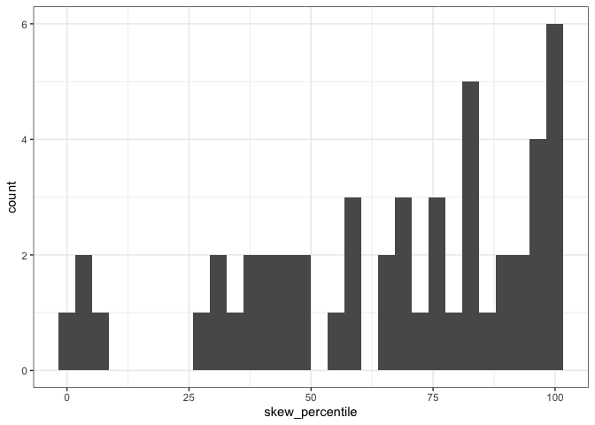<!-- -->

    ## `stat_bin()` using `bins = 30`. Pick better value with `binwidth`.

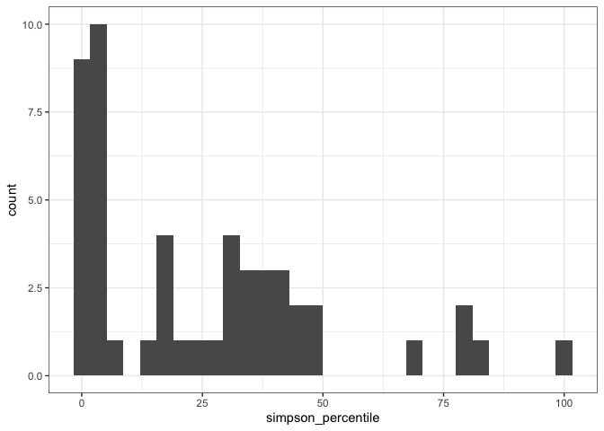<!-- -->

    ## Joining, by = c("dat", "site_source")

    ## `stat_bin()` using `bins = 30`. Pick better value with `binwidth`.

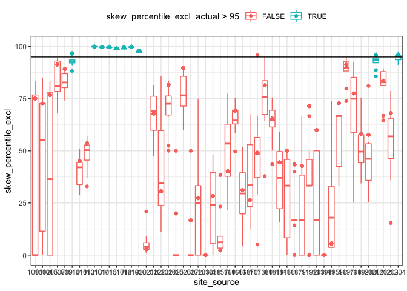<!-- -->

    ## `stat_bin()` using `bins = 30`. Pick better value with `binwidth`.

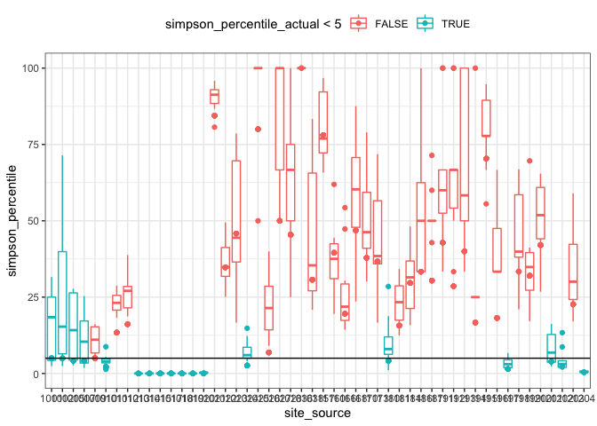<!-- -->

    ## `stat_bin()` using `bins = 30`. Pick better value with `binwidth`.

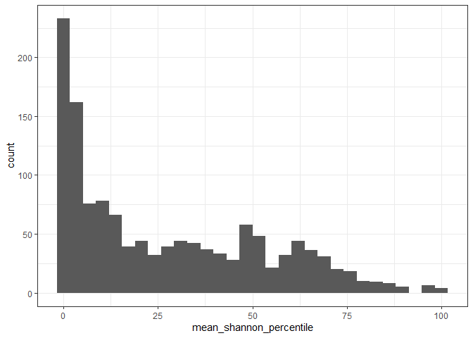<!-- -->

    ## [1] 0.1726784

    ## [1] 0.1189563

    ## [1] 0.4098235

    ## [1] 0.2977744

    ## [1] 0.3737529

    ## [1] 0.2547966

| even\_change         |   n |
| :------------------- | --: |
| actualFALSE\_jkFALSE | 816 |
| actualTRUE\_jkFALSE  | 155 |
| actualTRUE\_jkTRUE   | 332 |

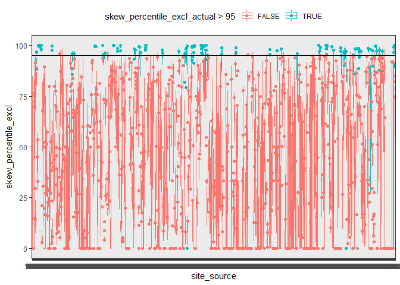<!-- -->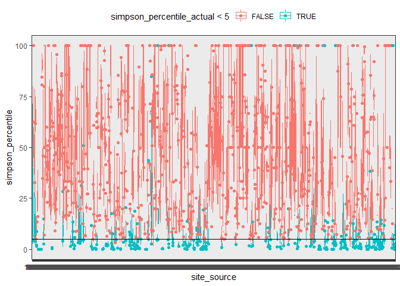<!-- -->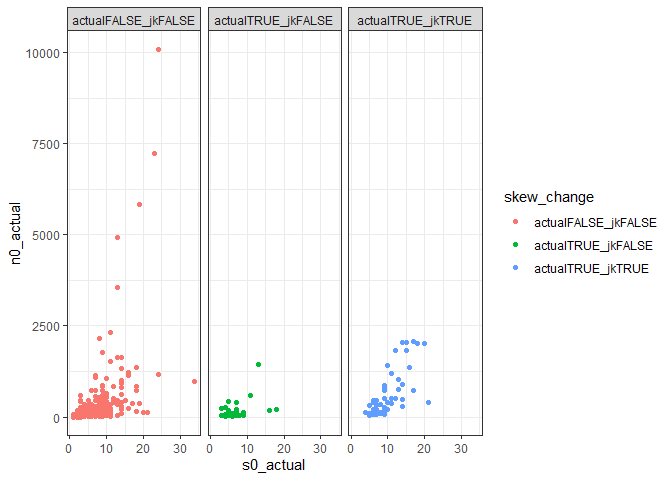<!-- -->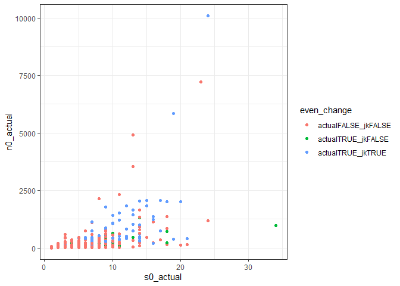<!-- -->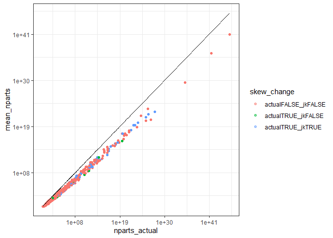<!-- -->

So for these 50 communities, resampling does not change the outcome for
the 6-10 largest communities. It changes it for a handful of smaller
communities. RMD suspects this is because the jacknifed samples, with
60% as many individuals, count as “small” in a way that the observed
sample does not. However, it could also be that in drawing a smaller
number of individuals you have more error, as in you aren’t doing as
good a job replicating the larger distribution?

    ## Joining, by = "site"

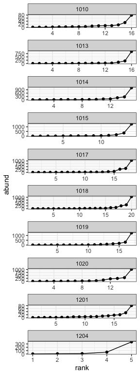<!-- -->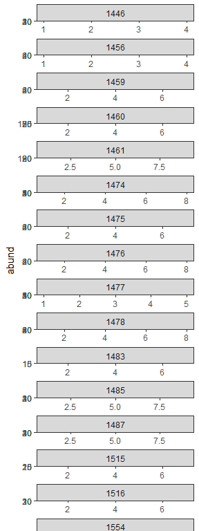<!-- -->

I want to wait until I get results back from a larger sample of the
MCDB. At the moment it seems pretty cool that a) it doesn’t change much
for high N communities but b) it super does for the small ones.

One interesting question is, whether it’s the **tininess of the new
sample** doing a poor job replicating the original shape, or whether
it’s the tininess of the new sample getting down to a fuzzy FS space.
I’m not sure if you can take these apart, but it’s fun to think about.
