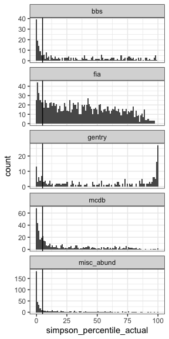
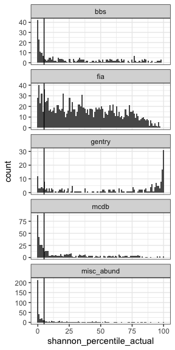
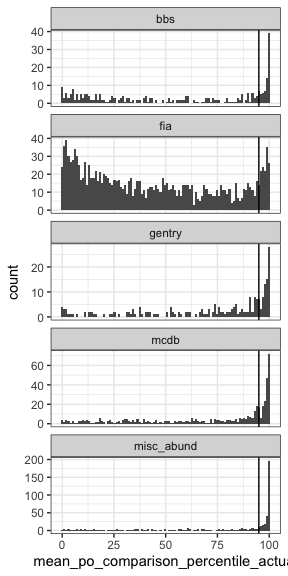
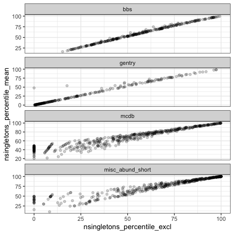
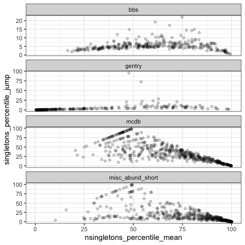

Jackknife
================
Renata Diaz
2021-02-22

  - [Skewness](#skewness)
  - [Evenness](#evenness)
  - [Shannon](#shannon)
  - [Percent off](#percent-off)
  - [Nsingletons](#nsingletons)
  - [Nsingletons excl](#nsingletons-excl)

<!-- ## S and N -->

<!-- ```{r} -->

<!-- ggplot(jk_di_mean_results, aes(s0_actual, s0)) + -->

<!--   geom_point() + -->

<!--   geom_line(aes(s0_actual, s0_actual)) + -->

<!--   facet_wrap(vars(dat), scales = "free") -->

<!-- ggplot(jk_di_mean_results, aes(n0_actual, n0)) + -->

<!--   geom_point() + -->

<!--   geom_line(aes(n0_actual, n0_actual)) + -->

<!--   facet_wrap(vars(dat), scales = "free") -->

<!-- ``` -->

## Skewness

<!-- --><!-- -->

<div class="kable-table">

| dat                | prop\_skew\_high\_jk | prop\_skew\_high\_raw | nsites\_included |
| :----------------- | -------------------: | --------------------: | ---------------: |
| bbs                |            0.1150000 |             0.1450000 |              200 |
| gentry             |            0.0986547 |             0.1883408 |              223 |
| mcdb               |            0.0932897 |             0.1391162 |              611 |
| misc\_abund\_short |            0.2615955 |             0.3153989 |              539 |

</div>

## Evenness

<!-- --><!-- -->

<div class="kable-table">

| dat                | prop\_simpson\_high\_jk | prop\_simpson\_high\_raw | nsites\_included |
| :----------------- | ----------------------: | -----------------------: | ---------------: |
| bbs                |               0.2000000 |                0.2950000 |              200 |
| gentry             |               0.0758929 |                0.1517857 |              224 |
| mcdb               |               0.1698630 |                0.2657534 |              730 |
| misc\_abund\_short |               0.4300885 |                0.5168142 |              565 |

</div>

## Shannon

<!-- --><!-- -->

<div class="kable-table">

| dat                | prop\_shannon\_high\_jk | prop\_shannon\_high\_raw | nsites\_included |
| :----------------- | ----------------------: | -----------------------: | ---------------: |
| bbs                |               0.2100000 |                0.3350000 |              200 |
| gentry             |               0.0669643 |                0.1294643 |              224 |
| mcdb               |               0.1945205 |                0.2876712 |              730 |
| misc\_abund\_short |               0.4424779 |                0.5398230 |              565 |

</div>

## Percent off

<!-- --><!-- -->

<div class="kable-table">

| dat                | prop\_mean\_po\_comparison\_high\_jk | prop\_mean\_po\_comparison\_high\_raw | nsites\_included |
| :----------------- | -----------------------------------: | ------------------------------------: | ---------------: |
| bbs                |                            0.1600000 |                             0.2700000 |              200 |
| gentry             |                            0.1741071 |                             0.3125000 |              224 |
| mcdb               |                            0.1589041 |                             0.2424658 |              730 |
| misc\_abund\_short |                            0.4141593 |                             0.5115044 |              565 |

</div>

## Nsingletons

<!-- --><!-- -->

<div class="kable-table">

| dat                | prop\_nsingletons\_high\_jk | prop\_nsingletons\_high\_raw | nsites\_included |
| :----------------- | --------------------------: | ---------------------------: | ---------------: |
| bbs                |                   0.0650000 |                    0.1300000 |              200 |
| gentry             |                   0.0223214 |                    0.0446429 |              224 |
| mcdb               |                   0.3575342 |                    0.4780822 |              730 |
| misc\_abund\_short |                   0.4212389 |                    0.5061947 |              565 |

</div>

## Nsingletons excl

<!-- --><!-- -->

<div class="kable-table">

| dat                | prop\_nsingletons\_high\_jk | prop\_nsingletons\_high\_raw | nsites\_included |
| :----------------- | --------------------------: | ---------------------------: | ---------------: |
| bbs                |                   0.0450000 |                    0.0900000 |              200 |
| gentry             |                   0.0133929 |                    0.0178571 |              224 |
| mcdb               |                   0.0369863 |                    0.1232877 |              730 |
| misc\_abund\_short |                   0.1752212 |                    0.2920354 |              565 |

</div>
