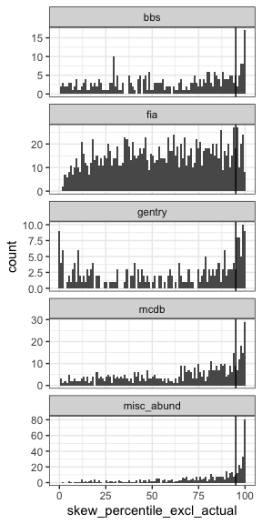
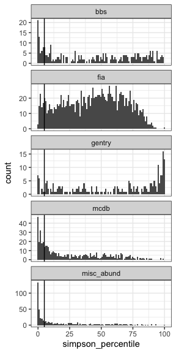
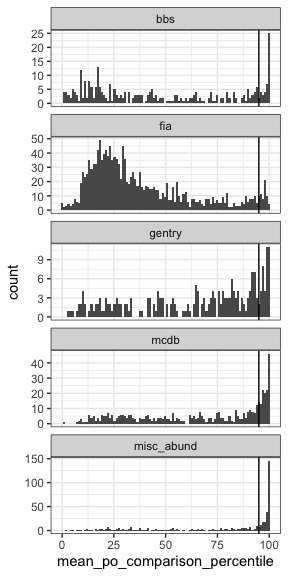
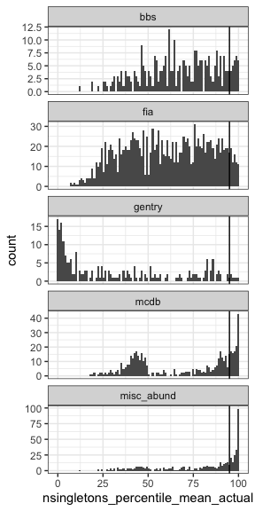

Jackknife
================
Renata Diaz
2021-02-24

  - [Skewness](#skewness)
  - [Evenness](#evenness)
  - [Shannon](#shannon)
  - [Percent off](#percent-off)
  - [Nsingletons excl](#nsingletons-excl)

<!-- ## S and N -->

<!-- ```{r} -->

<!-- ggplot(jk_di_mean_results, aes(s0_actual, s0)) + -->

<!--   geom_point() + -->

<!--   geom_line(aes(s0_actual, s0_actual)) + -->

<!--   facet_wrap(vars(dat), scales = "free") -->

<!-- ggplot(jk_di_mean_results, aes(n0_actual, n0)) + -->

<!--   geom_point() + -->

<!--   geom_line(aes(n0_actual, n0_actual)) + -->

<!--   facet_wrap(vars(dat), scales = "free") -->

<!-- ``` -->

## Skewness

<!-- -->

    ## Warning: Removed 1392 rows containing non-finite values (stat_bin).

<!-- -->

<div class="kable-table">

| dat                | prop\_skew\_high\_jk | prop\_skew\_high\_raw | prop\_skew\_low\_jk | prop\_skew\_low\_raw | nsites\_included |
| :----------------- | -------------------: | --------------------: | ------------------: | -------------------: | ---------------: |
| bbs                |            0.1100000 |             0.1366667 |           0.0366667 |            0.0366667 |              300 |
| fia\_short         |            0.0204082 |                    NA |           0.0000000 |                   NA |              784 |
| fia\_small         |            0.0197368 |                    NA |           0.0000000 |                   NA |              608 |
| gentry             |            0.0986547 |             0.1883408 |           0.0762332 |            0.0896861 |              223 |
| mcdb               |            0.1194969 |             0.1781971 |           0.0020964 |            0.0146751 |              477 |
| misc\_abund\_short |            0.2955975 |             0.3563941 |           0.0020964 |            0.0041929 |              477 |

</div>

## Evenness

<!-- -->

    ## Warning: Removed 1392 rows containing non-finite values (stat_bin).

<!-- -->

<div class="kable-table">

| dat                | prop\_simpson\_high\_jk | prop\_simpson\_high\_raw | prop\_simpson\_low\_jk | prop\_simpson\_low\_raw | nsites\_included |
| :----------------- | ----------------------: | -----------------------: | ---------------------: | ----------------------: | ---------------: |
| bbs                |               0.0433333 |                0.0333333 |              0.1866667 |               0.2900000 |              300 |
| fia\_short         |               0.0000000 |                       NA |              0.0344388 |                      NA |              784 |
| fia\_small         |               0.0000000 |                       NA |              0.0723684 |                      NA |              608 |
| gentry             |               0.2276786 |                0.2723214 |              0.0758929 |               0.1517857 |              224 |
| mcdb               |               0.0062112 |                0.0103520 |              0.2567288 |               0.3830228 |              483 |
| misc\_abund\_short |               0.0020877 |                0.0041754 |              0.5073069 |               0.6096033 |              479 |

</div>

## Shannon

<!-- -->

    ## Warning: Removed 1392 rows containing non-finite values (stat_bin).

<!-- -->

<div class="kable-table">

| dat                | prop\_shannon\_high\_jk | prop\_shannon\_high\_raw | prop\_shannon\_low\_jk | prop\_shannon\_low\_raw | nsites\_included |
| :----------------- | ----------------------: | -----------------------: | ---------------------: | ----------------------: | ---------------: |
| bbs                |               0.0333333 |                0.0266667 |              0.1900000 |               0.3200000 |              300 |
| fia\_short         |               0.0000000 |                       NA |              0.0280612 |                      NA |              784 |
| fia\_small         |               0.0000000 |                       NA |              0.0723684 |                      NA |              608 |
| gentry             |               0.2500000 |                0.3080357 |              0.0669643 |               0.1294643 |              224 |
| mcdb               |               0.0062112 |                0.0103520 |              0.2939959 |               0.4161491 |              483 |
| misc\_abund\_short |               0.0020877 |                0.0083507 |              0.5219207 |               0.6367432 |              479 |

</div>

## Percent off

<!-- -->

    ## Warning: Removed 1392 rows containing non-finite values (stat_bin).

<!-- -->

<div class="kable-table">

| dat                | prop\_mean\_po\_comparison\_high\_jk | prop\_mean\_po\_comparison\_high\_raw | nsites\_included |
| :----------------- | -----------------------------------: | ------------------------------------: | ---------------: |
| bbs                |                            0.1433333 |                             0.2500000 |              300 |
| fia\_short         |                            0.0216837 |                                    NA |              784 |
| fia\_small         |                            0.0509868 |                                    NA |              608 |
| gentry             |                            0.1741071 |                             0.3125000 |              224 |
| mcdb               |                            0.2401656 |                             0.3519669 |              483 |
| misc\_abund\_short |                            0.4885177 |                             0.6033403 |              479 |

</div>

<!-- ## Nsingletons -->

<!-- ```{r} -->

<!-- ggplot(filter(jk_di_mean_results, nparts > 20), aes(nsingletons_percentile_excl)) + -->

<!--   geom_histogram(bins = 100) + -->

<!--   facet_wrap(vars(dat), scales = "free_y", ncol = 1) + -->

<!--   geom_vline(xintercept = 95) -->

<!-- ggplot(filter(jk_di_mean_results, nparts > 20), aes(nsingletons_percentile_actual)) + -->

<!--   geom_histogram(bins = 100) + -->

<!--   facet_wrap(vars(dat), scales = "free_y", ncol = 1) + -->

<!--   geom_vline(xintercept = 95) -->

<!-- jk_di_mean_results  %>%  -->

<!--   group_by(dat) %>% -->

<!--   summarize(prop_nsingletons_high_jk = mean(nsingletons_percentile > 95), -->

<!--             prop_nsingletons_high_raw = mean(nsingletons_percentile_actual > 95), -->

<!--             nsites_included = dplyr::n()) -->

<!-- ``` -->

## Nsingletons excl

Visualization and analysis of nsingletons has a little more nuance than
the others, because there are often relatively few values for
nsingletons at all. 80% of sites have fewer than 20 singletons as the
95th percentile, which is just a rough way of saying that a **lot** of
these are going to be sensitive to whether you define the percentiles as
\> or \>=.

In general the strict \> percentile will give you an (appropriately)
conservative estimate of how many are extraordinarily **high** and the
\>= will give you an appropriate estimate of how many are unusually
**low**. For most metrics it doesn’t really matter, writ large, which
you use, because ties are rare. For this one, you get large numbers of
sites where a lot of values are = to the observed values, and the \>=
decision will therefore give you a jump of a lot of percentile scores.

For the “proportions high/low” calculations, we use *the \> percentile
for high* and *the \>= percentile for low*. For visualization, because
we are interested in both unusually high and unusually low scores, we
can’t just pick one or the other. The histogram using \>= is reliable at
the high end but has a misleading spike at 0, and vice versa. I am
making these plots using the *mean*, which doesn’t have the misleading
spikes at the extremes but does smear things out a little bit.

<!-- -->

    ## Warning: Removed 1392 rows containing non-finite values (stat_bin).

<!-- -->

<div class="kable-table">

| dat                | prop\_nsingletons\_high\_jk | prop\_nsingletons\_high\_raw | prop\_nsingletons\_low\_jk | prop\_nsingletons\_low\_raw | nsites\_included |
| :----------------- | --------------------------: | ---------------------------: | -------------------------: | --------------------------: | ---------------: |
| bbs                |                   0.0466667 |                    0.0833333 |                  0.0000000 |                   0.0000000 |              300 |
| fia\_short         |                   0.0000000 |                           NA |                  0.0000000 |                          NA |              784 |
| fia\_small         |                   0.0082237 |                           NA |                  0.0000000 |                          NA |              608 |
| gentry             |                   0.0133929 |                    0.0178571 |                  0.2366071 |                   0.2991071 |              224 |
| mcdb               |                   0.0559006 |                    0.1718427 |                  0.0000000 |                   0.0000000 |              483 |
| misc\_abund\_short |                   0.2066806 |                    0.3444676 |                  0.0000000 |                   0.0000000 |              479 |

</div>

    ## Warning: Removed 1392 rows containing missing values (geom_point).

<!-- -->

<div class="kable-table">

| dat                | jk\_small | actual\_small | nsites |
| :----------------- | --------: | ------------: | -----: |
| bbs                | 0.0166667 |     0.0100000 |    300 |
| fia\_short         | 1.0000000 |            NA |    784 |
| fia\_small         | 1.0000000 |            NA |    608 |
| gentry             | 0.1517857 |     0.0669643 |    224 |
| mcdb               | 0.7204969 |     0.5734990 |    483 |
| misc\_abund\_short | 0.4342380 |     0.3173278 |    479 |

</div>

    ## `summarise()` has grouped output by 'dat'. You can override using the `.groups` argument.

<div class="kable-table">

| dat                | fiasized | nsingletons\_high | nsites |
| :----------------- | :------- | ----------------: | -----: |
| bbs                | FALSE    |         0.0474576 |    295 |
| bbs                | TRUE     |         0.0000000 |      5 |
| fia\_short         | TRUE     |         0.0000000 |    784 |
| fia\_small         | TRUE     |         0.0082237 |    608 |
| gentry             | FALSE    |         0.0000000 |    190 |
| gentry             | TRUE     |         0.0882353 |     34 |
| mcdb               | FALSE    |         0.1185185 |    135 |
| mcdb               | TRUE     |         0.0316092 |    348 |
| misc\_abund\_short | FALSE    |         0.3247232 |    271 |
| misc\_abund\_short | TRUE     |         0.0528846 |    208 |

</div>

<!-- ```{r, fig.dim = c(6,6)} -->

<!-- jk_di_mean_results <- jk_di_mean_results %>% -->

<!--  #select(-singletons_percentile_excl_high_insig, -singletons_percentile_low_insig) -->

<!--   group_by_all() %>% -->

<!--   mutate(prop_singletons = nsingletons / s0, -->

<!--          prop_singletons_actual = nsingletons_actual / s0, -->

<!--          singletons_percentile_high_change = paste0("actual", (nsingletons_percentile_excl_actual > 95), "_jk", (nsingletons_percentile_excl > 95)), -->

<!--          singletons_percentile_low_change = paste0("actual", (nsingletons_percentile_actual <5), "_jk", (nsingletons_percentile < 5))) %>% -->

<!--   ungroup() %>% -->

<!--   mutate(prop_singletons_change = prop_singletons - prop_singletons_actual) -->

<!-- ggplot(jk_di_mean_results, aes(prop_singletons_actual, prop_singletons, color =singletons_percentile_high_change)) + geom_point() + geom_line(aes(prop_singletons_actual,prop_singletons_actual), inherit.aes = F) -->

<!-- ggplot(jk_di_mean_results, aes(nsingletons_actual, nsingletons,color = singletons_percentile_high_change)) + geom_point() + geom_line(aes(nsingletons_actual,nsingletons_actual), inherit.aes = F) +facet_wrap(vars(dat), scales = "free") + theme(legend.position = "top") -->

<!-- ggplot(jk_di_mean_results, aes(s0,n0, color =  -->

<!-- ggplot(jk_di_mean_results, aes(nsingletons_actual, nsingletons,color = singletons_percentile_high_change)) + geom_point() + geom_line(aes(nsingletons_actual,nsingletons_actual), inherit.aes = F) +facet_wrap(vars(dat), scales = "free") + theme(legend.position = "top") -->

<!-- )) + geom_point() +scale_x_log10() +scale_y_log10() + -->

<!--   facet_wrap(vars(dat), scales = "free") + -->

<!--   theme(legend.position = "top") -->

<!-- ggplot(jk_di_mean_results, aes(s0,n0, color = singletons_percentile_low_change)) + geom_point() +scale_x_log10() +scale_y_log10()+ -->

<!--   facet_wrap(vars(dat), scales = "free") + -->

<!--   theme(legend.position = "top") -->

<!-- ggplot(jk_di_mean_results, aes(n0/s0, nsingletons_percentile_excl, color = singletons_percentile_high_change)) + geom_point()+ -->

<!--   facet_wrap(vars(dat), scales = "free") + -->

<!--   theme(legend.position = "top") -->

<!-- ``` -->
