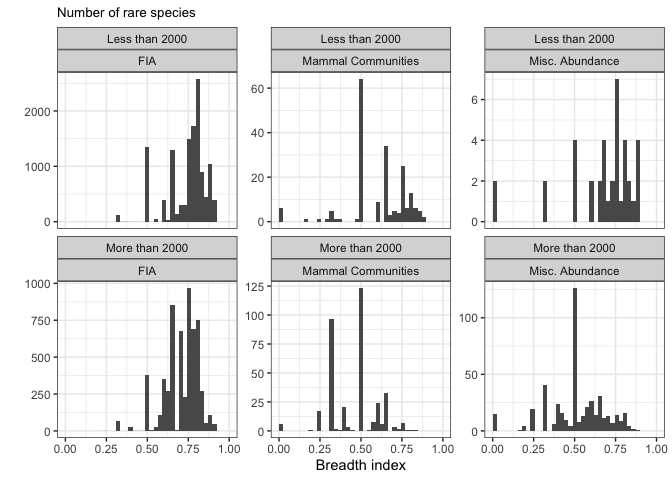
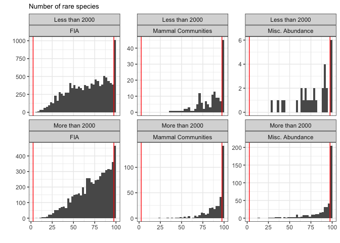
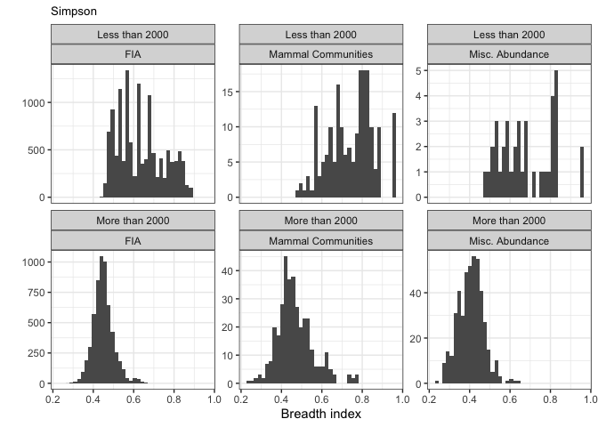
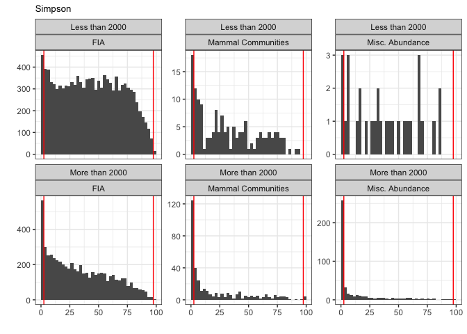
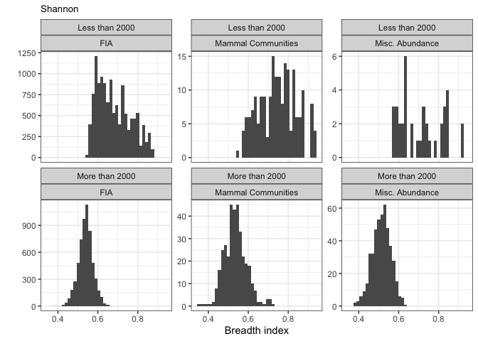
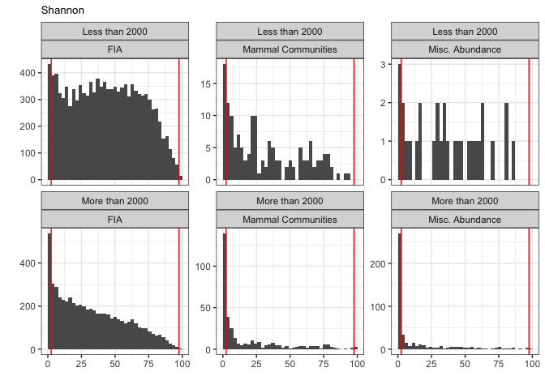
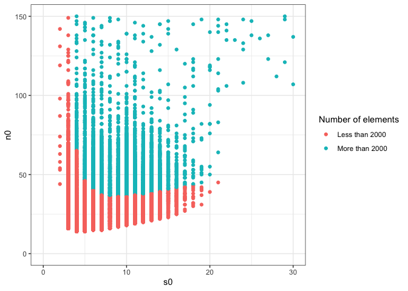
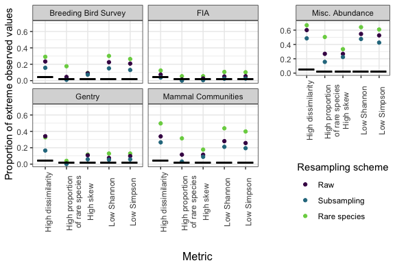
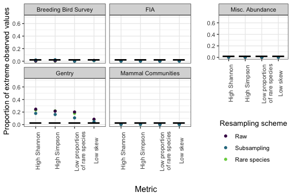
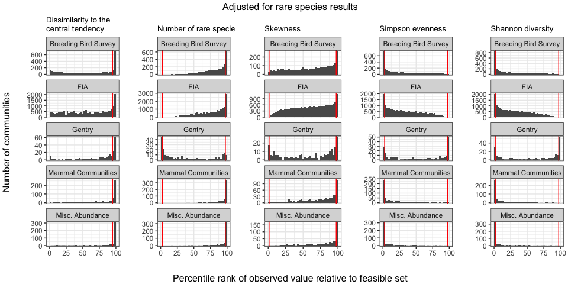

Figures and results for main manuscript
================
Renata Diaz
2021-03-18

  - [Datasets by S and N (Figure 1)](#datasets-by-s-and-n-figure-1)
  - [Illustrations of 95% interval (Figure
    2)](#illustrations-of-95-interval-figure-2)
  - [Dissimilarity (Supplement)](#dissimilarity-supplement)
  - [Metric histograms by dataset (Figure
    4)](#metric-histograms-by-dataset-figure-4)
  - [Results table](#results-table)
  - [Narrowness](#narrowness)
  - [Gentry](#gentry)
  - [Comparison of FIA and comparably sized communities (Figure
    4)](#comparison-of-fia-and-comparably-sized-communities-figure-4)
  - [Very small communities](#very-small-communities)
  - [Resampling](#resampling)

# Datasets by S and N (Figure 1)

<!-- -->

# Illustrations of 95% interval (Figure 2)

To show the 95% interval, we need to load the distribution of shape
metric values from the samples from the feasible set for a few
communities. See rov\_metric.md.

<!-- ```{r, fig.dim = c(7,7)} -->

<!-- library(drake) -->

<!-- db <- DBI::dbConnect(RSQLite::SQLite(), here::here("analysis", "drake", "drake-cache-net.sqlite")) -->

<!-- cache <- storr::storr_dbi("datatable", "keystable", db) -->

<!-- cache$del(key = "lock", namespace = "session") -->

<!-- net_summary <- readd(all_di_summary, cache = cache) -->

<!-- net_summary <- net_summary %>% -->

<!--   mutate(log_nparts = log(gmp:::as.double.bigz(nparts))) -->

<!-- example_fs <- readd(fs_s_44_n_13360, cache = cache) -->

<!-- example_di <- readd(di_fs_s_44_n_13360, cache =cache) -->

<!-- example_fs <- example_fs %>% -->

<!--   left_join(example_di) %>% -->

<!--   left_join(net_summary) -->

<!-- example_fs2 <- readd(fs_s_13_n_315, cache = cache) -->

<!-- example_di2 <- readd(di_fs_s_13_n_315, cache =cache) -->

<!-- example_fs2 <- example_fs2 %>% -->

<!--   left_join(example_di2) %>% -->

<!--   left_join(net_summary) -->

<!-- example_fs3 <- readd(fs_s_4_n_34, cache = cache) -->

<!-- example_di3 <- readd(di_fs_s_4_n_34, cache =cache) -->

<!-- example_fs3 <- example_fs3 %>% -->

<!--   left_join(example_di3) %>% -->

<!--   left_join(net_summary) -->

<!-- breadth_plots <- list( -->

<!--   ggplot(example_fs3, aes(rank, abund, group = sim, color = skew)) + -->

<!--     geom_line(alpha = .25) + -->

<!--     theme_bw() + -->

<!--     scale_color_viridis_c(option = "plasma", end = .8) + -->

<!--     ggtitle("Small community", subtitle = paste0("S = ", (example_fs3$s0), "; N = ", (example_fs3$n0[1]))) + -->

<!--     theme(legend.position = "right") + -->

<!--     xlab("Rank") + -->

<!--     ylab("Abundance"), -->

<!--   ggplot(example_fs3, aes(skew)) + -->

<!--   #  geom_density() + -->

<!--     geom_histogram(bins = 50) + -->

<!--     theme_bw() + -->

<!--     geom_vline(xintercept = c(example_fs3$skew_97p5[1], example_fs3$skew_2p5[1]), color = "red") + -->

<!--     ggtitle("", subtitle = paste0("Breadth index: ", round((example_fs3$skew_95_ratio_2t[1]), 2))) + -->

<!--     xlab("Skewness") + -->

<!--     ylab("Count"), -->

<!--   ggplot(example_fs2, aes(rank, abund, group = sim, color = skew)) + -->

<!--     geom_line(alpha = .1) + -->

<!--     theme_bw() + -->

<!--     scale_color_viridis_c(option = "plasma", end = .8) + -->

<!--     ggtitle("Medium community", subtitle = paste0("S = ", (example_fs2$s0), "; N = ", (example_fs2$n0[1]))) + -->

<!--     theme(legend.position = "right")+ -->

<!--     xlab("Rank") + -->

<!--     ylab("Abundance") + -->

<!--     ylim(0, 200), # Remove 3 sads that make the axes too big to be interpretable -->

<!--   ggplot(example_fs2, aes(skew)) + -->

<!--   #  geom_density() + -->

<!--     geom_histogram(bins = 50) + -->

<!--     theme_bw() + -->

<!--     geom_vline(xintercept = c(example_fs2$skew_97p5[1], example_fs2$skew_2p5[1]), color = "red") + -->

<!--     ggtitle("", subtitle =  paste0("Breadth index: ", round((example_fs2$skew_95_ratio_1t[1]), 2)))+ -->

<!--     xlab("Skewness") + -->

<!--     ylab("Count"), -->

<!--   ggplot(example_fs, aes(rank, abund, group = sim, color = skew)) + -->

<!--     geom_line(alpha = .1) + -->

<!--     theme_bw() + -->

<!--     scale_color_viridis_c(option = "plasma", end = .8) + -->

<!--     ggtitle("Large community", subtitle = paste0("S = ", (example_fs$s0), "; N = ", (example_fs$n0[1]))) + -->

<!--     theme(legend.position = "right") + -->

<!--     ylim(0, 4000) + # Remove a very few very very uneven SADs that make the scale too big to be interpretable -->

<!--     theme(axis.text.y = element_text(size = 6, angle = 60))+ -->

<!--     xlab("Rank") + -->

<!--     ylab("Abundance"), -->

<!--   ggplot(example_fs, aes(skew)) + -->

<!--    # geom_density() + -->

<!--     geom_histogram(bins = 50) + -->

<!--     theme_bw() + -->

<!--     geom_vline(xintercept = c(example_fs$skew_97p5[1], example_fs$skew_2p5[1]), color = "red") + -->

<!--     ggtitle("", subtitle =  paste0("Breadth index: ", round((example_fs$skew_95_ratio_1t[1]), 2)))+ -->

<!--     xlab("Skewness") + -->

<!--     ylab("Count") -->

<!-- ) -->

<!-- fig_1 <- gridExtra::grid.arrange(grobs = breadth_plots, ncol = 2, top = textGrob("Figure 1", gp = gpar(fill = "white"))) -->

<!-- plot(fig_1) -->

<!-- DBI::dbDisconnect(db) -->

<!-- rm(cache) -->

<!-- rm(db) -->

<!-- ``` -->

# Dissimilarity (Supplement)

<!-- -->

# Metric histograms by dataset (Figure 4)

<!-- -->

# Results table

    ## Joining, by = "Dataset"
    ## Joining, by = "Dataset"

    ## Note: Using an external vector in selections is ambiguous.
    ## ℹ Use `all_of(cols1)` instead of `cols1` to silence this message.
    ## ℹ See <https://tidyselect.r-lib.org/reference/faq-external-vector.html>.
    ## This message is displayed once per session.

<div class="kable-table">

| Dataset              | High dissimilarity | High proportion of rare species | High skew       | Low Simpson     | Low Shannon     |
| :------------------- | :----------------- | :------------------------------ | :-------------- | :-------------- | :-------------- |
| Breeding Bird Survey | 23%; n = 2773      | 4.5%; n = 2773                  | 9%; n = 2773    | 21%; n = 2773   | 23%; n = 2773   |
| FIA                  | 7.2%; n = 18447    | 1.4%; n = 17410                 | 2.8%; n = 17410 | 5.8%; n = 17410 | 5.5%; n = 17410 |
| Gentry               | 34%; n = 224       | 0.9%; n = 223                   | 11%; n = 223    | 9.9%; n = 223   | 7.6%; n = 223   |
| Mammal Communities   | 32%; n = 552       | 13%; n = 511                    | 12%; n = 505    | 28%; n = 511    | 30%; n = 511    |
| Misc. Abundance      | 59%; n = 494       | 27%; n = 486                    | 27%; n = 484    | 53%; n = 486    | 56%; n = 486    |

</div>

    ## Note: Using an external vector in selections is ambiguous.
    ## ℹ Use `all_of(cols2)` instead of `cols2` to silence this message.
    ## ℹ See <https://tidyselect.r-lib.org/reference/faq-external-vector.html>.
    ## This message is displayed once per session.

<div class="kable-table">

| Dataset              | Low proportion of rare species | Low skew         | High Simpson      | High Shannon      |
| :------------------- | :----------------------------- | :--------------- | :---------------- | :---------------- |
| Breeding Bird Survey | 0%; n = 2773                   | 1.1%; n = 2773   | 0.61%; n = 2773   | 0.36%; n = 2773   |
| FIA                  | 0%; n = 17410                  | 0.28%; n = 17410 | 0.063%; n = 17410 | 0.086%; n = 17410 |
| Gentry               | 20%; n = 223                   | 8.5%; n = 223    | 22%; n = 223      | 25%; n = 223      |
| Mammal Communities   | 0%; n = 511                    | 0.79%; n = 505   | 0.59%; n = 511    | 0.39%; n = 511    |
| Misc. Abundance      | 0%; n = 486                    | 0.21%; n = 484   | 0.21%; n = 486    | 0.21%; n = 486    |

</div>

# Narrowness

    ## Warning: Removed 8 rows containing missing values (geom_point).

<!-- -->

<!-- -->

# Gentry

<!-- -->

# Comparison of FIA and comparably sized communities (Figure 4)

    ## Warning in ks.test(fia_df[[compare_var]], other_df[[compare_var]]): p-value will
    ## be approximate in the presence of ties
    
    ## Warning in ks.test(fia_df[[compare_var]], other_df[[compare_var]]): p-value will
    ## be approximate in the presence of ties
    
    ## Warning in ks.test(fia_df[[compare_var]], other_df[[compare_var]]): p-value will
    ## be approximate in the presence of ties
    
    ## Warning in ks.test(fia_df[[compare_var]], other_df[[compare_var]]): p-value will
    ## be approximate in the presence of ties
    
    ## Warning in ks.test(fia_df[[compare_var]], other_df[[compare_var]]): p-value will
    ## be approximate in the presence of ties

<div class="kable-table">

|     | var                        |         d |         p |
| :-- | :------------------------- | --------: | --------: |
| D…1 | simpson\_95\_ratio\_2t     | 0.0393939 | 0.9599607 |
| D…2 | skew\_95\_ratio\_2t        | 0.0000000 | 1.0000000 |
| D…3 | shannon\_95\_ratio\_2t     | 0.0424242 | 0.9277987 |
| D…4 | nsingletons\_95\_ratio\_2t | 0.0333333 | 0.9930019 |
| D…5 | sim\_pos\_from\_best       | 0.0268097 | 0.9993106 |

</div>

    ## Warning in ks.test(fia_df[[compare_var]], other_df[[compare_var]]): p-value will
    ## be approximate in the presence of ties
    
    ## Warning in ks.test(fia_df[[compare_var]], other_df[[compare_var]]): p-value will
    ## be approximate in the presence of ties
    
    ## Warning in ks.test(fia_df[[compare_var]], other_df[[compare_var]]): p-value will
    ## be approximate in the presence of ties
    
    ## Warning in ks.test(fia_df[[compare_var]], other_df[[compare_var]]): p-value will
    ## be approximate in the presence of ties
    
    ## Warning in ks.test(fia_df[[compare_var]], other_df[[compare_var]]): p-value will
    ## be approximate in the presence of ties

<div class="kable-table">

|     | var                           |         d |         p |
| :-- | :---------------------------- | --------: | --------: |
| D…1 | simpson\_percentile           | 0.0575758 | 0.6447379 |
| D…2 | skew\_percentile\_excl        | 0.0000000 | 1.0000000 |
| D…3 | shannon\_percentile           | 0.0606061 | 0.5794869 |
| D…4 | nsingletons\_percentile\_excl | 0.0363636 | 0.9812077 |
| D…5 | real\_po\_percentile\_excl    | 0.0424242 | 0.9277987 |

</div>

<!-- --><!-- -->

    ## Joining, by = "Dataset"
    ## Joining, by = "Dataset"

<div class="kable-table">

| Dataset        | High dissimilarity | High proportion of rare species | High skew     | Low Simpson  | Low Shannon  |
| :------------- | :----------------- | :------------------------------ | :------------ | :----------- | :----------- |
| FIA            | 17%; n = 373       | 4.8%; n = 330                   | 7%; n = 330   | 15%; n = 330 | 16%; n = 330 |
| Other datasets | 17%; n = 373       | 6.1%; n = 330                   | 6.4%; n = 330 | 15%; n = 330 | 15%; n = 330 |

</div>

# Very small communities

    ## `summarise()` has grouped output by 'Dataset'. You can override using the `.groups` argument.
    ## `summarise()` has grouped output by 'Dataset'. You can override using the `.groups` argument.
    ## `summarise()` has grouped output by 'Dataset'. You can override using the `.groups` argument.

    ## Joining, by = c("Dataset", "Number of elements")
    ## Joining, by = c("Dataset", "Number of elements")

<div class="kable-table">

| Dataset              | Number of elements | High dissimilarity | High proportion of rare species | High skew       | Low Simpson     | Low Shannon     |
| :------------------- | :----------------- | :----------------- | :------------------------------ | :-------------- | :-------------- | :-------------- |
| Breeding Bird Survey | Less than 2000     | 0%; n = 1          | 0%; n = 1                       | 0%; n = 1       | 0%; n = 1       | 0%; n = 1       |
| Breeding Bird Survey | More than 2000     | 23%; n = 2772      | 4.5%; n = 2772                  | 9%; n = 2772    | 21%; n = 2772   | 23%; n = 2772   |
| FIA                  | Less than 2000     | 5.3%; n = 12553    | 1.2%; n = 11516                 | 1.2%; n = 11516 | 3.9%; n = 11516 | 3.6%; n = 11516 |
| FIA                  | More than 2000     | 11%; n = 5894      | 1.7%; n = 5894                  | 6%; n = 5894    | 9.5%; n = 5894  | 9%; n = 5894    |
| Gentry               | Less than 2000     | 0%; n = 1          | NA                              | NA              | NA              | NA              |
| Gentry               | More than 2000     | 34%; n = 223       | 0.9%; n = 223                   | 11%; n = 223    | 9.9%; n = 223   | 7.6%; n = 223   |
| Mammal Communities   | Less than 2000     | 12%; n = 193       | 4.6%; n = 152                   | 1.4%; n = 146   | 12%; n = 152    | 12%; n = 152    |
| Mammal Communities   | More than 2000     | 42%; n = 359       | 16%; n = 359                    | 17%; n = 359    | 35%; n = 359    | 38%; n = 359    |
| Misc. Abundance      | Less than 2000     | 11%; n = 38        | 6.7%; n = 30                    | 7.1%; n = 28    | 10%; n = 30     | 10%; n = 30     |
| Misc. Abundance      | More than 2000     | 63%; n = 456       | 29%; n = 456                    | 29%; n = 456    | 56%; n = 456    | 59%; n = 456    |

</div>

<!-- --><!-- --><!-- --><!-- --><!-- --><!-- --><!-- --><!-- -->

    ## Warning: Removed 3472 rows containing missing values (geom_point).

<!-- -->

    ## `summarise()` has grouped output by 'Dataset'. You can override using the `.groups` argument.

    ## `stat_bin()` using `bins = 30`. Pick better value with `binwidth`.

    ## Warning: Removed 12 rows containing non-finite values (stat_bin).

<!-- -->

    ## `summarise()` has grouped output by 'Dataset'. You can override using the `.groups` argument.

    ## `summarise()` has grouped output by 'Dataset'. You can override using the `.groups` argument.

    ## Joining, by = c("Dataset", "Number of elements")
    ## Joining, by = c("Dataset", "Number of elements")

<div class="kable-table">

| Dataset              | Number of elements | High dissimilarity | High proportion of rare species | High skew       | Low Simpson    | Low Shannon    |
| :------------------- | :----------------- | :----------------- | :------------------------------ | :-------------- | :------------- | :------------- |
| Breeding Bird Survey | Less than 1000     | 0%; n = 1          | 0%; n = 1                       | 0%; n = 1       | 0%; n = 1      | 0%; n = 1      |
| Breeding Bird Survey | More than 1000     | 23%; n = 2772      | 4.5%; n = 2772                  | 9%; n = 2772    | 21%; n = 2772  | 23%; n = 2772  |
| FIA                  | Less than 1000     | 5.1%; n = 10488    | 1.2%; n = 9451                  | 0.92%; n = 9451 | 3.6%; n = 9451 | 3.5%; n = 9451 |
| FIA                  | More than 1000     | 9.8%; n = 7959     | 1.6%; n = 7959                  | 5%; n = 7959    | 8.3%; n = 7959 | 7.8%; n = 7959 |
| Gentry               | Less than 1000     | 0%; n = 1          | NA                              | NA              | NA             | NA             |
| Gentry               | More than 1000     | 34%; n = 223       | 0.9%; n = 223                   | 11%; n = 223    | 9.9%; n = 223  | 7.6%; n = 223  |
| Mammal Communities   | Less than 1000     | 12%; n = 175       | 4.5%; n = 134                   | 1.6%; n = 128   | 11%; n = 134   | 11%; n = 134   |
| Mammal Communities   | More than 1000     | 41%; n = 377       | 15%; n = 377                    | 16%; n = 377    | 34%; n = 377   | 37%; n = 377   |
| Misc. Abundance      | Less than 1000     | 10%; n = 30        | 4.5%; n = 22                    | 10%; n = 20     | 9.1%; n = 22   | 9.1%; n = 22   |
| Misc. Abundance      | More than 1000     | 62%; n = 464       | 28%; n = 464                    | 28%; n = 464    | 56%; n = 464   | 58%; n = 464   |

</div>

# Resampling

    ## Joining, by = c("sim", "source", "dat", "site", "singletons", "s0", "n0", "nparts")
    ## Joining, by = c("sim", "source", "dat", "site", "singletons", "s0", "n0", "nparts")

    ## Warning: Unknown or uninitialised column: `njks_skew`.

    ## `summarise()` has grouped output by 'Dataset'. You can override using the `.groups` argument.

    ## `summarise()` has grouped output by 'Dataset'. You can override using the `.groups` argument.

    ## Joining, by = c("Dataset", "resampling")

<div class="kable-table">

| Dataset              | Resampling scheme | High dissimilarity | High proportion of rare species | High skew       | Low Simpson     | Low Shannon     |
| :------------------- | :---------------- | :----------------- | :------------------------------ | :-------------- | :-------------- | :-------------- |
| Breeding Bird Survey | Raw               | 23%; n =2773       | 4.5%; n =2773                   | 9%; n = 2773    | 21%; n = 2773   | 23%; n = 2773   |
| Breeding Bird Survey | Subsampling       | 16%; n =300        | 1%; n =300                      | 7.3%; n = 300   | 13%; n = 300    | 15%; n = 300    |
| Breeding Bird Survey | Rare species      | 29%; n =2773       | 18%; n =2773                    | 9.4%; n = 2773  | 26%; n = 2773   | 30%; n = 2773   |
| FIA                  | Raw               | 7.4%; n =17410     | 1.3%; n =18447                  | 2.6%; n = 18447 | 5.4%; n = 18447 | 5.1%; n = 18447 |
| FIA                  | Subsampling       | 3.8%; n =1118      | 0.072%; n =1388                 | 0.58%; n = 1388 | 2.5%; n = 1388  | 2.4%; n = 1388  |
| FIA                  | Rare species      | 12%; n =17918      | 5.4%; n =18736                  | 5.4%; n = 18736 | 10%; n = 18736  | 11%; n = 18736  |
| Gentry               | Raw               | 34%; n =223        | 0.89%; n =224                   | 11%; n = 223    | 9.8%; n = 224   | 7.6%; n = 224   |
| Gentry               | Subsampling       | 17%; n =223        | 0%; n =224                      | 5.8%; n = 223   | 5.8%; n = 224   | 5.4%; n = 224   |
| Gentry               | Rare species      | 33%; n =223        | 4%; n =224                      | 12%; n = 223    | 13%; n = 224    | 13%; n = 224    |
| Mammal Communities   | Raw               | 34%; n =511        | 12%; n =552                     | 11%; n = 540    | 26%; n = 552    | 28%; n = 552    |
| Mammal Communities   | Subsampling       | 27%; n =432        | 3.2%; n =473                    | 8.9%; n = 471   | 19%; n = 473    | 21%; n = 473    |
| Mammal Communities   | Rare species      | 50%; n =555        | 31%; n =594                     | 18%; n = 592    | 40%; n = 594    | 44%; n = 594    |
| Misc. Abundance      | Raw               | 60%; n =486        | 27%; n =494                     | 27%; n = 492    | 53%; n = 494    | 55%; n = 494    |
| Misc. Abundance      | Subsampling       | 49%; n =474        | 16%; n =479                     | 22%; n = 477    | 43%; n = 479    | 48%; n = 479    |
| Misc. Abundance      | Rare species      | 67%; n =488        | 50%; n =496                     | 33%; n = 494    | 61%; n = 496    | 64%; n = 496    |

</div>

<div class="kable-table">

| Dataset              | Resampling scheme | Low proportion of rare species | Low skew          | High Simpson      | High Shannon      |
| :------------------- | :---------------- | :----------------------------- | :---------------- | :---------------- | :---------------- |
| Breeding Bird Survey | Raw               | 0%; n =2773                    | 1.1%; n = 2773    | 0.61%; n = 2773   | 0.36%; n = 2773   |
| Breeding Bird Survey | Subsampling       | 0%; n =300                     | 1%; n = 300       | 2.3%; n = 300     | 2%; n = 300       |
| Breeding Bird Survey | Rare species      | 0%; n =2773                    | 0.83%; n = 2773   | 0.22%; n = 2773   | 0.036%; n = 2773  |
| FIA                  | Raw               | 0%; n =18447                   | 0.27%; n = 18447  | 0.06%; n = 18447  | 0.081%; n = 18447 |
| FIA                  | Subsampling       | 0%; n =1388                    | 0%; n = 1388      | 0%; n = 1388      | 0%; n = 1388      |
| FIA                  | Rare species      | 0%; n =18736                   | 0.096%; n = 18736 | 0.011%; n = 18736 | 0.021%; n = 18736 |
| Gentry               | Raw               | 20%; n =224                    | 8.5%; n = 223     | 21%; n = 224      | 25%; n = 224      |
| Gentry               | Subsampling       | 11%; n =224                    | 4.5%; n = 223     | 16%; n = 224      | 18%; n = 224      |
| Gentry               | Rare species      | 18%; n =224                    | 8.1%; n = 223     | 22%; n = 224      | 23%; n = 224      |
| Mammal Communities   | Raw               | 0%; n =552                     | 0.74%; n = 540    | 0.54%; n = 552    | 0.36%; n = 552    |
| Mammal Communities   | Subsampling       | 0%; n =473                     | 0%; n = 471       | 0.21%; n = 473    | 0.21%; n = 473    |
| Mammal Communities   | Rare species      | 0%; n =594                     | 0.34%; n = 592    | 0.17%; n = 594    | 0.17%; n = 594    |
| Misc. Abundance      | Raw               | 0%; n =494                     | 0.2%; n = 492     | 0.2%; n = 494     | 0.2%; n = 494     |
| Misc. Abundance      | Subsampling       | 0%; n =479                     | 0%; n = 477       | 0.21%; n = 479    | 0.21%; n = 479    |
| Misc. Abundance      | Rare species      | 0%; n =496                     | 0.2%; n = 494     | 0.2%; n = 496     | 0.2%; n = 496     |

</div>

    ## Joining, by = "ometric2"

<!-- --><!-- -->

<!-- --><!-- -->
