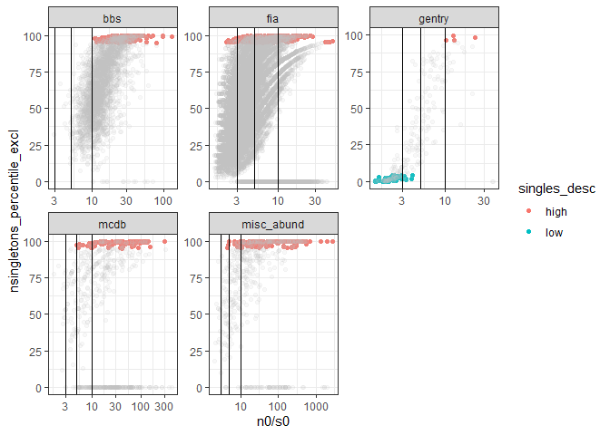

Shannon diversity
================
Renata Diaz
2021-02-23

<!-- --><!-- -->

<!-- -->

    ## `summarise()` has grouped output by 'dat'. You can override using the `.groups` argument.

<div class="kable-table">

| dat         | singletons | prop\_high\_singles | prop\_high\_singles\_ex | prop\_low\_singles | prop\_low\_singles\_ex | nsites |
| :---------- | :--------- | ------------------: | ----------------------: | -----------------: | ---------------------: | -----: |
| bbs         | FALSE      |           0.1244140 |               0.0796971 |          0.0000000 |              0.0046881 |   2773 |
| gentry      | FALSE      |           0.0446429 |               0.0178571 |          0.2991071 |              0.3169643 |    224 |
| mcdb        | FALSE      |           0.4710145 |               0.1630435 |          0.0000000 |              0.3695652 |    552 |
| misc\_abund | FALSE      |           0.5121457 |               0.3340081 |          0.0000000 |              0.1376518 |    494 |

</div>

``` r
ggplot(all_di, aes(n0/s0, nsingletons_percentile_excl, color = singles_desc)) +
  geom_point() +
  facet_wrap(vars(dat), scales = "free") +
  scale_x_log10() +
  geom_vline(xintercept = c(3, 5, 10))
```

<!-- -->

``` r
ggplot(all_di, aes(n0/s0, nsingletons_percentile_excl, color = singles_desc)) +
  geom_point(data = filter(all_di, singles_desc != "int")) +
  geom_point(alpha = .1, color = "grey") +
  facet_wrap(vars(dat), scales = "free") +
  scale_x_log10() +
  geom_vline(xintercept = c(3, 5, 10))
```

<!-- -->

``` r
all_di %>%
  filter(n0/s0 < 3) %>%
  group_by(dat, singletons) %>%
  summarize(prop_high_singles = mean(high_singles),
            prop_high_singles_ex = mean(high_singles_ex),
            prop_low_singles = mean(low_singles),
            prop_low_singles_ex = mean(low_singles_ex),
            nsites= dplyr::n()) %>%
  ungroup()
```

    ## `summarise()` has grouped output by 'dat'. You can override using the `.groups` argument.

<div class="kable-table">

| dat         | singletons | prop\_high\_singles | prop\_high\_singles\_ex | prop\_low\_singles | prop\_low\_singles\_ex | nsites |
| :---------- | :--------- | ------------------: | ----------------------: | -----------------: | ---------------------: | -----: |
| bbs         | FALSE      |                 0.0 |                       0 |          0.0000000 |              0.0000000 |      1 |
| gentry      | FALSE      |                 0.0 |                       0 |          0.7093023 |              0.7325581 |     86 |
| mcdb        | FALSE      |                 0.3 |                       0 |          0.0000000 |              0.0000000 |     10 |
| misc\_abund | FALSE      |                 0.0 |                       0 |          0.0000000 |              0.0000000 |     13 |

</div>

``` r
all_di %>%
  filter(n0/s0 > 10) %>%
  group_by(dat, singletons) %>%
  summarize(prop_high_singles = mean(high_singles),
            prop_high_singles_ex = mean(high_singles_ex),
            prop_low_singles = mean(low_singles),
            prop_low_singles_ex = mean(low_singles_ex),
            nsites= dplyr::n()) %>%
  ungroup()
```

    ## `summarise()` has grouped output by 'dat'. You can override using the `.groups` argument.

<div class="kable-table">

| dat         | singletons | prop\_high\_singles | prop\_high\_singles\_ex | prop\_low\_singles | prop\_low\_singles\_ex | nsites |
| :---------- | :--------- | ------------------: | ----------------------: | -----------------: | ---------------------: | -----: |
| bbs         | FALSE      |           0.1645873 |               0.1060461 |                  0 |              0.0062380 |   2084 |
| gentry      | FALSE      |           0.4285714 |               0.1904762 |                  0 |              0.0952381 |     21 |
| mcdb        | FALSE      |           0.5506849 |               0.2136986 |                  0 |              0.4438356 |    365 |
| misc\_abund | FALSE      |           0.6627566 |               0.4398827 |                  0 |              0.1847507 |    341 |

</div>

<!-- ```{r} -->

<!-- ggplot(filter(all_di, nsingletons >= nsingletons_95), aes(nsingletons_mean, nsingletons)) + -->

<!--   geom_point(alpha = .2) + -->

<!-- #  geom_line(aes(nsingletons_mean, nsingletons_mean)) + -->

<!--     geom_line(aes(nsingletons_95, nsingletons_95)) + -->

<!--   facet_wrap(vars(dat), scales = "free") -->

<!-- ggplot(filter(all_di, nsingletons >= nsingletons_95), aes(nsingletons, nsingletons-nsingletons_95)) + -->

<!--   geom_point(alpha = .2) + -->

<!-- #  geom_line(aes(nsingletons_mean, nsingletons_mean)) + -->

<!--   facet_wrap(vars(dat), scales = "free") -->

<!-- ``` -->
