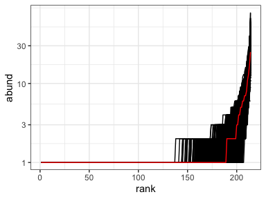
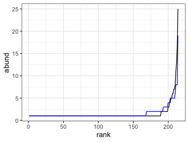
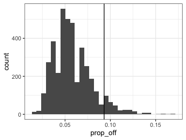

Comparing to lognormal, Poisson, exponential
================
Renata Diaz
2021-03-11

<!-- --><!-- --><!-- -->

| source   | dat    | site | singletons |  s0 |  n0 |  sim |     nparts |  real\_po |  real\_r2 | best\_po\_sim | sim\_pos\_from\_best | sim\_r2\_from\_best | sim\_r2\_from\_best\_median | ncomparisons | real\_po\_percentile | real\_po\_percentile\_excl | real\_r2\_percentile | real\_r2\_percentile\_excl |
| :------- | :----- | ---: | :--------- | --: | --: | ---: | ---------: | --------: | --------: | ------------: | -------------------: | ------------------: | --------------------------: | -----------: | -------------------: | -------------------------: | -------------------: | -------------------------: |
| observed | gentry |   82 | FALSE      | 214 | 333 | \-99 | 1653668665 | 0.0930931 | 0.6842921 |             6 |            0.0581497 |            0.879693 |                   0.9132567 |         3999 |             93.42336 |                   92.17304 |             5.051263 |                   5.051263 |

