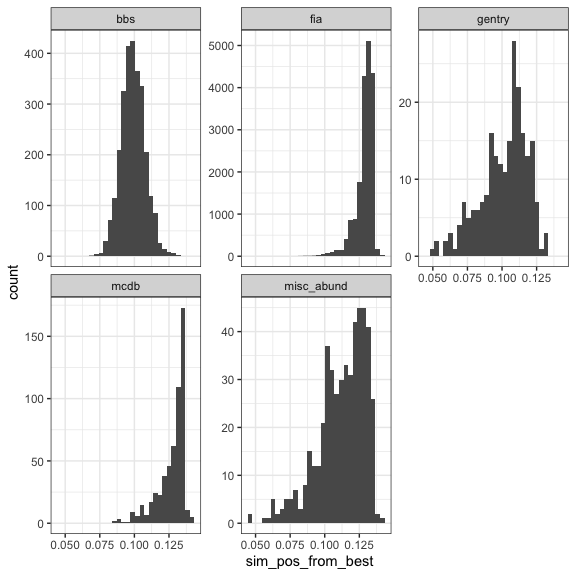
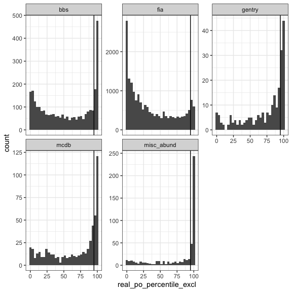
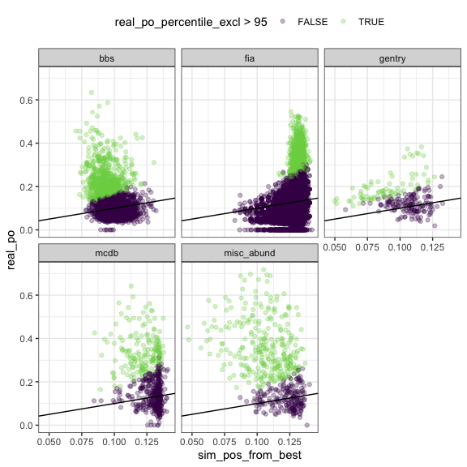
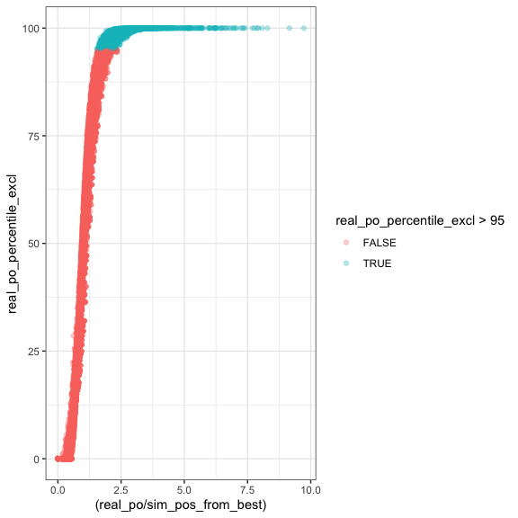
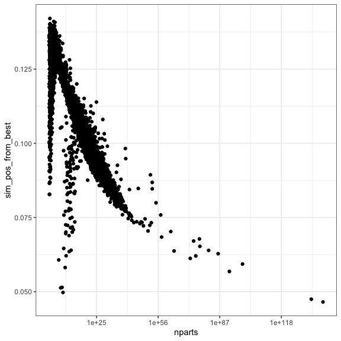
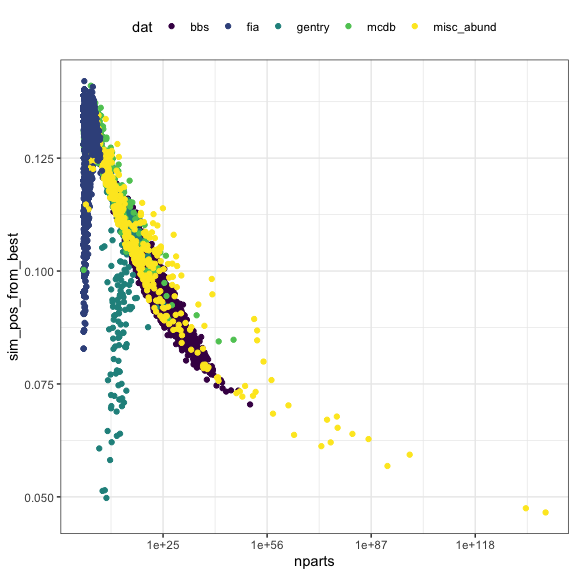
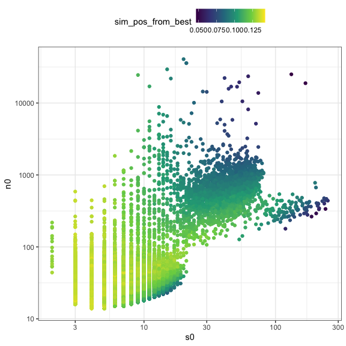

Central tendency
================
Renata Diaz
2021-03-11

<!-- --><!-- -->

<div class="kable-table">

| dat         | prop\_high\_po | nsites |
| :---------- | -------------: | -----: |
| bbs         |      0.2340426 |   2773 |
| fia         |      0.0715021 |  18447 |
| gentry      |      0.3392857 |    224 |
| mcdb        |      0.3152174 |    552 |
| misc\_abund |      0.5910931 |    494 |

</div>

<!-- --><!-- -->

<div class="kable-table">

| dev   |   minrat |   maxrat |   meanrat |      mindis |    maxdis |
| :---- | -------: | -------: | --------: | ----------: | --------: |
| FALSE | 0.000000 | 2.337662 | 0.8565217 | \-0.1420455 | 0.1788194 |
| TRUE  | 1.546426 | 9.727238 | 2.6458693 |   0.0466594 | 0.6125292 |

</div>

<!-- --><!-- --><!-- -->

<!-- ```{r} -->

<!-- ggplot(all_di, aes(sim_r2_from_best_median)) + -->

<!--   geom_histogram() -->

<!-- ggplot(all_di, aes(sim_r2_from_best_median, real_r2)) + -->

<!--   geom_point() + -->

<!--   geom_line(aes(sim_r2_from_best_median, sim_r2_from_best_median)) + -->

<!--   ylim(0,1) -->

<!-- ggplot(all_di, aes(real_po_percentile_excl)) + geom_histogram() -->

<!-- ggplot(all_di, aes(nparts, sim_r2_from_best_median)) + -->

<!--   geom_point() + -->

<!--   scale_x_log10() -->

<!-- ``` -->
