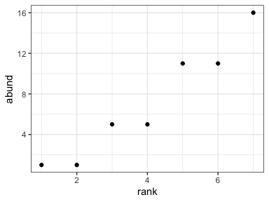
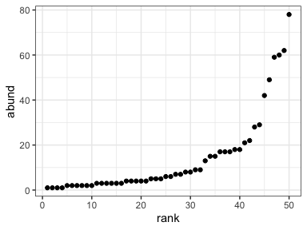
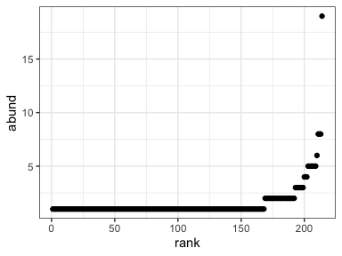

Comparing to lognormal, Poisson, exponential
================
Renata Diaz
2021-03-05

FIA 16059000010 - 7, 50. Small

BBS 4229 - 50, 709. High n

Gentry 82 - 214, 333. High n but low N/S

<!-- --><!-- --><!-- -->
