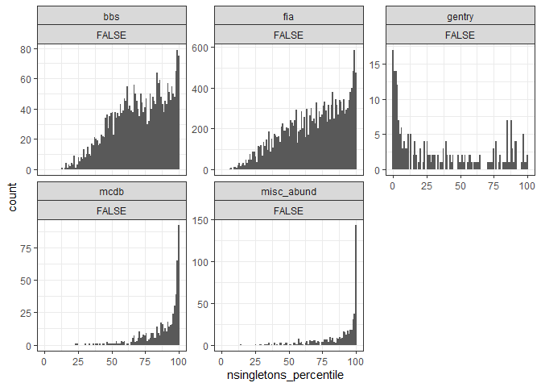
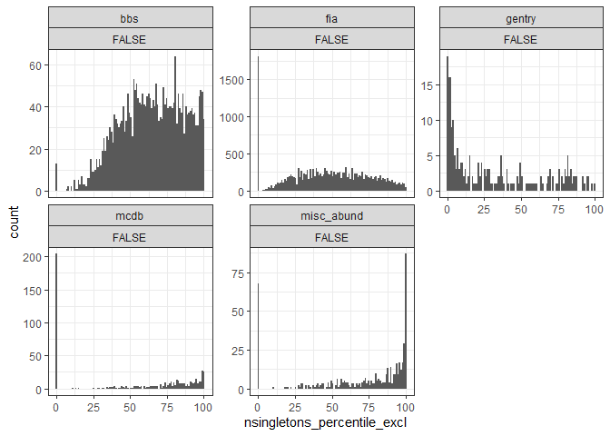

Shannon diversity
================
Renata Diaz
2021-02-14

    ## `stat_bin()` using `bins = 30`. Pick better value with `binwidth`.

    ## Warning: Removed 20 rows containing missing values (geom_bar).

<!-- --><!-- -->

    ## `summarise()` regrouping output by 'dat' (override with `.groups` argument)

<div class="kable-table">

| dat         | singletons | prop\_high\_singles | prop\_high\_singles\_ex | prop\_high\_singles\_mean | nsites |
| :---------- | :--------- | ------------------: | ----------------------: | ------------------------: | -----: |
| bbs         | FALSE      |           0.1244140 |               0.0796971 |                 0.7021277 |   2773 |
| bbs         | TRUE       |           0.3076091 |               0.2524342 |                 0.9184998 |   2773 |
| fia         | FALSE      |           0.1367263 |               0.0371178 |                 0.5916051 |  20179 |
| fia         | TRUE       |           0.2222608 |               0.0994598 |                 0.7683235 |  20179 |
| gentry      | FALSE      |           0.0446429 |               0.0178571 |                 0.2901786 |    224 |
| gentry      | TRUE       |           0.1071429 |               0.0580357 |                 0.3616071 |    224 |
| mcdb        | FALSE      |           0.4347181 |               0.1839763 |                 0.5756677 |    674 |
| mcdb        | TRUE       |           0.6735905 |               0.3783383 |                 0.8946588 |    674 |
| misc\_abund | FALSE      |           0.4823748 |               0.3191095 |                 0.7569573 |    539 |
| misc\_abund | TRUE       |           0.6660482 |               0.5473098 |                 0.8998145 |    539 |

</div>

<!-- ```{r} -->

<!-- ggplot(filter(all_di, nsingletons >= nsingletons_95), aes(nsingletons_mean, nsingletons)) + -->

<!--   geom_point(alpha = .2) + -->

<!-- #  geom_line(aes(nsingletons_mean, nsingletons_mean)) + -->

<!--     geom_line(aes(nsingletons_95, nsingletons_95)) + -->

<!--   facet_wrap(vars(dat), scales = "free") -->

<!-- ggplot(filter(all_di, nsingletons >= nsingletons_95), aes(nsingletons, nsingletons-nsingletons_95)) + -->

<!--   geom_point(alpha = .2) + -->

<!-- #  geom_line(aes(nsingletons_mean, nsingletons_mean)) + -->

<!--   facet_wrap(vars(dat), scales = "free") -->

<!-- ``` -->
