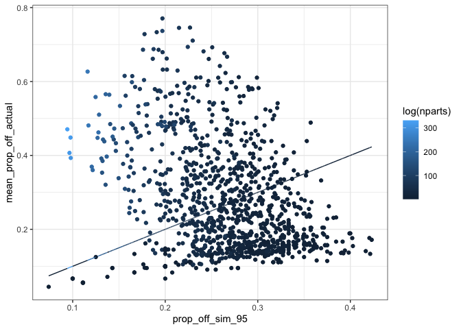
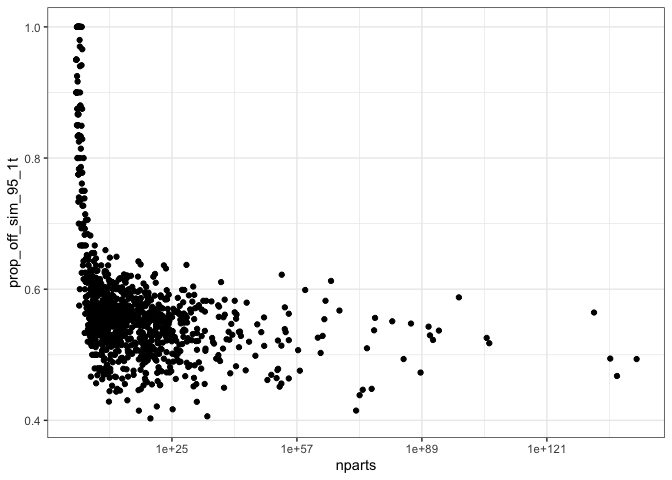
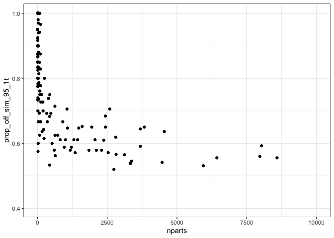
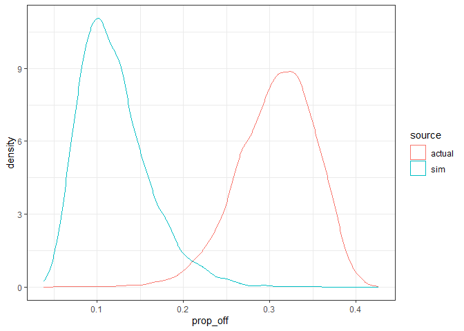
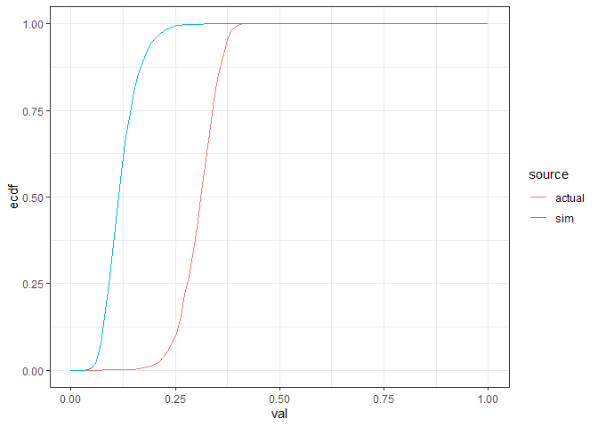
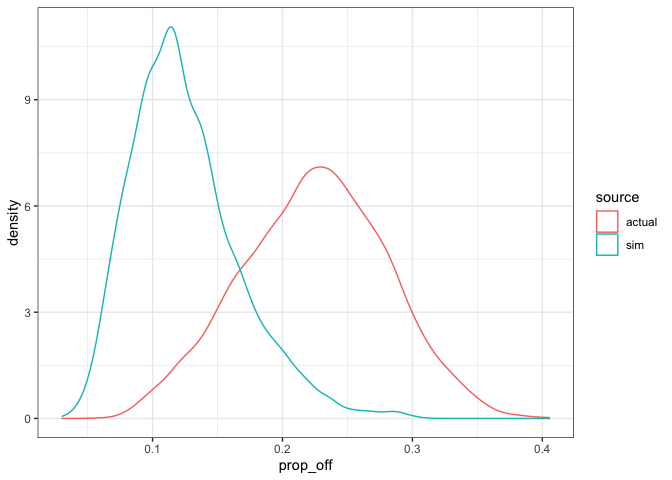
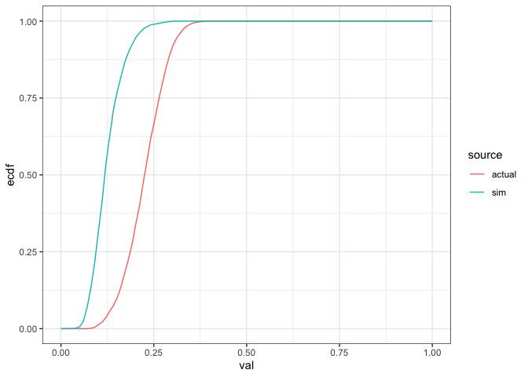
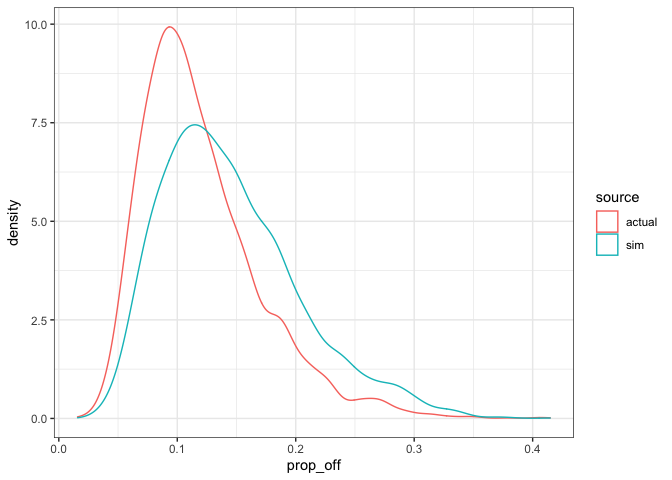
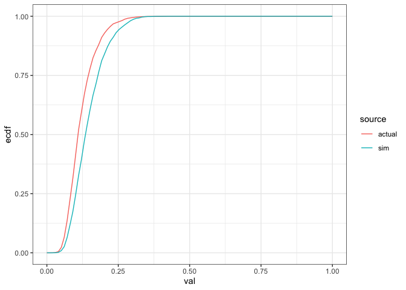

Prop off
================
Renata Diaz
2021-02-15

<!-- -->

    ## `summarise()` ungrouping output (override with `.groups` argument)

| singletons | prop\_off\_m | prop\_off\_f |
| :--------- | -----------: | -----------: |
| FALSE      |    0.3970315 |    0.2133581 |
| TRUE       |    0.4897959 |    0.2894249 |

    ## `summarise()` ungrouping output (override with `.groups` argument)

| singletons |      diff |
| :--------- | --------: |
| FALSE      | 0.2637178 |
| TRUE       | 0.2858799 |

    ## Warning: Removed 22 rows containing missing values (geom_point).

<!-- -->

    ## Scale for 'x' is already present. Adding another scale for 'x', which will
    ## replace the existing scale.

    ## Warning: Removed 918 rows containing missing values (geom_point).

<!-- -->

### One where both are significant

<!-- -->

| mean\_prop\_off\_actual | prop\_off\_actual\_5 | prop\_off\_sim\_95 | prop\_off\_sim\_95\_1t |
| ----------------------: | -------------------: | -----------------: | ---------------------: |
|               0.3074734 |            0.2292398 |          0.1953216 |              0.5214008 |

<!-- -->

    ## Warning in ks.test(po_10$actual, po_10$sim, alternative = "less"): p-value will
    ## be approximate in the presence of ties

    ## 
    ##  Two-sample Kolmogorov-Smirnov test
    ## 
    ## data:  po_10$actual and po_10$sim
    ## D^- = 0.9455, p-value < 2.2e-16
    ## alternative hypothesis: the CDF of x lies below that of y

    ## 
    ##  Welch Two Sample t-test
    ## 
    ## data:  po_10$actual and po_10$sim
    ## t = 197.67, df = 7916.6, p-value < 2.2e-16
    ## alternative hypothesis: true difference in means is not equal to 0
    ## 95 percent confidence interval:
    ##  0.1856000 0.1893181
    ## sample estimates:
    ## mean of x mean of y 
    ## 0.3074734 0.1200143

    ## 
    ## Call:
    ## glm(formula = prop_off ~ source, family = Gamma, data = po_long_10)
    ## 
    ## Deviance Residuals: 
    ##      Min        1Q    Median        3Q       Max  
    ## -1.16657  -0.16869  -0.00721   0.12102   1.25479  
    ## 
    ## Coefficients:
    ##             Estimate Std. Error t value Pr(>|t|)    
    ## (Intercept)  3.25231    0.01327   245.1   <2e-16 ***
    ## sourcesim    5.08002    0.03649   139.2   <2e-16 ***
    ## ---
    ## Signif. codes:  0 '***' 0.001 '**' 0.01 '*' 0.05 '.' 0.1 ' ' 1
    ## 
    ## (Dispersion parameter for Gamma family taken to be 0.06658961)
    ## 
    ##     Null deviance: 2230.52  on 7999  degrees of freedom
    ## Residual deviance:  522.06  on 7998  degrees of freedom
    ## AIC: -25957
    ## 
    ## Number of Fisher Scoring iterations: 5

    ##         1         2 
    ## 0.3074734 0.1200143

### One where mean is and 95 is not

<!-- -->

| mean\_prop\_off\_actual | prop\_off\_actual\_5 | prop\_off\_sim\_95 | prop\_off\_sim\_95\_1t |
| ----------------------: | -------------------: | -----------------: | ---------------------: |
|               0.2245848 |            0.1284271 |          0.2034632 |              0.6315789 |

<!-- -->

    ## Warning in ks.test(po_11$actual, po_11$sim, alternative = "less"): p-value will
    ## be approximate in the presence of ties

    ## 
    ##  Two-sample Kolmogorov-Smirnov test
    ## 
    ## data:  po_11$actual and po_11$sim
    ## D^- = 0.687, p-value < 2.2e-16
    ## alternative hypothesis: the CDF of x lies below that of y

    ## 
    ##  Welch Two Sample t-test
    ## 
    ## data:  po_11$actual and po_11$sim
    ## t = 90.53, df = 7428.5, p-value < 2.2e-16
    ## alternative hypothesis: true difference in means is not equal to 0
    ## 95 percent confidence interval:
    ##  0.09744432 0.10175770
    ## sample estimates:
    ## mean of x mean of y 
    ## 0.2245848 0.1249838

    ## 
    ## Call:
    ## glm(formula = prop_off ~ source, family = Gamma, data = po_long_11)
    ## 
    ## Deviance Residuals: 
    ##      Min        1Q    Median        3Q       Max  
    ## -1.14838  -0.21905  -0.01875   0.16809   1.04470  
    ## 
    ## Coefficients:
    ##             Estimate Std. Error t value Pr(>|t|)    
    ## (Intercept)  4.45266    0.02073  214.82   <2e-16 ***
    ## sourcesim    3.54838    0.04262   83.25   <2e-16 ***
    ## ---
    ## Signif. codes:  0 '***' 0.001 '**' 0.01 '*' 0.05 '.' 0.1 ' ' 1
    ## 
    ## (Dispersion parameter for Gamma family taken to be 0.08667513)
    ## 
    ##     Null deviance: 1384.85  on 7999  degrees of freedom
    ## Residual deviance:  707.51  on 7998  degrees of freedom
    ## AIC: -25869
    ## 
    ## Number of Fisher Scoring iterations: 5

    ##         1         2 
    ## 0.2245848 0.1249838

### One where neither is

<!-- -->

| mean\_prop\_off\_actual | prop\_off\_actual\_5 | prop\_off\_sim\_95 | prop\_off\_sim\_95\_1t |
| ----------------------: | -------------------: | -----------------: | ---------------------: |
|               0.1198696 |            0.0581242 |          0.2589168 |              0.5958904 |

<!-- -->

    ## Warning in ks.test(po_22$actual, po_22$sim, alternative = "less"): p-value will
    ## be approximate in the presence of ties

    ## 
    ##  Two-sample Kolmogorov-Smirnov test
    ## 
    ## data:  po_22$actual and po_22$sim
    ## D^- = 0.00025013, p-value = 0.9997
    ## alternative hypothesis: the CDF of x lies below that of y

    ## 
    ##  Welch Two Sample t-test
    ## 
    ## data:  po_22$actual and po_22$sim
    ## t = -20.488, df = 7829.7, p-value < 2.2e-16
    ## alternative hypothesis: true difference in means is not equal to 0
    ## 95 percent confidence interval:
    ##  -0.02728653 -0.02252107
    ## sample estimates:
    ## mean of x mean of y 
    ## 0.1198780 0.1447818

    ## 
    ## Call:
    ## glm(formula = prop_off ~ source, family = Gamma, data = po_long_22)
    ## 
    ## Deviance Residuals: 
    ##      Min        1Q    Median        3Q       Max  
    ## -1.52014  -0.33343  -0.08062   0.20844   1.54621  
    ## 
    ## Coefficients:
    ##             Estimate Std. Error t value Pr(>|t|)    
    ## (Intercept)  8.34182    0.05416  154.02   <2e-16 ***
    ## sourcesim   -1.43487    0.07032  -20.41   <2e-16 ***
    ## ---
    ## Signif. codes:  0 '***' 0.001 '**' 0.01 '*' 0.05 '.' 0.1 ' ' 1
    ## 
    ## (Dispersion parameter for Gamma family taken to be 0.1685284)
    ## 
    ##     Null deviance: 1362.3  on 7995  degrees of freedom
    ## Residual deviance: 1291.2  on 7994  degrees of freedom
    ## AIC: -25372
    ## 
    ## Number of Fisher Scoring iterations: 5

    ##         1         2 
    ## 0.1198780 0.1447818

The KS test finds even very small differences. Ditto t tests and Wilcox
and GLMs.

Is it valid to compare the **mean** of the actual to the **95%** of the
sims? I raise this because comparing the 5% to the 95% seems awfully
conservative. But I’m not sure.
