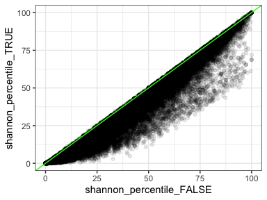
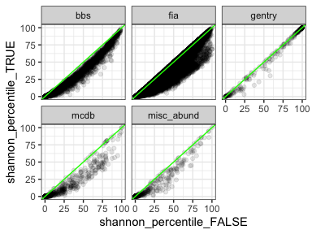
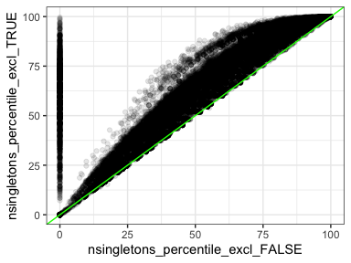
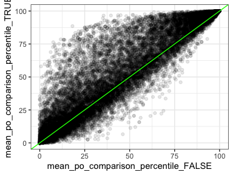
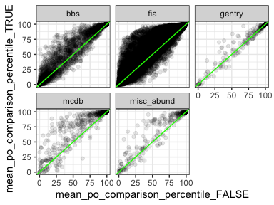

Effects of rarefaction
================
Renata Diaz
2021-02-24

It is often not possible to exhaustively sample all the species and
individuals present in a real system. Therefore empirical observations
of SADs may be missing species and individuals that are part of the true
distribution.

We explored whether our results change if we adjust for for the species
and individuals that might be missed via sampling. We used species
richness estimators to estimate the true number of species for a
community given the observed SAD, and re-ran our analytical pipeline on
SADs adjusted to match the estimated richness.

### Adjusting for rarefaction

For an observed SAD, we take the estimated species richness from the
bias-corrected Chao and ACE estimators (as implemented in
`vegan::estimateR`) as the estimated “true” number of species in the
community. To err on the side of overestimating the number of species
missed via sampling, we used the estimated mean + 1 standard deviation
as the estimate for each estimator. We take the mean of these two
estimates, rounded up to the next integer, as the estimated true
richness for that community. We adjusted the raw SAD to match this
estimated richness by adding the appropriate number of species with an
abundance of 1 individual each. We reason that species that are missed
during sampling are likely to be rare, so adding them as rare species is
appropriate. This also allows us to explore the effects of rarefaction
while making the smallest possible changes to S and N.

<!-- -->

The green points are the species we added to match the estimated species
richness for the raw SAD (purple points).

### Adjusted vs. raw results

<!-- --><!-- --><!-- --><!-- --><!-- --><!-- --><!-- --><!-- --><!-- --><!-- -->

| dat         | high\_skew\_raw | low\_even\_raw | low\_shannon\_raw | high\_singletons\_raw | low\_singletons\_raw | high\_po\_raw | high\_skew\_adjusted | low\_even\_adjusted | low\_shannon\_adjusted | high\_singletons\_adjusted | low\_singletons\_adjusted | high\_po\_adjusted |
| :---------- | --------------: | -------------: | ----------------: | --------------------: | -------------------: | ------------: | -------------------: | ------------------: | ---------------------: | -------------------------: | ------------------------: | -----------------: |
| bbs         |       0.1301839 |      0.2596466 |         0.2802019 |             0.0796971 |            0.0000000 |     0.2300757 |            0.1402813 |           0.3220339 |              0.3703570 |                  0.2513523 |                 0.0000000 |          0.2884962 |
| gentry      |       0.1883408 |      0.1524664 |         0.1300448 |             0.0179372 |            0.3004484 |     0.3139013 |            0.1883408 |           0.1883408 |              0.1793722 |                  0.0582960 |                 0.3004484 |          0.3587444 |
| mcdb        |       0.1574074 |      0.3518519 |         0.3814815 |             0.1629630 |            0.0000000 |     0.3259259 |            0.2518519 |           0.4981481 |              0.5407407 |                  0.4018519 |                 0.0000000 |          0.4907407 |
| misc\_abund |       0.3455285 |      0.5934959 |         0.6199187 |             0.3353659 |            0.0000000 |     0.5873984 |            0.4024390 |           0.6626016 |              0.6951220 |                  0.5853659 |                 0.0000000 |          0.6666667 |

<!-- -->

In all cases, adjusting for rarefaction increases the proportion of
extreme values. Most adjusted SADs have more extreme values than their
non-adjusted counterparts.

This makes sense given that we add species at low abundance (and are
more likely to fail to observe rare species). Adding rare species would
tend to increase skewness and decrease evenness.

If anything, missing species due to the limitations on empirical
sampling causes us to **underestimate** the extreme-ness of observed
SADs relative to their feasible sets.
