Updated results
================
Renata Diaz
2021-03-12

  - [Comparing observed to the
    baseline](#comparing-observed-to-the-baseline)
      - [Central tendency](#central-tendency)
      - [Shape metrics](#shape-metrics)
      - [For very small communities](#for-very-small-communities)
  - [Narrowness of the expectation](#narrowness-of-the-expectation)
      - [Central tendency](#central-tendency-2)
      - [Shape metrics](#shape-metrics-1)
  - [Resampling](#resampling)
      - [Undersampling of rare species](#undersampling-of-rare-species)
      - [Jackknife resampling](#jackknife-resampling)
      - [Narrowness](#narrowness)

## Comparing observed to the baseline

### Central tendency

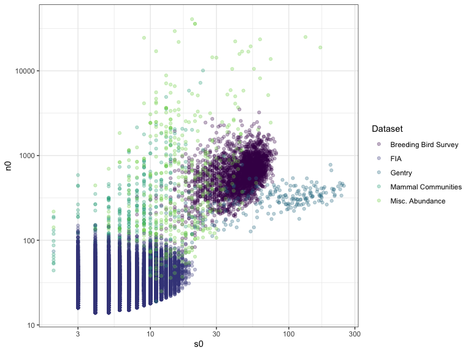<!-- -->

| dat         | prop\_high\_po | nsites |
| :---------- | -------------: | -----: |
| bbs         |      0.2340426 |   2773 |
| fia         |      0.0715021 |  18447 |
| gentry      |      0.3392857 |    224 |
| mcdb        |      0.3152174 |    552 |
| misc\_abund |      0.5910931 |    494 |

| in\_fia        | prop\_high\_po | nsites |
| :------------- | -------------: | -----: |
| FIA            |      0.0715021 |  18447 |
| Other datasets |      0.2945832 |   4043 |

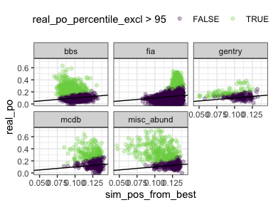<!-- -->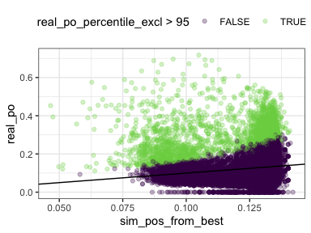<!-- -->

| real\_to\_mean\_sim\_po\_ratio\_min | real\_to\_mean\_sim\_po\_difference\_min | real\_to\_mean\_sim\_po\_ratio\_max | real\_to\_mean\_sim\_po\_difference\_max |
| ----------------------------------: | ---------------------------------------: | ----------------------------------: | ---------------------------------------: |
|                            1.546426 |                                0.0466594 |                            9.727238 |                                0.6125292 |

### Shape metrics

| dat         |     n |      nsng |      shan |      simp |      skew | dir  |
| :---------- | ----: | --------: | --------: | --------: | --------: | :--- |
| bbs         |  2773 | 0.0454382 | 0.0036062 | 0.0061305 | 0.0897944 | HIGH |
| fia         | 17410 | 0.0137852 | 0.0008616 | 0.0006318 | 0.0279150 | HIGH |
| gentry      |   223 | 0.0089686 | 0.2466368 | 0.2152466 | 0.1076233 | HIGH |
| mcdb        |   511 | 0.1252446 | 0.0039139 | 0.0058708 | 0.1213307 | HIGH |
| misc\_abund |   486 | 0.2736626 | 0.0020576 | 0.0020576 | 0.2716049 | HIGH |

| dat         |      nsng |      shan |      simp |      skew | dir |
| :---------- | --------: | --------: | --------: | --------: | :-- |
| bbs         | 0.0000000 | 0.2250270 | 0.2080779 | 0.0111792 | LOW |
| fia         | 0.0000000 | 0.0545663 | 0.0575531 | 0.0028145 | LOW |
| gentry      | 0.2017937 | 0.0762332 | 0.0986547 | 0.0852018 | LOW |
| mcdb        | 0.0000000 | 0.3033268 | 0.2778865 | 0.0078278 | LOW |
| misc\_abund | 0.0000000 | 0.5555556 | 0.5349794 | 0.0020576 | LOW |

| in\_fia |      nsng |      shan |      simp |      skew | dir  |
| :------ | --------: | --------: | --------: | --------: | :--- |
| FIA     | 0.0137852 | 0.0008616 | 0.0006318 | 0.0279150 | high |
| Other   | 0.0813924 | 0.0170298 | 0.0172802 | 0.1169547 | high |

| in\_fia |      nsng |      shan |      simp |      skew | dir |
| :------ | --------: | --------: | --------: | --------: | :-- |
| FIA     | 0.0000000 | 0.0545663 | 0.0575531 | 0.0028145 | LOW |
| Other   | 0.0112697 | 0.2669672 | 0.2506887 | 0.0137741 | LOW |

### For very small communities

#### Central tendency

| dat         | prop\_high\_po\_FALSE | prop\_high\_po\_TRUE | nsites\_FALSE | nsites\_TRUE |
| :---------- | --------------------: | -------------------: | ------------: | -----------: |
| bbs         |             0.1930014 |            0.0000000 |          2772 |            1 |
| fia         |             0.0743129 |            0.0283598 |          5894 |        12553 |
| gentry      |             0.2242152 |            0.0000000 |           223 |            1 |
| mcdb        |             0.3454039 |            0.0777202 |           359 |          193 |
| misc\_abund |             0.5526316 |            0.0789474 |           456 |           38 |

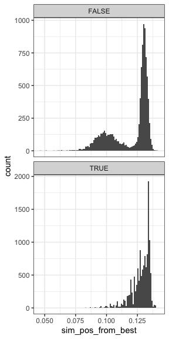<!-- -->
\#\#\#\# Shape metrics

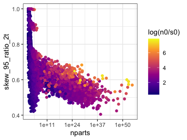<!-- -->

| dat         |     n | very\_small |      nsng |      shan |      simp |      skew | dir  |
| :---------- | ----: | :---------- | --------: | --------: | --------: | --------: | :--- |
| fia         |  5894 | FALSE       | 0.0167967 | 0.0006787 | 0.0005090 | 0.0597218 | HIGH |
| fia         | 11516 | TRUE        | 0.0122438 | 0.0009552 | 0.0006947 | 0.0116360 | HIGH |
| mcdb        |   359 | FALSE       | 0.1587744 | 0.0055710 | 0.0083565 | 0.1671309 | HIGH |
| mcdb        |   152 | TRUE        | 0.0460526 | 0.0000000 | 0.0000000 | 0.0131579 | HIGH |
| misc\_abund |   456 | FALSE       | 0.2872807 | 0.0021930 | 0.0021930 | 0.2850877 | HIGH |
| misc\_abund |    30 | TRUE        | 0.0666667 | 0.0000000 | 0.0000000 | 0.0666667 | HIGH |

| dat         |     n | very\_small | nsng |      shan |      simp |      skew | dir |
| :---------- | ----: | :---------- | ---: | --------: | --------: | --------: | :-- |
| fia         |  5894 | FALSE       |    0 | 0.0899220 | 0.0945029 | 0.0027146 | LOW |
| fia         | 11516 | TRUE        |    0 | 0.0364710 | 0.0386419 | 0.0028656 | LOW |
| mcdb        |   359 | FALSE       |    0 | 0.3816156 | 0.3454039 | 0.0055710 | LOW |
| mcdb        |   152 | TRUE        |    0 | 0.1184211 | 0.1184211 | 0.0131579 | LOW |
| misc\_abund |   456 | FALSE       |    0 | 0.5855263 | 0.5635965 | 0.0021930 | LOW |
| misc\_abund |    30 | TRUE        |    0 | 0.1000000 | 0.1000000 | 0.0000000 | LOW |

## Narrowness of the expectation

### Central tendency

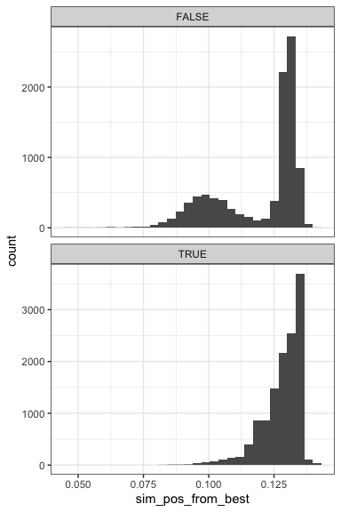<!-- -->

### Shape metrics

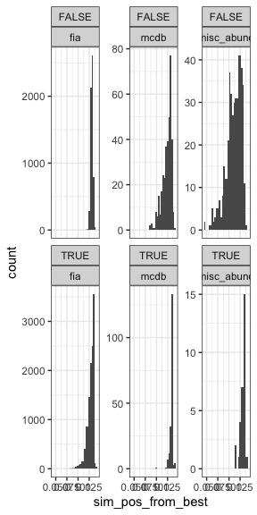<!-- -->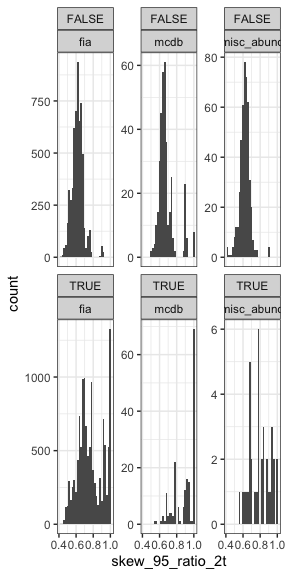<!-- -->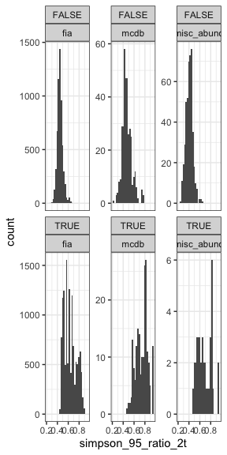<!-- -->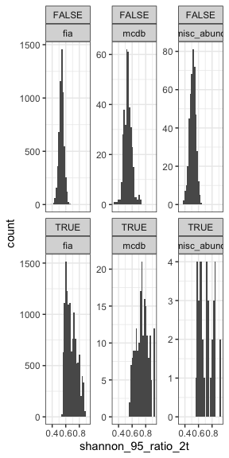<!-- -->

## Resampling

### Undersampling of rare species

#### Central tendency

| dat         | prop\_high\_po | nsites | prop\_high\_po\_real | nsites\_real |
| :---------- | -------------: | -----: | -------------------: | -----------: |
| bbs         |      0.2910206 |   2773 |            0.2340426 |         2773 |
| fia         |      0.1192606 |  18447 |            0.0715021 |        18447 |
| gentry      |      0.3258929 |    224 |            0.3392857 |          224 |
| mcdb        |      0.4909420 |    552 |            0.3152174 |          552 |
| misc\_abund |      0.6599190 |    494 |            0.5910931 |          494 |

#### Shape metrics

| dat         |     n |      nsng |      shan |      simp |      skew | dir  | adj   |
| :---------- | ----: | --------: | --------: | --------: | --------: | :--- | :---- |
| bbs         |  2773 | 0.0454382 | 0.0036062 | 0.0061305 | 0.0897944 | HIGH | FALSE |
| bbs         |  2773 | 0.1756221 | 0.0003606 | 0.0021637 | 0.0937613 | HIGH | TRUE  |
| fia         | 17410 | 0.0137852 | 0.0008616 | 0.0006318 | 0.0279150 | HIGH | FALSE |
| fia         | 17410 | 0.0553705 | 0.0002298 | 0.0001149 | 0.0570362 | HIGH | TRUE  |
| gentry      |   223 | 0.0089686 | 0.2466368 | 0.2152466 | 0.1076233 | HIGH | FALSE |
| gentry      |   223 | 0.0403587 | 0.2331839 | 0.2197309 | 0.1165919 | HIGH | TRUE  |
| mcdb        |   511 | 0.1252446 | 0.0039139 | 0.0058708 | 0.1213307 | HIGH | FALSE |
| mcdb        |   511 | 0.3502935 | 0.0019569 | 0.0019569 | 0.1996086 | HIGH | TRUE  |
| misc\_abund |   486 | 0.2736626 | 0.0020576 | 0.0020576 | 0.2716049 | HIGH | FALSE |
| misc\_abund |   486 | 0.5144033 | 0.0020576 | 0.0020576 | 0.3395062 | HIGH | TRUE  |

| dat         |     n |      nsng |      shan |      simp |      skew | dir | adj   |
| :---------- | ----: | --------: | --------: | --------: | --------: | :-- | :---- |
| bbs         |  2773 | 0.0000000 | 0.2250270 | 0.2080779 | 0.0111792 | LOW | FALSE |
| bbs         |  2773 | 0.0000000 | 0.3018392 | 0.2639740 | 0.0082943 | LOW | TRUE  |
| fia         | 17410 | 0.0000000 | 0.0545663 | 0.0575531 | 0.0028145 | LOW | FALSE |
| fia         | 17410 | 0.0000000 | 0.1097645 | 0.1058587 | 0.0010339 | LOW | TRUE  |
| gentry      |   223 | 0.2017937 | 0.0762332 | 0.0986547 | 0.0852018 | LOW | FALSE |
| gentry      |   223 | 0.1793722 | 0.1300448 | 0.1300448 | 0.0807175 | LOW | TRUE  |
| mcdb        |   511 | 0.0000000 | 0.3033268 | 0.2778865 | 0.0078278 | LOW | FALSE |
| mcdb        |   511 | 0.0000000 | 0.4872798 | 0.4422701 | 0.0039139 | LOW | TRUE  |
| misc\_abund |   486 | 0.0000000 | 0.5555556 | 0.5349794 | 0.0020576 | LOW | FALSE |
| misc\_abund |   486 | 0.0000000 | 0.6543210 | 0.6213992 | 0.0020576 | LOW | TRUE  |

### Jackknife resampling

#### Central tendency

| dat         | high\_dissimilarity\_actual | high\_dissimilarity\_jk |    n |
| :---------- | --------------------------: | ----------------------: | ---: |
| bbs         |                   0.2500000 |               0.1566667 |  300 |
| fia         |                   0.0828877 |               0.0354278 | 1496 |
| gentry      |                   0.3392857 |               0.1651786 |  224 |
| mcdb        |                   0.3516260 |                     NaN |  492 |
| misc\_abund |                   0.6096033 |                     NaN |  479 |

#### Shape metrics

| dat         | skew\_percentile\_excl | skew\_percentile\_excl\_actual | simpson\_percentile\_excl | simpson\_percentile\_excl\_actual | shannon\_percentile\_excl | shannon\_percentile\_excl\_actual | nsingletons\_percentile\_excl | nsingletons\_percentile\_excl\_actual | dir  |
| :---------- | ---------------------: | -----------------------------: | ------------------------: | --------------------------------: | ------------------------: | --------------------------------: | ----------------------------: | ------------------------------------: | :--- |
| bbs         |              0.0733333 |                      0.1100000 |                 0.0233333 |                         0.0200000 |                 0.0200000 |                         0.0100000 |                     0.0100000 |                             0.0466667 | HIGH |
| fia         |              0.0079646 |                      0.0442478 |                 0.0000000 |                         0.0000000 |                 0.0000000 |                         0.0000000 |                     0.0035398 |                             0.0176991 | HIGH |
| gentry      |              0.0582960 |                      0.1076233 |                 0.1614350 |                         0.2152466 |                 0.1793722 |                         0.2466368 |                     0.0000000 |                             0.0089686 | HIGH |
| mcdb        |              0.0948081 |                      0.1376975 |                 0.0022573 |                         0.0067720 |                 0.0022573 |                         0.0045147 |                     0.0383747 |                             0.1354402 | HIGH |
| misc\_abund |              0.2236287 |                      0.2784810 |                 0.0021097 |                         0.0021097 |                 0.0021097 |                         0.0021097 |                     0.1582278 |                             0.2805907 | HIGH |

| dat         | skew\_percentile | skew\_percentile\_actual | simpson\_percentile | simpson\_percentile\_actual | shannon\_percentile | shannon\_percentile\_actual | nsingletons\_percentile | nsingletons\_percentile\_actual | dir |
| :---------- | ---------------: | -----------------------: | ------------------: | --------------------------: | ------------------: | --------------------------: | ----------------------: | ------------------------------: | :-- |
| bbs         |         0.010000 |                0.0166667 |           0.1300000 |                   0.2400000 |           0.1500000 |                   0.2533333 |               0.0000000 |                       0.0000000 | LOW |
| fia         |         0.000000 |                0.0017699 |           0.0362832 |                   0.0840708 |           0.0345133 |                   0.0752212 |               0.0000000 |                       0.0000000 | LOW |
| gentry      |         0.044843 |                0.0852018 |           0.0582960 |                   0.0986547 |           0.0538117 |                   0.0762332 |               0.1076233 |                       0.2017937 | LOW |
| mcdb        |         0.000000 |                0.0090293 |           0.2167043 |                   0.3002257 |           0.2347630 |                   0.3295711 |               0.0000000 |                       0.0000000 | LOW |
| misc\_abund |         0.000000 |                0.0021097 |           0.4303797 |                   0.5485232 |           0.4810127 |                   0.5696203 |               0.0000000 |                       0.0000000 | LOW |

### Narrowness

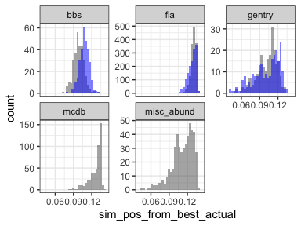<!-- -->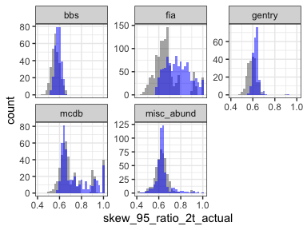<!-- -->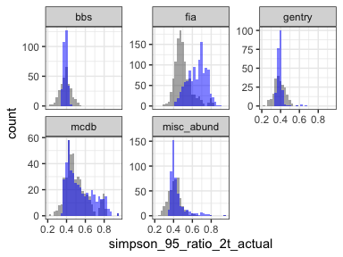<!-- -->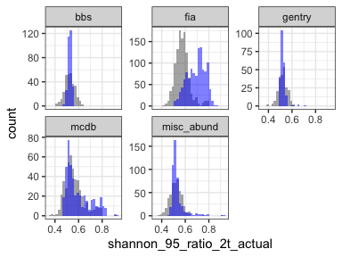<!-- -->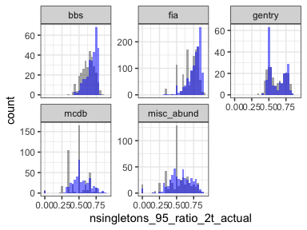<!-- -->
